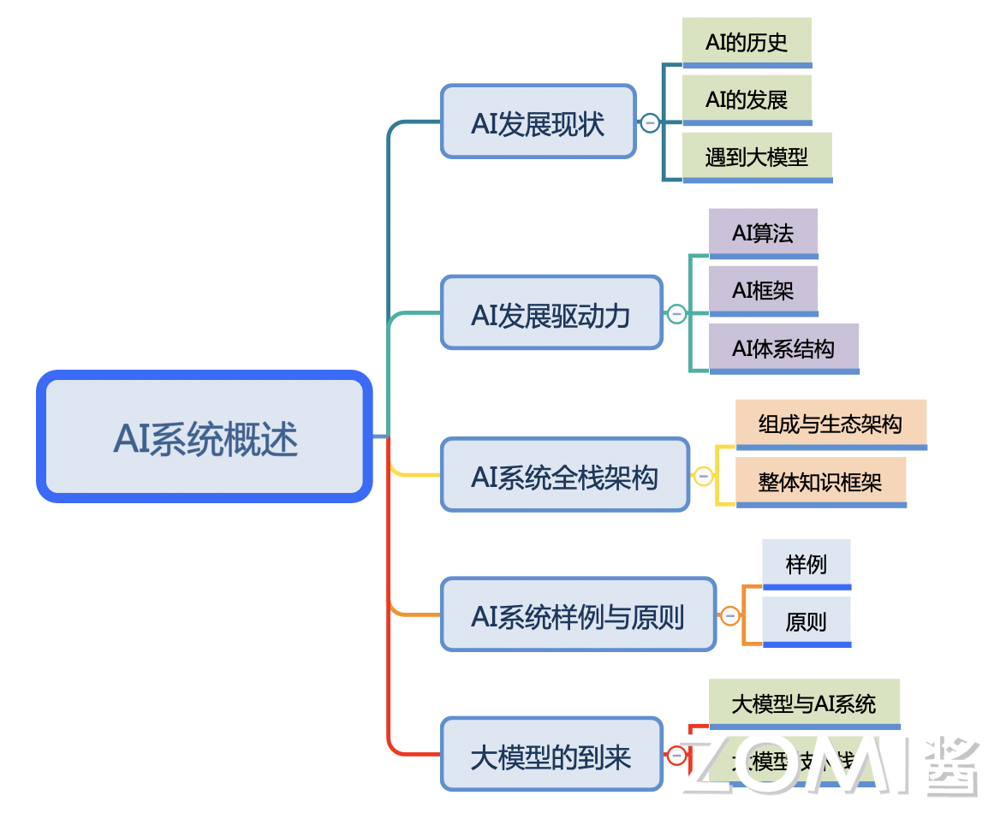

<!--Copyright © ZOMI 适用于[License](https://github.com/chenzomi12/AISystemtem)版权许可-->

# 本节内容(DONE)

### 本节介绍

通过以下内容展开介绍，以让开发者在开篇了解 AI 系统的来龙去脉，形成 AI 系统的系统化与层次化的初步理解，为后续展开具体的 AI 系统内容打好初步基础。

**《AI 历史与发展》**：通过人工智能去了解深度学习的历史，现状与发展，特别是大模型的出现对人工智能的冲击。

- **《AI 发展驱动力》**：介绍深度学习发展的驱动力：即算法、框架与体系结构与算力的发展，了解除了上层应用与算法，系统底层抽象与管理的硬件资源同样是 AI 系统中重要的组成因素。

- **《AI 系统全栈架构》**：系统常常处于中间层对上管理任务，对下抽象与管理硬件。AI 系统也不例外，通过对 AI 系统全栈的组成与生态架构展示，让开发者形成系统的（Systematic）知识框架，为未来开展 AI 系统的学习奠定基础。

- **《AI 系统原则与样例》**：回顾经典的计算机系统设计理论并指导之后的 AI 系统的学习，了解影响 AI 系统设计的理论，原则与假设。通过简单实例启发开发者，去了解算法背后的 AI 系统性问题，体会 AI 系统给上层算法和底层硬件带来的作用。

### 课程脑图

## 备注

文字课程开源在 [AISys](https://chenzomi12.github.io/)，系列视频托管[B 站](https://space.bilibili.com/517221395)和[油管](https://www.youtube.com/@ZOMI666/videos)，PPT 开源在[github](https://github.com/chenzomi12/AISystem)，欢迎取用！！！

> 非常希望您也参与到这个开源项目中，B 站给 ZOMI 留言哦！
> 
> 欢迎大家使用的过程中发现 bug 或者勘误直接提交代码 PR 到开源社区哦！
>
> 欢迎大家使用的过程中发现 bug 或者勘误直接提交 PR 到开源社区哦！
>
> 请大家尊重开源和 ZOMI 的努力，引用 PPT 的内容请规范转载标明出处哦！
