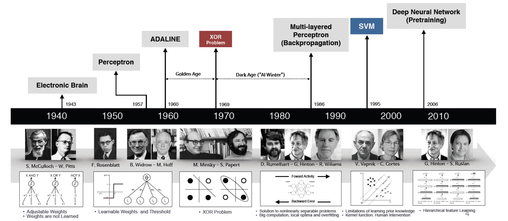

<!--Copyright © ZOMI 适用于[License](https://github.com/chenzomi12/DeepLearningSystem)版权许可-->

# AI 的历史，现状与发展

本章将介绍 AI 的由来、现状和趋势，让大家能够了解 AI 应用的由来与趋势，为后面理解 AI 系统的设计形成初步的基础。在后面章节介绍的人工智能系统（AI System）奠定基础，值得注意的是，这些系统设计原则大部分也适合于机器学习系统（ML System）。

因为系统本身是随着上层应用的发展而不断演化的，从人工智能本身的发展脉络和趋势可以观察到：目前模型不断由小模型到大模型分布式训练演进，由单一的模型训练方式演化出针对特定应用的深度强化学习的训练方式，企业级人工智能模型生产由独占使用硬件资源到云上多租户共享 AI 集群资源进行模型训练。

看 AI 算法模型结构本身的发展，训练与部署需求使得模型结构快速演变；执行与部署流程上，资源管理变得越来越复杂，给 AI 系统的设计和开发带来越来越大的挑战的同时，也充满了新的系统设计，研究与工程实践的机遇。

希望在后面的章节中，不仅能给读者带来较为系统化的 AI 知识，也希望能激发开发者对 AI 系统研究的兴趣，掌握相应的 AI 系统研究方法与设计原则，深入地去了解 AI 系统发展的趋势与脉络。

## AI 的基本概念

人工智能起源于上世纪五十年代，经历了几次繁荣与低谷，直到2016年谷歌旗下的 DeepMind 发布 AlphaGo 程序赢得与世界围棋冠军的比赛，大众对人工智能的关注与热情被重新点燃。

其实人工智能技术早在这个标志事件之前已经在工业界很多互联网公司中得到了广泛应用与部署。例如，搜索引擎服务中的排序、图片的检索、广告推荐等功能，背后都有人工智能模型的支撑。

在媒体中经常看到词汇：人工智能、机器学习、深度学习和神经网络。那么他们之间的关系是什么？

可以认为机器学习是实现人工智能的一种方法，而深度学习是一种实现机器学习的技术。由于目前深度学习技术取得了突破性进展，是人工智能 AI 中最为前沿和重要的技术，并不断在广泛的应用场景内取代传统机器学习模型（如语音识别，推荐系统等）。而神经网络是深度学习的具体实现形态，使用神经网络模型来表示深度学习。

同时，由于 AI 系统自身设计挑战较高（如更大的规模、更大的超参数搜索空间、更复杂的模型结构设计），硬件厂商围绕其设计了大量的专有 AI 芯片（如GPU、TPU、NPU 等）来加速 AI 算法的训练微调和部署推理，所以在之后的内容中主要介绍的**人工智能系统（AI System）**，实际上是围绕深度学习而衍生和设计的系统，因此也叫做**深度学习系统（Deep Learning System）**。

但是 AI 系统很多也可以应用于机器学习算法或使用机器学习算法，例如，自动化机器学习，集群管理系统等。同时这些系统设计方法具有一定的通用性，有些继承自机器学习系统或者可以借鉴用于机器学习系统。

## AI 的广泛应用

随着人工智能技术的发展与推广，人工智能逐渐在互联网、制造业、医疗、金融等不同领域有大范围的应用。

实际上，人工智能并不是一个独立的技术，而是结合各个行业的多样性与大规模的数据储备，通过**数据驱动（Data-Driven）**的方式应用到各个具体应用和对应的任务（如人脸识别，物体检测等）中的一系列技术。

上面提到的**数据驱动**的方式，意味着人工智能本身严重依赖于数据，所以最早取得人工智能技术大范围落地和应用的公司，本身储备了大量且多样的应用场景中的数据。以下面为例的行业中已经有越来越多的任务使用人工智能技术提升效果：

- 互联网 
  
  谷歌、百度、微软必应（Bing）等公司通过人工智能技术进行更好的文本向量化，提升检索质量，同时人工智能进行点击率预测，获取更高的利润。

- 医疗 
  
  IBM 沃森（Watson）从海量的医学文献和病历中提取医生临床诊断经验，通过让人工智能模型学习掌握临床诊断方法，辅助医生进行诊断。

- 金融
  
  通过反欺诈，关联分析，时序预测等算法可以较早识别风险，并预测未来发展趋势。

- 自动驾驶
  
  通过物体检测模型能够进行更好的路标检测，道路线检测进而增强自动驾驶方案。

- 游戏
  
  在游戏中可以通过强化学习技术进行对战，设计新的策略，提升游戏体验。

综上所述，可以看到也是这些有应用与部署人工智能技术的公司都会在人工智能基础设施和系统上投入和研发，进而通过提升人工智能模型生产效率，更快的获取效果更好的模型进而获取领先优势，然后再通过业务场景反哺，获取更多的数据和加大研发投入，驱动人工智能系统与工具链的创新与发展。

人工智能的代表性框架 PyTorch 是 Facebook 开发，后续贡献给 Linux 开源基金会；TensorFlow 是谷歌（Google）从2016年开源，华为（HUAWEI）为了避免美国全面封锁 AI 领域推出自研的 AI 框架 MindSpore。

微软（Microsoft）、亚马逊（Amazon）、特斯拉（Tesla）等公司早已部署数以万计的 GPU 用于 AI 模型的训练，OpenAI 等公司不断挑战更大规模的分布式模型训练。

英伟达（NVIDIA）、华为（HUAWEI）、英特尔（Intel）、谷歌（Google）等公司不断根据 AI 模型特点设计新的 AI 加速器芯片和对应的AI加速模块，如张量核 Tensor Core、脉动阵列等提供更大算力的 AI 加速器。

## AI 学习方法

在展开 AI 系统设计之前，需要首先了解 AI 的原理与特点。将以下面图中的实例介绍 AI 是如何工作的。假定读者有一定机器学习经验，其中的一些概念暂不在本章过多解释，会在第 2 章中介绍机器学习，神经网络与 AI 的原理，让读者对整体的执行流程有更加深入的理解。

图 1.1.1  AI 方法 

如图 1.1.1 所示，将深度神经网络的开发与工作模式抽象为以下几个步骤：

（1）确定 AI 模型的输入特征（Feature）与输出标签（Label）数据样本（Sample）：图中所示，本问题给 AI 模型输入图片（例如，图片中有狗，猫等），输出是图片的类别（是猫，是狗？）。用户需要提前准备好模型的输入输出数据，进而展开后续的模型训练。

（2）设计与开发模型结构：开发者通过编程框架开发了图中的模型结构，绿色线代表权重与白色圆代表的输入数据发生乘法操作。其中的$w_n$代表权重，也就是可以被学习和不断更新的数值。

（3）训练（Training）过程：训练过程是计算机根据一定的优化算法（例如，梯度下降（Gradient Descent）算法）搜索出给定数据集下，预测效果最好的指定 AI 模型中对应模型权重。如图中上半部分所示，训练过程就是根据用户给定的带有标签(例如，图中的 Cat，Dog 等输出标签)的数据集，不断通过梯度下降算法，以下面的步骤学习出给定数据集下最优的模型权重$w_n$的取值。

（3.1）前向传播（Forward Propagation）：由输入到输出完成整个模型中各个层的矩阵计算（例如，卷积层，池化层等），产生输出并完成损失函数计算。

（3.2）反向传播（Back Propagation）：由输出到输入反向完成整个模型中各个层的权重和输出对损失函数的梯度求解。

（3.3）梯度更新（Weight Update）：对模型权重通过梯度下降法完成模型权重针对梯度和指定学习率更新。

不断重复以上步骤（3.1）~（3.2），直到达到模型收敛或达到终止条件（例如，指定的迭代次数）。

当完成了模型训练，意味着在给定的数据集上，模型已经达到最佳或者满足需求的预测效果。如果开发者对模型预测效果满意，就可以进入模型部署进行推理和使用模型。

（4）推理（Inference）过程：推理（Inference）只需要执行训练过程中的前向传播过程即可。

（4.1）前向传播：如图中下半部分所示，由输入到输出完成整个模型中各个层的矩阵计算（例如，卷积层，池化层等），产生输出。例如本例中输入是狗的图片，输出的结果为向量，向量中的各个维度编码了图像的类别可能性，其中够的类别概率最大，判定为狗，后续应用可以根据输出类别信息再通过程序转换为人可读的信息。

后面章节将要介绍的 AI 系统，就是围绕以上负载的全生命周期的开发与执行各个环节，提供给算法工程师良好的模型设计和开发体验，极致的执行性能，保证安全性，以及应对更大规模的数据，更大的模型结构，更大的超参数搜索空间，多租的执行环境，同时利用新的加速器硬件特性，开掘硬件的极致算力。

## 1.1.3 神经网络基本理论的奠定

图 1.1.2 神经网络的基本理论与发展 (图片引用自互联网)

虽然 AI 在今年取得了举世瞩目的进展与突破，但是其当前基于的核心理论神经网络等，在这波浪潮开始前已经基本奠定，并经历了多次的起起伏伏。神经网络作为 AI 的前身，经历了以下的发展阶段：

1943 年，神经科学家和控制论专家 Warren McCulloch 和逻辑学家 Walter Pitts 基于数学和阈值逻辑算法创造了一种神经网络计算模型。并发表文章 "A Logical Calculus of the ideas Imminent in Nervous Activity"[[3]](#McCullochetal)。

1957 年，Frank Rosenblat 发明感知机（Perceptron）[[4]](#perceptron)。奠定了之后 AI 的基本结构，其计算以矩阵乘加运算为主，进而影响了后续人工智能芯片和系统的基本算子类型，例如：英伟达的新款GPU就有为矩阵计算设计的专用张量核（Tensor Core）。

1960 年，Bernard Widrow[[5]](#adaline) 和 Hoff 发明了 Adaline/Madaline，首次尝试把线性层叠加整合为多层感知器网络。感知器本质上是一种线性模型，可以对输入的训练集数据进行二分类，且能够在训练集中自动更新权值。感知器的提出吸引了大量科学家对人工神经网络研究的兴趣，对神经网络的发展具有里程碑式的意义。为之后的多层 AI 的网络结构奠定了基础，进而后期不断衍生更深层的模型，产生大模型和模型并行等系统问题。

1969 年，Marvin Minsky 和 Seymour Papert 共同编写了一本书籍“Perceptrons: an introduction to computational geometry”[[6]](#perceptronbook)，在书中他们证明了单层感知器无法解决线性不可分问题（例如：异或问题）。发现了当时的神经网络的两个重大缺陷：（1）基本感知机无法处理异或回路。（2）当时计算机的计算能力不足以用来处理复杂神经网络。神经网络的研究就此停滞不前。这也为后来 AI 的两大驱动力，提升硬件算力和模型通过更多的层和非线性计算（激活函数和最大池化等）增加非线性能力的演进埋下了伏笔。

1974 年，Paul Werbos 在博士论文“Beyond regression : new tools for prediction and analysis in the behavioral sciences”[[7]](#paul)中提出了用误差反向传播来训练人工神经网络，使得训练多层神经网络成为可能，有效解决了异或回路问题。这个工作奠定了之后 AI 的训练方式， AI 训练系统中最为重要的执行步骤就是在不断的进行反向传播训练。同时 AI 的编程语言和框架为了支持反向传播训练，默认都提供自动微分（Automatic Differentiation）的功能。

1986 年， AI （Deep Learning）一词由 Rina Dechter 于 1986 年 AAAI 论文“LEARNING WHILE SEARCHING IN CONSTRAINT-SATISFACTION-PROBLEMS”[[8]](#rina)引入机器学习社区。目前常常所说的人工智能系统主要以 AI 系统为代表性系统。

1989 年，Yann LeCun 在论文“Backpropagation Applied to Handwritten Zip Code Recognition”[[9]](#lenet)提出了一种用反向传导进行更新的卷积神经网络，称为 LeNet 。启发了后续卷积神经网络的研究与发展。卷积神经网络为 AI 系统的重要负载，大多数的 AI 系统都需要在卷积神经网络上验证性能，在未来会看到很多 AI 系统的基准测试中也会引入大量的卷积神经网络。

20 世纪 90 年代中期统计学习登场，支持向量机开始成为主流，进入第二个低谷。

2006 年，Geoff Hinton、Ruslan Salakhutdinov、Osindero 的论文“Reducing the Dimensionality of Data with Neural Networks”[[10]](#hinton)表明，多层前馈神经网络可以一次有效地预训练一层，依次将每一层视为无监督受限的玻尔兹曼（Boltzmann）机，然后使用监督反向传播对其进行微调，其论文主要研究深度信念网络（Deep Belief Nets）的学习。

2009 年，李飞飞教授团队在佛罗里达州举行的 2009 年计算机视觉和模式识别 (CVPR) 会议上首次以海报的形式展示了他们的 [ImageNet](https://en.wikipedia.org/wiki/ImageNet)[[11]](#imagenet)数据库，之后大量计算机视觉领域的经典模型在此数据库上进行验证，评测并演进。李飞飞于 2006 年产生想法并开始研究 [ImageNet](https://en.wikipedia.org/wiki/ImageNet)[[11]](#imagenet) 。2007年，李飞飞与 WordNet 的创始人之一普林斯顿大学教授克里斯蒂安·费尔鲍姆会面，之后从 WordNet 的单词数据库开始构建 ImageNet，并使用了它的许多功能。作为普林斯顿大学的助理教授，李博士组建了一个研究团队，致力于 ImageNet 项目，其通过众包平台 [Amazon Mechanical Turk](https://www.mturk.com/) 的工作人员来进行标记。

2011 年 8 月，2011 年 8 月，微软研究院 Frank Seide, Gang Li, Dong Yu 在 Interspeech 的一篇论文[[12]](#dongetal)首次介绍了“如何通过深度神经网络模型在会话语音转录（Conversational Speech Transcription）上实现突破性进展。”这项技术在次年初的微软 TechFest 上进行了展示。在 2012 年 10 月，微软首席研究官 Rick Rashid 博士在天津举办的 “21 世纪的计算-自然而然” 会议上进一步展示了基于此技术在实时语音机器翻译的最新进展。现场的演示效果相比论文更让人身临其境和震撼，让即使是非从业人员也能感受到 AI 的潜力，并进一步带动研究与工程团队开启和展开更多的 AI 在不同应用领域的探索与实践。论文 “[Conversational Speech Transcription Using Context-Dependent Deep Neural Networks](https://dl.acm.org/doi/10.5555/3042573.3042574)” [[3]](#dongetal)介绍了模型的的设计和实验结果，“其在单通道非特定人识别（Single-pass Speaker-independent Recognition）基准测试上将相对错误率由 27.4% 降低到 18.5% ，相对错误率降低 33%，在其他 4 类任务中相对错误率降低 22–28%。此深度神经网络的训练任务是通过分布式系统（其设计了适合当前作业的张量切片与放置以及通信协调策略以加速训练）部署在多台配置有 NVIDIA Tesla GPGPU 的服务器，通过几百小时的分布式训练才得以完成。论文在最后致谢中提到 “Our special thanks go to Ajith Jayamohan and Igor Kouzminykh of the MSR Extreme Computing Group for access to a Tesla server farm, without which this work would not have been possible.”，由此看到在 AI 领域算法团队与系统团队协作已经由来已久，算法与系统的协同设计将以往不可能完成的计算任务变为了可能，上层负载需求驱动系统发展与演化，系统支撑上层负载取得新的突破。”

2012 年 1 月，Google 的神经网络从 1000 万张 YouTube 视频的静止画面中学会了[识别猫](https://www.nytimes.com/2012/06/26/technology/in-a-big-network-of-computers-evidence-of-machine-learning.html)。Google 的科学家通过连接 16,000 个计算机处理器创建了最大的机器学习神经网络之一，他们在互联网上将这些处理器松散开来自行学习，正是大规模系统互联更大的算力支撑了当时相比以往更大的数据和模型的训练。此工作 “[Building high-level features using large scale unsupervised learning](https://dl.acm.org/doi/10.5555/3042573.3042641)” [[13]](#Quocetal) 发表在 ICML '12 会议上。

2012 年 9 月，Alex Krizhevsky，Ilya Sutskever 和 Geoffrey Hinton，团队通过设计 [AlexNet](https://papers.nips.cc/paper/2012/hash/c399862d3b9d6b76c8436e924a68c45b-Abstract.html)[[14]](#alexnet) 赢得 ImageNet 竞赛，深度神经网络开始再次流行。首次采用 ReLU 激活函数，扩展了 LeNet5 结构，添加 Dropout 层减小过拟合，LRN 层增强泛化能力/减小过拟合。这些新的模型结构和训练方法影响着后续的模型设计和系统优化，例如：激活函数和卷积层的内核融合计算等。其花费 5 到 6 天，采用 2 块 NVIDIA GTX 580 3GB GPUs 对计算进行加速，进而形成 AI 系统以 GPU 等加速器为主要计算单元的架构。

而截至到 2012 年这个时间点，基础架构的线索中，以英伟达（NVIDIA）为代表的芯片厂商已经连续发布了 Tesla，Fermi，[Kepler](https://en.wikipedia.org/wiki/Kepler_(microarchitecture)) 架构系列商用 GPU 和多款消费级 GPU，这些 GPU 已经开始被研究工作引用加速 AI 算法与模型的研究，被业界公司用于人工智能产品。但同时从 AlexNet 工作中看到，作者目前还基于 CUDA API 进行编程实现了[cuda-convnet](https://code.google.com/archive/p/cuda-convnet)， AI 系统与工具伴随着 AI 算法与模型的突破与需求呼之欲出，在后面的章节中将会总结和展望 AI 系统本身的脉络，现状与发展。

在之后的时间里，以 [ImageNet](https://www.image-net.org/)，等公开的各领域（例如，计算机视觉，自然语言处理）数据集为代表的各个应用领域的公开数据集或基准测试，驱动着以卷积神经网络，循环神经网络，变换器（Transformer），图神经网络为代表的 AI 模型网络结构的发展和创新。基准测试的好处是研究者从繁杂的应用问题建模和数据预处理工作跳出，能够在给定数据集上尽可能排除其他因素干扰，更为公平对比已有工作，并研发创新模型结构。在当前的社区工作中可以观察到， AI 模型网络结构越来越深，新结构层出不穷，同时不断驱动 AI 系统的演化，在接下来的小节将介绍模型结构的现状和趋势。模型作为上层应用负载，是驱动系统演化的驱动力之一。关注模型结构和 AI 的应用场景变化，能够让系统研究者和工程师把握系统发展的趋势，并设计出符合潮流和应对未来变化的系统。

## 1.1.4  AI 算法，模型的现状和趋势

目前 AI 模型有很多种类并在每年不断推出新的模型，如图 1.1.3 所示，以影响系统设计的视角将其简要归为以下一些代表性的类型。这些代表性的网络结构也是未来人工智能系统进行评测和验证所广泛使用的基准。同时一些新的结构的涌现，也不断推进一些新的系统设计。

图 1.1.3  AI 算法，模型的演化与趋势

基本模型结构类型：

- 卷积神经网络（Convolutional Neural Network）
  - 以卷积层（Convolution Layer），池化层（Pooling Layer），全连接层（Fully Connected Layer）等算子（Operator）的组合形成的并在计算机视觉领域取得明显效果和广泛应用的模型结构。
- 循环神经网络（Recurrent Neural Network）
  - 以循环神经网络，长短时记忆（LSTM）等基本单元组合形成的适合时序数据预测（例如，自然语言处理，语音识别，监控时序数据等）的模型结构。
- 混合结构
  - 组合之前卷积神经网络和循环神经网络，进而解决如光学字符识别（OCR）等复杂应用场景的预测任务。

基础模型的典型算子已经被框架和底层硬件做了较多优化，但是 AI 模型已经不单纯只在算子层面产生变化，其从网络结构，搜索空间等方向演化出如下的新的趋势：

- 更大的模型
  - 以变换器（Transformer）为基本结构的代表性预训练神经语言模型（Neural Language Model），例如，BERT，GPT-3 等，在自然语言处理和计算机视觉等场景应用越来越广泛。其不断增加的层数和参数量，对底层系统内存管理，分布式训练和硬件设计提出了很大的挑战。
- 更灵活的结构和建模能力
  - 图神经网络等网络不断抽象多样且灵活的数据结构（例如：图（Graph），树（Tree）等），应对更为复杂的建模需求。进而衍生了新的算子（例如：图卷积等）与计算框架（例如：图神经网络框架等）。
- 更稀疏的模型结构与模型融合（Model Ensemble）
  - 以多专家模型（Mixture of Experts）简称 MoE 和 Pathways 模型结构为代表的模型融合结构让运行时的系统执行模型更加动态（Dynamic）和稀疏（Sparse），提升模型的训练效率减少训练代价，支持更多的任务。给系统设计静态分析带来了不小的挑战，同时驱动运用即时编译（Just In Time Compiling）和运行期（Runtime）更加高效的调度与优化。
- 更大规模的搜索空间
  - 用户定义更大规模的超参数与模型结构搜索空间，通过超参数搜索优化（HPO）与神经网络结构搜索（NAS）自动化找到最优的模型结构。自动化机器学习（AutoML）为代表的训练方式，衍生出多作业执行与多作业（Multi-Jobs）编排优化的系统需求。
- 更多样的训练方式
  - 强化学习（Reinforcement Learning）为代表的算法有比传统训练方式更为复杂的过程。其衍生出训练，推理，数据处理混合部署与协同优化的系统需求。

开发者一般通过Python和 AI 框架（Framework）（例如，PyTorch，TensorFlow 等）API书写和描述以上 AI 模型，声明训练作业和部署模型流程。框架以 [PyTorch](https://pytorch.org/)[[15]](#pytorch) 和 [TensorFlow](https://www.tensorflow.org/)[[16]](#tensorflow) 等代表性框架用户较大。但是这些框架应对自动化机器学习，强化学习等多样执行方式，以及细分的应用场景显得越来越开发低效，不够灵活，需要用户手工做特定的一些优化，没有好的工具和系统的支撑，这些问题一定程度上会拖慢和阻碍算法工程师研发效率，影响算法本身的发展。

所以目前开源社区中也不断涌现针对特定应用领域而设计的框架和工具，例如，[Hugging Face](https://huggingface.co/)[[17]](#huggingface) 语言预训练模型动物园（Model Zoo）和库，[FairSeq](https://github.com/pytorch/fairseq)[[18]](#fairseq)自然语言处理中的序列到序列模型，[MMDetection](https://github.com/open-mmlab/mmdetection)[[19]](#mmdetection)物体检测库，针对自动化机器学习设计的 [NNI](https://github.com/microsoft/nni)[[20]](#nni)等，进而针对特定领域模型负载进行定制化设计和性能优化，并提供更简化的接口和应用体验。这其中快速获取用户的原因有一些是其提供了针对应用场景非常简化的模型操作，并提供模型中心快速微调相应的模型，有一些是因为其能支持大规模模型训练或者有特定领域模型结构的系统优化。之后可以观察到，系统设计本身需要各个环节通盘考量，无论是系统性能，还是用户体验，亦或是稳定性等指标，甚至在开源如火如荼发展的今天，开源社区运营也成为系统推广本身不可忽视的环节。接下来将在后面几个小节从不同的维度和技术层面展开人工智能系统的全景图。

## 小结与讨论

本章主要围绕 AI 的历史现状和发展展开，对系统研究，需要要深刻理解上层计算负载特点，历史和趋势，才能将找到系统设计的真实需求问题和优化机会。

请读者思考当前模型之间有何差异，对系统的要求会有什么挑战？
