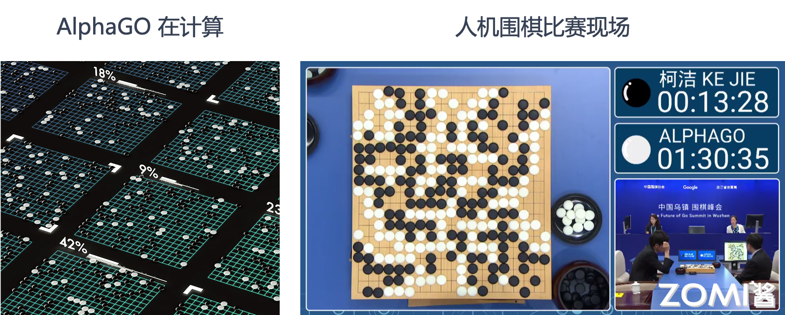
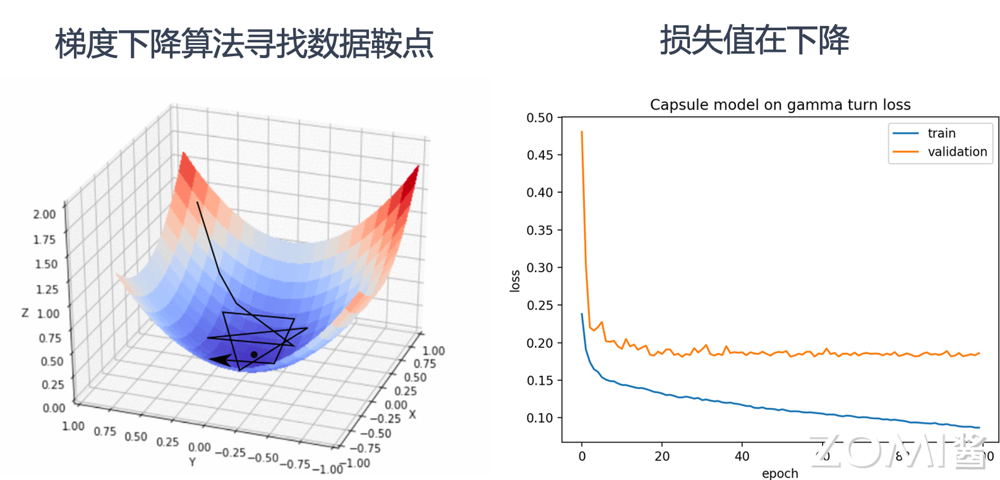
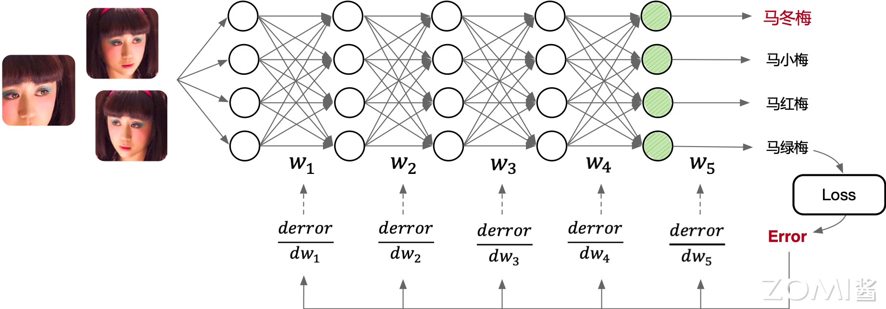
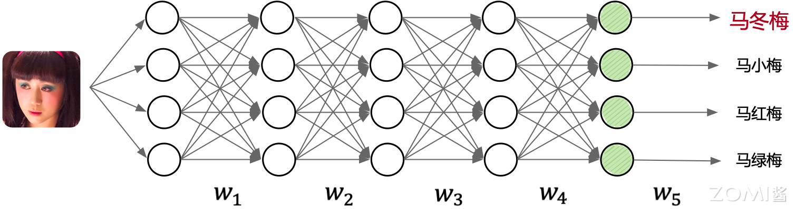
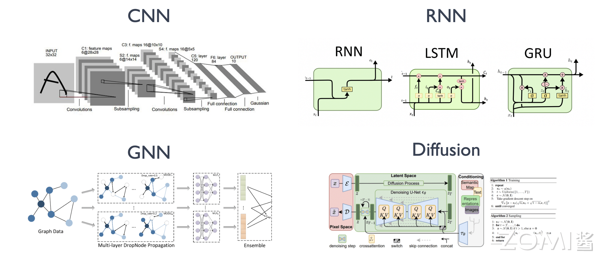
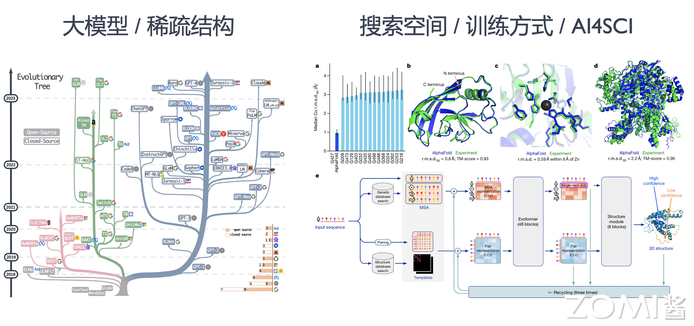
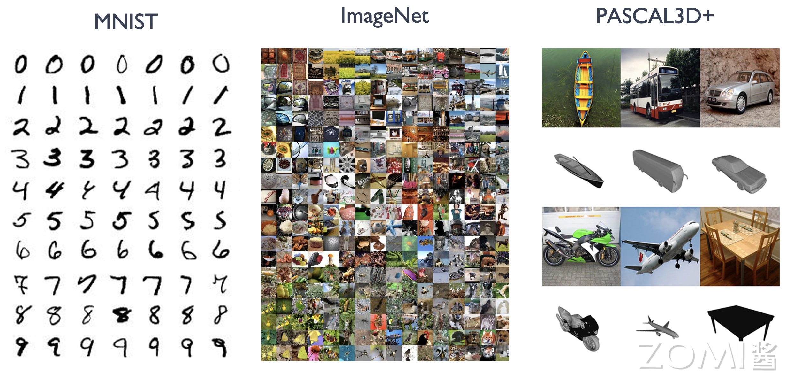
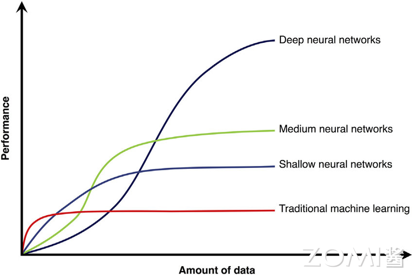
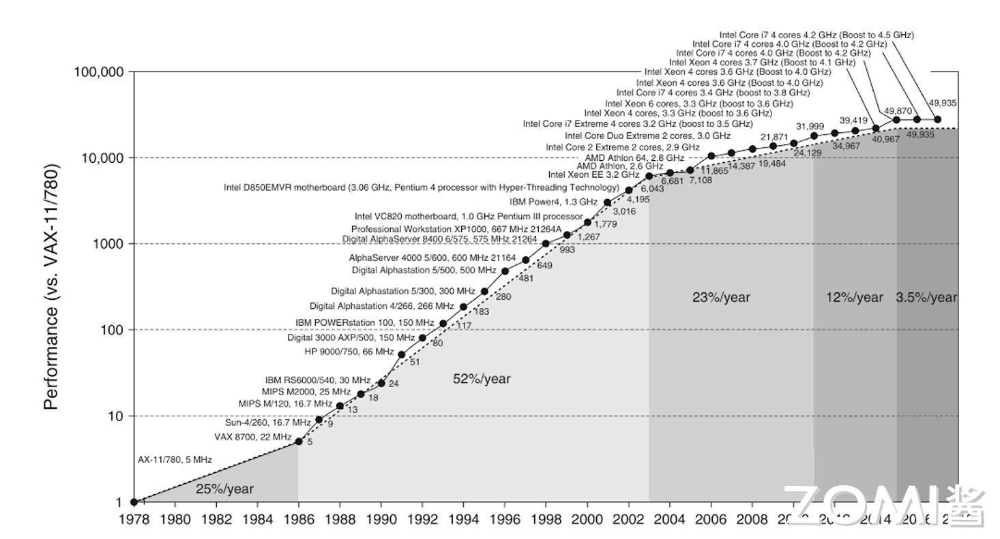

<!--Copyright © ZOMI 适用于[License](https://github.com/chenzomi12/AISystem)版权许可-->

# AI 发展驱动力(DONE)

AI 起源于上世纪五十年代，经历了几次繁荣与低谷，直到 2016 年谷歌旗下的 DeepMind 发布 AlphaGo 程序赢得与世界围棋冠军的比赛，大众对 AI 的关注与热情被重新点燃。其实 AI 技术早在这个标志事件之前已经在工业界很多互联网公司中得到了广泛应用与部署。例如，搜索引擎服务中的排序、图片的检索、广告推荐等功能，背后都有 AI 模型的支撑。

在媒体中经常看到词汇：人工智能、机器学习、深度学习和神经网络。那么他们之间的关系是什么？

可以认为机器学习是实现 AI 的一种方法，而深度学习是一种实现机器学习的技术。由于目前深度学习技术取得了突破性进展，是 AI 中最为前沿和重要的技术，并不断在广泛的应用场景内取代传统机器学习模型，而神经网络是深度学习的具体实现形态，使用神经网络模型来表示机器学习中深度学习这一范式。

> 后续的章节中，将会以 AI 一词代指神经网络这一具体实现形态。

## AI 学习方法

在展开 AI 系统设计之前，需要首先了解 AI 的原理与特点。将以下面图中的实例介绍 AI 是如何工作的。本内容假定读者有一定机器学习经验，其中的一些概念暂不在本节过多解释，会在后续章节中介绍机器学习、神经网络与 AI 的原理，让读者对整体的执行流程有更加深入的理解。

如图所示，将深度神经网络的开发与工作模式抽象为以下几个步骤：

1. **确定模型输入输出**：首先需要确认神经网络模型的输入样本学习数据（Sample）、输出标签（Label）。如图中所示，给 AI 模型输入图片（有狗，猫等），输出是图片所对应的类别（是猫还是是狗？）。用户需要提前准备好模型的输入输出数据，进而展开后续的模型训练。

2. **设计与开发模型**：开发者通过 AI 开发框架提供的 API 开发了图中的模型结构，线段代表权重，圆圈代表输入数据发生计算操作。其中 $w_n$ 代表权重，也就是可以被学习和不断更新的数值。

3. **训练（Training）过程**：训练的本质上是通过网络中的连接逐层向后传播总误差，计算每个层中每个权重和偏差对总误差的贡献（梯度 $\delta w$），然后使用求解梯度的优化算法（如梯度下降算法）进行优化权重和偏差，并最终最小化神经网络的总误差。如图中上半部分所示，训练过程就是根据用户给定的带有标签（如图中的 Cat，Dog 等输出标签）的数据集，不断通过优化算法进行学，通过下面步骤学习出给定数据集下最优的模型权重 $w_n$ 的取值。

3.1 **前向传播（Forward Propagation）**：由输入到输出完成 AI 模型中各层矩阵计算（例如卷积层，池化层等），产生输出并完成损失函数 LOSS 计算。

3.2 **反向传播（Back Propagation）**：由输出到输入反向完成 AI 模型中各层的权重和输出对损失函数的梯度求解。

3.3 **梯度更新（Weight Update）**：对模型权重通过梯度下降法完成模型权重针对梯度和指定学习率更新。

不断重复以上步骤 3.1 ~ 3.2，直到达到 AI 模型收敛或达到终止条件（例如指定达到一定迭代（Step）次数然后停止执行）。

如图所示，当完成了模型训练，意味着在给定的数据集上，模型已经达到最佳或者满足需求的预测效果。在如果开发者对模型预测效果满意，就可以进入模型部署进行推理和使用模型。一句话而言，我们训练 AI 模型的过程，就是通过不断的迭代计算，使用梯度下降的优化算法，使得损失函数越来越小。损失函数越小就表示算法达到数学意义上的最优。

4. **推理（Inference）过程**：推理只需要执行训练过程中的前向传播过程即可，推理的原理是基于训练好的 AI 模型，通过输入待预测的数据，经过前向传播过程，即通过 AI 模型定义的激活函数和非线性函数处理数据，得到最终的预测结果。

如图中下半部分所示，由输入到输出完成 AI 模型中各层的矩阵计算（例如卷积层，池化层等），产生输出。本例中输入是“马冬梅”的图片，输出的结果为向量，向量中的各个维度编码了图像的类别可能性，其中“马冬梅”的类别概率最大，判定为“马冬梅”，后续应用可以根据输出类别信息，通过程序转换为人可读的信息。

后续章节将要介绍的 AI 系统，就是围绕以上负载 AI 训练和推理应用的 AI 全生命周期的开发与执行各个环节，提供给算法工程师良好的模型设计和开发体验，AI 硬件的极致的执行性能，保证安全性，以及应对更大规模的数据，更大的模型结构，更大的超参数搜索空间，云上的多租的执行环境，同时利用新的加速器硬件特性，挖掘硬件的极致算力。

## AI 算法现状

目前 AI 模型有很多种类并在每年不断推出新的 AI 模型，如图所示，以影响 AI 系统设计的视角，我们将其简要归为以下一些代表性的类型。这些代表性的 AI 网络结构也是 AI 系统进行评测和验证所广泛使用的基准。同时一些新的结构的涌现，也不断推进一些新的 AI 系统设计。

下面对典型的基本 AI 模型结构进行类型归纳：

1. **卷积神经网络（Convolutional Neural Network，CNN）**：以卷积层（Convolution Layer）为主，池化层（Pooling Layer），全连接层（Fully Connected Layer）等算子（Operator）的组合形成的 AI 网络模型，并在计算机视觉领域取得明显效果和广泛应用的模型结构。

2. **循环神经网络（Recurrent Neural Network，RNN）**：以循环神经网络、长短时记忆（LSTM）等基本单元组合形成的适合时序数据预测（例如，自然语言处理、语音识别、监控时序数据等）的模型结构。

3. **图神经网络（Graph Neural Network，GNN）**：使用神经网络来学习图结构数据，提取和发掘图结构数据中的特征和模式，满足聚类、分类、预测、分割、生成等图学习任务需求的算法总称。目的是为了尽可能多的提取 “图” 中潜在的表征信息。

4. **生成对抗网络（Generative Adversarial Network，GAN）**：该架构训练两个神经网络相互竞争，从而从给定的训练数据集生成更真实的新数据。例如，可以从现有图像数据库生成新图像，也可以从歌曲数据库生成原创音乐。GAN 之所以被称为对抗网络，是因为该架构训练两个不同的网络并使其相互对抗。

5. **扩散概率模型（Diffusion Probabilistic Models）**：扩散概率模型是一类潜变量模型，是用变分估计训练的马尔可夫链。目标是通过对数据点在潜空间中的扩散方式进行建模，来学习数据集的潜结构。如计算机视觉中，意味着通过学习逆扩散过程训练神经网络，使其能对叠加了高斯噪声的图像进行去噪。

6. **混合结构网络（Model Ensemble）**：组合卷积神经网络和循环神经网络，进而解决如光学字符识别（OCR）等复杂应用场景的预测任务。

基础模型的典型算子已经被 AI 开发框架和底层 AI 硬件做了较多优化，但是 AI 模型已经不单纯只在算子层面产生变化，其从网络结构，搜索空间等方向演化出如下的新的趋势：

1. **更大的模型**：以 Transformer 为基本结构的代表性预训练神经语言模型（Neural Language Model），例如，BERT、GPT-3、LLAMA 等，在自然语言处理和计算机视觉等场景应用越来越广泛。其不断增加的层数和参数量，该模型对底层系统内存管理，分布式训练和硬件设计提出了很大的挑战。

2. **更灵活的结构**：图神经网络模型、深度搜索树网模型等算法不断抽象多样且灵活的数据结构（例如图 Graph，树 Tree 等），应对更为复杂的建模需求。进而衍生了新的算子（例如图卷积等）与计算框架（例如图神经网络框架等）。

3. **更稀疏的模型结构**：以多专家模型（Mixture of Experts，MoE）和 Pathways 模型结构为代表的模型融合结构，让运行时的 AI 系统执行模型更加动态（Dynamic）和稀疏（Sparse），提升模型的训练效率减少训练代价，支持更多的任务。给系统设计静态分析带来了不小的挑战，同时驱动运用即时编译（Just In Time Compiling）和运行时（Runtime）更加高效的调度与优化。

4. **更大规模的搜索空间**：用户定义更大规模的超参数与模型结构搜索空间，通过超参数搜索优化（HPO）与神经网络结构搜索（NAS）自动化找到最优的模型结构。自动化机器学习（AutoML）为代表的训练方式，衍生出多作业执行与多作业（Multi-Jobs）编排优化的系统需求。

5. **更多样的训练方式**：扩散模型（Diffusion Model）和深度强化学习（Deep Reinforcement Learning）为代表的算法有比传统训练方式更为复杂的过程。其衍生出训练，推理，数据处理混合部署与协同优化的系统需求。

## AI 系统的出现

催生这轮 AI 热潮的原因有三个重要因素：大数据的积累、超大规模的计算能力支撑、机器学习尤其是深度学习算法都取得了突破性进展，下面将围绕以上重要的三方面因素展开。

### 大规模数据驱动

随着数字化发展，信息系统和平台不断沉淀了大量数据。AI 算法利用数据驱动（Data Driven）的方式解决问题，从数据中不断学习出规律和模型，进而完成分类和回归的任务。

互联网和移动互联网公司由于有海量的用户，大规模的数据中心，信息系统完善，所以可以较早沉淀出大规模数据，并应用人工智能技术，投入研发创新人工智能技术。互联网服务和大数据平台给深度学习带来了大量的数据集。随着移动互联网的日益火爆，移动应用的发展可谓日新月异，谷歌 Play、App Store，还有众多的移动应用分发渠道上，已经积累了海量应用。

互联网公司因为其有海量的用户，这些用户不断使用互联网服务，上传文字、图片、音频等数据，又积累了更为丰富的数据。这些数据随着时间的流逝和新业务功能的推出，数据量越来越大，数据模式越来越丰富。所以互联网公司较早的开发和部署了的大数据管理与处理平台。基于这些海量数据，互联网公司通过数据驱动的方式，训练人工智能模型，进而优化和提升业务用户体验（如点击率预测让用户获取感兴趣的信息），让更多的用户使用服务，进而形成循环。由于天然的随着业务发展遇到更多需要应用人工智能技术的实际场景和需求，相较于学术界，互联网公司作为工业界的代表，较早地将深度学习的发展推到了更加实用，落地的阶段，并不断投入研发推动人工智能算法与系统的不断演进和发展。

例如，以下几种服务中沉淀和形成了相应领域代表性的数据集：

- **搜索引擎（Search Engine）**：在图像检索（Image Search）邻域出现了如 ImageNet，Coco 等计算机视觉数据集。在文本检索（Text Search）出现了 Wikipedia 等自然语言处理数据集。

- **移动应用（Application）**：移动应用数据分析是用户获取和留存的强劲引擎。如图所示，国内出现了优质的数据源的公司如知乎和小红书，传统的贴吧如天涯论坛、百度网吧等充斥广告等地方已经不再是优质数据源。各家移动互联网如淘宝、拼多多收集了大量的用户购买和浏览记录，形成庞大的推荐系统数据集，广告数据集。

同样是图像分类问题，从最开始数据规模较小的 MNIST 手写数字识别数据集其只有 6 万样本，10 个分类，到更大规模的 ImageNet，其有 1600 万样本，1000 个分类，再到互联网 Web 服务中沉淀了数亿量级的图像数据。海量的数据让人工智能问题变得愈发挑战的同时，实质性的促进了人工智能模型效果的提升，因为当前以深度学习为核心的代表性 AI 算法，其本身是数据驱动的方式从数据中学习规律与知识，数据的质与量决定了模型本身的天花板。

海量数据集为 AI 系统的发展产生了以下的影响：

- 推动 AI 算法不断在确定任务上产生更高准确度与更低的误差。这样产生了针对 AI 系统发展的用户基础，应用落地场景驱动力和研发资源投入。

- 让 AI 有更广泛的应用，进而产生商业价值，让工业界和学术界看到其应用潜力并投入更多资源进行科学研究，持续探索。

- 传统的机器学习库不能满足相应的需求，海量的数据集让单机越来越难以完成 AI 模型的训练，进而产生了 AI 系统中分布式训练和 AI 集群的需求。

- 多样的数据格式和任务，驱动模型结构的复杂性，驱动 AI 开发框架和针对 AI 的编译体系，需要有更灵活的表达能力对 AI 问题进行表达与映射。

- 同时伴随着性能等需求得到满足，数据安全与模型安全问题挑战也变的日益突出。

综上所述，AI 系统本身的设计相较于传统机器学习系统有更多样的表达需求，更大规模和多样数据集和更广泛的用户基础。

### AI 算法的进步

算法研究员和工程师不断设计新的 AI 算法和 AI 模型提升预测效果，其预测效果不断取得突破性进展。但是新的算法和模型结构，需要 AI 开发框架提供便于对 AI 范式的编程表达力和灵活性，对执行性能优化有可能会改变原有假设，进而产生了对 AI 系统对于 AI 开发框架的开发过程和 AI 编译器的执行过程优化提出了新的挑战，因而促进了 AI 系统的发展。

1. **精度超越传统机器学习**

以 MNIST 手写数字识别任务为例，其作为一个手写数字图像数据集，在早期通常用于训练和研究图像分类任务，由于其样本与数据规模较小，当前也常常用于教学。从图中可以观察了解到不同的机器学习算法取得的效果以及趋势：1998 年，简单的 CNN 可以接近 SVM 最好效果。2012 年，CNN 可以将错误率降低到 0.23% (2012)，这样的结果已经可以和人所达到的错误率 0.2% 非常接近。

神经网络模型在 MNIST 数据集上相比传统机器学习模型的表现，让研究者们看到了神经网络模型提升预测效果的潜力，进而不断尝试新的神经网络模型和在更复杂的数据集上进行验证。神经网络算法在准确度和错误率上的效果提升，让不同应用场景上的问题，取得突破进展或让领域研发人员看到相应潜力，是驱动不同行业不断投入研发 AI 算法的动力。

2. **公开数据集上突破**

随着每年 ImageNet 数据集上的新模型取得突破，新的神经网络模型结构和训练方式的潜力。更深、更大的模型结构有潜力提升当前预测的效果。1998 年的 Lenet 到 2012 年的 AlexNet，不仅效果提升，模型变大，同时引入了 GPU 训练，新的计算层（如 ReLU 等）。到 2015 年的 Inception，模型的计算图进一步复杂，且有新的计算层被提出。2015 年 ResNet 模型层数进一步加深，甚至达到上百层。到 2019 年 MobileNet3 的 NAS，模型设计逐渐朝着自动化的方式进行设计，错误率进一步降低到 6.7% 以下。

新的模型不断在以下方面演化进而提升效果：1）更好的激活函数和层，如 ReLU、Batch Norm 等；2）更深更大的网络结构和更多的模型权重；3）更好的训练技巧: 正则化（Regularization）、初始化（Initialization）、学习方法（Learning Methods），自动化机器学习与模型结构搜索等。

上述取得更好效果的技巧和设计，驱动算法工程师与研究员不断投入，同时也要求 AI 系统提供新的算子（Operator）支持与优化，进而驱动 AI 开发框架和 AI 编译器对前端、中间表达和系统算法协同设计的演进和发展。

### 算力与体系结构进步

从 1960 年以来，计算机性能的增长主要来自摩尔定律，到二十世纪初大概增长了 $10^8$ 倍。但是由于摩尔定律的停滞，性能的增长逐渐放缓了。单纯靠工艺尺寸的进步，无法满足各种应用对性能的要求。

于是，人们就开始为应用定制专用芯片，通过消除通用处理器中冗余的功能部分，来进一步提高对特定应用的计算性能。如图形图像处理器 GPU 就对图像类算法进行专用硬件加速。如图所示后来出现 GPGPU，即通用 GPU，对适合于抽象为单指令流多数据流（SIMD）或者单指令多线程（SIMT）的并行算法与工作应用负载都能起到惊人的加速效果。

为了更高的性能，近年来 AI 芯片也大放光彩。其中一个代表就是谷歌 TPU（Tensor Processing Unit），通过对深度学习模型中的算子进行抽象，转换为矩阵乘法或非线性变换，根据专用负载特点进一步定制流水线化执行的脉动阵列（Systolic Array），进一步减少访存提升计算密度，提高了 AI 模型的执行性能。华为昇腾 NPU（神经网络处理器）针对矩阵运算专门优化设计，可解决传统芯片在神经网络运算时效率低下的问题。此外，华为达芬奇架构面向 AI 计算设计，通过独创 3D Cube 设计，每时钟周期可进行 4096 次 MAC 运算，为 AI 提供强大算力支持。 

除了算子层面驱动的定制，AI 层面的计算负载本身在算法层常常应用的稀疏性和量化等加速手段也逐渐被硬件厂商，根据通用算子定制到专用加速器中（例如，英伟达推出的 Transformer Engine），在专用计算领域进一步协同优化加速。通过定制化硬件，厂商又将处理器性能提升了大约 $10^5$ 量级。

然而可惜的是，经过这么多年的发展，虽然处理器性能提升这么多，我们机器的数值运算能力早已是人类望尘莫及了，AI 芯片内部执行的程序代码仍然是人类指定的固定代码，智能程度还远远不及生物大脑。从智力程度来说，大约也就只相当于啮齿动物，距离人类还有一定距离。

可以看到随着硬件的发展，虽然算力逐渐逼近人脑，让 AI 取得了突破。但是我们也看到，算力还是可能在短期内成为瓶颈，那么 AI 系统的性能下一代的出路在哪？我们在后面会看到，除了单独芯片的不断迭代进行性能放大（Scale Up），系统工程师不断设计更好的分布式计算系统将计算并行，来达到向外扩展（Scale Out），同时发掘深度学习的作业特点，如稀疏性等通过算法，系统硬件协同设计，进一步提升计算效率和性能。

## 小结与思考

本节围绕 AI 学习方式和算法现状，并对催生这轮 AI 热潮的三个重要因素：大数据的积累、超大规模的计算能力支撑、机器学习尤其是深度学习算法进行研究，除了理解上层 AI 算法，也需要理解 AI 系统底层体系结构，并利用两者的优化空间进行抽象和权衡取舍选取最优系统解决方法。