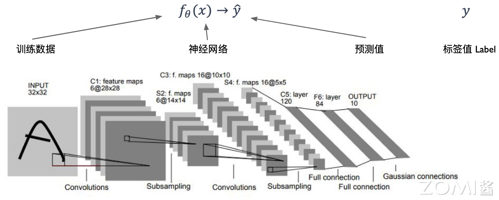
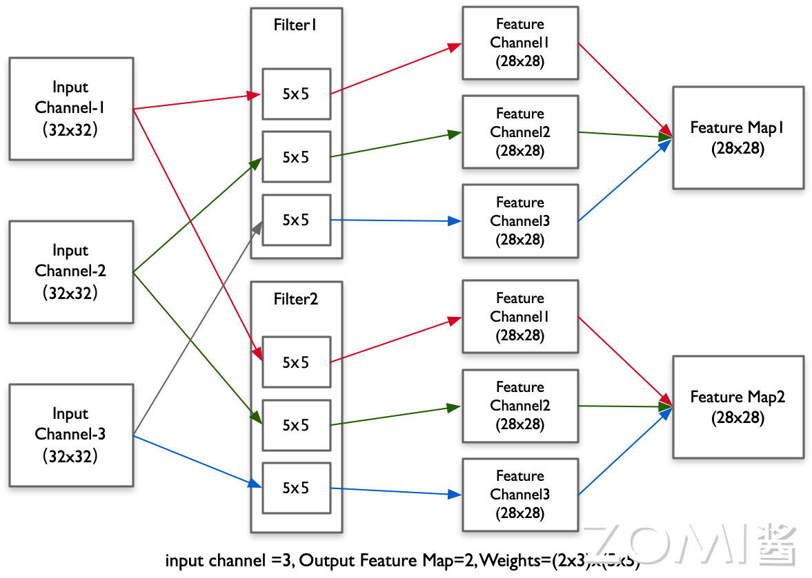
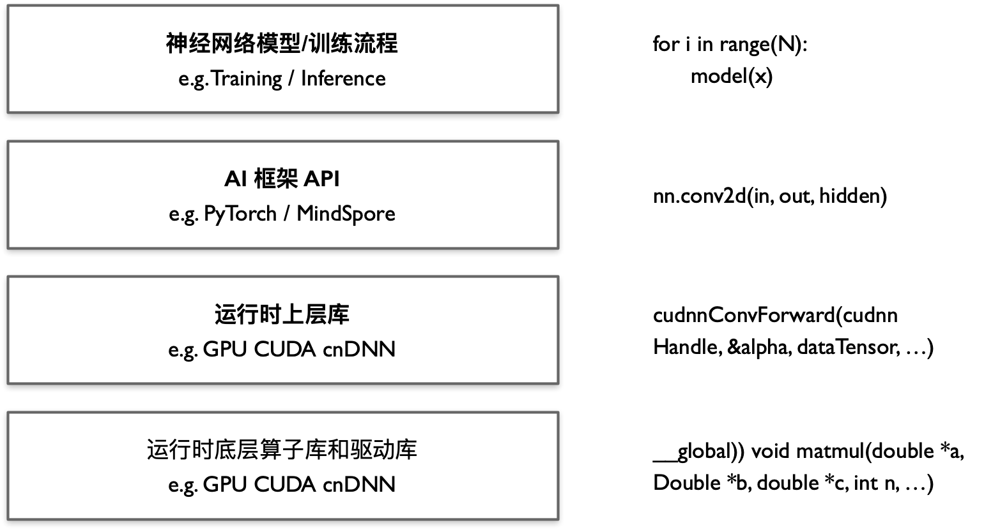
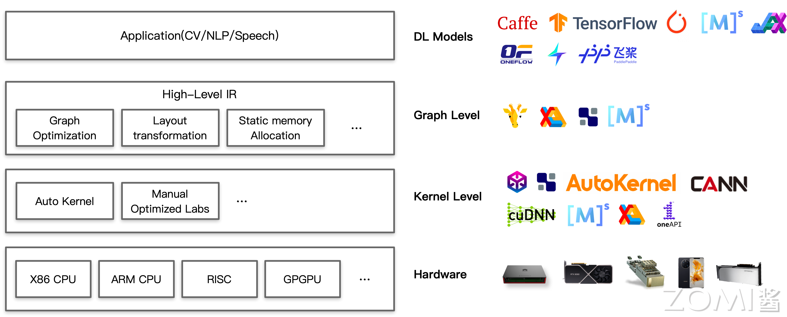

<!--Copyright © ZOMI 适用于[License](https://github.com/chenzomi12/AISystem)版权许可-->

# AI 系统与程序代码关系(DONE)

模型算法的开发者一般会通过使用 AI 框架提供 Python 等高级语言的 API，来编写对应的人工智能程序，而人工智能程序的底层系统问题被当前层抽象隐藏。到底在每个代码部分具体底层发生了什么？有哪些有意思的系统设计问题？

本节我们将从一个具体的 PyTorch 实现一个 LeNet5 神经网络模型作为实例开始，启发读者和后面 AI 系统的每一层和各个章节构建起桥梁与联系。

## 神经网络样例

### AI 训练流程原理

如图所示，可以看到一个神经网络模型可以接受输入（如当前手写数字图片），产生输出（如数字分类），这个过程叫前向传播（Forward Propagation）。



那么如何得到一个针对当前已有的输入输出数据上，预测效果最好的神经网络模型呢？这个时候需要通过对网络模型进行训练，训练过程可以抽象为数学上的优化问题，优化目标为:

$$\theta = argmin_{\theta}\sum[Loss(f_{\theta}(x), y)]$$

其中：

- $f_{\theta}$ 表示神经网络模型，例如 LeNet；
- $Loss$ 表示损失函数；
- $x$ 表示输入数据，数据中的输入也就是图像；
- $y$ 表示标签值，也代表网络模型的输出；

训练的过程就是找到最小化 $Loss$ 的 $\theta$ 取值，$\theta$ 也称作权重，即网络模型中的参数。在训练过程中将通过梯度下降等数值优化算法进行求解：

$$\theta = \theta - \alpha \delta_{\theta}Loss(\theta)$$

其中，$\alpha$ 也称为学习率(Learning Rate)。当神经网络模型训练完成，就可以通过 $\hat{y} = f_\theta(x)$ 进行推理，使用和部署已经训练好的网络模型。

如图所示，左上角展示输入为手写数字图像，输出为分类向量，中间矩形为各层输出的特征图（Feature Map），我们将其映射为具体的实现代码，其结构通过图右侧定义出来。

可以看到神经网络模型就是通过各个层，将输入图像通过多个层的算子进行计算，得到为类别输出概率向量。

> 算子：深度学习算法由一个个计算单元组成，称这些计算单元为算子（Operator，Op）。AI 框架中对张量计算的种类有很多，比如加法、乘法、矩阵相乘、矩阵转置等，这些计算被称为算子（Operator）。
> 
> 为了更加方便的描述计算图中的算子，现在来对**算子**这一概念进行定义：
>
> **数学上定义的算子**：一个函数空间到函数空间上的映射 O：X→X，对任何函数进行某一项操作都可以认为是一个算子。
> 
> - **狭义的算子（Kernel）**：对张量 Tensor 执行的基本操作集合，包括四则运算，数学函数，甚至是对张量元数据的修改，如维度压缩（Squeeze），维度修改（reshape）等。
> 
> - **广义的算子（Function）**：AI 框架中对算子模块的具体实现，涉及到调度模块，Kernel 模块，求导模块以及代码自动生成模块。
>
> 对于神经网络模型而言，算子是网络模型中涉及到的计算函数。在 PyTorch 中，算子对应层中的计算逻辑，例如：卷积层（Convolution Layer）中的卷积算法，是一个算子；全连接层（Fully-connected Layer，FC layer）中的权值求和过程，也是一个算子。

### 网络模型构建

开发者一般经过两个阶段进行构建: 

1. 定义神经网络结构，如图中和代码实例中构建的 LeNet5 网络模型，其中包含有卷积（Conv2D）层，最大池化层（MaxPool2D），全连接（Linear）层。

2. 开始训练，遍历一个批大小（Batch Size）的数据，设置计算的 NPU/GPU 资源数量，执行前向传播计算，计算损失值（Loss），通过反向传播实现优化器计算，从而更新权重。

现在使用 PyTorch 在 MNIST 数据集上训练一个卷积神经网络 [LeNet](http://yann.lecun.com/exdb/lenet/) 的代码实例。

```python
import torch
import torch_npu

# 如果模型层数多，权重多到无法在单 GPU 显存放置，我们需要通过模型并行方式进行训练
class LeNet(nn.Module):
    def __init__(self):
        super(LeNet, self).__init__()
        # 通过循环 Loop 实现卷积理解卷积的执行逻辑，可以深入思考其中编译和硬件执行问题
        # 我们将会在第二章、第三章详细展开计算到芯片的关系
        self.conv1 = nn.Conv2d(3, 6, 5)
        self.conv2 = nn.Conv2d(6, 16, 5)
        self.fc1 = nn.Linear(16*5*5, 120)
        self.fc2 = nn.Linear(120, 84)
        self.fc2 = nn.Linear(84, 10)

    def forward(self, x):
    	  # 具体的执行 API 单位是算子，实际编译器或者硬件执行的是 Kernel
          # 我们将会在第四章推理引擎 Kernel 优化详细介绍算子计算执行的方式
        out = F.relu(self.conv1(x))
        out = F.max_pool2d(out, 2)
        out = F.relu(self.conv2(out))
        out = F.max_pool2d(out, 2)
        out = out.view(out.size(0), -1)
        out = F.relu(self.fc1(out))
        out = F.relu(self.fc2(out))
        out = self.fc3(out)
        return out


def train(args, model, device, train_loader, optimizer, epoch):
    # 如何进行高效的训练，运行时 Runtime 是如何执行的
    # 我们将在第五章 AI 框架基础进行介绍
    model.train()
    for batch_idx, (data, target) in enumerate(train_loader):
        data, target = data.to(device), target.to(device)
        optimizer.zero_grad()
        output = model(data)
        loss = F.nll_loss(output, target)
        loss.backward()
        optimizer.step()
        ...


def test(model, device, test_loader):
    model.eval()
    ... 
    with torch.no_grad():
        for data, target in test_loader:
            data, target = data.to(device), target.to(device)
            # 推理系统如何高效进行模型推理
            # 我们将在第思章 AI 推理系统进行介绍
            output = model(data)
            ...


def main():
    ...
    # 当前语句决定了使用哪种 AI 加速芯片
    # 可以通过第二章的 AI 芯片基础去了解不同 AI 加速芯片的体系结构及芯片计算底层原理
    device = torch.device("npu" if use_cuda else "cpu")
    
    # 如果 batch size 过大，造成单 NPU/GPU HBM 内存无法容纳模型及中间激活的张量
    # 读者可以参考第分布式训练算法，进行了解如何分布式训练
    train_kwargs = {'batch_size': args.batch_size}
    test_kwargs = {'batch_size': args.test_batch_size}
    ...
    
    # 如果数据量过大，那么可以使用分布式数据并行进行处理，利用集群的资源
    dataset1 = datasets.MNIST('../data', train=True, download=True, transform=transform)
    dataset2 = datasets.MNIST('../data', train=False, transform=transform)
    train_loader = torch.utils.data.DataLoader(dataset1,**train_kwargs)
    test_loader = torch.utils.data.DataLoader(dataset2, **test_kwargs)
    model = LeNet().to(device)
    optimizer = optim.Adadelta(model.parameters(), lr=args.lr)
    ... 
    
    for epoch in range(1, args.epochs + 1):
        train(args, model, device, train_loader, optimizer, epoch)
        # 训练完成需要部署，如何压缩和量化后再部署
        # 可以参考第四章推理系统进行了解
        test(model, device, test_loader)
        ... 

if __name__ == '__main__':
    main()
```

## 算子实现的系统问题

在神经网络中所描述的层（Layer），在 AI 框架中称为算子，或者叫做操作符（Operator）；底层算子的具体实现，在 AI 编译器或者在 AI 芯片时称为 Kernel，对应具体 Kernel 执行的时候会先将其映射或转换为对应的矩阵运算（例如，通用矩阵乘 GEMM），再由其对应的矩阵运算翻译为对应的循环 Loop 指令。

### 卷积实现原理

下图的卷积层实例中，每次选取输入数据一层的一个窗口（和卷积核一样的宽高），然后和对应的卷积核（$5 \times 5$ 卷积核代表高 5 维宽 5 维的矩阵）进行 [矩阵内积（Dot Product）](https://en.wikipedia.org/wiki/Dot_product) 运算，最后将所有的计算结果与偏置项 $b$ 相加后输出。

```python
import torch

class LeNet(nn.Module):
    def __init__(self):
        super(LeNet, self).__init__()
        ...
        self.conv2 = nn.Conv2d(3, 2, 5)
        ...
        
    def forward(self, x):
    	  out = self.conv1(x)
    	  ...
```

首先一次沿着行进行滑动一定的步长 Step，再进行下次矩阵内积计算，直到滑到边界后再沿着一定步长跳到下一列重复刚才的滑动窗口。最终把每一步的结果组合成输出矩阵，即产生特征图（Feature Map）。



图中输入张量形状（Tensor Shape）为 $3 \times 32 \times 32$（3 代表通道数，32 代表张量高度和宽度），经过 $2 \times 3 \times 5 \times 5$ 的卷积（2 代表输出通道数，3 代表输入通道数，5 代表卷积核高度和宽度）后，输出张量形状为 $2 \times 28 \times 28$（2 代表通道，28 代表高度和宽度）。

### 卷积执行样例

示例的卷积计算，最终在程序上表达为多层嵌套循环，为简化计算过程，循环展开中没有呈现维度（Dimension）的形状推导（Shape Inference）。以 Conv2D 转换为如下 7 层循环进行 Kerenl 计算的代码：

```C++
# 批尺寸维度 batch_size
for n in range(batch_size):
   # 输出张量通道维度 output_channel
   for oc in range(output_channel):
       # 输入张量通道维度 input_channel
       for ic in range(input_channel):
          # 输出张量高度维度 out_height
          for h in range(out_height):
              # 输出张量宽度维度 out_width
              for w in range(out_width):
                  # 卷积核高度维度 filter_height
                  for fh in range(filter_height):
                      # 卷积核宽度维度 filter_width
                      for fw in range(filter_width):
                          # 乘加（Multiply Add）运算
                          output[h, w, oc] += input[h + fw, w + fh, ic]\
                                            * kernel[fw, fh, c, oc]  
```

### AI 系统遇到的问题

在实际 Kernel 的计算过程中有很多有趣的问题：

- **硬件加速**： 通用矩阵乘是计算机视觉和自然语言处理模型中的主要的计算方式，同时 NPU/GPU，如 TPU 脉动阵列的矩阵乘单元等其他专用人工智能芯片 ASIC 是否会针对矩阵乘作为底层支持？（第二章 AI 芯片体系结构相关内容）

- **片上内存**：其中参与计算的输入、权重和输出张量能否完全放入 NPU/GPU 缓存（L1、L2、Cache）？如果不能放入则需要通过循环块（Loop Tile）编译优化进行切片。（第二章 AI 芯片体系结构相关内容）

- **局部性**：循环执行的主要计算语句是否有局部性可以利用？空间局部性（缓存线内相邻的空间是否会被连续访问）以及时间局部性（同一块内存多久后还会被继续访问），这样我们可以通过预估后，尽可能的通过编译调度循环执行。（第三章 AI 编译器相关内容）

- **内存管理与扩展（Scale Out）**：AI 系统工程师或者 AI 编译器会提前计算每一层的输出（Output）、输入（Input）和内核（Kernel）张量大小，进而评估需要多少计算资源、内存管理策略设计，以及换入换出策略等。（第三章 AI 编译器相关内容）

- **运行时调度**：当算子与算子在运行时按一定调度次序执行，框架如何进行运行时管理？（第四章推理引擎相关内容）

- **算法变换**：从算法来说，当前多层循环的执行效率无疑是很低的，是否可以转换为更加易于优化和高效的矩阵计算？（第四章推理引擎相关内容）

- **编程方式**：通过哪种编程方式可以让神经网络模型的程序开发更快？如何才能减少或者降低算法工程师的开发难度，让其更加聚焦 AI 算法的创新？（第五章 AI 框架相关内容）

## AI 系统执行具体计算

目前算法工程师或者上层应用开发者只需要使用 AI 框架定义好的 API 使用高级编程语言如 Python 等去编写核心的神经网络模型算法，而不需要关注底层的执行细节和对一个的代码。底层通过层层抽象，提升了开发效率，但是对系统研发却隐藏了众多细节，需要 AI 系统开发的工程师进一步探究。

在上面的知识中，开发者已经学会使用 Python 去编写 AI 程序，以及深度学习代码中的一个算子（如卷积）是如何翻译成底层 for 循环从而进行实际的计算，这类 for 循环计算通常可以被 NPU/GPU 计算芯片厂商提供的运行时算子库进行抽象，不需要开发者不断编写 for 循环执行各种算子操作（如 cuDNN、cuBLAS 等提供卷积、GEMM 等 Kernel 的实现和对应的 API）。

目前已经直接抽象到 Kernel 对具体算子进行执行这一层所提供的高级 API，似乎已经提升了很多开发效率，那么有几个问题：

- 为什么还需要 AI 框架（如 PyTorch、MindSpore 等）？
- AI 框架在 AI System 中扮演什么角色和提供什么内容？
- 用户编写的 Python 代码如何翻译给硬件去执行？

我们继续以上面的例子作为介绍。

### AI 框架层

如果没有 AI 框架，只将算子 for 循环抽象提供算子库（例如，cuDNN）的调用，算法工程师只能通过 NPU/GPU 厂商提供的底层 API 编写神经网络模型。例如，通过 CUDA + cuDNN 库书写卷积神经网络，如 [cuDNN 书写的卷积神经网络 LeNet 实例](https://github.com/tbennun/cudnn-training)。因此如图分为不同的步骤和处理流程。



1. 通过 cuDNN + CUDA API 编程实现 LeNet
 
[参考实例 cudnn-training](https://github.com/tbennun/cudnn-training/blob/master/lenet.cu)，需要~1000 行实现模型结构和内存管理等逻辑。

```C++
// 内存分配，如果用深度学习框架此步骤会省略
...
cudaMalloc(&d_data, sizeof(float) * context.m_batchSize * channels * height * width);
cudaMalloc(&d_labels, sizeof(float) * context.m_batchSize * 1  * 1 * 1);
cudaMalloc(&d_conv1, sizeof(float) * context.m_batchSize * conv1.out_channels * conv1.out_height * conv1.out_width);
...

// 前向传播第一个卷积算子（仍需要写其他算子）
...
cudnnConvolutionForward(cudnnHandle, &alpha, dataTensor,
                        data, conv1filterDesc, pconv1, conv1Desc, 
                        conv1algo, workspace, m_workspaceSize, &beta,
                        conv1Tensor, conv1);
...

// 反向传播第一个卷积算子（仍需要写其他算子），如果用深度学习框架此步骤会省略
cudnnConvolutionBackwardBias(cudnnHandle, &alpha, conv1Tensor,
                             dpool1, &beta, conv1BiasTensor, gconv1bias);

cudnnConvolutionBackwardFilter(cudnnHandle, &alpha, dataTensor,
                               data, conv1Tensor, dpool1, conv1Desc,
                               conv1bwfalgo, workspace, m_workspaceSize, 
                               &beta, conv1filterDesc, gconv1));

// 第一个卷积权重梯度更新（仍需要写其他算子），如果用深度学习框架此步骤会省略
cublasSaxpy(cublasHandle, static_cast<int>(conv1.pconv.size()),
            &alpha, gconv1, 1, pconv1, 1);
cublasSaxpy(cublasHandle, static_cast<int>(conv1.pbias.size()),
            &alpha, gconv1bias, 1, pconv1bias, 1);

// 内存释放，如果用深度学习框架此步骤会省略
...
cudaFree(d_data);
cudaFree(d_labels);
cudaFree(d_conv1);
...
```

2. 通过 PyTorch 编写 LeNet5

只需要 10 行构建模型结构。

```python
class LeNet(nn.Module):
    def __init__(self):
        super(LeNet, self).__init__()
        self.conv1 = nn.Conv2d(3, 6, 5)
        self.conv2 = nn.Conv2d(6, 16, 5)
        self.fc1 = nn.Linear(16*5*5, 120)
        self.fc2 = nn.Linear(120, 84)
        self.fc2 = nn.Linear(84, 10)

    def forward(self, x):
        out = F.relu(self.conv1(x))
        out = F.max_pool2d(out, 2)
        out = F.relu(self.conv2(out))
        out = F.max_pool2d(out, 2)
        out = out.view(out.size(0), -1)
        out = F.relu(self.fc1(out))
        out = F.relu(self.fc2(out))
        out = self.fc3(out)
        return out
```

通过 PyTorch + LeNet5 对比 cuDNN + CUDA，明显 cuDNN + CUDA 其抽象还不足以让算法工程师非常高效的设计神经网络模型和算法。同样实现 LeNet5，使用 AI 框架只需要 9 行代码，而通过 cuDNN 需要上千行代码，而且还需要精心的管理内存分配释放，拼接模型计算图，效率十分低下。

因此 AI 框架对算法工程师开发神经网络模型、训练模型等流程非常重要。从而可知 AI 框架一般会提供以下功能：

1. 以 Python API 供读者编写网络模型计算图结构；
2. 提供调用基本算子实现，大幅降低开发代码量；
2. 自动化内存管理、不暴露指针和内存管理给用户；
3. 实现自动微分功能，自动构建反向传播计算图；
4. 调用或生成运行时优化代码，调度算子在指定设备的执行；
6. 并在运行期应用并行算子，提升设备利用率等优化（动态优化）。

AI 框架帮助开发者解决了很多 AI System 底层问题，隐藏了很多工程的实现细节，但是这些细节和底层实现又是 AI System 工程师比较关注的点。

### AI 编译器

AI 框架充分赋能深度学习领域，为 AI 算法的开发者提供了极大便利。早期的 AI 框架主要应用于学术界，如 Theano、torch 等，随着深度学习的快速发展以及在工业界的不断拓展，不断有新的 AI 框架被提出以满足不同场景的应用。

但是随着 AI 技术应用的全面发展，各厂家根据自身业务场景的需求，在 AI 硬件和算法上不断优化和探索，AI 系统的体系结构越来越复杂，更多新的 AI 加速芯片被提出来，其设计变得更加多样化，AI 框架运行的硬件环境和算法也趋于更多样和复杂，单一 AI 框架已经无法满足和平衡所有特性。所以，为了提供不同框架和硬件体系结构之间的迁移性，ONNX 等中间 IR 被提出，其定义了表示神经网络模型的统一格式，以促进不同 AI 框架之间的模型转换。

为了实现硬件的多样性，需要将神经网络模型计算映射到不同架构的硬件中执行。在通用硬件上，高度优化的线性代数库为神经网络模型计算提供了基础加速库。此外，大多数硬件供应商还发布了专属的神经网络模型计算优化库，如：MKL-DNN 和 cuDNN 等，但基于基础加速库的优化往往落后于深度学习算法模型的更新，且大多数情况下需要针对不同的平台进行定制化的开发。

为了解决多硬件平台上的性能优化的问题，多种 AI 编译器被提出并得到了普及和应用，比如：TVM ，Glow，XLA 和 Jittor 等。AI 编译器以神经网络模型作为输入，将 AI 计算任务通过一层或多层中间表达 IR 进行翻译和优化，最后转化为目标硬件上可执行的代码，与传统的编译器（LLVM）类似，AI 编译器也采用前端、中间表示和后端分层设计的方式。



目前，业界主流的芯片公司和大型互联网公司等都在 AI 编译器进行了大量的投入来推进相关技术的发展。与传统编译器相比，AI 编译器是一个领域特定的编译器，有四个明显的特征：

1. Python 为主前端语言

与传统编译器不同，AI 编译器通常不需要 Lexer/Parser，而是基于前端高级编程语言（如 Python）的 AST 将神经网络模型解析并构造为计算图 IR，侧重于保留 shape、layout 等张量计算特征信息，当然部分编译器还能保留控制流的信息。其中 Python 主要是以动态解释器为执行方式。

2. 多层 IR 设计

多层 IR 设计，为的是满足易用性与高性能这两种类型需求：1）为了让开发者使用方便，AI 框架会尽量对张量的计算进行抽象封装成具体的 API 或者函数，算法开发者只要关注神网络模型定义上的逻辑意义模型和算子；2）在底层算子性能优化时，可以打破算子的边界，从更细粒度的循环调度等维度，结合不同的硬件特点完成优化。

3. 面向神经网络优化

面向神经网络模型特殊的数据类型进行定义。AI 领域，网络模型层的具体计算被抽象成张量的计算，这就意味着 AI 编译器中主要处理的数据类型也是张量。而在反向传播过程中，是深度学习最为具有有代表的特性，基于计算图构建的网络模型，需要具有自动微分功能。

4. DSA 芯片架构支持

AI 训练和推理对性能和时延都非常敏感，所以大量使用专用的 AI 加速芯片进行计算，而 AI 编译器其实是以 DSA 架构的 AI 加速芯片作为为中心的编译器，这也是区别于通用编译器的一个特征。

如果没有 AI 框架、AI 编译器和算子库的支持，算法工程师进行简单的神经网络模型设计与开发都会举步维艰，所以应该看到 AI 算法本身飞速发展的同时，也要看到底层系统对提升整个算法研发的生产力起到了不可或缺的作用。

## 小结与讨论

本节通过 PyTorch 的实例启发大家建立 AI 系统各个章节之间的联系，由于系统的多层抽象造成 AI 实践和算法创新的过程中已经无法感知底层系统的运行机制。希望能够结合后面章节的学习后，看到 AI System 底层的作用和复杂性，从而指导上层 AI 作业、算法、代码更加高效的执行和编写。

请读完后面章节后再回看当前章节，并重新思考当前开发使能层下面的每一层的 AI System 底层发生了什么变化？执行了哪些操作和计算？