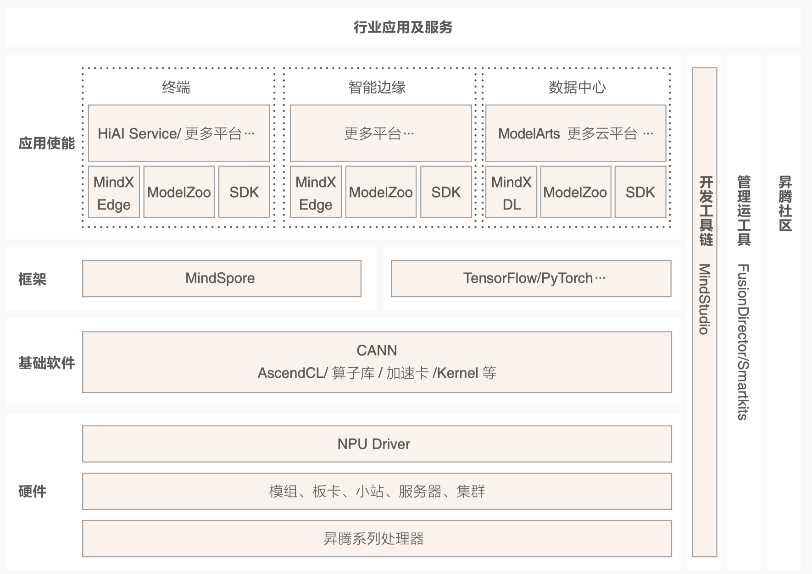

<!--Copyright © ZOMI 适用于[License](https://github.com/chenzomi12/AISystem)版权许可-->

# 昇腾 AI 全栈架构介绍

昇腾计算的基础软硬件是产业的核⼼，也是 AI 计算能⼒的来源。华为，作为昇腾计算产业⽣态的⼀员，是基础软硬件系统的核⼼贡献者。昇腾计算软硬件包括硬件系统、基础软件和应⽤使能等。

而本书介绍的 AI 系统整体的架构，则是对应与昇腾 AI 产业的全栈架构较为相似。因此这里以昇腾计算产业作为例子，来以实际工业界计算产业中的昇腾作为例子进行阐述。其他计算产业如英伟达、寒武纪、摩尔线程等全栈架构基本与 AI 系统也较为相似。

## 昇腾计算产业介绍

昇腾计算产业是基于昇腾系列（HUAWEI Ascend）处理器和基础软件构建的全栈 AI 计算基础设施、行业应用及服务，包括昇腾系列处理器、系列硬件、CANN（Compute Architecture for Neural Networks，异构计算架构）、AI 计算框架、应用使能、开发工具链、管理运维工具、行业应用及服务等全产业链。

其生态包括围绕着昇腾计算技术和产品体系所开展的学术、技术、公益及商业活动，产生的知识和产品以及各种合作伙伴，主要包括原始设备制造商 OEM、原始设计制造商 ODM、 独立硬件开发商 IHV、咨询与解决方案集成商 C&SI、独立软件开发商 ISV、云服务提供商 XaaS 等。

同时，昇腾的合作伙伴体系当中还包含围绕昇腾相关产品对外提供服务交付的服务类伙伴，提供培训服务的人才联盟伙伴，提供投融资和运营服务的投融资运营伙伴等。昇腾高度重视高校的人才培养和昇腾开发者的发展，让高校和开发者成为整个昇腾生态的重要组成部分。

### AI 硬件系统

昇腾计算的 AI 硬件系统主要包括有：

- 基于华为达芬奇内核的昇腾系列处理器等多样化 AI 算⼒；

- 基于昇腾处理器的系列硬件产品，⽐如嵌⼊式模组、板卡、⼩站、服务器、集群等。

### AI 软件体系

昇腾计算 AI 基础软件体系主要包括有：

- 异构计算架构 CANN 以及对应的驱动、运⾏时、加速库、编译器、调试调优⼯具、开具链 MindStudio 和各种运维管理⼯具等，开放给⼴⼤的开发者和客户；

- AI 计算框架，包括开源的 MindSpore，以及各种业界流⾏的框架 PyTorch，作为⽣态的有机组成部分。同时，昇腾计算产业秉承开放的⽣态建设思路，⽀持各种计算框架的对接。

- 昇腾应⽤使能 MindX，可以⽀持上层的 ModelArts 和 HiAI 等应⽤使能服务，同时也可以支持第三⽅平台提供应⽤使能服务。

⾏业应⽤是⾯向⼲⾏百业的场景应⽤软件和服务，围绕昇腾计算体系，诞⽣了⼤量优秀的应⽤，⽐如互联⽹推荐、⾃然语⾔处理、视频分析、图像分类、⽬标识别、语⾳识别、机器⼈等各 Iaas Paas, SaaS 种场景。

昇腾计算产业也拥抱各种云服务场景，⽀持 laas，SaaS 等多种云服务模式；同时，端边云协同的能⼒，会原⽣的构建在整个技术架构中，推动昇腾计算成为全场景的 AI 基础设施。

### 产业价值

以“硬件开放，软件开源，使能合作伙伴”的开放⽣态，推动昇腾计算产业更好地发展。华为聚焦计算架构、处理器和基础软件的创新与研发。通过⾃有硬件和伙伴硬件相结合的⽅式客户提供多样化的算⼒选择。华为基于昇腾系列处理器，通过模组、板卡、⼩站、服务器、集群等丰富的产品形态，打造⾯向“端、边、云” 的全场景 Atlas AI 基础设施⽅案。

同时，华为提供 Atlas 模组、板卡等部件，使能伙伴发展基于 Atlas 部件的智能端侧、智能边缘、服务器、集群等 AI 设备。华为提供开源 AI 计算框架 MindSpore，同时也⽀持业界主流 AI 框架如 TensorFlow、PyTorch、Caffe 、PaddlePaddle 等，同时华为提供模型转换⼯具⽀持主流模型便捷的转换。

昇腾计算产业发展致⼒于将 AI 新技术的红利带到世界的每个⻆落，让⼈⼈充分享受 AI 带来的美好。在 AI 治理上，华为与⽣态、商业伙伴共同倡导向善、包容、普惠和负责任的 AI，为⼈类社会发展带来价值：

- ⽤得起：⽆论何⼈，何时，何地，想⽤就⽤，⽆所不及。

- ⽤得好：从芯⽚到架构，提供安全可靠的产品和服务，赋能合作伙伴和开发者，做好“⿊⼟地”。

- ⽤得放⼼：开放，透明，合作，遵守各国法律法规，保证个⼈隐私和数据安全。

## 昇腾 AI 系统架构

昇腾计算中的硬件体系、基础软件、开发工具链、AI 计算框架、应用使能等如图所示，跟全书介绍的 AI 系统基本上逻辑吻合。

底层的 AI 芯片和结构体系在昇腾 AI 全栈架构中主要指具体的硬件，覆盖了端边云全场景，支持数据中心，边缘和终端测的灵活部署方式。基础软件则是对应本书中 AI 系统的编译以及 AI 计算架构，使能芯片能力，提供具体的软件计算能力。再往上的框架层则是包含 AI 推理引擎、AI 计算框架。最后上层的应用使能则是针对具体的算法和模型提供的封装等相关的接口。

为满足最大化 AI 开发和部署的灵活性，昇腾整体 AI 架构遵照如下的设计理念。

- 模块化支持端边云场景下的独立部署
- 模块之间具备相互协同能力
- 各个层之间⽀持独⽴演进

基于统⼀的端边云全场景框架下，与合作伙伴⼀起，为最终客户带来的 AI 算⼒平台主要有以四点优势。

### 超强算⼒

在数据中⼼侧，处理边缘侧汇聚过来的海量数据和满⾜上亿级参数的⼤规模模型的深度学习需求。Atlas 训练卡可为服务器提供320 320 TFLOPS FP16 的⾼算⼒。针对更⼤规模需求，Atlas 集群提供256P ~ 1024P FLOPS FP16总算⼒，在 ResNet-50测试中，基于 ImageNet 数据集，训练时间达到⽬前业界最快的25.9s。在边缘侧，满⾜不同场景的灵活轻 25.9s。在边缘侧，满足不同场景的灵活轻量级部署的同时提供了强⼤算⼒。 Atlas 推理卡单卡算⼒达 88 TOPS INT8，并支持多路全⾼清视频实时分析。

⾼算⼒的同时，能效⽐同样关键。在数据中⼼侧，更⾼的能效⽐可⼤幅降低数据中⼼整体运营成本。具体来说，Atlas 集群作为业界⾸个全液冷 AI 集群，采⽤板级液冷、柜级⻛液换热器等独特设计，使数据中⼼ PUE（Power Usage Efficiency，能源使⽤效率）<1.1，节约⼤量电费，E 级算⼒集群5年节省电费超1亿元。在边缘侧，模组能效⽐达2 TOPS/W，适应低功耗和边缘部署需求。

### 全栈开放

坚持开源开放原则，⽬的是为了希望构建良好的产业⽣态，按能⼒分层开放。⾯向不同开发者提供不同开发⼯具和套件，使能开发者满⾜在极简开发和极致性能两⽅⾯的需求。

⾯向最上层的业务应⽤开发者，他们把 AI 变成服务，引⼊各⾏各业。对于这类开发者，MindX 开放⽀持上层的 ModelArts 和 HiAI 等应⽤使能服务，同时也可以⽀持第三⽅平台提供应⽤使能服务；MindX 也逐步提供 SDK，SDK 是⾯向同⼀类⾏业场景的完整开发⼯具包和对应的⾏业知识库，让针对⼀类⾏业的开发经验和⾏业知识可以积淀下来，快速复制。SDK 让开发者、ISV 只需极少量代码甚⾄不需要代码就可以实现 AI 的功能。

⾯向 AI 模型开发者，他们专注于算法开发，基于昇腾的开源框架 MindSpore 、PyTorch、 TensorFlow 和 PaddlePaddle 可以⽀持⾼效开发，同时华为提供模型转换⼯具⽀持主流模型便捷的转换到昇腾设备下。

向向算子开发者，提供了 CANN 和 MindStudio 来⽀持底层开发。基于统⼀编程接⼝Ascend C，实现分层开放能⼒。Ascend C 封装了内存管理、AI 任务管理、AI 任务执⾏、业务流、事件、图引擎等通⽤接⼝，开发者只需要掌握⼀套 API，就可以全⾯使⽤昇腾硬件的能⼒。同时，将开放环境与底层硬件相解耦，实现后向兼容，可以最⼤程度的保护开发者的数字资产。

### 使能应⽤

最⼴泛的⼀类⾏业应⽤开发者通常期望把 AI 当做⼀种服务，直接应⽤在各个⾏业领域中。这⼀类开发者⽆需理解背后⽤神经⽹络模型是什么、AI 框架是什么、资源是如何调度等技术细节。

昇腾应⽤使能 MindX 专⻔为这⼀类的 AI 应⽤开发者⽽设计。深度学习组件 MindX DL 和智能边缘组件 MindX Edge，⽀持 ModelArts、HiAI Service 及第三⽅应⽤使能平台等多种平台，可以将设备资源、算⼒资源统⼀的抽象、管理，被上层平台所调⽤，这样程序只需关注功能⽽不需要关注硬件的底层配置细节。

除此之外，MindX 还提供优选模型库 ModelZoo 和⾏业 SDK。ModelZoo 解决了模型的选型难、训练难、优化难等问题。SDK 是⾯向同⼀类⾏业场景的完整开发⼯具包和对应的⾏业知识库，让针对⼀类⾏业的开发经验和⾏业知识可以积淀下来，快速复制。SDK 让开发者、ISV 只需极少量代码甚⾄不需要代码就可以实现的功能。

### 端边云协同

端边云协同，使能全场景 AI 开发。在硬件层⾯，端边云设备均采⽤统⼀的华为达芬奇架构，CANN 使能各类形态硬件，如⼿机、摄像机，智能汽⻋，⼩站、服务器、集群等。

在软件层⾯，⽀持⼏乎所有主流操作系统、多种 AI 框架，让开发者⼀次开发，端边云全场景都可以灵活部署。同时，端侧的增量数据可以回传云侧实现进⼀步训练优化。云侧再训练后的优化模型可以直接下发端侧，中间⽆需转换。

在架构层⾯，MindSpore 是⾯向端、边、云全场景的 AI 计算框架，可以实现全场景⾃适应感知与协同，⽐如模型训练好后，可以根据不同硬件形态⾃适应⽣成相应⼤⼩的模型。

MindSpore 还⽀持在端侧直接对模型进⾏轻量训练，更新本地的推理参数；这样既保护了个⼈隐私，又提升了模型精度，实现模型“私⼈订制”。

## 昇腾未来展望

昇腾计算产业会持续推动多样化异构算力发展。随着 AI 系统架构丰富多样和 AI 应用的大规模推广，昇腾计算产业会持续的增加多种算力支持。在面对不同的应用场景，充分发挥多种算力的协同效果，达到最优的处理效率和性能。

尤其是多种加速器，比如数据与处理和后处理，多种处理器架构和内核架构等，都可能在昇腾计算中发挥算力。由应用驱动的计算架构，将成为昇腾计算发展趋势。随着产业的持续进展，当规模增大到一定程度之后，昇腾计算的底层 AI 系统会进化到更高一层的产品形态。而无论是在数据中心还是边缘场景，甚至是端测场景，高集成度的 SoC 系统会成为主要形态之一。

随着异构计算架构成为主流，可编程性和领域开发语⾔也会成为⼀个重要⽅向。复杂的异构系统，将越来越依赖智能化的编译系统来进⾏性能的优化。⽽昇腾计算体系将围绕以智能编译系统和⾼度⾃动优化的开发体系作为持续的投⼊。基础软件的智能化程度将获得极⼤的提升，通过 AI 来开发 AI 将成为可能。

昇腾计算产业的⽣态将会持续不断丰富。更多的⾼性能算法、计算加速库、SDK、⾏业、开发语⾔和⼯具、开发者、产品形态、合作伙伴，将会随着昇腾计算产业的发展⽽快速推进。

未来⼏年，将有百万量级的开发者，基于昇腾计算产业来开发，⽽昇腾的应⽤场景，将会触及到社会和⽣活的⽅⽅⾯⾯。

昇腾计算产业将持续推进极简易⽤的开发体系和极致性能的应⽤效果。随着计算成本和开发成本 的下降以及应⽤的快速成熟，在⾏业和⽣活中⼤规模的部署昇腾计算系统将成为很快的现实。

昇腾计算在⾏业中的⼤规模落地，将对社会⽣产⼒产⽣极⼤的推进。我们认为，未来在智能制造、 机器⼈、虚拟⼈、内容⽣成、⾃动和辅助驾驶、移动互联⽹、智慧农业、教育、交通、能源等⾏业，都将受益于昇腾计算产业所带来的智能化⽔平提升。

安全和可信已经成为昇腾计算产业的基本功，未来，安全和可信也依然是坚强的保障。随着⼤规 模的产品化落地，必将出现⼤量的安全挑战，如何应对这些挑战，则会是整个产业的重⼤问题。昇腾计算将把持续的安全和可信 AI 作为基础，确保 AI 可靠的服务于⼈类。

昇腾计算产业作为 AI 的基⽯，将以极简易⽤，让 Al 计算⽆处不在；以极致性能，让 Al 计算⽆所不及。昇腾计算产业将秉承着“把数字世界带⼊每个⼈、每个家庭、每个组织，构建万物互联的智能世界”的理念，与合作伙伴和客户⼀起，为美好的 AI 新时代⽽努⼒。

## 小结与讨论

- 昇腾 AI 架构是华为基于昇腾系列处理器构建的全栈 AI 计算基础设施，包括硬件、基础软件、AI 框架和应用使能，旨在打造开放的生态系统，推动 AI 技术的广泛应用。

- 昇腾 AI 系统提供从硬件到应用的全栈解决方案，强调模块化、协同和独立演进，以支持端、边、云全场景的 AI 开发和部署，具备超强算力和高能效比。

- 昇腾计算产业致力于 AI 技术的普及和社会责任，通过开放的生态和技术创新，使 AI 计算更加易于使用、高效和安全，以支持广泛的行业应用和智能化发展。