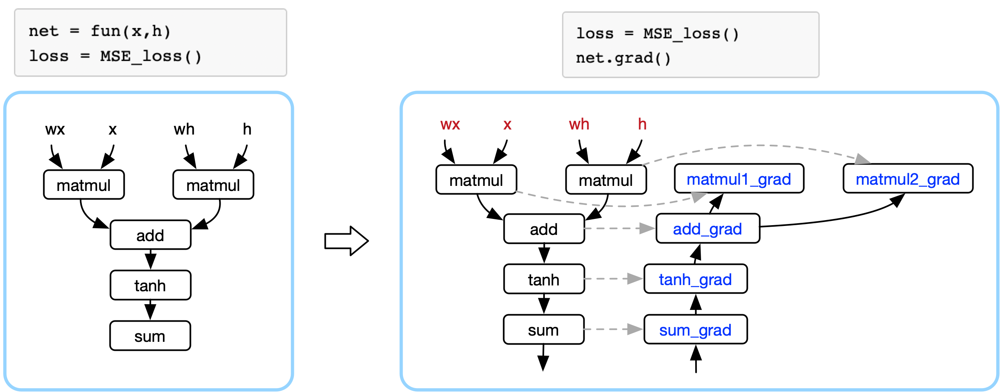

<!--适用于[License](https://github.com/chenzomi12/DeepLearningSystem/blob/main/LICENSE)版权许可-->

# AI框架作用

深度学习范式主要是通过发现经验数据中，错综复杂的结构进行学习。通过构建包含多个处理层的计算模型（网络模型），深度学习可以创建多个级别的抽象层来表示数据。例如，卷积神经网络CNN可以使用大量图像进行训练，例如对猫狗分类去学习猫和狗图片的特征。这种类型的神经网络通常从所采集图像中，包含的像素进行学习。

本章将从深度学习的原理开始，进而深入地讨论在实现深度学习的计算过程中使用到的AI框架，看看AI框架具体的作用和目的。

## 深度学习原理

深度学习的概念源于人工神经网络的研究，但是并不完全等于传统神经网络。在叫法上，很多深度学习算法中都会包含”神经网络”这个词，比如：卷积神经网络、循环神经网络。所以，深度学习可以说是在传统神经网络基础上的升级，约等于神经网络。

虽然深度学习理论最初创立于上世纪八十年代，但有两个主要原因导致其直到近年来才得以发挥巨大作用：

- 深度学习需要大量的标签化数据。例如，无人驾驶汽车模型训练需要数万亿张图片和数千万小时的视频进行学习。

- 深度学习需要巨大的计算能力。例如，需要局别并行架构和集群组网能力的高性能 GPU/NPU 对于深度学习计算进行加速。

### 神经网络

现在业界比较通用对神经网络概念的解释是：

1. 从通用概念的角度上来看的话，神经网络是在模拟人脑的工作机制，神经元与神经突触之间的连接产生不同的信号传递，每个神经元都记录着信号的特征。

2. 从统计学的角度来说，就是在预测数据的分布，从数据中学得一个模型，然后再通过这个模型去预测新的数据（这一点就要求测试数据和训练数据必须是同分布）。

实际上，一个神经网络由多个神经元结构组成，每一层的神经元都拥有多个输入和输出，一层可以由多个神经元组成。例如，第2层神经网络的神经元输出是第3层神经元的输入，输入的数据通过神经元上的激活函数（非线性函数如tanh、sigmod等），来控制输出的数值。

数学上简单地理解，单个神经元其实就是一个 $X·W$ 的矩阵乘，然后加一个激活函数 $fun(X·W)$，通过复合函数组合神经元，就变成一个神经网络的层。这种模拟生物神经元的数学计算，能够很好地对大规模独立同分布的数据进行非线性映射和处理，使得其能够应对到人工智能的不同任务。

### 函数逼近

现在，如果把神经网络看做一个复杂函数，那么这个函数可以逼近任何函数。上面只是定义了什么是神经网络，其实神经网络内部的参数（神经元链接间的权重）需要通过求解函数逼进来确定的。

直观地看下一个简单的例子：假设1个圆圈代表一个神经元，那么一个神经元可模拟“与或非”3种运算，3个神经元组成包含1个隐层的神经网络即可以模拟异或运算。因此，理论上，如此组合的神经网络可模拟任意组合的逻辑函数。

很多人会说神经网络只要网络模型足够深和足够宽，就可以拟合（fit）任意函数，这样的说法数学理论上靠谱吗？严格地说，神经网络并不是拟合任意函数，其数学理论建立在通用逼近定理（Universal approximation theorem）的基础之上：

> 神经网络则是传统的逼近论中的逼近函数的一种推广。逼近理论证明，只要神经网络规模经过巧妙的设计，使用非线性函数进行组合，它可以以任意精度逼近任意一个在闭集里的连续函数。

既然神经网络模型理论上能够逼近任何连续函数，那么有意思的事情就来了。我们可以利用神经网络处理数学上分类、回归、拟合、逼近等问题啦。例如在CV领域对人脸图像进行分类、通过回归检测图像中的车辆和行人，在NLP中对离散的语料数据进行拟合。

可是，神经网络介绍现在还只能逼近任何函数，逼近函数需要求解，怎么去求解神经网络呢？

函数逼近求解：在数学的理论研究和实际应用中经常遇到逼近求解问题，在选定的一类函数中寻找某个函数 $f$，使它与已知函数 $g$（或观测数据）在一定意义下为最佳近似表示，并求出用 $f$ 近似表示 $g$ 而产生的最小误差（即损失函数）：

$$ loss(w)=f(w)-g $$
:eqlabel:`fund_02_eq1`

所以，神经网络可以通过求解损失函数的最小值，来确定这个神经网络中的参数 $w$，从而固化这个逼近函数。

### 反向求导

深度学习一般流程是：1）构建神经网络模型，2）定义损失函数和优化器（优化目标），3）开始训练神经网络模型（计算梯度并更新网络模型中的权重参数），4）最后验证精度，其流程如下图所示，前三步最为重要。

因为AI框架已经帮我们封装好了许多功能，所以遇到神经网络模型的精度不达标，算法工程师可以调整网络模型结构、调节损失函数、优化器等参数重新训练，不断地测试验证精度，因此很多人戏称算法工程师又是“调参工程师”。

但是在这一过程中，这种机械的调参是无法触碰到深度学习的本质的，为了了解实际的工作原理，进行总结：**训练的过程本质是进行反向求导（反向传播算法实现）的过程，然后通过迭代计算求得神经网络中的参数，调整参数是控制这一过程的前进速度和方向。**

上面这段话我们仍然听不懂，没关系。我们需要了解的是，什么是训练？训练的作用是什么？为什么要求导？为什么在训练的过程中用到求导？求导的数学依据和意义在哪里？

> 导数是函数的局部性质。一个函数在某一点的导数，描述该函数在这一点附近的变化率。如果函数的自变量和取值都是实数的话，函数在某一点的导数就是该函数所代表的曲线在这一点上的切线斜率。

那么，针对导数的几何意义，其可以表示为函数在某点处的切线斜率；在代数上，其意味着可以求得函数的瞬时变化率。如果把神经网络看做一个高维复杂的函数，那么训练的过程就是对损失函数进行求导，利用导数的性质找到损失函数的变化趋势，每次一点点地改变神经网络仲的参数 $w$，最后逼近得到这个高维函数。

## AI框架的作用

### AI框架与微分关系

根据深度学习的原理，AI框架最核心和基础的功能是自动求导（后续统一称为自动微分，AutoGrad）。

接下来有个更加重要的问题，深度学习中的神经网络为什么需要反向求导？

按照高中数学的基本概念，假设神经网络是一个复合函数（高维函数），那么对这个复合函数求导，用的是链式法则。举个简单的例子，考虑函数 $z=f(x,y)$，其中 $x=g(t),t=h(t)$ ，其中 $g(t), h(t)$ 是可微函数，那么对函数 $z$ 关于 $t$ 求导，函数会顺着链式向外逐层进行求导。

$$ \frac{\mathrm{d} x}{\mathrm{d} t} = \frac{\partial z}{\partial x}  \frac{\mathrm{d} x}{\mathrm{d} t} + \frac{\partial z}{\partial y}  \frac{\mathrm{d} y}{\mathrm{d} t} $$
:eqlabel:`fund_02_eq2`

既然有了链式求导法则，而神经网络其实就是个庞大的复合函数，直接求导不就解决问题了吗？反向到底起了什么作用？下面来看几组公式。

假设用3组复合函数来表示一个简单的神经网络：

$$ L_1 = sigmoid(w_1\cdot x) $$
:eqlabel:`fund_02_eq3`

$$ L_2 = sigmoid(w_2\cdot L_1) $$
:eqlabel:`fund_02_eq4`

$$ L_3 = sigmoid(w_3 \cdot L_2) $$
:eqlabel:`fund_02_eq5`

现在定义深度学习中网络模型的损失函数，即优化目标：

$$ loss = Loss(L_3,y) $$
:eqlabel:`fund_02_eq6`

根据链式求导法则可以得到：

$$ \frac{\partial loss}{\partial w_3} = {Loss}'(L_3, y) {sigmoid}'(w_3,L_2)L_2 $$
:eqlabel:`fund_02_eq7`

$$ \frac{\partial loss}{\partial w_2} = {Loss}'(L_3, y) {sigmoid}'(w_3,L_2) {sigmoid}'(w_2,L_1) L_1 $$
:eqlabel:`fund_02_eq8`

$$ \frac{\partial loss}{\partial w_1} = {Loss}'(L_3, y) {sigmoid}'(w_3,L_2) {sigmoid}'(w_2,L_1) {sigmoid}'(w_1,x) x $$
:eqlabel:`fund_02_eq9`

 假设神经网络为上述公式 $L_1,L_2, L_3$，对损失函数求神经网络中各参数求偏导，可以看到在接下来的求导公式中，每一次导数的计算都可以重用前一次的的计算结果，于是Paul Werbos在1975年发明了反向传播算法（并在1990重新使用神经网络对反向求导进行表示）。
 
 这里的反向，指的是图中的反向箭头，每一次对损失函数中的参数进行求导，都会复用前一次的计算结果和与其对称的原公式中的变量，更方便地对复合函数进行求导。

### AI框架与程序结合

下面左图的公式是神经网络表示的复合函数表示，蓝色框框表示的是AI框架，AI框架给开发者提供构建神经网络模型的数学操作，AI框架把复杂的数学表达，转换成计算机可识别的计算图。

定义整个神经网络最终的损失函数为 $Loss$ 之后，AI框架会自动对损失函数求导（即对神经网络模型中各个参数求其偏导数）。

上面提到过，每一次求导都会复用前一次的计算结果和与其对称的原公式中的变量。那么干脆直接基于表示神经网络的计算图计的基础之上，构建一个与之对称的计算图（反向计算图）。通过反向计算图表示神经网络模型中的偏导数，反向传播则是对链式求导法则的展开。

通过损失函数对神经网络模型进行求导，训练过程中更新网络模型中的参数（函数逼近的过程），使得损失函数的值越来越小（表示网络模型的表现越好）。这一过程，只要你定义好网络AI框架都会主动地帮我们完成。

很有意思的是，AI框架对整体开发流程进行了封装，好处是让算法研究人员专注于神经网络模型结构的设计（更好地设计出逼近复合函数），针对数据集提供更好的解决方案，研究让训练加速的优化器或者算法等。

综上所述，**AI框架最核心的作用是提供开发者构建神经网络的接口（数学操作），自动对神经网络训练（进行反向求导，逼近地求解最优值），得到一个神经网络模型（逼近函数）用于解决分类、回归、拟合的问题，实现目标分类、语音识别等应用场景。**

## 本节视频

<html>
<iframe src="https://player.bilibili.com/player.html?aid=388680558&bvid=BV1fd4y1q7qk&cid=911393542&page=1&as_wide=1&high_quality=1&danmaku=0&t=30&autoplay=0" width="100%" height="500" scrolling="no" border="0" frameborder="no" framespacing="0" allowfullscreen="true"> </iframe>
</html>
