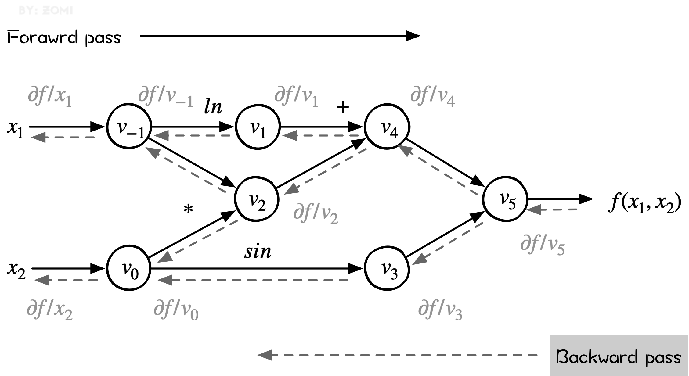

<!--适用于[License](https://github.com/chenzomi12/DeepLearningSystem/blob/main/LICENSE)版权许可-->

# 微分计算模式

上一节简单了解计算机中常用几种微分方式。本章将深入介绍AI框架离不开的核心功能：自动微分。

而自动微分则是分为前向微分和后向微分两种实现模式，不同的实现模式有不同的机制和计算逻辑，而无论哪种模式都离不开雅克比矩阵，所以我们也会深入了解一下雅克比矩阵的原理。

## 雅克比矩阵

在向量微积分中，Jacobian矩阵是一阶偏导数以一定方式排列成的矩阵，其行列式称为Jacobian行列式。Jacobian矩阵的重要性在于它体现了一个可微方程与给出点的最优线性逼近。

Jacobian 矩阵表示两个向量所有可能的偏导数。它是一个向量相对于另一个向量的梯度，其实现的是 $n$ 维向量到 $m$ 维向量的映射。

在矢量运算中，Jacobian 矩阵是基于函数对所有变量一阶偏导数的数值矩阵，当输入个数等于输出个数时又称为Jacobian行列式。

假设输入向量 $𝑥∈𝑅_𝑛$，而输出向量 $𝑦∈𝑅_𝑚$，则 Jacobian 矩阵定义为：

$$ J_f= \left[ \begin{matrix} \dfrac{\delta y_1}{\delta x_1} & \cdots & \dfrac{\delta y_1}{\delta x_n} \\ \vdots & \ddots & \vdots \\ \dfrac{\delta y_m}{\delta x_1} & \vdots & \dfrac{\delta y_m}{\delta x_n} \end{matrix} \right] $$
:eqlabel:`diff_03_eq1`

## **微分计算模式**

根据对分解后的基本操作求导和链式规则组合顺序的不同，自动微分可以分为两种模式：

- *前向模式*（Forward Automatic Differentiation，也叫做 tangent mode AD）或者前向累积梯度（前向模式）
- *反向模式*（Reverse Automatic Differentiation，也叫做 adjoint mode AD）或者说反向累计梯度（反向模式）。

### 计算模式区别

两种自动微分模式都通过递归方式来求 $dy/dx$，只不过根据链式法则展开的形式不太一样。

前向梯度累积会指定从内到外的链式法则遍历路径，即先计算 $dw_1/dx$，再计算 $dw_2/dw_1$，最后计算 $dy/dw_2$。即，前向模式是在计算图前向传播的同时计算微分。因此前向模式的一次正向传播就可以计算出输出值和导数值。

$$ \frac{dw_i}{dx}=\frac{dw_i}{dw_{i-1}}\frac{dw_{i-1}}{dx} $$
:eqlabel:`diff_03_eq2`

反向梯度累积正好相反，它会先计算 $dy/dw_2$，然后计算 $dw_2/dw_1$，最后计算 $dw_1/dx$。这是最为熟悉的反向传播模式，它非常符合**沿模型误差反向传播**这一直观思路。

即，反向模式需要对计算图进行一次正向计算， 得出输出值，再进行反向传播。反向模式需要保存正向传播的中间变量值（比如$𝑤_𝑖$），这些中间变量数值在反向传播时候被用来计算导数，所以反向模式的内存开销要大。

$$ \frac{dy}{dw_i}=\frac{dy}{dw_{i+1}}\frac{dw_{i+1}}{dw_i} $$
:eqlabel:`diff_03_eq3`

即如图所示，前向自动微分（tangent mode AD）和后向自动微分（adjoint mode AD）分别计算了Jacobian矩阵的一列和一行。

:width:`600px`
:label:`image1`

前向自动微分（tangent mode AD）可以在一次程序计算中通过链式法则，得到：

$$ \frac{\delta x^k}{\delta x^0_j} = \frac{\delta x^k}{\delta x^{k-1}} \frac{\delta ^{k-1}}{\delta x^0_j} $$
:eqlabel:`diff_03_eq4`

递推得到 Jacobian 矩阵中与单个输入有关的参数，即 Jacobian矩 阵的一列。

后向自动微分（adjoint mode AD）利用链式法则，得到：

$$ \frac{\delta x^L_i}{\delta x^k}= \frac{\delta x^L_i}{\delta x^{k+1}} \frac{\delta ^{k+1}}{\delta x^k} $$
:eqlabel:`diff_03_eq5`

可以仅通过一次对计算过程的遍历得到Jacobian矩阵的一行。但它的导数链式法则传递方向和程序执行方向相反，所以需要在程序计算过程中记录一些额外的信息来辅助求导，这些辅助信息包括计算图和计算过程的中间变量。

### 样例

我们以公式为例，首先把它转换成一个计算图：

$$ f(x1,x2)=ln(x1)+x1x2−sin(x2) $$
:eqlabel:`diff_03_eq6`

- 输入变量 ：自变量维度为 $n$，这里 $n = 2$，输入变量就是 $x1$, $x2$
- 中间变量 ：中间变量这里是 $v-1$ 到 $v5$，在计算过程中，只需要针对这些中间变量做处理即可。将符号微分法应用于最基本的算子，然后代入数值，保留中间结果，最后再应用于整个函数
- 输出变量 ：假设输出变量维度为 $m$，这里 $m = 1$，输出变量就是 $y1$，也就是 $f(x1,x2)$

:width:`600px`

转化成如上 DAG（有向无环图）结构之后，我们可以很容易分步计算函数的值，并求取它每一步的导数值，然后，我们把 $df/dx_1$ 求导过程利用链式法则表示成如下的形式：

$$ \dfrac{df}{dx_1}= \dfrac{dv_{-1}}{dx_1} \cdot (\dfrac{dv_{1}}{dv_{-1}} \cdot \dfrac{dv_{4}}{dv_{1}} + \dfrac{dv_{2}}{dv_{-1}} \cdot \dfrac{dv_{4}}{dx_{2}}) \cdot \dfrac{dv_{5}}{dv_{4}} \cdot \dfrac{df}{dv_{5}} $$
:eqlabel:`diff_03_eq7`

> 整个求导可以被拆成一系列微分算子的组合。

## 前向模式 Foward Mode

前向模式从计算图的起点开始，沿着计算图边的方向依次向前计算，最终到达计算图的终点。它根据自变量的值计算出计算图中每个节点的值 以及其导数值，并保留中间结果。一直得到整个函数的值和其导数值。整个过程对应于一元复合函数求导时从最内层逐步向外层求导。

同样，以公式为例子：

$$ f(x1,x2)=ln(x1)+x1x2−sin(x2) $$
:eqlabel:`diff_03_eq8`

面是前向模式的计算过程，下表中，左半部分是从左往右每个图节点的求值结果和计算过程，右半部分是每个节点对 x1的求导结果和计算过程。这里 $𝑉˙𝑖$ 表示 $𝑉𝑖$ 对 $𝑥1$ 的偏导数。即：

$$ \dot{v_i}=\dfrac{\delta v_i}{\delta x_1} $$
:eqlabel:`diff_03_eq9`

在该示例中，我们希望计算函数在x_1=2, x_2=5处的导数dy/dx1，即：

$$ \dot{y_j}=\dfrac{\delta y_j}{\delta x_i} $$
:eqlabel:`diff_03_eq10`

可以看出，左侧是源程序分解后得到的基本操作集合，而右侧则是每一个基本操作根据已知的求导规则和链式法则由上至下计算的求导结果。

### 计算过程

根据上图左边的Forward Primal Trace直接计算公式，对于节点数值的计算如下：

1. 我们给输入节点赋值，$v_{−1}=x_1=2，v_0=x_2=5$
2. 计算 $v_1$ 节点，$v_1=lnv_{−1}=lnx_1=ln2$
3. 计算 $v_2$ 节点，节点 $v_2$ 依赖于 $v_{-1}$ 和 $v_0$，$v_2=10$
4. 计算 $v_3$ 节点，$v_3=sinv_0=sin5$
5. 计算 $v_4$ 节点，$v_4=v_1+v_2=0.693+10$
6. 计算 $v_5$ 节点，$v_5=v_1+v_2=10.693+0.959$
7. 最终 $y=v_5=11.652$

此时，已经得到了图中所有节点的数值。自动微分正向模式中（上图右边Forward Tangent Trace），在计算节点数值的同时，也一起计算导数，假设求 $\delta y/ \delta x_1$，则是从输入开始计算。

1. 计算 $v_{-1}$ 节点对于 $x_1$ 的梯度：$v_{-1}=x_1$，所以 $\delta v_{-1}/ \delta x_1=1$
2. 计算 $v_0$ 节点对于 $x_1$ 的梯度：$v_0=x_2$，所以 $\delta v_0/ \delta x_1=0$
3. 计算 $v_{1}$ 节点对于 $x_1$ 的梯度：$\delta v_1/ \delta x_1=0.5$
4. 计算 $v_{2}$ 节点对于 $x_1$ 的梯度：$\delta v_{2}/ \delta x_1=(\delta v_{-1}/ \delta x_1)v_0+(\delta v_{0}/ \delta x_1)v_{-1}=5$
5. 计算 $v_{3}$ 节点对于 $x_1$ 的梯度：$\delta v_{3}/ \delta x_1=(\delta v_{0}/ \delta x_1)cosv_0=0$
6. 计算 $v_{4}$ 节点对于 $x_1$ 的梯度：$\delta v_{4}/ \delta x_1=\delta v_{1}/ \delta x_1+\delta v_{2}/ \delta x_1=0.5+5$
7. 计算 $v_{5}$ 节点对于 $x_1$ 的梯度：$\delta v_{5}/ \delta x_1=5.5=0$
8. 因此，得到 $\delta y/ \delta x_1=\delta v_{5}/ \delta x_1=5.5$

从计算过程来看啦，自动微分的前向模式实际上与我们在微积分里所学的求导过程一致。

### 雅克比-向量矩阵

把上述过程当做雅克比矩阵求解问题，假设一个函数有 n 个输入变量 $x_i$，m个输入变量 $y_j$，即输入向量 $x \in R^n, y \in R^m$，则这个的映射是：

$$ f:R^n \to R^m $$
:eqlabel:`diff_03_eq11`

在这种情况下，每个自动微分的前向传播计算时候，初始输入被设置为 $\dot{x_i}=1$，其余被设置为 0。对应Jacobian矩阵定义为：

$$ J_f= \left[ \begin{matrix} \dfrac{\delta y_1}{\delta x_1} & \cdots & \dfrac{\delta y_1}{\delta x_n} \\ \vdots & \ddots & \vdots \\ \dfrac{\delta y_m}{\delta x_1} & \vdots & \dfrac{\delta y_m}{\delta x_n} \end{matrix} \right] $$
:eqlabel:`diff_03_eq12`

一次前向计算，可以求出Jacobian矩阵的一列数据，如 $\dot{x_3}=1$ 对应就可以求出来第3列。tangent mode AD可以在一次程序计算中，通过链式法则递推得到Jacobian矩阵中与单个输入有关的部分，即Jacobian矩阵的一列。

如图 :numref:`image1`, 所示，如果想用正向模式求对所有输入的导数，需要计算 n 次才能求出所有列。

进一步，设置 $\dot{x}=r$，可以在一次前向传播中直接计算 Jacobian–vector 乘积：

$$J_f \cdot r= \left[ \begin{matrix} \dfrac{\delta y_1}{\delta x_1} & \cdots & \dfrac{\delta y_1}{\delta x_n} \\ \vdots & \ddots & \vdots \\ \dfrac{\delta y_m}{\delta x_1} & \vdots & \dfrac{\delta y_m}{\delta x_n} \end{matrix} \right] \left[ \begin{matrix} r_1 \\ \vdots \\ r_n \\ \end{matrix} \right] $$
:eqlabel:`diff_03_eq13`

最终我们可以递归的得到本次迭代的计算目标：雅克比矩阵中的第 i 行。

### 优缺点

前向模式的优点：

- 实现起来很简单
- 也不需要很多额外的内存空间

向前模式的缺点：

- 每次前向计算只能计算对一个自变量的偏导数，对于一元函数求导是高效的，但是机器学习模型的自参数（入参）数量级大。
- 如果有一个函数，其输入有 n 个，输出有 m个，对于每个输入来说，前向模式都需要遍历计算过程以得到当前输入的导数，求解整个函数梯度需要 n 遍如上计算过程。

## 反向模式 Reverse Mode

反向自动微分同样是基于链式法则。仅需要一个前向过程和反向过程，就可以计算所有参数的导数或者梯度。

因为需要结合前向和后向两个过程，因此反向自动微分会使用一个特殊的数据结构，来存储计算过程。

而这个特殊的数据结构例如Tensorflow或者MindSpore，则是把所有的操作以一张图的方式存储下来，这张图可以是一个有向无环（DAG）的计算图；而Pytroch则是使用Tape来记录每一个操作，他们都表达了函数和变量的关系。

反向模式根据从后向前计算，依次得到对每个中间变量节点的偏导数，直到到达自变量节点处，这样就得到了每个输入的偏导数。在每个节点处，根据该节点的后续节点（前向传播中的后续节点）计算其导数值。

整个过程对应于多元复合函数求导时从最外层逐步向内侧求导。这样可以有效地把各个节点的梯度计算解耦开，每次只需要关注计算图中当前节点的梯度计算。

从下图可以看出来，reverse mode和forward mode是一对相反过程，reverse mode从最终结果开始求导，利用最终输出对每一个节点进行求导。下图虚线就是反向模式。

:width:`600px`

### 计算过程

前向和后向两种模式的过程表达如下，表的左列浅色为前向计算函数值的过程，与前向计算时相同，右面列深色为反向计算导数值的过程。

反向模式的计算过程如图所示，其中：

$$ \overline{v_i}=\dfrac{\delta y}{\delta v_i} $$
:eqlabel:`diff_03_eq14`

根据链式求导法则展开有：

$$ \frac{\partial f}{\partial x}=\sum_{k=1}^{N} \frac{\partial f}{\partial v_{k}} \frac{\partial v_{k}}{\partial \boldsymbol{x}} $$
:eqlabel:`diff_03_eq15`

可以看出，左侧是源程序分解后得到的基本操作集合，而右侧则是每一个基本操作根据已知的求导规则和链式法则**由下至上**计算的求导结果。

1. 计算 $y$ 对 $v_5$ 的导数值，即 $\overline{v}_5=\overline{y}=1$
2. 计算 y 对 $v_4$ 的导数值，$\overline{v}_4=\overline{v}_5\frac{\delta{v_5}}{\delta{v_4}}=1$
3. 计算 y 对 $v_3$ 的导数值，$\overline{v}_3=\overline{v}_5\frac{\delta{v_5}}{\delta{v_3}}=-1$
4. 计算 y 对 $v_1$ 的导数值，$\overline{v}_1=\overline{v}_4\frac{\delta{v_4}}{\delta{v_1}}=1$
5. 计算 y 对 $v_2$ 的导数值，$\overline{v}_2=\overline{v}_4\frac{\delta{v_4}}{\delta{v_1}}=1$
6. 接下来要计算 y 对 $v_0$ 的导数值和 y 对 $v_{-1}$ 的导数值，因为 $v_0$ 和 $v_{-1}$ 都是后续有两个节点，因此需要分开计算。
7. 计算 $\frac{\delta{v_3}}{\delta{v_0}}=cosv_0=0.284$
8. 计算 $\frac{\delta{v_2}}{\delta{v_0}}=v_{-1}=2$
9. 计算 $\frac{\delta{v_2}}{\delta{v_{-1}}}=v_0=5$
10. 计算 $\frac{\delta{v_1}}{\delta{v_{-1}}}=\frac{1}{x_1}=0.5$

到目前为止，我们已经计算出来了所有步骤的偏导数的数值。现在需要计算 $\overline{v}_1$ 和 $\overline{v}_2$ 。计算 $\overline{v}_1$ 从最后的位置往前到自变量 x_1，有多条路径，需要将这个路径上的数值连乘起来得到一个乘积数值，然后将这多条路径的乘积数值相加起来得到最后的结果。

从 y 到 x_1 的路径有两条，分别是：

1. $v_5 \to v_4 \to v_1 \to v_{-1}$，其数值乘积是 1∗1∗0.5=0.5
2. $v_5 \to v_4 \to v_2 \to v_{-1}$，其数值乘积是 1∗1∗ 5= 5

因此，$\overline{v}_1=0.5+5=5.5$，同理有 $\overline{v}_2=2.0-0.284=1.716$

### 向量-雅克比矩阵

对于函数 $\overline{y}=f(\overline{x})$，其中 $f: \mathbb{R}^{n} \rightarrow \mathbb{R}^{m}$，那么 $\overline{y}$ 中关于 $\overline{x}$ 的梯度可以表示为 Jacobian 矩阵：

$$ J_{f}= \left[\begin{array}{ccc} \dfrac{\partial y}{\partial x_{1}} & \cdots & \dfrac{\partial y}{\partial x_{1}} \end{array}\right]= \left[\begin{array}{ccc} \dfrac{\partial y_{1}}{\partial x_{1}} & \cdots & \dfrac{\partial y_{1}}{\partial x_{n}} \\ \vdots & \ddots & \vdots \\ \dfrac{\partial y_{m}}{\partial x_{1}} & \cdots & \dfrac{\partial y_{m}}{\partial x_{n}} \end{array}\right] $$
:eqlabel:`diff_03_eq16`

设置 $\overline{v}$ 是关于函数 $l=g(\overline{y})$ 的梯度：

$$ \overline{v}= \left[\begin{array}{lll} \dfrac{\partial l}{\partial y_{1}} & \cdots & \dfrac{\partial l}{\partial y_{m}} \end{array}\right]^{\mathrm{T}} $$
:eqlabel:`diff_03_eq17`

Jacobian-vector 积就是函数 l 中关于 x_1 的梯度：

$$ \boldsymbol{J}^T \cdot \overline{v}= \left[\begin{array}{ccc} \dfrac{\partial y_{1}}{\partial x_{1}} & \cdots & \dfrac{\partial y_{1}}{\partial x_{n}} \\ \vdots & \ddots & \vdots \\ \dfrac{\partial y_{m}}{\partial x_{1}} & \cdots & \dfrac{\partial y_{m}}{\partial x_{n}} \end{array}\right] \cdot\left[\begin{array}{c} \dfrac{\partial l}{\partial y_{1}} \\ \vdots \\ \dfrac{\partial l}{\partial y_{m}} \end{array}\right]=\left[\begin{array}{c} \dfrac{\partial y_{1}}{\partial x_{1}} \\ \vdots \\ \dfrac{\partial y_{m}}{\partial x_{1}} \end{array}\right] $$
:eqlabel:`diff_03_eq18`

即通过雅克比矩阵转置与后续节点梯度值的乘积，可以得到当前节点的梯度值。

### 优缺点

前向模式在计算之中，计算图各个节点的数值和该节点的导数可同步求出，但是代价就是对于多个输入需要多次计算才行。

反向模式的优点：

- 通过一次反向传输，就计算出所有偏导数，中间的偏导数计算只需计算一次

- 减少了重复计算的工作量，在多参数的时候后向自动微分的时间复杂度更低

反向模式的缺点：

- 需要额外的数据结构记录正向过程的计算操作，用于反向使用

- 带来了大量内存占用，为了减少内存操作，需要深度学习框架进行各种优化，也带来了额外限制和副作用

## 正反向模式的比较

前向自动微分（tangent mode AD和后向自动微分（adjoint mode AD）分别计算了Jacobian矩阵的一列和一行。

前向模式和反向模式的不同之处在于矩阵相乘的起始之处不同。

当输出维度小于输入维度，反向模式的乘法次数要小于前向模式。因此，当输出的维度大于输入的时候，适宜使用前向模式微分；当输出维度远远小于输入的时候，适宜使用反向模式微分。

即，后向自动微分更加适合多参数的情况，多参数的时候后向自动微分的时间复杂度更低，只需要一遍reverse mode的计算过程，便可以求出输出对于各个输入的导数，从而轻松求取梯度用于后续优化更新。

因此，目前大部分AI框架都会优先采用反向模式，但是也有例如MindSpore等AI框架同事支持正反向的实现模式。

## 本节视频

<html>
<iframe src="https://player.bilibili.com/player.html?aid=730968276&bvid=BV1zD4y117bL&cid=854595253&page=1&as_wide=1&high_quality=1&danmaku=0&t=30&autoplay=0" width="100%" height="500" scrolling="no" border="0" frameborder="no" framespacing="0" allowfullscreen="true"> </iframe>
</html>
