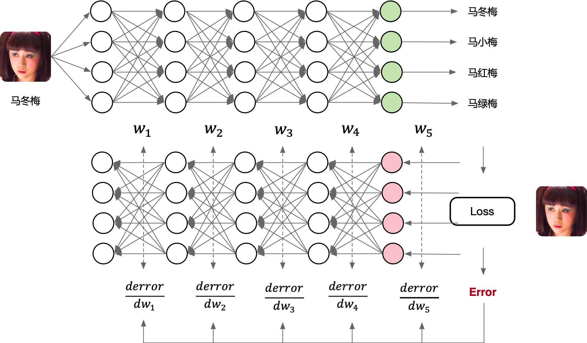
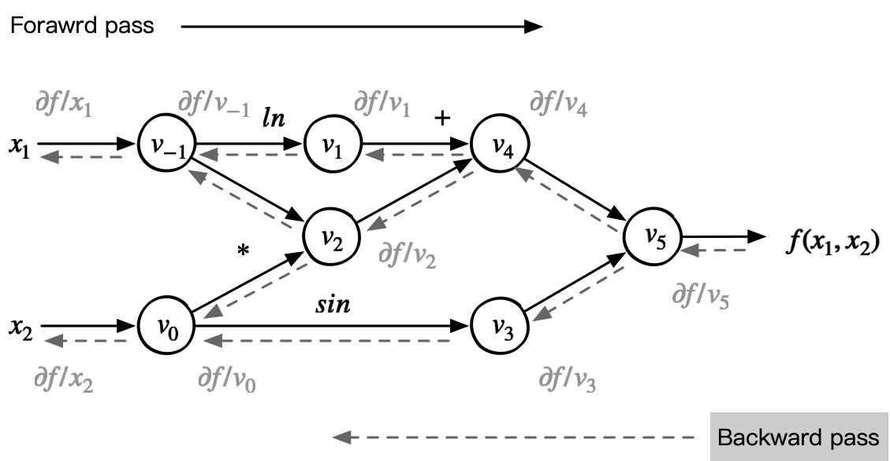
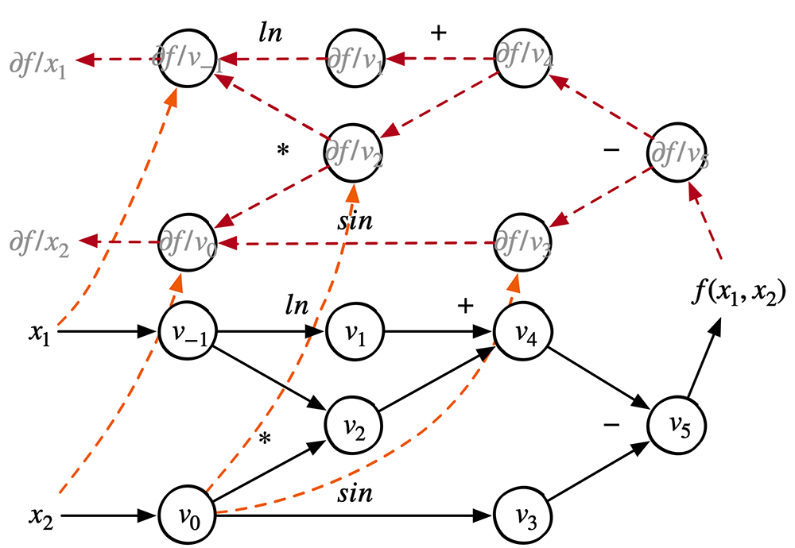

<!--适用于[License](https://github.com/chenzomi12/DeepLearningSystem/blob/main/LICENSE)版权许可-->

# 计算图与自动微分

自动求导应用链式法则求某节点对其他节点的雅可比矩阵，它从结果节点开始，沿着计算路径向前追溯，逐节点计算雅可比。将神经网络和损失函数连接成一个计算图，则它的输入、输出和参数都是节点，可利用自动求导求损失值对网络参数的雅可比，从而得到梯度。

在前面的内容我们深入地探讨过自动微分的原理，可是AI框架中神经网络模型怎么跟自动产生连接关系呢？自动微分跟反向传播是什么关系呢？在实际AI框架的实现中，自动微分的实现方式有什么变化吗？

## 深度学习训练流程

### 训练神经网络

深度学习的基本原理是设计一个多参数的非线性组合模型，即多层神经网络，因此深度学习的形式表示为神经网络模型。

如图所示，通过这个神经网络模型可以用来近似（拟合）一个无法求解的复杂函数 $y = fun(x)$，其中输入变量 x 和输出变量 y 皆为高维变量。具体训练过程主要分为以下三个部分：

1. **前向计算**：定义这神经网络模型的前向传播过程，即网络训练的forward部分，张量数据输入神经网络模型，模型输出具体的预测值，类似 y=fun(x)。这里的前向传播（forward propagation或forward pass）指的是按顺序（从输入层到输出层）计算和存储神经网络中每层的结果。

2. **计算损失**：根据损失函数的定义，一般为真实样本的 $(y，x)$ 和神经网络模型的预测 $(y’, z)$ 的比较函数。在损失函数中分别对每个维度的参数求其偏导数，得到每个参数的偏导数值即 `x_i.grad()`。

3. **更新权重参数**：根据优化器（Optimizer）的学习策略，小幅通过反向计算图更新网络模型中的各个权重参数的梯度，即反向传播的过程（backward propagation 或 backward pass）。先看其梯度的 grad 正负，再根据正负方向对原参数值加减一定比例的梯度值。假设更新公式为 $w = w - n*grad$, 如果梯度值为正，网络模型的权重参数就会减小；如果梯度值为负，网络模型的权重参数值就会增大。

在训练神经网络时，前向传播和反向传播相互依赖。对于前向传播，沿着依赖的方向遍历计算图并计算其路径上的所有变量。然后将这些用于反向传播，其中计算顺序与计算图的相反。

以上述简单网络为例：一方面，在前向传播期间计算正则项取决于模型参数和的当前值。它们是由优化算法根据最近迭代的反向传播给出的。另一方面，反向传播期间参数的梯度计算，取决于由前向传播给出的隐藏变量的当前值。

如图所示，在训练神经网络时，在初始化模型参数后，我们交替使用前向传播和反向传播，利用反向传播给出的梯度来更新模型参数。

> 注意，反向传播重复利用前向传播中存储的中间值，以避免重复计算。带来的影响之一是我们需要保留中间值，直到反向传播完成。这也是训练比单纯的预测需要更多的内存（显存）的原因之一。 此外，这些中间值的大小与网络层的数量和批量的大小大致成正比。



因此，在深度学习神经网络训练的核心是求导，计算神经网络模型的参数 $w$，并根据损失函数更新其梯度 $\frac{\partial L(w)}{\partial w}$，即：

$$ L(w)=Loss(f(w, x_i),y_i) \Rightarrow \frac{\partial L(w)}{\partial w} $$
:eqlabel:`autodiff_03_eq1`

### 反向传播与自动微分

在计算图的概念中会经常提到自动微分功能，通过自动微分来构建反向的计算图。而在神经网络模型的训练流程和训练原理中，主要会提及反向传播算法，优化器对损失函数进行求导后的值，通过反向传播算法把传递给神经网络的每一层参数进行更新。那么在AI框架中，自动微分和反向传播之间的关系是什么呢？

首先，自动微分是将复合函数分解为输出变量（根节点）和一系列的输入变量（叶子节点）及基本函数（中间节点），构成一个计算图，并以此计算任意两个节点间的梯度：

- 加法法则：任意两个节点间的梯度为它们两节点之间所有路径的偏微分之和

- 链式法则：一条路径的偏微分为路径上各相邻节点间偏微分的连乘

而在神经网络中，只要各个组件以及损失函数都是可微的，那么损失函数就是关于各个输入变量的可微的复合函数。这个时候就可以使用自动微分的方式去计算神经网络模型里面的输入变量梯度，从而使用梯度下降算法减小误差。

因此，反向传播算法实际上就是自动微分，只不过在AI框架中，实际上计算图中的根节点为度量误差的损失函数，因而把节点间的偏导称为误差项。

## 自动微分基础回顾

神经网络模型的训练流程中，主要包含网络模型的1）前向计算，2）计算损失，3）更新权重参数三个最主要的计算阶段。

当开发者使用 AI 框架提供的 Python API 构造完成一个深度神经网络时，在数学上这个网络模型对应了一个复杂的带参数的高度非凸函数，求解其中的可学习参数依赖于基于一阶梯度的迭代更新法。

```Python
class LeNet(nn.Module):

    def __init__(self):
        super(LeNet, self).__init__()
        self.conv1 = nn.Conv2d(1, 6, 5, padding=2)
        self.conv2 = nn.Conv2d(6, 16, 5)
        self.fc1 = nn.Linear(16*5*5, 120)
        self.fc2 = nn.Linear(120, 84)
        self.fc3 = nn.Linear(84, 10)

    def forward(self, x):
        x = F.max_pool2d(F.relu(self.conv1(x)), (2, 2))
        x = F.max_pool2d(F.relu(self.conv2(x)), (2, 2))
        x = x.view(-1, self.num_flat_features(x))
        x = F.relu(self.fc1(x))
        x = F.relu(self.fc2(x))
        x = self.fc3(x)
        return x
```

手工计算复杂函数的一阶梯度非常容易出错，自动微分（Automatic Differentiation，AD）就正为了解决这一问题而设计的一种自动化方法。自动微分关注给定一个由原子操作构成的复杂前向计算程序，如何自动生成出高效的反向计算程序。

自动微分按照工作模式可分为前向自动微分和反向自动微分，按照实现方式，自动微分又可为：

- 基于对偶数的前向微分

- 基于Tape的反向微分

- 和基于源代码转换的反向微分

### 前向计算

自动微分是 AI 框架的核心组件之一，在进入 AI 框架如何实现自动微分之前，我们先通过一个简单的例子理解自动微分的基本原理。

假设一个简单的复合函数为例子：

$$ f(x1,x2)=ln(x1)+x1*x2−sin(x2) $$
:eqlabel:`autodiff_03_eq2`

下图是函数对应的计算图：


:width:`550px`

假设给定复合函数 $f(x1,x2)$ 中，$x1$ 和 $x2$ 均为输入变量。为了对 $f(x1,x2)$ 求值，依照表达式对应的计算图定义的计算顺序，复合函数 $f(x1,x2)$ 可以被分解成一个求值序列，把一个给定输入逐步计算输出的求值序列称之为前向计算过程：


:width:`400px`

通过上图可得知，前向计算过程是引入一系列的中间变量，将一个复杂的函数，分解成一系列基本函数或者叫做基本的计算操作，最后将这些基本函数构成一个前向的计算图。

### 反向微分

链式求导法则是对称的，在计算导数 $\partial {f(x1,x2)} / \partial x$ 时，链式求导法则并不关心哪个变量作为分母，哪个变量作为分子。

于是，反向模式根据从后向前计算，依次得到对每个中间变量节点的偏导数，直到到达自变量节点处，这样就得到了每个输入的偏导数。在每个节点处，根据该节点的后续节点（前向传播中的后续节点）计算其导数值。其对应的反向微分计算公式为：


:width:`400px`

对于上面表达式求值的过程称之为反向微分。在反向微分中，变量导数的计算顺序与变量的前向计算顺序正好相反；运行的时间复杂度是 $O(m)$，$m$ 是输出变量的个数。因此可以构建相对应的反向计算图：


:width:`550px`

在神经网络以及大量基于一阶导数方法进行训练的机器学习算法中，不论输入变量数目有多少，模型的输出一定是一个标量函数（即对应损失函数）。这决定了保留前向计算的所有中间结果，只需再次运行程序一次，便可以用反向微分算法计算出损失函数对每个中间变量和输入的导数。

在反向微分的运行过程中，需要保留神经网络所有中间层前向结算的结果，对越接近输入层的中间层，其计算结果首先被压入栈中，而在反向计算时越晚被弹出栈。显然，网络越深，反向微分会消耗越多的内存，形成一个巨大的内存池。

### 计算图的自动微分

在神经网络训练过程中，可以将每一个基本表达式理解为计算图中的一个结点，这个结点上面的标量形式的表达式进行了向量化的推广，因为 AI 框架的计算图中的数据统一表示为张量这一数据结构。

假设，$\mathbf{Y} = G(\mathbf{X})$ 作为基本求导原语，其中 $\mathbf{Y} = [y_1, \cdots, y_m]$ 和 $\mathbf{X}=[x_1, \cdots, x_n]$ 都是向量。这时，$\mathbf{Y}$ 对 $\mathbf{X}$ 的导数不再是一个标量，而是由偏导数构成的雅克比矩阵 $J$（Jacobian matrix）：

$$
J = \left[\frac{\partial \mathbf{Y}}{\partial x_1}, \cdots, \frac{\partial \mathbf{Y}}{\partial x_n} \right] = \begin{bmatrix}
\frac{\partial y_1}{\partial x_1} \quad \cdots \quad \frac{\partial y_1}{\partial x_n} \\
\vdots \quad \ddots \quad \vdots \\
\frac{\partial y_m}{\partial x_1} \quad \cdots \quad \frac{\partial y_m}{\partial x_n}
\end{bmatrix}
$$

反向传播算法过程中，即反向微分（自动微分的反向模式），中间层 $\mathbf{Y} = G(\mathbf{X})$ 会收到上一层计算出的损失函数对当前层输出的导数：

$\mathbf{v} = \frac{\partial l}{\partial \mathbf{Y}} = \left[\frac{\partial l}{\partial y_1} \ \cdots \ \frac{\partial l}{\partial y_m} \right]$

然后将该导数继续乘以该层输出对输入的雅克比矩阵 $J$ 向更上一层传播，这个乘法称为向量-雅克比（vector-Jacobian）乘积。

反向传播过程中如果直接存储雅克比矩阵，会消耗大量存储空间。取而代之，如果只存储向量-雅克比的乘积，在减少存储的同时并不会阻碍导数的计算。因此，AI 框架在实现自动微分时，对每个中间层存储的都是向量-雅克比的乘积，而非雅克比矩阵。

$$
\mathbf{v} \cdot J = \begin{bmatrix}
\frac{\partial l}{\partial y_1} \cdots \frac{\partial l}{\partial y_m}
\end{bmatrix} \begin{bmatrix}
\frac{\partial y_1}{\partial x_1} \quad \cdots \quad \frac{\partial y_1}{\partial x_n} \\
\vdots \quad \ddots \quad \vdots \\
\frac{\partial y_m}{\partial x_1} \quad \cdots \quad \frac{\partial y_m}{\partial x_n}
\end{bmatrix} = \begin{bmatrix}
\frac{\partial l}{\partial x_1} \cdots \frac{\partial l}{\partial x_n}
\end{bmatrix}
$$

AI 框架对于带有自动微分的计算图中的可导张量操作实现步骤具体如下：

- 同时注册前向计算结点和导数计算结点

- 前向结点接受输入计算输出

- 反向结点接受损失函数对当前张量操作输出的梯度 $\mathbf{v}$

- 当上一张量操作的输入和输出，计算当前张量操作每个输入的向量-雅克比乘积

在实际的 AI 框架构建的计算图中，并不是把正向节点和反向节点融合在一张图，而是构建起一张大图包括正向和反向，或者是构建起两张图，一张正向的计算图，一张反向的计算图，通过输出节点把正反向计算图链接在一起。


:width:`550px`

从图中可知，前向计算图和反向计算图有着完全相同的结构，区别在于计算流动的方向相反。计算图中的每个结点都是一个无状态的张量操作，结点的入边（incoming edge）表示张量操作的输入，出边表示张量操作的输出。

同时，由于梯度会依赖前向计算的输入或是计算结果，反向计算图中会有从前向计算图输入和输出张量指向反向计算图中导数计算结点的边。

## AI框架自动微分方式

在 AI 框架基于反向模式（Reverse Mode）的自动求导机制中，根据反向计算图的构建时机，又分为基于对偶图的自动求导、基于表达式追踪和图层IR的自动求导，基于对偶图的求导方式通常与图层IR相结合，而使用动态图的 AI 框架多采用基于表达式追踪的自动求导方式。


### 动态计算图

AI框架中实现自动微分最常用的一种方法是使用**表达式追踪（Evaluation Trace）**的方式，即追踪数值计算过程的中间变量。简单的说，就是对应上一节说到的在前向计算过程中保留中间计算结果，根据反向模式的原理依次计算出中间导数，反向计算的过程当中复用正向计算所保留的中间结果。

其中在业界主流的AI框架 PyTorch 和 PyTorch Autograd 都采用了一种称为**基于磁带（tape-based）**的自动微分技术：假设一个磁带式录音机来记录当前所执行的操作，然后它向后重放，来计算每一层的梯度。即会将上下文的变量操作都记录在tape上，然后用反向微分法来计算这个函数的导数。

每一次执行神经网络模型，依据前端语言描述动态生成一份临时的计算图，这意味着该实现方式下计算图是动态生成，并且过程灵活可变，该特性有助于在神经网络结构调整阶段提高效率，这种实现方式也被称为**动态计算图**。

使用表达式追踪的方式的优点在于方便跟踪和理解计算过程，易用性较高。缺点在于需要保存大量中间计算结果，内存占用会比静态图的实现方式要高。具体的实现细节上，Gradient Tape 默认只会记录对Variable的操作，主要原因是：

- Tape 需要记录前向传播的所有计算过程，之后才能计算后向传播

- Tape 会记录所有的中间结果，不需要记录没用的操作

在前向传播过程中构建出反向计算图，与基于对偶图的自动求导机制的滞后性相反，这里在前向传播过程中就可以构造出的反向计算图，基于输出的梯度信息对输入自动求导。

### 静态计算图

**图层IR**作为AI框架实现自动微分的另外一种方法。实现方式上，静态地生成可以根据 Python 等前端高级语言描述的神经网络拓扑结构，以及参数变量等图层信息构建一个固定的计算图。这种实现方式也称为**静态计算图**。在基于计算图的 AI 框架中，利用反向微分计算梯度通常实现为计算图上的一个优化 Pass，给定前向计算图，以损失函数为根节点广度优先遍历前向计算图的时，便能按照对偶结构自动生成出反向计算图。

静态图在执行前有一个完整的构图和编译优化过程：

- 在构建正向图的时候，根据图层IR的定义，把Python等高级语言对神经网络模型的统一描述，通过源码转换成图层IR对应的正向计算图，将导数的计算也表示成计算图。

- 获取正向计算图后，根据自动微分的反向模式实现方法，执行前先生成反向对应的静态计算图，并完成对该计算图的编译优化，然后再给后端硬件执行具体的计算。

静态图意味着计算图的构建和实际计算是分开进行的，在静态图中，需要先定义好整个计算流，再次运行的时就不需要重新构建计算图，因此其性能更加高效，TensorFlow 和 MindSpore 等 AI 框架默认使用的是静态图的实现机制。

静态图的缺点在于，计算执行的过程中代码的错误不容易被发现，不能像动态图一样实时拿到中间的计算结果，对代码调试带来一定的麻烦。

好处在于，通过图层IR的抽象后，AI框架已经构建起对计算图的统一描述，方便对全局的计算图进行编译优化，在执行期间可以不依赖前端语言描述，并且能够对图中的内存进行大量复用。因此常用于神经网络模型部署，如移动端安防领域、人脸识别等场景应用。

从开发者的角度来看，静态图不能实时获取中间结果、代码调试困难以及控制流编写复杂，而动态图可以实时获取结果、调试简单、控制流符合编程习惯。这也是PyTorch框架越来越受欢迎的原因；虽然静态图的编写、生成过程复杂，但是相应的执行性能却超过动态图。

## PyTorch实现

现在简单地理解 PyTorch 的反向传播的原理和过程，即对应自动微分的过程。

```Python
import torch

x = torch.tensor(3.0,requires_grad=True)

y1 = x + 1
y2 = 2 * x

loss = (y1 - y2) ** 2
loss.backward()
```

loss.backward() 调用后，依次发生以下计算过程：

1. loss 损失函数的 grad 梯度赋值为 1，即对自身的梯度为 1。

2. loss 损失函数根据其自身梯度以及关联的backward方法，计算出其对应的自变量即y1和y2的梯度，将该值赋值到y1.grad和y2.grad。

3. y2和y1根据其自身梯度以及关联的backward, 分别计算出其对应的自变量x的梯度，x.grad将其收到的多个梯度值累加。

上述步骤的求梯度顺序和对多个梯度值的累加规则恰好是求导链式法则的程序表述，正因为求导链式法则衍生的梯度累加规则，张量的grad梯度不会自动清零，在需要的时候需要手动置零。

## 总结

- 了解神经网络/AI系统中训练流程跟微分之间的关系

- 回顾自动微分的正反向模式和计算图中的自动微分

- 了解自动微分在深度学习中的一个实现表示


## 视频

<html>
<iframe src="https://player.bilibili.com/player.html?aid=688904932&bvid=BV1S24y197FU&cid=911589985&page=1&as_wide=1&high_quality=1&danmaku=0&t=30&autoplay=0" width="100%" height="500" scrolling="no" border="0" frameborder="no" framespacing="0" allowfullscreen="true"> </iframe>
</html>
