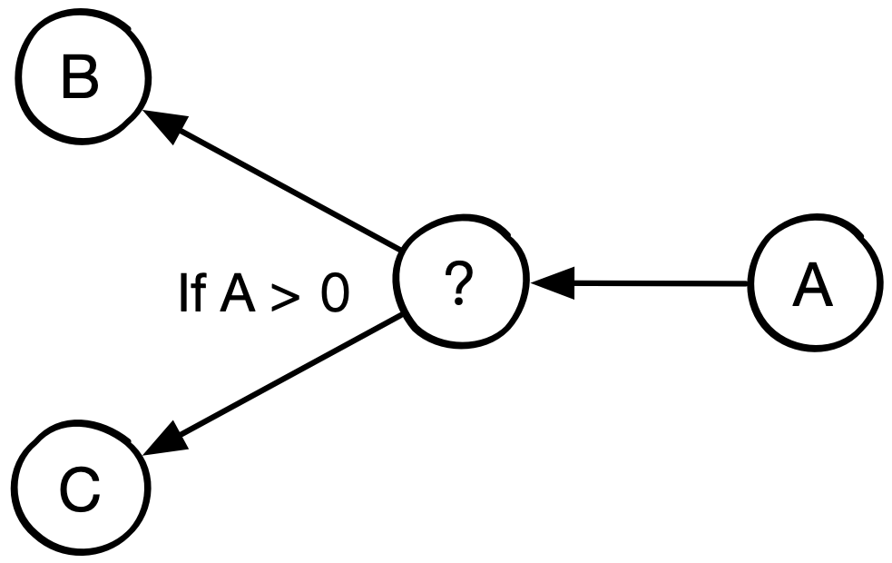
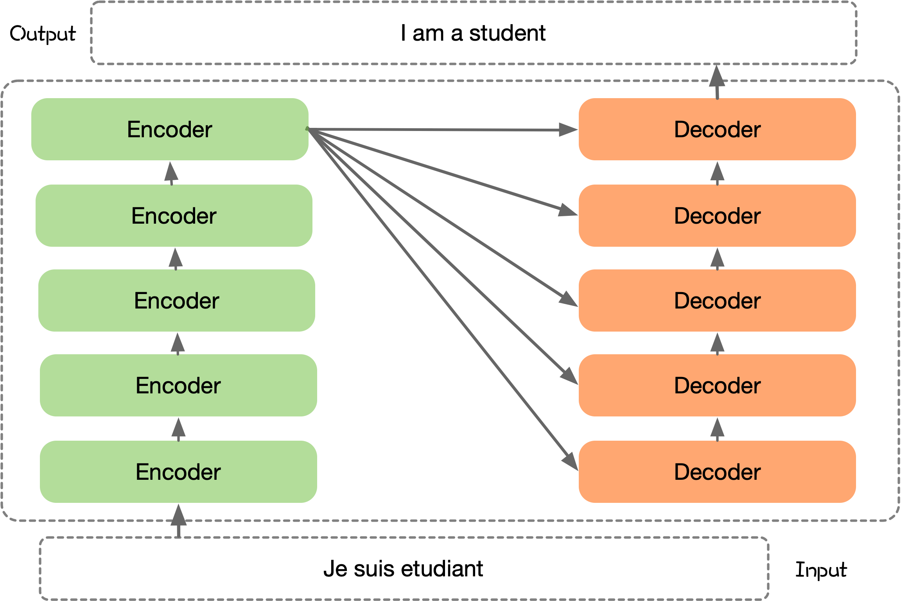
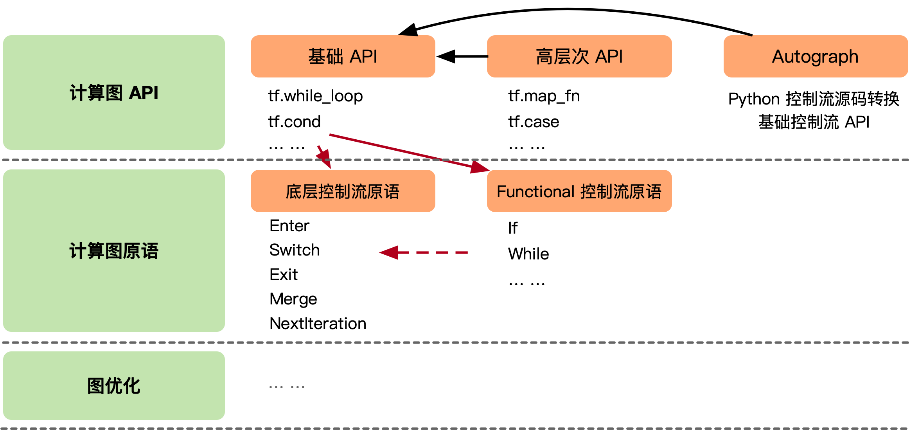

# 计算图的控制流实现

计算图在数学上作为一个有向无环图（DAG，Directed Acyclic Graph），能够把神经网络模型的概念抽象出来作为同一描述，不过在计算机的编程中，会遇到很多 if、else、while、for 等控制流语句，有向无环图改如何表示控制流变成了计算图中一个很重要的问题。好处在于，引入控制流之后，开发者可以向计算图中引入分支选择以及循环控制逻辑，进而构造出更加复杂的神经网络模型结构。

目前，以 Pytorch 为例，它支持的仅仅是 Python Control Flow，即在 Python 层执行控制逻辑，而非计算图中支持控制流。这样就存在一个问题，如果要部署带 Control Flow 的模型就会比较困难，如何灵活部署带控制流的计算图到不支持 Python 的设备上？

> 计算图中的控制流实现，与控制流图并不是一个概念。在计算机科学中，控制流图 (CFG) 是程序执行期间所有可能路径的图形表示。控制流图是由 Frances E. Allen 发现的。他指出，Reese T. Prosser 之前曾使用布尔连接矩阵进行流分析。CFG 是许多编译器优化和静态分析工具不可或缺的一部分。

## 控制流

AI 框架作为一个可编程系统，在设计时一个首要设计选择是如何让开发者，能够独立于实现细节以最自然的方式描述出各类神经网络模型。描述的完备性不仅影响 AI 框架能所够支持的神经网络结构，决定了开发者在使用高级编程语言，去实现神经网络模型的灵活性，也影响 AI 框架后端优化的技术手段。

### 背景

在计算机科学中，控制流（Control Flow）定义了独立语句，指令，函数调用等执行或者求值的顺序。例如，根据函数A的输出值选择运行函数B或者C中的一个。


:width:`300px`
:label:`dataflow_04_img1`

AI 框架把神经网络的计算过程，抽象为有向无环图。使用有向无环图描述神经网络计算的方式，符合算法开发者对神经网络的概念定义：算子间拓扑结构对学习特性有重要影响，可以通过计算图，方便地描述出大多数通过堆叠深度或多分枝形成的复杂神经网络。然而，随着神经网络算法的快速发展，一些新颖的神经网络结构很难自然地表示为纯计算图。

以 Transformer 结构的神经网络为例，来看看使用最自然地方式描述这些算法对 AI 框架会带来什么新的表示要求。Transformer 结构的神经网络算法中，图的左侧是一个通用 Transformer 结构的中关键步骤的计算示意图，通过堆叠 Transformer 结构使得网络模型层数更深，右侧对应了使用最自然的方式描述这一算法计算过程的伪代码。



Transformer 是一种基于注意力机制的神经网络结构，由多个 Encoder 和 Decoder 堆叠而成，可以应用于各种自然语言处理任务。在具体应用时，可以根据任务的特点和需求，选择不同的 Transformer 架构来构建模型。从伪代码描述中可以看到，想要以通用的方式，自然地描述出Transformer的算法框架，均依赖于循环控制逻辑 `for`。

### 难点

引入控制流将会使得计算图的构建以及前向传播带来很大的差异。

首先，计算图将变为动态的方式，分支选择以及循环控制流只有在真实运行的时候，才能够依据其依赖的数据输入来判断走哪个分支、是否结束循环。

其次，控制流引入的另一个难点在于循环控制流的实现。引入循环之后，原本的计算图在逻辑上出现了环，从而无法进行有效的拓扑排序。所以对于有控制流的计算图，前向计算和反向传播的实现要么抛弃拓扑排序这一思路，要么就要通过其他手段将循环进行拆解。

为了能够支持含有控制流结构的神经网络模型，AI 框架需要引入了对动态控制流这一语言结构（language construct）的支持。目前基于计算图，在控制流解决方案上，主要采用了三类设计思路：

- **复用宿主语言**：复用前端宿主语言的控制流语言结构，用前端语言中的控制逻辑驱动后端计算图的执行

- **支持控制流原语**：AI 框架的后端对控制流语言结构进行原生支持，计算图中允许计算流和控制流混合

- **源码解析**：前端对高级编程语言的代码进行解析称计算图，后端对控制流语言结构解析成子图，对计算图进行延伸

复用宿主语言以PyTorch为典型代表，支持控制流原语以TensorFlow为典型代表，源码解析的方式则以MindSpore为典型代表。

## 动态图

每一次执行神经网络模型，AI框架会依据前端编程语言描述，动态生成一份临时的计算图（实际为单算子），这意味着该实现方式下计算图是动态生成，并且过程灵活可变，该特性有助于在神经网络结构调整阶段提高效率，这种实现方式也被称为**动态计算图**。

### 复用宿主语言

PyTorch 采用的是动态图机制 (Dynamic Computational Graph)，动态图使得 PyTorch 的调试变得十分简单，每一个步骤，每一个流程都可以被开发者精确的控制、调试、输出，甚至是在每个迭代都能够重构整个网络。

动态图中，通过复用宿主语言的控制流构建动态图，即复用 Python 等高级语言本身的控制流的执行方式。以 PyTorch 为代表，在实际执行计算的时候，当遇到if、else、for 等控制流语句的时候，使用 Python 在CPU的原控制执行方式，当遇到使用 PyTorch 表示神经网络的 API 时，才继续按照动态计算图的执行方式进行计算。

下面的代码是 Transformer 结构对应的动态图示例 PyTorch 代码，Transformer 的 Decoder 结构中通过 `for` 循环，堆叠 Decoder 模块，最后通过if来检查是否需要加入 `norm` 正则化层。此时 AI 框架不再维护一个全局的神经网络描述，神经网络变成具体的 Python 代码，后端的张量计算以库的形式提供，维持了与 numpy 类似的一致编程接口。

```python
from torch import nn

class TransformerDecoder(nn.Module):
    def __init__(self, decoder_layer, num_layers, norm=None):
        super().__init__()
        self.layers = _get_clones(decoder_layer, num_layers)
        self.num_layers = num_layers
        self.norm = norm

    def forward(self, tgt: Tensor, 
                memory: Tensor, 
                tgt_mask: Optional[Tensor] = None,
                memory_mask: Optional[Tensor] = None,
                tgt_key_padding_mask: Optional[Tensor] = None,
                memory_key_padding_mask: Optional[Tensor] = None,
                tgt_is_causal: Optional[bool] = None,
                memory_is_causal: bool = False):
        seq_len = _get_seq_len(tgt, self.layers[0].self_attn.batch_first)
        tgt_is_causal = _detect_is_causal_mask(tgt_mask, tgt_is_causal, seq_len)

        for mod in self.layers:
            output = mod(output, memory, tgt_mask=tgt_mask,
                         memory_mask=memory_mask,
                         tgt_key_padding_mask=tgt_key_padding_mask,
                         memory_key_padding_mask=memory_key_padding_mask,
                         tgt_is_causal=tgt_is_causal,
                         memory_is_causal=memory_is_causal)

        if self.norm is not None:
            output = self.norm(output)

        return output
```

> 代码出自 PyTorch框架github官网 https://github.com/pytorch/pytorch/blob/main/torch/nn/modules/transformer.py

即使 PyTorch 2.X 版本出来，推出了图模式，能够生成真正的计算图，但是目前的方案中，遇到控制流，仍然会把网络模型切分成不同的子图来执行，遇到控制流会使用Python来执行调度。

复用宿主语言的方式，其**优点**在于：

1. 由于用户能够自由地使用前端宿主语言 Python 代码中的控制流，即时输出张量计算的求值结果，有着更高的易用性；
2. **模型即代码**，动态图使用声明式编程的方式，使得定义神经网络模型的计算就像普通编写真正的程序。

这种复用宿主语言控制流语言驱动后端执行的方式有着更加友好的用户体验，但**缺点**也是明显的：

1. 用户易于滥用前端语言特性，带来更复杂的性能问题；
2. 计算图的执行流会在语言边界来回跳转，带来十分严重的运行时开销；
4. 整体计算图把模型切分成按算子组成的小块，不利于神经网络模型大规模部署和应用；
3. 控制流和数据流被严格地隔离在前端语言和后端编译优化之中，前端和后端执行不同的语言和编译体系，跨语言边界优化难。

## 静态图

AI框架静态地生成可以根据 Python 等前端高级语言描述的神经网络拓扑结构，以及参数变量等图层信息构建一个固定的计算图，这种实现方式也称为**静态计算图**。具体在 AI 框架中，利用反向微分计算梯度通常实现为计算图上的一个优化 Pass，给定前向计算图，以损失函数为根节点广度优先遍历前向计算图的时，便能按照对偶结构自动生成出反向计算图。

### 控制流原语

支持控制流原语以 TensorFlow 为典型代表，在面对控制流需求时，计算图中引入控制流原语，运行时对控制流原语以第一等级（first-class）进行实现支持。其控制流的基本设计原则是：引入包含少量操作的原子操作符（即 Function 类特殊算子），在这些操作符之上来表达TensorFlow 应用的复杂控制流。

TensorFlow 计算图中支持控制流的方案，主要分为3层。暴露给开发者用于构建计算图的前端API，这些API会被转换成更低等级的控制流原语，再由计算图优化器进一步进行改写。为了平衡编程的易用性和优化器设计中保留更多易于被识别出的优化机会，TensorFlow提供了多套有着不同抽象等级的前端API以及计算图上的控制流原语。

为了提高可理解性和编程效率避免开发者直接操作底层算子，这些计算图中的控制流原语会被封装为前端的控制流API，下图是用户使用前端基础控制流API编写带条件和循环的计算，以及它们所对应的计算图表示。为了简化开发者识别计算图中的控制结构，TensorFlow 基于底层控制流原语，引入高层 Functional 控制流算子，同时添加高层控制流算子向底层控制流算子的转换逻辑。




下面以循环嵌套两个 for 循环代码，使用 TensorFlow 2.X 的API为例子：

```Python
i = tf.constant(0)
j = tf.constant(0)a = lambda i: tf.less(i, 10)b = lambda i: (tf.add(i, 1), )
c = lambda i: (tf.add(j, 1), )
y = tf.while_loop(a, b, [j])r = tf.while_loop(c, y, [i])
```

TensorFlow的计算图，每个算子的执行都位于一个执行帧中（execution frame）中，每个执行帧具有全局唯一的名字作为标识符，控制流原语负责创建和管理这些执行帧。可以将执行帧类比为程序语言中的域（Scope），其中通过key-value表保存着执行算子所需的上下文信息，如输入输出变量存储位置等。当计算图中引入控制流后，每个算子有可能被多次执行，控制流原语会在运行时创建这些执行帧，执行帧可以嵌套，对应了开发者写出的嵌套控制流。

```Python
# 具有全局唯一的名字作为标识符
execution frame：{
    # 保存着执行算子所需的上下文信息
     key(ops_1): value(input_addr, output_addr, ops_attr),
     key(ops_2): value(input_addr, output_addr, ops_attr),
     ...
     # 嵌套Execution frame，可并发优化
     execution frame：{
     key(ops_1): value(input_addr, output_addr, ops_attr),
     key(ops_2): value(input_addr, output_addr, ops_attr),
     ...
    }   
}
```

`tf.while_loop`的循环体是一个用户自定义计算子图，对于每个 while 循环，TensorFlow 运行时会设置一个执行帧，并在执行帧内运行 while 循环的所有操作。执行帧可以嵌套。嵌套的 while 循环在嵌套的执行帧中运行。位于同一个计算帧中，嵌套的`tf.while_loop`对应嵌套的计算帧，位于不同计算帧中的算子，只要它们之间不存在数据依赖，有能够被运行时调度并发执行。只要执行帧之间没有数据依赖关系，则来自不同执行帧的操作可以并行运行。

如下图所示，TensorFlow 的原子操作集之中有五个控制流原语运算符，其中 Switch 和 Merge 组合起来可以实现条件控制。所有五个基元一起组合则可以实现 while 循环。


其中：

- Switch：Switch 运算符会根据输入控制张量 p 的布尔值，将输入张量 d 转发到两个输入中的一个。只有两个输入都准备好之后，Switch 操作才会执行。

- Merge：Merge 运算符将其可用的输入之一转发到其输出。只要它的任何一个输入可用，merge 运算符就会执行。如果有多个可用的输入，则无法确定它的输出。

- Enter(name)：Enter 操作符将其输入转发到由给定名称唯一标识的执行帧。这个 Enter 操作用于将一个执行帧中的张量传递给一个子执行帧。对于同一个子执行帧可以有多个 Enter 操作，每个操作都会使子执行帧中的张量可用（异步）。当输入可用时，Enter 操作将执行。一个新的执行帧在执行该帧第一个 Enter 操作时候被实例化。

- Exit：Exit 操作符将一个张量从一个执行帧返回给它的父执行帧。一个执行帧可以有多个 Exit 操作返回到父执行帧，每个操作都异步地将张量传回给父帧。当一个 Exit 的输入可用时，该 Exit 操作就被启用。

- NextIteration: 一个 NextIteration 操作符将其输入转发到当前执行帧的下一个迭代。TensorFlow 运行时会跟踪维护执行帧中的迭代信息。一个执行帧中执行的任何操作都有一个唯一的迭代 ID，这使得我们能够唯一地识别迭代计算中同一操作的不同调用（比如 hile 操作之中，某一个 op 可能会多次执行）。

**优点**在与：

1. 静态图由于能够在执行具体计算之前得到神经网络模型计算的全过程统一描述，使得 AI 编译器在编译优化期间能够利用计算图的信息进行优化

2. 执行逻辑无需在前端宿主语言与运行时之间反复切换，因此往往有着更高的执行效率。

不过这种方式也有其比较大的**缺点**：

1. 由于控制流原语的语义设计，首要提升运行时的并发数和高效执行，与开发者在描述神经网络模型时候使用 Python 语法在编程习惯上差异较大，对开发者来说存在一定的易用性困扰

2. 为了解决让开发者对细节控制原语不感知，需要对控制流原语进行再次封装，以控制流 API 的方式对外提供，这也导致了构建计算图步骤相对复杂。

### 源码解析

源码解析的方式是：前端对高级编程语言的代码进行解析称计算图，后端对控制流语言结构解析成子图，对计算图进行延伸。具体实现的过程中，计算图对能够表达的控制直接展开，如 for 循环内部的内容，直接展开成带顺序的多个计算子图。另外通过创建子图进行表示，运行时时候动态选择子图执行，如遇到 if 和 else 的分支时候分别创建 2 张子图存放在内存，当 DSA 的控制模块判断需要执行 if 分支的时候，把通过 if 分支产生的子图产生的序列调度进入执行队列中。

通过对高级语言的源码解析成计算图，在对计算图进行展开的方式，其**优点**在于：

1. 用户能够一定程度自由地使用前端宿主的控制流语言，即在带有约束的前提下使用部分Python代码；

2. 解耦宿主语言与执行过程，加速运行时执行效率；

3. 计算图在编译期得到全计算过程描述，发掘运行时效率提升点；

因为属于静态图的方式，因此继承了声明式编程的**缺点**：

1. 硬件不支持的控制流方式下，执行流仍然会在不同编程语言的边界来回跳转，带来运行时开销；

2. 部分宿主的控制流语言不能表示，带有一定约束性；

## 总结

- 控制流采用不同设计，AI框架为声明式编程的静态图，以及命令式编程的动态图；

- 静态图统一DL表示利于编译优化和执行加速，但是灵活性和易用性受限；

- 动态图灵活复用宿主语言中的控制流原语，但是缺乏性能优化阶段；

- 基于追踪Trace或基于源代码解析可将动态图转换为静态图，兼顾易用性和性能；

## 视频

<html>
<iframe src="https://player.bilibili.com/player.html?aid=303892102&bvid=BV17P41177Pk&cid=911665293&page=1&as_wide=1&high_quality=1&danmaku=0&t=30&autoplay=0" width="100%" height="500" scrolling="no" border="0" frameborder="no" framespacing="0" allowfullscreen="true"> </iframe>
</html>
