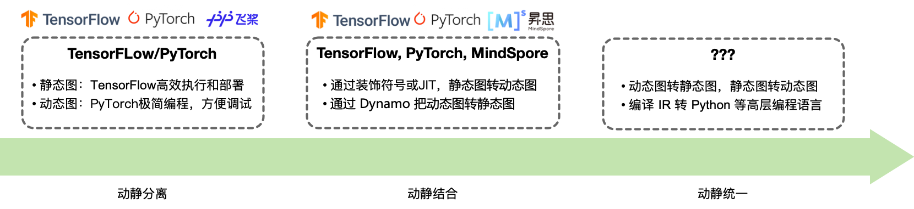
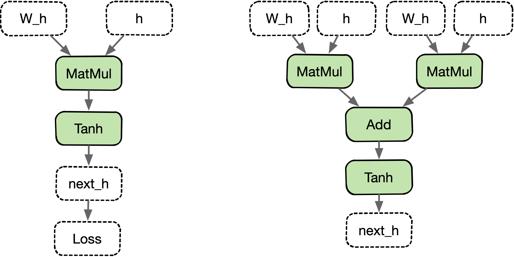
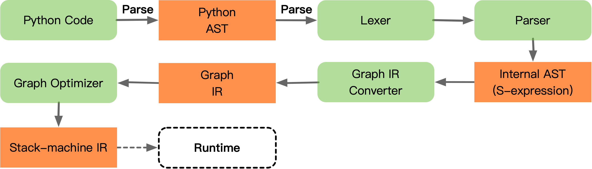

# 动态图与静态图转换

从 TensorFlow、PyTorch，到 PaddlePaddle、MindSpore、MegEngine，主流的 AI 框架动静态图转换，经历了动静分离、动静结合到动静统一的发展过程。兼顾动态图易用性和静态图执行性能高效两方面优势，均具备动态图转静态图的功能，支持使用动态图编写代码，框架自动转换为静态图网络结构执行计算。

短短七八年时间，动静态图互相转换的技术在 AI 系统领域发展迅速，大大提升了 AI 算法/模型的开发效率，提高了 AI 产品应用的便利性，实现了计算效率和灵活性的平衡。 



> 更详细的具体实现将会在AI编译器里面的 PyTorch 动态图转静态图的尝试路径讲解。

## 背景

在前面的内容详细讲述过动态图与静态图的具体内容，**静态图**易于优化但灵活性低，**动态图**灵活性高但由于缺少统一的计算过程表示，难以在编译期进行分析。

### 历史发展

- **动静分离**

动静分离阶段，其对应的代表性框架为 Google 在 2017 年发布的 TensorFlow，默认使用静态图，硬件亲和性能高，易部署。相对而言，2018 年发布的 PyTorch，默认采用动态图，其编程范式符合日常编程风格习惯，学习成本低，开发效率高。

- **动静结合**

动态图和静态图都有其各自的优缺点，不过动态图难以转换成为静态图，那么能否让开发者通过标识符号，来通知 AI 框架对于表示的代码段实现静态图转换成为动态图。该思路的基本实现方式是在静态图代码块上加上装饰符。

2019 年 Google 发布的 TensorFlow 2.0 支持动静态图的相互转化，TensorFlow 2.0 默认使用动态图，允许将一部分 Python 语法转换为可移植、高性能、语言无关的 TensorFlow1.x 语法，从而支持 TensorFlow1.X 静态图和 TensorFlow2.X 动态图的切换。2022 年 Facebook 发布的 PyTorch 2.0 从 Python 侧支持 `Compiler` 编译产生静态图的功能。

- **动静统一**

动静统一是 AI 框架技术上追求的最终实现方式，开发者能够根据需要，灵活地在动态图与静态图之间切换。然而动态图和静态图的切换面临很大困难：静态图可以看作是一种特殊的领域语言（DSL），则该特殊 DSL 实际上是表示为静态语言的；但是 Python 实际为动态解释类型语言，因此很难将 Python 语言无损转化到静态语言中，又可以方便地从静态语言转换回 Python 代码。

### 实现方式

主流的 AI 框架最终目标是实现计算图的**动静统一**，目前从 AI 框架的技术趋势来看，动态图与静态图的融合在不断向前探索过程中：前端用户使用宿主语言（如 Python）中的控制流语句编写神经网络模型，调试完后，由 AI 框架自动转换为静态图的结构。而动态图向静态图的转换分为基于追踪（tracing）和基于源代码解析（parsing）两种方式：

- **基于追踪Trace**

直接执行开发者编写的 Python 代码，记录下算子调用序列，将算子调用序列保存为静态图，执行中脱离前端高级语言环境，由运行时 Runtime 按照静态图逻辑执行。即动态图模式执行并记录调度的算子，构建和保存为静态图模型。

- **基于源码解析**

以高级语言的抽象语法树（AST）作为输入，通过 AI 框架定义的计算图 IR 转化为框架内部的语法树，经过别名分析、SSA（static single value assignment）、类型推断等编译器中间件 Pass，最终转换为静态计算图表示。即分析前端源代码将动态图转为静态图，并在框架层帮开发者使用静态图执行器运行。

不过在具体实现方式下，解决动态图和静态图转换的问题时，主要有以下两条路径：

1. **动态转静态**：从动态图出发，AI 框架可以在运行过程中自动通过 JIT，无需用户用修饰符指定，如 PyTorch 的 Lazy Tensor 和 Compiler；

2. **静态转静态**：从静态图出发，编译过程中如果发现有不支持的语法，保留到运行时进行 fallback 回 Python，如 PyTorch 框架中的 JIT fallback。

## 追踪模式

**基于追踪（Tracing Base）**的方式会直接执行用户代码，记录下算子调用序列，将算子调用序列保存为静态图模型，在后续编译、运行时的执行过程中中脱离前端高级编程语言 Python 环境，最后交由框架后端的运行时按照静态图调度与执行。

动态图基于前端宿主语言的解释器对网络模型的代码进行解析执行。因此，基于追踪的动静态图转换的原理相对简单，当使用动态图模式构建好网络模型后，使用追踪的方式进行转换将分为两个阶段：

1. 第一阶段：与动态图生成原理相同，AI 框架创建并运行动态图代码，自动追踪计算图中数据流的流动以及算子的调度，将所有的算子捕获并根据调度顺序构建静态图模型。与动态生成不同的地方在于 AI 框架并不会销毁构建好的计算图，而是将其保存为静态图留待后续执行计算。

2. 第二阶段：当执行完一次动态图后， AI 框架已生成静态图，当再次调用相同的模型时，AI 框架会自动指向静态图模型执行计算。追踪技术只是记录第一次执行动态图时调度的算子，但若是模型中存在依赖于中间结果的条件分支控制流，只能追踪到根据第一次执行时触发的分支。

从上面基于追踪模式可以得知，构建的静态图模型并不是完整的计算图，缺失了数据未流向的其他分支。在后续的调用中，因为静态模型已经生成无法再次改变，除非重新生成计算图，若计算过程中数据流向缺失分支会导致模型运行错误。同样的，依赖于中间数据结果的循环控制也无法追踪到全部的迭代状态。

```Python
w_h = torch.randn(20, 20, requires_grad=True)
w_x = torch.randn(20, 10, requires_grad=True)
x = torch.rand(1, 10)
prev_h = torch.randn(1, 20)

h2h = torch.mm(W_h, prev_h.t())
if h2h > w_x:
    i2h = torch.mm(w_x, x.t())
    h2h = h2h + i2h
next_h = h2h.tanh()

loss = next_h.sum()
loss.backward()
```

Tracing 模式的**难点**在于：通过Tracing的方式获取的计算图，实际上不是一个有向无环图（DAG），而是一个平铺算子执行流，所以很难处理控制流的情况。比如循环 `while、Loop、for`，对于 Tracing 的方式来说就是展开循环体，但是有些情况下循环体无法有效展开，如循环条件根据训练的收敛情况/算子的执行结果而改变等。因此上面的图产生的计算图有2种可能性：


:width:`500px`

总结如下：

- **优点**：简单易于实现；能够更为广泛地，支持前端宿主语言中的各种动态控制流语句，例如：函数调用，函数嵌套，函数递归等等；

- **缺点**：执行场景受限，Traceing 直接执行程序一次，只能保留程序有限执行轨迹并线性化，静态图失去源程序完整控制结构；

## 源码解析

静态图模式下需要经过 AI 框架自带的图编译器对模型进行建图后，再执行静态计算图。由于图编译器所支持编译的静态图代码与动态图代码之间存在差异，因此基于源码转换的方式，需要将动态图代码转换为静态图代码描述，最后经过图编译器生成静态计算图。

**基于源代码解析**的方式则能够改善基于追踪转换的缺陷，其流程经历三个阶段：

1. 第一阶段：以宿主语言的抽象语法树（Abstract Syntax Tree, AST）为输入；对动态图模式下的宿主语言代码扫描进行词法分析，通过词法分析器，分析源代码中的所有字符，对代码进行分割并移除空白符、注释等，将所有的单词或字符都转化成符合规范的词法单元列表。这一阶段，需要严格地筛选前端宿主语言语法要素，往往只会解析宿主语言中的一个子集，而非前端宿主语言所有特性表达都能解析。

2. 第二阶段：以词法分析器的结果作为输入，接着进行语法分析（即AI 框架编译层的解析器），将得到的词法单元列表，转换成语法树的形式，并对语法进行检查避免错误。接着将宿主语言的抽象语法树，整理成一个 AI 框架内部的抽象语法树表示。

3. 第三阶段：从 AI 框架的内部语法树开始经过别名分析，SSA（static single value assignment）化，类型推断等重要分析，最终转换为静态计算图表示。动态图转静态图的核心部分就是对抽象语法树进行转写， AI 框架中对每一个需要转换的语法都预设有转换器，每一个转换器对语法树进行扫描改写，将动态图代码语法映射为静态图代码语法。

上面流程中，最为重要的前端宿主语言的控制流，会在这第三阶段分析转换为静态图接口进行实现，能够有效避免基于追踪的方式中控制流缺失的情况。计算图转换之后，可以从新的语法树或者计算图还原出可执行的静态图代码。

```python
@torch.jit.script
def foo1(x: Tensor, y: Tensor, z: Tensor) -> Tensor:
  if x < y:
    s = x + y
  else:
    s = torch.square(y)
  return s

@torch.jit.script
def foo2(s: Tensor) -> Tensor:
  for i in torch.range(10):
    s += i
  return s
```

上面的代码片断是使用了PyTroch 的 Script 模式（基于源代码解析）将动态图转换为静态图执行，下面是 PyTorch 背后的处理过程。


:width:`750px`

基于源码转换的**难点**在于：AI 框架是从前端宿主语言 Python 进行 AST 转换而来，好处是控制流和神经网络模型的属性信息都可以保留下来，但是挑战是 Python 的大部分语法和数据结构都要转换为静态图的表达，更难的是 Python 是动态类型语言，所以从 AST 到静态图的转换中需要一个复杂的类型/值推导过程，导致实现困难与复杂。

> PyTorch Dynamo 特性属于基于源码转换，不过转换层不再是对PyThon的语言进行转换，而是在PyThon的解释器中尽心转换成自定义的FX Graph，从而更好地复用宿主语言的高级特性。

- **优点**：

1. 能够更广泛地支持宿主语言中的各种动态控制流语句。

- **缺点**：

1. 后端实现和硬件实现会对静态图表示进行限制和约束，多硬件需要切分多后端执行逻辑；

2. 宿主语言的控制流语句并不总是能成功映射到后端运行时系统的静态图表示；

3. 遇到过度灵活的动态控制流语句，运行时会退回 Fallback 到由前端语言跨语言调用驱动后端执行；

## 总结

- 控制流采用不同设计，AI框架为声明式编程的静态图，以及命令式编程的动态图；

- 静态图统一DL表示利于编译优化和执行加速，但是灵活性和易用性受限；

- 动态图灵活复用宿主语言中的控制流原语，但是缺乏性能优化阶段；

- 基于追踪Trace或基于源代码解析可将动态图转换为静态图，兼顾易用性和性能；

## 视频

<html>
<iframe src="https://player.bilibili.com/player.html?aid=303892102&bvid=BV17P41177Pk&cid=911665293&page=1&as_wide=1&high_quality=1&danmaku=0&t=30&autoplay=0" width="100%" height="500" scrolling="no" border="0" frameborder="no" framespacing="0" allowfullscreen="true"> </iframe>
</html>
