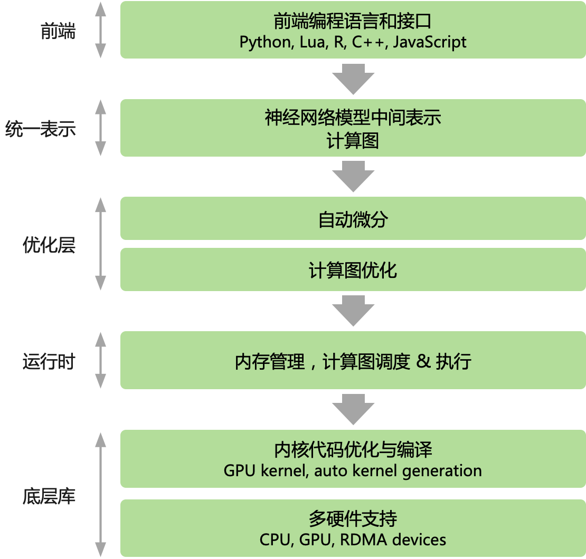
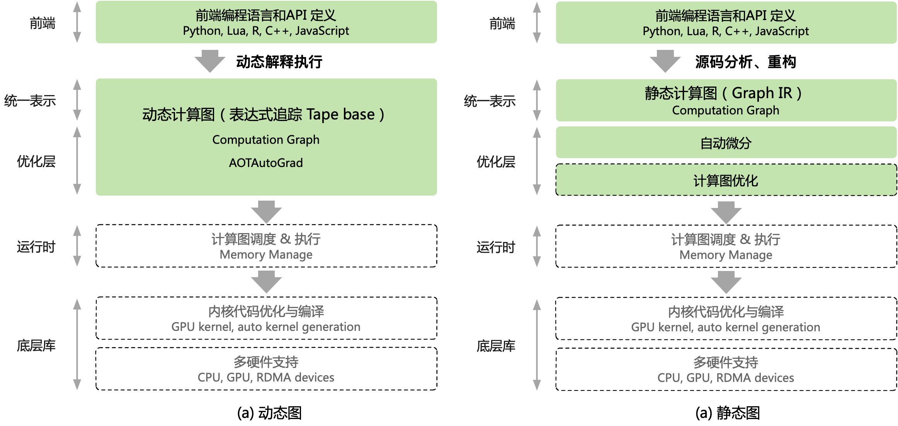
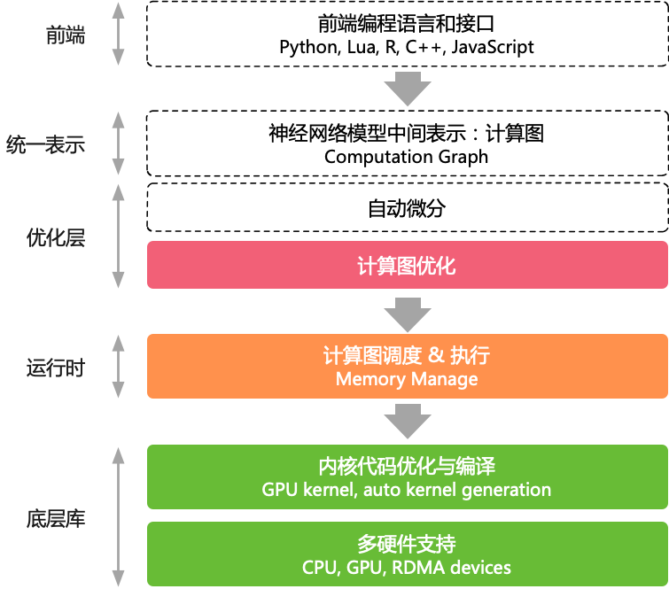

# 计算图的挑战&未来

目前主流的 AI 框架都选择使用**计算图**来抽象神经网络计算表达，通过通用的数据结构（张量）来理解、表达和执行神经网络模型，通过**计算图**可以把 AI 系统化的问题形象地表示出来。

:width:`500px`

## 计算图与AI框架的关系

### 计算图回顾

在 AI 框架中，其计算图的基本组成有两个主要的元素：1）基本数据结构张量和2）基本计算单元算子。节点代表 Operator 具体的计算操作（即算子），边代表 Tensor 张量。整个计算图能够有效地表达神经网络模型的计算逻辑和状态。

- **基本数据结构张量**：张量通过 shape 来表示张量的具体形状，决定在内存中的元素大小和元素组成的具体形状；其元素类型决定了内存中每个元素所占用的字节数和实际的内存空间大小

- **基本运算单元算子**：具体在加速器 GPU/NPU 中执行运算的是由最基本的代数算子组成，另外还会根据深度学习结构组成复杂算子。每个算子接受的输入输出不同，如Conv算子接受3个输入Tensor，1个输出Tensor

AI 框架的设计很自然地沿用了张量和张量操作，将其作为构造复杂神经网络的基本描述单元，开发者可以在不感知复杂的框架后端实现细节的情况下，在 Python 脚本语言中复用由后端优化过的张量操作。而计算 Kernel 的开发者，能够隔离神经网络算法的细节，将张量计算作为一个独立的性能域，使用底层的编程模型和编程语言应用硬件相关优化。

开发者编写神经网络模型代码的时候，需要 AI 框架提供自动微分功能，构建反向的计算图。基于反向模式（Reverse Mode）的自动求导机制中，根据反向计算图的构建时机，又分为基于对偶图的自动求导、基于表达式追踪和图层IR的自动求导实现的**静态图**，而使用**动态图**的 AI 框架多采用基于表达式追踪技术的自动求导方式。动态图和静态图的区别又引起不同的编程范式，和对编程领域引入的控制流表达不同方式。

### 使用计算图好处

使用了计算图，能够方便 AI 框架统一表示来描述神经网络训练的全过程。而动态计算图实际上只是一个虚拟概念，方便开发者和算法人员理解 AI
 框架中的执行过程，提升易用性。而使用静态计算图，其好处在于编译期可对计算过程的数据依赖进行分析：

- 简化数据流动的过程：通过计算图使用有向无环图的方式，避免无序的数据依赖

- 动态和静态内存优化：在神经网络模型执行中会产生固定和非固定的内存需求，基于计算图信息提前对内存进行优化

- 优化算子间的调度策略：方便进行算子的并行、算子的调度执行优化

- 改善运行时Runtime性能：通过计算图可以进行计算和通信的时间重叠优化

通过静态的计算图提出，可以为 AI 框架切分出三个解耦的优化层，分别对应图中的不同颜色：1）计算图优化；2）运行时调度优化；3）算子/内核执行优化。

:width:`500px`

针对新提出来的神经网络模型结构和新训练算法，扩展步骤分为三阶段：1）在计算图层添加新算子定义；2）针对不同硬件内核，实现计算优化；3）注册算子和内核函数，运行时派发硬件执行。

## 对计算图的未来演进

- **图表示**

随着图、图结构、图数据、图算法、图计算、图学习、图神经网络等信息技术的快速发展，各行业数字化水平的逐步提高，企业业务环境和计算场景日益复杂，数据间的关联关系也正在变得更加交错。在面对需要深度挖掘数据间复杂关联关系的场景时，传统的关系型数据往往计算效率低下，难以满足应用需求。

针对图神经网络（GNN）模型的结构类型，大量稀疏的结构下，会适合使用计算图来表示图吗？如何通过计算图更加高效地计算图稀疏图结构？

- **大数据融合**

大数据技术演化的总体目标是高效收集、存储、处理与分析大规模、多源数据，并满足业务需求。近年来，大数据技术路线从批处理架构，逐渐演化为内存计算架构、流处理架构、批流融合处理架构、图数据处理架构等。

在大数据技术发展的早期，仅仅是在计算框架MapReduce中提供简单的作业调度算法，随着资源管理的需求，在Hadoop 2.0时代，Yarn作为单独组件负责分布式计算框架的资源管理。但是，一方面，Yarn仅仅能够管理调度计算框架的资源；另一方面，资源的管理粒度较为粗放，不能做到有效的资源隔离，越来越不能满足企业客户的需求。

未来 AI 框架的计算图如何与数据的处理进行融合与表示？大数据和AI融合，计算图会产生什么新的表示和需求？

- **部署推理**

深度学习不仅包括使用 AI 框架模型训练过程，对训练好的模型，通常需要进行一些优化和加速，如 网络层合并、量化、剪枝 等，得到 精简的推理引擎，然后部署上线。通常我们把模型优化和推理框架合称为推理引擎。在推理部署环节的优化进度较快，主要思路包括调整模型架构实现计算并行度提升，或通过捕捉参数结构实现混合精度推理，降低计算复杂度。

既然最终形态是面向推理部署，那么一定需要 AI 框架按照计算图设计后的逻辑明确的分层解耦？计算图不能解决哪些AI业务的问题？部署场景 AI 作为流程中的一部分，能否泛化计算图解决部署流程复杂问题？

- **科学计算**

自然界中诸多现象如材料损伤与破坏、流体湍流、核爆炸过程、生物大分子等均呈现出巨大的尺度效应, 并伴随着不同尺度上的物理多样性和强耦合性以及多个时间与空间尺度的强关联。这些典型的多尺度问题的求解一直是非常有挑战性的课题。科学计算曾经并正在为求解多尺度问题发挥重要作用，但目前也碰到了瓶颈。人工智能为解决多尺度问题提出了新的思路。

未来AI和科学计算融合，计算图能否足够表示？针对科学计算的特殊数学范式，如何更好地融合到计算图中？

## 总结

- 回顾计算图和AI框架的关系

- 展望了计算图未来与新的应用场景

## 视频

<html>
<iframe src="https://player.bilibili.com/player.html?aid=688995055&bvid=BV1hm4y1A7Nv&cid=911668368&page=1&as_wide=1&high_quality=1&danmaku=0&t=30&autoplay=0" width="100%" height="500" scrolling="no" border="0" frameborder="no" framespacing="0" allowfullscreen="true"> </iframe>
</html>
