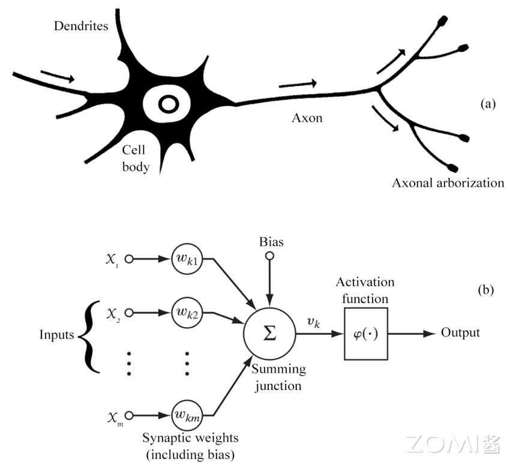
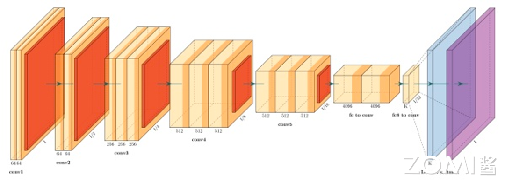
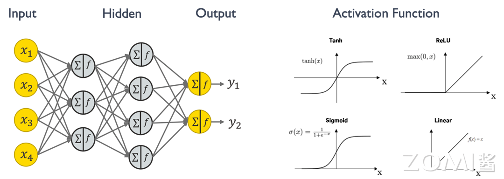
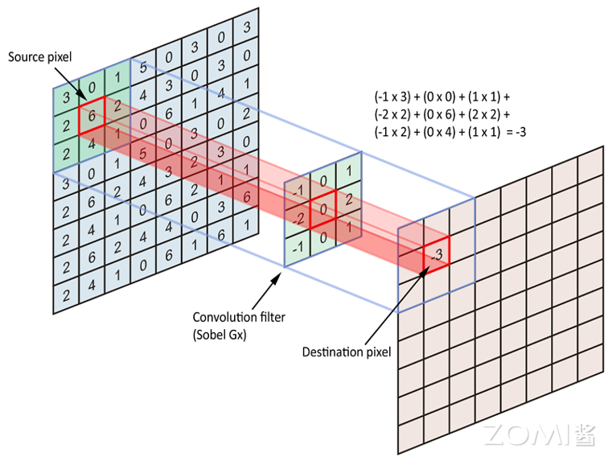
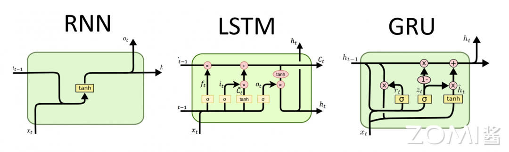
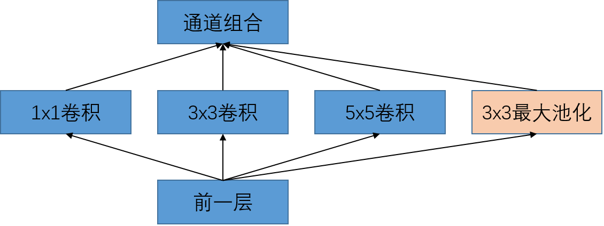
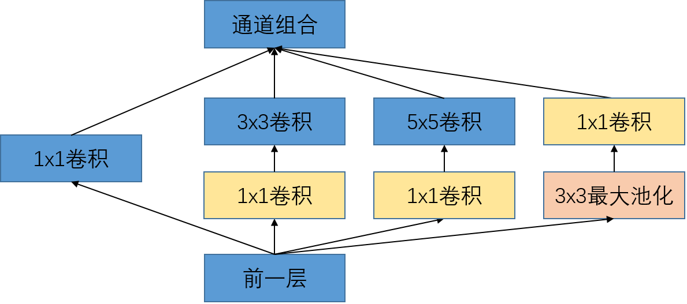
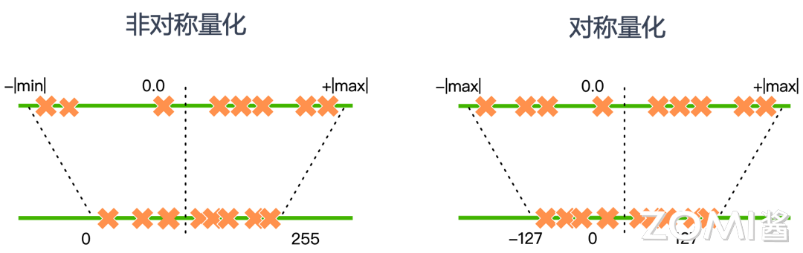
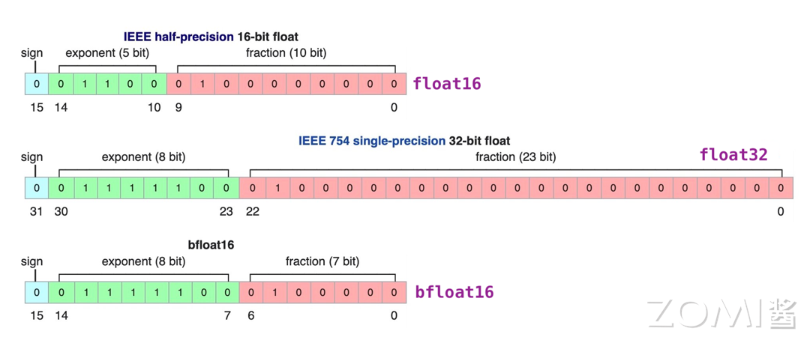
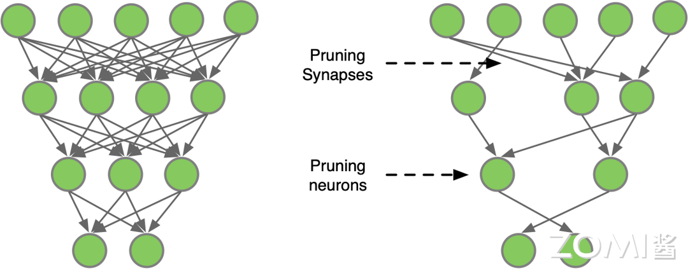

<!--Copyright ©  适用于[License](https://github.com/chenzomi12/AISystem)版权许可-->

# AI 计算模式（上）

了解 AI 计算模式对 AI 芯片设计和优化方向至关重要。本节将会通过模型结构、压缩、轻量化和分布式几个内容，来深入了解 AI 算法的发展现状，引发关于 AI 计算模式的思考，重点围绕经典网络模型和模型量化压缩两方面进行展开。

## 经典模型结构设计与演进

### 神经网络的基本概念

神经网络是 AI 算法基础的计算模型，灵感来源于人类大脑的神经系统结构。它由大量的人工神经元组成，分布在多个层次上，每个神经元都与下一层的所有神经元连接，并具有可调节的连接权重。神经网络通过学习从输入数据中提取特征，并通过层层传递信号进行信息处理，最终产生输出。这种网络结构使得神经网络在模式识别、分类、回归等任务上表现出色，尤其在大数据环境下，其表现优势更为显著。



对一个神经网络来说，主要包含如下几个知识点，这些是构成一个神经网络模型的基础组件。

- **神经元（Neuron）**：神经网络的基本组成单元，模拟生物神经元的功能，接收输入信号并产生输出，这些神经元在一个神经网络中称为模型权重。

- **激活函数（Activation Function）**：用于神经元输出非线性化的函数，常见的激活函数包括 Sigmoid、ReLU 等。

- **模型层数（Layer）**：神经网络由多个层次组成，包括输入层、隐藏层和输出层。隐藏层可以有多层，用于提取数据的不同特征。

- **前向传播（Forward Propagation）**：输入数据通过神经网络从输入层传递到最后输出层的过程，用于生成预测结果。

- **反向传播（Backpropagation）**：通过计算损失函数对网络参数进行调整的过程，以使网络的输出更接近预期输出。

- **损失函数（Loss Function）**：衡量模型预测结果与实际结果之间差异的函数，常见的损失函数包括均方误差和交叉熵。

- **优化算法（Optimization Algorithm）**：用于调整神经网络参数以最小化损失函数的算法，常见的优化算法包括梯度下降，自适应评估算法（Adaptive Moment Estimation）等，不同的优化算法会影响模型训练的收敛速度和能达到的性能。

那么通过上面组件，如何得到一个可应用的神经网络模型呢？神经网络的产生包含训练和推理两个阶段。训练阶段可以描述为如下几个过程。从下图流程中可以发现，神经网络的训练阶段比推理阶段对算力和内存的需求更大，流程更加复杂，难度更大，所以很多公司芯片研发会优先考虑支持 AI 推理阶段。

整体来说，训练阶段的目的是通过最小化损失函数来学习数据的特征和内在关系，优化模型的参数；推理阶段则是利用训练好的模型来对新数据做出预测或决策。训练通常需要大量的计算资源，且耗时较长，通常在服务器或云端进行；而推理可以在不同的设备上进行，包括服务器、云端、移动设备等，依据模型复杂度和实际应用需求定。在推理阶段，模型的响应时间和资源消耗成为重要考虑因素，尤其是在资源受限的设备上。

下图是一个经典的图像分类的卷积神经网络结构，网络结构从左到右有多个网络模型层数组成，每一层都用来提取更高维的目标特征（这些中间层的输出称为特征图，特征图数据是可以通过可视化工具展示出来的，用来观察每一层的神经元都在做些什么工作），最后通过一个 softmax 激活函数达到分类输出映射。



接下来我们来了解一下神经网络中的主要计算范式：**权重求和**。下图是一个简单的神经网络结构，左边中间灰色的圈圈表示一个简单的神经元，每个神经元里有求和和激活两个操作，求和就是指乘加或者矩阵相乘，激活函数则是决定这些神经元是否对输出有用，Tanh、ReLU、Sigmoid 和 Linear 都是常见的激活函数。神经网络中 90%的计算量都是在做乘加（multiply and accumulate, MAC）的操作，也称为权重求和。



### 主流的网络模型结构

不同的神经网络设计层出不穷，但是主流的模型结构有如下四种。

1. 全连接 Fully Connected Layer

全连接层（Fully Connected Layer），也称为密集连接层或仿射层，是深度学习神经网络中常见的一种层类型，通常位于网络的最后几层，全连接层的每个神经元都会与前一层的所有神经元进行全连接，通过这种方式，全连接层能够学习到输入数据的全局特征，并对其进行分类或回归等任务。


下面是全连接层的基本概念和特点：

- **连接方式**：全连接层中的每个神经元与前一层的所有神经元都有连接，这意味着每个输入特征都会影响到每个输出神经元，因此全连接层是一种高度密集的连接结构。

- **参数学习**：全连接层中的连接权重和偏置项是需要通过反向传播算法进行学习的模型参数，这些参数的优化过程通过最小化损失函数来实现。

- **特征整合**：全连接层的主要作用是将前面层提取到的特征进行整合和转换，以生成最终的输出。在图像分类任务中，全连接层通常用于将卷积层提取到的特征映射转换为类别预测分数。

- **非线性变换**：在全连接层中通常会应用非线性激活函数，如 ReLU（Rectified Linear Unit）、Sigmoid 或 Tanh 等，以增加模型的表达能力和非线性拟合能力。

- **输出层**：在分类任务中，全连接层通常作为网络的最后一层，并配合 Softmax 激活函数用于生成类别预测的概率分布。在回归任务中，全连接层的输出通常直接作为最终的预测值。

- **过拟合风险**：全连接层的参数数量通常较大，因此在训练过程中容易产生过拟合的问题。为了缓解过拟合，可以采用正则化技术、dropout 等方法。

全连接层在深度学习中被广泛应用于各种任务，包括图像分类、目标检测、语音识别和自然语言处理等领域，它能够将前面层提取到的特征进行有效整合和转换，从而实现对复杂数据的高效处理和表示。

2. 卷积层 Convolutional Layer

卷积层是深度学习神经网络中常用的一种层类型，主要用于处理图像和序列数据。它的主要作用是通过学习可重复使用的卷积核（Filter）来提取输入数据中的特征。下面是一些卷积层的基本概念和特点：

- **卷积操作**：卷积层通过对输入数据应用卷积操作来提取特征。卷积操作是一种在输入数据上滑动卷积核并计算卷积核与输入数据的乘积的操作，通常还会加上偏置项（Bias）并应用激活函数。

- **卷积核**：卷积核是卷积层的参数，它是一个小的可学习的权重矩阵，用于在输入数据上执行卷积操作。卷积核的大小通常是正方形，例如 3x3 或 5x5，不同的卷积核可以捕获不同的特征。

- **特征图**：卷积操作的输出称为特征图（Feature Map），它是通过卷积核在输入数据上滑动并应用激活函数得到的。特征图的深度（通道数）取决于卷积核的数量。

- **步长和填充**：卷积操作中的步长（Stride）定义了卷积核在输入数据上滑动的步长，而填充（Padding）则是在输入数据的边界上添加额外的值，以控制输出特征图的尺寸。填充模式一般分为 Same, Valid 两种。Same 模式表示输出 Feature Map 和输入的尺寸相同，Valid 的输出 Feature Map 一般比输入小。

- **参数共享**：卷积层的参数共享是指在整个输入数据上使用相同的卷积核进行卷积操作，这样可以大大减少模型的参数数量，从而减少过拟合的风险并提高模型的泛化能力。

- **池化操作**：在卷积层之后通常会使用池化层来减小特征图的尺寸并提取最重要的特征。常见的池化操作包括最大池化和平均池化。

卷积层在深度学习中被广泛应用于图像处理、语音识别和自然语言处理等领域，它能够有效地提取输入数据的局部特征并保留空间信息，从而帮助神经网络模型更好地理解和处理复杂的数据。

下图是一个一层 5x5 的 Feature Map 的卷积过程，橙色表示 3x3 的 Kernel，左侧浅色方框和 Kernel 相乘并累加和，得到右侧浅蓝色标记的一个输出值。Same 和 Valid 两种 Padding 模式得到了不同的 Feature Map 输出。



**循环网络 Recurrent Layer**

循环神经网络（RNN）是一种用于处理序列数据的神经网络结构。它的独特之处在于具有循环连接，允许信息在网络内部传递，从而能够捕捉序列数据中的时序信息和长期依赖关系。基本的 RNN 结构包括一个或多个时间步（time step），每个时间步都有一个输入和一个隐藏状态（hidden state）。隐藏状态在每个时间步都会被更新，同时也会被传递到下一个时间步。这种结构使得 RNN 可以对序列中的每个元素进行处理，并且在处理后保留之前的信息。然而，传统的 RNN 存在着梯度消失或梯度爆炸的问题，导致难以捕捉长期依赖关系。为了解决这个问题，出现了一些改进的 RNN 结构，其中最为著名的就是长短期记忆网络（LSTM）和门控循环单元（GRU）。



LSTM 通过门控机制来控制信息的流动，包括输入门、遗忘门和输出门，从而更好地捕捉长期依赖关系。而 GRU 则是一种更简化的门控循环单元，它合并了输入门和遗忘门，降低了参数数量，同时在某些情况下表现优异。总的来说，循环神经网络在自然语言处理、时间序列预测、语音识别等领域都有广泛的应用，能够有效地处理具有时序关系的数据。

**注意力机制 Attention Layer**

深度学习中的注意力机制（Attention Mechanism）是一种模仿人类视觉和认知系统的方法，它允许神经网络在处理输入数据时集中注意力于相关的部分。通过引入注意力机制，神经网络能够自动地学习并选择性地关注输入中的重要信息，提高模型的性能和泛化能力。其中由谷歌团队在 2017 年的论文[《Attention is All Your Need》](https://arxiv.org/pdf/1706.03762)中以编码器-解码器为基础，创新性的提出了一种 Transformer 架构。该架构可以有效的解决 RNN 无法并行处理以及 CNN 无法高效的捕捉长距离依赖的问题，后来也被广泛地应用到了计算机视觉领域。Transformer 是目前很多大模型结构的基础组成部分，而 Transformer 里的重要组件就是 Scaled Dot-Product Attention 和 Multi-Head Attention，下图是它们的结构示意图。



Dot-Product Attention 也称为自注意力，公式定义为：

$$
Attention(Q, K, V)=softmax(QK^T/ \sqrt d_k)V
$$

下面是借助 python 代码实现的自注意力网络，可以帮助理解具体的运算过程。

```python
import torch
import torch.nn as nn
import torch.optim as optim
from torch.utils.data import DataLoader
from torchvision import datasets, transforms

# 定义自注意力模块
class SelfAttention(nn.Module):
    def __init__(self, embed_dim):
        super(SelfAttention, self).__init__()
        self.query = nn.Linear(embed_dim, embed_dim)
        self.key = nn.Linear(embed_dim, embed_dim)
        self.value = nn.Linear(embed_dim, embed_dim)

    def forward(self, x):
        q = self.query(x)
        k = self.key(x)
        v = self.value(x)
        attn_weights = torch.matmul(q, k.transpose(1, 2))
        attn_weights = nn.functional.softmax(attn_weights, dim=-1)
        attended_values = torch.matmul(attn_weights, v)
        return attended_values
```

多头注意力机制是在自注意力机制的基础上发展起来的，是自注意力机制的变体，旨在增强模型的表达能力和泛化能力。它通过使用多个独立的注意力头，分别计算注意力权重，并将它们的结果进行拼接或加权求和，从而获得更丰富的表示。

```python
import torch
import torch.nn as nn
import torch.optim as optim
from torch.utils.data import DataLoader
from torchvision import datasets, transforms

# 定义多头自注意力模块
class MultiHeadSelfAttention(nn.Module):
    def __init__(self, embed_dim, num_heads):
        super(MultiHeadSelfAttention, self).__init__()
        self.num_heads = num_heads
        self.head_dim = embed_dim // num_heads

        self.query = nn.Linear(embed_dim, embed_dim)
        self.key = nn.Linear(embed_dim, embed_dim)
        self.value = nn.Linear(embed_dim, embed_dim)
        self.fc = nn.Linear(embed_dim, embed_dim)

    def forward(self, x):
        batch_size, seq_len, embed_dim = x.size()

        # 将输入向量拆分为多个头
        q = self.query(x).view(batch_size, seq_len, self.num_heads, self.head_dim).transpose(1, 2)
        k = self.key(x).view(batch_size, seq_len, self.num_heads, self.head_dim).transpose(1, 2)
        v = self.value(x).view(batch_size, seq_len, self.num_heads, self.head_dim).transpose(1, 2)

        # 计算注意力权重
        attn_weights = torch.matmul(q, k.transpose(-2, -1)) / torch.sqrt(torch.tensor(self.head_dim, dtype=torch.float))
        attn_weights = torch.softmax(attn_weights, dim=-1)

        # 注意力加权求和
        attended_values = torch.matmul(attn_weights, v).transpose(1, 2).contiguous().view(batch_size, seq_len, embed_dim)

        # 经过线性变换和残差连接
        x = self.fc(attended_values) + x

        return x
```

### AI 计算模式思考

结合上面介绍的经典 AI 模型结构特点，AI 芯片设计可以引出如下对于 AI 计算模式的思考：

1. **需要支持神经网络模型的计算逻辑**。比如不同神经元之间权重共享逻辑的支持，以及除了卷积/全连接这种计算密集型算子，还需要支持激活如 softmax, layernorm 等 Vector 类型访存密集型的算子。

2. **能够支持高维的张量存储与计算**。比如在卷积运算中，每一层都有大量的输入和输出通道，并且对于某些特定场景如遥感领域，Feature Map 的形状都非常大，在有限的芯片面积里最大化计算访存比，高效的内存管理设计非常重要。

3. **需要有灵活的软件配置接口，支持更多的神经网络模型结构**。针对不同领域，如计算机视觉、语音、自然语言处理，AI 模型具有不同形式的设计，但是作为 AI 芯片，需要尽可能全的支持所有应用领域的模型，并且支持未来可能出现的新模型结构，这样在一个漫长的芯片设计到流片的周期中，才能降低研发成本，获得市场的认可。

## 模型量化与压缩

什么是模型的量化和网络剪枝呢？现在我们已经了解到了神经网络模型的一些特点，比如模型深度高，每层的通道多，这些都会导致训练好的模型权重数据内存较大，另外，训练时候为了加速模型的收敛和确保模型精度，一般都会采用高比特的数据类型，比如 FP32，这也会比硬件的计算资源带来很大的压力。所以模型量化和网络剪枝就是专门针对 AI 的神经网络模型在训练和推理不同阶段需求的特点做出的优化技术，旨在减少模型的计算和存储需求，加速推理速度，从而提高模型在移动设备、嵌入式系统和边缘设备上的性能和效率。

模型量化是指通过减少神经模型权重表示或者激活所需的比特数来将高精度模型转换为低精度模型。网络剪枝则是研究模型权重中的冗余，尝试在不影响或者少影响模型推理精度的条件下删除/修剪冗余和非关键的权重。量化压缩 vs 网络剪枝的示意如下图所示：



### 模型量化

将高比特模型进行低比特量化具有如下几个好处。

1. **降低内存**：低比特量化将模型的权重和激活值转换为较低位宽度的整数或定点数，从而大幅减少了模型的存储需求，使得模型可以更轻松地部署在资源受限的设备上。

2. **降低成本**：低比特量化降低了神经网络中乘法和加法操作的精度要求，从而减少了计算量，加速了推理过程，提高了模型的效率和速度。

3. **降低能耗**：低比特量化减少了模型的计算需求，因此可以降低模型在移动设备和嵌入式系统上的能耗，延长设备的电池寿命。

4. **提升速度**：虽然低比特量化会引入一定程度的信息丢失，但在合理选择量化参数的情况下，可以最大程度地保持模型的性能和准确度，同时获得存储和计算上的优势。

5. **丰富模型的部署场景**：低比特量化压缩了模型参数，可以使得模型更容易在移动设备、边缘设备和嵌入式系统等资源受限的环境中部署和运行，为各种应用场景提供更大的灵活性和可行性。

#### 量化基本概念

量化的类型分对称量化和非对称量化。量化策略算法有很多种，其中 MinMax 量化算法最为通用。下面重点接受 MinMax 的量化算法，$R$ 表示浮点数，$Q$ 表示量化数，$S$ 表示缩放因子，$Z$ 表示零值。下标 $max$ 和 $min$ 表示要转换的浮点或量化数据区间的最大值和最小值。

$$
\begin{align}
&Q=R/S + Z \\
&S=(R_{max} - R_{min})/(Q_{max}-Q_{min}) \\
&Z=Q_{max} - R_{max}/S
\end{align}
$$

对称量化和非对称量化的区别主要是对浮点数的最大值和最小值统计区间的区别，对称量化中 $R_max$ 和 $R_min$ 关于 0 对称，也就是只需要找到浮点区间的绝对值最大的那个值即可。对称量化对于正负数不均匀分布的情况不够友好，比如如果浮点数 X 全部是正数，进行 8bit 非对称量化后的数据全部在 [0，127] 一侧, 那么 [-128，0] 的区间就浪费了，减弱了 8bit 数据的表示范围。非对称量化则会更好的将数据表达在 [0,255] 整个区间。下图是两种量化方法进行 8bit 量化数据映射的示意图。



神经网络的权重量化以 layer 为单位，求每一层权重的量化参数(S,Z)时候，又会分为 by channel 和 by layer 两种方式。by channel 是指每层的每个 channel 都计算一个(S,Z)；by layer 方式则是这一层所有 channel 数据共同统计，每个 channel 共用一组(S,Z)量化参数。by channel 的量化方式比 by layer 会存储更多的量化参数，所以实际部署中需要和带来的性能提升做一个均衡的选择。

#### 数据精度格式

目前神经网络中的常用的类型有 FP32, TF32, FP16, BF16 这四种类型。下图是这四种数据类型的指数和尾数定义。



**FP32:** 单精度浮点数格式 FP32 是一种广泛使用的数据格式，其可以表示很大的实数范围，足够深度学习训练和推理中使用。每个数据占 4 个字节。

**TF32:** Tensor Float 32 是 Tensor Core 支持的新的数据类型，从英伟达 A100 中开始支持。TF32 的峰值计算速度相关 FP32 有了很大的提升。

**FP16:** P16 是一种半精度浮点格式，深度学习有使用 FP16 而不是 FP32 的趋势，因为较低精度的计算对于神经网络来说似乎并不重要。

**BF16:** FP16 设计时并未考虑深度学习应用，其动态范围太窄。由谷歌开发的 16 位浮点格式称为“Brain Floating Point Format”，简称“bfloat16”，bfloat16 解决了这个问题，提供与 FP32 相同的动态范围。其可以认为是直接将 FP32 的前 16 位截取获得的，目前也得到了广泛的应用。

#### 量化相关研究热点

模型量化本质上就是将神经网络模型中权重和激活值从高比特精度（FP32）转换为低比特精度（如 INT4/INT8 等）的技术，用来加速模型的部署和集成，降低硬件成本，为实际应用带来更多可能性，所以模型量化依旧是未来 AI 落地应用的一个重要的研究方向。围绕着模型量化的研究热点可以分为如下几个方面：

1. **量化方法**：根据要量化的原始数据分布范围，可以将量化方法分为线性量化（如 MinMax）和非线性量化（如 KL 散度，Log-Net 算法）。

2. **量化方式**：量化感知训练（QAT）是一种在训练期间考虑量化的技术，旨在减少量化后模型的性能损失。

3. **模型设计**：二值化网络模型，也称为二值神经网络（Binary Neural Networks，BNNs），是一种将神经网络中的权重和激活值二值化为 ${-1, +1}$ 或 ${0, 1}$ 的模型。这种二值化可以极大地减少模型的存储需求和计算成本，从而使得在资源受限的设备上进行高效的推断成为可能。

### 模型剪枝

模型剪枝是一种有效的模型压缩方法，通过对模型中的权重进行剔除，降低模型的复杂度，从而达到减少存储空间、计算资源和加速模型推理的目的。模型剪枝的原理是通过剔除模型中“不重要”的权重，使得模型减少参数量和计算量，同时尽量保证模型的精度不降低。具体而言，剪枝算法会评估每个权重的贡献度，根据一定的剪枝策略将较小的权重剔除，从而缩小模型体积。在剪枝过程中，需要同时考虑模型精度的损失和剪枝带来的计算效率提升，以实现最佳的模型压缩效果。

**剪枝的基本概念**

下图是一个简单的多层神经网络的剪枝示意，卷积算法定义可以分为两种，一种是右图上面示意的对全连接层神经元之间的连接线进行剪枝，另一种是对神经元的剪枝。



根据剪枝的时机和方式，可以将模型剪枝分为以下几种类型：

- **静态剪枝**：在训练结束后对模型进行剪枝，这种方法的优点是简单易行，但无法充分利用训练过程中的信息。

- **动态剪枝**：在训练过程中进行剪枝，根据训练过程中的数据和误差信息动态地调整网络结构。这种方法的优点是能够在训练过程中自适应地优化模型结构，但实现起来较为复杂。

- **知识蒸馏剪枝**：通过将大模型的“知识”蒸馏到小模型中，实现小模型的剪枝。这种方法需要额外的训练步骤，但可以获得较好的压缩效果。

对神经网络模型的剪枝可以描述为如下三个步骤：

- **训练 Training**：训练过参数化模型，得到最佳网络性能，以此为基准；
- **剪枝 Pruning**：根据算法对模型剪枝，调整网络结构中通道或层数，得到剪枝后的网络结构；
- **微调 Finetune**：在原数据集上进行微调，用于重新弥补因为剪枝后的稀疏模型丢失的精度性能。

### AI 计算模式思考

结合上面 AI 模型的量化和剪枝算法的研究进展，AI 芯片设计可以引出如下对于 AI 计算模式的思考：

- **提供不同的 bit 位数的计算单元**。为了提升芯片性能并适应低比特量化研究的需求，我们可以考虑在芯片设计中集成多种不同位宽的计算单元和存储格式。例如，可以探索实现 fp8、int8、int4 等不同精度的计算单元，以适应不同精度要求的应用场景。

- **提供不同的 bit 位数存储格式**。在数据存储方面，在 M-bits（如 FP32）和 E-bits（如 TF32）格式之间做出明智的权衡，以及在 FP16 与 BF16 等不同精度的存储格式之间做出选择，以平衡存储效率和计算精度。

- **利用硬件提供专门针对稀疏结构计算的优化逻辑**。为了优化稀疏结构的计算，在硬件层面提供专门的优化逻辑，这将有助于提高稀疏数据的处理效率。同时，支持多种稀疏算法逻辑，并对硬件的计算取数模块进行设计上的优化，将进一步增强对稀疏数据的处理能力（如 NVIDA A100 对稀疏结构支持）。

- **硬件提供专门针对量化压缩算法的硬件电路**。通过增加数据压缩模块的设计，我们可以有效地减少内存带宽的压力，从而提升整体的系统性能。这些措施将共同促进芯片在处理低比特量化任务时的效率和性能。

## 小结与思考

- AI 计算模式需集成量化、剪枝技术，并设计支持多样化网络结构和位宽的芯片，以提高模型部署效率和芯片性能。

- 针对稀疏和量化任务的硬件优化，如数据压缩和专用计算单元，对增强 AI 芯片处理能力至关重要。

## 本节视频

<html>
<iframe src="https://player.bilibili.com/player.html?aid=993183455&bvid=BV17x4y1T7Cn&cid=1046878675&page=1&as_wide=1&high_quality=1&danmaku=0&t=30&autoplay=0" width="100%" height="500" scrolling="no" border="0" frameborder="no" framespacing="0" allowfullscreen="true"> </iframe>
</html>
