# AI 计算模式

AI 技术发展至今，主流的模型是深度神经网络模型。近 20 年来，神经网络模型经过多样化的发展，模型总体变得越来越复杂和庞大，对硬件设备的计算速度、存储能力、通信速度的要求越来越高。尽管学者已经提出了许多方法优化模型结构，降低模型的参数量，但是伴随着人们对 AI 能力的要求越来越高，模型变得更大是不可避免的。原先单 CPU 可进行模型的训练与推理，如今需要使用 GPU、TPU 等设备，并通过分布式并行的方式完成计算。因此，如何高效地训练和部署深度神经网络模型已经成为研究热点。本文对当前主流 AI 模型——神经网络模型的计算模式进行探讨，下面从神经网络模型的发展、轻量化模型和模型压缩、大模型分布式并行三个主题进行展开。

## 神经网络模型设计与演进

神经网络模型的基本组成单位是神经元。神经元一般有多个输入，每个输入通道都有一个权重值，这个权重值是可变的，神经网络通过不断调整权重值最后可以输出想要的结果。对于输入$x_0,x_1,...,x_{n-1}$，每个输入通道都有一个权重，分别是$w_0,w_1,...,w_{n-1}$，附加一个偏置$b$，于是神经元的输入的加权和为$z=\sum_{i=0}^{n} w_ix_i + b$，将加权和输入到非线性激活函数$f$中，得到该神经元的激活值，$a=f(z)$。

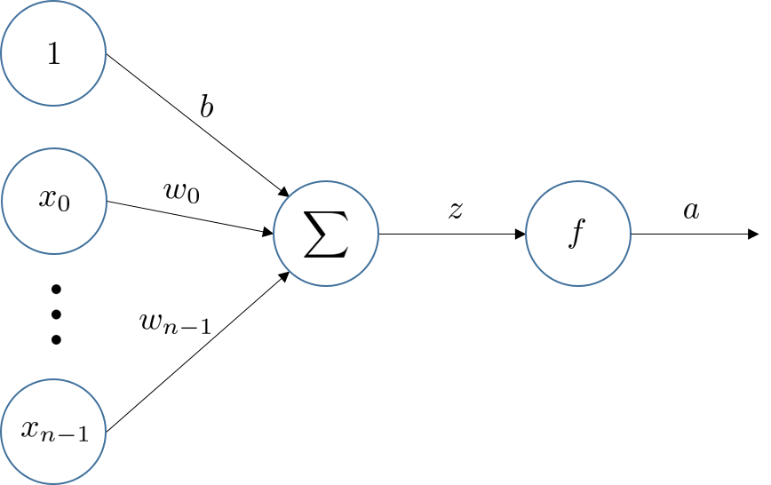

在现代神经网络中，激活函数都是连续可导的。常见的激活函数有 Tanh，ReLU，Sigmoid，Linear 等。

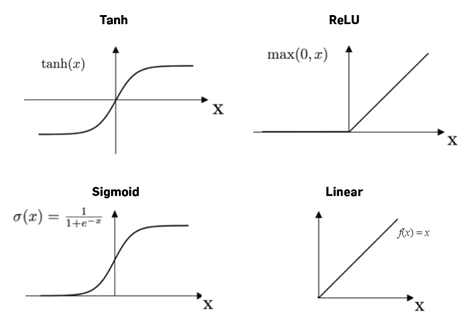

Tanh 和 Sigmoid 函数是 S 型函数，左右两端的导数逐渐逼近于 0。采用 ReLU 函数的神经元只需要进行加、乘、比较操作，计算量更小。然而，ReLU 函数输出的分布是非零中心化的，输出分布有偏置，会影响梯度下降效率，且第一层的 ReLU 神经元有可能在一次不恰当的参数更新后在所有训练数据上都不能被激活，那么这个神经元自身参数的梯度永远都是 0。为了避免上述情况，有几种 ReLU 函数的变种被引入，比如 PReLU、LeakyReLU 函数。

除了以上几种常见的激活函数，还有一类自门控激活函数，包括 Swish 函数和 GELU 函数。门控机制通过 Sigmoid 函数实现，输入较大时门“打开”，激活值近似于输入；输入较小时门“关闭”，激活值接近 0。

### 神经网络中的结构

神经元通过一定的连接形式组成神经网络，目前常用的两种连接方式是前馈网络和记忆网络。前馈网络中神经元将其输出输入到下一个神经元中，网络具有层级结构，一层神经元的输出作为下一层神经元的输入。记忆网络则是神经元的输出可以作为下一时刻神经元的输入。

#### 全连接网络

将输入的表示简化为向量$\mathbf{x}$，每个神经元的所有通道权重是$\mathbf{w}$，那么一个神经元的输出则是$\sigma(\mathbf{w}^T\mathbf{x}+b)$，当输入同时给多个神经元时，这些神经元输出组成的向量可以表示为

$$\sigma(\Big[{{\mathbf{w}^T_0 \atop \mathbf{w}^T_1} \atop {... \atop \mathbf{w}^T_{n-1}}}\Big]\mathbf{x}+\Big[{{b_0 \atop b_1} \atop {... \atop b_{n-1}}}\Big])$$

其中$\Big[{{\mathbf{w}^T_0 \atop \mathbf{w}^T_1} \atop {... \atop \mathbf{w}^T_{n-1}}}\Big]$可以用矩阵$\mathbf{W}$表示。

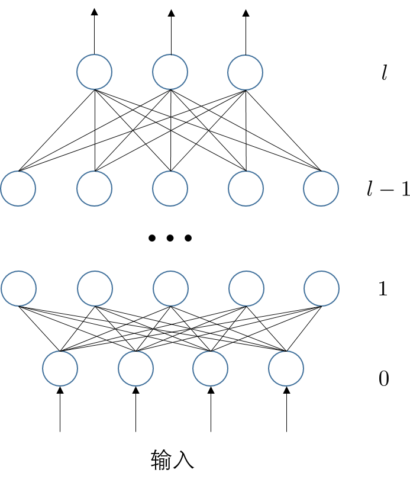

一个全连接层中有若干神经元，相邻全连接层的神经元之间都两两相连，因此对于第$l$层全连接层，进行下面两种运算

$$\mathbf{z}^{(l)}=\mathbf{W}^{(l)} \mathbf{a}^{(l-1)}+\mathbf{b}^{(l)},\\
\mathbf{a}^{(l)}=\sigma( \mathbf{z}^{(l)} )$$

第一种是仿射变换，第二种是非线性变换。$\mathbf{W}^{(l)}$和$\mathbf{b}^{(l)}$是第$l$层的参数，第$l$层的激活$\mathbf{a}^{(l)}$是由第$l-1$层的激活值决定。

#### 卷积神经网络

卷积层是卷积神经网络中的核心，而卷积神经网络常用于图像识别。在全连接层中，如果相邻层神经元两两连接，那么参数量会非常大，而采用卷积操作，将会大大减少可学习的参数量。卷积层有两个主要特点：1）局部连接：卷积层的每一个神经元都只和上一层的局部窗口内的神经元相连，权重参数量由原来的$M_l \times M_{l-1}$变成$M_l \times K$，$K$是卷积核大小；2）权重共享，所有神经元共享相同的卷积核参数。

不同于全连接层的神经元采用一维的组织形式描述，为了更直观理解卷积层，常用二维或者三维形式组织卷积层的神经元。下面是两种常见的卷积方式：第一种的特点是填充零使得输入特征图和输出的特征图大小一致；第二种则是不填充零，因此输出特征图比输入特征图更小。

将其扩展到三维，下面用一个例子说明对于一张有 RGB 三通道的$32\times 32$的图像，那么输入数据的大小为$32\times32\times3$，那么对第一层卷积层中每个输出特征图都需要 3 个卷积核，用这 3 个独立的卷积核分别对 RGB 三通道的图像进行卷积计算（第一种卷积方式）并求和，之后附加偏置并输入到激活函数得到一个$32\times32$大小的输出特征图，这个特征图上可能包含了原图像某一方面的特征。如果需要学习更多特征则需要输出多个相互独立的特征图，例如输出 16 个特征图，那么第一层卷积层的输出就是$32\times32\times16$，可以作为下一个网络层的输入。那么这个卷积层的权重参数量则是$3\times16\times K$。

#### 循环神经网络

循环神经网络（Recurrent Neural Network，RNN）是一类具有短期记忆能力的神经网络。在 RNN 中，神经元不但可以接受其它神经元的信息，也可以接受自身的信息。给定一个输入序列$x_1,x_2,...,x_T$，RNN 中的神经元包含两部分输入，一部分是$t$时刻下的输入$x_t$，一部分是上一个时刻的隐状态$h_{t-1}$，那么该神经元在$t$时刻的输出是

$$h_t=f(Uh_{t-1}+Wx_t+b)$$

其中$U,W,b$是神经元的可训练参数，$f$是激活函数，输出$h_t$也被称为$t$时刻的隐状态，可作为下一时刻的输入。

#### 注意力机制

为了减少计算复杂度，我们通过借鉴生物神经网络的一些机制，引入了局部连接、权重共享、汇聚（Pooling）操作来简化神经网络结构。除了这些机制，还有一种注意力机制。注意力机制是一种资源分配手段，将有限的计算资源用于处理更重要的信息。注意力机制的计算可分为两步，第一步是对所有输入的信息计算注意力分布，第二步则是根据注意力分布来计算输入信息的加权平均。计算注意力分布以及计算输入信息的加权平均涉及的操作主要是矩阵乘法和加法。

### 卷积神经网络发展

典型的卷积神经网络是由卷积层、汇聚层、全连接层交叉堆叠形成。下面是一些经典的卷积神经网络模型，例如 LeNet-5，AlexNet，GoogLeNet 等等。总体来说，模型的可学习参数量在逐步增大，网络层数也越来越深，同时为了减少计算开销和模型训练时间，学者在卷积核尺寸、模型结构等方面不断进行优化。

|      | LeNet-5 | AlexNet | VGG16   | GoogLeNet | ResNet50 | EfficientNet-B4 |
| ---- | ------- | ------- | ------- | --------- | -------- | --------------- |
| 输入尺寸 | 28X28   | 227X227 | 224X224 | 224X224   | 224X224  | 380X380         |
| 参数量  | 60k     | 61M     | 138M    | 7M        | 25.5M    | 19M             |
| 时间   | 1998    | 2012    | 2015    | 2015      | 2016     | 2019            |

#### LeNet-5

LeNet-5 是最早的卷积神经网络之一，其通过巧妙的设计，利用卷积、参数共享、汇聚等操作提取特征，避免了大量的计算成本，最后再使用全连接神经网络进行分类识别。第一层是卷积层，有 6 组特征映射，每组是 28X28 大小的特征图，紧接着是一个汇聚层，用于降采样，减少神经网络的参数，这里是最大汇聚，将上一层的紧邻四个值中选出最大的值作为汇聚层的激活值，这一层的计算只涉及比较（如果是平均汇聚则是求和以及除法），且不包含参数。后面叠加了一个卷积层和汇聚层，之后是三个全连接层，需要注意的是从汇聚层到全连接层，需要将汇聚层所有神经元展开成一维向量，长度是 16X5X5。后续计算主要涉及矩阵乘法。LeNet-5 的结构较为简单，可训练参数量约为 60k。

| 网络层   | 输入大小       | 核大小 | 核个数  | padding | stride | 输出大小       |
| ----- | ---------- | --- | ---- | ------- | ------ | ---------- |
| conv1 | (3,32,32)  | 5x5 | 6    | 0       | 1      | (6,28,28)  |
| pool1 | (6,28,28)  | 2x2 | none | 0       | 2      | (6,14,14)  |
| conv2 | (6,14,14)  | 5x5 | 16   | 0       | 1      | (16,10,10) |
| pool2 | (16,10,10) | 2x2 | none | 0       | 2      | (16,5,5)   |
| fc1   | 16x5x5     | 120 | none | none    | none   | 120        |
| fc2   | 120        | 84  | none | none    | none   | 84         |
| fc3   | 84         | 10  | none | none    | none   | 10         |

#### AlexNet

AlexNet 主要在以下几个方面提出优化。

- ReLU 激活函数：传统的神经网络普遍使用 Sigmoid 或者 tanh 等非线性函数作为激励函数，然而它们容易出现梯度弥散或梯度饱和的情况。以 Sigmoid 函数为例，当输入的值非常大或者非常小的时候，这些神经元的梯度接近于 0（梯度饱和现象），如果输入的初始值很大的话，梯度在反向传播时因为需要乘上一个 Sigmoid 导数，会造成梯度越来越小，导致网络变的很难学习。

- 重叠汇聚：一般的汇聚的步长与汇聚窗口大小一致，但是该模型中汇聚步长小于窗口长度，实验结果表明可以缓解过拟合。

- 数据增强方法：模型的能力是由模型的参数量和训练的数据量决定的，训练 AlexNet 时，提出了多种图像数据增强的方法，包括翻转、裁剪、平移、PCA 后加上高斯扰动。

- 局部归一化：在神经生物学有一个概念叫做 “侧抑制”（lateral inhibitio），指的是被激活的神经元抑制相邻神经元。归一化（normalization）的目的是 “抑制”，局部归一化就是借鉴了 “侧抑制” 的思想来实现局部抑制，尤其当使用 ReLU 时这种 “侧抑制” 很管用，因为 ReLU 的响应结果是无界的（可以非常大），所以需要归一化。

- Dropout：引入 Dropout 主要是为了防止过拟合。在神经网络中 Dropout 通过修改神经网络本身结构来实现，对于某一层的神经元，通过定义的概率将神经元置为 0，这个神经元就不参与前向和后向传播，就如同在网络中被删除了一样，同时保持输入层与输出层神经元的个数不变，然后按照神经网络的学习方法进行参数更新。在下一次迭代中，又重新随机删除一些神经元（置为 0），直至训练结束。Dropout 也可以看成是一种模型组合，每次生成的网络结构都不一样，通过组合多个模型的方式能够有效地减少过拟合，Dropout 只需要两倍的训练时间即可实现模型组合（类似取平均）的效果，非常高效。采用 Dropout 也有利于减少模型训练的计算量。

- 多 GPU 训练：单 GPU 内存有限，不利于网络规模扩大，每个 GPU 负责部分网络，特定层需要 GPU 之间的通信。

#### VGG16

相比于 AlexNet，VGG 探索了更大更深的网络模型的效果，将卷积核变小，全部使用 3X3 卷积核，$3\times3$卷积核堆叠三层的感受野与 7X7 卷积核的感受野一样，用小卷积核堆叠代替大卷积核既可以增加网络深度，也可以减少网络参数，使用大卷积核的参数量为$7\times7\times M \times M$，换成小卷积核后参数量为$3\times(3\times3\times M\times M$)。

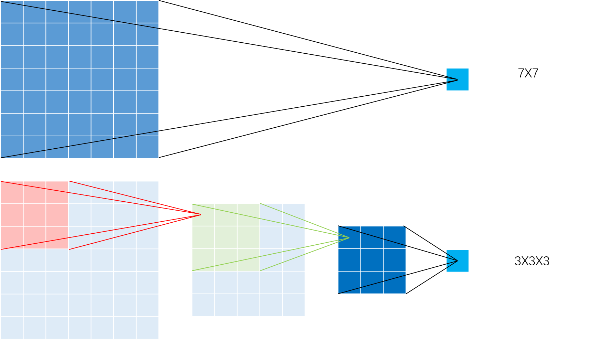

#### GoogLeNet

GoogLeNet 中，引入了 Inception 模块，在一个 Inception 模块使用了多尺度的卷积核，不同尺度的卷积核具有不同大小的感受野，可以提取不同尺度的特征，如下图所示。

但是上面的结构会导致模型参数量过大，为了降低参数量，在 5X5 卷积之前用 1X1 卷积并减少输出的通道数，假设之前需要 128X5X5X256，如果中间的通道数设为 32，则新的模型中参数量为 128X1X1X32+32X5X5X256。

之后，为了进一步降低参数量，GoogLeNet 将大卷积核变为小卷积核堆叠，比如将 5X5 的卷积核首先变成两个 3X3 的小卷积核堆叠，每个 3X3 的小卷积核再变成 1Xn 的卷积核和 nX1 的卷积核的堆叠。

#### ResNet

在 ResNet 提出之前，所有的神经网络都是通过卷积层和汇聚层的叠加组成的。人们认为卷积层和汇聚层的层数越多，获取到的图片特征信息越全，学习效果也就越好。但是在实验中发现，随着卷积层和汇聚层的叠加，不但没有出现学习效果越来越好的情况，反而出现了梯度消失和梯度爆炸两种问题。为了解决这个问题，ResNet 中采用了残差结构，让特征图隔层相加。另外采用 BN 层，代替 Dropout，BN 层使得整个训练样本集所对应 feature map 的数据满足一定分布规律（均值为 0，方差为 1）。

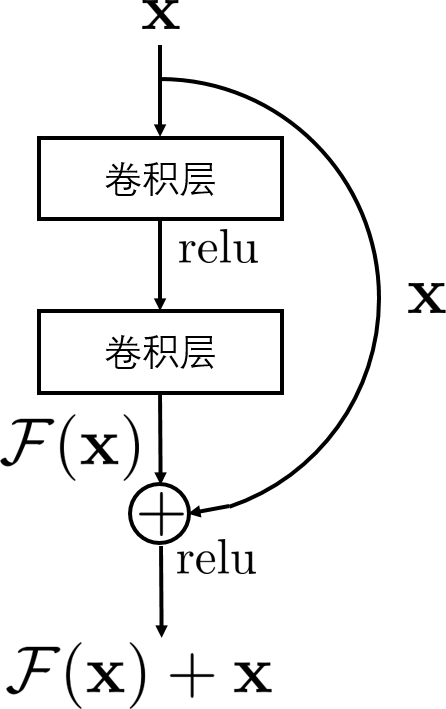

### 循环神经网络发展

循环神经网络是一类具有短期记忆能力的网络，在循环神经网络中，神经元不仅可以接收其他神经元的信息，还可以接收自身的信息，形成具有环路的网络结构。当输入序列比较长时，会存在梯度爆炸和梯度消失的问题，也称长程依赖问题。为了解决这个问题，学者对循环神经网络进行了很多改进，其中最有效的方式是引入门控机制。

#### 循环神经网络 RNN

RNN 是基础的循环神经网络，其输入为$x_t$，输出为$y_t$，

$$h_t=\text{tanh}(Uh_{t-1}+Wx_t+b),\\
y_t=Vh_t,$$

其中$U,W,V,b$是可学习参数。

#### 长短期记忆网络 LSTM

当输入序列较长时，RNN 会存在梯度爆炸和梯度消失的问题，为了解决这个问题，一个有效的改进方法是引入门控机制，其中经典的模型是长短期记忆网络（Long Short-Term Memory Network，LSTM）。LSTM 除了隐状态$h_t$，还引入了一个新的内部状态$c_t$。LSTM 中有三个门控单元，分别是遗忘门、输入门、输出门，所有门控单元的激活函数均采用 Sigmoid 函数，输出的值在 0 到 1 之间。输出的向量再对各部分信息采用向量元素乘，对信息进行一定程度的遗忘。其中，遗忘门控制上一个隐状态$h_{t-1}$需要遗忘多少信息，输入门控制当前内部状态$\widetilde{c}_t$需要保存多少信息，输出门控制当前内部状态$c_t$有多少信息需要输出给隐状态$h_t$。三个门控的计算方式为

$$f_t=\sigma(W_f x_t+U_f h_{t-1}+b_f),\\
i_t=\sigma(W_i x_t+U_i h_{t-1}+b_i),\\
o_t=\sigma(W_o x_t+U_o h_{t-1}+b_o),\\$$

那么当前时刻$t$的输出为$c_t,h_t$

$$\widetilde{c}_t=\text{tanh}(W_{\widetilde{c}} x_t+U_{\widetilde{c}} h_{t-1}+b_{\widetilde{c}}),\\
c_t=f_t\odot c_{t-1}+i_t\odot \widetilde{c}_t,\\
h_t=o_t\odot \text{tanh}(c_t)$$

#### 门控循环单元网络 GRU

LSTM 的一种变种是门控循环单元网络（Gated Recurrent Unit，GRU），同样使用门控机制，但结构比 LSTM 更简单，相比于 LSTM 计算量更少。GRU 引入一个更新门控制当前状态需要历史状态中保留多少信息，以及从当前输入中接收多少新信息。更新门为，

$$z_t=\sigma(W_z x_t+U_z h_{t-1}+b_z)$$

另外还有一个重置门，

$$r_t=\sigma(W_r x_t+U_r h_{t-1}+b_r)$$

候选状态与单元在$t$时刻的输出为，

$$\widetilde{h}_t=\text{tanh}(W_h x_t+ U_h(r_t\odot h_{t-1}) +b_h),\\
h_t=z_t \odot h_{t-1} + (1-z_t)\odot \widetilde{h}_t 
$$

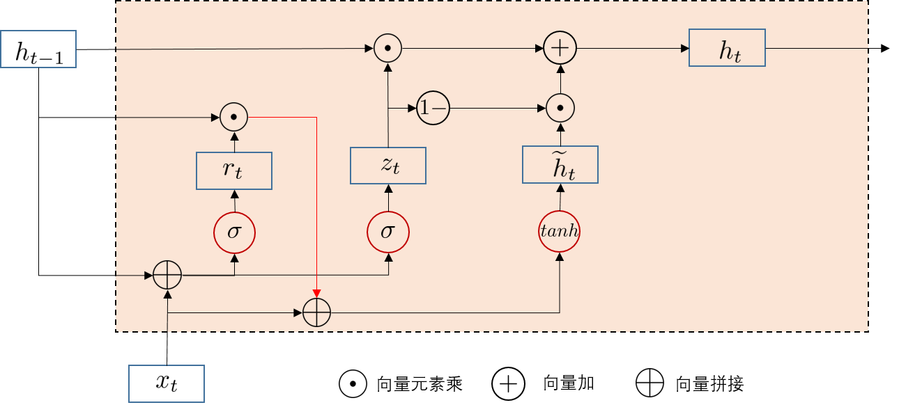

### AI 计算模式思考 1

- 支持神经网络模型的计算机制：随着诸如汇聚操作、权重共享、局部连接、Dropout、残差连接等机制引入到神经网络中，神经网络的计算量有所降低，但是计算方式变得多样化，需要更好地支持常见的计算机制。

- 支持常用的神经网络模型结构：神经网络中主要涉及的操作是矩阵乘法，实现高效矩阵乘是很重要的。除了矩阵乘法，还有矩阵元素乘、矩阵加法、矩阵拼接、非线性激活、汇聚等操作，高效实现这些操作对不同的模型同样重要。

## 模型轻量化与模型压缩

随着神经网络模型的发展，模型的深度、模型的参数量在不断增加，如今已经步入大模型时代。因此，模型训练时所需的内存占用、计算量，以及部署模型时所需的内存占用和计算量变得越来越大。为了减少模型所需的内存占用和计算量，需要进一步探究如何在保证模型精确度不会明显下降的情况下减少模型参数量。下面第一类方法是设计轻量化网络模型，设计轻量化模型的思路是神经网络中可能存在冗余部分，而去除这些部分对模型精度影响很小。第二类方法是对训练后的模型进行压缩，包括剪枝和量化。

### 轻量化网络模型设计

设计轻量化模型有两种主要方法：神经架构搜索和调整模型结构。第一种方法是神经架构搜索（Neural Architecture Search，NAS），NAS 是研究如何可以不借助于人工的人工调试的方式就可以达到自动化设计高性能深度神经网络架构。NAS 本质上是一个优化问题，通过合适的优化算法，对 NAS 进行求解，最终自动化得到一个神经网络的结构。一个 NAS 算法由三个部分组成：搜索空间、搜索策略和评估策略。根据搜索空间的颗粒度不同，目前搜索空间可以大概分成以下四类：

- Layer-based：关注网络层中的参数，比如卷积核。

- Block-based：每个块中包含多个网络层，关注块里的参数，比如残差模块。

- Cell-based：每个 cell 中堆叠多个块，关注块之间的连接。

- Topology-based：关注的是基本单元之间的操作。

搜索策略可以采用强化学习、梯度下降、进化学习等方法。评估算法则需要进行大量的训练、评估、验证和性能比较，以确定最佳神经网络。然而，每个神经网络的全面训练都是资源密集型的，需要大量的时间和计算资源。

第二种方法是根据实验与结果分析，人工调整模型结构，比如改变模型不同层的输出特征图尺寸和卷积方式。下面主要介绍第二种方法中一些经典案例。

#### 叠加小卷积核代替大卷积核

在 VGG 网络模型中，用小卷积核代替大卷积核来减少网络参数，假设大卷积核的大小为$7\times 7$，用$3\times 3$的小卷积核代替。使用大卷积核时，下一层网络中的神经元的感受野是$7\times 7$。为了在使用小卷积核时可以有等效的感受野，需要增加网络层，则最后一层对前一层的感受野是$3\times 3$，对再前面一层的感受野是$5\times 5$，对第一层的感受野是$7\times 7$。现在来对比两种方式所需要的参数量，使用大卷积核时，参数量为$7\times 7+1$，而使用小卷积核时参数量为$3\times (3\times 3+1)$。使用小卷积核代替大卷积核除了能减少参数量，还能增加网络深度。

在 GoogLeNet 模型的 InceptionNetV3 中，进一步减小卷积核的尺寸，将$3\times 3$的卷积核拆分成$1\times 3$卷积核和$3\times 1$卷积核的叠加。

#### 减少通道数

在 GoogLeNet 的 InceptionNetV2 中，插入了使用$1\times 1$的卷积核的网络层用以减少模型参数量。假设输入特征图是有$M$个通道，输出特征图有$N$个通道，则需要的卷积核个数是$M\times N$，卷积核大小为$3\times 3$时，参数量为$(3\times 3+1)\times M\times N$。现在插入一个有$K$（$K<M$）个通道的中间层，这个中间层使用$1\times 1$的卷积核，参数量为$(1\times 1+1)\times M \times K+(3\times 3+1)\times K \times N$。

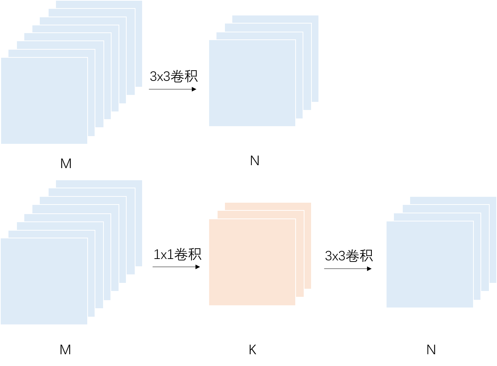

#### 特征图重用

在 ResNet 中，引入了残差结构，让特征图隔层相加作为输入。ResNet 的特征图之间的连接是稀疏连接，为了进一步重用特征图，DenseNet 中采用密集连接，相对于 ResNet 减少了参数量和计算量。

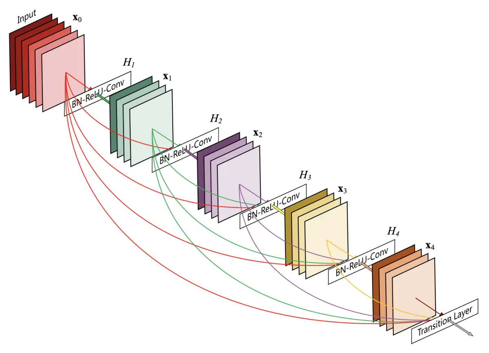

一张图片经过神经网络进行特征提取后，能够得到很多特征图，其中存在相似的特征图。因此在 GhostNet 中，作者提出对一张特征图进行变换得到相似的特征图，可以减少网络需要的参数量。作者设计了 Ghost 模块代替传统卷积计算，首先采用标准卷积得到少量特征图，然后对这部分特征图生成相似特征图，生成过程是对每个特征图分别进行线性操作，比如$3\times 3$和$5\times 5$线性核，这种线性核的计算量少于标准卷积。通过这样的方式让特征图成倍增加，然后将不同的特征图拼接到一起，组合成新的输出。由于计算量主要集中在标准卷积计算，Ghost 模块中的计算量会大大降低。

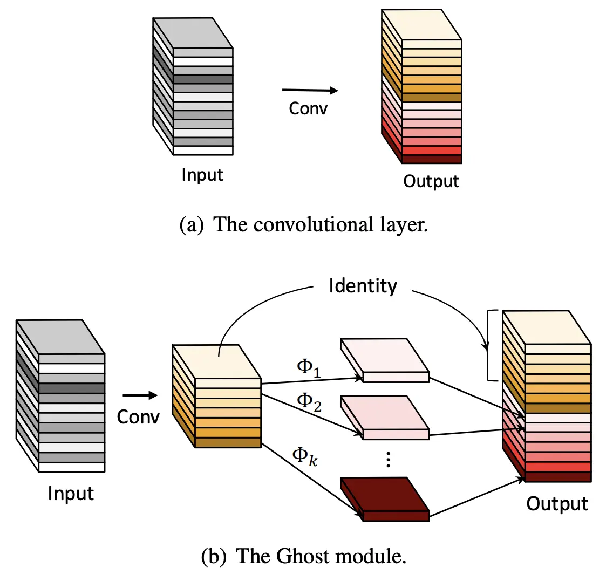

#### 从 LSTM 到 GRU

LSTM 中包含了一个额外的内部状态$c_t$，且有三个门控机制：遗忘门、输入门、输出门。输入门和遗忘门是互补关系，具有一定冗余性，GRU 于是用一个重置门控制输入和遗忘之间的平衡。GRU 通过用重置门和更新门代替 LSTM 中三个门、去掉内部状态$c_t$，从而去除了 LSTM 中冗余的结构，降低了模型的复杂度。（详见上文**循环神经网络发展**一节）

### 模型压缩

通常在训练模型时为了精度，权重值大多会使用 32 位浮点数（FP32）表示法，这就代表了每个权重占用了 4 个 Byte（32bit）的储存（硬盘）和计算（随机内存）空间。为了让运行时减少模型参数在 CPU 和 GPU、NPU 之间间搬移的次数，通常会把所有数据都一次性加载到内存中，但一般设备的内存都不会太大，当模型参数量较大时，如果没有经过一些模型压缩处理，则很难全部加载到内存。目前常用的四种模型压缩方式是模型量化、模型剪枝、权重共享、知识蒸馏。

#### 模型量化

模型的参数数值在计算机中有几种存储方式，不同存储方式所需的内存大小不同、表示的精度也有所不同。常见的的包括几种浮点型（FP32、FP16、TF32、BP16），以及整型（Int32、Int16、Int8）。量化一般是从精度较高的表示压缩为精度较低的表示，比如从 FP32 量化成 Int8，bit 位数从 32 位变成 8 位，表示精度有所降低，而表示位数也减少了。

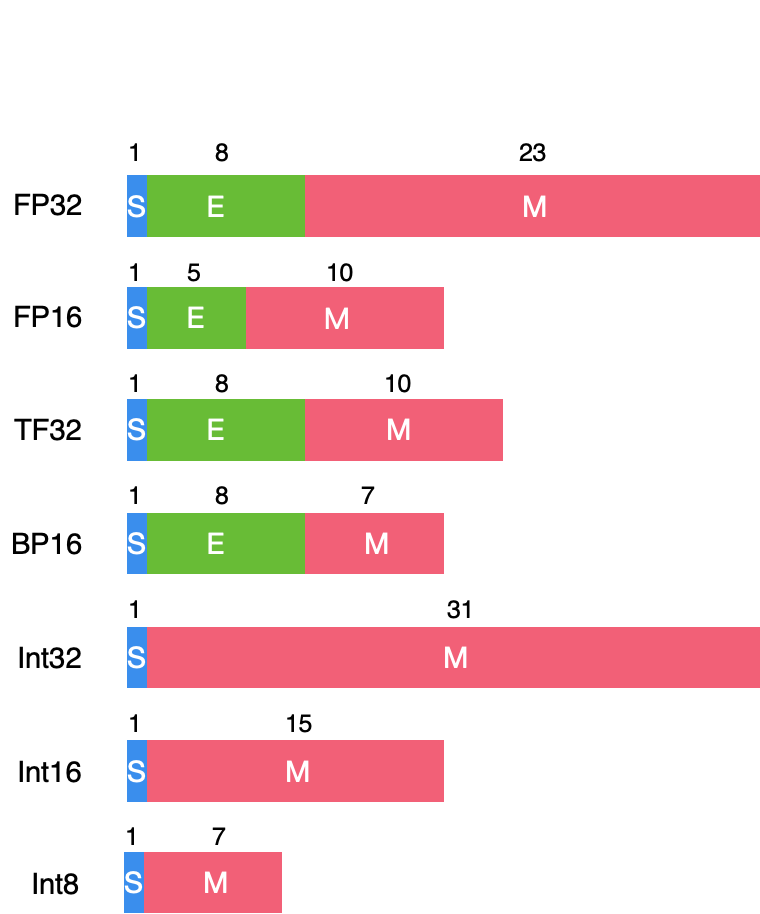

模型量化是指通过减少权重表示或激活所需的比特数来压缩模型。即通过降低参数的表示精度来压缩模型大小，例如原先模型训练时所有参数采用 32bit 长度，但在用于部署时，为了减少模型所需的内存，将 32bit 压缩为 8bit。通过降低比特位数的模型压缩方法可以实现压缩参数、提升运算速度、降低内存开销、降低功耗、提升芯片面积。目前在模型量化方向上有一些研究热点，包括感知量化训练、减少计算比特位、非线性量化、减少权重计算。

- 感知量化训练：通常量化是在模型训练完成后对参数压缩，但这个过程会使得模型有一定程度的精度损失。通过在模型训练阶段引入量化相关约束，让模型适应量化带来的误差，即量化感知训练（Quantization-aware training，QAT），能够更好地解决模型量化导致的精度下降问题。

- 减少计算比特位：二值化网络模型最早由 Yoshua Bengio 在 2016 年提出，论文中使用随机梯度下降方法训练带有二值化的权重和激活值的神经网络模型，网络中权重和激活值只包括 1 和-1。

- 非线性量化：根据量化数据表示的原始数据范围是否均匀，可以将量化分为线性量化和非线性量化。线性量化也称为均匀量化，在线性量化中相邻两个量化值之间的差距是固定的。非线性量化中量化值之间的间隔不固定。由于网络中值的分布往往是不均匀的，更多的是类似高斯分布的形式。非线性量化可以更好的捕获分布相关的信息，数据多的地方量化间隔小，量化精度高；数据少的地方量化间隔大，量化精度低。因此非线性量化的效果理论上比线性量化更好。然而非线性量化的通用硬件加速比较困难，而且实现更加复杂。

- 减少权重计算：传统卷积运算需要使用大量乘法，而大量乘法运算依赖于 GPU 等硬件设备，限制了在移动设备上的应用。为了避免乘法运算，一些模型中采用了新的卷积核，例如 XNORnet 采用了逻辑运算核，用逻辑计算代替乘法运算，Addernet 采用了加法核，用加法运算代替乘法运算。

#### 网络剪枝

标准的网络剪枝的过程一般是：

- 训练：训练模型得到最佳网络性能；

- 剪枝：根据剪枝算法对模型剪枝，调整网络结构中神经元、卷积核、通道或者网络层；

- 微调：在原数据集上进行微调，用于弥补模型因剪枝丢失的精度。

除了上述的标准剪枝过程之外，基于子模型采样的剪枝也表现出很好的剪枝效果。一次子模型采样过程为：

- 对训练好的原模型中可修剪的网络结构按照剪枝目标进行采样；

- 对采样出的网络结构进行剪枝，得到采样子模型并进行性能评估，选取最优的子模型进行微调得到最后的剪枝模型。

另外还有基于搜索的剪枝，它主要依靠强化学习或者神经网络结构搜索相关理论。给定剪枝目标之后，基于搜索的剪枝在网络结构中搜索较优的子结构。

按剪枝方法分类可分为结构化剪枝和非结构化剪枝，非结构化剪枝去除不重要的神经元，相应地，被剪除的神经元和其他神经元之间的连接在计算时会被忽略。由于剪枝后的模型通常很稀疏，并且破坏了原有模型的结构，所以这类方法被称为非结构化剪枝。非结构化剪枝能极大降低模型的参数量和理论计算量，但是现有硬件架构的计算方式无法对其进行加速，所以在实际运行速度上得不到提升，需要设计特定的硬件才可能加速。与非结构化剪枝相对应的是结构化剪枝，结构化剪枝通常以滤波器（卷积核）、通道或者整个网络层为基本单位进行剪枝。一个滤波器被剪枝，那么其前一个特征图和下一个特征图都会发生相应的变化，但是模型的结构却没有被破坏，仍然能够通过 GPU 或其他硬件来加速，因此这类方法被称之为结构化剪枝。

高精度的大模型在进行剪枝后，在内存占用相同情况下，仍比同体积的非稀疏模型有更高的精度。另外，在资源有限的情况下，剪枝是比较有效的模型压缩策略。然而，模型剪枝后可能会产生稀疏矩阵，在硬件稀疏矩阵存储方向可以继续优化。

#### 权重共享

由于权重值大多是由浮点数表示，所以若能将近似值进行群聚（合并），用较少的数量来表达，再使用查表法来映射，可以有效减少存储开销。 但缺点是这样的作法会增加一些对照表，增加推理时额外的查表工作，且由于和原数值有些微差异，因此会损失一些推论精度。

如下图所示，即是将 16 个权重先聚类成 4 个权重（索引值），再将原本的权重值变成索引号，于是权重矩阵用一个索引矩阵表达，在计算时再查表搜索权重值，这样储存空间就降到原本的 1/4。

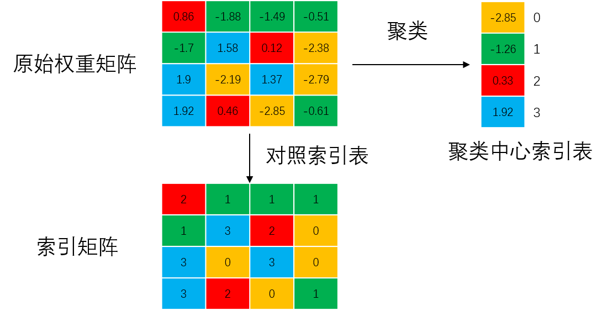

#### 知识蒸馏

知识蒸馏最早由 Hinton 等人提出，用于大模型压缩以及专家模型训练。对于一般的神经网络模型，最后的输出向量$z$被称为 logits，Hinton 等人之前，Caruana 等人已经提出了将大的集成的模型的知识迁移到单个小模型中，具体方法就是最小化小模型的 logits 输出和复杂模型的 logits 输出的平方差。logits 经过 softmax 函数得到模型的类别预测概率，

$$q_i = \frac{\exp(z_i)}{\sum_j \exp(z_j)}$$

其中$q_i$表示不同类别的预测概率。这个预测结果是 soft target，而真实目标是 hard target，一般机器学习的目标就是让 soft target 逼近 hard target。

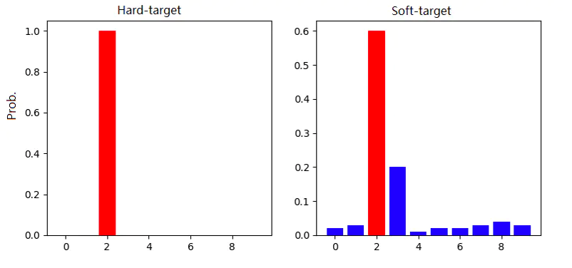

Hinton 等人引入“蒸馏”的概念，在上式基础上添加一个温度系数$T$，

$$q_i = \frac{\exp(z_i/T)}{\sum_j \exp(z_j/T)}$$

当$T=1$时，就是标准的 softmax 函数。T 越大，分布的熵越大，负标签携带的信息会被放大，负标签的概率分布会对损失函数有更明显的影响，模型训练会更关注这部分信息。为什么要重视负标签的信息？举一个例子，宝马车被当做垃圾箱的概率很低，基本接近于 0，但还是比被当做胡萝卜的概率要高得多。当负标签的概率都很低时，负标签之间的概率差异仍然包含了一部分信息，而这部分信息往往被模型忽略（因为所有负标签概率接近于 0）。例如 MNIST 数据集中存在一个数字 2 的样本被预测为 3 的概率为$10^{-6}$，被预测为 7 的概率为$10^{-9}$，这部分负标签的信息就意味着这个数字 2 有可能与 3 和 7 有些相像。通常，在蒸馏学习过程中，将 T 适当调高并保持不变，使得学生模型可以学习到负标签的信息，等学生模型训练完成后，将 T 设为 1，用于推理。

假设教师模型和学生模型是应用于分类问题的模型，即模型最终输出会经过 softmax 处理，得到一个不同类别的概率分布。蒸馏过程中除了教师模型和学生模型，一个重要的部分是数据集，数据集可以是训练教师模型所用的数据集，也可以是其他的辅助数据集，可以是有标签的数据集，也可以是无标签的数据集。如果蒸馏过程中使用的数据集有标签，则学生模型的训练目标有两个，一个是模仿教师模型的输出，另一个是接近真实标签，而一般前者是主要目标，后者是次要目标。目标函数可写为，

$$\mathcal{L}_{soft} = -\sum_j p_j^T log(q_j^T),\\
\mathcal{L}_{hard} = -\sum_j c_j log(q_j),\\
\mathcal{L} = \mathcal{L}_{soft} + \lambda \mathcal{L}_{hard}$$

其中$p_j^T$表示教师模型在$T$下（$T$通常大于 1）的预测结果，$q_j^T$表示学生模型在$T$下的预测结果，$c_j$表示真实标签，$q_j$表示学生模型在$T=1$时的预测结果。当数据集无标签时，只能用$\mathcal{L}_{soft}$。

### AI 计算模式思考 2

- 优化模型设计：卷积神经网络和循环神经网络模型的计算优化方向之一是优化网络结构。卷积神经网络可以直接堆叠网络层使得网络深度更大，优化卷积神经网络可以从卷积操作、网络层连接方式等不同层面优化。循环神经网络的结构优化主要是对单个单元结构优化。

- 支持特殊的卷积方式：一些方案中为了避免使用乘法，将普通卷积核替换为逻辑运算核或者加法核，用逻辑运算或者加法代替乘法，考虑支持特殊的卷积方式。

- 支持不同 bit 位数：对低比特量化模型提供 int8 甚至更低的精度；由于模型不同层的作用不同，一些网络层需要更高精度而一些网络层精度可以较低，不同网络层的参数可用不同长度的 bit 位数表示，需要对这类具有不同精度表示的网络模型提供支持。

- 稀疏化模型的存储与计算：模型中可能存在稀疏化的现象，首先需要支持稀疏化模型的存储并节省存储空间，另外，硬件上还需要减少零值的重复计算。

## 大模型分布式并行

随着神经网络模型变得越来越大，存储参数所需的空间越来越大，在单机单卡上训练大模型是难以完成的，如何分布式并行训练大模型，成为一个研究热点。

### DP、DDP 和 FSDP

数据并行（Data Parallelism，DP）的基本过程是：多块 GPU 分别加载一个完整的模型，更新模型参数时把一个 batch 拆分成多个 micro-batch，分别发给这些 GPU，每个 GPU 做完计算后，得到一份梯度，最后把所有梯度上传给一个服务器进行累加，用于更新模型参数。分布式数据并行（Distributed Data Parallel，DDP）与 DP 不同的地方在于每块 GPU 做完计算后，通过 Ring-AllReduce 的方法通信完成参数更新 DP 中有一个最明显的问题就是通过单一 server 节点进行梯度聚合，此时 server 的带宽就会成为瓶颈 。于是 DDP 把通信方式改成了 Ring-AllReduce，解决了通信负载不均衡的问题。

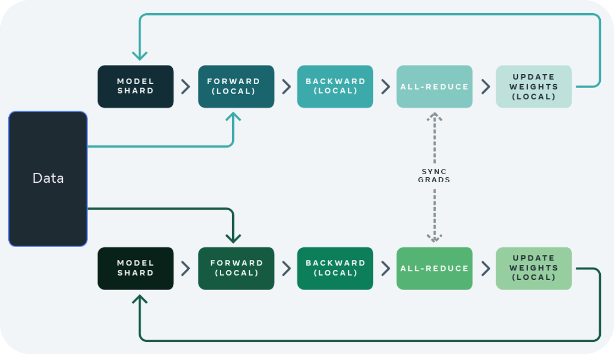

FSDP（Fully Sharded Data Parallel）是在 DDP 的基础上提出的。在 DDP 中，核心的能力还是训练数据并行（Data Parallel），并没有实现对模型参数的分片管理，即模型并行（Model Parallel）。在 FSDP 中实现了模型的分片管理能力，真正实现了模型并行。将模型分片后，在使用 FSDP 训练模型时，每个 GPU 只保存模型的一个分片，这样能够使 GPU 的内存占用比 DDP 方式小得多，从而使分片的大模型和数据能够适配 GPU 容量，更有希望实现超大模型的分布式训练。FSDP 的过程大致如下：初始阶段，首先对模型参数分片，并且 GPU 只持有它自己的分片；随后运行 all_gather 算法，收集所有 GPU 上的模型参数分片，得到完整模型并完成 forward 计算，计算完成后丢掉所有被收集过的其它 GPU 上的模型参数分片；再次运行 all_gather，收集所有 GPU 上的模型参数分片，得到完整模型运行 backward 计算，接着运行 reduce_scatter，所有 GPU 同步梯度更新，最后丢掉所有从其它 GPU 上收集过的模型参数分片。

#### Ring-AllReduce

如下图所示，all-reduce 是一种将跨设备的同一行的值求和，并将结果值返回到相应行的操作。

all-reduce 的操作可以分为两步，第一步是 reduce-scatter，每个设备完成一部分的求和，第二步是 all-gather，将各部分的求和发送到所有其它设备。

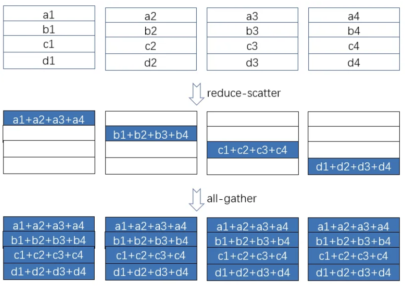

在 reduce-scatter 阶段，我们假设有 p 个设备(图例中 p=4)，矩阵的大小为 V，将矩阵分为 p 块，那么经过 reduce-scatter 运算后，每个设备将接收到一个大小为 V/p 的数据块。如果设备之间的通信是双工的，其带宽为β，则在采用环通信时，每个设备的输入/输出带宽都可以同时达到β，同一时刻下所有设备的输入/输出带宽之和也等于 p×β，即所有设备的带宽都得到充分利用。总共有 p 个设备，每个设备上的数据被分成 p 个部分，因此基于环通信的 reduce-scatter 操作必须执行 p-1 个步骤。经过 p-1 步后，每个设备在矩阵对应的位置上完成了求和。在整个过程中，每个设备发送和接收的数据量为(p-1)V/p，输出或输入带宽为β，因此该过程所需的时间为(p-1)V/pβ。如果 p 足够大，完成时间将接近 V/β，完成时间与设备数量 p 无关！当然，所有设备之间传输的数据量是(p-1)V，它与设备数量 p 成正比。

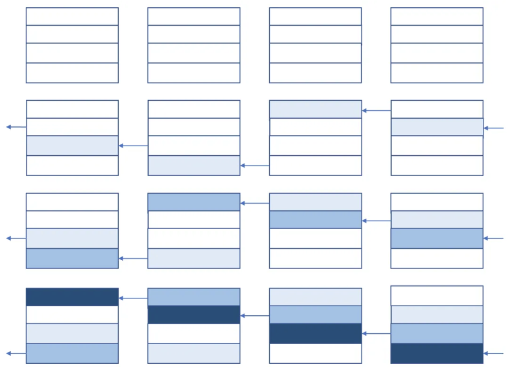

all-gather 阶段的通信过程与 reduce-scatter 阶段类似，只是这个阶段不需要进行求和操作，只需要完成通信并更新参数。所有设备之间传输的数据量是(p-1)V，该过程所需的时间为(p-1)V/pβ。

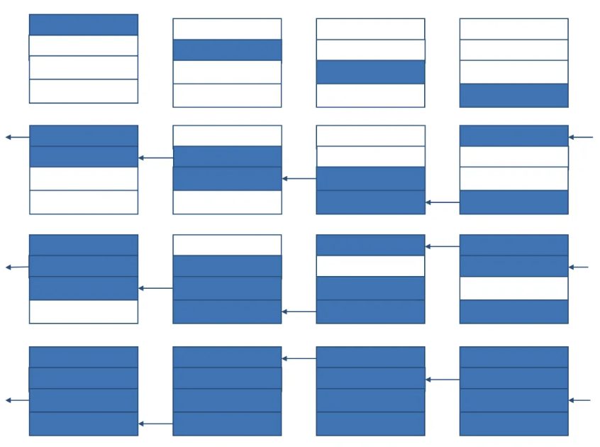

对 Ring-AllReduce 算法进行分析：在 V 保持不变的情况下，增加 p，设备的数量(我们称 p 为集体通信的并行宽度)，所有设备之间的通信流量将成比例地增加，所有设备的冗余内存（不同的设备存储了一些相同的数据）也将成比例地增加。当然，完成某种集体交流所需的时间与平行宽度 p 几乎无关。所以，增加平行宽度 p 是一把双刃剑。一方面，它使每个设备处理更少的数据，即 V/p，从而缩短了计算时间。但另一方面，它占用了更多的通信带宽(p-1)V 和更多的内存空间(p-1)V。

### Megatron-LM

NVIDIA Megatron-LM 是一个基于 PyTorch 的分布式训练框架，用来训练基于 Transformer 的大型语言模型。Megatron-LM 综合应用了数据并行（Data Parallelism），张量并行（Tensor Parallelism）和流水线并行（Pipeline Parallelism）。其中流水线并行是将模型的不同层放置在不同的设备上。例如，前几层放在一个设备上，中间几层放在另 一个设备上，最后几层放在第三个设备上。这种方式可以在不同设备上并行执行不同的模型阶段，从而提高效率。张量并行则是对模型的层内部进行分割，将某一层的计算分配到不同的设备上。这也可以被理解为将大矩阵运算拆分成多个小矩阵运算，然后分布到不同的设备上进行计算。

#### 张量并行

将神经网络中的计算抽象为矩阵乘法，比如$XA=Y$。行并行是把$A$按行分割，同时把$X$按列分割，则
$$XA=[X_1\ X_2]\Big[ {A_1 \atop A_2}\Big] = X_1A_1+X_2A_2=Y_1+Y_2=Y$$
将上式的$A_1,X_1$和$A_2,X_2$分别发送给两个 GPU，同时完成乘法运算$X_1A_1$和$X_2A_2$，最后运算结果求和。

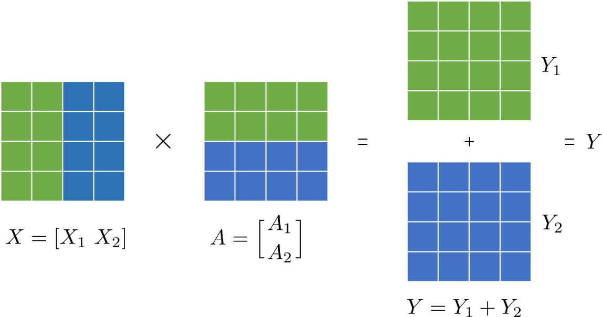

列并行则是将$A$按列分割，$A=[A_1\ A_2]$，两个 GPU 分别得到$A_1$和$A_2$，同时它们都存储$X$，分别完成运算$XA_1$和$XA_2$。

在 Transformer 中，包括两种主要的网络层，一种是前馈层，一种是多头自注意力层。对前馈层的运算分割，假设输入矩阵是$X$，那么对权重矩阵$A$只能采用列并行，因为矩阵乘法结果需要进行非线性变换（GELU 激活），而$\text{GELU}(X_1A_1+X_2A_2)\neq \text{GELU}(X_1A_1)+\text{GELU}(X_2A_2)$，所以这里的矩阵乘法运算不能采用行并行而是采用列并行。列并行的结果为$[Y_1\ Y_2]=[\text{GELU}(XA_1)\ \text{GELU}(XA_2)]$。GELU 操作后还有 Dropout 的操作，这里对权重矩阵$B$进行行分割，完成行并行运算。

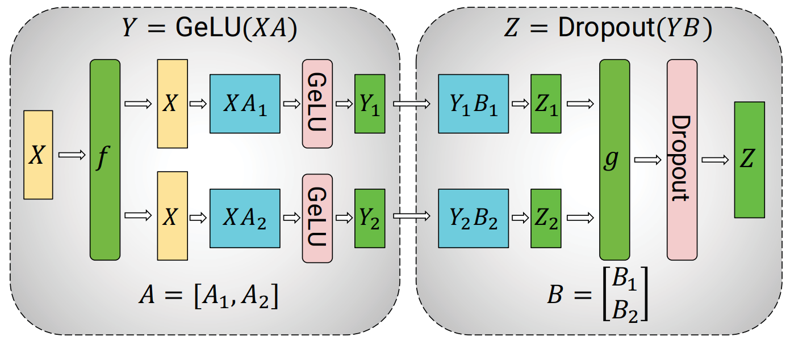

对于多头自注意力层，首先，多头注意力机制本身具有并行性，以列并行方式对与键（K）、查询（Q）和值（V）相关联的矩阵进行分区，从而在一个 GPU 上本地完成与每个注意力头对应的矩阵乘法。其次，对于后续的全连接层，权重矩阵$B$就按行切分。

#### 流水线并行

目前主流的流水线并行方法包括了两种：Gpipe 和 PipeDream。与这两者相比，Megatron 中的流水线并行实现略有不同，它采用了 Virtual Pipeline 的方法。简而言之，传统的流水线并行通常会在一个设备上放置几个模块，通过在计算强度和通信强度之间取得平衡来提高效率。然而，虚拟流水线则采取相反的策略。在设备数量不变的前提下，它将流水线阶段进一步细分，以承载更多的通信量，从而降低空闲时间的比率，以缩短每个步骤的执行时间。

G-pipe 将 Transformer 按层切分放到多个 device 上，forward 计算和 backward 计算采用流水线的方式进行，这样做的劣势是空泡率（下图流水线中设备的空闲时间）较高。下图中是 G-pipe 的方法演示，蓝色块 1-8 编号表示 8 个 micro-batch 的前馈计算，绿色是反向传播，device1 处输入输入数据计算得到中间结果，把计算结果交给 device2 进行网络后续的前馈计算，device2 完成后又交给 device3，最后 device4 得到模型最终的输出结果，再进行反向传播。

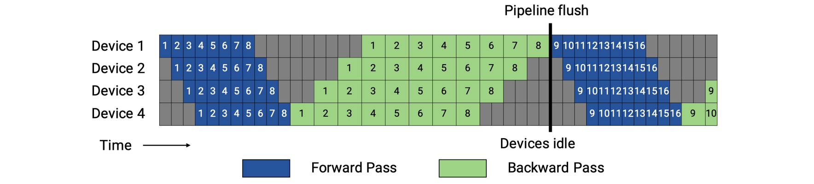

PipeDream 的方案如下图中上面一种流水线所示，其相对与 G-pipe 的改进在内存方面，空泡时间和 G-pipe 一致，但通过合理安排前向和反向过程的顺序，减少了设备需要保存的激活值，每个 device 上最少只需要保存 1 份 micro-batch 的激活值，最多需要保存 4 份激活值。可以看到，激活值份数的上限从 micro-batch 数量 8 变成了 pipeline stage 阶段 4，这样就可以通过增大 micro-batch 数量有效降低空泡占比。

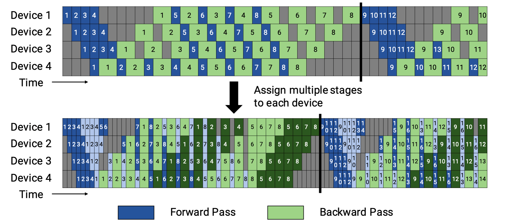

Virtual Pipeline（上图中下面一种流水线并行方式）在 device 数量不变的情况下，分出更多的 pipeline stage，以更多的通信量，换取空泡比率降低。Virtual Pipeline 是怎么做到的呢？对照示例，若模型被分为 16 层（编号 0-15），4 个 device，G-pipe 和 PipeDream 是把模型分成 4 段，按编号 0-3 层放 device1，4-7 层放 device2，以此类推。Virtual Pipeline 则是按照 virtual_pipeline_stage 的概念减小切分粒度，以 virtaul_pipeline_stage=2 为例，将 0-1 层放在 device1, 2-3 层放在 device2，4-5 层放在 device3，6-7 层放到 device4，8-9 层继续放在 device1，10-11 层放在 device2，12-13 层放在 device3，14-15 层放在 device4。按照这种方式，设备之间的点对点通信次数和通信量直接翻了 virtual_pipeline_stage 倍，但空泡比率降低了。下图是 Virtual Pipeline 的演示，蓝色表示模型的 0-7 层的 forward 运算，浅蓝色表示模型的 8-15 层的 forward 运算，浅绿色表示 8-15 层的 backward 运算，深绿色表示 0-7 层的 backward 运算，编号是 micro-batch 的编号。

## AI 计算模式思考

- 支持参数量更大、深度更深的神经网络模型：通过多 GPU 或者优化硬件通信、支持大模型的存储和计算；支持大矩阵的乘法，对大矩阵乘法进行优化。

- 支持多样化的计算操作和神经网络结构：从基本的操作层面，支持神经网络模型中常用的一些操作，并对相关操作进行优化；从模型结构设计层面，支持不同结构的神经网络的计算方式，考虑对某一类型的模型进行计算优化。

- 为压缩后的模型提供合适的存储方式以及计算方式：支持不同精度表示的量化模型的存储和计算；考虑稀疏化的模型有许多重复的 0 值，可以提供更节省空间的存储方式，以及避免 0 值重复参与计算。

- 轻量化模型设计：当前模型的设计以神经元作为基础单元，神经元组成一个网络层，网络层采用串联或者并联的方式组成一个模块，通过连接不同的模块组成整个模型。因此，模型设计优化可以从神经元、网络层、网络模块、模型等不同层面进行考虑，也可以从这些结构之间的连接方式进行考虑。

- 支持大模型分布式并行：大模型设计时需要对并行计算提供良好支持，比如 Transformer 模型；大模型分布式并行计算中，通信容易成为瓶颈，可以从通信算法上进行优化；流水线并行可以有效利用所有硬件设备的运算时间，避免有的设备出现长时间的等待。

## 参考文献

- https://www.jianshu.com/p/1314bcc1d19f

- https://zhuanlan.zhihu.com/p/650383289

- https://oneflow2020.medium.com/how-to-derive-ring-all-reduces-mathematical-property-step-by-step-9951500db96

- https://zhuanlan.zhihu.com/p/432969288

- https://www.knime.com/blog/a-friendly-introduction-to-deep-neural-networks

- https://machine-learning.paperspace.com/wiki/activation-function

- https://developer.NVIDIA.com/blog/accelerating-ai-training-with-tf32-tensor-cores/

- https://zhuanlan.zhihu.com/p/619914824

- https://blog.csdn.net/weixin_43424450/article/details/134352857

- LeCun Y, Bottou L, Bengio Y, Haffner, P. [Gradient-based learning applied to document recognition.](https://doi.org/10.1109/5.726791) 

- Krizhevsky A, Sutskever I, Hinton G E. [ImageNet classification with deep convolutional neural networks.](https://proceedings.neurips.cc/paper/2012/hash/c399862d3b9d6b76c8436e924a68c45b-Abstract.html)

- Szegedy C, Liu W, Jia Y, et al. [Going deeper with convolutions.](https://doi.org/10.1109/CVPR.2015.7298594)

- Simonyan K, Zisserman A. [Very deep convolutional networks for large-scale image recognition.](http://arxiv.org/abs/1409.1556)

- Kaiming H, Xiangyu Z, Shaoqing R, Jian S. [Deep Residual Learning for Image Recognition.](https://doi.org/10.1109/CVPR.2016.90)

- Hanting C, Yunhe W, Chunjing X, Boxin S, Chao X, Qi T, Chang X. [AdderNet: Do We Really Need Multiplications in Deep Learning?](https://doi.org/10.1109/CVPR42600.2020.00154)

## 本节视频

<html>
<iframe src="https://player.bilibili.com/player.html?aid=993183455&bvid=BV17x4y1T7Cn&cid=1046878675&page=1&as_wide=1&high_quality=1&danmaku=0&t=30&autoplay=0" width="100%" height="500" scrolling="no" border="0" frameborder="no" framespacing="0" allowfullscreen="true"> </iframe>
</html>

</html>
<iframe src="https://player.bilibili.com/player.html?aid=865754482&bvid=BV1754y1M78X&cid=1049051877&page=1&as_wide=1&high_quality=1&danmaku=0&t=30&autoplay=0" width="100%" height="500" scrolling="no" border="0" frameborder="no" framespacing="0" allowfullscreen="true"> </iframe>
</html>
