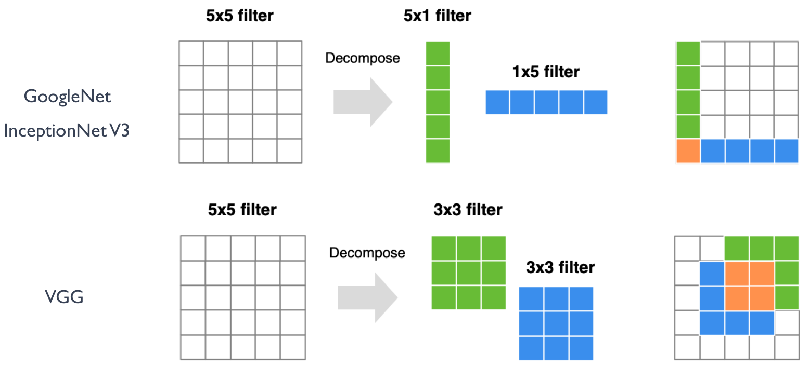
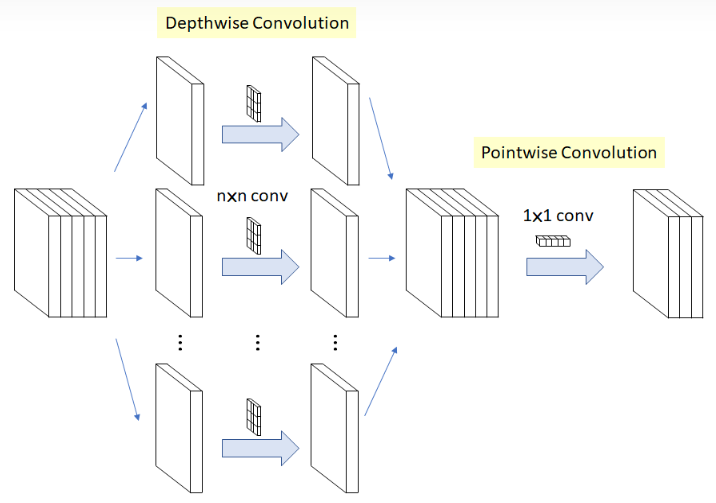
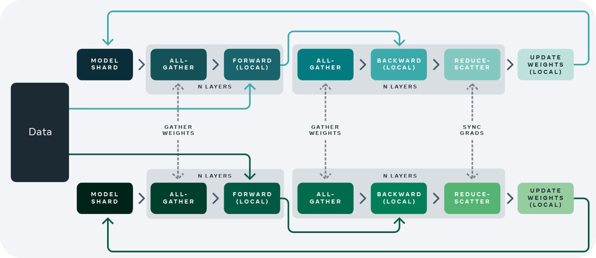
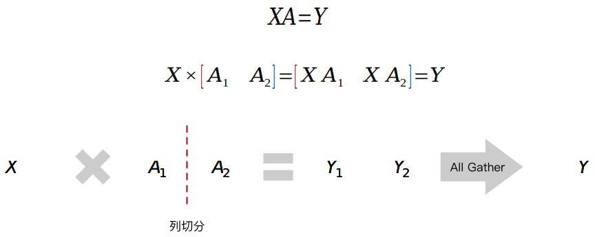
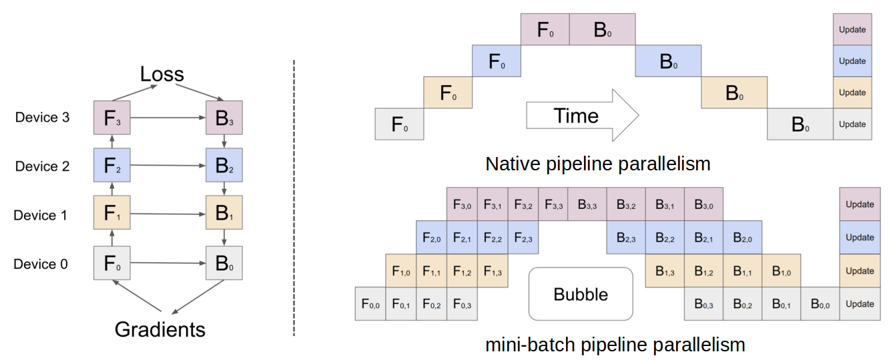

# AI计算模式

了解AI计算模式对AI芯片设计和优化方向至关重要。本节将会从如下几个主题来深入了解AI算法的发展现状，引发关于AI计算模式的思考，为了避免篇幅过长，分为2小节内容。我们接着前面的视频进入后两个主题。

- AI的发展和范式
- 经典模型结构
- 模型量化与剪枝
- 轻量化网络模型
- 大模型分布式并行

## 轻量化网络模型设计

随着深度神经网络应用的普及，越来越多的模型需要在特定的硬件平台部署，如移动端和嵌入式设备，这些平台普遍存在内存资源少，处理器性能不高，功耗受限等特点，所以慢慢演变出了一种轻量化的网络模型设计方向，即在保持模型精度基础上进一步减少模型参数量和计算量的网络模型结构。

网络模型的轻量级衡量指标有两个，一个是网络参数量、另一个是浮点运算数(Floating-point Operations, FLOPs)，也就是计算量。对于卷积神经网络中卷积层的参数量和计算量定义如下。

**Params—网络参数量**

对于输入为w x h x Ci的输入图像，卷积核大小为k×k，得到输出的特征图大小为W x H x Co的卷积操作，其参数量为：Params = (k x k x Ci +1) x Co

**FLOPs——浮点运算数**

对于输入为 w x h x Ci的输入图像，卷积核大小为 k×k，得到输出的特征图大小为 W x H x Co 的卷积操作，其浮点运算数为：FLOPs = W x H x (k x k x Ci +1) x Co

一般来说，网络模型参数量和浮点运算数越小，模型的速度越快，但是衡量模型的快慢不仅仅是参数量**、**计算量的多少，还有内存访问的次数多少相关，也就是和网络结构本身相关。在前面推理引擎系列的[轻量网络](https://space.bilibili.com/517221395/channel/collectiondetail?sid=1018326)视频中，我们已经详细的介绍了这些模型复杂度的分析指标，以及一些CNN和Transformer系列的经典轻量级模型，现在我们将从AI计算模式的角度进一步分析这些轻量化设计的特点。

总体来说，设计轻量化网络模型有两个方法：

方法1，通过改变网络模型不同层的shape或者卷积方式。比如SqueezeNet, ShuffleNet, MobileNet系列

方法2，通过神经网络架构搜索（Neural Architecture Search，NAS）来搜索更轻量化的网络模型

NAS是一种自动化机器学习技术，旨在通过搜索大量可能的神经网络结构和超参数组合，以找到最优的网络结构，从而实现对特定任务的最佳性能。这种方法可以显著减少人工设计网络结构的工作量，并在一定程度上提高模型的性能。NAS技术的优势在于可以自动化地探索复杂的网络结构空间，发现传统人工设计所难以发现的高性能模型。但是在实际应用中基于NAS的网络需要对具体的硬件架构做定制化设计，以优化性能和能效。

NAS技术通常包括以下关键步骤：

- 搜索空间定义：定义搜索的神经网络结构和超参数的空间范围。这可以包括不同的层类型（如卷积层、池化层、全连接层等）、层数、宽度、学习率、正则化参数等。

- 搜索策略选择：选择适当的搜索策略来探索搜索空间。常见的策略包括随机搜索、贝叶斯优化、进化算法、强化学习、基于梯度的算法。

- 评估和筛选：在搜索过程中，使用评价指标（如准确率、速度、模型大小等）对生成的网络结构进行评估和筛选，保留表现良好的候选结构。

- 迭代优化： 不断迭代进行搜索、评估和筛选，直到找到满足性能要求的最佳网络结构或达到预设的搜索次数或时间限制。

下面针对方法1的优化设计做具体的展开分析。

**减少内存空间的设计**
为了减小模型的参数量，在VGG和inceptionNet系列网络中，提出了将两个3x3卷积核一个5x5卷积核，和将一个5x1卷积核和一个1x5卷积核代替一个5x5的卷积核的模型卷积层设计，如下图所示。

比如使用2个3x3卷积核来代替5x5卷积核，这样做的主要目的是在保证具有相同感知野的条件下，提升了网络的深度，在一定程度上提升了神经网络的效果，并且模型参数可以由5 x 5 x Ci x Co变成了3 x 3 x Ci x Co+3 x 3 x Ci x Co，假设Ci = Co, 该层参数可以减小为原来的18/25。

**减少通道数的设计**

MobileNet系列的网络设计中，提出了深度可分离卷积的设计策略，其中通过depthwise逐层卷积加1x1的卷积核来实现一个正常的卷积操作（如下图所示），1x1的Pointwise卷积负责完成卷积核通道的缩减来减小模型参数量。

比如一个3x3卷积核大小的卷积层，输入通道是16， 输出通道是32，正常的卷积模型参数是3x3x16x32=4608，而将其模型替代设计为一个3x3卷积核的depthwise卷积，和1x1卷积核的Pointwise卷积，模型参数为3x3x16+1x1x16x32=656，可以看出模型参数量得到了很大的减少。

**减少卷积核个数的设计**

在DenseNet和GhostNet的模型设计中，提出了一种通过Reuse feature map的设计方式来减少模型参数和运算量。

如下图，对于DenseNetV1的结构设计来说，第n层的参数量由于复用了之前层的feature map, 由kxkxCix(C1+C2)变为了kxkxCixC2，即为原来的C2/(C1+C2)，而C2远小于C1，其中k表示卷积核尺寸, C1表示前n-1层的feature map个数，C2表示第n层的输出feature map个数。

## AI计算模式思考（III）
通过上面模型网络轻量化的分类，可以看到AI模型网络中对卷积层的不同设计方法，这些都是芯片设计时候需要考虑支持的AI计算模式特性。

卷积核尺寸：

1. 大卷积核用多个小卷积核代替 
2. 单一尺寸卷积核用多尺寸卷积核代替 
3. 固定形状卷积核趋于使用可变形卷积核 
4. 使用1×1卷积核 - bottleneck结构

卷积层运算：

1. 标准卷积用depthwise卷积代替
2. 使用分组卷积
3.  channel shuffle
4. 通道加权计算

卷积层连接：

1. 使用skip connection，让模型更深
2. densely connection，融合其它层特征输出

## 大模型分布式并行

大模型算法作为一个火热的AI的研究领域，本身具有超高的模型参数量和计算量的特点。如何在AI芯片上高效的支持大模型算法是芯片设计公式必须要考虑的问题。在单芯片或者加速卡上无法提供所需的算力和内存需求的情况下，考虑大模型分布式并行技术是一个重要的研究方向。

同样在AI框架核心技术视频模块中，已经分为[分布式系统，分布式算法](https://space.bilibili.com/517221395/channel/collectiondetail?sid=784079)，[分布式并行技术](https://space.bilibili.com/517221395/channel/collectiondetail?sid=936465)三部分重点介绍了相关的知识。这里也通过对模型分布式并行技术做一个简单的回顾，来引发我们对AI计算模式的思考。

分布式并行分为数据并行、模型并行，模型并行又分为张量并行和流水线并行。下面分别对数据并行和模型并行做一个简单的回顾。

**数据并行技术**

根据模型在设备之间的通信程度，数据并行技术可以分为DP, DDP, FSDP三种。

1. Data parallelism, DP

   数据并行是最简单的一种分布式并行技术，具体实施是将大规模数据集分割成多个小批量，每个批量被发送到不同的计算设备（如GPU）上并行处理。每个计算设备拥有完整的模型副本，并单独计算梯度，然后通过all_reduce通信机制在计算设备上更新模型参数，以保持模型的一致性。

2. Distribution Data Parallel, DDP

   DDP 是一种分布式训练方法，它允许模型在多个计算节点上进行并行训练，每个节点都有自己的本地模型副本和本地数据。DDP 通常用于大规模的数据并行任务，其中模型参数在所有节点之间同步，但每个节点独立处理不同的数据批次。

   在 DDP 中，每个节点上的模型副本执行前向和后向传播计算，并计算梯度。然后，这些梯度在不同的节点之间进行通信和平均，以便所有节点都可以使用全局梯度来更新其本地模型参数。这种方法的优点是可以扩展到大量的节点，并且可以显著减少每个节点的内存需求，因为每个节点只需要存储整个模型的一个副本。

   DDP 通常与深度学习框架（如 PyTorch、TensorFlow）一起使用，这些框架提供了对 DDP 的内置支持。例如，在 PyTorch 中，`torch.nn.parallel.DistributedDataParallel` 模块提供了 DDP 实现，它可以自动处理模型和梯度的同步，以及分布式训练的通信。

3. Fully Sharded Data Parallel, FSDP

   Fully Sharded Data Parallelism (FSDP) 技术是DP和DDP技术的结合版本，可以实现更高效的模型训练和更好的横向扩展性。这种技术的核心思想是将神经网络的权重参数以及梯度信息进行分片（shard），并将这些分片分配到不同的设备或者计算节点上进行并行处理。FSDP分享所有的模型参数，梯度，和优化状态。所以在计算的相应节点需要进行参数、梯度和优化状态数据的同步通信操作。

如上图是FSDP并行技术的示意图，可以看到不同的计算节点多了一些虚线链接的通信操作。

**并行技术中的通信原语**

在并行计算中，通信原语是指用于在不同计算节点或设备之间进行数据传输和同步的基本操作。这些通信原语在并行计算中起着重要作用，能够实现节点间的数据传输和同步，从而实现复杂的并行算法和应用。一些常见的通信原语包括：

- All-reduce：所有节点上的数据都会被收集起来，然后进行某种操作（通常是求和或求平均），然后将结果广播回每个节点。这个操作在并行计算中常用于全局梯度更新。

- All-gather： 每个节点上的数据都被广播到其他所有节点上。每个节点最终都会收到来自所有其他节点的数据集合。这个操作在并行计算中用于收集各个节点的局部数据，以进行全局聚合或分析。

- Broadcast：一台节点上的数据被广播到其他所有节点上。通常用于将模型参数或其他全局数据分发到所有节点。

- Reduce： 将所有节点上的数据进行某种操作（如求和、求平均、取最大值等）后，将结果发送回指定节点。这个操作常用于在并行计算中进行局部聚合。

- Scatter： 从一个节点的数据集合中将数据分发到其他节点上。通常用于将一个较大的数据集合分割成多个部分，然后分发到不同节点上进行并行处理。

- Gather： 将各个节点上的数据收集到一个节点上。通常用于将多个节点上的局部数据收集到一个节点上进行汇总或分析。

**Megatron-LM与模型并行技术**

模型的并行技术可以总结为Tensor并行和Pipeline并行。

Tensor Parallesim：将模型的张量操作分解成多个子张量操作，并且在不同的设备上并行执行这些操作。这样做的好处是可以将大型模型的计算负载分布到多个设备上，从而提高模型的计算效率和训练速度。在Tensor并行中，需要考虑如何划分模型的不同层，并且设计合适的通信机制来在不同设备之间交换数据和同步参数。通常会使用诸如All-reduce等通信原语来实现梯度的聚合和参数的同步。

如下图是一个矩阵乘算子的tensor并行示意。X作为激活输入，A作为算子权重，将A按列切分。每个计算节点保留一份完整的A和部分A，最后通过All Gather通信将两个计算节点的数据进行同步拼接为一份完整的Y输出，供下一层使用。

Pipeline Parallelism：将模型的不同层划分成多个阶段，并且每个阶段在不同的设备上并行执行。每个设备负责计算模型的一部分，并将计算结果传递给下一个设备，形成一个计算流水线。在Pipeline并行中，需要设计合适的数据流和通信机制来在不同设备之间传递数据和同步计算结果。通常会使用缓冲区和流水线控制器来管理数据流，并确保计算的正确性和一致性。

如下图是一个流水线并行示意过程。假设一个模型有Forward，Backward两个阶段，有0-3共4层网络设计，分布在4个计算设备处理，右图展示了在时间维度下，不同层不同阶段的执行顺序示意。为了减少每个设备等待的时间（即中间空白的区域，称为Bubble），一个简单的优化设计就是增加data parallelism，让每层数据切分为若干个batch，来提高流水线并行设备利用率。

将上面提到的分布式并行结合起来使用，就是混合并行，NVIDIA Megatron-LM 是一个基于 PyTorch 的分布式训练框架，用来训练基于Transformer的大型语言模型。Megatron-LM 通过综合应用数据并行（Data Parallelism），张量并行（Tensor Parallelism）和流水线并行（Pipeline Parallelism）实现了高效的GPT-3模型训练。

## AI计算模式思考（IV）

根据对大模型并行技术的了解，不同的并行策略其实展示了AI计算模式是如何体现在硬件设计技术上。在芯片架构设计中可以从如下几个方面进行考虑。

1. 芯片间互连技术，提供X00GB/s的带宽
- 支持 CPU+GPU 双架构， 为大规模 AI 和HPC异构平台提供高速带宽(nvidia的nvlink技术)

- 使能 NPU 同构芯片内超快片间互连技术
2. 专用高速 Transformer 引擎
- 高速的Transformer计算。Transformer作为大模型的基础模块结构，可以进行通用的transformer引擎设计。
- 更低比特Transformer模块，并支持MoE构建万亿大模型。

## AI计算模式思考总结

通过以上我们对AI算法几个角度的研究进展分析，下面我们对发现的AI特有计算模式做一个总结，这些特点将会对AI芯片的硬件设计具有很强的指导意义。AI系统整个课程体系的技术都会围着AI计算模式展开。

1. 网络模型结构支持 Architecture
◦ 支持高维的张量存储与计算
◦ 神经网络模型的计算逻辑
2. 模型压缩(剪枝&量化) Model Compress
◦ 提供不同的 bit 位数
◦ 利用硬件提供稀疏计算
3. 轻量化网络模型 Model Slim
◦ 复杂卷积计算（小型卷积核，e.g. 1x1 Conv）
◦ 复用卷积核内存信息（Reuse Convolution）
4. 大模型分布式并行 Foundation Model
◦ 大内存容量、高速互联带宽
◦ 专用大模型DSA IP模块，提供低比特快速计算

## 参考文献
- https://www.knime.com/blog/a-friendly-introduction-to-deep-neural-networks
2. https://machine-learning.paperspace.com/wiki/activation-function
3. https://developer.nvidia.com/blog/accelerating-ai-training-with-tf32-tensor-cores/
4. https://arxiv.org/pdf/1704.04861

## 本节视频

</html>

<iframe src="https://player.bilibili.com/player.html?aid=865754482&bvid=BV1754y1M78X&cid=1049051877&page=1&as_wide=1&high_quality=1&danmaku=0&t=30&autoplay=0" width="100%" height="500" scrolling="no" border="0" frameborder="no" framespacing="0" allowfullscreen="true"> </iframe>
</html>
