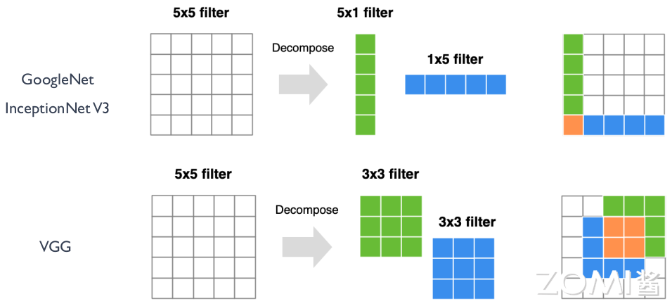
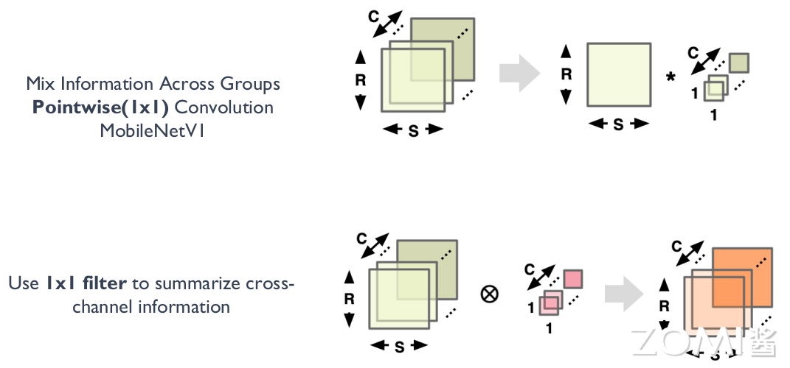
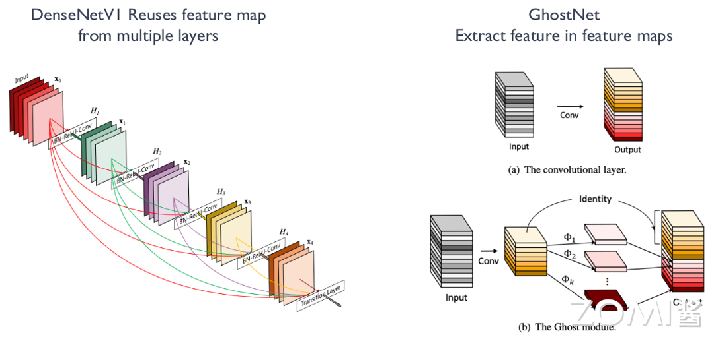
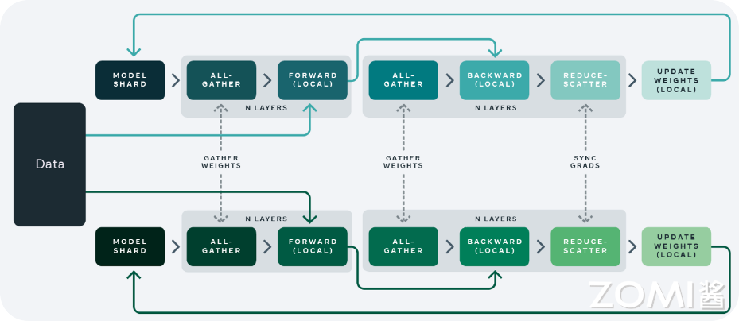
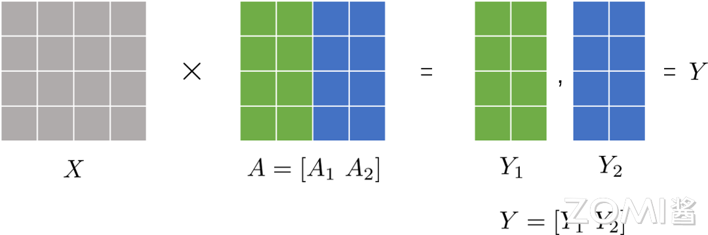
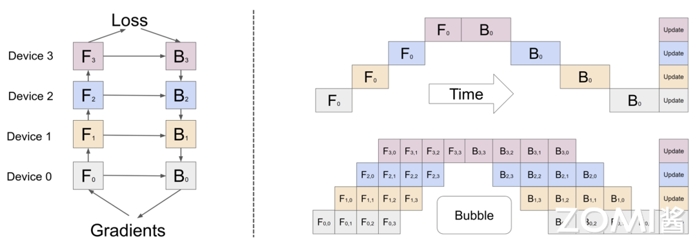

<!--Copyright ©  适用于[License](https://github.com/chenzomi12/AISystem)版权许可-->

# AI 计算模式（下）

了解 AI 计算模式对 AI 芯片设计和优化方向至关重要。本节将会接着从轻量化网络模型和大模型分布式并行两个主题来深入了解 AI 算法的发展现状，引发关于 AI 计算模式的思考。

## 轻量化网络模型

随着神经网络应用的普及，越来越多的模型需要在特定的硬件平台部署，如移动端和嵌入式设备，这些平台普遍存在内存资源少，处理器性能不高，功耗受限等特点，所以慢慢演变出了一种轻量化的网络模型设计方向，即在保持模型精度基础上进一步减少模型参数量和计算量的网络模型结构。

### 模型轻量化方法

网络模型的轻量级衡量指标有两个，一个是网络参数量、另一个是浮点运算数(Floating-point Operations, FLOPs)，也就是计算量。对于卷积神经网络中卷积层的参数量和计算量定义如下。

**Params 网络参数量**

对于输入为 $w \times h \times Ci$ 的输入图像，卷积核大小为 $k \times k$，得到输出的特征图大小为 $W \times H \times Co$ 的卷积操作，其参数量为：$Params = (k \times k \times Ci + 1) \times Co$。

**FLOPs 浮点运算数**

对于输入为 $w \times h \times Ci$ 的输入图像，卷积核大小为 k×k，得到输出的特征图大小为 $W \times H \times Co$ 的卷积操作，其浮点运算数为：$FLOPs = W \times H \times (k \times k \times Ci +1) \times Co$。

一般来说，网络模型参数量和浮点运算数越小，模型的速度越快，但是衡量模型的快慢不仅仅是参数量和计算量的多少，还有内存访问的次数多少相关，也就是和网络结构本身相关。现在我们将从 AI 计算模式的角度进一步分析这些轻量化设计的特点。

1. **减少内存空间的设计**

为了减小模型的参数量，在 VGG 和 InceptionNet 系列网络中，提出了将两个 $3 \times 3$ 卷积核一个 $5 \times 5$ 卷积核，和将一个 $5 \times 1$ 卷积核和一个 $1 \times 5$ 卷积核代替一个 $5 \times 5$ 的卷积核的模型卷积层设计，如下图所示。

比如使用 2 个 $3 \times 3$ 卷积核来代替 $5 \times 5$ 卷积核，这样做的主要目的是在保证具有相同感知野的条件下，提升了网络的深度，在一定程度上提升了神经网络的效果，并且模型参数可以由 $5  \times  5  \times  Ci  \times  Co$ 变成了 $3  \times  3  \times  Ci  \times  Co+3  \times  3  \times  Ci  \times  Co$，假设 $Ci = Co$, 该层参数可以减小为原来的 $18/25$。

2. **减少通道数的设计**

MobileNet 系列的网络设计中，提出了深度可分离卷积的设计策略，其中通过 Depthwise 逐层卷积加 $1 \times 1$ 的卷积核来实现一个正常的卷积操作（如下图所示），$1 \times 1$ 的 Pointwise 卷积负责完成卷积核通道的缩减来减小模型参数量。

比如一个 $3 \times 3$ 卷积核大小的卷积层，输入通道是 16，输出通道是 32，正常的卷积模型参数是 $3 \times 3 \times 16 \times 32=4608$，而将其模型替代设计为一个 $3 \times 3$ 卷积核的 Depthwise 卷积，和 $1 \times 1$ 卷积核的 Pointwise 卷积，模型参数为 $3 \times 3 \times 16+1 \times 1 \times 16 \times 32=656$，可以看出模型参数量得到了很大的减少。

3. **减少卷积核个数的设计**

在 DenseNet 和 GhostNet 的模型设计中，提出了一种通过 Reuse Feature Map 的设计方式来减少模型参数和运算量。

如下图，对于 DenseNetV1 的结构设计来说，第 n 层的参数量由于复用了之前层的 Feature Map, 由 $k \times k \times C1 \times (C1+C2)$ 变为了 $k \times k \times C1 \times C2$，即为原来的 $C2/(C1+C2)$，而 C2 远小于 C1，其中 k 表示卷积核尺寸, C1 表示前 n-1 层的 Feature Map 个数，C2 表示第 n 层的输出 Feature Map 个数。

### AI 计算模式思考

通过上面模型网络轻量化的分类，可以看到 AI 模型网络中对卷积层的不同设计方法，这些都是芯片设计时候需要考虑支持的 AI 计算模式特性。

卷积核尺寸：

1. 小卷积核替代：用多个小卷积核代替单个大卷积核，以降低计算成本。
2. 多尺寸卷积核：采用不同尺寸的卷积核来捕捉多尺度特征。
3. 可变形卷积核：从固定形状转向可变形卷积核，以适应不同输入特征。
4. 1×1 卷积核：使用 1×1 卷积核构建 bottleneck 结构，有效减少参数和计算量。

卷积层运算：

1. Depthwise 卷积：用 Depthwise 卷积代替标准卷积，减少参数，保持特征表达。
2. Group 卷积：应用分组卷积，提高计算效率，降低模型复杂度。
3. Channel Shuffle：通过通道混洗（Channel Shuffle）增强特征融合，提升模型性能。
4. 通道加权：实施通道加权计算，动态调整通道贡献，优化特征表示。

卷积层连接：

1. Skip Connection：采用跳跃连接（Skip Connection），使网络能够更深，同时避免梯度消失问题。
2. Dense Connection：利用密集连接（Densely Connection），整合不同层的特征，增强特征融合和信息流。

## 大模型分布式并行

大模型算法作为一个火热的 AI 的研究领域，本身具有超高的模型参数量和计算量的特点。如何在 AI 芯片上高效的支持大模型算法是芯片设计公式必须要考虑的问题。在单芯片或者加速卡上无法提供所需的算力和内存需求的情况下，考虑大模型分布式并行技术是一个重要的研究方向。

分布式并行分为数据并行、模型并行，模型并行又分为张量并行和流水线并行。下面先介绍并行计算时候经常用到的集合通信原语，然后分别对数据并行和模型并行做一个简单的回顾。

### 集合通信原语

在并行计算中，通信原语是指用于在不同计算节点或设备之间进行数据传输和同步的基本操作。这些通信原语在并行计算中起着重要作用，能够实现节点间的数据传输和同步，从而实现复杂的并行算法和应用。一些常见的通信原语包括：

- All-reduce：所有节点上的数据都会被收集起来，然后进行某种操作（通常是求和或求平均），然后将结果广播回每个节点。这个操作在并行计算中常用于全局梯度更新。

- All-gather：每个节点上的数据都被广播到其他所有节点上。每个节点最终都会收到来自所有其他节点的数据集合。这个操作在并行计算中用于收集各个节点的局部数据，以进行全局聚合或分析。

- Broadcast：一台节点上的数据被广播到其他所有节点上。通常用于将模型参数或其他全局数据分发到所有节点。

- Reduce：将所有节点上的数据进行某种操作（如求和、求平均、取最大值等）后，将结果发送回指定节点。这个操作常用于在并行计算中进行局部聚合。

- Scatter：从一个节点的数据集合中将数据分发到其他节点上。通常用于将一个较大的数据集合分割成多个部分，然后分发到不同节点上进行并行处理。

- Gather：将各个节点上的数据收集到一个节点上。通常用于将多个节点上的局部数据收集到一个节点上进行汇总或分析。

### 数据并行技术

根据模型在设备之间的通信程度，数据并行技术可以分为 DP, DDP, FSDP 三种。

1. Data parallelism, DP 数据并行

数据并行是最简单的一种分布式并行技术，具体实施是将大规模数据集分割成多个小批量，每个批量被发送到不同的计算设备（如 NPU）上并行处理。每个计算设备拥有完整的模型副本，并单独计算梯度，然后通过 all_reduce 通信机制在计算设备上更新模型参数，以保持模型的一致性。

2. Distribution Data Parallel, DDP 分布式数据并行

DDP 是一种分布式训练方法，它允许模型在多个计算节点上进行并行训练，每个节点都有自己的本地模型副本和本地数据。DDP 通常用于大规模的数据并行任务，其中模型参数在所有节点之间同步，但每个节点独立处理不同的数据批次。

在 DDP 中，每个节点上的模型副本执行前向和后向传播计算，并计算梯度。然后，这些梯度在不同的节点之间进行通信和平均，以便所有节点都可以使用全局梯度来更新其本地模型参数。这种方法的优点是可以扩展到大量的节点，并且可以显著减少每个节点的内存需求，因为每个节点只需要存储整个模型的一个副本。

DDP 通常与 AI 框架（如 PyTorch）一起使用，这些框架提供了对 DDP 的内置支持。例如，在 PyTorch 中，`torch.nn.parallel.DistributedDataParallel` 模块提供了 DDP 实现，它可以自动处理模型和梯度的同步，以及分布式训练的通信。

3. Fully Sharded Data Parallel, FSDP 全分片数据并行

Fully Sharded Data Parallelism (FSDP) 技术是 DP 和 DDP 技术的结合版本，可以实现更高效的模型训练和更好的横向扩展性。这种技术的核心思想是将神经网络的权重参数以及梯度信息进行分片（shard），并将这些分片分配到不同的设备或者计算节点上进行并行处理。FSDP 分享所有的模型参数，梯度，和优化状态。所以在计算的相应节点需要进行参数、梯度和优化状态数据的同步通信操作。

如上图是 FSDP 并行技术的示意图，可以看到不同的计算节点多了一些虚线链接的通信操作。

### 模型并行技术

模型的并行技术可以总结为张量并行和流水并行。

1. **张量并行**

将模型的张量操作分解成多个子张量操作，并且在不同的设备上并行执行这些操作。这样做的好处是可以将大模型的计算负载分布到多个设备上，从而提高模型的计算效率和训练速度。在张量并行中，需要考虑如何划分模型的不同层，并且设计合适的通信机制来在不同设备之间交换数据和同步参数。通常会使用诸如 All-reduce 等通信原语来实现梯度的聚合和参数的同步。

如下图是一个矩阵乘算子的张量并行示意。X 作为激活输入，A 作为算子权重，将 A 按列切分。每个计算节点保留一份完整的 A 和部分 A，最后通过 All Gather 通信将两个计算节点的数据进行同步拼接为一份完整的 Y 输出，供下一层使用。

2. **流水并行**

将模型的不同层划分成多个阶段，并且每个阶段在不同的设备上并行执行。每个设备负责计算模型的一部分，并将计算结果传递给下一个设备，形成一个计算流水线。在流水并行中，需要设计合适的数据流和通信机制来在不同设备之间传递数据和同步计算结果。通常会使用缓冲区和流水线控制器来管理数据流，并确保计算的正确性和一致性。

如下图是一个流水线并行示意过程。假设一个模型有 Forward，Backward 两个阶段，有 0-3 共 4 层网络设计，分布在 4 个计算设备处理，右图展示了在时间维度下，不同层不同阶段的执行顺序示意。为了减少每个设备等待的时间（即中间空白的区域，称为 Bubble），一个简单的优化设计就是增加 data parallelism，让每层数据切分为若干个 batch，来提高流水线并行设备利用率。

### AI 计算模式思考

根据上面对大模型并行技术的了解，不同的并行策略其实展示了 AI 计算模式是如何体现在硬件设计技术上。在芯片架构设计中可以从如下几个方面进行考虑。

1. **模型并行与数据并行支持**：AI 芯片需要能够同时支持模型并行和数据并行两种并行策略。对于模型并行，芯片需要具备灵活的计算资源分配和通信机制，以支持模型的不同部分在多个设备上进行计算。对于数据并行，芯片需要提供高带宽、低延迟的通信和同步机制，以支持多个设备之间的数据交换和同步。

2. **异构计算资源管理**：AI 芯片通常会包含多种计算资源，如 CPU、GPU、TPU 等。对于分布式并行计算，芯片需要提供统一的异构计算资源管理机制，以实现不同计算资源之间的协同工作和资源调度。

3. **高效的通信与同步机制**：分布式并行计算通常会涉及到大量的数据交换和同步操作。因此，AI 芯片需要提供高效的通信和同步机制，以降低通信延迟和提高通信带宽，从而实现高效的分布式计算。

4. **端到端的优化**：AI 芯片需要支持端到端的优化，包括模型设计、算法优化、系统设计等方面。通过综合考虑各个环节的优化策略，可以实现高效的大模型分布式并行计算。比如 Transformer 是很多大模型结构的基础组件，可以提供专用高速 Transformer 引擎设计。

## 小结与思考

- AI 芯片需具备对多样神经网络模型架构的灵活支持和高效执行特有计算逻辑的能力，以适应不同的应用需求。

- AI 芯片应支持模型压缩算法，如量化和剪枝，以提高模型在终端部署时的推理性能，并实现软件算法与硬件执行的高效协同。

- AI 芯片设计应考虑轻量化网络结构，支持更复杂的卷积运算和数据逻辑，以适应算力和带宽受限的场景。

- AI 芯片需支持大模型的分布式并行策略，包括高效的片上网络接口和总线设计，以及大内存容量和高速互联带宽，以应对多芯片堆叠提高性能的需求。

## 本节视频

</html>
<iframe src="https://player.bilibili.com/player.html?aid=865754482&bvid=BV1754y1M78X&cid=1049051877&page=1&as_wide=1&high_quality=1&danmaku=0&t=30&autoplay=0" width="100%" height="500" scrolling="no" border="0" frameborder="no" framespacing="0" allowfullscreen="true"> </iframe>
</html>
