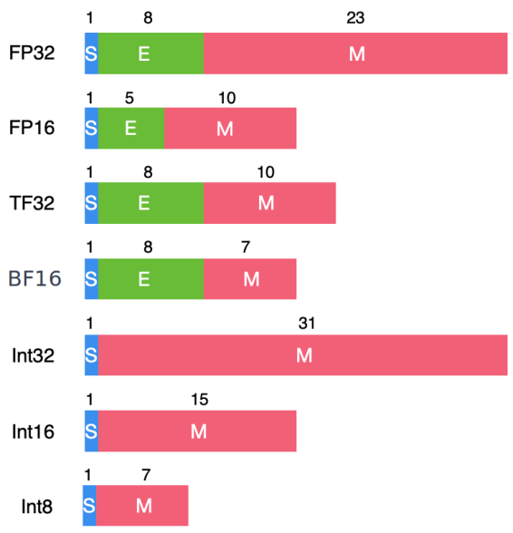

# 计算之比特位宽

在前面的深度学习计算模式里面我们提到了模型的量化操作，通过建立一种有效的数据映射关系，使得模型以较小的精度损失获得更好的模型执行效率的收益。模型量化的具体操作就是将高比特的数据转换为低比特位宽表示。本节我们将对计算的比特位宽概念做一个更具体的了解。

## 比特位宽的定义

计算机中数据是按照二进制的方式存储，由S, E, M三部分组成，S+E+M就是该数据的总比特位宽。S, E, M的具体含义为：

- 符号位S： 0表示整数，1表示负数
- 指数位E：用于存储科学计数法中的指数部分，决定了数据的范围
- 尾数位M：用于存储尾数（小数）部分，决定了数据的精度

下图是AI算法中常用的数据类型，不同的S, E, M的位宽值决定了数据表示的范围和达到的精度。比如对于FP16的数据位宽定义来说，一个16bit的二进制序列最终代表的实际值换算过程如下，其中5是FP16的E的宽度，10是M的宽度，E指代这5bit二进制对应十进制的值，M代表这10bit二进制数对应十进制的值，S同理表示1或者0。

$$
value = (-1 )^S * 2^{E-(2^{5-1}-1)}*(1+M/2^{10})
$$

## 为什么要降低比特位宽？

高比特的数据位宽，可以保证模型的精度，但是硬件的计算和存储成本也会更高，而对不同的场景，有不同的模型精度需求，所以需要对不同的场景，设计使用不同精度的数据类型，以降低硬件执行的成本。

降低比特位宽其实就是降低数据的精度，对于AI芯片来说，降低比特位宽可以带来如下好处：

1. 降低MAC的输入和输出数据位宽，能够有效减少数据的搬运和存储开销。更小的内存搬移带来更低的功耗开销

2. 减少 MAC 计算的开销和代价，比如，两个int8数据类型的相乘，累加和使用16bit位宽的寄存器即可，而FP16数据类型的相乘，累加和需要设计32位宽的寄存器。 8bit和16bit计算对硬件电路设计的复杂度影响也很大。

上面表格展示了降低位宽对芯片的功耗和面积影响程度。左图是对功耗的比较，随着比特位宽的增加，对应乘加操作的能耗在逐渐增加，从SRAM的数据搬移过程是功耗的主要来源；右图是对应芯片面积的比较，可以看到随着数据位宽的增加，需要的芯片面积也在成倍的增加。

针对AI芯片不同阶段的精度需求，市场上已经推出了8-bit的推理芯片产品和16-bit浮点数据的训练芯片产品。比如华为升腾910和NVIDIA的A100。

## AI芯片设计的思考

结合AI计算模式，通过上面低比特位宽数据的一些理解，可以引发如下方面对AI芯片设计的思考。

1. 当降低位宽的时候，主要对尾数M和动态范围指数E两个值进行调整，这两个值具有不同的影响方向。
   - 尾数M的调整： 对数据的精度产生影响。由于AI模型具有很强的容错性，降低M的比特值对模型精度的影响很小。比如NVIDIA中TensorCore采用的TF32数据类型，具有和FP32相同的动态数据范围E，保持了FP16的尾数精度，总数据位宽从32bit降低到19bit。
   - 指数E的调整： 指数的调整会影响数据的表达范围。在模型训练和推理过程中，不同阶段有不同的数据分布情况，可以根据实际数据的动态范围来动态调整指数 E 的位数，以减少存储空间和计算复杂度。
2. 不同比特位宽的选择时候，需要考虑对模型精度的影响，不同的数据集和不同的任务会有不一样的性能表现。比如NLP和CV的数据集，分类和检测的任务类型，需要进行全面的评测。
3. 训练和推理阶段可以采用不同的数据位宽类型。比如训练阶段采用FP16，BF16，TF32类型；推理阶段CV任务以int8为主，NLP以FP16为主，大模型以int8/FP16混合的方式
4. 权衡硬件的成本开销。额外的数据位宽引入了更多的电路，那么额外的位宽和低比特下损失的模型精度之间需要做一个取舍衡量。

AI计算模式和芯片设计的关系是一个庞大的系统工程，量化算法的落地，低比特的硬件指令设计等软件上的优化在硬件架构设计时候，需要综合考虑很多因素，尤其需要软件和硬件协同合作，从来不是一蹴而就的。

## 本节视频

<html>
<iframe src="https://player.bilibili.com/player.html?aid=483611067&bvid=BV1WT411k724&cid=1054068788&page=1&as_wide=1&high_quality=1&danmaku=0&t=30&autoplay=0" width="100%" height="500" scrolling="no" border="0" frameborder="no" framespacing="0" allowfullscreen="true"> </iframe>
</html>
