# CPU 基础

CPU是Central Processing Unit（中央处理器）的简称，它负责执行指令和计算，控制着计算机的所有组件。CPU从无到有，从弱小到强大，经历了漫长发展过程，其间发生了无数的故事。

在本节将着重介绍CPU基础内容，从CPU的发展历史入手，看看世界上第一块CPU是怎么诞生的，再到当代CPU的组成，为什么CPU能为我们的电脑处理那么多的事情？带着这些疑问我们开始今天的内容。

## CPU发展历史和组成

  回顾历史，世界上第一台真正意义上的计算机ENIAC：(Electronic Numerical Integrator And Calculator，电子数字积分计算机），于1946年在美国宾夕法尼亚大学投入运行，采用十进制进行数据存储。最初也专门用于火炮弹道计算，后经多次改进而成为能进行各种科学计算的通用计算机。这台完全采用电子线路执行算术运算、逻辑运算和信息存储的计算机，运算速度比继电器计算机快1000倍。ENIAC的发明，奠定了电子计算机的发展基础，开辟了信息时代的新纪元，是人类第三次产业革命开始的标志，具有重要的历史意义。

  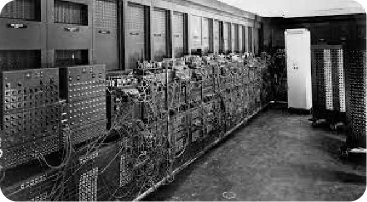
  
  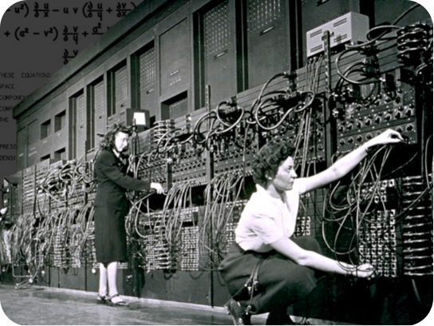

  与ENIAC不同且更为人知的是EDVAC：（Electronic Discrete Variable Automatic Computer，电子离散变量自动计算机）。1945年3月由冯·诺伊曼本人与莫奇利、埃克特等提出，1951年最终完成。EDVAC是二进制串行计算机，具有加减乘和软件除的功能。一条加法指令约864微秒，乘法指令2900微秒（或2.9毫秒）。 使用延迟线存储器，具有1000个44位（bit）的字。这是世界上首次提出的第一台采用二进制的冯·诺依曼计算机，由运算器、控制器、存储器、输入和输出设备5部分组成，也就是我们熟知的冯·诺依曼架构。这种体系结构一直延续至今，现在使用的计算机，其基本工作原理仍然是存储程序和程序控制，所以现在一般计算机被称为冯诺依曼结构计算机。鉴于冯诺依曼在发明电子计算机中所起到关键性作用，他被西方人誉为"计算机之父"。（他在数学和经济学领域的贡献也很卓著，被称为“博弈论之父”。）

  
  
  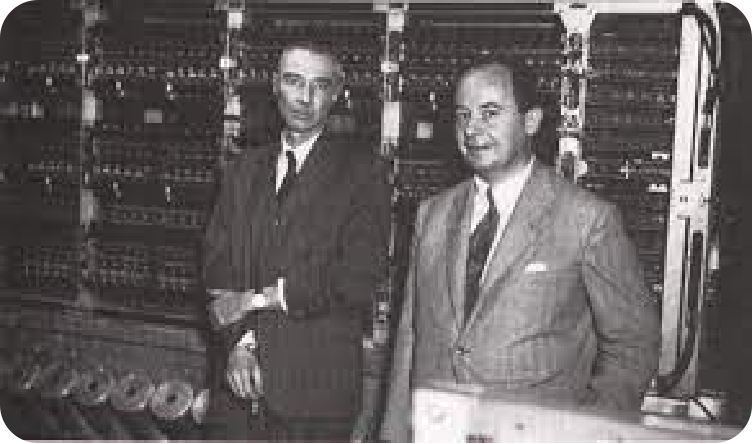

  有了冯·诺依曼架构所奠定的基础，CPU架构也就逐渐向着近现代发展。在1971年，世界上第一个CPU——4004，在Intel公司诞生了。虽然相比于现在的CPU，它无论是功能还是运行速度都弱小的十分可怜。但他出现却具有划时代的意义。随后Intel又接着推出了16位的微处理器i8088在接下来的十年中CPU迎来了它的发展黄金时期，几乎每年都会在技术上做出重大突破。尽管Intel公司做了相当大的付出，运营了一定的时间，但归根结底当年的它还是家小公司，但仅过了没多久，就在1982年，Intel公司生产出了一款具有跨时代意义的CPU80286，由此CPU进入了286时代。

  Intel公司在这段时间一直在为IBM公司供货，为了保证货源不断，IBM公司强迫Intel公司将微处理器的授权交给另一家公司，也就是我们所熟知的AMD。没过多久，AMD生产出市场定位和性能与Intel80287基本相同的CPU，至此两家两大芯片巨头维系至今的技术角逐也正式拉开序幕，直到今天也不能说谁的技术更好，只能说是各有千秋，但是多亏了这两家公司的竞争让CPU芯片技术蓬勃发展。

  时间到了1985年，英特尔公司成为了世界上一流的芯片制造公司，当年10月17日，英特尔制造出了80386xd，内含27.5万个晶体管，它的出现使32位CPU成为了pc工业的标准。到了1989年，英特尔公司制作出了80386sd，它的价格相对较低，在性能方面大大强于80286，所以被广泛的使用。同年Intel公司又造出了80486，它突破了100万晶体管的界限，拥有120万的晶体管其性能是80386DX的四倍。

 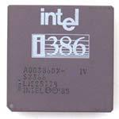
  
  1991年，AMD也宣布自己的新产品，AMD386，核心代号p9，跟Intel386一样有DX和SX之分，且两家公司的CPU在性能上没有太大的差别。同样，仅过了两年，AMD也研制出了AMD 486DX,随后AMD又衍生出一系列486的衍生产品，AMD 486DX–2,AMD 486DX–4等，值得一提的是，AMD 486DX4–120,在频率上第一次超过了自己的竞争对手Intel公司。

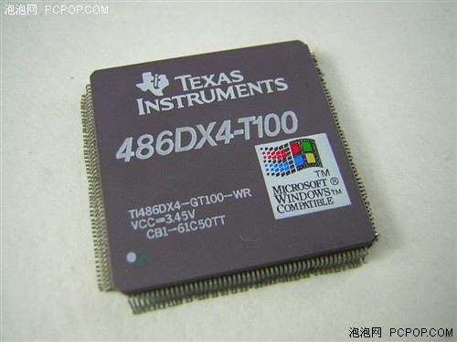

  1993年3月22日，Intel公司生产出了80586，它有另一个令人熟知的名字––奔腾(Pentium)。奔腾系列是x86系列的一大革新，但是它当时浮点除数法出现了错误，导致Intel大量回收他们的第一代产品，1995年3月27日，奔腾系列有增添了一位新成员，Pentium 120MHZ处理器在随后的两年时间内奔腾有增添了很多的成员包括Pentium 150mhz，Pentium 166mhz，Pentium200mhz等。1997年1月Pentium MMX的出现更是将Pentium系列的强度提升了一个档次，最后在1997年5月7日，Pentium ‖系列诞生了，这一时期衍生出了Pentium ‖233，Pentium ‖266，Pentium ‖300，这三款CPU均采用SLOT1架构。再插句嘴，这期间诞生的Pentium ‖Xeon处理器就是我们后来所熟知的至强系列。Intel公司为自己的成就沾沾自喜，以为AMD已经被甩到八条街以外了，但是AMD已经进入了一个全新的时代––AMD K6处理器。它的性能可堪比Intel家的Pentium MMX,随后又衍生出了AMD K6-2,AMD K6-3这让Intel感受到了很大的压力。

  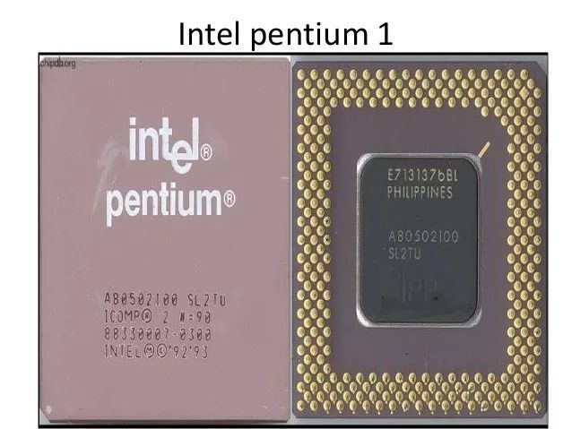

  2000年，跨世纪的一年，同样也是CPU界意义非凡的一年，Pentium4横空出世，这一次Intel公司一改之前很快改变自己的产品名称，将奔腾四代研发了四五年，期间有很多的产品，在这里就不一一介绍了，这是的CPU频率已经达到了GHz级，在2004年Intel已经造出了P4 3.4GHz处理器。与此同时，AMD也同样不甘示弱，他们已经进入了K8时代，这一时代最出名的产品就是速龙系列，在性能上一点也不输于AMD。两家公司的竞争越来越激烈，研发过程也明显加快了不少。

  时间到了2007年，Intel公司的主流CPU可分为四种，奔腾、至强、赛扬、酷睿。其中最为人知的就是酷睿系列，很多人都以为，酷睿的发展顺序应该是从小数到大数，但实际上并非如此，最先诞生的是i7系列，2008年，Intel推出了i7 920它取代了酷睿二代的地位，成为一个十分强大的存在。但是后来人们还是认为它的价格过高，2009年酷睿i5系列也随之诞生，为更多的人提供了便宜又高性能的CPU。随后，Intel又推出了i3系列，它是i5系列的精简版，性能也只是稍逊一点，现在一直发展到现在，在与AMD做斗争。AMD方面也不甘落后，AMD新推出的锐龙处理器相当强悍。有 Ryzen 3、Ryzen 5、Ryzen 7 三个系列，例如Ryzen 5 2600X其性能远超于i5-9400f，而Ryzen 7 2700X也一度挑战i9系列的存在。

  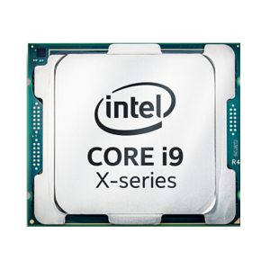

  从1947年被发明的第一个晶体管，到现在接近逆天的Ryzen7和corei9，怎么看都是一个不可思议的过程，其中的发展要非常感谢Intel和AMD两家公司的相爱相杀。根据摩尔定律，每十八个月晶体管的密度会翻一倍，未来CPU会怎么样我们仍然难以想象。

  展望完CPU的发展历史，还要回归到CPU的本质。CPU发展至今已经集成了大规模复杂的电路，可以把它看作是一个由很多小块组成的复杂机器，然而无论CPU的具体实现怎么变、晶体管数量翻多少番，这些小块从功能的角度大致可以划分成三大部分：算术逻辑单元、存储单元和控制单元.当然这里面其实只是一个简图，实际上中央处理单元，它的整个连线，整个IO，整个具体的控制流程是非常的复杂的，接下来简单介绍这些组成单元以及单元之间是怎么互相配合的。
  
  
  
1) 算术逻辑单元（ALU，Arithmetic Logic Unit）
   
CPU的主要功能就是运算，这正是通过算术逻辑单元ALU实现的。ALU电路内部由算术单元（AU）和逻辑单元（LU）组合而成，可对两个输入值（操作数）执行算术或逻辑运算并产生一个输出值。算术单元负责对二进制数执行加减乘除等数学运算，而逻辑单元执行与、或、非等逻辑运算，以及对两个操作数进行比较等。另外ALU还具备位移功能，将输入的操作数向左或向右移动从而得到新的操作数.不只是CPU，其他如图形处理器GPU等几乎所有的微处理器中，ALU都是最基本的组件。

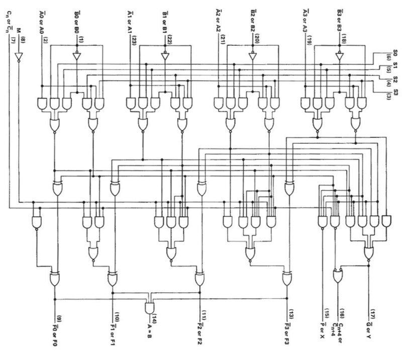

2) 存储单元（MU，Memory Unit）

存储单元（MU，Memory Unit）也可以称为寄存器，寄存器主要分为两种指令寄存器和数据寄存器，负责暂存指令、ALU所需操作数、ALU算出结果等。算术逻辑单元ALU在执行计算的时候，需要读取存储在寄存器中的操作数，计算结果则保存到累加器中（也是一种寄存器），ALU执行的命令则来自指令寄存器。比如，当将两个数字相加时，一个数字放在A寄存器中，另一个放在B寄存器中，ALU执行加法后将结果放入累加器中。如果是逻辑操作，则把要比较的数据放进输入寄存器中，比较的结果1或0放入累加器中。无论是逻辑运算还是算术运算，累加器内容都会被放入缓存中

上述的寄存器（Register）和缓存（Cache）即CPU内部的存储单元，用于存储供CPU访问的数据和指令，以及存储任何计算或任务的中间结果。处理的最终结果也会被保存到存储单元中，然后将这些结果发布到输出设备提供给用户。不过CPU内部存储单元的容量极为有限，大量数据只能保存在CPU之外的RAM（随机存取存储器）芯片中，就是我们平常所说的内存，也被称之为主存。存储器单元负责从主存中检索并临时存储数据，负责管理CPU和主存之间的数据流。

3) 控制单元（CU，Control Unit）

控制单元负责从主存中检索和选取指令，对其进行解码，然后发出适当的控制信号，指导计算机的其他组件（如算术逻辑单元、存储单元、输入/输出设备等）执行所需的操作。控制单元自身并不执行程序指令，它只是输出信号指示系统的其他部分如何做。如果说CPU是计算机的大脑，那么控制单元就是CPU的大脑。

 

现代cpu架构待补充

接下来我们来介绍一下这些主要单元是如何相互配合完成的也就是CPU的工作流，主要分为4步：1）从内存提取指令；2）解码；3）执行；4）写回。结合下图简单解释，第一步就是从内存里面去读取一些指令，给到我们的控制单元CU，而控制单元就会对我们的刚才读取的一些指令来进行解码，变成正式的一些 command 命令，然后 ALU 就会去执行这些command，这些命令执行完之后就会存储回来我们的内存进行汇总也就是写回。

接下来我们就从编程的视角去理解CPU的工作流。平时我们变成使用C++、Java、Python等编程语言编译好的程序文件（机器码），保存在硬盘等存储介质上，当操作系统运行这些程序的时候，首先会将它们加载到系统内存中。程序文件实际就是一系列的指令，CPU从内存中检索并读取程序指令，然后通过控制单元对程序指令进行译码操作，使其转化为CPU能够“读懂”的指令格式。接下来控制单元向算术逻辑单元ALU发送信号，ALU即依据指令读取操作数并进行相应计算，其计算结果经由CPU内的存储单元返回内存中。在以上过程中，CPU执行了四个重要步骤：　1）从内存提取指令；2）解码；3）执行；4）写回。这四个步骤是完整执行一条指令的过程，称之为指令周期（Instruction Cycle）。这一过程循环往复地进行，直到程序结束。说起来简单，实际过程却很复杂。单以取指令这一步骤来说，它本身就又由多个微操作组成：　

1. 程序计数器初始化指针指向内存地址；
2. 内存地址被装载到CPU的地址寄存器中；
3. CPU接下来检索该内存地址中的数据，并将其载入数据寄存器中；
4. 如果数据包中包含的是指令，将其装载到指令寄存器中；
5. 程序计数器递增加1，指向下一个内存地址；
6. 指令寄存器中的指令被传入CPU的控制单元中；
7. 以上步骤循环往复地进行。

接下来的译码、执行等阶段，也都有着各自复杂的操作，感兴趣的伙伴可以详细学习计算机组成原理（计算机必修课）。

回到CPU的的架构，我们需要了解的是CPU三大组成的各自分工，控制器和寄存器负责的工作最多、要存的数据最多的两部分。下图是CPU的一个简要架构图，从下往上是DRAM（Dynamic Random Access Memory，动态随机存取存储器）以及Cache这些其实都可以当作是我们的内存，然后有控制器，真正的执行单元就是我们的ALU，我们可以看到真正执行单元的 ALU 占的面积是非常的小的，图中假设有 4 个ALU或者计算盒，而在整体电路里面占了绝大部分面积的是内存还有控制器，而并非计算，所以说 CPU 是非常适合擅长处理我们的逻辑控制，而并非计算。真正想要芯片具有非常好的计算性能，那就需要GPU，NPU，而不是CPU。当然我们后面会给大家介绍的。那下面我们来看一下 CPU 的约束和限制

CPU 的约束和限制

实质上ALU模块(逻辑运算单元)是用来完成数据计算，其他各个模块的存在都是为了保证指令能够一条接一条的有序执行。这种通用性结构对于传统的编程计算模式非常适合，同时可以通过提升CPU主频(提升单位时间内执行指令的条数)来提升计算速度。 

但是，依照冯·诺依曼架构针对指令的“顺序执行”的原则，CPU 只能执行完一条指令再来下一条，计算能力进一步受限。当然了，我们会存在多核的情况，一次或可以执行多条指令，因为大原则受限于顺序执行，所以我们的计算能力的提升是受到限制的。于是我们引入了第二个内容，也就是本节的第二章，CPU并行处理架构。

## CPU并行处理架构

基于指令流的数量和数据流的数量，将计算机体系结构分为：
1. 单指令流单数流（SISD）系统。
2. 单指令流多数据流（SIMD）系统。
3. 多指令流单数据流（MISD）系统。
4. 多指令流多数据流（MIMD）系统

1） 单指令流单数流（SISD）系统。

顾名思义只有一个处理器和一个存储器，每个指令部件每次仅译码一条指令，而且在执行时仅为操作部件提供一份数据，串行计算，硬件不支持并行计算；在时钟周期内，CPU只能处理一个数据流，为了提高速度：
1. 采用流水线方式。
2. 设置多个功能部件，即为超标量处理机。
3. 多模块交叉方式组织存储器（内存的低位交叉编址）

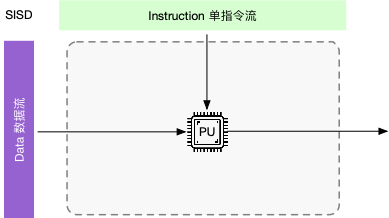

2） 单指令流多数据流（SIMD）系统。

单指令流多数据流（SIMD）系统采用一个控制器控制多个处理器，同时对一组数据中每一个分别执行相同操作，SIMD主要执行向量、矩阵等数组运算，处理单元数目固定，适用于科学计算。特点是处理单元数量很多， 但处理单元速度受计算机通讯带宽传递速率的限制。一个指令流同时对多个数据流进行处理，同时称为数据级并行技术。 各指令序列只能并发，不能并行。一个指令控制部件、多个处理单元。每个执行单元有各自的寄存器组、局部存储器、地址寄存器。

3） 多指令流单数据流（MISD）系统。 

多指令流单数据流机器，采用多个指令流来处理单个数据流，这种方式没什么必要，所以仅作为理论模型出现，没有投入到实际应用之中

4） 多指令流多数据流（MIMD）系统

多指令流多数据流（MIMD）系统是在多个数据集上执行多个指令的多处理器机器，共享内存 MIMD 和分布式内存。特性是各处理器之间，可以通过LOAD/STORE指令，访问同一个主存储器，可通过主存相互传送数据。硬件组成为：一台计算机内，包含多个处理器加一个主存储器。多个处理器共享单一的物理地址空间。

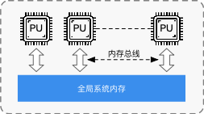

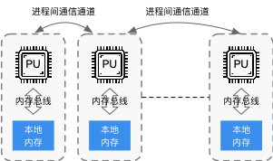

5） SIMT 系统（需补充）

单指令多线程，有效地管理和执行多个单线程，允许一条指令的多数据分开寻址。无需开发者把数据凑成合适的矢量长度，并且SIMT允许每个线程有不同的分支。条件跳转会根据输入数据不同在不同的线程中有不同表现。

## 引用
1. CPU的发展历史 https://zhuanlan.zhihu.com/p/64537796
2. Processor Architecture Design Practices: survey & Issues

## 本节视频

<html>
<iframe src="https://player.bilibili.com/player.html?aid=569330788&bvid=BV1tv4y1V72f&cid=1075822112&page=1&as_wide=1&high_quality=1&danmaku=0&t=30&autoplay=0" width="100%" height="500" scrolling="no" border="0" frameborder="no" framespacing="0" allowfullscreen="true"> </iframe>
</html>
