<!--Copyright 适用于[License](https://github.com/chenzomi12/AISystem)版权许可-->

# CPU 基础 

CPU 是 Central Processing Unit（中央处理器）的简称，它负责执行指令和计算，控制着计算机的所有组件。CPU 从无到有，从弱小到强大，经历了漫长发展过程，其间发生了无数的故事。

在本节将着重介绍 CPU 基础内容，从 CPU 的发展历史入手，看看世界上第一块 CPU 是怎么诞生的，再到当代 CPU 的组成，为什么 CPU 能为电脑处理那么多的事情？

## CPU 发展历史和组成

回顾历史，世界上第一台真正意义上的计算机 ENIAC：（Electronic Numerical Integrator And Calculator，电子数字积分计算机），于 1946 年在美国宾夕法尼亚大学投入运行，采用十进制进行数据存储。最初也专门用于火炮弹道计算，后经多次改进而成为能进行各种科学计算的通用计算机。这台完全采用电子线路执行算术运算、逻辑运算和信息存储的计算机，运算速度比继电器计算机快 1000 倍。

ENIAC 的发明，奠定了电子计算机的发展基础，开辟了信息时代的新纪元，是人类第三次产业革命开始的标志，具有重要的历史意义。

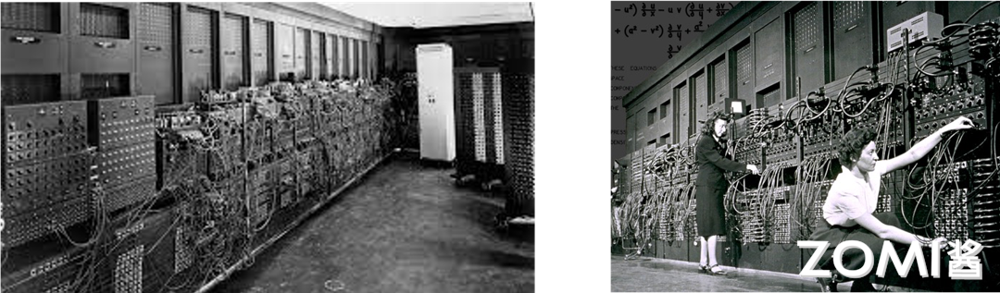

与 ENIAC 不同且更为人知的是 EDVAC：（Electronic Discrete Variable Automatic Computer，电子离散变量自动计算机）。

1945 年 3 月由冯·诺伊曼本人与莫奇利、埃克特等提出，1951 年最终完成。EDVAC 是二进制串行计算机，具有加减乘和软件除的功能。一条加法指令约 864 微秒，乘法指令 2900 微秒（或 2.9 毫秒）。使用延迟线存储器，具有 1000 个 44 位（bit）的字。这是世界上首次提出的第一台采用二进制的冯·诺依曼计算机，由运算器、控制器、存储器、输入和输出设备 5 部分组成，也就是我们熟知的冯·诺依曼架构。

这种体系结构一直延续至今，现在使用的计算机，其基本工作原理仍然是存储程序和程序控制，所以现在一般计算机被称为**冯诺依曼结构计算机**。鉴于冯诺依曼在发明电子计算机中所起到关键性作用，他被西方人誉为"计算机之父"。（他在数学和经济学领域的贡献也很卓著，被称为“博弈论之父”）

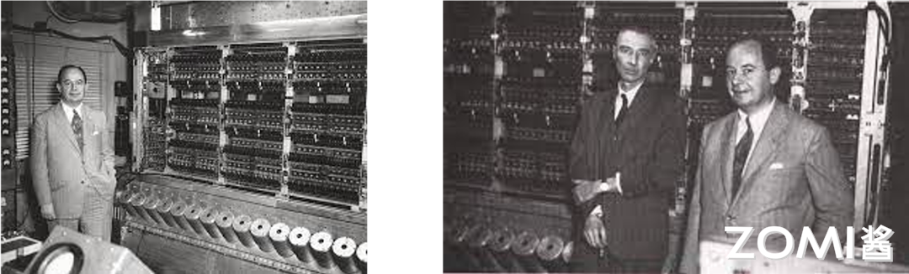

有了冯·诺依曼架构所奠定的基础，CPU 架构也就逐渐向着近现代发展，接下来我们按照几个重要时间点来回顾一下 CPU 的发展历史。在 1971 年，世界上第一个 CPU——4004，在 Intel 公司诞生了。虽然相比于现在的 CPU，它无论是功能还是运行速度都弱小的十分可怜。但他出现却具有划时代的意义。

随后 Intel 又接着推出了 16 位的微处理器 i8088 在接下来的十年中 CPU 迎来了它的发展黄金时期，几乎每年都会在技术上做出重大突破。尽管 Intel 公司做了相当大的付出，运营了一定的时间，但归根结底当年的它还是家小公司，但仅过了没多久，就在 1982 年，Intel 公司生产出了一款具有跨时代意义的 CPU80286，由此 CPU 进入了 286 时代。

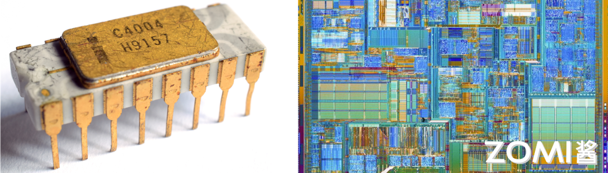

Intel 公司在这段时间一直在为 IBM 公司供货，为了保证货源不断，IBM 公司强迫 Intel 公司将微处理器的授权交给另一家公司，也就是我们所熟知的 AMD。没过多久，AMD 生产出市场定位和性能与 Intel80287 基本相同的 CPU，至此两家两大芯片巨头维系至今的技术角逐也正式拉开序幕，直到今天也不能说谁的技术更好，只能说是各有千秋，但是多亏了这两家公司的竞争让 CPU 芯片技术蓬勃发展。

时间到了 1985 年，英特尔公司成为了世界上一流的芯片制造公司，当年 10 月 17 日，英特尔制造出了 80386xd，内含 27.5 万个晶体管，它的出现使 32 位 CPU 成为了 PC 工业的标准。到了 1989 年，英特尔公司制作出了 80386sd，它的价格相对较低，在性能方面大大强于 80286，所以被广泛的使用。同年 Intel 公司又造出了 80486，它突破了 100 万晶体管的界限，拥有 120 万的晶体管其性能是 80386DX 的四倍。

1991 年，AMD 也宣布自己的新产品，AMD386，核心代号 p9，跟 Intel386 一样有 DX 和 SX 之分，且两家公司的 CPU 在性能上没有太大的差别。同样，仅过了两年，AMD 也研制出了 AMD 486DX，随后 AMD 又衍生出一系列 486 的衍生产品，AMD 486DX–2，AMD 486DX–4 等，值得一提的是，AMD 486DX4–120，在频率上第一次超过了自己的竞争对手 Intel 公司。

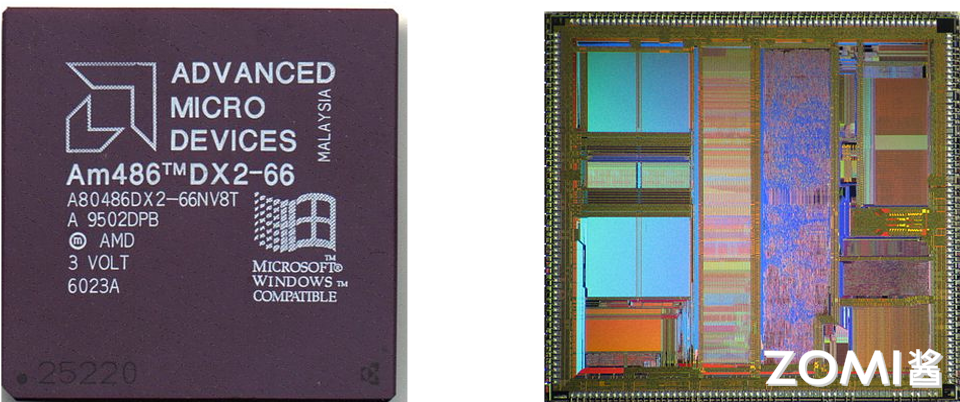

1993 年 3 月 22 日，Intel 公司生产出了 80586，它有另一个令人熟知的名字––奔腾（Pentium）。奔腾系列是 x86 系列的一大革新，但是它当时浮点除数法出现了错误，导致 Intel 大量回收了他们的第一代产品，1995 年 3 月 27 日，奔腾系列有增添了一位新成员，Pentium 120MHZ 处理器，并在随后的两年时间内奔腾有增添了很多的成员包括 Pentium 150mhz，Pentium 166mhz，Pentium200mhz 等。

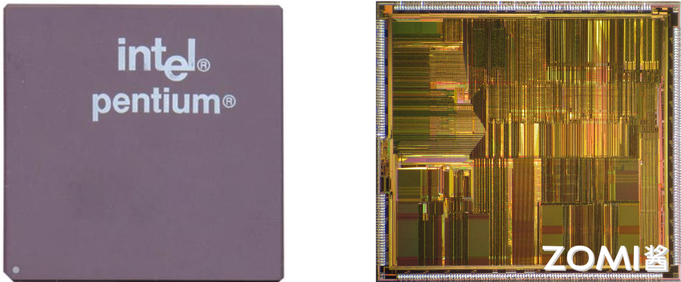

1997 年 1 月 Pentium MMX 的出现更是将 Pentium 系列的强度提升了一个档次，最后在 1997 年 5 月 7 日，Pentium ‖系列诞生了，这一时期衍生出了 Pentium ‖233，Pentium ‖266，Pentium ‖300，这三款 CPU 均采用 SLOT1 架构。再插句嘴，这期间诞生的 Pentium ‖Xeon 处理器就是我们后来所熟知的至强系列。Intel 公司为自己的成就沾沾自喜，以为 AMD 已经被甩到八条街以外了，但是 AMD 已经进入了一个全新的时代––AMD K6 处理器。它的性能可堪比 Intel 家的 Pentium MMX，随后又衍生出了 AMD K6-2，AMD K6-3 这让 Intel 感受到了很大的压力。

2000 年，跨世纪的一年，同样也是 CPU 界意义非凡的一年，Pentium4 横空出世，这一次 Intel 公司一改之前很快改变自己的产品名称，将奔腾四代研发了四五年，期间有很多的产品，在这里就不一一介绍了，这时的 CPU 频率已经达到了 GHz 级，在 2004 年 Intel 已经造出了 P4 3.4GHz 处理器。与此同时，AMD 也同样不甘示弱，他们已经进入了 K8 时代，这一时代最出名的产品就是速龙系列，在性能上一点也不输于 AMD。两家公司的竞争越来越激烈，研发过程也明显加快了不少。

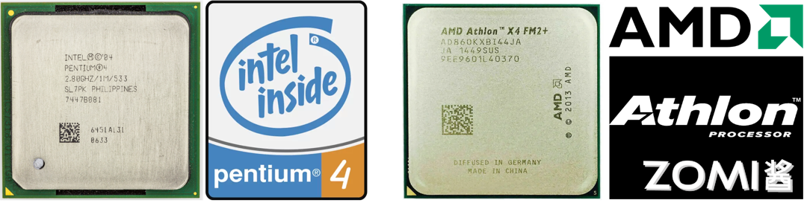

时间到了 2007 年，Intel 公司的主流 CPU 可分为四种，奔腾、至强、赛扬、酷睿。其中最为人知的就是酷睿系列，很多人都以为，酷睿的发展顺序应该是从小数到大数，但实际上并非如此，最先诞生的是 i7 系列，2008 年，Intel 推出了 i7 920 它取代了酷睿二代的地位，成为一个十分强大的存在。但是后来人们还是认为它的价格过高，2009 年酷睿 i5 系列也随之诞生，为更多的人提供了便宜又高性能的 CPU。随后，Intel 又推出了 i3 系列，它是 i5 系列的精简版，性能也只是稍逊一点，现在一直发展到现在，在与 AMD 做斗争。AMD 方面也不甘落后，AMD 新推出的锐龙处理器相当强悍。有 Ryzen 3、Ryzen 5、Ryzen 7 三个系列，例如 Ryzen 5 2600X 其性能远超于 i5-9400f，而 Ryzen 7 2700X 也一度挑战 i9 系列的存在。

从 1947 年被发明的第一个晶体管，到现在接近逆天的 Ryzen7 和 corei9，怎么看都是一个不可思议的过程，其中的发展要非常感谢 Intel 和 AMD 两家公司的相爱相杀。根据摩尔定律，每十八个月晶体管的密度会翻一倍，未来 CPU 会怎么样我们仍然难以想象。

## CPU 基本构成

展望完 CPU 的发展历史，还要回归到 CPU 的本质。CPU 发展至今已经集成了大规模复杂的电路，可以把它看作是一个由很多小块组成的复杂机器，然而无论 CPU 的具体实现怎么变、晶体管数量翻多少番，这些小块从功能的角度大致可以划分成三大部分：算术逻辑单元、存储单元和控制单元。

当然这里面其实只是一个简图，实际上中央处理单元，它的整个连线，整个 IO，整个具体的控制流程是非常的复杂的，接下来简单介绍这些组成单元以及单元之间是怎么互相配合的。

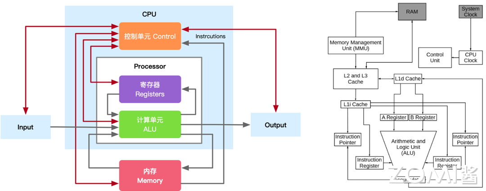

### 算术单元

CPU 的主要功能就是运算，这正是通过算术逻辑单元（ALU，Arithmetic Logic Unit）实现的。ALU 电路内部由算术单元（AU）和逻辑单元（LU）组合而成，可对两个输入值（操作数）执行算术或逻辑运算并产生一个输出值。

算术单元负责对二进制数执行加减等数学运算，而逻辑单元执行与、或、非等逻辑运算，以及对两个操作数进行比较等。另外 ALU 还具备位移功能，将输入的操作数向左或向右移动从而得到新的操作数.不只是 CPU，其他如图形处理器 GPU 等几乎所有的微处理器中，ALU 都是最基本的组件。

除了执行与加法和减法相关的计算外，ALU 还可以处理两个整数的乘法，因为它们旨在执行整数计算；因此，它的结果也是一个整数。但是，除法运算通常不能由 ALU 执行，因为除法运算可能会产生浮点数的结果。相反，浮点单元 （FPU，floating-point unit）通常处理除法运算；FPU 也可以执行其他非整数计算。

> 浮点数的由来：用科学计数法的方式表示小数时，小数点的位置就变得「漂浮不定」了，这就是相对于定点数，浮点数名字的由来。

虽然 ALU 是处理器中的主要组件，但 ALU 的设计和功能在不同的处理器中可能会有所不同。例如，有些 ALU 设计为仅执行整数计算，而有些则用于浮点运算。一些处理器包含单个算术逻辑单元来执行操作，而其他处理器可能包含许多 ALU 来完成计算。ALU 执行的操作是：

1. **逻辑运算**：逻辑运算包括 NOR、NOT、AND、NAND、OR、XOR 等。

2. **移位操作**：它负责将位的位置向右或向左位移一定数量的位置，也称为乘法运算。

3. **算术运算**：虽然它执行乘法和除法，但这是指位加法和位减法。但是乘法和除法运算的成本（逻辑复杂度和面积）更高。在乘法运算中，加法可以用作除法和减法的替代。

如图所示，ALU 包含各种输入和输出连接，这使得外部电子设备和 ALU 之间可以投射数字信号。ALU 输入从外部电路获取信号，作为响应，外部电子设备从 ALU 获取输出信号。

1. **数据**：ALU 包含三个并行总线，包括两个输入和输出操作数。这三个总线处理的信号数量是相同的。

2. **操作码**：当 ALU 将要执行操作时，操作选择码描述了 ALU 将执行哪种类型的运算或逻辑运算。

3. **输出**：ALU 操作的结果由状态输出以补充数据的形式提供，因为它们是多个信号。通常，诸如溢出、零、执行、负数等状态信号都包含在通用 ALU 中。当 ALU 完成每个操作时，外部寄存器包含状态输出信号。这些信号存储在外部寄存器中，使它们可用于未来的 ALU 操作。

4. **输入**：当 ALU 执行一次操作时，状态输入允许 ALU 访问更多信息以成功完成操作。此外，存储的来自先前 ALU 操作的进位被称为单个“进位”位。

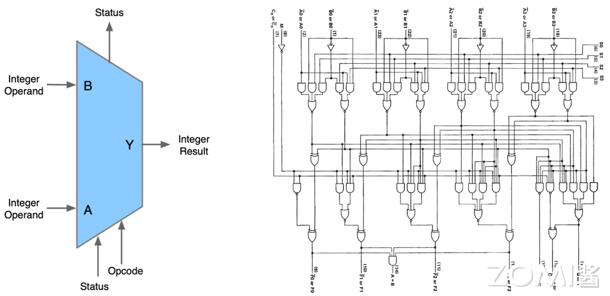

ALU 是一种组合逻辑电路，这意味着它的输出将随着输入变化而异步变化。在正常操作中，稳定信号被施加到所有 ALU 输入，当信号通过 ALU 电路传播足够的时间（称为“传播延迟”）时，ALU 操作的结果出现在 ALU 输出。连接到 ALU 的外部电路负责确保 ALU 输入信号在整个操作过程中的稳定性，并在对 ALU 结果进行采样之前留出足够的时间让信号通过 ALU 传播。

通常，外部电路通过向 ALU 的输入施加信号来控制 ALU。通常，外部电路采用时序逻辑来控制 ALU 操作，该操作由频率足够低的时钟信号来控制，以确保 ALU 输出有足够的时间在最坏情况下稳定下来。

### 存储单元

存储单元（MU，Memory Unit）也可以称为寄存器，为什么会出现寄存器？因为我们知道，程序在内存中装载，由 CPU 来运行，CPU 的主要职责就是用来处理数据。那么这个过程势必涉及到从存储器中读取和写入数据，因为它涉及通过控制总线发送数据请求并进入存储器存储单元，通过同一通道获取数据，这个过程非常的繁琐并且会涉及到大量的内存占用，而且有一些常用的内存页存在，其实是没有必要的，因此出现了寄存器，存储在 CPU 内部。

没有寄存器的话，CPU 将需要不断地从内存中读取和写入数据，这将严重降低计算机的性能。因为寄存器比内存更快，所以使用寄存器可以加速计算机的操作和计算。此外，寄存器还可以用于存储中间结果和操作数，从而简化了 CPU 内部的计算过程。

寄存器主要分为两种指令寄存器和数据寄存器，负责暂存指令、ALU 所需操作数、ALU 算出结果等。算术逻辑单元 ALU 在执行计算的时候，需要读取存储在寄存器中的操作数，计算结果则保存到累加器中（也是一种寄存器），ALU 执行的命令则来自指令寄存器。

比如，当将两个数字相加时，一个数字放在 A 寄存器中，另一个放在 B 寄存器中，ALU 执行加法后将结果放入累加器中。如果是逻辑操作，则把要比较的数据放进输入寄存器中，比较的结果 1 或 0 放入累加器中。无论是逻辑运算还是算术运算，累加器内容都会被放入缓存中。

寄存器的存储容量是根据其位数来决定的，不同的寄存器有不同的位数，可以存储的数据数量也不同。例如，一个 8 位的寄存器（INPR）可以存储 256 个不同的值。

另外，寄存器的存储容量也可以根据其用途和设计来决定。例如，在 CPU 中，指令寄存器通常只能存储一条指令，而数据寄存器则可以存储多个数据。有了寄存器，才能让 CPU 快速地存储、访问和操作指令和数据，从而提高了计算机的整体性能和效率。

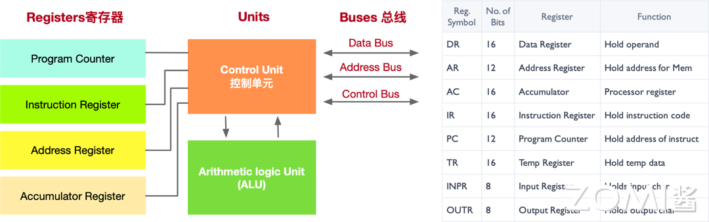

如上图所示寄存器的种类有很多，下面我们来看看几个常见寄存器的功能：

1. **数据寄存器（DR）**：数据寄存器（Data Register，DR）又称数据缓冲寄存器，数据寄存器用于存放操作数，其位数应满足多数数据类型的数值范围，其主要功能是作为 CPU 和主存、外设之间信息传输的中转站，用以弥补 CPU 和主存、外设之间操作速度上的差异。数据寄存器用来暂时存放由主存储器读出的一条指令或一个数据字；反之，当向主存存入一条指令或一个数据字时，也将它们暂时存放在数据寄存器中。数据寄存器的作用是：
   
   a. 作为 CPU 和主存、外围设备之间信息传送的中转站；
   
   b. 弥补 CPU 和主存、外围设备之间在操作速度上的差异；
   
   c. 在单累加器结构的运算器中，数据寄存器还可兼作操作数寄存器。

2. **地址寄存器（AR）**：地址寄存器（Address Register，AR）用来保存 CPU 当前所访问的主存单元的地址。其本身可以具有通用性，也可用于特殊的寻址方式，如用于基址寻址的段指针（存放基地址）、用于变址寻址的变址寄存器和用于堆栈寻址的栈指针。地址寄存器的位数必须足够长，以满足最大的地址范围。由于在主存和 CPU 之间存在操作速度上的差异，所以必须使用地址寄存器来暂时保存主存的地址信息，直到主存的存取操作完成为止。

3. **累加寄存器（AC）**：累加寄存器通常简称累加器（AC），是一个通用寄存器。累加器的功能是当运算器的算术逻辑单元 ALU 执行算术或逻辑运算时，为 ALU 提供一个工作区，可以为 ALU 暂时保存一个操作数或运算结果。显然，运算器中至少要有一个累加寄存器。

4. **程序计数器（PC）**：程序计数器（PC），具有寄存信息和计数两种功能，一般用来存放下一条指令在主存储器中的地址。在程序执行之前，首先必须将程序的首地址，即程序第一条指令所在主存单元的地址送入 PC，因此 PC 的内容即是从主存提取的第一条指令的地址。当执行指令时，CPU 能自动递增 PC 的内容，使其始终保存将要执行的下一条指令的主存地址，为取下一条指令做好准备。但是，当遇到转移指令时，下一条指令的地址将由转移指令的地址码字段来指定，而不是像通常的那样通过顺序递增 PC 的内容来取得。

5. **指令寄存器（IR）**：指令寄存器（Instruction Register，IR），用来保存当前欲执行的指令。当执行一条指令时，首先把该指令从主存读取到数据寄存器中，然后再传送至指令寄存器。指令包括操作码和地址码两个字段，为了执行指令，必须对操作码进行测试，识别出所要求的操作，指令译码器就是完成这项工作的。指令译码器对指令寄存器的操作码部分进行译码，以产生指令所要求操作的控制电位，并将其送到微操作控制线路上，在时序部件定时信号的作用下，产生具体的操作控制信号。指令寄存器中操作码字段的输出就是指令译码器的输入。操作码一经译码，即可向操作控制器发出具体操作的特定信号。

除此之外，寄存器的种类还有很多，感兴趣的读者可以自行查阅资料学习。

上述的寄存器（Register）即 CPU 内部的存储单元，用于存储供 CPU 访问的数据和指令，以及存储任何计算或任务的中间结果。处理的最终结果也会被保存到存储单元中，然后将这些结果发布到输出设备提供给用户。不过 CPU 内部存储单元的容量极为有限，大量数据只能保存在 CPU 之外的 RAM（随机存取存储器）芯片中，就是我们平常所说的内存，也被称之为主存。存储器单元负责从主存中检索并临时存储数据，负责管理 CPU 和主存之间的数据流。相信，提起内存，很多人对这个东西很熟悉。虽然他们都是可以存储数据，但是还是千差万别。下面我们简要概括寄存器和内存的区别：

1. 功能：寄存器是中央处理器内的组成部件，用于暂存指令和数据，可用来高速地存放操作数和中间结果，以及作为 CPU 内部和外部存储器之间或和输入/输出设备之间进行数据交换的缓冲区。内存主要功能是存放 CPU 的运算数据，以及与硬盘等外部存储器交换的数据。

2. 速度：寄存器位于 CPU 内部，执行速度快。内存的速度相对较慢。寄存器的速度非常快，通常可以在几个纳秒内完成数据的存取操作。相比之下，内存的速度相对较慢，但也是非常快速的存储器之一，可比硬盘快多了。

3. 容量：寄存器通常只有几字节到几十字节的容量。内存的存储容量通常远远大于寄存器，可以扩展到几个 GB 或者更大。

那寄存器既然这么重要，速度这么快，为什么不把它搞大一点呢？其原因在于好的东西其价格都很贵，从成本角度不如内存合适。

### 控制单元

控制单元（CU，Control Unit）的主要工作用一句话概括就是告知最有效的工作方法。控制单元从主存中检索和选取指令，对其进行解码，然后发出适当的控制信号，指导计算机的其他组件执行所需的操作。控制单元自身并不执行程序指令，它只是输出信号指示系统的其他部分如何做。

如果说 CPU 是计算机的大脑，那么控制单元就是 CPU 的大脑，也是 CPU 中最重要的部分。控制单元的任务可以分为解码指令、生成控制信号，并将这些信号发送给其他组件，例如 ALU、MU、存储器和输入/输出设备等。接下来的部分将详细介绍控制单元的任务，并举例说明。

1. **指令解码**：控制单元负责从存储器中读取指令，并对其进行解码。指令解码是将二进制指令转换为对计算机各个部件的控制信号的过程。通过解码，控制单元能够识别指令的类型、操作数和执行方式，并为后续的执行步骤做好准备。
   
   举例：假设有一条指令 "ADD R1, R2, R3"，表示将寄存器 R2 和 R3 中的值相加，并将结果存储到寄存器 R1 中。控制单元会解码这条指令，识别出这是一条加法指令，并生成相应的控制信号，指示运算单元从 R2 和 R3 中读取数据，并将结果写入 R1。

2. **控制信号生成**：控制单元根据解码的指令类型和操作数，生成相应的控制信号，以控制计算机中各个部件的操作。这些控制信号包括时钟信号、读/写信号、地址选择信号、操作数选择信号等。控制单元会根据指令的需求生成适当的控制信号，确保计算机的各个部件按照指令的要求进行操作。
   
   举例：对于一条存储指令 "LOAD R1, 2000"，表示将内存地址 2000 处的数据加载到寄存器 R1 中。控制单元会生成读取数据的控制信号，将地址 2000 发送给存储器，并将读取到的数据写入 R1。

3. **指令执行顺序**：控制控制单元还负责管理指令的执行顺序。它会按照指令序列的顺序，逐条调度指令的执行，并确保每条指令的操作在正确的时钟周期内完成。控制单元能够根据不同指令的需求，控制指令的跳转、分支和循环等控制流程。
   
   举例：在一段程序中，有一条条件分支指令 "IF R1 == R2 THEN GOTO 100"，表示如果寄存器 R1 的值等于 R2 的值，则跳转到标号为 100 的指令继续执行。控制单元会根据条件判断的结果，生成相应的控制信号，决定是否跳转到标号 100 处执行。

学习了控制单元 CU 的工作任务就是接收指令，指挥执行。我们接下来看看 CU 的工作过程如下图所示，CU 所接收的输入有三个：节拍发生器（Step Counter）、操作译码器（Instruction）、标志信号（Condition Signal）

1. **节拍发生器**：时钟会给节拍发生器发出一定频率的时钟脉冲，节拍发生器根据时钟脉冲的次数，向 CU 循环发送节拍信号。如果规定每个机器周期中包含十二个时钟周期，那么当节拍发生器收到第十三个时钟脉冲时，它会重新发出节拍信号“1”。而 CU 也会根据此节拍信号进入下一个机器周期——CU 会“点亮”取指 FE、间指 IND、执行 EX、周期 INT 四个指令周期寄存器中的一个（事实上这四个触发器集成在 CU 内部），表示当前整体处在哪个机器周期。

2. **操作译码器**：寄存器 IR 会将指令中的 n 位二进制操作码发送给操作译码器——n 位二进制对应着 $2^n$ 种状态，译码器需要与 CU 连接 $2^n$ 根线，每一种状态对应一根线，使得 CU 可以识别该操作码。

3. **标志信号**：标志是接收反馈的信号——经过 ALU 处理后的数字是正数还是负数、数字有没有溢出、鼠标有没有点击、哪个键盘敲击了等等，都是反馈信号。

CU 接收这三个外部参数后，就能够发出控制信号——微命令（Control Signals），来指挥 CPU 做出微操作。

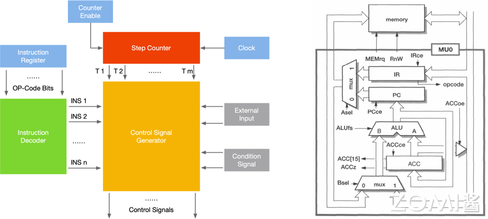

### CPU 组成总结

介绍完上述 CPU 的基本组件，我们由浅入深用一张现代 CPU 架构图作为本节内容的结尾。如下图所示的是一张英特尔酷睿 CPU 的架构图，从复杂的控制流程中，我们还是可以清晰的看到 ALU，MU 以及 CU 这些我们刚刚学习过的内容，当然读者朋友要是想设计这么一张架构图还是需要很多的知识储备的。

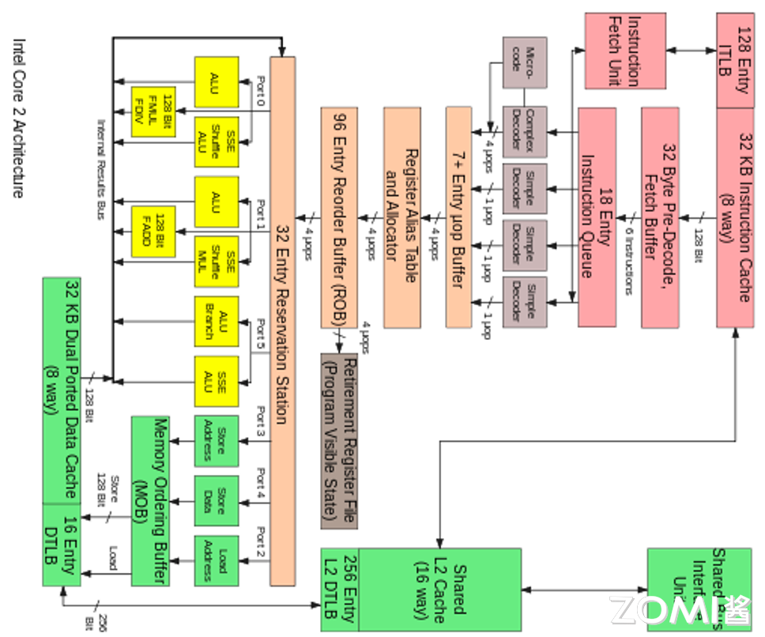

## CPU 工作流

接下来我们来介绍一下这些主要单元是如何相互配合完成的也就是 CPU 的工作流，主要分为 4 步：

1. **取指**：从内存提取指令的阶段，是将内存中的指令读取到 CPU 中寄存器的过程，程序寄存器用于存储下一条指令所在的地址

2. **解码**：解码指令译码阶段，在取指令完成后，立马进入指令译码阶段，在指令译码阶段，指令译码器按照预定的指令格式，对取回的指令进行拆分和解释，识别区分出不同的指令类别以及各种获取操作数的方法。

3. **执行**：执行指令阶段，译码完成后，就需要执行这一条指令了，此阶段的任务是完成指令所规定的各种操作，具体实现指令的功能。根据指令的需要，有可能需要从内存中提取数据，根据指令地址码，得到操作数在主存中的地址，并从主存中读取该操作数用于运算。

4. **写回**：结果写回阶段，作为最后一个阶段，结果写回（Write Back，WB）阶段把执行指令阶段的运行结果数据写回到 CPU 的内部寄存器中，以便被后续的指令快速地存取；

结合下图简单解释，第一步就是从内存里面去读取一些指令，给到控制单元 CU，而控制单元就会对刚才读取的一些指令来进行解码，变成正式的一些 command 命令，然后 ALU 就会去执行这些 command，这些命令执行完之后就会存储回来内存进行汇总也就是写回。

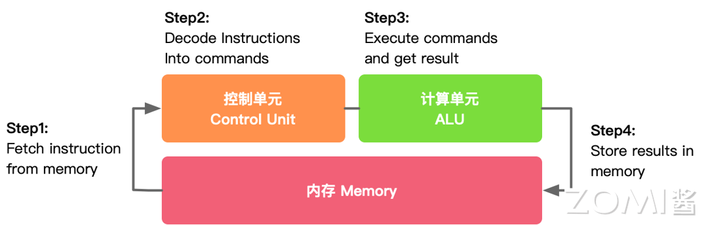

接下来我们就从编程的视角去理解 CPU 的工作流。平时我们变成使用 C++、Java、Python 等编程语言编译好的程序文件（机器码），保存在硬盘等存储介质上，当操作系统运行这些程序的时候，首先会将它们加载到系统内存中。

程序文件实际就是一系列的指令，CPU 从内存中检索并读取程序指令，然后通过控制单元对程序指令进行译码操作，使其转化为 CPU 能够“读懂”的指令格式。

接下来控制单元向算术逻辑单元 ALU 发送信号，ALU 即依据指令读取操作数并进行相应计算，其计算结果经由 CPU 内的存储单元返回内存中。

在以上过程中，CPU 执行了四个重要步骤：1）从内存提取指令；2）解码；3）执行；4）写回。这四个步骤是完整执行一条指令的过程，称之为指令周期（Instruction Cycle）。

这一过程循环往复地进行，直到程序结束。说起来简单，实际过程却很复杂。单以取指令这一步骤来说，它本身就又由多个微操作组成：　

1. 程序计数器初始化指针指向内存地址；
2. 内存地址被装载到 CPU 的地址寄存器中；
3. CPU 接下来检索该内存地址中的数据，并将其载入数据寄存器中；
4. 如果数据包中包含的是指令，将其装载到指令寄存器中；
5. 程序计数器递增加 1，指向下一个内存地址；
6. 指令寄存器中的指令被传入 CPU 的控制单元中；
7. 以上步骤循环往复地进行。

接下来的译码、执行等阶段，也都有着各自复杂的操作，感兴趣的伙伴可以详细学习计算机组成原理（计算机必修课）。

回到 CPU 的的架构，我们需要了解的是 CPU 三大组成的各自分工，控制器和寄存器负责的工作最多、要存的数据最多的两部分。

下图是 CPU 的一个简要架构图，从下往上是 DRAM（Dynamic Random Access Memory，动态随机存取存储器）以及 Cache 这些其实都可以当作是内存，然后有控制器，真正的执行单元就是 ALU，我们可以看到真正执行单元的 ALU 占的面积是非常的小的，图中假设有 4 个 ALU 或者计算盒，而在整体电路里面占了绝大部分面积的是内存还有控制器，而并非计算，所以说 CPU 是非常适合擅长处理逻辑控制，而并非计算。

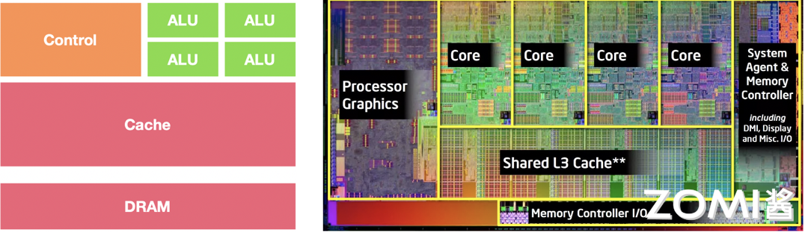

## CPU 约束与限制

真正想要芯片具有非常好的计算性能，那就需要 GPU、NPU 而不是 CPU。当然我们后面会给大家介绍的。那下面我们来看一下 CPU 的约束和限制。

实质上 ALU 模块（逻辑运算单元）是用来完成数据计算，其他各个模块的存在都是为了保证指令能够一条接一条的有序执行。这种通用性结构对于传统的编程计算模式非常适合，同时可以通过提升 CPU 主频(提升单位时间内执行指令的条数）来提升计算速度。 

但是，依照冯·诺依曼架构针对指令的“顺序执行”的原则，CPU 只能执行完一条指令再来下一条，计算能力进一步受限。当然了，我们会存在多核的情况，一次或可以执行多条指令，因为大原则受限于顺序执行，所以计算能力的提升是受到限制的。于是我们引入了第二个内容，也就是本节的第二章，CPU 并行处理架构。

## 小结与思考

- CPU 发展历史：从世界上第一台通用计算机 ENIAC 的诞生，到冯·诺依曼架构的提出，再到 Intel 和 AMD 等公司推动的 CPU 技术发展，CPU 经历了从无到有，从弱到强的演变过程。

- CPU 基本构成：CPU 主要由算术逻辑单元（ALU）、存储单元（MU）和控制单元（CU）三大部分构成，分别负责执行算术和逻辑运算、存储指令和数据、以及控制指令的执行流程。

- CPU 工作流程：CPU 的工作流程包括取指令、解码、执行和写回四个步骤，这四个步骤循环往复，完成程序的运行，直到程序结束。

## 本节视频

<html>
<iframe src="https://player.bilibili.com/player.html?aid=569330788&bvid=BV1tv4y1V72f&cid=1075822112&page=1&as_wide=1&high_quality=1&danmaku=0&t=30&autoplay=0" width="100%" height="500" scrolling="no" border="0" frameborder="no" framespacing="0" allowfullscreen="true"> </iframe>
</html>

## 引用

1. https://zhuanlan.zhihu.com/p/64537796
2. Processor Architecture Design Practices: survey & Issues
3. https://blog.csdn.net/bdfpxsfh/article/details/129473944
4. https://zhuanlan.zhihu.com/p/633027432
