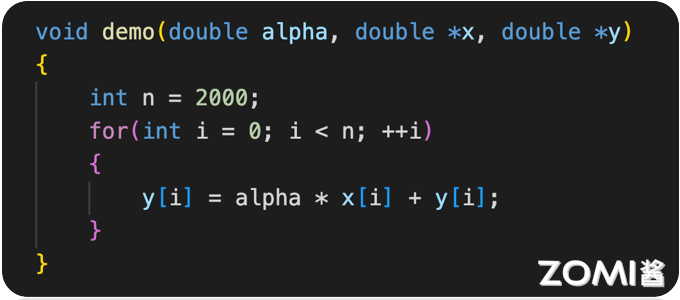
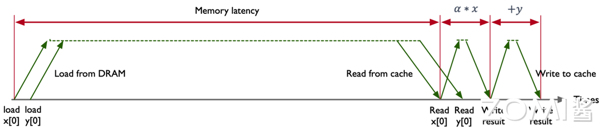
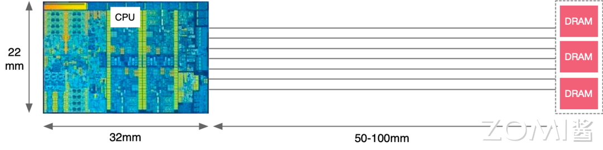

<!--Copyright 适用于[License](https://github.com/chenzomi12/AISystem)版权许可-->

# CPU 计算时延

CPU（中央处理器）是计算机的核心组件，其性能对计算机系统的整体性能有着重要影响。CPU 计算时延是指从指令发出到完成整个指令操作所需的时间。理解 CPU 的计算时延对于优化计算性能和设计高效的计算系统至关重要。

======== 主要强调，内存、带宽、时延之间的关系，一定要搞清楚三者之间的关系，深入深入深入理解。

##  CPU 计算时延

===== XXXXX，组织一下语言，下面的内容尽可能展开一下，不要都用大纲或者目录的方式。

### CPU 计算时延组成

CPU 计算时延主要由以下几个部分组成：

- **指令提取时延（Instruction Fetch Time）**：指令提取时延是指从内存中读取指令到将其放入指令寄存器的时间。这个时延受内存速度和缓存命中率的影响。

- **指令解码时延（Instruction Decode Time）**：指令解码时延是指将从内存中读取的指令翻译成 CPU 能够理解的操作的时间。复杂指令集架构（CISC）通常比精简指令集架构（RISC）具有更长的解码时延。

- **执行时延（Execution Time）**：执行时延是指 CPU 实际执行指令所需的时间。这个时延取决于指令的类型和 CPU 的架构，例如流水线深度、并行度等。

- **存储器访问时延（Memory Access Time）**： 存储器访问时延是指 CPU 访问主存储器或缓存所需的时间。这个时延受缓存层次结构（L1, L2, L3 缓存）和存储器带宽的影响。

- **写回时延（Write-back Time）**：写回时延是指执行完指令后将结果写回寄存器或存储器的时间。这一过程也受缓存的影响。

### 影响计算时延因素

- **CPU 时钟频率（Clock Frequency）**：CPU 时钟频率越高，指令执行速度越快，计算时延越短。然而，过高的时钟频率会带来功耗和散热问题。

- **流水线技术（Pipelining）**：流水线技术将指令执行分为多个阶段，每个阶段可以并行处理不同的指令，从而提高指令吞吐量，降低时延。但流水线的深度和效率对时延有直接影响。

- **并行处理（Parallel Processing）**：多核处理器和超线程技术允许多个指令同时执行，显著降低计算时延。并行处理的效率依赖于任务的可并行性。

- **缓存命中率（Cache Hit Rate）**： 高缓存命中率可以显著减少存储器访问时延，提高整体性能。缓存失效（Cache Miss）会导致较高的存储器访问时延。

- **内存带宽（Memory Bandwidth）**：高内存带宽可以减少数据传输瓶颈，降低存储器访问时延，提升计算性能。

### 优化计算时延方法

- **提高时钟频率**：在不超出散热和功耗限制的情况下，提高 CPU 的时钟频率可以直接减少计算时延。

- **优化流水线深度**：适当增加流水线深度，提高指令并行处理能力，但需要平衡流水线的复杂性和效率。

- **增加缓存容量**：增加 L1、L2、L3 缓存的容量和优化缓存管理策略，可以提高缓存命中率，减少存储器访问时延。

- **使用高效的并行算法**：开发和采用适合并行处理的算法，提高多核处理器的利用率，降低计算时延。

- **提升内存子系统性能**：采用高速内存技术和更高带宽的内存接口，减少数据传输时延，提高整体系统性能。

## CPU 计算

- 图中展示了一个简单的 C 代码示例，用于计算 `y[i] = alpha * x[i] + y[i]`：

======= 代码用代码来展示，不要用图片。

### 例子解析

1. CPU 指令执行过程

====== 详细点展开。图片要用文字描述介绍

- 横轴（Times）：表示时间的推进。
- 纵轴：展示了不同操作（如加载、计算、写入）的时延。

2. 数据加载

- **Load from DRAM**

- `load x[0]` 和 `load y[0]`：从主存储器（DRAM）加载数据到缓存（cache）。这个过程涉及较高的内存时延（Memory latency）。

3. 缓存读取

- **Read from cache**：从缓存中读取已经加载的数据。相比从主存储器加载数据，缓存读取的时延较短。

4. 计算过程

- **Read x[0]** 和 **Read y[0]**：从缓存中读取需要进行计算的变量 `x[0]` 和 `y[0]`。

- **α * x**：进行乘法运算，计算 `α * x`。

- **+ y**：进行加法运算，将上一步的结果与 `y` 相加。

5. 写回结果

- **Write result**：将计算结果写回到缓存。这个步骤也包括较短的时延。

- **Write to cache**：最后一步，将计算结果从缓存写回到主存储器（如有需要）。

### 时延分析

- **Memory latency**：图中用红色标注的长箭头表示内存时延，即从开始加载数据到数据被缓存所需的总时间。这是影响计算速度的重要因素。

- **计算时延**：乘法和加法操作各自有独立的时延，分别用红色小箭头标注。
  
- **缓存操作时延**：读取和写入缓存的时延相对较短，用绿色箭头表示。

### 计算速度决定性因素

===== 三级目录展开
图中展示的加载数据操作占用了很长的时间（Memory latency），CPU 在等待数据加载完成之前无法进行后续的计算操作。虽然计算本身（乘法和加法）以及缓存读取和写入的时间较短，但由于内存时延过长，整体计算过程被时延严重拖慢。

### CPU 时延的产生

====== 展开内容

电信号在导体中的传播速度约为 60,000,000 米/秒。

假设计算机时钟频率为 3,000,000,000 赫兹（3 GHz），根据上图可知，从芯片到 DRAM 的信号传输距离大约为 50-100 毫米。

计算机时钟频率为 3 GHz，意味着每个时钟周期大约为 1 / 3,000,000,000 秒 ≈ 0.333 纳秒。

- **电信号在 50 毫米的距离上传播的延迟**：

  - 电信号在 50 毫米的距离上传播的延迟约为 0.833 纳秒，这相当于 0.833 纳秒 / 0.333 纳秒 ≈ 2.5 个时钟周期。

- **电信号在 100 毫米的距离上传播的延迟**：

  - 电信号在 100 毫米的距离上传播的延迟约为 1.667 纳秒，这相当于 1.667 纳秒 / 0.333 纳秒 ≈ 5 个时钟周期。

这些传播延迟就是 CPU 的时钟周期，也是 CPU 计算的时延。

## 时钟周期

======== 为什么这么这么突兀有个时钟周期？
CPU 的时钟周期（Clock Cycle）是指 CPU 时钟信号的一个完整周期，它定义了 CPU 内部所有操作的基本时间单位。每个时钟周期内，CPU 完成一定量的工作，如取指令、解码指令、执行指令等。时钟周期是 CPU 性能的关键因素之一。

### 时钟周期的单位

时钟周期的单位通常是秒或其分量，如纳秒（ns）。时钟周期的长度由 CPU 的时钟频率决定：

- **时钟频率（Clock Frequency）**：CPU 时钟频率指的是 CPU 每秒钟执行的时钟周期数，单位是赫兹（Hz）。常见的时钟频率为几百 MHz 到几 GHz。

- **时钟周期（Clock Cycle Time）**：时钟周期与时钟频率互为倒数。时钟频率为 3 GHz 的 CPU，其时钟周期为 1 / 3,000,000,000 秒 ≈ 0.333 纳秒。

## 小结与思考

=======1. XXX；2. XXX；

## 本节视频

<html>
<iframe src="https://player.bilibili.com/player.html?aid=739389172&bvid=BV1Qk4y1i7GT&cid=1080828502&page=1&as_wide=1&high_quality=1&danmaku=0&t=30&autoplay=0" width="100%" height="500" scrolling="no" border="0" frameborder="no" framespacing="0" allowfullscreen="true"> </iframe>
</html>
