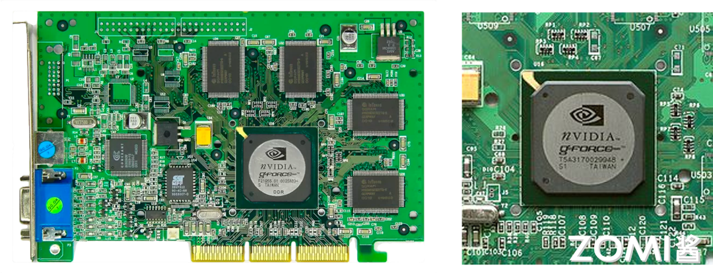
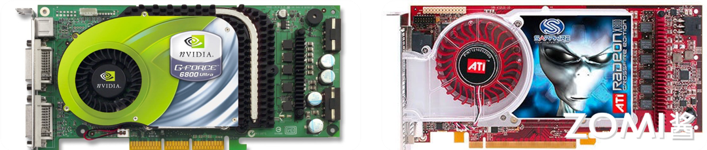
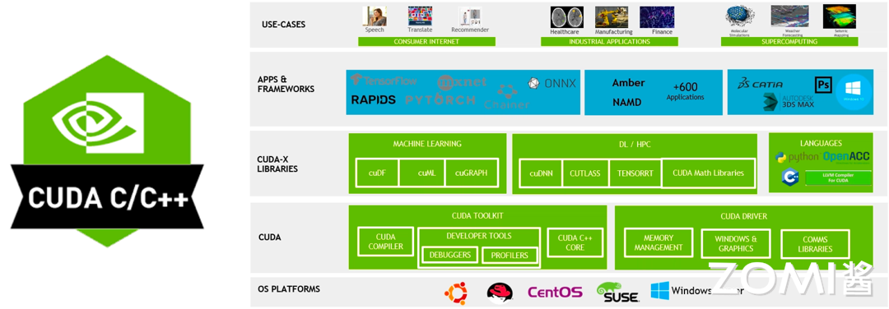
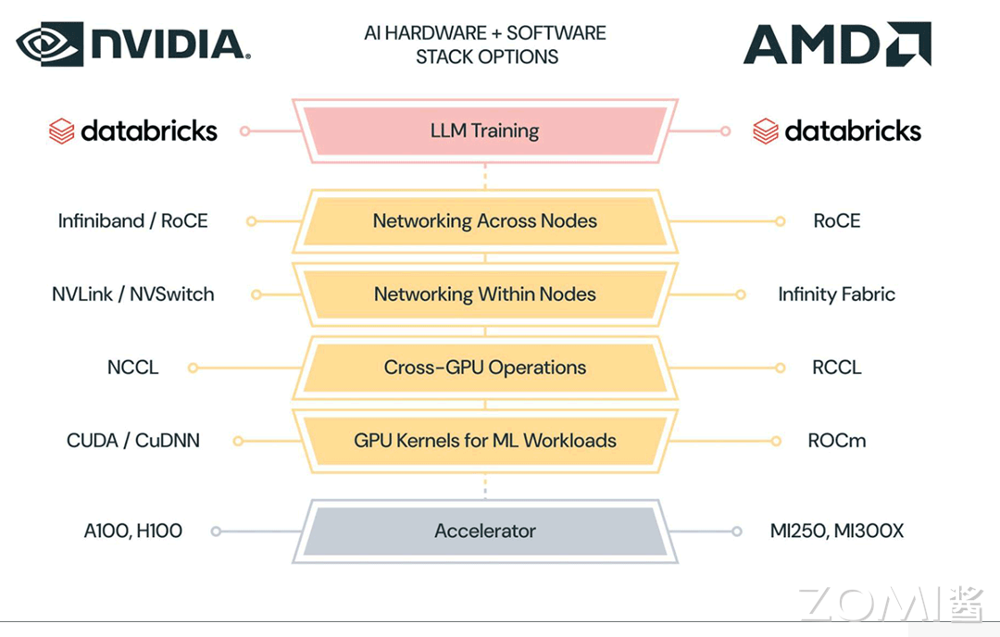
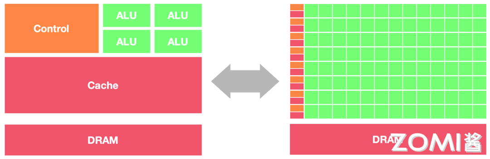
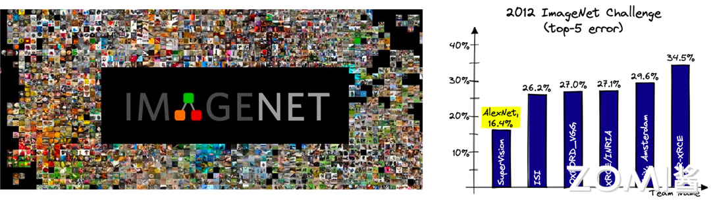
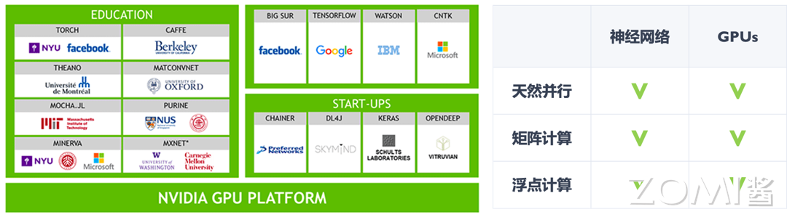

<!--Copyright 适用于[License](https://github.com/chenzomi12/AISystem)版权许可-->

# GPU 基础 

GPU 是 Graphics Processing Unit（图形处理器）的简称，它是计算机系统中负责处理图形和图像相关任务的核心组件。GPU 的发展历史可以追溯到对计算机图形处理需求的不断增长，以及对图像渲染速度和质量的不断追求。从最初的简单图形处理功能到如今的高性能计算和深度学习加速器，GPU 经历了一系列重要的技术突破和发展转折。

在接下来的内容中，我们还将探讨 GPU 与 CPU 的区别，了解它们在设计、架构和用途上存在显著差异。此外，我们还将简短介绍一下 AI 发展和 GPU 的联系，并探讨 GPU 在各种领域的应用场景。

除了图形处理和人工智能，GPU 在科学计算、数据分析、加密货币挖矿等领域也有着广泛的应用。深入了解这些应用场景有助于我们更好地发挥 GPU 的潜力，解决各种复杂计算问题。现在让我们深入了解 GPU 的发展历史、与 CPU 的区别、AI 所需的重要性以及其广泛的应用领域。

## GPU 发展历史

在 GPU 发展史上，第一代 GPU 可追溯至 1999 年之前。这一时期的 GPU 在图形处理领域进行了一定的创新，部分功能开始从 CPU 中分离出来，实现了针对图形处理的硬件加速。其中，最具代表性的是几何处理引擎，即 GEOMETRY ENGINE。该引擎主要用于加速 3D 图像处理，但相较于后来的 GPU，它并不具备软件编程特性。这意味着它的功能相对受限，只能执行预定义的图形处理任务，而无法像现代 GPU 那样灵活地适应不同的软件需求。

然而，尽管功能有限，第一代 GPU 的出现为图形处理领域的硬件加速打下了重要的基础，奠定了后续 GPU 技术发展的基石。

第二代 GPU 的发展跨越了 1999 年到 2005 年这段时期，其间取得了显著的进展。1999 年，英伟达发布了 GeForce256 图像处理芯片，这款芯片专为执行复杂的数学和几何计算而设计。与此前的 GPU 相比，GeForce256 将更多的晶体管用于执行单元，而不是像 CPU 那样用于复杂的控制单元和缓存。它成功地将诸如变换与光照（TRANSFORM AND LIGHTING）等功能从 CPU 中分离出来，实现了图形快速变换，标志着 GPU 的真正出现。

随着时间的推移，GPU 技术迅速发展。从 2000 年到 2005 年，GPU 的运算速度迅速超越了 CPU。在 2001 年，英伟达和 ATI 分别推出了 GeForce3 和 Radeon 8500，这些产品进一步推动了图形硬件的发展。图形硬件的流水线被定义为流处理器，顶点级可编程性开始出现，同时像素级也具有了有限的编程性。

尽管如此，第二代 GPU 的整体编程性仍然相对有限，与现代 GPU 相比仍有一定差距。然而，这一时期的 GPU 发展为后续的技术进步奠定了基础，为图形处理和计算领域的发展打下了坚实的基础。

从长远看，英伟达的 GPU 在一开始就选择了正确的方向 MIMD，通过 G80 Series，Fermi，Kepler 和 Maxwell 四代（下一章节会有解析）大跨步进化，形成了完善和复杂的储存层次结构和指令派发/执行管线。ATI/AMD 在一开始选择了 VLIW5/4，即 SIMD，通过 GCN 向 MIMD 靠拢，但是进化不够完全（GCN 一开始就落后于 Kepler），所以图形性能和 GPGPU 效率低于对手。

英伟达和 ATI 之争本质上是 shader 管线与其他纹理，ROP 单元配置比例之争，A 认为计算用 shader 越多越好，计算性能强大，N 认为纹理单元由于结构更简单电晶体更少，单位面积配置起来更划算，至于游戏则是越后期需要计算的比例越重。

第三代 GPU 的发展从 2006 年开始，带来了方便的编程环境创建，使得用户可以直接编写程序来利用 GPU 的并行计算能力。在 2006 年，英伟达和 ATI 分别推出了 CUDA（Compute Unified Device Architecture）和 CTM（CLOSE TO THE METAL）编程环境。

这一举措打破了 GPU 仅限于图形语言的局限，将 GPU 变成了真正的并行数据处理超级加速器。CUDA 和 CTM 的推出使得开发者可以更灵活地利用 GPU 的计算能力，为科学计算、数据分析等领域提供了更多可能性。

2008 年，苹果公司推出了一个通用的并行计算编程平台 OpenCL（Open Computing Language）。与 CUDA 不同，OpenCL 并不与特定的硬件绑定，而是与具体的计算设备无关，这使得它迅速成为移动端 GPU 的编程环境业界标准。OpenCL 的出现进一步推动了 GPU 在各种应用领域的普及和应用，为广大开发者提供了更广阔的创新空间。

第三代 GPU 的到来不仅提升了 GPU 的计算性能，更重要的是为其提供了更便捷、灵活的编程环境，使得 GPU 在科学计算、深度学习等领域的应用得以广泛推广，成为现代计算领域不可或缺的重要组成部分。

下图分别展示了英伟达和 AMD 的工具链架构，我们可以看到两者的层次架构都是十分相像的，最核心的区别实则在于中间的 libraries 部分，两家供应商均根据自己的硬件为基础 library 做了优化；此外在编译层面两方也会针对自身架构，在比如调度，算子融合等方面实现各自的编译逻辑；而在对外接口上双方都在争取提供给当今热门的框架和应用以足够的支持。

以及从下方二者的细粒度对比图中，我们更能看出两方工具链架构间的一一映射和具体细节实现上的区别：

## GPU vs CPU

现在探讨一下 CPU 和 GPU 在架构方面的主要区别，CPU 即中央处理单元（Central Processing Unit），负责处理操作系统和应用程序运行所需的各类计算任务，需要很强的通用性来处理各种不同的数据类型，同时逻辑判断又会引入大量的分支跳转和中断的处理，使得 CPU 的内部结构异常复杂。

GPU 即图形处理单元（Graphics Processing Unit），可以更高效地处理并行运行时复杂的数学运算，最初用于处理游戏和动画中的图形渲染任务，现在的用途已远超于此。两者具有相似的内部组件，包括核心、内存和控制单元。

GPU 和 CPU 在架构方面的主要区别包括以下几点：

1. **并行处理能力**：CPU 拥有少量的强大计算单元（ALU），更适合处理顺序执行的任务，可以在很少的时钟周期内完成算术运算，时钟周期的频率很高，复杂的控制逻辑单元（Control）可以在程序有多个分支的情况下提供分支预测能力，因此 CPU 擅长逻辑控制和串行计算，流水线技术通过多个部件并行工作来缩短程序执行时间。GPU 控制单元可以把多个访问合并成，采用了数量众多的计算单元（ALU）和线程（Thread），大量的 ALU 可以实现非常大的计算吞吐量，超配的线程可以很好地平衡内存延时问题，因此可以同时处理多个任务，专注于大规模高度并行的计算任务。

2. **内存架构**：CPU 被缓存 Cache 占据了大量空间，大量缓存可以保存之后可能需要访问的数据，可以降低延时； GPU 缓存很少且为线程（Thread）服务，如果很多线程需要访问一个相同的数据，缓存会合并这些访问之后再去访问 DRAM，获取数据之后由 Cache 分发到数据对应的线程。GPU 更多的寄存器可以支持大量 Thread。

3. **指令集**：CPU 的指令集更加通用，适合执行各种类型的任务； GPU 的指令集主要用于图形处理和通用计算，如 CUDA 和 OpenCL。

4. **功耗和散热**：CPU 的功耗相对较低，散热要求也相对较低；由于 GPU 的高度并行特性，其功耗通常较高，需要更好的散热系统来保持稳定运行。

因此，CPU 更适合处理顺序执行的任务，如操作系统、数据分析等；而 GPU 适合处理需要计算密集型 (Compute-intensive) 程序和大规模并行计算的任务，如图形处理、深度学习等。在异构系统中，GPU 和 CPU 经常会结合使用，以发挥各自的优势。

## AI 发展与 GPU

GPU 与人工智能（AI）的发展密不可分。2012 年的一系列重要事件标志着 GPU 在 AI 计算中的崭露头角。Hinton 和 Alex Krizhevsky 设计的 AlexNet 是一个重要的突破，他们利用两块英伟达 GTX 580 GPU 训练了两周，将计算机图像识别的正确率提升了一个数量级，并赢得了 2012 年 ImageNet 竞赛冠军。这一成就充分展示了 GPU 在加速神经网络模型训练中的巨大潜力。

同时，谷歌和吴恩达等团队的工作也进一步强调了 GPU 在 AI 计算中的重要性。谷歌利用 1000 台 CPU 服务器完成了猫狗识别任务，而吴恩达等则只用了 3 台 GTX680-GPU 服务器，取得了同样的成果。这一对比显示了 GPU 在深度学习任务中的显著加速效果，进一步激发了对 GPU 在 AI 领域的广泛应用。

从 2005/2006 年开始，一些研究人员开始尝试使用 GPU 进行 AI 计算，但直到 2012/2013 年，GPU 才被更广泛地接受。随着神经网络层次越来越深、网络规模越来越大，GPU 的加速效果越来越显著。这得益于 GPU 相比 CPU 拥有更多的独立大吞吐量计算通道，以及较少的控制单元，使其在高度并行的计算任务中表现出色。

因此，GPU 在 AI 发展中的作用愈发凸显，它为深度学习等复杂任务提供了强大的计算支持，并成为了 AI 计算的标配。从学术界到互联网头部厂商，都开始广泛采用 GPU，将其引入到各自的生产研发环境中，为 AI 技术的快速发展和应用提供了关键支持。

## GPU 其他应用场景

1. 游戏设备：GPU 大体决定了游戏分辨率、特效能开多高，对于用户的游戏体验起到关键性作用。

2. 消费电子：目前智能手机市场占据了全球 GPU 市场份额的主导地位，此外，智能音箱、智能手环/手表、VR/AR 眼镜等移动消费电子都是 GPU 潜在的市场。

3. 云端 AI 服务器：AI 服务器通常搭载 GPU、FPGA、ASIC 等加速芯片，利用 CPU 与加速芯片的组合可以满足高吞吐量互联的需求，为自然语言处理、计算机视觉、语音交互等 AI 应用场景提供强大的算力支持，支撑 AI 算法训练和推理过程。

4. 自动驾驶：GPU 兼具技术成本优势，已成为自动驾驶领域主流。

5. 边缘计算：在边缘计算场景，AI 芯片主要承担推断任务，通过将终端设备上的传感器（麦克风阵列、摄像头等）收集的数据代入训练好的模型推理得出推断结果。

6. 智慧安防：安防摄像头发展经历了由模拟向数字化、数字化高清到现在的数字化智能方向的发展，最新的智能摄像头除了实现简单的录、存功能外，还可以实现结构化图像数据分析。

7. 加密货币：比特币等加密货币的行情火爆带动矿卡 GPU 需求，矿机算力的大小决定挖矿的速度，算力越大，挖矿越快。除了主流的 ASIC 矿机，加密货币挖矿用的最多大概是 GPU 矿机了。

8. 医疗影像设备：近年来，在深度学习和 GPU 加速运算快速发展之下， AI 成为满足医疗影像需求日益增长的推手。

## 小结与思考

- GPU（图形处理器）的发展历程从简单的图形处理功能逐步演化为高性能计算和深度学习加速器；

- CPU 适用于顺序执行的任务，而 GPU 则擅长处理并行计算。GPU 的发展为科学计算、深度学习等领域带来了巨大的潜力和应用可能性。

- AI 技术的迅速发展与 GPU 密不可分，GPU 在加速神经网络模型训练中发挥着重要作用，并成为 AI 计算的标配。

## 本节视频

<html>
<iframe src="https://player.bilibili.com/player.html?aid=527094407&bvid=BV1sM411T72Q&cid=1082002375&page=1&as_wide=1&high_quality=1&danmaku=0&t=30&autoplay=0" width="100%" height="500" scrolling="no" border="0" frameborder="no" framespacing="0" allowfullscreen="true"> </iframe>
</html>
