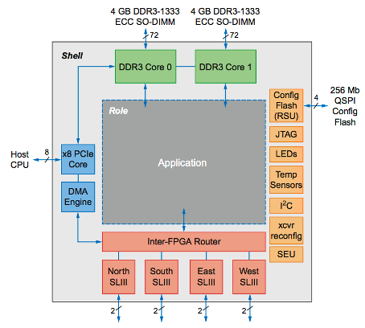
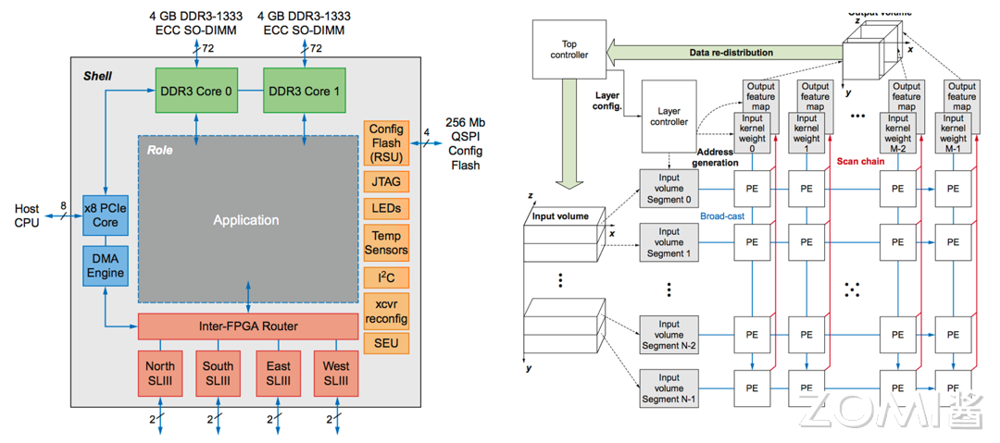
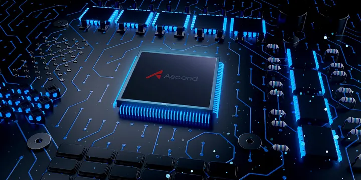
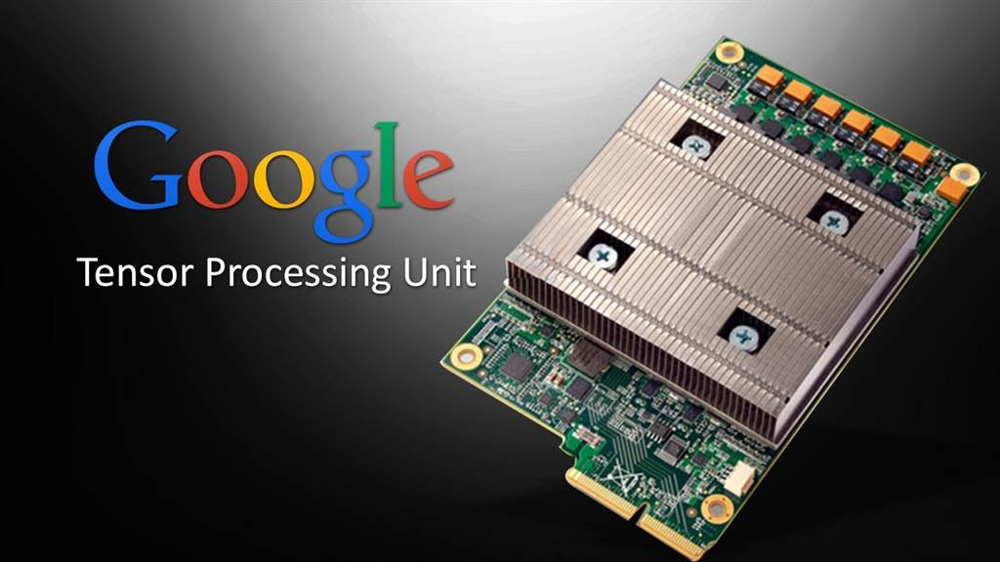
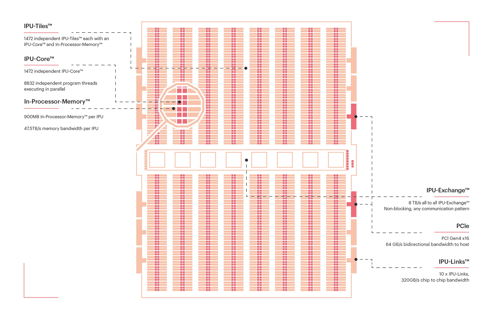
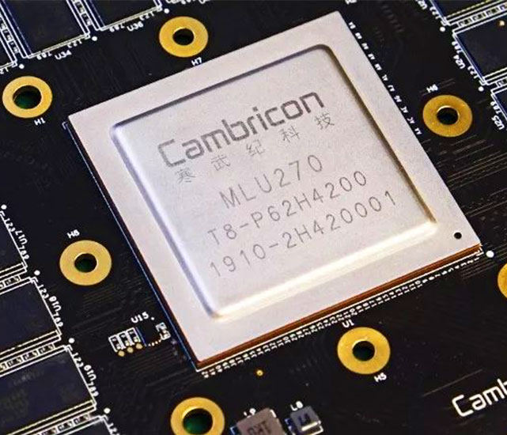
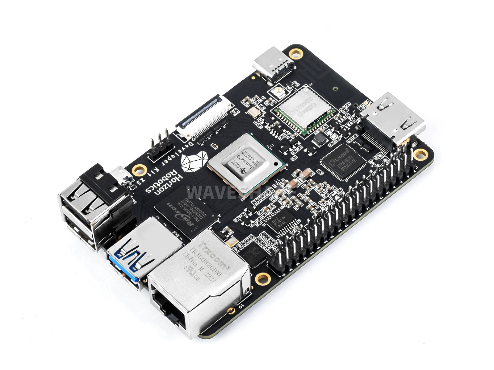
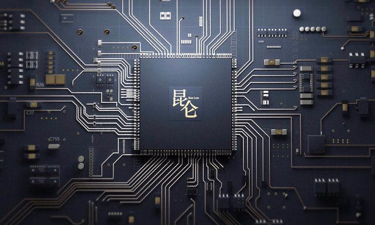
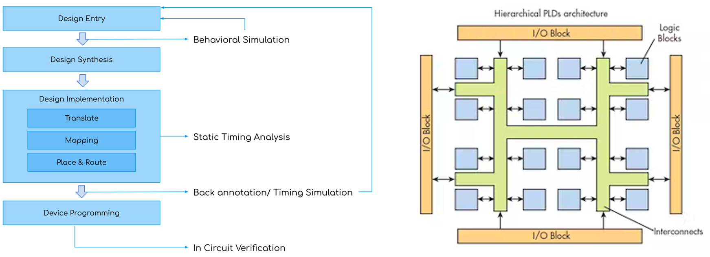
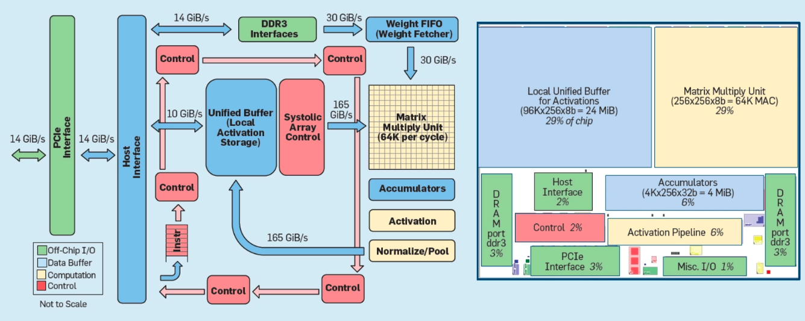

<!--Copyright 适用于[License]（https://github.com/chenzomi12/AISystem）版权许可-->

# NPU 基础

近年来，随着人工智能技术的飞速发展，AI 专用处理器如 NPU（Neural Processing Unit）和 TPU（Tensor Processing Unit）也应运而生。这些处理器旨在加速深度学习和机器学习任务，相比传统的 CPU 和 GPU，它们在处理 AI 任务时表现出更高的效率和性能。

AI 专用处理器的发展可以追溯到 2016 年，谷歌推出了第一代 TPU，采用了独特的 TPU 核心脉动阵列设计，专门用于加速 TensorFlow 框架下的机器学习任务。此后，谷歌又陆续推出了多个 TPU 系列产品，不断优化其架构和性能。

华为也紧随其后，推出了自己的 AI 专用处理器——昇腾 NPU。昇腾 NPU 采用了创新的达芬奇架构，集成了大量的 AI 核心，可以高效地处理各种 AI 任务。华为还推出了多款搭载昇腾 NPU 的产品，如华为 Mate 系列手机和 Atlas 服务器等。

特斯拉作为一家以电动汽车和自动驾驶技术闻名的公司，也推出了自己的 AI 芯片——DOJO。DOJO 采用了独特的架构设计，旨在加速自动驾驶系统的训练和推理任务。

除了上述几家巨头外，国内外还有许多其他公司也在积极布局 AI 芯片领域，如英伟达的 Xavier 和 Orin 系列、寒武纪的 MLU 系列、地平线的征程系列等。这些 AI 芯片在架构设计、性能表现、应用场景等方面各有特点，为 AI 技术的发展提供了强有力的硬件支持。

在接下来的内容中，我们将首先简单介绍引入什么是 AI 芯片，随后具体展开其的部署说明，技术发展路线和应用场景。

## 什么是 AI 芯片

AI 芯片是专门为加速人工智能应用中的大量针对矩阵计算任务而设计的处理器或计算模块。与传统的通用芯片如中央处理器（CPU）不同，AI 芯片采用针对特定领域优化的体系结构（Domain-Specific Architecture， DSA），侧重于提升执行 AI 算法所需的专用计算性能。

如下图所示的就是一个典型的 AI 芯片架构，我们假设所有场景围绕应用，那么其周围的例如解码芯片（如图中黄色部分 RSU）、FPGA 芯片（如图中粉色部分）等都是属于针对特定领域优化的芯片结构。

DSA 通常被称为针对特殊领域的加速器架构，因为与在通用 CPU 上执行整个应用程序相比，它们可以大幅提升特定应用的性能。DSA 可以通过更贴近应用的实际需求来实现更高的效率和性能。除了 AI 芯片，DSA 的其他例子还包括图形加速单元（GPU）、用于深度学习的神经网络处理器（NPU/TPU）以及软件定义网络（SDN）处理器等。

AI 芯片作为一种专用加速器，通过在硬件层面优化深度学习算法所需的矩阵乘法、卷积等关键运算，可以显著加速 AI 应用的执行速度，降低功耗。与在通用 CPU 上用软件模拟这些运算相比，AI 芯片能带来数量级的性能提升。因此，AI 芯片已成为人工智能技术实现落地的关键使能器。

他们的架构区别如下图，CPU 最为均衡，可以处理多种类型的任务，各种组件比例适中；GPU 则减少了控制逻辑的存在但大量增加了 ALU 计算单元，提供给我们以高计算并行度；而 NPU 则是拥有大量 AI Core，这可以让我们高效完成针对性的 AI 计算任务。

AI 芯片的兴起源于深度学习的快速发展。随着神经网络模型的规模不断增大，其应用快速发展，训练和推理所需的计算量呈指数级增长，传统的通用芯片已无法满足性能和功耗的要求。与此同时，AI 应用对实时性和能效的需求也日益提高，尤其是在自动驾驶、智能安防、边缘计算等场景中。这些因素共同推动了 AI 芯片的发展。

目前，AI 芯片主要分为两大类：训练芯片和推理芯片。训练芯片用于神经网络的训练过程，通常需要更大的芯片面积和功耗预算，注重提供高吞吐量的计算能力。推理芯片则用于训练后模型的部署和执行，更加强调低功耗和实时性。典型的训练卡有 NVIDIA A100、NVIDIA DGX 系列、AMD Instinct MI 系列、Google TPU 系列、Intel Nervana NNP 系列、Huawei Ascend 910 等。

## AI 芯片任务和部署

AI 芯片在人工智能的训练和推理任务中扮演着至关重要的角色。训练和推理是 AI 应用的两个主要阶段，对芯片的要求和特点也有所不同。

### 训练阶段

在训练阶段，AI 芯片需要支持大规模的数据处理和复杂的模型训练。这需要芯片具有强大的并行计算能力、高带宽的存储器访问以及灵活的数据传输能力。

算力、存储、传输、功耗、散热、精度、灵活性、可扩展性、成本，九大要素构筑起训练阶段 AI 芯片的“金字塔”。

算力为基，强大的并行计算能力是训练模型的根基，支撑着复杂模型的构建与优化。高带宽存储器访问则如高速公路般畅通无阻，保证数据高效流动。灵活的数据传输能力则是穿针引线的关键，使模型训练过程更加顺畅。

功耗与散热如影随形，高性能计算往往伴随着高热量产生。因此，低功耗、良好的散热设计至关重要，避免过热导致性能下降甚至芯片损坏。

精度至上，训练阶段要求芯片具备高精度计算能力，确保模型参数的准确无误，为模型训练奠定坚实基础。

灵活为王，训练芯片需要兼容各类模型和算法，适应不断发展的 AI 技术，展现游刃有余的适应能力。

可扩展性则是未来之光，面对日益庞大的模型和数据集，芯片需具备强大的扩展能力，满足不断增长的计算需求。

成本考量亦不可忽视，高昂的价格可能会限制芯片的应用范围，因此合理的价格策略也是芯片赢得市场的重要因素。

昇腾 Ascend NPU、Google TPU、Graphcore IPU（分别如下图所示）等专门为 AI 训练设计的芯片，正朝着上述目标不断迈进，为大规模 AI 模型训练提供强劲动力。相信随着 AI 技术的飞速发展，训练芯片也将不断突破瓶颈，为 AI 应用带来更加广阔的空间。

### 推理阶段

在推理阶段，AI 芯片需要在功耗、成本和实时性等方面进行优化，以满足不同应用场景的需求。云端推理通常对性能和吞吐量要求较高，因此需要使用高性能的 AI 芯片，如 GPU、FPGA 等。边缘和端侧推理对功耗和成本更加敏感，因此需要使用低功耗、低成本的 AI 芯片，如专门为移动和嵌入式设备设计的 NPU、TPU 等。

相较于训练芯片在“幕后”的默默付出，推理芯片则站在了 AI 应用的前沿，将训练好的模型转化为现实世界的智能服务。如果说训练芯片是 AI 技术的发动机，那么推理芯片就是将这股力量输送到应用场景的传动装置。那么为何国内热衷推理芯片？近年来，国内涌现出众多推理芯片厂商，这背后既有政策驱动的因素，也离不开市场需求的牵引。政策方面，国家层面高度重视 AI 产业发展，出台了一系列扶持政策，鼓励企业研发国产 AI 芯片。这为国内推理芯片厂商提供了良好的发展机遇。市场需求方面，随着 AI 应用的普及，对推理芯片的需求也日益旺盛。智能手机、智能家居、自动驾驶等领域，都对推理芯片有着巨大的需求。

推理芯片的关键因素与训练芯片相比，也在性能、功耗、成本等方面有着不同的要求。性能方面，推理芯片需要支持多种模型和算法，并能够以较低的延迟完成推理任务。功耗方面，推理芯片通常部署在边缘设备上，因此需要具有较低的功耗，以延长设备续航时间。成本方面，推理芯片需要价格亲民，才能被更广泛地应用。

除了上述因素之外，推理芯片还需要考虑：灵活性：推理芯片需要能够快速部署和更新模型，以适应不断变化的需求。安全性：推理芯片需要具备安全防护能力，防止数据泄露和安全攻击。随着 AI 应用的不断发展，AI 芯片的异构集成趋势也越来越明显。单一的芯片架构难以满足日益多样化的 AI 应用需求，因此，集成多种异构计算单元的 AI 芯片成为了主流方向。例如，集成 CPU、GPU、NPU 等多种计算单元的 AI 芯片，可以在训练和推理任务中发挥各自的优势，提供更加全面和高效的 AI 计算能力。

目前，国内推理芯片市场呈现出百花齐放的局面，涌现出寒武纪、地平线、百度等一批优秀厂商。这些厂商推出的推理芯片（如下图分别所示），在性能、功耗、成本等方面取得了显著进步，并逐渐开始在智能手机、智能家居、自动驾驶等领域实现商用。

此外，AI 芯片的部署方式也在不断演进。传统的云端部署模式面临着数据传输和隐私安全等挑战，因此边缘和端侧部署成为了 AI 应用的重要趋势。通过将 AI 芯片和模型部署在边缘设备和终端设备上，可以大大减少数据传输的延迟和带宽压力，提高 AI 应用的实时性和安全性。同时，端侧部署也对 AI 芯片的功耗和成本提出了更高的要求。

## AI 芯片技术路线

作为加速应用的 AI 芯片，主要的技术路线有三种：GPU、FPGA、ASIC。它们三者间的区别如下图：

具体而言，我们将展开介绍三者的一些基础细节：

### GPU

GPU 由于其强大的并行计算能力，已经成为目前最主流的 AI 芯片加速方案。GPU 厂商不断推出 专门针对 AI 加速的 GPU 产品，如 NVIDIA 的 Tesla 系列，AMD 的 Radeon Instinct 系列等。为了进一步提高 GPU 在 AI 领域的性能，厂商们也在不断对 GPU 的架构进行优化，如 NVIDIA 推出了专门为深度学习优化的 Tensor Core 技术，可以大幅提高矩阵运算的速度。但是，GPU 作为一种通用计算芯片，在功耗和成本方面还有进一步优化的空间。此外，GPU 编程的难度也较高，对开发者的要求较高。

下图为 GPU 架构概略图：

### FPGA

FPGA 作为一种可重构的硬件，在 AI 加速领域也有广泛的应用。与 GPU 相比，FPGA 的优势在于更低的功耗和更高的灵活性。FPGA 厂商也在不断推出针对 AI 应用的 FPGA 产品，如 Xilinx 的 Alveo 系列，Intel 的 Stratix 系列等。

这些产品通常集成了更多的数学运算单元，以及更大的片上存储和更高的内存带宽，以满足 AI 应用的需求。但是，FPGA 的编程难度较高，通常需要硬件描述语言（如 Verilog 或 VHDL）的知识。此外 FPGA 的成本也较高，在大规模部署时可能会受到限制。

下图为 FPGA 架构概略图：

### ASIC

ASIC 作为专用芯片，可以针对特定的 AI 算法和应用场景进行优化，提供最高的性能和能效。许多科技巨头都在开发自己的 AI 专用 ASIC，如谷歌的 TPU、华为的昇腾 Ascend NPU 系列等。与 GPU 和 FPGA 相比，ASIC 可以在计算速度、功耗、成本等方面做到更加极致的优化。

但是，ASIC 的设计周期较长，前期投入大，灵活性也较差。此外，ASIC 芯片通常需要配合专门的软件栈和开发工具，生态系统的建设也是一大挑战。

下图为 ASIC 架构概略图：

## AI 芯片应用场景

1. AI 计算中心

AI 计算中心是 AI 芯片的重要应用场景之一。随着 AI 技术的不断发展，对计算能力的需求也在不断增长。为了满足这一需求，NVIDIA、Huawei、Google 等头部厂商都相继发布了针对 AI 计算中心的 AI 训练加速器。这些加速器具有高性能、高能效的特点，可以大大提高 AI 模型的训练速度。

在 AI 计算中心中，互联带宽是一个重要的限制因素。目前主流的互联技术是 PCIe v4，但其功率限制在 300W 左右，已经无法满足日益增长的计算需求。因此，业界对 PCIe v5 的发布充满期待，希望通过更高的互联带宽来突破现有的限制。

除了互联带宽外，各大厂商还发布了高度可扩展的互联技术，可以将数千张加速卡连接在一起。这对于像 Cerebras、GraphCore、Groq、Tesla Dojo 这样的数据流加速器尤为重要，因为这些加速器需要显式/静态编程，或者需要将任务路由到计算硬件上。先进的互联技术使得这些加速器能够适应像 ChatGPT 这样参数量达到千亿级别的大型模型。

值得一提的是，虽然 Int8 精度在嵌入式、自主和数据中心推理应用中已经成为默认的数值精度，但在 AI 计算中心中，仍有部分加速器使用 FP16 或 BF16 进行训练或推理，以获得更高的计算精度。

2. 自动驾驶和安防应用

自动驾驶和安防是 AI 芯片的另一个重要应用场景。在自动驾驶领域，AI 芯片可以用于处理车载传感器采集的大量数据，实现对道路环境的实时感知和决策。目前，特斯拉、英伟达、Mobileye 等公司都在积极布局自动驾驶芯片，推动自动驾驶技术的发展和应用。

在安防领域，AI 芯片可以用于智能视频分析、人脸识别、行为分析等任务，提高安防系统的智能化水平。例如，海康威视、大华股份等安防巨头都在加大 AI 芯片的研发和应用力度，推出了一系列智能安防产品和解决方案。

3. IOT 应用

IoT 设备是 AI 芯片的另一个重要应用场景。随着 AI 技术的发展，越来越多的 IoT 设备开始搭载 AI 芯片，实现本地智能处理和决策。2017 年以来，苹果、华为海思、高通、联发科等主要芯片厂商相继发布了支持 AI 加速功能的新一代芯片，推动了 AI 在 IoT 领域的应用。时间线如下图：

IoT 设备种类繁多，对 AI 芯片的需求也各不相同。例如，智能音箱对语音识别和自然语言处理的要求较高，而智能摄像头则对图像处理和目标检测的要求较高。因此，IoT 领域的 AI 芯片需要根据具体应用场景进行针对性设计和优化。

## 小结与讨论

AI 专用处理器如 NPU 和 TPU 的出现，极大地推动了人工智能技术的发展和应用。这些芯片在架构设计和性能优化方面不断创新，为各种 AI 任务提供了强大的计算支持。在具体应用场景方面，AI 芯片已经在智能手机、数据中心、自动驾驶、安防、IoT 等领域得到了广泛应用。不同的应用场景对 AI 芯片的要求各不相同，需要根据具体任务进行针对性设计和优化。

展望未来，随着 AI 技术的不断发展和应用需求的不断增长，AI 芯片必将迎来更加广阔的发展前景。各大科技巨头和芯片厂商也将继续加大在 AI 芯片领域的投入和创新，推动人工智能技术的进一步发展和普及。同时，AI 芯片的发展也将带动相关产业链的繁荣，为经济社会发展注入新的动力。

## 本节视频

<html>

<iframe src="https://player.bilibili.com/player.html?aid=739564193&bvid=BV1Rk4y1e77n&cid=1084564213&page=1&as_wide=1&high_quality=1&danmaku=0&t=30&autoplay=0" width="100%" height="500" scrolling="no" border="0" frameborder="no" framespacing="0" allowfullscreen="true"> </iframe>
</html>

## 引用

[1]. [训练芯片和推理芯片，都是干嘛的？](https://zhuanlan.zhihu.com/p/668906583)

[2]. [AI 芯片场景](https://www.cnblogs.com/wujianming-110117/p/16011267.html)
