<!--Copyright 适用于[License](https://github.com/chenzomi12/AISystem)版权许可-->

# 超异构计算

在这一节中我们要从更远的视角来看看计算机架构发展的黄金 10 年，主要将围绕异构计算和超异构来展开。在开始具体内容前，我们非常推荐您观看以下两个视频：

1. **计算机架构的新黄金时代**：[A New Golden Age for Computer Architecture](https://www.youtube.com/watch?v=kFT54hO1X8M)

2. **编译器的黄金时代**：[The Golden Age of Compiler Design in an Era of HW/SW Co-design](https://www.youtube.com/watch?v=4HgShra-KnY)

他们可以让您更细致的了解计算机体系结构和编译器的发展历程和重要节点。接下来让我们先简述一下关于 AI 芯片发展的阶段。

## AI 芯片发展

人工智能的发展与芯片算力的提升密不可分，可以大致分为三个阶段：

1. 第一阶段：芯片算力不足，神经网络没有被受到重视
   

在早期，受限于芯片算力，复杂的神经网络模型难以实现。这一时期的人工智能主要依赖于专家系统、决策树等传统方法。神经网络虽然在理论上已经被提出，但由于计算资源的匮乏，难以训练出有效的模型，因此没有受到广泛重视。

2. 第二阶段：CPU 算力大幅提升，但仍然无法满足神经网络增长需求

随着摩尔定律的推进，CPU 性能不断提升。这为神经网络的发展提供了一定的计算基础。研究者们开始尝试更大规模的神经网络，并在一些领域取得了突破。但是，神经网络对算力的需求呈指数级增长，单纯依靠 CPU 的性能提升已经难以满足日益复杂的模型训练需求。

3. 第三阶段：GPU 和 AI 芯片新架构推动人工智能快速落地

为了解决算力瓶颈，研究者们开始将目光转向了其他计算架构。GPU 凭借其强大的并行计算能力，成为了深度学习的主要计算平台。与 CPU 相比，GPU 在矩阵运算等方面有着显著的优势，能够大幅加速神经网络训练。与此同时，一些专门针对 AI 加速的芯片架构也开始涌现，如 TPU、NPU 等。这些芯片在算力、功耗等方面进一步优化，为人工智能的落地应用扫清了障碍。

除了芯片算力外，算法的进步、数据的积累也是人工智能发展的重要推动力。在算力瓶颈得到缓解后，一些重要的神经网络结构如 CNN、RNN、Transformer 等被相继提出，并在图像、语音、自然语言处理等领域取得了突破性进展。海量的数据为模型训练提供了丰富的素材，使得神经网络能够学习到更加鲁棒和泛化的特征表示。

而更进一步，单一架构的使用也渐渐满足不了一些应用场景，针对于此，异构计算的概念也就应运而生。

## 异构与超异构场景

首先让我们来理解一下为什么需要异构？摩尔定律放缓，传统单一架构难以满足日益增长的计算需求。异构计算，犹如打破计算藩篱的利器，通过整合不同类型计算单元的优势，为计算难题提供全新的解决方案。

异构计算的主要优势有：

性能飞跃： 异构架构将 CPU、GPU、FPGA 等计算单元有机结合，充分发挥各自优势，实现 1+1>2 的效果，显著提升计算性能。

灵活定制： 针对不同计算任务，灵活选择合适的主张计算单元，实现资源的高效利用。

降低成本： 相比于昂贵的专用计算单元，异构架构用更低的成本实现更高的性能，带来更佳的性价比。

降低功耗： 异构架构能够根据任务需求动态调整资源分配，降低整体功耗，提升能源利用效率。

其应用场景也十分广泛，包括人工智能、高性能计算、大数据分析、图形处理等等

我们以一个具体的例子来引入：特斯拉 HW3 FSD 芯片（如下图），我们可以看到其单一芯片却有着 CPU，GPU，NPU 多种架构。

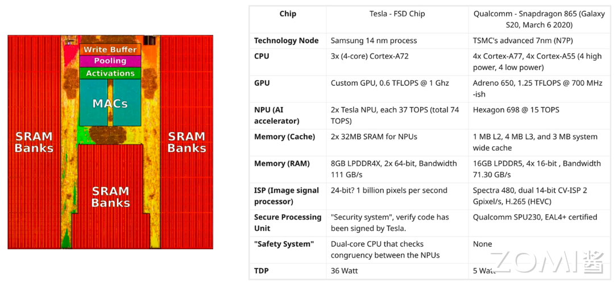

其之所以有如此异构架构则是由需求（如下图所标示）决定的：身为汽车芯片，其要负责雷达、GPS、地图等等多种功能，这时单一传统的架构就会比较难以高效完成任务：

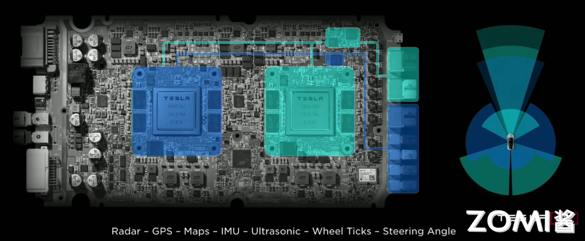

而将各部分组件有机结合的异构芯片就可以更好的处理复杂情况，如下图，我们可以看到 GPU、NPU、Quad Cluster 等等硬件均被集合在一起，通过芯片外的 CPU 等等进行协同控制，这样就可以在多种任务的处理和切换时实现非常好的效果。

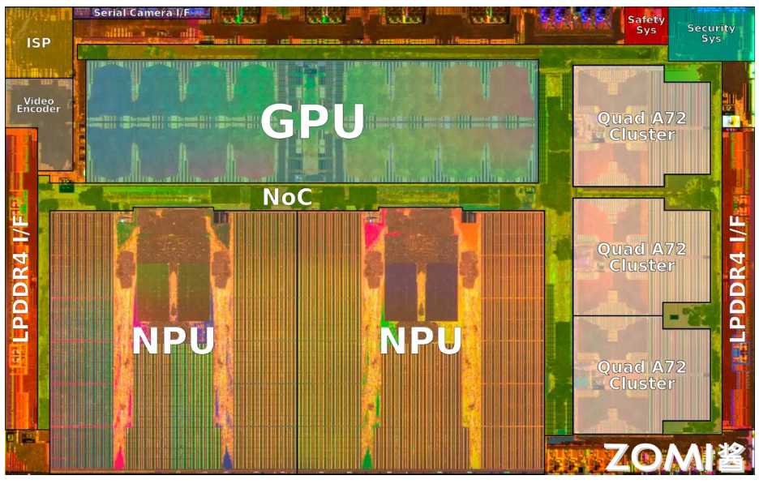

## 计算体系迎来异构

异构计算的出现和发展源于传统冯·诺依曼结构计算机受制于存储和计算单元之间的数据交换瓶颈，难以满足日益增长的计算需求，加之半导体工艺的发展使得 CPU 主频提升受到物理和功耗的限制，性能提升趋于缓慢。

为了突破单核 CPU 性能的瓶颈，业界开始探索并行计算技术，通过多核处理器或集群计算机实现高性能计算，然而并行计算中的微处理器仍受冯·诺依曼结构的制约，在处理数据密集型任务时，计算速度和性价比不尽如人意。

随着深度学习等人工智能技术的兴起，对计算能力提出了更高的要求，传统的 CPU 在处理神经网络训练和推理任务时，性能和效率远不及专门设计的 AI 芯片，如 GPU 和 NPU 等。异构计算通过集成不同类型的计算单元，发挥各自的计算优势，实现更高的性能和能效，AI 芯片在处理特定任务时，计算效率远超传统 CPU，有望成为未来计算机体系的标配。

尽管异构计算的发展仍面临系统功耗限制、上层基础软件的欠缺以及与芯片结构的匹配度不足等挑战，但通过优化异构计算平台的架构设计、开发高效的编程模型和运行时系统、提供易用的开发工具和库，可以更好地发挥异构计算的潜力，推动人工智能、大数据分析、科学计算等领域的进一步发展，异构计算有望成为未来计算机体系结构的主流趋势。

### 异构的例子

下面我们将用一个最常见的 CPU-GPU 异构工作流来给出一个具体的例子，如下图：

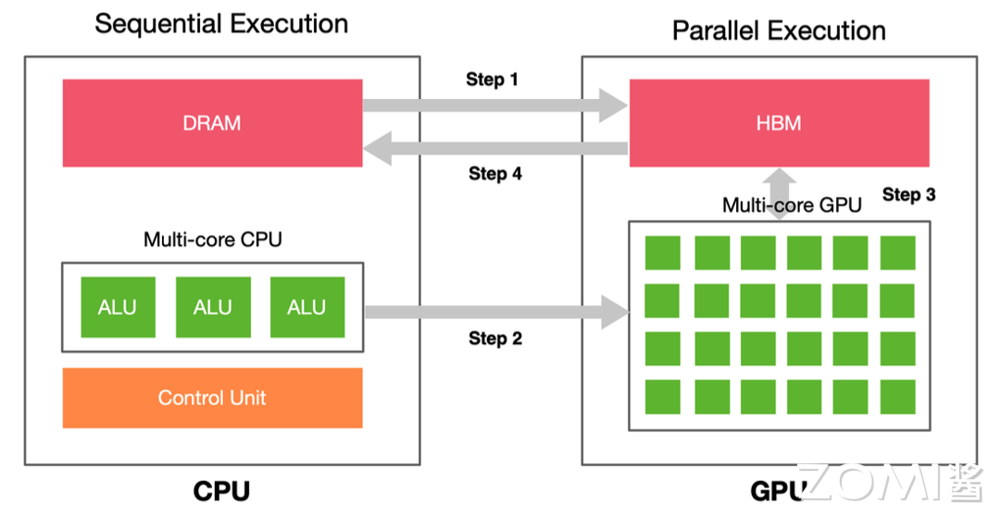

其具体流程为：

1. CPU 把数据准备好，并保存在 CPU 内存中
2. 将待处理的数据从 CPU 内存复制到 GPU 内存（图中 Step1）
3. CPU 指示 GPU 工作，配置并启动 GPU 内核（图中 Step2）
4. 多个 GPU 内核并行执行，处理准备好的数据（图中 Step3）
5. 处理完成后，将处理结果复制回 CPU 内存（图中 Step4）
6. CPU 把 GPU 的结果进行后续处理

通过这样的异构设置，我们就可以更充分、高效地协同发挥不同组件的优势特性，以实现更高的性能。我们以游戏为例：现代游戏画面逼真复杂，对计算能力提出了极高要求。传统 CPU 难以满足如此严苛的性能需求，而 GPU 擅长图形处理，能够高效渲染游戏画面。异构计算将 CPU 和 GPU 优势互补，强强联合。CPU 负责游戏逻辑、场景构建等任务，GPU 则专注于画面渲染。两者分工协作，实现更高效的硬件利用率。

### 异构的优势

我们接下来总结补充三点异构架构的优势：

1. **适用于处理高性能计算**：伴随着高性能计算类应用的发展，驱动算力需求不断攀升，但目前单一计算类型和架构的处理器已经无法处理更复杂、更多样的数据。数据中心如何在增强算力和性能的同时，具备应对多类型任务的处理能力，成为全球性的技术难题。异构并行计算架构作为高性能计算的一种主流解决方案，受到广泛关注。

2. **适用于处理数据中心产生的海量数据**：数据爆炸时代来临，使用单一架构来处理数据的时代已经过去。比如：个人互联网用户每天产生约 1GB 数据，智能汽车每天约 50GB，智能医院每天约 3TB 数据，智慧城市每天约 50PB 数据。数据的数量和多样性以及数据处理的地点、时间和方式也在迅速变化。无论工作任务是在边缘还是在云中，不管是人工智能工作任务还是存储工作任务，都需要有正确的架构和软件来充分利用这些特点。

3. **可以共享内存空间，消除冗余内存副本**：在此前的技术中，虽然 GPU 和 CPU 已整合到同一个芯片上，但是芯片在运算时要定位内存的位置仍然得经过繁杂的步骤，这是因为 CPU 和 GPU 的内存池仍然是独立运作。为了解决两者内存池独立的运算问题，当 CPU 程式需要在 GPU 上进行部分运算时，CPU 都必须从 CPU 的内存上复制所有的资料到 GPU 的内存上，而当 GPU 上的运算完成时，这些资料还得再复制回到 CPU 内存上。然而，将 CPU 与 GPU 放入同一架构，就能够消除冗余内存副本来改善问题，处理器不再需要将数据复制到自己的专用内存池来访问/更改该数据。统一内存池还意味着不需要第二个内存芯片池，即连接到 CPU 的 DRAM。

除了 CPU 和 GPU 异构以外，AISC 在异构体系中也扮演着重要的角色（如下图），尤其是对于 AI 加速。其通过驱动程序和 CSR 和可配置表项交互，以此来控制硬件运行。和 GPU 类似，ASIC 的运行依然需要 CPU 的参与：

1. 数据输入：数据在内存准备好，CPU 控制 ASIC 输入逻辑，把数据从内存搬到处理器 
2. 数据输出：CPU 控制 ASIC 输出逻辑，把数据从处理器搬到内存，等待后续处理
3. 运行控制：控制 CSR、可配置表项、中断等

ASIC 工作流示意图如下：

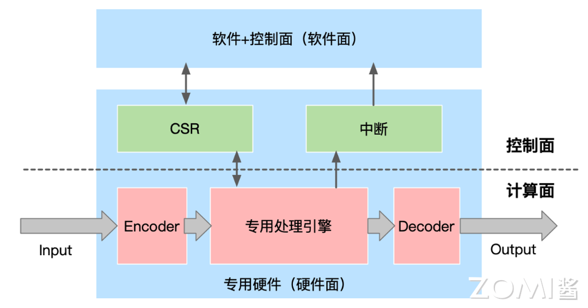

从 CPU 到 ASIC，我们会发现架构越来越碎片化，指令作为软件和硬件之间的媒介，其复杂度决定了系统的软硬件解耦程度。典型的处理器平台可以分为 CPU、协处理器、GPU、FPGA、DSA 和 ASIC。随着指令复杂度的提高，单个处理器能够覆盖的场景变得越来越小，处理器的形态也变得越来越多样化。这种碎片化趋势导致构建生态变得越来越困难。这形成了易用性和性能之间的权衡关系，如下图：

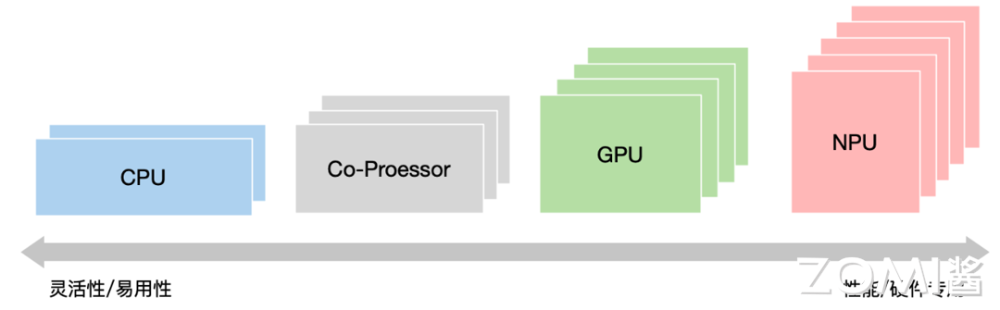

而在 CPU+XPU 的异构计算中，XPU 的选择决定了整个系统的性能和灵活性特征。GPU 具有较好的灵活性，但性能效率不够极致；DSA 性能优异，但灵活性较差，难以适应复杂计算场景对灵活性的要求；FPGA 的功耗和成本较高，需要进行定制开发，落地案例相对较少；ASIC 的功能完全固定，难以适应灵活多变的复杂计算场景。

我们可以发现异构计算本身也还是存在着一些问题：

1. 复杂计算：系统越复杂，需要选择越灵活的处理器；性能挑战越大，需要选择越偏向定制的加速处理器；

2. 本质矛盾：单一处理器无法兼顾性能和灵活性；

为了解决异构计算存在的挑战，超异构概念应运而生。超异构架构将多种类型的 XPU 有机结合，融合了不同 XPU 的优势，能够同时兼顾性能和灵活性，满足复杂计算场景的需求。

## 从异构到超异构

首先我们从三个角度来理解一下为什么超异构的出现是应运而生的：

1. **需求驱动**：软件新应用层出不穷，两年一个新热点。随着人工智能、大数据、元宇宙等新兴技术的快速发展，对计算能力提出了越来越高的要求。传统单一架构的计算模式难以满足日益增长的计算需求，亟需新的计算架构来突破性能瓶颈。已有的热点技术仍在快速演进。例如，元宇宙需要将算力提升 1000 倍才能实现逼真的沉浸式体验。超异构计算能够通过融合不同类型计算单元的优势，显著提升计算性能，为元宇宙等新兴技术的落地提供强有力的支持。

2. **工艺和封装支撑**：Chiplet 封装使得在单芯片层次，可以构建规模数量级提升的超大系统。Chiplet 封装技术将多个芯片封装在一个封装体内，可以显著提高芯片的集成度和性能。这使得在单一封装内集成多种类型的 XPU 成为可能，进一步推动了超异构计算的发展。

3. **系统架构持续创新**：通过架构创新，在单芯片层次，实现多个数量级的性能提升。随着计算机体系结构的不断发展，新的架构设计不断涌现，例如异构架构、多核架构等。这些架构能够通过充分发挥不同类型处理器的优势，显著提升计算性能。异构编程很难，超异构编程更是难上加难。如何更好地驾驭超异构，是成败的关键。近年来，随着异构编程模型和工具的不断完善，超异构编程的难度逐渐降低，这为超异构计算的推广应用奠定了基础。

通过以上三个角度我们可以推断，超异构计算的出现是顺应时代发展需求的必然选择。它能够突破传统单一架构的性能瓶颈，满足日益增长的计算需求，为各行各业的创新发展注入强劲动力。

了解背景后，我们来正式介绍超异构的概念，如下图：

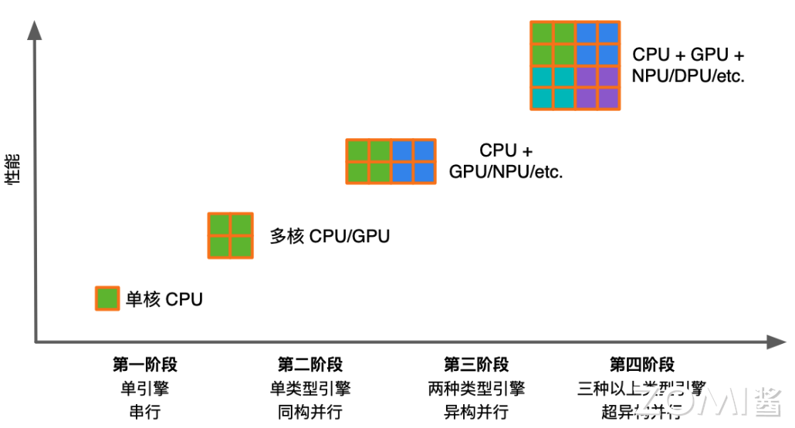

超异构实际上就是集合了三种以上类型引擎/架构的超架构，但是这种集合非简单的集成，而是把更多的异构计算整合重构，各类型处理器间充分、灵活的数据交互，形成统一的超异构计算体系。计算从单核的串行走向多核的并行；又进一步从同构并行走向异构并行。下图为异构计算的发展的概略流程图：

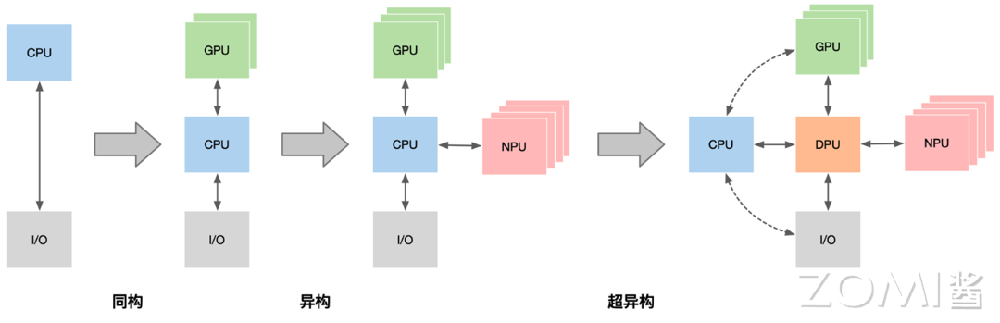

超异构有以下基本特征：

1. 超大规模的计算集群：超异构计算通常由大量计算节点组成，每个节点可以包含 CPU、GPU、FPGA、DSA 等多种类型的计算单元。这些计算节点通过高速互联网络连接在一起，形成一个超大规模的计算集群。超大规模的计算集群能够提供强大的计算能力，满足大数据分析、人工智能、科学计算等对计算能力要求高的应用场景。

2. 复杂计算系统，由分层分块组件组成，如下图所示。超异构计算系统的复杂性主要体现在以下几个方面：不同类型的计算单元具有不同的性能和特性，需要进行统一管理和调度；计算任务可能涉及多个计算节点，需要进行任务分解和数据通信；需要考虑功耗、可靠性等因素，进行系统优化。

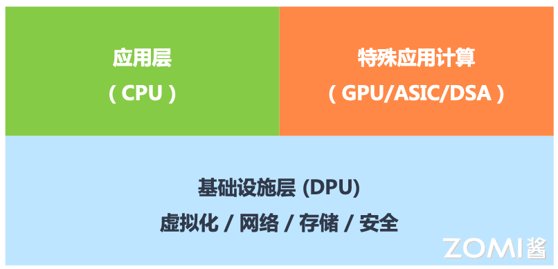

## 超异构的挑战与思考

根据前文内容，我们可以明白超异构的概念和其必要性，但是显然超异构的实现也伴随着许多挑战，接下来我们将分点来介绍它们。

### 超异构的软件层

1. 遇到挑战

软件需要跨平台复用：跨架构、跨不同处理器类型、跨厂家平台、跨不同位置、跨不同设备类型。因此软件架构的复杂性增长，会成为一个最大的挑战。如下图：

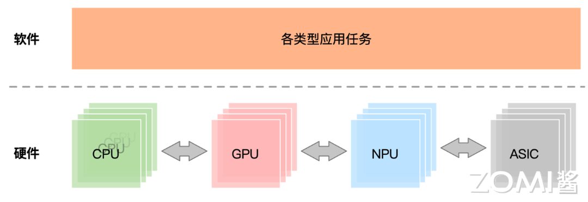

2. 解决办法

- 开放接口/架构及生态：形成标准的开放接口/架构；开发者遵循接口/架构开发产品和服务，从而形成开放生态；

- 软件兼容：尽可能减少针对已有应用的定制化开发，兼容已有软件生态，通过基础软件（如编译层）对接加速应用软件；

- 编程体系：提供门槛更低的编译体系，通过编程体系构建上层加速库从而对接领域应用，即提供门槛较低的标准领域编程语言（如英伟达的 CUDA、昇腾的 Ascend C）；

- 开放架构：进一步开放软硬件架构，防止架构过多导致的市场碎片化，如 90 年代编译器风起云涌到目前聚焦 2/3 个编译器；

### 硬件定义软件 vs 软件定义硬件

目前这个问题有三个可能的解，如下图，他们分别为：

硬件定义软件（HDW）：硬件定义软件（HDW）是一种设计理念，它强调通过硬件来定义软件的功能和架构。在 HDW 模式下，软件的开发和部署更加依赖于底层硬件的特性，能够充分发挥硬件的性能优势。HDW 的核心思想是通过硬件加速器、专用指令集等技术，为软件提供硬件层面的支持，使软件能够更高效地运行。HDW 能够充分利用硬件的并行计算能力，显著提升软件的性能。

软件定义硬件（SDH）：软件定义硬件（SDH）是一种设计理念，它强调通过软件来定义硬件的功能和性能。在 SDH 模式下，硬件的设计和实现更加灵活，能够快速响应软件的需求变化。SDH 的核心思想是通过软件抽象层（SAL）将软件和硬件解耦，使软件开发人员能够专注于软件的功能实现，而无需关注底层硬件的细节。SAL 为软件提供了统一的硬件接口，屏蔽了不同硬件平台之间的差异，使软件能够跨平台运行。

软硬件协同定义（Co-Design）：软硬件协同定义（Co-Design）是一种设计理念，它强调软件和硬件的协同设计与优化，以实现最佳的系统性能。在 Co-Design 模式下，软件和硬件的设计团队紧密合作，共同探讨系统需求，并提出满足需求的软硬件解决方案。Co-Design 的核心思想是打破软件和硬件之间的传统界限，将软硬件设计视为一个整体，通过协同设计和优化来实现最佳的系统性能。Co-Design 能够充分发挥软件和硬件的各自优势，实现 1+1>2 的效果。

在计算机系统的发展历程中，硬件和软件的关系经历了从"硬件定义软件"到"软件定义硬件"的转变。早期的计算机系统，如早期的操作系统，其系统业务逻辑主要由硬件实现，软件只是起到辅助作用，并且软件的构建依赖于硬件提供的接口。然而，随着计算机技术的不断进步，"软件定义硬件"的概念逐渐兴起。

在"软件定义硬件"的模式下，系统的业务逻辑主要由软件来实现，硬件则扮演辅助角色。一个典型的例子是 AI4SIC 模拟仿真软件，它利用软件的灵活性和可编程性来模拟复杂的系统行为。此外，现代的硬件设备，如具有渲染管道的 GPU，其功能和行为可以通过软件进行编程和控制，使得硬件能够按照软件的逻辑执行操作。这种软件对硬件的可编程性大大提高了系统的灵活性和适应性。

除了软件主导系统逻辑和对硬件的可编程性之外，"软件定义硬件"还体现在硬件的构建过程中对软件接口的依赖。以 AI 算法为例，许多硬件加速器和专用芯片的设计都是基于特定的 AI 算法和框架，它们依赖于软件提供的接口和规范来实现硬件的功能。这种软件驱动的硬件构建方式使得硬件能够更好地适应不断变化的应用需求，并与软件生态系统紧密结合。

这个问题的答案实际上和系统复杂度密切相关。对于复杂度较小且迭代较慢的系统，如 CPU，可以快速设计优化的系统软硬件划分，先进行硬件开发，然后再开始系统层和应用层的软件开发，如 Windows 操作系统等。这种情况下，硬件在一定程度上定义了软件的开发和运行环境。

然而，随着系统复杂度的上升，如 GPU 所面临的情况，量变引起质变，系统迭代速度加快，直接实现一个完全优化的设计变得非常困难。在这种情况下，系统实现变成了一个演进式的过程。在前期，由于系统尚不稳定，算法和业务逻辑处于快速迭代阶段，需要快速实现新的想法。随着系统的发展，算法和业务逻辑逐渐稳定下来，后续可以通过逐步优化到 GPU、DSA 等硬件加速来持续提升性能。

从本质上讲，这是一个系统定义的过程。当系统复杂度过高时，实现难以一次到位，系统实现变成了一个持续优化和迭代的过程。软件和硬件之间的关系变得更加紧密和动态，软件的需求和发展推动着硬件的优化和演进，而硬件的进步又为软件的创新提供了新的可能性。

总之，在计算机系统的发展过程中，硬件定义软件和软件定义硬件这两种关系都存在，而系统复杂度的高低决定了这两种关系的主导地位。对于复杂度较低的系统，硬件定义软件的情况更为常见；而对于复杂度较高的系统，软件定义硬件的情况则更为普遍，系统实现变成了一个持续优化和迭代的过程。

### 计算体系 vs 编译体系

超异构架构的处理器越来越多，需要构建高效、标准、开放接口和架构体系，才能构建一致性的宏架构（多种架构组合）平台，才能避免场景覆盖的碎片化。

现在正处于计算体系变革和编译体系变革 10 年，避免为了某个应用加速而去进行非必要大量上层应用迁移对接到硬件 API，应交由一致性的宏架构（多种架构组合）平台（编译/操作系统）。

### 超异构的未来 

跨平台统一计算架构（如下图）是未来计算资源中心化的关键，通过将孤岛计算资源连接起来，实现计算资源池化，可以显著提升算力利用率。这种架构能够支持应用软件跨同类处理器架构、跨不同类处理器架构、跨芯片平台以及跨云边端运行，满足更复杂应用场景对算力无限的需求，形成开放生态。

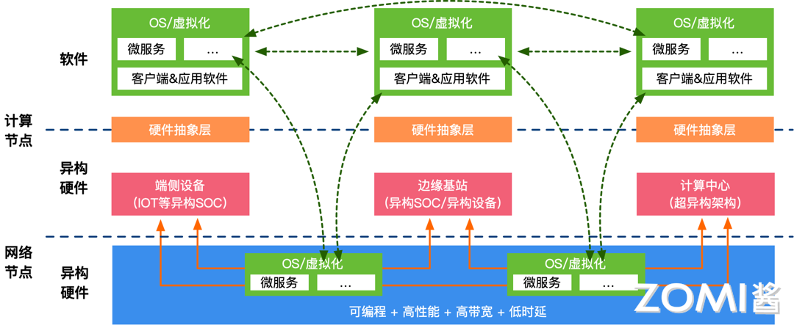

为了实现软件应用算法对硬件加速的支持，需要调整软件架构，将控制面和计算/数据面分开，并实现接口标准化。同时，通过底层基础软件（编译器）自适应选择计算/数据，使数据输入/输出不仅可以来源于软件，还可以来源于硬件，甚至可以下沉到硬件独立传输计算。

在超异构系统中，采用极致性能优化的分层可编程体系架构，绝大部分计算交由 DSA 进行极致计算，使得系统整体性能效率接近 DSA。用户角度应用运行在 CPU 上，开发者感知的是 CPU 可编程，通过操作系统和编译器区分异构。Chiplet+超异构的组合，使得系统规模数量级提升，整体超异构系统性能实现数量级提升。

未来的计算架构将呈现出体系异构、平台化和开放生态的特点。超异构计算架构由 CPU、GPU、FPGA 和 DSA 多架构处理器组成，目标是接近 CPU 的灵活性和 ASIC 的性能效率，在不影响开发效率的情况下实现整体性能的数量级提升。平台化和可编程的目标是实现软件定义一切，硬件加速一切，通过完全可软件编程的硬件加速平台，满足多场景、多用户需求，适应业务演进。建立标准和开放生态，拥抱开源开放的生态，支持云原生、云网边端融合，实现用户无平台依赖。

## 小结与思考

- 超异构计算结合了多种计算架构，如 CPU、GPU、FPGA 等，以应对摩尔定律放缓后对计算性能的不断增长需求。

- 超异构计算面临软件层跨平台复用、软硬件协同定义、计算与编译体系变革等挑战，需要开放接口、架构创新和统一的编程模型来克服。

- 超异构计算的未来趋势是构建跨平台统一的计算架构，实现软件应用算法对硬件加速的自适应支持，形成开放和高效的计算生态系统。

## 本节视频

<html>
<iframe src="https://player.bilibili.com/player.html?aid=909754083&bvid=BV1YM4y117VK&cid=1088885714&page=1&as_wide=1&high_quality=1&danmaku=0&t=30&autoplay=0" width="100%" height="500" scrolling="no" border="0" frameborder="no" framespacing="0" allowfullscreen="true"> </iframe>
</html>
