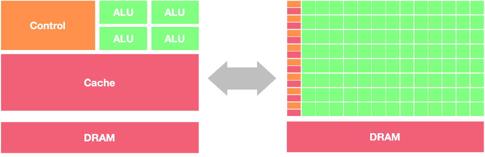
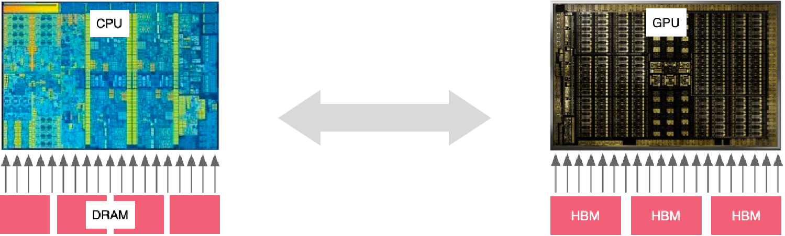
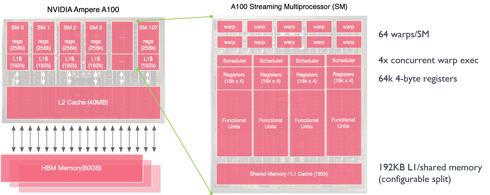

# GPU工作原理

前面的章节对AI计算体系和AI芯片基础进行讲解，在AI芯片基础中关于通用图形处理器GPU只是简单地讲解了主要概念，本章将从GPU硬件基础和英伟达GPU架构两个方面讲解GPU的工作原理。英伟达GPU有着很长的发展历史，整体架构从Fermi到Blankwell架构演变了非常多代，其中和AI特别相关的就有Tensor Core和NVLink。

本节首先讲解CPU和GPU架构的区别，之后以$AX+Y$这个例子来探究GPU是如何做并行计算的，为了更好地了解GPU并行计算，对并发和并行这两个概念进行了区分。此外会讲解GPU的缓存机制，因为这将涉及到GPU的缓存（Cache）和线程（Thread）。

## CPU和GPU架构区别

在正式开始本章内容之前，首先明确什么是GPU以及GPU和CPU的主要区别是什么？首先探讨一下CPU和GPU在架构方面的主要区别，CPU即中央处理单元（Central Processing Unit），负责处理操作系统和应用程序运行所需的各类计算任务，需要很强的通用性来处理各种不同的数据类型，同时逻辑判断又会引入大量的分支跳转和中断的处理，使得CPU的内部结构异常复杂。

GPU即图形处理单元（Graphics Processing Unit），可以更高效地处理并行运行时复杂的数学运算，最初用于处理游戏和动画中的图形渲染任务，现在的用途已远超于此。两者具有相似的内部组件，包括核心、内存和控制单元。



GPU和CPU在架构方面的主要区别包括以下几点：

1.  **并行处理能力**：CPU拥有少量的强大计算单元（ALU），更适合处理顺序执行的任务，可以在很少的时钟周期内完成算术运算，时钟周期的频率很高，复杂的控制逻辑单元（Control）可以在程序有多个分支的情况下提供分支预测能力，因此CPU擅长逻辑控制和串行计算，流水线技术通过多个部件并行工作来缩短程序执行时间； GPU控制单元可以把多个访问合并成，采用了数量众多的计算单元（ALU）和线程（Thread），大量的ALU可以实现非常大的计算吞吐量，超配的线程可以很好地平衡内存延时问题，因此可以同时处理多个任务，专注于大规模高度并行的计算任务。

2.  **内存架构**：CPU被缓存Cache占据了大量空间，大量缓存可以保存之后可能需要访问的数据，可以降低延时；GPU缓存很少且为线程（Thread）服务，如果很多线程需要访问一个相同的数据，缓存会合并这些访问之后再去访问DRMA，获取数据之后由cache分发到数据对应的线程。GPU更多的寄存器可以支持大量Thread。

3.  **指令集**：CPU的指令集更加通用，适合执行各种类型的任务；GPU的指令集主要用于图形处理和通用计算，如CUDA和OpenCL。 

4.  **功耗和散热**：CPU的功耗相对较低，散热要求也相对较低；由于GPU的高度并行特性，其功耗通常较高，需要更好的散热系统来保持稳定运行。

CPU更适合处理顺序执行的任务，如操作系统、数据分析等；GPU适合处理需要大规模并行计算的任务，如图形处理、深度学习等。在异构系统中，GPU和CPU经常会结合使用，以发挥各自的优势。


GPU起初用于处理图形图像和视频编解码相关的工作。GPU跟CPU最大的不同点在于，GPU的设计目标是最大化吞吐量（Throughout），相比执行单个任务的快慢，更关心多个任务的并行度（parallelism），即同时可以执行多少任务；CPU则更关心延迟（latency）和并发（concurrency）。CPU优化的目标是尽可能快地在尽可能低的延迟下执行完成任务，同时保持在任务之间具体快速切换的能力。它的本质是以序列化的方式处理任务。GPU的优化则全部都是用于增大吞吐量的，它允许一次将尽可能多的任务推送到GPU内部。然后GPU通过大数量的Core并行处理任务。


> 处理器带宽（Bandwidth）、延时（Lantency）和吞吐（Throughput）
> 
> - 带宽：处理器能够处理的最大的数据量或指令数量，单位是Kb、Mb、Gb
> 
> - 延时：处理器执行指令或处理数据所需的时间，传送一个数据单元所需要的时间，单位是ms、s、min、h等
> 
> - 吞吐：处理器在一定时间内从一个位置移动到另一个位置的数据量，单位是bps（每秒比特数）、Mbps（每秒兆比特数）、Gbps（每秒千比特数），比如在第10s传输了20 bit数据，因此在t=10时刻的吞吐量为20 bps

解决带宽相比较解决延时更容易，线程的数量与吞吐量成正比，吞吐量几乎等于带宽时说明信道使用率很高，处理器系统设计所追求的目标是提高带宽的前提下，尽可能掩盖传送延时，组成一个可实现的处理器系统。


## 从AX+Y看GPU工作原理

首先通过$AX+Y$这个加法运算的示例了解GPU的工作原理，$AX+Y$的示例代码如下：

```c
void demo(double alpha, double *x, double *y)
{
    int n = 2000;
    for (int i = 0; i < n; ++i)
    {
        y[i] = alpha * x[i] + y[i];
    }
}
```

示例代码中包含2 FLOPS操作，分别是乘法（multiply）和加法（add），对于每一次计算操作都需要在内存中读取两个数据，$x[i]$和$y[i]$，最后执行一个线性操作，存储到$y[i]$中，其中把加法和乘法融合在一起的操作也可以称作FMA（Fused Multiply and Add）。

在O(n)的时间复杂度下，根据n的大小迭代计算n次，在CPU中串行地按指令顺序去执行AX+Y程序。以Intel Exon 8280这款芯片为例，其内存带宽是131 GB/s，内存的延时是89 ns，这意味着8280芯片的峰值算力是在89 ns的时间内传输11659个比特（byte）数据。AX+Y将在89 ns的时间内传输16比特（C/C++中double数据类型所占的内存空间是8 bytes）数据，此时内存的利用率只有0.14%（16/11659），存储总线有99.86%的时间处于空闲状态。


不同处理器计算$AX+Y$时的内存利用率，不管是AMD Rome 7742、Intel Xeon 8280还是NVIDIA A100，对于AX+Y这段程序的内存利用率都非常低，基本上≤0.14%。

|  | AMD Rome 7742 | Intel Xeon 8280 | NVIDIA A100 |
| --- | --- | --- | --- |
| Memory B/W(GB/sec) | 204 | 131 | 1555 |
| DRAM Latency(ns) | 122 | 89 | 404 |
| Peak bytes per latency | 24,888 | 11,659 | 628,220 |
| Memory Efficiency | 0.064% | 0.14% | 0.0025% |

由于上面的$AX+Y$程序没有充分利用并发和线性度，因此通过并发进行循环展开的代码如下：

```c
void fun_axy(int n, double alpha, double *x, double *y)
{
    for (int i = 0; i < n; i += 8)
    {
        y[i + 0] = alpha * x[i + 0] + y[i + 0];
        y[i + 1] = alpha * x[i + 1] + y[i + 1];
        y[i + 2] = alpha * x[i + 2] + y[i + 2];
        y[i + 3] = alpha * x[i + 3] + y[i + 3];
        y[i + 4] = alpha * x[i + 4] + y[i + 4];
        y[i + 5] = alpha * x[i + 5] + y[i + 5];
        y[i + 6] = alpha * x[i + 6] + y[i + 6];
        y[i + 7] = alpha * x[i + 7] + y[i + 7];
    }
}
```

每次执行从0到7的数据，实现一次性迭代8次，每次传输16 bytes数据，因此同样在Intel Exon 8280芯片上，每89 ns的时间内将执行729（11659/16）次请求，将程序这样改进就是通过并发使整个总线处于一个忙碌的状态，但是在真正的应用场景中：

- 编译器很少会对整个循环进行超过100次以上的展开；
- 一个线程每一次执行的指令数量是有限的，不可能执行非常多并发的数量；
- 一个线程其实很难直接去处理700多个计算的负荷。

由此可以看出，虽然并发的操作能够一次性执行更多的指令流水线操作，但是同样架构也会受到限制和约束。
将$Z=AX+Y$通过并行进行展开，示例代码如下：

```c
void fun_axy(int n, double alpha, double *x, double *y)
{
    Parallel for (int i = 0; i < n; i++)
    {
        y[i] = alpha * x[i] + y[i];
    }
}
```

通过并行的方式进行循环展开，并行就是通过并行处理器或者多个线程去执行$AX+Y$这个操作，同样使得总线处于忙碌的状态，每一次可以执行729个迭代。相比较并发的方式：

- 每个线程独立负责相关的运算，也就是每个线程去计算一次AX+Y；
- 执行729次计算一共需要729个线程，也就是一共可以进行729次并行计算；
- 此时程序会受到线程数量和内存请求的约束。

## 并发与并行

并行和并发是两个在计算机科学领域经常被讨论的概念，它们都涉及到同时处理多个任务的能力，但在具体含义和应用上有一些区别。

1.  并行（Parallelism）：
并行指的是同时执行多个任务或操作，通常是在多个处理单元上同时进行。在计算机系统中，这些处理单元可以是多核处理器、多线程、分布式系统等。并行计算可以显著提高系统的性能和效率，特别是在需要处理大量数据或复杂计算的情况下。例如，一个计算机程序可以同时在多个处理器核心上运行，加快整体计算速度。

2.  并发（Concurrency）：
并发指的是系统能够同时处理多个任务或操作，但不一定是同时执行。在并发系统中，任务之间可能会交替执行，通过时间片轮转或事件驱动等方式来实现。并发通常用于提高系统的响应能力和资源利用率，特别是在需要处理大量短时间任务的情况下。例如，一个Web服务器可以同时处理多个客户端请求，通过并发处理来提高系统的吞吐量。 

因此并行和并发的主要区别如下：

- 并行是指同时执行多个任务，强调同时性和并行处理能力，常用于提高计算性能和效率。
- 并发是指系统能够同时处理多个任务，强调任务之间的交替执行和资源共享，常用于提高系统的响应能力和资源利用率。

在实际应用中，并行和并发通常结合使用，根据具体需求和系统特点来选择合适的技术和策略。同时，理解并行和并发的概念有助于设计和优化复杂的计算机系统和应用程序。在实际硬件工作的过程当中，更倾向于利用多线程对循环展开来提高整体硬件的利用率，这就是GPU的最主要的原理。

以三款芯片为例，对比在硬件限制的情况下，一般能够执行多少个线程，对比结果增加了线程的请求（Threads required）、线程的可用数（Threads available）和线程的比例（Thread Ration），主要对比到底需要多少线程才能够解决内存时延的问题。从表中可以看到几个关键的数据：

- GPU（NVIDIA A100）的时延比CPU（AMD Rome 7742，Intel Xeon 8280）高出好几个倍数；
- GPU的线程数是CPU的二三十倍；
- GPU的可用线程数量是CPU的一百多倍。计算得出线程的比例，GPU是5.6，CPU是1.2~1.3，这也是GPU最重要的一个设计点，它拥有非常多的线程为大规模任务并行去设计。

| 	 | AMD Rome 7742 | Intel Xeon 8280	 | NVIDIA A100 |
| --- | --- | --- | --- |
| Memory B/W(GB/sec)	 | 204 | 143 | 1555 |
| DRAM Latency(ns) | 122 | 89 | 404 |
| Peak bytes per latency	 | 24,888 | 12,727 | 628,220 |
| Memory Efficiency | 0.064% | 0.13% | 0.0025% |
| Threads required | 1,556 | 729 | 39,264 |
| Threads available | 2048 | 896 | 221,184 |
| Thread Ration	 | 1.3X | 1.2X | 5.6X |

CPU和GPU的典型架构对比可知GPU可以比作一个大型的吞吐器，一部分线程用于等待数据，一部分线程等待被激活去计算，有一部分线程正在计算的过程中。GPU的硬件设计工程师将所有的硬件资源都投入到增加更多的线程，而不是想办法减少数据搬运的延迟，指令执行的延迟。

相对应的可以把CPU比喻成一台延迟机，主要工作是为了在一个线程里完成所有的工作，因为希望能够使用足够的线程去解决延迟的问题，所以CPU的硬件设计者或者硬件设计架构师就会把所有的资源和重心都投入到减少延迟上面，因此CPU的线程比只有一点多倍，这也是SIMD（Single Instruction, Multiple Data）和SIMT（Single Instruction, Multiple Threads）架构之间最大的区别。CPU不是通过增加线程来去解决问题，而是使用相反的方式去优化线程的执行速率和效率，这就是CPU跟GPU之间最大的区别，也是它们的本质区别。



> SIMD (Single Instruction, Multiple Data) 和 SIMT (Single Instruction, Multiple Threads)
> 
> SIMD 架构是指在同一时间内对多个数据执行相同的操作，适用于向量化运算。例如，对于一个包含多个元素的数组，SIMD 架构可以同时对所有元素执行相同的操作，从而提高计算效率。常见的 SIMD 架构包括 SSE (Streaming SIMD Extensions) 和 AVX (Advanced Vector Extensions)。
> 
> SIMT 架构是指在同一时间内执行多个线程，每个线程可以执行不同的指令，但是这些线程通常会执行相同的程序。这种架构通常用于 GPU (Graphics Processing Unit) 中的并行计算。CUDA (Compute Unified Device Architecture) 和 OpenCL 都是支持 SIMT 架构的编程模型。
> 
> SIMD 适用于数据并行计算，而 SIMT 适用于任务并行计算。在实际应用中，根据具体的计算需求和硬件环境选择合适的架构可以提高计算性能。


## GPU缓存
在GPU工作过程中希望尽可能的去减少内存的时延、内存的搬运、还有内存的带宽等一系列内存相关的问题，其中缓存对于内存尤为重要。NVIDIA Ampere A100内存结构中HBM Memory的大小是80 G，也就是A100的显存大小是80 G。其中寄存器（register）文件也可以视为缓存，寄存器靠近SM（Streaming Multiprocessors）执行单元，从而可以快速地获取执行单元中的数据，同时也方便读取L1 cache缓存中的数据。此外L2 Cache更靠近HBM Memory，这样方便GPU把大量的数据直接搬运到cache中，因此为了同时实现上面两个目标，GPU设计了多级缓存。80 G的显存是一个高带宽的内存，L2 Cache大小为40 M，所有SM共享同一个L2 Cache，L1 Cache大小为192 kB，每个SM拥有自己独立的Cache，同样每个SM拥有自己独立的Register，每个寄存器大小为256 kB，因为总共有108个SM流处理器，因此寄存器总共的大小是27 MB，L1 Cache总共的大小是20 MB。


GPU和CPU内存带宽和时延进行比较，在GPU中如果把主内存（HBM Memory）作为内存带宽（B/W, bandwidth）的基本单位，L2缓存的带宽是主内存的3倍，L1缓存的带宽是主存的13倍。在真正计算的时候，希望缓存，能够尽快的去用完，然后读取下一批数据，这个时候就会遇到时延（Lentency）的问题。如果将L1缓存的延迟作为基本单位，L2缓存的延迟是L1的5倍，HBM的延迟将是L1的15倍，因此GPU需要有单独的显存。

假设使用CPU将DRAM（Dynamic Random Access Memory）中的数据传入到GPU中进行计算，较高的时延（25倍）会导致数据传输的速度远小于计算的速度，因此需要GPU有自己的高带宽内存HBM（High Bandwidth Memory），GPU和CPU之间的通信和数据传输主要通过PCIe来进行。


> DRAM 动态随机存取存储器（Dynamic Random Access Memory）
> 
> 一种计算机内存类型，用于临时存储计算机程序和数据，以供中央处理器（CPU）快速访问。与静态随机存取存储器（SRAM）相比，具有较高的存储密度和较低的成本，但速度较慢。它是计算机系统中最常用的内存类型之一，用于存储操作系统、应用程序和用户数据等内容。
> 
> DRAM 的每个存储单元由一个电容和一个晶体管组成，电容负责存储数据位（0或1），晶体管用于读取和刷新数据。由于电容会逐渐失去电荷，因此需要定期刷新（称为刷新操作）以保持数据的正确性，这也是称为“动态”的原因，用于临时存储数据和程序，提供快速访问速度和相对较低的成本。


不同存储和传输的带宽和计算强度进行比较，假设HBM计算强度为100，L2缓存的计算强度只为39，意味着每个数据只需要执行39个操作，L1的缓存更少，计算强度只需要8个操作，这个时候对于硬件来说非常容易实现。这就是为什么L1缓存、L2缓存和寄存器对GPU来说如此重要。可以把数据放在L1缓存里面然后对数据进行8个操作，使得计算达到饱和的状态，使GPU里面SM的算力利用率更高。但是PCIe的带宽很低，整体的时延很高，这将导致整体的算力强度很高，算力利用率很低。

| DataLocation | Bandwidth(GB/sec) | ComputeIntensity | Latency(ns) | Threads Required |
| --- | --- | --- | --- | --- |
| L1 Cache | 19,400 | 8 | 27 | 32,738 |
| L2 Cache | 4,000 | 39 | 150 | 37,500 |
| HBM | 1,555 | 100 | 404 | 39,264 |
| NVLink | 300 | 520 | 700 | 13,125 |
| PCIe | 25 | 6240 | 1470 | 2297 |


在带宽增加的同时线程的数量或者线程的请求数也需要相对应的增加，这个时候才能够处理并行的操作，每个线程执行一个对应的数据才能够把算力利用率提升上去，只有线程数足够多才能够让整个系统的内存处于忙碌的状态，让计算也处于忙碌的状态，因此看到GPU里面的线程数非常多。

## GPU线程机制

GPU整体架构和单个SM（Streaming Multiprocessor）的架构，SM可以看作是一个基本的运算单元，GPU在一个时钟周期内可以执行多个warp，在一个SM里面有64个warp，其中每四个warp可以单独进行并发的执行，GPU的设计者主要是增加线程和增加warp来解决或者掩盖延迟的问题，而不是去减少延迟的时间。




为了有更多的线程处理计算任务，GPU SMs线程会选择超配，每个SM一共有2048个线程，整个A100有20多万个线程可以提供给程序，在实际场景中程序用不完所有线程，因此有一些线程处于计算的过程中，有一些线程负责搬运数据，还有一些线程在同步地等待下一次被计算。很多时候会看到GPU的算力利用率并不是非常的高，但是完全不觉得它慢是因为线程是超配的，远远超出大部分应用程序的使用范围，线程可以在不同的warp上面进行调度。

| 	 | Pre SM | A100 |
| --- | --- | --- |
| Total Threads | 2048 | 221,184 |
| Total Warps | 64 | 6,912 |
| Active Warps | 4 | 432 |
| Waiting Warps | 60 | 6,480 |
| Active Threads | 128 | 13,824 |
| Waiting Threads | 1,920 | 207,360 |

本节首先以$AX+Y$这个例子去讲解并发和并行的区别以及和串行的区别，CPU跟GPU的本质区别是并行的问题而不是并发的问题，GPU通过大量的线程提供并行的能力。

GPU通过多级缓存，多级流水，多级Cache提供并行的机制。为了将数据充分利用起来，引入了GPU线程的原理，GPU里面提供了大量的超配的线程去完成对不同层级数据的搬运和计算。

## 本节视频

<html>
<iframe src="https://player.bilibili.com/player.html?aid=697379844&bvid=BV1bm4y1m7Ki&cid=1092753101&page=1&as_wide=1&high_quality=1&danmaku=0&t=30&autoplay=0" width="100%" height="500" scrolling="no" border="0" frameborder="no" framespacing="0" allowfullscreen="true"> </iframe>
</html>
