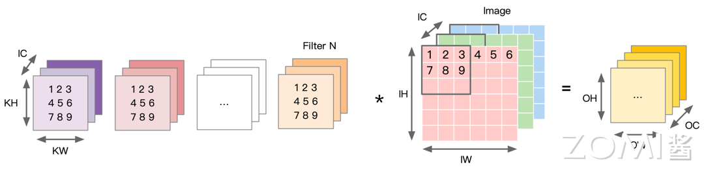
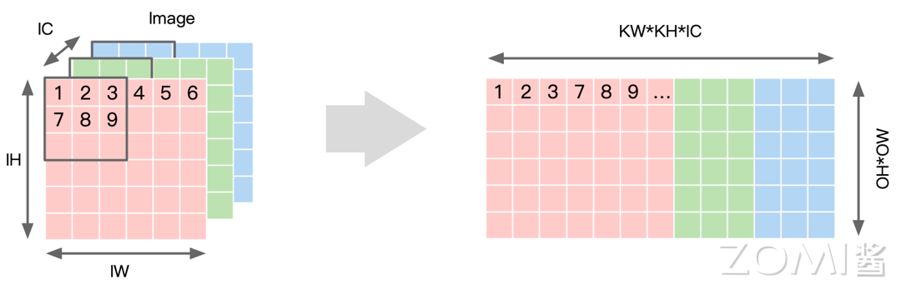
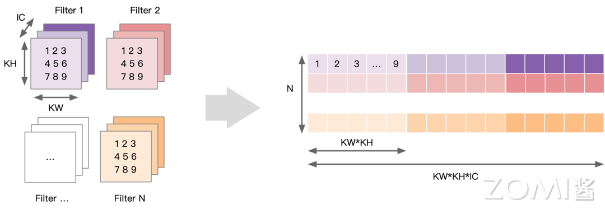
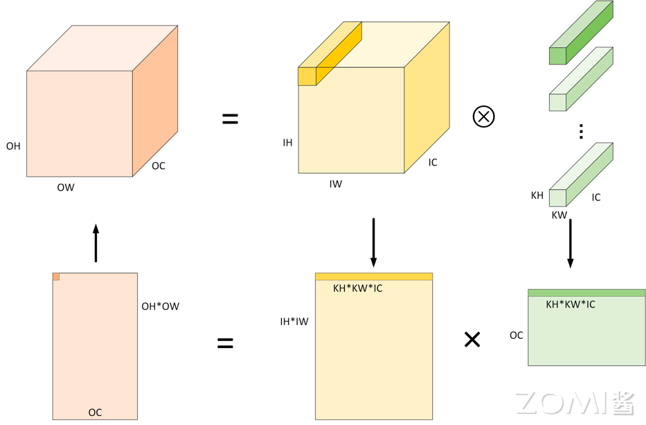
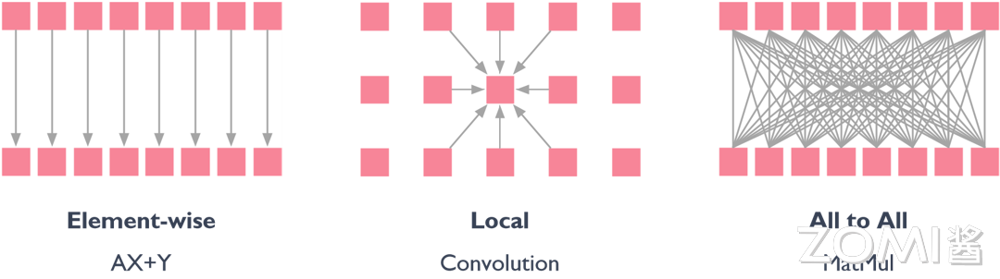
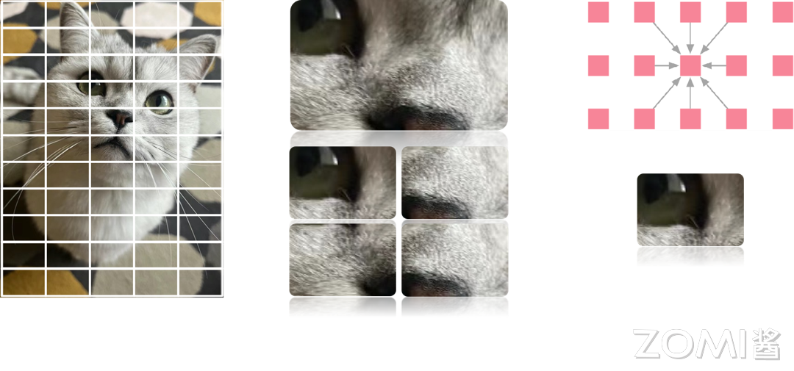
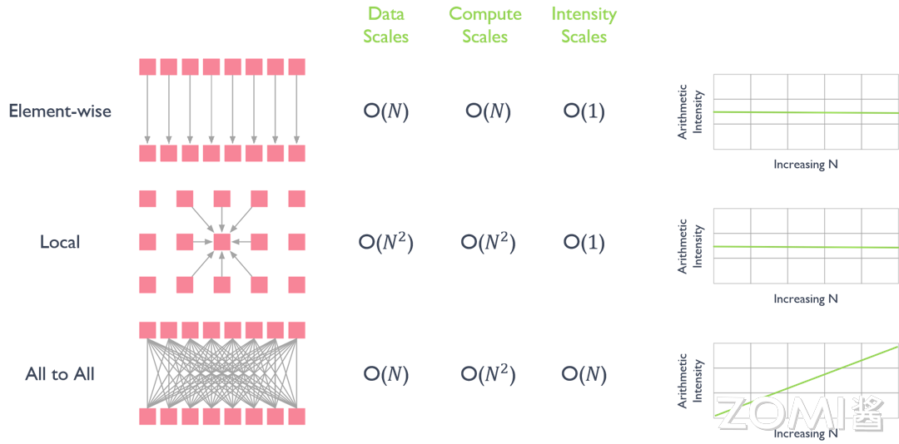
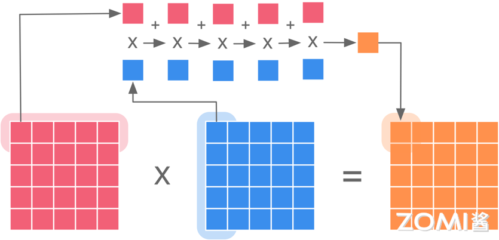
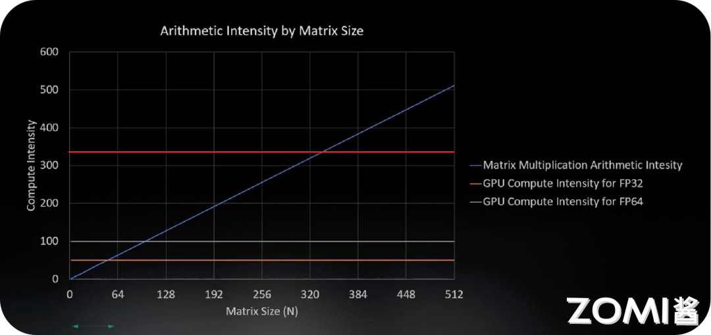
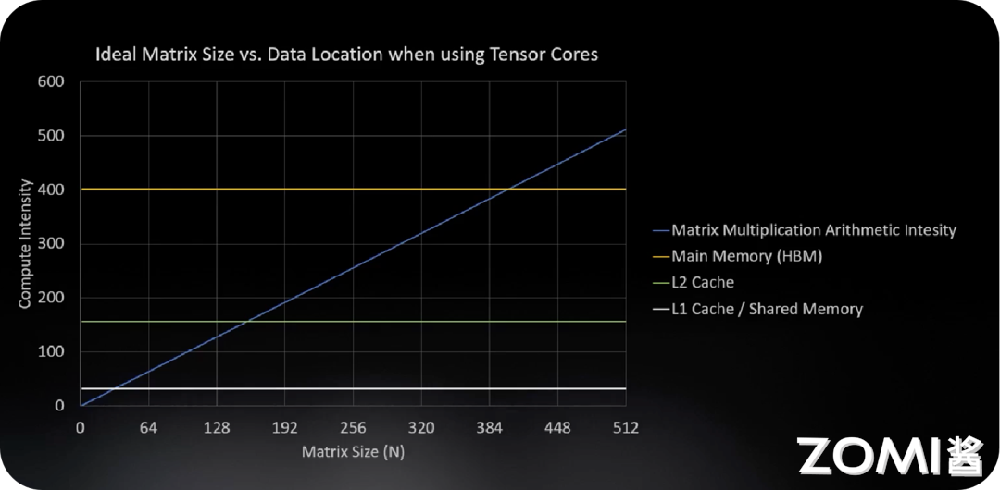

<!--Copyright 适用于[License](https://github.com/chenzomi12/AISystem)版权许可-->

# 为什么 GPU 适用于 AI(DONE)

为什么 GPU 适用于 AI 计算或者为什么 AI 训练需要使用 GPU，而不是使用 CPU 呢？本节内容主要探究 GPU AI 编程的本质，首先回顾卷积计算是如何实现的，然后探究 GPU 的线程分级，分析 AI 的计算模式和线程之间的关系，最后讨论矩阵乘计算如何使用 GPU 编程去提升算力利用率或者提升算法利用率。

## Conv 卷积计算

在推理引擎章节中已经详细讲解了卷积计算，本节简单回顾卷积计算的基本原理。卷积运算是深度学习中常用的操作之一，用于处理图像、音频等数据。简而言之，卷积运算是将一个函数与另一个函数经过翻转和平移后的结果进行积分。在深度学习中，卷积运算可以用来提取输入数据中的特征。

具体而言，对于输入数据 $X$ 和卷积核 $K$，卷积运算可以通过以下公式表示：

$$Y[i,j] = \sum_{m}\sum_{n} X[i+m, j+n] \cdot K[m,n]$$

其中，$Y$ 是卷积后的输出数据，$X$ 是输入数据，$K$ 是卷积核，$i$ 和 $j$ 是输出数据的索引，$m$ 和 $n$ 是卷积核的索引。通过卷积运算，可以提取输入数据中的特征，例如边缘、纹理等，从而帮助神经网络学习更复杂的特征。在深度学习中，卷积运算通常与激活函数和池化操作结合使用，构成卷积神经网络（CNN），用于图像识别、目标检测等任务。

图像卷积正常的三通道卷积，输入维度为 3 维（H, W, 3），卷积核维度为（N, C, KH, KW），输出维度为（N, H, W），卷积默认采用数据排布方式为 NHWC，输入维度为 4 维（N, IH, IW, IC），卷积核维度为（OC, KH, KW, IC），输出维度为（N, OH, OW, OC）。卷积计算的一般方式是计算卷积核模板（kernel）和卷积图片，卷积核中每一个元素与图片中的每一个元素依次相乘再相加后得到最终输出为特征图（feature map）。

以 Img2col 算法为例，Img2col 是一种常用的图像处理技术，用于在卷积神经网络（CNN）中进行卷积运算。它将输入的图像数据重塑成一个矩阵，使得卷积运算可以转换为矩阵乘法的形式，从而提高计算效率。具体来说，Img2col 的过程如下：

- 将输入的图像数据按照卷积核的大小和步长进行切片，形成若干个小的图像块；

- 将每个图像块展开成一列，并将所有列拼接在一起，形成一个大的矩阵。

通过这种方式，原始的图像数据被重塑成一个二维矩阵，其中每一列对应于卷积核在输入图像上滑动时所覆盖的区域。行数对应输出 $OH*OW$ 个数，每个行向量中，先排列计算一个输出点所需要输入上第一个通道的 $KH*KW$ 个数据，再按照次序排列之后的通道，直到第 IC 个通道。在实际应用中，Img2col 通常与矩阵乘法库（如 BLAS）结合使用，以便利用高效的矩阵乘法实现卷积运算，这种技术在提高卷积神经网络的计算效率和加速训练过程中起着重要作用。

对权重数据进行重排，即以卷积核大小为步长展开后续卷积窗并存在矩阵下一列。将 N 个卷积核展开为权重矩阵的一行，因此共有 N 行，每个向量上先排列第一个输入通道上 KH*KW 数据，再依次排列之后的通道直到 IC。

在对图像输入数据和权重数据进行重排之后，可以将卷积运算操作转换为矩阵相乘。将输入数据按照卷积窗进行展开并存储在矩阵的列中，多个输入通道对应的卷积窗展开之后将拼接成最终输出矩阵的一列。

通过数据重排，完成 Img2col 的操作之后会得到一个输入矩阵，卷积的权重也可以转换为一个矩阵，卷积的计算就可以转换为两个矩阵相乘的求解，得到最终卷积计算的结果，因此 AI 计算的本质是矩阵相乘。

## GPU 线程分级

在 AI 计算模式中，不是所有的计算都可以是线程独立的。计算中数据结构元素之间的对应关系有以下三种：

- 1）Element-wise（逐元素）：逐元素操作是指对数据结构中的每个元素独立执行操作。这意味着操作应用于输入数据结构中对应元素的每一对，以生成输出数据结构。例如，对两个向量进行逐元素相加或相乘就是将对应元素相加或相乘，得到一个新的向量。 

- 2）Local（局部）：局部操作是指仅针对数据的特定子集执行的操作，而不考虑整个数据结构。这些操作通常涉及局部区域或元素的计算。例如，对图像的卷积运算中元素之间是有交互的，因为它仅影响该区域内的像素值，计算一个元素往往需要周边的元素参与配合。 

- 3）All to All（全对全）：全对全操作是指数据结构中的每个元素与同一数据结构或不同数据结构中的每个其他元素进行交互的操作。这意味着所有可能的元素对之间进行信息交换，产生完全连接的通信模式，一个元素的求解得到另一个数据时数据之间的交换并不能够做到完全的线程独立。全对全操作通常用于并行计算和通信算法中，其中需要在所有处理单元之间交换数据。 

以卷积运算为例解释在卷积运算中局部内存数据如何与线程分层分级配合工作的，以下是处理一个猫的图像数据，基本过程如下：

- 1）用网格（grid）覆盖图片，将图片切割成多个块（block）；
- 2）取出其中的一个块进行处理，同样也可以将这个块再进行分割；
- 3）块中线程（Threads）通过本地数据共享来进行计算，每个像素点都会单独分配一个线程进行计算。

因此可以将大的网格表示为所有需要执行的任务，小的切分网格中包含了很多相同线程数量的块，块中的线程数独立执行，可以通过本地数据共享实现同步数据交换。

前面的章节讲到 GPU 的并行能力是最重要的，并行是为了解决带宽的时延问题，而计算所需要的线程数量是由计算复杂度决定的，结合不同数据结构对数据并行的影响：

- 1）逐元素（Element-wise）每增加一个线程意味着需要对数据进行新一次加载，由于在 GPU 中线程是并行的，因此增加线程的数量并不能对实际运算的时延产生影响，数据规模在合理范围内增大并不会影响实际算法的效率。

- 2）局部（Local）数据结构在进行卷积这类运算时由于线程是分级且并行的，因此每增加一个线程对于数据的读取不会有较大影响，此时 GPU 的执行效率与 AI 的计算模式之间实现了很好的匹配，计算强度为 O(1)。

- 3）全对全（All to All）一个元素的求解得到另一个数据时数据之间的交换并不能够做到完全的线程独立，此时计算强度会随着计算规模的增加线性增加，All to All 操作通常需要进行大量的数据交换和通信。

## 计算强度

由于 AI 计算可以看作是矩阵相乘，两个矩阵相乘得到一个新的矩阵。假设有两个矩阵 $A$ 和 $B$，它们的维度分别为 $m \times n$ 和 $n \times p$，则它们可以相乘得到一个新的矩阵 $C$，其维度为 $m \times p$。矩阵相乘的前提是第一个矩阵的列数等于第二个矩阵的行数，即 $n$ 的取值必须相等。具体的计算方法是，对于 $C$ 中的第 $i$ 行第 $j$ 列的元素 $c_{ij}$，其计算公式为：

$$c_{ij} = \sum_{k=1}^{n} a_{ik} \cdot b_{kj}$$

其中，$a_{ik}$ 是矩阵 $A$ 中第 $i$ 行第 $k$ 列的元素，$b_{kj}$ 是矩阵 $B$ 中第 $k$ 行第 $j$ 列的元素。通过对所有可能的 $k$ 值求和，可以得到 $C$ 中的每一个元素。

计算强度（Arithmetic Intensity）是指在执行计算任务时所需的算术运算量与数据传输量之比。它是衡量计算任务的计算密集程度的重要指标，可以帮助评估算法在不同硬件上的性能表现。通过计算强度，可以更好地理解计算任务的特性，有助于选择合适的优化策略和硬件配置，以提高计算任务的性能表现。计算强度的公式如下：

$$\text{计算强度} = \frac{\text{算术运算量}}{\text{数据传输量}}$$

其中，算术运算量是指执行计算任务所需的浮点运算次数，数据传输量是指从内存读取数据或将数据写入内存的数据传输量。计算强度的值可以用来描述计算任务对计算和数据传输之间的依赖关系：

-  高计算强度：当计算强度较高时，意味着算术运算量较大，计算操作占据主导地位，相对较少的时间用于数据传输。在这种情况下，性能优化的重点通常是提高计算效率，如优化算法、并行计算等。 

-  低计算强度：当计算强度较低时，意味着数据传输量较大，数据传输成为性能瓶颈。在这种情况下，性能优化的关键是减少数据传输、优化数据访问模式等。

对于一个 $N \times N$ 矩阵乘法操作，可以计算其计算强度（Arithmetic Intensity）。

1.  **算术运算量**：对于两个 $N \times N$ 的矩阵相乘，总共需要进行 $N^3$ 次乘法和 $N^2(N-1)$ 次加法运算。因此，总的算术运算量为 $2N^3 - N^2$。 

2.  **数据传输量**：在矩阵乘法中，需要从内存中读取两个输入矩阵和将结果矩阵写回内存。假设每个矩阵元素占据一个单位大小的内存空间，则数据传输量可以估计为 $3N^2$，包括读取两个输入矩阵和写入结果矩阵。 

因此，矩阵乘法的计算强度可以计算为：

$$\text{Arithmetic Intensity} = \frac{2N^3 - N^2}{3N^2}≈O(N)$$

因此矩阵乘法的计算强度用时间复杂度表示为 $O(N)$，随着相乘的两个矩阵的维度增大，算力的需求将不断提高，需要搬运的数据量也将越大，算术强度也随之增大。

计算强度和矩阵维度的大小密切相关，图中蓝线表示矩阵乘法的算术强度随着矩阵的大小增大线性增加，橙色的线表示 GPU FP32 浮点运算的计算强度，橙色线与蓝色线的交点表示当计算单元充分发挥计算能力时矩阵的大小约为 50，此时满足整个 GPU FP32 的计算强度，实现理想情况下计算和搬运数据之间的平衡。

当矩阵大小不断增加时，GPU 中的内存会空闲下来（内存搬运越来越慢导致内存刷新变慢），GPU 需要花费更多的时间执行矩阵计算，因此 AI 计算需要找到一个更好的平衡点去匹配更大的矩阵计算和计算强度。

图中红色的线是 NVIDIA GPU 采用 Tensor Core 专门对矩阵进行计算，很大程度上提高了计算强度，使得内存的搬运能够跟得上数据运算的速度，更好地平衡了矩阵维度和计算强度之间的关系。

> FP32 和 FP64
> 
> GPU 计算中的 FP32 和 FP64 分别代表单精度浮点运算和双精度浮点运算，主要区别在于精度和计算速度。FP32 使用 32 位存储单精度浮点数，提供较高的计算速度，但在处理非常大或非常小的数字时可能存在精度损失。相比之下，FP64 使用 64 位存储双精度浮点数，提供更高的精度，但计算速度通常较慢。
> 
> 在实际应用中，选择 FP32 还是 FP64 取决于任务的需求。如果任务对精度要求不高并且需要较高的计算速度，则可以选择 FP32。但如果任务对精度要求非常高，则需要选择 FP64，尽管计算速度可能会受到影响。

在新增了 Tensor Core 之后对不同存储和传输的带宽和计算强度进行比较，采用 L1 缓存的计算强度为 32，采用 L2 缓存的计算强度是 156，因此需要考虑如何搭配多级缓存和 Tensor Core(张量核心)，使得张量核心在小矩阵或大矩阵计算中都能够更高效地执行运算。

| Data Location | Bandwidth(GB/sec) | Compute Intensity | Tensor Core |
| --- | --- | --- | --- |
| L1 Cache | 19,400 | 8 | 32 |
| L2 Cache | 4,000 | 39 | 156 |
| HBM | 1,555 | 100 | 401 |
| NVLink | 300 | 520 | 2080 |
| PCIe | 25 | 6240 | 24960 |

> 张量核心（Tensor core）
> 
> Tensor Core 是 NVIDIA 推出专门用于深度学习和人工智能计算的硬件单元。Tensor Core 的设计旨在加速矩阵乘法运算，这在深度学习中是非常常见的计算操作。Tensor Core 主要有以下特点和优势：
> 
> 1. 并行计算能力：Tensor Core 能够同时处理多个矩阵乘法运算，从而大幅提高计算效率。
> 
> 2. 混合精度计算：Tensor Core 支持混合精度计算，即同时使用浮点 16 位（half-precision）和浮点 32 位（single-precision）数据类型进行计算，以在保证计算精度的同时提高计算速度。
> 
> 3. 高性能计算：Tensor Core 具有非常高的计算性能，能够快速处理大规模的深度学习模型和数据集。
> 
> 4. 节能优势：由于其高效的并行计算和混合精度计算能力，Tensor Core 在相同计算任务下通常能够比传统的计算单元更节能。
> 
> Tensor Core 的出现极大地加速了深度学习和人工智能计算的速度和效率，使得训练和推理过程更加快速和高效。已经被广泛应用于深度学习框架如 TensorFlow、PyTorch 等中，为用户提供了更好的计算体验。

当 Tensor Core 在 L1 缓存、L2 缓存和 HBM 存储位置的不同将影响理想计算强度下矩阵的维度大小，每种存储和矩阵的计算强度分别对应一个交叉点，由此可以看出数据在什么类型的存储中尤为重要，相比较 FP32 和 FP64 对计算强度的影响更为重要。当数据搬运到 L1 缓存中时可以进行一些更小规模的矩阵运算，比如卷积运算，对于 NLP（Natural Language Processing）中使用的 transformer 结构，可以将数据搬运到 L2 缓存进行计算。因为数据运算和读取存在比例关系，如果数据都在搬运此时计算只能等待，导致二者不平衡，因此找到计算强度和矩阵大小的平衡点对于 AI 计算系统的优化尤为重要。

> NLP transformer 模型
> 
> - NLP transformer 是一种基于 transformer 架构的自然语言处理模型。它是由谷歌研究团队提出的一种革命性的模型，被证明在处理自然语言任务中取得了很大的成功。
> 
> - 核心是自注意力机制（self-attention mechanism），能够在输入序列中建立全局依赖关系的机制。通过自注意力机制，模型能够同时考虑输入序列中所有位置之间的关系，而不是像传统的循环神经网络（RNN）或卷积神经网络（CNN）一样逐步处理序列。
> 
> - 通常由多个编码器（encoder）和解码器（decoder）层组成。编码器用于将输入序列转换为隐藏表示，解码器则用于生成输出序列。每个编码器和解码器层都包含多头自注意力机制和前馈神经网络。通过堆叠多个这样的层，模型可以学习更复杂的语言模式和语义信息。

## 小结与思考

- GPU 的并行处理能力强，适合执行深度学习中的卷积运算，这些运算本质上是大规模的矩阵乘法，而 GPU 专为这类任务优化。

- GPU 的线程分级结构能够与 AI 计算中的不同数据结构对应关系相匹配，通过线程超配和 Warp 执行单元来提高计算效率并掩盖内存延迟。

- 计算强度是衡量 AI 计算性能的关键指标，GPU 通过优化计算强度，如引入 Tensor Core，来提升 AI 计算中矩阵乘法的性能，实现计算与数据传输之间的有效平衡。

## 本节视频

<html>
<iframe src="https://player.bilibili.com/player.html?aid=952580098&bvid=BV1Ms4y1N7RL&cid=1098199716&page=1&as_wide=1&high_quality=1&danmaku=0&t=30&autoplay=0" width="100%" height="500" scrolling="no" border="0" frameborder="no" framespacing="0" allowfullscreen="true"> </iframe>
</html>
