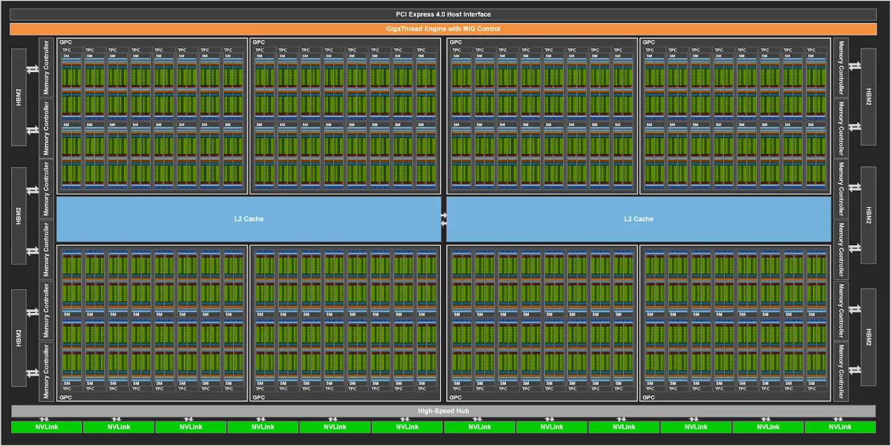
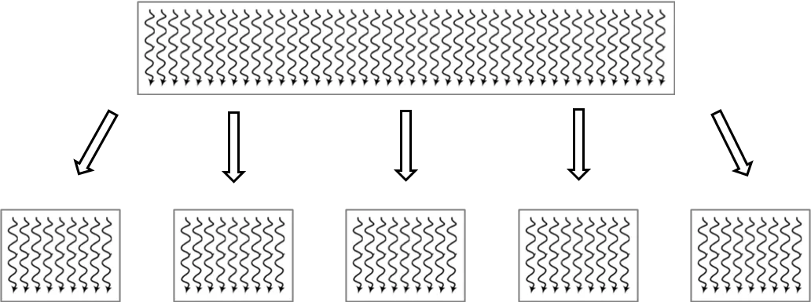
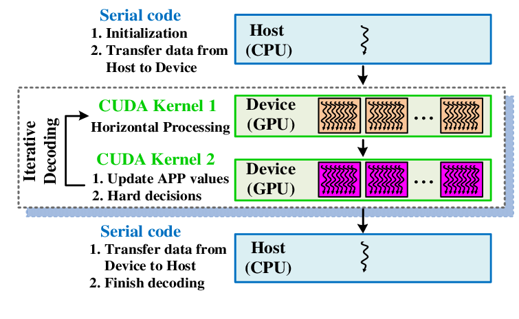

# GPU架构与CUDA关系

本节会讲解NVIDIA GPU硬件的基础概念，其次会讲解CUDA（Compute Unified Device Architecture）并行计算平台和编程模型，详细讲解CUDA线程层次结构，最后将讲解GPU的算力是如何计算的，这将有助于计算大模型的算力峰值和算力利用率。

## NVIDIA GPU硬件基础概念

A100 GPU架构中GPC（Graphic Processing Cluster）表示图像处理簇，一共有8个。共有两个L2 Cache并且可以互相实现数据同步，通过Memory Controller实现与高带宽存储器HBM2（High Bandwidth Memory）进行数据交换。



每个GPC中包含TPC（Texture processing cluster）表示纹理处理簇，每个处理簇被分为多个SM（Streaming Multiprocessors）流处理器，SM中包含多个CUDA core和Tensor Core，用于处理图形图形和AI张量计算。


SM（Streaming Multiprocessors）称作流式多处理器，核心组件包括CUDA核心、共享内存、寄存器等。SM包含很多为线程执行数学运算的core，是英伟达GPU的核心，在CUDA中可以执行数百个线程、一个block上线程放在同一个SM上执行，一个SM有限的Cache制约了每个block的线程数量。


SM主要组成如表所示，以英伟达GP 100为例，一共有64个CUDA Core，Register File存储大小为256 KB，Shared Memory内存大小为64 KB，Active Thread总线程数量是2048，Active Block数量是32，Active Grid数量是8。

| CUDA Core | 向量运算单元 | FP32-FPU、FP64-DPU、INT32-ALU |
| --- | --- | --- |
| Tensor Core | 张量运算单元 | FP16、BF16、INT8、INT4 |
| Special Function Units | 特殊函数单元 | 超越函数和数学函数，例如反平方根、正余弦等 |
| Warp Scheduler | 线程束调度器 | XX Thread/clock |
| Dispatch Unit | 指令分发单元 | XX Thread/clock |
| Multi Level Cache | 多级缓存 | L0/L1 Instruction Cache、L1 Data Cache & Shared Memory |
| Register File | 寄存器堆 |  |
| Load/Store | 访问存储单元 | LD/ST，负责数据处理 |

SP（Streaming Processor）流处理器是最基本的处理单元，最后线程具体的指令和任务都是在SP上进行处理的，GPU在进行并行计算时就是很多个SP同时处理。在Fermi架构之后，SP被改称为CUDA Core，通过 CUDA 来控制具体的指令执行。


在Fermi架构中，通过CUDA来控制具体的指令执行，是最小的运算执行单元。所以对于现在的NVIDIA GPU架构来讲，流处理器的数量就是CUDA Core的数量。一个SM中包含了2组各16个CUDA Core，每个CUDA Core包含了一个整数运算单元ALU（Arthmetic Logit Unit）和一个浮点运算单元FPU（Floating Point Unit）。


Volta架构取消CUDA core，变为单独的FP32 FPU和INT32 ALU，因为FP32:INT32是1:1的关系，因此还是可以将它们合并起来一起称为原来的CUDA Core，这样做的好处是每个SM现在支持FP32和INT32的并发执行，同时新增了光线追踪RT Core。


Warp是线程束，逻辑上所有Thread并行执行，但是从硬件的角度讲并不是所有的Thread能够在同一时刻执行，因此引入Warp。Warp是SM基本执行单元，一个Warp包含32个并行Thread（warp_size=32），这32个Thread执行SIMT（Single Instruction Multiple Thread）指令模式。

也就是说，所有的Thread以锁步的方式执行同一条指令，但是每个Thread会使用各自的Data执行指令分支。如果在Warp中没有32个Thread需要工作，那么Warp虽然还是作为一个整体运行，但这部分Thread是处于非激活状态。此外，Thread是最小的逻辑单位，Warp是硬件执行单位。

## CUDA基本概念

2006年11月，NVIDIA推出CUDA（Compute Unified Device Architecture），通用并行计算架构（Parallel Computing Architecture）和编程模型（Programming Model），利用GPU的并行处理能力，将GPU用作通用并行计算设备，以加速各种计算任务，而不仅限于图形处理。

CUDA编程模型允许开发人员在GPU上运行并行计算任务，基于LLVM构建了CUDA编译器，开发人员可以使用CUDA C/C++语言编写并行程序，通过调用CUDA API将计算任务发送到GPU执行。CUDA编程模型包括主机（CPU）和设备（GPU）之间的协作，此外还提供了对其它编程语言的支持，比如C/C++，Python，Fortran等语言，支持OpenCL和DirectCompute等应用程序接口。


CUDA在软件方面由一个CUDA库、一个应用程序编程接口（API）及其运行库（Runtime）、两个较高级别的通用数学库，即CUFFT和CUBLAS组成。CUDA TOOLKIT包括编译和C++核，CUDA DRIVER驱动GPU负责内存和图像管理。CUDA-X LIBRARIES主要提供了机器学习（Meachine Learning）、深度学习（Deep Learning）和高性能（High Performance Computing）计算方面的加速库，APPS & FRAMEWORKS主要对接Tensorflow和Pytorch等框架。


## CUDA线程层次结构

CUDA最基本的执行单位是线程（Thread），图中每条曲线可视为单个线程，大的网格（Grid）被切分成小的网格，其中包含了很多相同线程数量的块（Block），每个块中的线程独立执行，可以通过本地数据共享实现数据交换同步。因此对于CUDA来讲，就可以将问题划分为独立线程块，并行解决的子问题，子问题划分为可以由块内线程并行协作解决。



CUDA引入主机端（host）和设备（device）概念，CUDA程序中既包含主机（host）程序也包含设备（device）程序，host和device之间可以进行通信，以此来实现数据拷贝，主机负责管理数据和控制程序流程，设备负责执行并行计算任务。在CUDA编程中，Kernel是在GPU上并行执行的函数，开发人员编写Kernel来描述并行计算任务，然后在主机上调用Kernel来在GPU上执行计算。



代码cuda_host.cpp是只使用CPU在host端实现两个矩阵的加法运算，其中在CPU上计算的kernel可看作是加法运算函数，代码中包含内存空间的分配和释放。

```cpp
#include <iostream>
#include <math.h>
#include <sys/time.h>

// function to add the elements of two arrays
void add(int n, float *x, float *y)
{
    for (int i = 0; i < n; i++)
        y[i] = x[i] + y[i];
}

int main(void)
{
    int N = 1<<25; // 30M elements

    float *x = new float[N];
    float *y = new float[N];

    // initialize x and y arrays on the host
    for (int i = 0; i < N; i++) {
        x[i] = 1.0f;
        y[i] = 2.0f;
    }

    struct timeval t1,t2;
    double timeuse;
    gettimeofday(&t1,NULL);

    // Run kernel on 30M elements on the CPU
    add(N, x, y);

    // Free memory
    delete [] x;
    delete [] y;

    return 0;
}
```

在CUDA程序架构中，host代码部分在CPU上执行，是普通的C代码。当遇到数据并行处理的部分，CUDA会将程序编译成GPU能执行的程序，并传送到GPU，这个程序在CUDA里称做核(kernel)。device 代码部分在 GPU 上执行，此代码部分在 kernel上编写(.cu文件)。

kernel用__global__符号声明，在调用时需要用<<<grid, block>>>来指定kernel要执行及结构。代码cuda_device.cu是使用CUDA编程实现GPU计算，代码涉及到host（CPU）和device（GPU）相关计算，使用__global__ 声明将add函数转变为GPU可执行的kernel。

```c
#include <iostream>
#include <math.h>

// Kernel function to add the elements of two arrays
// __global__ 变量声明符，作用是将add函数变成可以在GPU上运行的函数
// __global__ 函数被称为kernel
__global__
void add(int n, float *x, float *y)
{
  for (int i = 0; i < n; i++)
    y[i] = x[i] + y[i];
}

int main(void)
{
  int N = 1<<25;
  float *x, *y;

  // Allocate Unified Memory – accessible from CPU or GPU
  // 内存分配，在GPU或者CPU上统一分配内存
  cudaMallocManaged(&x, N*sizeof(float));
  cudaMallocManaged(&y, N*sizeof(float));

  // initialize x and y arrays on the host
  for (int i = 0; i < N; i++) {
    x[i] = 1.0f;
    y[i] = 2.0f;
  }

  // Run kernel on 1M elements on the GPU
  // execution configuration, 执行配置
  add<<<1, 1>>>(N, x, y);

  // Wait for GPU to finish before accessing on host
  // CPU需要等待cuda上的代码运行完毕，才能对数据进行读取
  cudaDeviceSynchronize();

  // Free memory
  cudaFree(x);
  cudaFree(y);
  
  return 0;
}
```

因此CUDA编程流程总结为：

- 编写Kernel函数描述并行计算任务。

- 在主机上配置线程块和网格，将Kernel发送到GPU执行。

- 在主机上处理数据传输和结果处理，以及控制程序流程。

为了实现以上并行计算，对应于GPU硬件在进行实际计算过程时，CUDA可以分为Grid，Block和Thread三个层次结构：

- 线程层次结构Ⅰ-Grid：kernel在device上执行时，实际上是启动很多线程，一个kernel所启动的所有线程称为一个网格（grid），同一个网格上的线程共享相同的全局内存空间，grid是线程结构的第一层次。

- 线程层次结构Ⅱ-Block：Grid分为多个线程块（block），一个block里面包含很多线程，Block之间并行执行，并且无法通信，也没有执行顺序，每个block包含共享内存（shared memory），可以共享里面的Thread。

- 线程层次结Ⅲ-Thread：CUDA并行程序实际上会被多个threads执行，多个threads会被群组成一个线程block，同一个block中threads可以同步，也可以通过shared memory通信。


因此CUDA和NVIDIA硬件架构有以下对应关系，从软件侧看到的是线程的执行，对应于硬件上的CUDA Core，每个线程对应于CUDA Core，软件方面线程数量是超配的，硬件上CUDA Core是固定数量的。Block线程块只在一个SM上通过Warp进行调度，一旦在SM上调用了Block线程块，就会一直保留到执行完kernel，SM可以同时保存多个Block线程块，多个SM组成的TPC和GPC硬件实现了GPU并行计算。


## 算力峰值计算

GPU的算力峰值是指GPU在理想情况下能够达到的最大计算能力，通常以浮点运算每秒（FLOPS）为单位进行衡量，GFLOPS（每秒十亿次浮点运算），TFLOPS（每秒万亿次浮点运算）。计算GPU的算力峰值可以帮助开发人员了解其在理论上的最大性能，并进行性能预测和优化，更好地评估大模型训练过程中的算力利用率。

GPU的算力峰值通常由以下几个因素决定：

- CUDA核心数量：每个CUDA核心可以执行一个线程，GPU的算力峰值与CUDA核心数量成正比。

- 核心频率：GPU的核心频率越高，每个核心每秒钟能够执行的指令数就越多。

- 每个核心的计算能力：不同型号的GPU具有不同的计算能力，通常以每个核心每个时钟周期能够执行的浮点指令数（FLOPS）为单位进行衡量。

- 并行度：GPU的并行度决定了其能够同时执行的线程数量，从而影响了算力峰值。

计算GPU的算力峰值可以使用以下公式：

$$\text{Peak FLOPS} = F_{\text{clk}} \times N_{\text{SM}} \times F_{\text{req}}$$

其中，

- $F_{\text{clk}}$：GPU 时钟周期内指令执行数 (FLOPS/Cycle)
- $N_{\text{SM}}$：SM（Streaming Multiprocessor）数量
- $F_{\text{req}}$：Tensor Core 核心运行频率(GHz)

以NVIDIA A100为例，其中 FP32 Tensor Core 指令吞吐 64 FLOPS/Cycle ，核心运行频率为 1.41GHz ，SM 数量为108 ，因此GPU的算力峰值是，19,491 GFLOPS，大约为1.95 TFLOPS：

$$Peak FLOPS=1.41∗108∗64∗2=19,491 GFLOPS$$

| NVIDIA A100 GPU算力峰值 |  |
| --- | --- |
| Peak FP641 | 9.7 TFOPS |
| Peak FP64 Tensor Core1 | 19.5 TFOPS |
| Peak FP321 | 19.5 TFOPS |
| Peak FP161 | 78 TFOPS |
| Peak BF161 | 39 TFOPS |
| Peak FP32 Tensor Core1 | 156 TFOPS  &#124; 312 TFOPS2 |
| Peak FP16 Tensor Core1 | 312 TFOPS  &#124; 624 TFOPS2 |
| Peak BF16 Tensor Core1 | 312 TFOPS  &#124; 624 TFOPS2 |
| Peak INT8 Tensor Core1 | 624 TFOPS  &#124; 1,248 TFOPS2 |
| Peak INT4 Tensor Core1 | 1,248 TFOPS  &#124; 2,496 TFOPS2 |
| 1 - Peak rates are based on GPU Boost Clock.|  |
|2 - Effective TFLOPS/TOPS using the new Sparsity feature |  |


## 总结

本节主要对NVIDIA GPU硬件相关的基础概念进行了讲解，以A100 GPU为例，GPU架构包括GPC（图形处理簇，Graphics Processing Clusters）、GPC包含TPC（纹理处理簇，Texture Processing Clusters）、TPC包含SM（流多处理器，Stream Multiprocessors），SM又包含SP（流处理器，Streaming Processor，在Fermi架构之后，SP被改称为CUDA Core），Wrap是GPU执行程序时的调度单位，SM的基本执行单元。

CUDA提出的通用并行计算架构和编程模型将GPU用作通用并行计算设备，加速各种计算任务，CUDA编程模型包括主机（CPU）和设备（GPU）之间的协作，支持多种编程语言，在软件方面由CUDA库、应用程序编程接口（API）及其运行库（Runtime）和通用数学库构成。

CUDA利用Grid，Block和Thread三个线程层次结构，将并行计算任务分为多个线程，这些线程被组织为块，块可以进一步组织为网格，每个线程都可以独立执行计算任务。在CUDA编程中，Kernel是在GPU上并行执行的函数，开发人员编写Kernel来描述并行计算任务，然后在主机上调用Kernel来在GPU上执行计算。软件方面的线程Thread对应硬件CUDA Core，Thread Block对应硬件SM，多个Block组成的Grid组成了TPC和GPC硬件，从而实现了并行计算。

GPU的算力峰值与CUDA核心数量、核心频率、每个核心的计算能力和并行度相关，计算GPU的算力峰值可以帮助开发人员了解其在理论上的最大性能，并进行性能预测和优化。


## 本节视频

<html>
<iframe src="https://player.bilibili.com/player.html?aid=740259727&bvid=BV1Kk4y1Y7op&cid=1105214991&page=1&as_wide=1&high_quality=1&danmaku=0&t=30&autoplay=0" width="100%" height="500" scrolling="no" border="0" frameborder="no" framespacing="0" allowfullscreen="true"> </iframe>
</html>
