<!--Copyright 适用于[License](https://github.com/chenzomi12/AISystem)版权许可-->

# GPU 架构与 CUDA 关系

本节会讲解英伟达 GPU 硬件的基础概念，其次会讲解 CUDA（Compute Unified Device Architecture）并行计算平台和编程模型，详细讲解 CUDA 线程层次结构，最后将讲解 GPU 的算力是如何计算的，这将有助于计算大模型的算力峰值和算力利用率。

## GPU 硬件基础概念

A100 GPU 架构中 GPC（Graphic Processing Cluster）表示图像处理簇，一共有 8 个。共有两个 L2 Cache 并且可以互相实现数据同步，通过 Memory Controller 实现与高带宽存储器 HBM2（High Bandwidth Memory）进行数据交换。

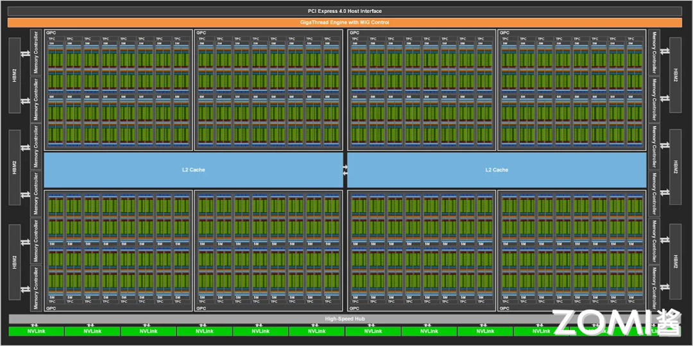

每个 GPC 中包含 TPC（Texture processing cluster）表示纹理处理簇，每个处理簇被分为多个 SM（Streaming Multiprocessors）流处理器，SM 中包含多个 CUDA Core 和 Tensor Core，用于处理图形和 AI 张量计算。

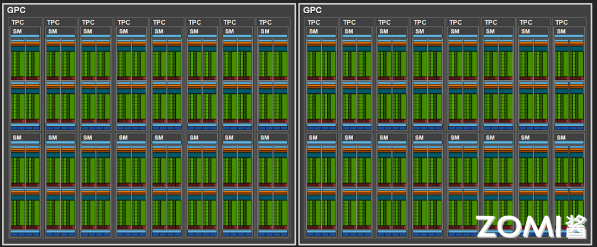

SM（Streaming Multiprocessors）称作流式多处理器，核心组件包括 CUDA 核心、共享内存、寄存器等。SM 包含很多为线程执行数学运算的 core，是英伟达 GPU 的核心，在 CUDA 中可以执行数百个线程、一个 block 上线程放在同一个 SM 上执行，一个 SM 有限的 Cache 制约了每个 block 的线程数量。

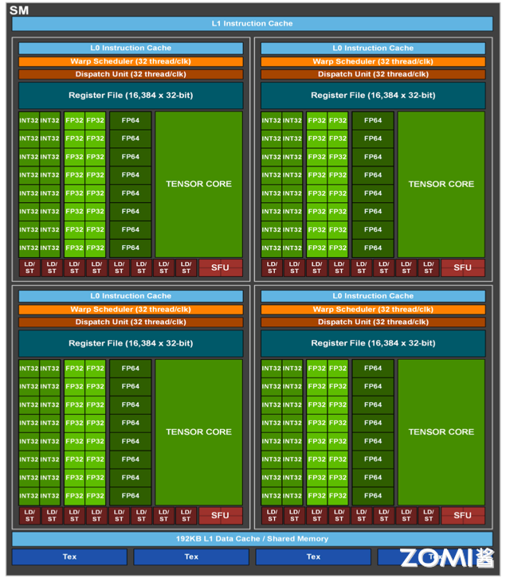

SM 主要组成如表所示，以英伟达 GP 100 为例，一共有 64 个 CUDA Core，Register File 存储大小为 256 KB，Shared Memory 内存大小为 64 KB，Active Thread 总线程数量是 2048，Active Block 数量是 32，Active Grid 数量是 8。

| CUDA Core | 向量运算单元 | FP32-FPU、FP64-DPU、INT32-ALU |
| --- | --- | --- |
| Tensor Core | 张量运算单元 | FP16、BF16、INT8、INT4 |
| Special Function Units | 特殊函数单元 | 超越函数和数学函数，例如反平方根、正余弦等 |
| Warp Scheduler | 线程束调度器 | XX Thread/clock |
| Dispatch Unit | 指令分发单元 | XX Thread/clock |
| Multi Level Cache | 多级缓存 | L0/L1 Instruction Cache、L1 Data Cache & Shared Memory |
| Register File | 寄存器堆 |  |
| Load/Store | 访问存储单元 | LD/ST，负责数据处理 |

SP（Streaming Processor）流处理器是最基本的处理单元，最后线程具体的指令和任务都是在 SP 上进行处理的，GPU 在进行并行计算时就是很多个 SP 同时处理。在 Fermi 架构之后，SP 被改称为 CUDA Core，通过 CUDA 来控制具体的指令执行。

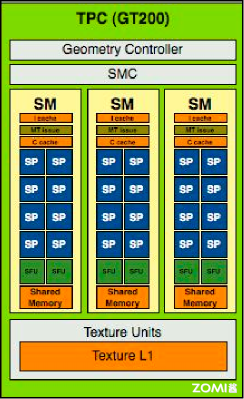

在 Fermi 架构中，通过 CUDA 来控制具体的指令执行，是最小的运算执行单元。所以对于现在的英伟达 GPU 架构来讲，流处理器的数量就是 CUDA Core 的数量。一个 SM 中包含了 2 组各 16 个 CUDA Core，每个 CUDA Core 包含了一个整数运算单元 ALU（Arthmetic Logit Unit）和一个浮点运算单元 FPU（Floating Point Unit）。

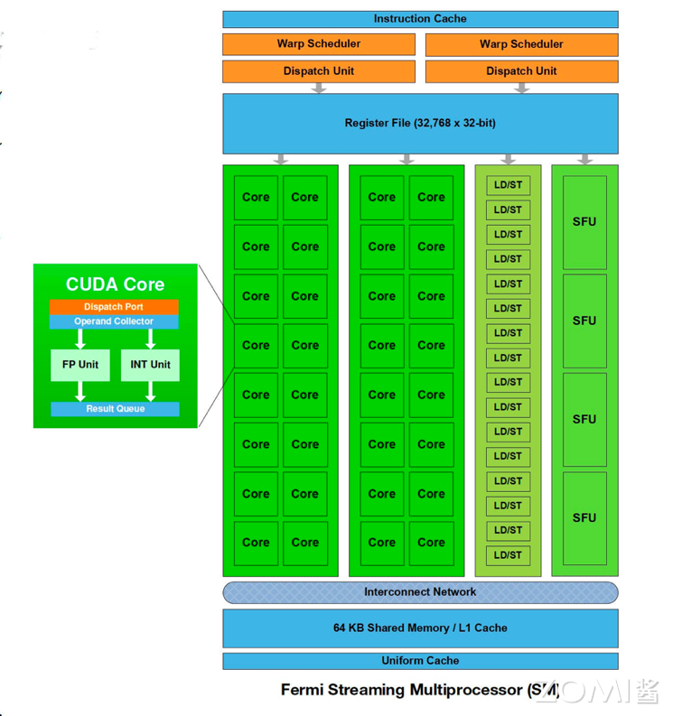

Volta 架构取消 CUDA core，变为单独的 FP32 FPU 和 INT32 ALU，因为 FP32:INT32 是 1:1 的关系，因此还是可以将它们合并起来一起称为原来的 CUDA Core，这样做的好处是每个 SM 现在支持 FP32 和 INT32 的并发执行，同时新增了光线追踪 RT Core。

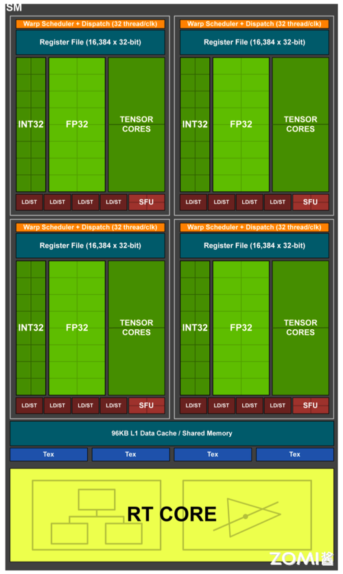

Warp 是线程束，逻辑上所有 Thread 并行执行，但是从硬件的角度讲并不是所有的 Thread 能够在同一时刻执行，因此引入 Warp。Warp 是 SM 基本执行单元，一个 Warp 包含 32 个并行 Thread（warp_size=32），这 32 个 Thread 执行 SIMT（Single Instruction Multiple Thread）指令模式。

也就是说，所有的 Thread 以锁步的方式执行同一条指令，但是每个 Thread 会使用各自的 Data 执行指令分支。如果在 Warp 中没有 32 个 Thread 需要工作，那么 Warp 虽然还是作为一个整体运行，但这部分 Thread 是处于非激活状态。此外，Thread 是最小的逻辑单位，Warp 是硬件执行单位。

## CUDA 基本概念

2006 年 11 月，英伟达推出 CUDA（Compute Unified Device Architecture），通用并行计算架构（Parallel Computing Architecture）和编程模型（Programming Model），利用 GPU 的并行处理能力，将 GPU 用作通用并行计算设备，以加速各种计算任务，而不仅限于图形处理。

CUDA 编程模型允许开发人员在 GPU 上运行并行计算任务，基于 LLVM 构建了 CUDA 编译器，开发人员可以使用 CUDA C/C++语言编写并行程序，通过调用 CUDA API 将计算任务发送到 GPU 执行。CUDA 编程模型包括主机（CPU）和设备（GPU）之间的协作，此外还提供了对其它编程语言的支持，比如 C/C++，Python，Fortran 等语言，支持 OpenCL 和 DirectCompute 等应用程序接口。

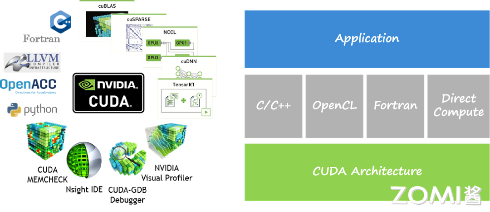

CUDA 在软件方面由一个 CUDA 库、一个应用程序编程接口（API）及其运行库（Runtime）、两个较高级别的通用数学库，即 CUFFT 和 CUBLAS 组成。CUDA TOOLKIT 包括编译和 C++核，CUDA DRIVER 驱动 GPU 负责内存和图像管理。CUDA-X LIBRARIES 主要提供了机器学习（Meachine Learning）、深度学习（Deep Learning）和高性能（High Performance Computing）计算方面的加速库，APPS & FRAMEWORKS 主要对接 TensorFlow 和 Pytorch 等框架。

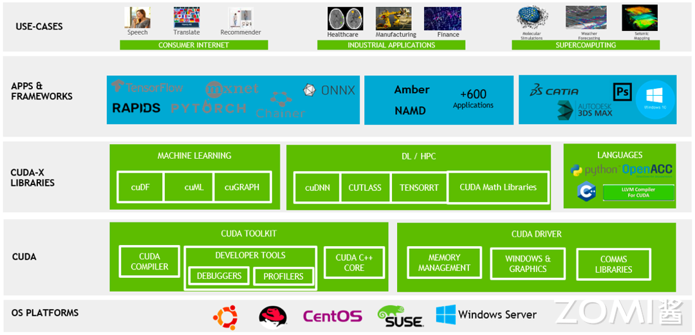

## CUDA 线程层次结构

CUDA 最基本的执行单位是线程（Thread），图中每条曲线可视为单个线程，大的网格（Grid）被切分成小的网格，其中包含了很多相同线程数量的块（Block），每个块中的线程独立执行，可以通过本地数据共享实现数据交换同步。因此对于 CUDA 来讲，就可以将问题划分为独立线程块，并行解决的子问题，子问题划分为可以由块内线程并行协作解决。

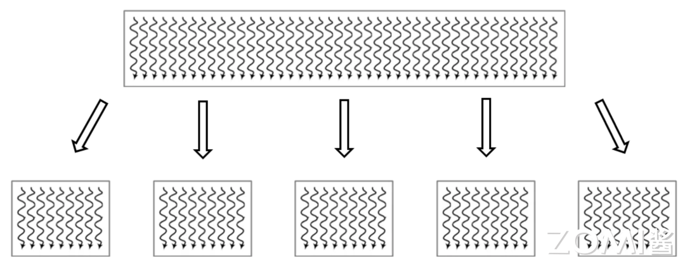

CUDA 引入主机端（host）和设备（device）概念，CUDA 程序中既包含主机（host）程序也包含设备（device）程序，host 和 device 之间可以进行通信，以此来实现数据拷贝，主机负责管理数据和控制程序流程，设备负责执行并行计算任务。在 CUDA 编程中，Kernel 是在 GPU 上并行执行的函数，开发人员编写 Kernel 来描述并行计算任务，然后在主机上调用 Kernel 来在 GPU 上执行计算。


代码 cuda_host.cpp 是只使用 CPU 在 host 端实现两个矩阵的加法运算，其中在 CPU 上计算的 kernel 可看作是加法运算函数，代码中包含内存空间的分配和释放。

```cpp
#include <iostream>
#include <math.h>
#include <sys/time.h>

// function to add the elements of two arrays
void add(int n, float *x, float *y)
{
    for (int i = 0; i < n; i++)
        y[i] = x[i] + y[i];
}

int main(void)
{
    int N = 1<<25; // 30M elements

    float *x = new float[N];
    float *y = new float[N];

    // initialize x and y arrays on the host
    for (int i = 0; i < N; i++) {
        x[i] = 1.0f;
        y[i] = 2.0f;
    }

    struct timeval t1,t2;
    double timeuse;
    gettimeofday(&t1,NULL);

    // Run kernel on 30M elements on the CPU
    add(N, x, y);

    // Free memory
    delete [] x;
    delete [] y;

    return 0;
}
```

在 CUDA 程序架构中，host 代码部分在 CPU 上执行，是普通的 C 代码。当遇到数据并行处理的部分，CUDA 会将程序编译成 GPU 能执行的程序，并传送到 GPU，这个程序在 CUDA 里称做核(kernel)。device 代码部分在 GPU 上执行，此代码部分在 kernel 上编写(.cu 文件)。

kernel 用 `__global__` 符号声明，在调用时需要用 `<<<grid, block>>>` 来指定 kernel 要执行及结构。代码 `cuda_device.cu` 是使用 CUDA 编程实现 GPU 计算，代码涉及到 host（CPU）和 device（GPU）相关计算，使用 `__global__` 声明将 add 函数转变为 GPU 可执行的 kernel。

```c
#include <iostream>
#include <math.h>

// Kernel function to add the elements of two arrays
// __global__ 变量声明符，作用是将 add 函数变成可以在 GPU 上运行的函数
// __global__ 函数被称为 kernel
__global__
void add(int n, float *x, float *y)
{
  for (int i = 0; i < n; i++)
    y[i] = x[i] + y[i];
}

int main(void)
{
  int N = 1<<25;
  float *x, *y;

  // Allocate Unified Memory – accessible from CPU or GPU
  // 内存分配，在 GPU 或者 CPU 上统一分配内存
  cudaMallocManaged(&x, N*sizeof(float));
  cudaMallocManaged(&y, N*sizeof(float));

  // initialize x and y arrays on the host
  for (int i = 0; i < N; i++) {
    x[i] = 1.0f;
    y[i] = 2.0f;
  }

  // Run kernel on 1M elements on the GPU
  // execution configuration, 执行配置
  add<<<1, 1>>>(N, x, y);

  // Wait for GPU to finish before accessing on host
  // CPU 需要等待 cuda 上的代码运行完毕，才能对数据进行读取
  cudaDeviceSynchronize();

  // Free memory
  cudaFree(x);
  cudaFree(y);
  
  return 0;
}
```

因此 CUDA 编程流程总结为：

- 编写 Kernel 函数描述并行计算任务。

- 在主机上配置线程块和网格，将 Kernel 发送到 GPU 执行。

- 在主机上处理数据传输和结果处理，以及控制程序流程。

为了实现以上并行计算，对应于 GPU 硬件在进行实际计算过程时，CUDA 可以分为 Grid，Block 和 Thread 三个层次结构：

- 线程层次结构Ⅰ-Grid：kernel 在 device 上执行时，实际上是启动很多线程，一个 kernel 所启动的所有线程称为一个网格（grid），同一个网格上的线程共享相同的全局内存空间，grid 是线程结构的第一层次。

- 线程层次结构Ⅱ-Block：Grid 分为多个线程块（block），一个 block 里面包含很多线程，Block 之间并行执行，并且无法通信，也没有执行顺序，每个 block 包含共享内存（shared memory），可以共享里面的 Thread。

- 线程层次结Ⅲ-Thread：CUDA 并行程序实际上会被多个 threads 执行，多个 threads 会被群组成一个线程 block，同一个 block 中 threads 可以同步，也可以通过 shared memory 通信。

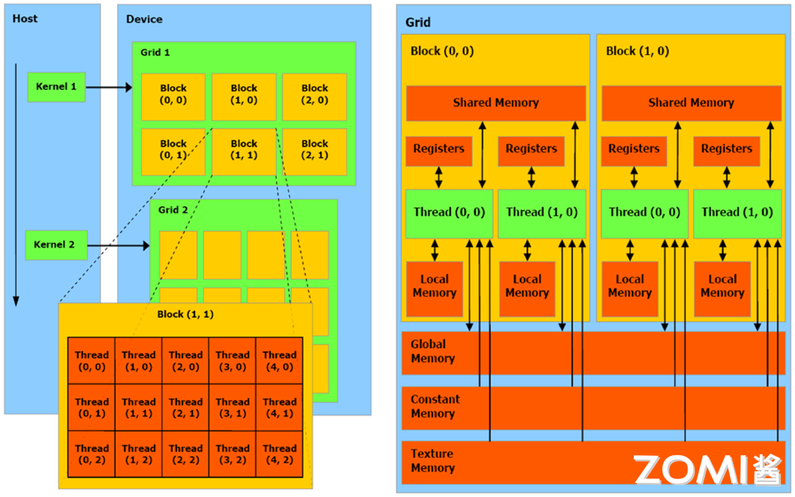

因此 CUDA 和英伟达硬件架构有以下对应关系，从软件侧看到的是线程的执行，对应于硬件上的 CUDA Core，每个线程对应于 CUDA Core，软件方面线程数量是超配的，硬件上 CUDA Core 是固定数量的。Block 线程块只在一个 SM 上通过 Warp 进行调度，一旦在 SM 上调用了 Block 线程块，就会一直保留到执行完 kernel，SM 可以同时保存多个 Block 线程块，多个 SM 组成的 TPC 和 GPC 硬件实现了 GPU 并行计算。

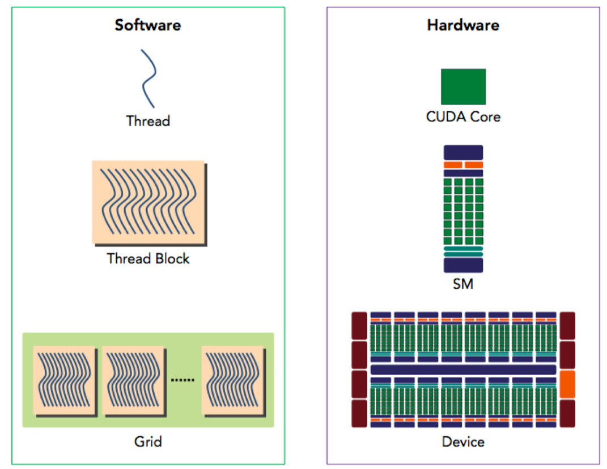

## 算力峰值计算

GPU 的算力峰值是指 GPU 在理想情况下能够达到的最大计算能力，通常以浮点运算每秒（FLOPS）为单位进行衡量，GFLOPS（每秒十亿次浮点运算），TFLOPS（每秒万亿次浮点运算）。计算 GPU 的算力峰值可以帮助开发人员了解其在理论上的最大性能，并进行性能预测和优化，更好地评估大模型训练过程中的算力利用率。

GPU 的算力峰值通常由以下几个因素决定：

- CUDA 核心数量：每个 CUDA 核心可以执行一个线程，GPU 的算力峰值与 CUDA 核心数量成正比。

- 核心频率：GPU 的核心频率越高，每个核心每秒钟能够执行的指令数就越多。

- 每个核心的计算能力：不同型号的 GPU 具有不同的计算能力，通常以每个核心每个时钟周期能够执行的浮点指令数（FLOPS）为单位进行衡量。

- 并行度：GPU 的并行度决定了其能够同时执行的线程数量，从而影响了算力峰值。

计算 GPU 的算力峰值可以使用以下公式：

$$\text{Peak FLOPS} = F_{\text{clk}} \times N_{\text{SM}} \times F_{\text{req}}$$

其中，

- $F_{\text{clk}}$：GPU 时钟周期内指令执行数 (FLOPS/Cycle)
- $N_{\text{SM}}$：SM（Streaming Multiprocessor）数量
- $F_{\text{req}}$：Tensor Core 核心运行频率（GHz）

以英伟达 A100 为例，其中 FP32 Tensor Core 指令吞吐 64 FLOPS/Cycle ，核心运行频率为 1.41GHz ，SM 数量为 108 ，因此 GPU 的算力峰值是，19,491 GFLOPS，大约为 1.95 TFLOPS：

$$Peak FLOPS=1.41∗108∗64∗2=19,491 GFLOPS$$

| NVIDIA A100 GPU 算力峰值 |  |
| --- | --- |
| Peak FP641 | 9.7 TFOPS |
| Peak FP64 Tensor Core1 | 19.5 TFOPS |
| Peak FP321 | 19.5 TFOPS |
| Peak FP161 | 78 TFOPS |
| Peak BF161 | 39 TFOPS |
| Peak FP32 Tensor Core1 | 156 TFOPS  &#124; 312 TFOPS2 |
| Peak FP16 Tensor Core1 | 312 TFOPS  &#124; 624 TFOPS2 |
| Peak BF16 Tensor Core1 | 312 TFOPS  &#124; 624 TFOPS2 |
| Peak INT8 Tensor Core1 | 624 TFOPS  &#124; 1,248 TFOPS2 |
| Peak INT4 Tensor Core1 | 1,248 TFOPS  &#124; 2,496 TFOPS2 |
| 1 - Peak rates are based on GPU Boost Clock.|  |
|2 - Effective TFLOPS/TOPS using the new Sparsity feature |  |

## 小结与思考

- CUDA 与 GPU 硬件的结合：CUDA 是英伟达推出的编程模型，它与 GPU 硬件紧密结合，允许开发者利用 GPU 上的 CUDA 核心和张量核心执行并行计算任务。

- CUDA 的线程层次结构：CUDA 通过线程、块和网格的层次化结构组织并行任务，实现了高效的数据并行处理和线程间同步。

- GPU 算力峰值的计算：通过考虑 CUDA 核心数量、核心频率和指令执行效率，可以估算 GPU 的最大理论计算性能，这对于预测和优化计算密集型应用至关重要。

## 本节视频

<html>
<iframe src="https://player.bilibili.com/player.html?aid=740259727&bvid=BV1Kk4y1Y7op&cid=1105214991&page=1&as_wide=1&high_quality=1&danmaku=0&t=30&autoplay=0" width="100%" height="500" scrolling="no" border="0" frameborder="no" framespacing="0" allowfullscreen="true"> </iframe>
</html>
