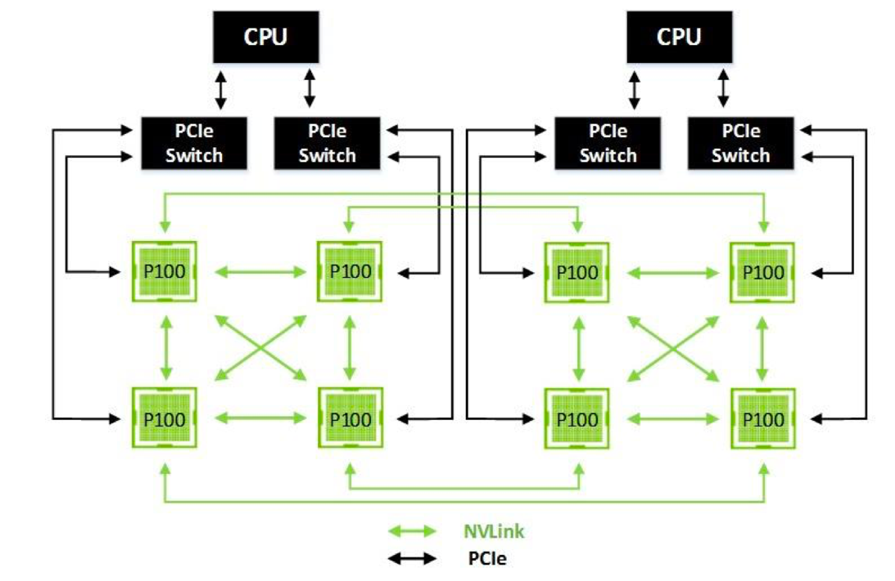
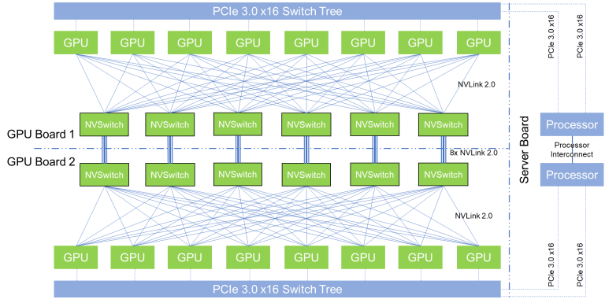

# GPU架构回顾第一篇

本节主要介绍NVIDIA GPU每一代架构的技术发展和架构之间的区别和联系，时间跨度从2010年至2017年，包括费米（Feimi）、开普勒（Kepler）、麦克斯韦（Maxwell）、帕斯卡（Pashcal）和伏特（Volt）架构。

| **架构名称** | **Fermi** | **Kepler** | **Maxwell** | **Pascal** | **Volta** |
| --- | --- | --- | --- | --- | --- |
| **中文名字** | 费米 | 开普勒 | 麦克斯韦 | 帕斯卡 | 伏特 |
| **发布时间** | 2010 | 2012 | 2014 | 2016 | 2017 |
| **核心参数** | 16个SM，每个SM包含32个CUDA Cores，一共512 CUDA Cores | 15个SMX，每个SMX包括192个FP32+64个FP64 CUDA Cores | 16个SM，每个SM包括4个处理块，每个处理块包括32个CUDA Cores+8个LD/ST Unit + 8 SFU | GP100有60个SM，每个SM包括64个CUDA Cores，32个DP Cores | 80个SM，每个SM包括32个FP64+64 Int32+64 FP32+8个Tensor Cores |
| **特点&优势** | 首个完整GPU计算架构，支持与共享存储结合的Cache层次GPU架构，支持ECC GPU架构 | 游戏性能大幅提升，首次支持GPU Direct技术 | 每组SM单元从192个减少到每组128个，每个SMM单元拥有更多逻辑控制电路 | NVLink第一代，双向互联带宽160GB/s，P100拥有56个SM HBM | NVLink2.0，Tensor Cores第一代，支持AI运算，NVSwitch1.0 |
| **纳米制程** | 40/28nm 30亿晶体管 | 28nm 71亿晶体管 | 28nm 80亿晶体管 | 16nm 153亿晶体管 | 12nm 211亿晶体管 |
| **代表型号** | Quadro 7000 | K80 K40M | M5000 M4000 GTX 9XX系列 | P100 P6000 TTX1080 | V100 TiTan V |

## Fermi架构

2010年NVIDIA提出Feimi架构，最大可支持16个SMs，每个SM有32个CUDA Cores，一共512个CUDA Cores，架构设计主要是以当时游戏用户的需求为主，因此整个GPU有多个GPC（图形处理簇），单个GPC包含一个光栅引擎（Raster Engine），4个SM。因为计算核心较多，因此将L2 Cache放在处理器中间位置，使得数据可以在CUDA Core之间快速传输。

> 恩里科·费米（Enrico Fermi）是意大利裔美国物理学家，20世纪最重要的物理学家之一，被誉为“原子能时代之父”。他在核物理、量子力学和统计力学等领域做出了重要贡献。主要成就包括：
> 
> 1. 提出费米子统计，即著名的费米-狄拉克统计，描述了半整数自旋的粒子的统计性质。
> 
> 2. 领导了芝加哥大学的“费米堆”项目，成功实现了世界上第一座自持核链反应堆。
> 
> 3. 参与了曼哈顿计划，对原子弹的研发做出了重要贡献。
> 
> 4. 获得了1938年的诺贝尔物理学奖，以表彰他在人类利用新的放射性同位素所作出的贡献。

Fermi架构单个SM结构中SFU是特殊处理单元，并行计算主要在CUDA中进行处理，可以选择FP 32或者INT 8执行计算，但是FP Unit和INT Unit的执行不是并行的。

Fermi架构线程分为三级，包含线程（Threads）、块（Blocks）和网格（Grid），每个层次结构对应硬件，Thread可以共享局部内存（Local memory），线程块使用共享内存（Shared Memory），Grid共享全局内存（Global Memory），具有相应的每个线程专用、每个块共享和每个应用程序全局内存空间。

## Kepler架构

2012年NVIDIA提出Kepler架构，开普勒架构相比上一代Fermi架构，SM（Streaming Multiprocessor）更名为SMX，但是本身的概念没有改变。在硬件上直接支持双精度浮点运算单元，使得GPU产品逐渐进入HPC（High performance Computing）领域，如今80%的高性能计算机集群都会使用GPU进行加速。提出GPU Direct技术，使得GPU可以绕过CPU/System Memory，完成与本机其它GPU或者其它机器GPU之间直接的数据交换，进一步提升数据的处理和数据的带宽。

> 约翰内斯·开普勒（Johannes Kepler）是一位德国天文学家、数学家和占星术士，被誉为现代天文学的奠基人之一。他生活在16世纪末至17世纪初，是科学革命时期的重要人物，他的工作对天文学和物理学领域产生了深远的影响，为后来伽利略和牛顿等科学家的研究奠定了基础。主要成就包括：
> 
> 1. 提出了行星运动的三大定律，即开普勒定律：
> 
> - 第一定律：行星绕太阳运行的轨道是椭圆形的，太阳位于椭圆的一个焦点上。
> 
> - 第二定律：行星在其轨道上的矢量面积与时间的比率是常数。
> 
> - 第三定律：行星轨道的半长轴与公转周期的平方成正比。
> 
> 2. 通过观测和分析提出了行星运动的椭圆轨道理论，颠覆了当时的圆周运动观念。
> 
> 3. 对光学、天文学和数学领域都做出了重要贡献，为日后牛顿的引力理论奠定了基础。

Fermi架构共有32核，Kepler架构拥有192核，大大提升了GPU并行处理的能力。

## Maxwell架构

2014年NVIDIA提出Maxwell架构，麦克斯韦架构相比上一代架构没有太大改进，其中SM又使用了原来的名称，整体的核心个数变为128个，因为核心数不需要太多，可以通过超配线程数来提升GPU并行计算的能力。

> 詹姆斯·克拉克·麦克斯韦（James Clerk Maxwell）是19世纪苏格兰物理学家，被誉为电磁理论之父。他在电磁学和热力学领域做出了重要贡献，开创了现代物理学的新时代。主要成就包括：
> 
> 1. 提出了麦克斯韦方程组，总结了电磁场的基本规律，揭示了电磁波的存在，并将电磁学和光学统一起来。
> 
> 2. 发展了统计力学，提出了分子速度分布的麦克斯韦-玻尔兹曼分布定律，为热力学的发展做出了重要贡献。
> 
> 3. 提出了色散理论，解释了光的色散现象，为光学研究提供了新的理论基础。
> 
> 4. 预言了电磁波的存在，并在后来的实验证实了这一理论，为无线电通信的发展奠定了基础。

## Pascal架构

2016年NVIDIA提出Pascal架构，相比之前的架构，Pascal帕斯卡架构在应用场景、内存带宽和制程工艺等多个方面做出了创新。因其提供CuDNN等库，是第一款面向AI的架构。同时提出第一代NVLink，提升单机卡间通信之外扩展多机之间的带宽。将系统内存GDDR5换成HBM2，带宽提升一个数量级。采用16nm FinFET工艺，相同功耗下算力提升提升一个数量级。在计算核心方面，CUDA Core硬件支持FP16半精计算。

Pascal架构在SM内部作了进一步精简，整体思路是SM内部包含的硬件单元类别减少，因为芯片制程工艺的进步，SM数量每一代都在增加。单个SM只有64个FP32 CUDA Cores，相比Maxwell的128核和Kepler的192核，数量少了很多，并且64个CUDA Cores分为了两个区块；分成两个区块之后，Register File保持相同大小，每个线程可以使用更多的寄存器，单个SM可以并发更多的thread/warp/block，进一步增加并行处理能力；增加32个FP64 CUDA Cores（DP Unit），FP32 CUDA Core具备处理FP16的能力。

> 布莱斯·帕斯卡（Blaise Pascal）是17世纪法国数学家、物理学家、哲学家和神学家，视为文艺复兴时期最重要的思想家之一。他在多个领域都有重要的贡献，被认为是现代概率论和流体力学的奠基人之一。主要成就包括：
> 
> 1. 发明了帕斯卡三角形，这是一个数学工具，被广泛用于组合数学和概率论中。
> 
> 2. 提出了帕斯卡定律，描述了液体在容器中的压力传递规律，对流体力学的发展产生了重要影响。
> 
> 3. 发展了概率论，提出了帕斯卡概率论，为后来的概率统计学奠定了基础。
> 
> 4. 在哲学和神学领域，他提出了帕斯卡赌注，探讨了信仰与理性的关系，对基督教神学产生了深远的影响。

由于多机之间采用InfiniBand和100 GB Ethernet通信，单个机器内单GPU到单机8 GPU，PCIe带宽成为瓶颈，因此Pascal架构首次提出NVLink。NVLink用以单机内多GPU内的点对点通信，带宽达到160GB/s，大约是PCIe 3x16的5倍，减少数据传输的延迟，避免大量数据通过PCIe回传到CPU的内存中，导致数据重复搬运，实现GPU整个网络的拓扑互联。在实际训练大模型的过程中，带宽会成为分布式训练系统的主要瓶颈，从而使得NVLink成为一项具有重要意义的创新。

## Volta架构

2017年NVIDIA提出Volta架构，伏特架构做了以下创新：（1）CUDA Core拆分，分离FPU和ALU，取消CUDA Core整体的硬件概念，一条指令可以同时执行不同计算；（2）提出独立线程调度，改进单指令多线程SIMT模型架构，使得每个线程都有独立的PC（Program Counter）和Stack；（3）针对AI计算首次提出第一代张量核心Tersor Core，提高深度学习计算中卷积运算进行加速；（4）对NVLink进行改进，提出第二代NVLink，一个GPU可以连接6个NVLink，而不是Pascal时代的4个；（5）提出MPS概念，使得多进程服务可以更好的适配到云厂商进行多用户租赁；（4）GRF & Cache：Global memory访问也能享受到高度缓存并行加速。

> 亚历山大·伏特（Alessandro Volta）是18世纪意大利物理学家，被誉为电池之父。他是电学领域的先驱之一，发明了第一种真正意义上的化学电池，被称为伏特电池，为电化学和现代电池技术的发展奠定了基础。主要成就包括：
> 
> 1. 发明了伏特电堆，这是由多个铜和锌片交替堆叠而成的装置，能够产生持续的电流，是第一个实用的化学电池。
> 
> 2. 提出了静电感应理论，探讨了静电现象的本质，对电学理论的发展产生了重要影响。
> 
> 3. 研究了气体的电学性质，发现了甲烷和氧气的反应可以产生火花，为后来的火花塞技术和火花点火系统的发展做出了贡献。

Volta伏特架构SM结构相比前几代架构，SM的数目明显增多，单个SM中包含4个Warp Schedule，4个Dispatch Unit，64个FP32 Core（4*16），64个INT32 Core（4*16），32个FP64 Core（4*8），8个Tensor Core（4*2），32个LD/ST Unit（4*8），4个SFU，FP32和INT32两组运算单元独立出现在流水线中，每个Cycle都可以同时执行FP32和INT32指令，因此每个时钟周期可以执行的计算量更大。

此时GPU并行模式可以实现深度学习功能的通用计算，最常见卷积/矩阵乘（Conv/GEMM）操作，依旧被编码成融合乘加运算FMA（Fused Multiply Add），硬件层面还是需要把数据按照：寄存器-ALU-寄存器-ALU-寄存器方式来回来回搬运数据，因此专门设计Tensor Core实现矩阵乘计算。

NVIDIA从SIMT走到了SIMT+DSA的混合，每个Tensor Core单个周期能执行4x4x4 GEMM计算，即64个FMA，极大地减少了系统内存的开销。虽然只支持FP16数据，但输出可以是FP32，相当于64个FP32 ALU提供算力，因此一个时钟周期内可以执行更多的矩阵运算使得GPU在能耗上更有优势。

英伟达将采用伏特架构的GPU以Tesla V100 Powered DGX Station的形式对外出售工作站。此时不再使用PCIe连接GPU，而是将多个GPU直接封装在同一块主板上，NVLink每个连接提供双向各自25GB/s的带宽，并且一个GPU可以接6个NVLink。

此外，NVSwitch1.0技术是Volta架构中的一项重要创新，旨在提高GPU之间的通信效率和性能。NVSwitch1.0可以支持多达16个GPU之间的通信，可以实现GPU之间的高速数据传输，提高系统的整体性能和效率，适用于需要大规模并行计算的场景，比如人工智能训练和科学计算等领域。

## 总结

本节主要回顾了从2010年到2017年NVIDIA GPU架构的发展，其中有几个比较重要的时间节点和技术创新：

- 2010年提出Fermi架构，开启了架构演进的进程，属于首个完整的GPU计算架构，里面提出的新概念一直沿用至今；

- 2016年提出Pascal架构，首次提出NVLink，双向互联带宽达到160 GB/s对AI领域产生重大影响，是具有历史性意义的里程碑架构；

- 2017年提出Volt架构，首次提出张量核心（Tensor Core），专门针对神经网络矩阵卷积运算进行加速的第一代核心，同时提出NVSwitch1.0，提高 GPU 之间的通信效率和性能。

- 还有需要特别注意的一点是，随着芯片制程工艺从40 nm提升到12 nm，晶体管数量也从刚开始的30亿增长至211亿，提升性能的同时使得GPU产品在提供同等算力的条件下有着更低的功耗。

## 本节视频

<html>
<iframe src="https://player.bilibili.com/player.html?aid=783019461&bvid=BV1x24y1F7kY&cid=1113803137&page=1&as_wide=1&high_quality=1&danmaku=0&t=30&autoplay=0" width="100%" height="500" scrolling="no" border="0" frameborder="no" framespacing="0" allowfullscreen="true"> </iframe>
</html>
