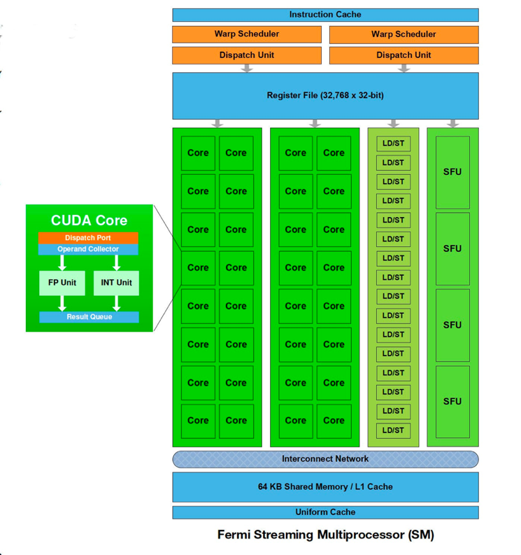
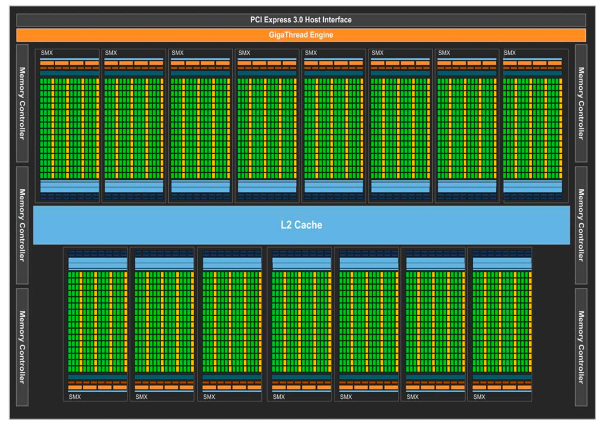
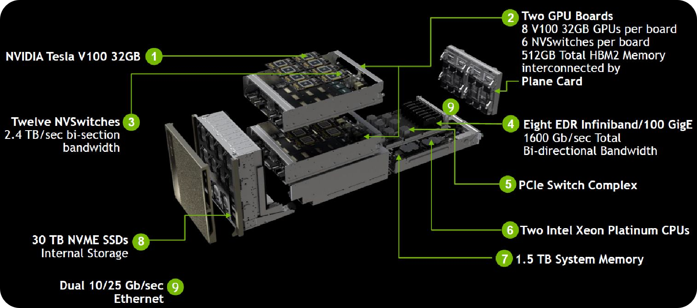
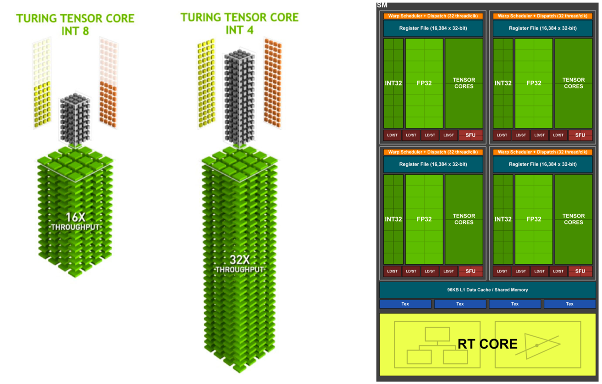
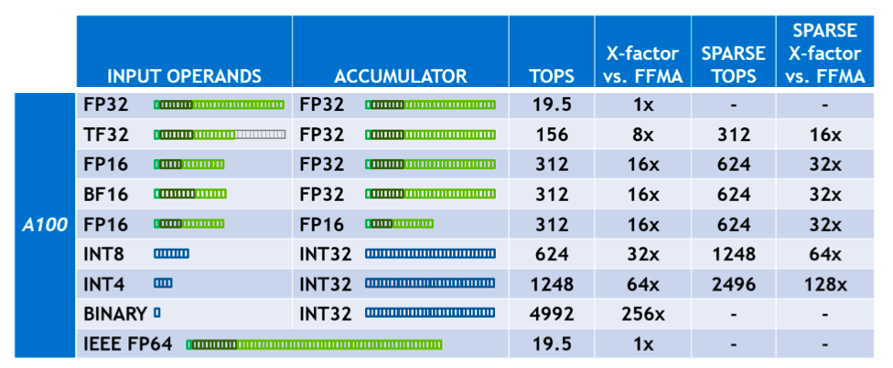
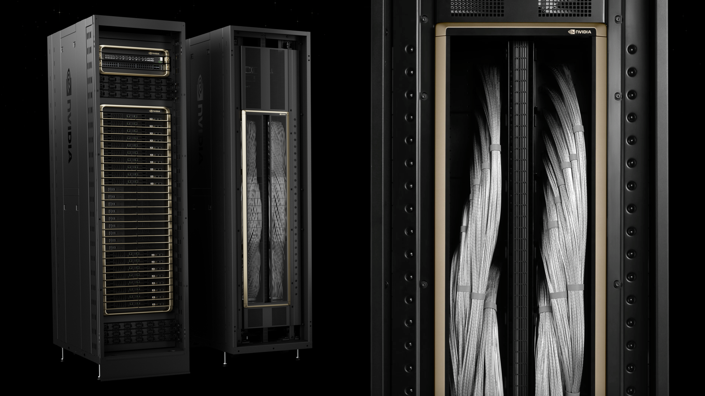
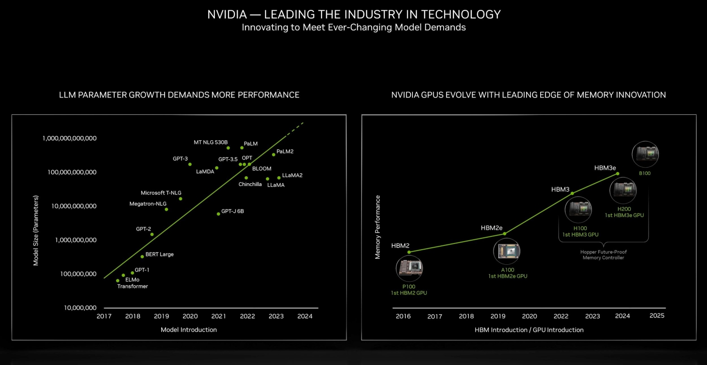

# GPU架构回顾

1999年，英伟达发明了GPU（graphics processing unit），本节将介绍NVIDIA GPU从Fermi到Blankwell共9代架构，时间跨度从2010年至2024年，具体包括费米（Feimi）、开普勒（Kepler）、麦克斯韦（Maxwell）、帕斯卡（Pashcal）、伏特（Volt）、图灵（Turing）、安培（Ampere）和赫柏（Hopper）和布莱克韦尔（Blackwell）架构。经过15年的发展，CUDA已成为NVIDIA的技术“护城河”，Tensor Core5.0，NVLink5.0，NVswitch4.0，TransformerEngine2.0等技术迭代更新，正如英伟达公司官方宣传语所言：“人工智能计算领域的领导者，推动了AI、HPC、游戏、创意设计、自动驾驶汽车和机器人开发领域的进步。”

| **架构名称** | **中文名字** | **发布时间** | **核心参数** | **特点&优势** | **纳米制程** | **代表型号** |
| --- | --- | --- | --- | --- | --- | --- |
| **Fermi** | 费米 | 2010 | 16个SM，每个SM包含32个CUDA Cores，一共512 CUDA Cores | 首个完整GPU计算架构，支持与共享存储结合的Cache层次GPU架构，支持ECC GPU架构 | 40/28nm, 30亿晶体管 | Quadro 7000 |
| **Kepler** | 开普勒 | 2012 | 15个SMX，每个SMX包括192个FP32+64个FP64 CUDA Cores | 游戏性能大幅提升，首次支持GPU Direct技术 | 28nm, 71亿晶体管 | K80, K40M |
| **Maxwell** | 麦克斯韦 | 2014 | 16个SM，每个SM包括4个处理块，每个处理块包括32个CUDA Cores+8个LD/ST Unit + 8 SFU | 每组SM单元从192个减少到每组128个，每个SMM单元拥有更多逻辑控制电路 | 28nm, 80亿晶体管 | M5000, M4000GTX 9XX系列 |
| **Pascal** | 帕斯卡 | 2016 | GP100有60个SM，每个SM包括64个CUDA Cores，32个DP Cores | NVLink第一代，双向互联带宽160GB/s，P100拥有56个SM HBM | 16nm, 153亿晶体管 | P100, P6000, TTX1080 |
| **Volta** | 伏特 | 2017 | 80个SM，每个SM包括32个FP64+64 Int32+64 FP32+8个Tensor Cores | NVLink2.0，Tensor Cores第一代，支持AI运算，NVSwitch1.0 | 12nm, 211亿晶体管 | V100, TiTan V |
| **Turing** | 图灵 | 2018 | 102核心92个SM，SM重新设计，每个SM包含64个Int32+64个FP32+8个Tensor Cores | Tensor Core2.0，RT Core第一代 | 12nm, 186亿晶体管 | T4，2080TI, RTX 5000 |
| **Ampere** | 安培 | 2020 | 108个SM，每个SM包含64个FP32+64个INT32+32个FP64+4个Tensor Cores | Tensor Core3.0，RT Core2.0，NVLink3.0，结构稀疏性矩阵MIG1.0 | 7nm, 283亿晶体管 | A100, A30系列 |
| **Hopper** | 赫柏 | 2022 | 132个SM，每个SM包含128个FP32+64个INT32+64个FP64+4个Tensor Cores | Tensor Core4.0，NVlink4.0，结构稀疏性矩阵MIG2.0 | 4nm, 800亿晶体管 | H100 |
| **Blackwell** | 布莱克韦尔 | 2024 | - | Tensor Core5.0，NVlink5.0, 第二代Transformer引擎，支持RAS | 4NP,  2080亿晶体管 | B200 |

## Fermi架构

2006年NVIDIA提出G80架构，使开发者可以基于C语言在GPU上进行开发。2008年基于G80架构提出GT200，增加了流处理器核的数量，更高的精度和并行能力使GPU进行科学计算和高性能计算成为可能。

2010年NVIDIA提出Feimi架构，最大可支持16个SMs，每个SM有32个CUDA Core，一共512个CUDA Core，架构设计主要是以当时游戏用户的需求为主，因此整个GPU有多个GPC（图形处理簇），单个GPC包含一个光栅引擎（Raster Engine）和4个SM。

GPU拥有6个64位内存分区，总共是384位内存，最多支持6 GB GDDR5 DRAM内存。主机接口通过PCI-Express连接GPU和CPU。GigaThread全局调度器将线程块分配给SM线程调度器。因为计算核心较多，因此将L2 Cache放在处理器中间位置，使得数据可以在CUDA Core之间快速传输。

> 恩里科·费米（Enrico Fermi）是意大利裔美国物理学家，20世纪最重要的物理学家之一，被誉为“原子能时代之父”。他在核物理、量子力学和统计力学等领域做出了重要贡献。主要成就包括：
> 
> 1. 提出费米子统计，即著名的费米-狄拉克统计，描述了半整数自旋的粒子的统计性质。
> 
> 2. 领导了芝加哥大学的“费米堆”项目，成功实现了世界上第一座自持核链反应堆。
> 
> 3. 参与了曼哈顿计划，对原子弹的研发做出了重要贡献。
> 
> 4. 获得了1938年的诺贝尔物理学奖，以表彰他在人类利用新的放射性同位素所作出的贡献。

Fermi架构采用第三代流处理器，每个SM有16个加载/存储单元（Load/Store, LD/ST），允许为每个时钟16个线程计算源地址和目标地址，支持将每个地址的数据加载并存储到缓存或DRAM中。特殊功能单元（Special Function Unit, SFU）执行超越函数，如sin、cos、导数和平方根。每个SFU在每个线程、每个时钟执行一条指令，一次warp（由32个线程组成的线程组）要经过8个时钟周期。SFU管线与调度单元解耦，允许调度单元在占用SFU时向其他执行单元发出命令。双精度算法是高性能计算应用的核心，每个SM、每个时钟可执行多达16个双精度融合乘加运算。

每个SM有两个warp调度器和两个指令调度单元，允许同时发出和执行两个warp。并行计算主要在CUDA中进行处理，每个CUDA处理器都有一个完整的流水线整数算术逻辑单元（ALU）和浮点单元（FPU），可以选择FP 32或者INT 8执行计算，但是FP Unit和INT Unit的执行不是并行的。

Fermi架构支持新的并行线程执行PTX 2.0（Parallel Thread Execution）指令集架构。一个CUDA程序被称作并行的Kernel，线程分为三级，包含线程（Threads）、块（Blocks）和网格（Grid），每个层次结构对应硬件，Thread可以共享局部内存（Local memory），线程块使用共享内存（Shared Memory），Grid共享全局内存（Global Memory），具有相应的每个线程专用、每个块共享和每个应用程序全局内存空间。

## Kepler架构

2012年NVIDIA提出Kepler架构，由7.1亿个晶体管组成的Kepler GK110将提供超过1 TFlop的双精度吞吐量，采用台积电28 nm制程，每瓦的性能是费米架构的3倍。由15个SMX单元和6个64 bit内存控制器，内存子系统提供额外的缓存功能，在每个层次结构的存储器有更大的带宽，实现更快的DRAM I/O，同时为编程模型提供硬件支持。

> 约翰内斯·开普勒（Johannes Kepler）是一位德国天文学家、数学家和占星术士，被誉为现代天文学的奠基人之一。他生活在16世纪末至17世纪初，是科学革命时期的重要人物，他的工作对天文学和物理学领域产生了深远的影响，为后来伽利略和牛顿等科学家的研究奠定了基础。主要成就包括：
> 
> 1. 提出了行星运动的三大定律，即开普勒定律：
> 
> - 第一定律：行星绕太阳运行的轨道是椭圆形的，太阳位于椭圆的一个焦点上。
> 
> - 第二定律：行星在其轨道上的矢量面积与时间的比率是常数。
> 
> - 第三定律：行星轨道的半长轴与公转周期的平方成正比。
> 
> 2. 通过观测和分析提出了行星运动的椭圆轨道理论，颠覆了当时的圆周运动观念。
> 
> 3. 对光学、天文学和数学领域都做出了重要贡献，为日后牛顿的引力理论奠定了基础。

开普勒架构相比上一代Fermi架构，SM（Streaming Multiprocessor）更名为SMX，但是本身的概念没有改变，每个SMX具有四个warp调度器和八个指令调度单元，允许同时发出和执行四个warp。Fermi架构共有32核，Kepler架构拥有192核，大大提升了GPU并行处理的能力。Fermi支持最大线程数是1536，Kepler最大线程数达到2048。64个双精度（Double-Precision，DP）单元， 32特殊功能单元（SFU）和32个LD/ST（load/store）单元，满足高性能计算场景的实际需求。

Kepler架构支持动态并行（Dynnamic Parallelism），在不需要CPU支持的情况下自动同步，在程序执行过程中灵活动态地提供并行数量和形式。Hyper-Q使多个CPU核使用单个GPU执行工作，提高GPU利用率并显着减少CPU空闲时间，允许32个同时进行的硬件管理连接，允许从多个CUDA流处理，多个消息传递进程中分离出单个进程。使用网格管理单元（Grid Management Unit，GMU）启用动态并行和调度控制，比如挂起或暂停网格和队列直到执行的环境准备好。

NVIDIA GPUDirect可以使单个计算机内的GPU或位于网络上不同服务器中的GPU直接交换数据，而无需转到CPU/系统内存，RDMA特性允许第三方设备直接访问同一系统内多个GPU上的内存，减少了对系统内存带宽的需求，释放GPU DMA引擎供其它CUDA任务使用。

## Maxwell架构

2014年NVIDIA提出Maxwell架构，麦克斯韦架构相比上一代架构没有太大改进，其中SM又使用了原来的名称，整体的核心个数变为128个，因为核心数不需要太多，可以通过超配线程数来提升GPU并行计算的能力。

SMM使用基于象限的设计，其中每个SMM有四个共32核处理块，每个处理块都有一个专用的warp调度器，能够在每个时钟调度两条指令。每个SMM提供8个纹理单元，一个图形的几何处理引擎，以及专用的寄存器文件（Register File）和共享内存（Shared Memory）。单核性能是Kepler架构的1.35倍，performance/watt（性能与功耗的比率）是Kepler架构的两倍，在相同功耗下能够提供更高的性能。

> 詹姆斯·克拉克·麦克斯韦（James Clerk Maxwell）是19世纪苏格兰物理学家，被誉为电磁理论之父。他在电磁学和热力学领域做出了重要贡献，开创了现代物理学的新时代。主要成就包括：
> 
> 1. 提出了麦克斯韦方程组，总结了电磁场的基本规律，揭示了电磁波的存在，并将电磁学和光学统一起来。
> 
> 2. 发展了统计力学，提出了分子速度分布的麦克斯韦-玻尔兹曼分布定律，为热力学的发展做出了重要贡献。
> 
> 3. 提出了色散理论，解释了光的色散现象，为光学研究提供了新的理论基础。
> 
> 4. 预言了电磁波的存在，并在后来的实验证实了这一理论，为无线电通信的发展奠定了基础。

对比Kepler和Maxwell架构，Maxwell架构拥有更大的专用共享内存，通过将共享内存与L1缓存分离，在每个SMM中提供专用的64KB共享内存，GM204 Maxwell每个SMM的专用共享内存提高到96KB。和Kepler和Fermi架构一样，每个线程块的最大共享内存仍然是48KB。GM204 Maxwell具有更大的二级缓存（L2 Cache），GK104 Kepler的四倍，带宽受限的应用程序可以获得更大的性能优势。每个SM有更多活动线程块（Thread Blocks），从16增加到32有助于提高运行在小线程块上的内核使用率。可以对32位整数的本机共享内存进行原子操作，使线程块上的列表和栈类型数据更高效，和Kepler一样支持动态并行。

| GPU GeForce  | GTX 680 (Kepler GK104) | GTX 980 (Maxwell GM204) |
| --- | --- | --- |
| CUDA Cores | 1536 | 2048 |
| Base Clock | 1006 MHz | 1126 MHz |
| GPU Boost Clock | 1058 MHz | 1216 MHz |
| GFLOPs | 3090 | 4612 |
| Compute Capability | 3.0 | 5.2 |
| SMs | 8 | 16 |
| Shared Memory / SM | 48KB | 96KB |
| Register File Size / SM | 256KB | 256KB |
| Active Blocks / SM | 16 | 32 |
| Texture Units | 128 | 128 |
| Texel fill-rate | 128.8 Gigatexels/s | 144.1 Gigatexels/s |
| Memory | 2048 MB | 4096 MB |
| Memory Clock  | 6008 MHz | 7010 MHz |
| Memory Bandwidth | 192.3 GB/sec | 224.3 GB/sec |
| ROPs | 32 | 64 |
| L2 Cache Size | 512 KB | 2048 KB |
| TDP | 195 Watts | 165 Watts |
| Transistors | 3.54 billion | 5.2 billion |
| Die Size | 294 mm² | 398 mm² |
| Manufacturing Process | 28-nm | 28 nm |

## Pascal架构

2016年NVIDIA提出Pascal架构，相比之前的架构，Pascal帕斯卡架构在应用场景、内存带宽和制程工艺等多个方面做出了创新。将系统内存GDDR5 换成HBM2，能够在更高的带宽下处理更大的工作数据集，提高效率和计算吞吐量，并减少从系统内存传输的频率，而且HBM2原生支持数据纠错（Error correcting Code, ECC）。采用16nm FinFET工艺，拥有15.3亿个晶体管，相同功耗下算力提升提升一个数量级。同时提出第一代NVLink，提升单机卡间通信之外扩展多机之间的带宽。支持统一内存，允许在GPU和CPU的完整虚拟地址空间之间透明迁移数据，降低了并行编程的门槛。支持计算抢占和针对Pascal架构优化的人工智能算法，可应用于高性能计算、深度学习和GPU计算密集型领域。

GP100 Pascal由图形处理集群（GPCs）、纹理处理集群（TPCs）、流式多处理器（SMs）和内存控制器组成。一个完整的GP100由6个GPCs、60个Pascal SMs、30个TPCs（每个都包括2个SMs）和8个512位内存控制器（总共4096位）组成。每个GPC都有10个SMs，每个SM有64个CUDA核和4个纹理单元，拥有60个SMs，共有3840个单精度CUDA Cores和240个纹理单元。每个内存控制器都连接到512 KB的L2高速缓存上，每个HBM2 DRAM都由一对内存控制器控制，总共包含4096 KB L2高速缓存。

Pascal架构在SM内部作了进一步精简，整体思路是SM内部包含的硬件单元类别减少，因为芯片制程工艺的进步，SM数量每一代都在增加。单个SM只有64个FP32 CUDA Cores，相比Maxwell的128核和Kepler的192核，数量少了很多，并且64个CUDA Cores分为了两个区块，每个处理块有32个单精度CUDA Cores、一个指令缓冲区、一个Warp调度器和两个调度单元（Dispatch Unit）。分成两个区块之后，Register File保持相同大小，每个线程可以使用更多的寄存器，单个SM可以并发更多的thread/warp/block，进一步增加并行处理能力。

增加32个FP64 CUDA Cores（DP Unit），FP32 CUDA Core具备处理FP16的能力。此外，每个SM具有32个双精度（FP64）CUDA Cores，使得GPU更有效地处理双精度计算任务。与精度更高的FP32或FP64相比，存储FP16数据可以减少神经网络的内存使用，从而允许训练和部署更大的网络。为加速深度学习支持FP16，与FP32相比可以提高2倍性能，同时数据传输需要的时间更少。

> 布莱斯·帕斯卡（Blaise Pascal）是17世纪法国数学家、物理学家、哲学家和神学家，视为文艺复兴时期最重要的思想家之一。他在多个领域都有重要的贡献，被认为是现代概率论和流体力学的奠基人之一。主要成就包括：
> 
> 1. 发明了帕斯卡三角形，这是一个数学工具，被广泛用于组合数学和概率论中。
> 
> 2. 提出了帕斯卡定律，描述了液体在容器中的压力传递规律，对流体力学的发展产生了重要影响。
>
> 3. 发展了概率论，提出了帕斯卡概率论，为后来的概率统计学奠定了基础。
> 
> 4. 在哲学和神学领域，他提出了帕斯卡赌注，探讨了信仰与理性的关系，对基督教神学产生了深远的影响。

由于多机之间采用InfiniBand和100 GB Ethernet通信，单个机器内单GPU到单机8 GPU，PCIe带宽成为瓶颈，因此Pascal架构首次提出NVLink，针对多GPU和GPU-to-CPU实现高带宽连接。NVLink用以单机内多GPU内的点对点通信，带宽达到160 GB/s，大约是PCIe 3x16的5倍，减少数据传输的延迟，避免大量数据通过PCIe回传到CPU的内存中，导致数据重复搬运，实现GPU整个网络的拓扑互联。在实际训练大模型的过程中，带宽会成为分布式训练系统的主要瓶颈，从而使得NVLink成为一项具有重要意义的创新。

## Volta架构

2017年NVIDIA提出Volta架构，GV100 GPU有21.1亿个晶体管，使用TSMC 12 nm工艺。伏特架构做了以下创新：

（1）CUDA Core拆分，分离FPU和ALU，取消CUDA Core整体的硬件概念，一条指令可以同时执行不同计算，同时对CUDA应用程序并行线程更进一步，提高了CUDA平台的灵活性、生产力和可移植性；

（2）提出独立线程调度，改进单指令多线程SIMT模型架构，使得每个线程都有独立的PC（Program Counter）和Stack，程序中并行线程之间更细粒度的同步和协作；

（3）专门为深度学习优化了SM架构，针对AI计算首次提出第一代张量核心Tersor Core，提高深度学习计算中卷积运算进行加速；

（4）对NVLink进行改进，提出第二代NVLink，一个GPU可以连接6个NVLink，而不是Pascal时代的4个，16 GB HBM2内存子系统提供了900GB/秒的峰值内存带宽；

（5）提出MPS概念，在多个应用程序单独未充分利用GPU执行资源时，允许多个应用程序同时共享GPU执行资源，使得多进程服务可以更好的适配到云厂商进行多用户租赁，客户端数量从Pascal上的16个增加到Volta上的48个，支持多个单独的推理任务并发地提交给GPU，提高GPU的总体利用率；

（6）结合Volta架构新特性优化GPU加速库版本，如cuDNN、cuBLAS和TensorRT，为深度学习推理和高性能计算（HPC）应用程序提供更高的性能。NVIDIA CUDA 9.0版本提供了新的API支持Volta特性，更简单的可编程性。NVIDIA TensorRT是一款用于高性能深度学习推理的 SDK，包含深度学习推理优化器和运行时，可为推理应用程序提供低延迟和高吞吐量。

> 亚历山大·伏特（Alessandro Volta）是18世纪意大利物理学家，被誉为电池之父。他是电学领域的先驱之一，发明了第一种真正意义上的化学电池，被称为伏特电池，为电化学和现代电池技术的发展奠定了基础。主要成就包括：
> 
> 1. 发明了伏特电堆，这是由多个铜和锌片交替堆叠而成的装置，能够产生持续的电流，是第一个实用的化学电池。
> 
> 2. 提出了静电感应理论，探讨了静电现象的本质，对电学理论的发展产生了重要影响。
> 
> 3. 研究了气体的电学性质，发现了甲烷和氧气的反应可以产生火花，为后来的火花塞技术和火花点火系统的发展做出了贡献。

与上一代Pascal GP100 GPU一样，GV100 GPU有6个GPU处理集群（GPCs），每个GPC有7个纹理处理集群（TPCs）、14个流式多处理器（SMs），以及内存控制器。

Volta伏特架构SM结构相比前几代架构，SM的数目明显增多，SM被划分为四个处理块，单个SM中包含4个Warp Schedule，4个Dispatch Unit，64个FP32 Core（4*16），64个INT32 Core（4*16），32个FP64 Core（4*8），8个Tensor Core（4*2），32个LD/ST Unit（4*8），4个SFU，FP32和INT32两组运算单元独立出现在流水线中，每个Cycle都可以同时执行FP32和INT32指令，因此每个时钟周期可以执行的计算量更大。Volt架构新增了混合精度张量核心（Tensor Core）以及高性能L1数据缓存和新的SIMT线程模型。单个SM通过共享内存和L1资源的合并，相比GP100 64 KB的共享内存容量，Volta架构增加到96KB。

新的张量核心使Volta架构得以训练大型神经网络，GPU并行模式可以实现深度学习功能的通用计算，最常见卷积/矩阵乘（Conv/GEMM）操作，依旧被编码成融合乘加运算FMA（Fused Multiply Add），硬件层面还是需要把数据按照：寄存器-ALU-寄存器-ALU-寄存器方式来回来回搬运数据，因此专门设计Tensor Core实现矩阵乘计算。

NVIDIA计算硬件模型从SIMT发展成为了SIMT+DSA的混合，每个张量核心单时钟周期内执行64个浮点FMA操作，而SM中的8个张量核心单时钟周期总共执行512个FMA操作（或1024个单独的浮点操作）。每个张量核心在一个4x4矩阵上操作，并执行计算：$D=A×B+C$，输入A和B矩阵是FP16，而计算结果矩阵C和D可以是FP16或FP32矩阵，极大地减少了系统内存的开销，一个时钟周期内可以执行更多的矩阵运算，使得GPU在能耗上更有优势。CUDA 9 C++ API有专门的矩阵乘和存储操作，有效地使用CUDA-C++程序中的张量核心，同时cuBLAS和cuDNN库利用张量核进行深度学习研究。

英伟达伏特架构的GPU以Tesla V100 Powered DGX Station的形式对外出售工作站。此时不再使用PCIe连接GPU，而是将多个GPU直接封装在同一块主板上，第二代NVLink每个连接提供双向各自25 GB/s的带宽，并且一个GPU可以接6个NVLink，专门用于GPU-GPU通信，同时允许从CPU直接加载/存储/原子访问到每个GPU的HBM2内存。

此外，NVSwitch1.0 技术是 Volta 架构中的一项重要创新，旨在提高 GPU 之间的通信效率和性能。NVSwitch1.0 可以支持多达16个GPU之间的通信，可以实现GPU之间的高速数据传输，提高系统的整体性能和效率，适用于需要大规模并行计算的场景，比如人工智能训练和科学计算等领域。

NVIDIA Tesla V100将深度学习的新架构特性与GPU计算性能相结合，提供了更高的神经网络训练和推理性能。NVLink使多GPU系统提供了性能可伸缩性，同时CUDA编程的灵活性允许新算法快速开发和部署，满足了人工智能、深度学习系统和算法的训练和推断的持续需求。

## Turing架构

2018年Turing图灵架构发布，采用TSMC 12 nm工艺，总共18.6亿个晶体管。在PC游戏、专业图形应用程序和深度学习推理方面，效率和性能都取得了重大进步。相比上一代Volta架构主要更新了Tensor Core（专门为执行张量/矩阵操作而设计的专门执行单元，深度学习计算核心）、CUDA和CuDNN库的不断改进，更好地应用于深度学习推理。RT Core（Ray Tracing Core）提供实时的光线跟踪渲染，包括具有物理上精确的投影、反射和折射，更逼真的渲染物体和环境。支持GDDR6内存，与GDDR5内存相比，拥有14 Gbps传输速率，实现了20%的的效率提升。NVLink2.0支持100 GB/s双向带宽，使特定的工作负载能够有效地跨两个GPU进行分割并共享内存。

TU102 GPU包括6个图形处理集群（GPCs）、36个纹理处理集群（TPCs）和72个流式多处理器（SMs）。每个GPC包括一个专用光栅引擎和6个TPC，每个TPC包括两个SMs。每个SM包含64个CUDA核心、8个张量核心、一个256 KB的寄存器文件、4个纹理单元和96 KB的L1/共享内存，这些内存可以根据计算或图形工作负载配置为不同的容量。因此总共有4608个CUDA核心、72个RT核心、576个张量核心、288纹理单元和12个32位GDDR6内存控制器（总共384位）。

> 艾伦·图灵（Alan Turing）是20世纪英国数学家、逻辑学家和密码学家，被誉为计算机科学之父。他在计算理论和人工智能领域做出了开创性的工作，对现代计算机科学的发展产生了深远影响。主要成就包括：
> 
> 1. 发展了图灵机概念，这是一种抽象的数学模型，被认为是计算机的理论基础，为计算机科学奠定了基础。
> 
> 2. 在第二次世界大战期间，他领导了英国破解德国恩尼格玛密码的团队，对盟军在战争中的胜利做出了重要贡献。
> 
> 3. 提出了图灵测试，用来衡量机器是否具有智能，为人工智能领域的发展提供了重要思想。
> 
> 4. 在逻辑学领域，他提出了图灵判定问题，对计算机可解性和不可解性做出了重要贡献。

随着深度学习模型的量化部署逐渐成熟，Turing架构中的Tensor Core（张量核心）增加了对INT8/INT4/Binary的支持，加速神经网络训练和推理函数的矩阵乘法核心。一个TU102 GPU包含576个张量核心，每个张量核心可以使用FP16输入在每个时钟执行多达64个浮点融合乘法加法（FMA）操作。SM中8个张量核心在每个时钟中总共执行512次FP16的乘法和累积运算，或者在每个时钟执行1024次FP运算，新的INT8精度模式以两倍的速率工作，即每个时钟进行2048个整数运算。Tensor Core用于加速基于人工智能的NVIDIA NGX功能，增强图形、渲染和其它类型的客户端应用程序，包括DLSS（深度学习超级采样）、人工智能绘画、AI Super Rez（图像/视频超分辨率）和AI Slow-Mo（视频流插帧）。

每个SMs分别有64个FP32核和64个INT32核，还包括8个混合精度的张量核（Tensor Core），每个SM被分为四个块，每个块包括一个新的L0指令缓存和一个64 KB的寄存器文件。四个块共享一个96 KB L1数据缓存/共享内存。传统的图形工作负载将96 KB的L1/共享内存划分为64 KB的专用图形着色器RAM和32 KB的用于纹理缓存和寄存器文件溢出区域。计算工作负载可以将96 KB划分为32 KB共享内存和64 KB L1缓存，或者64 KB共享内存和32 KB L1缓存。

RT Core主要用于三角形与光线求交点，并通过BVH（Bounding Volume Hierarchy）结构加速三角形的遍历，由于布置在block之外，相对于普通ALU计算来说是异步的，包括两个部分，一部分检测碰撞盒来剔除面片，另一部分做真正的相交测试。RT Core的使用，使SM在很大程度上可以用来做图形计算之外的工作。

> **Bounding Volume Hierarchy（BVH）结构**
> 
> 光线追踪（Ray Tracing）中的Bounding Volume Hierarchy（BVH）结构是一种用于加速光线追踪算法的数据结构。BVH通过将场景中的物体分层组织成包围盒（Bounding Volume）的层次结构，从而减少光线与物体的相交测试次数，提高光线追踪的效率。
> 
> 在BVH结构中，每个节点都代表一个包围盒，该包围盒可以包含多个物体或其他子包围盒。通过递归地构建BVH树，可以将场景中的物体分层组织成一个高效的数据结构，以便快速地确定光线与哪些物体相交，从而减少需要测试的物体数量，提高光线追踪的效率。

当增加RT Core之后实现硬件光线追踪，当RTX光线追踪技术打开时场景中人物和光线更加逼真，火焰可以在车身上清晰的看到。虽然光线追踪可以产生比栅格化更真实的图像，但是计算密集型使得混合渲染是更优的技术路线，光线追踪用在比栅格化更有效的地方，如渲染反射、折射和阴影。光线追踪可以运行在单个Quadro RTX 6000或GeForce RTX 2080 Ti GPU上，渲染质量几乎等同于电影实拍效果。

除了为高端游戏和专业图形带来革命性的新功能外，Turing还提供了多精度计算，随着NVIDIA深度学习平台的持续推进，如TensorRT 5.0和CUDA 10技术的进步，基于NVIDIA GPU的推理解决方案显著降低了数据中心的成本、规模和功耗。

## Ampere架构

2020年Ampere安培架构发布，Ampere架构主要有以下特性：

1）超过540亿个晶体管，使其成为2020年世界上最大的7 nm处理器（NVIDIA A100）；

2）提出Tensor Core3.0，新增TF32（TensorFloat-32）包括针对AI的扩展，可使FP32精度的AI性能提高20倍；

3）多实例GPU（Multi-Instance GPU，MIG）将单个A100 GPU划分为多达7个独立的GPU，为不同任务提供不同算力，为云服务器厂商提供更好的算力切分方案；

4）提出NVLink3.0和NV-Switch，NV-Switch可以将多台机器进行互联，将GPU高速连接的速度加倍，可在服务器中提供有效的性能扩展；

5）利用AI数学计算中固有的稀疏特性将性能提升一倍。以上改进使Ampere成为新一代数据中心和云计算GPU架构，可用于AI和高性能计算场景。

> 安德烈-玛丽·安培（André-Marie Ampère）是19世纪法国物理学家和数学家，被誉为电磁学之父。他对电流和磁场之间的相互作用进行了深入研究，提出了安培定律，对电磁理论的发展做出了重要贡献。主要成就包括：
> 
> 1. 提出了安培定律，描述了电流元素之间的相互作用，为电磁感应和电磁场的研究奠定了基础。
> 
> 2. 发展了电动力学理论，将电流和磁场的关系系统化，并提出了电流环的磁场理论。
> 
> 3. 研究了电磁感应现象，揭示了磁场和电场之间的关系，为后来法拉第的电磁感应定律的提出奠定了基础。
> 
> 4. 对电磁学和热力学等领域都有重要贡献，被认为是19世纪最杰出的物理学家之一。

NVIDIA A100 GPU包括8个GPC，每个GPC包含8个TPC，每个TPC包含2S个SMs/，每个GPC包含16个SM/GPC，整个GPU拥有128个SMs。每个SM有64个FP32 CUDA核心，总共8192 FP32 CUDA核心。Tensor Core3.0，总共512个。6个HBM2存储栈，12个512位内存控制器，内存可达到40 GB。第三代NVLink，GPU和服务器双向带宽为4.8 TB/s，GPU之间的互联速度为600 GB/s。A100 SM拥有192 KB共享内存和L1数据缓存，比V100 SM大1.5倍。

A100 Tensor Core3.0增强操作数共享并提高计算效率，引入了TF32、BF16和FP64数据类型的支持。平时训练模型的过程中使用更多的是FP32和FP16，TF32在指数位有8位，FP16在指数为有5位，因此FP32的位宽比FP16更多，小数位决定精度，FP32在小数位有23位，FP16只有10位，在AI训练的过程中很多时候FP16是够用的，但是动态范围会有限制，因此提出TF32，指数位保持和FP32相同，小数位和FP16保持相同，BF16的指数位和FP32、TF32相同，但是小数位少了三位。数百个张量核并行运行，大幅提高吞吐量和计算效率。

A100 FP32 FFMA，INT8、INT4和Binary分别提高了32x、64x和256x，与Volta架构一样，自动混合精度（AMP）允许用户使用与FP16相结合的混合精度来进行人工智能训练，使用AMP之后A100提供了比TF32快2倍的张量核心性能。

Tensor Core除了执行乘法和加法操作之外还可以支持稀疏化结构矩阵（Sparse Tensor），实现细粒度的结构化稀疏，支持一个2:4的结构化稀疏矩阵与另一个稠密矩阵直接相乘。一种常见的方法是利用稀疏矩阵的结构特点，只对非零元素进行计算，从而减少计算量。一个训练得到的稠密矩阵在推理阶段经过剪枝之后会变成一个稀疏化矩阵，然后NVIDIA架构对矩阵进行压缩后变成一个稠密的数据矩阵和一个indices，索引压缩过的数据方便检索记录，最后进行矩阵乘。

A100张量核心GPU可以被分为7个GPU实例并被不同任务使用，每个实例的处理器在整个内存系统中都有单独且相互隔离的路径，片上交叉端口、L2缓存、内存控制器和DRAM地址总线都被唯一地分配给一个单独的实例，确保单个用户的工作负载可以在可预测的吞吐量和延迟下运行，同时具有相同的L2缓存分配和DRAM带宽，即使其他任务正在读写缓存或DRAM接口。用户可以将这些虚拟GPU实例当成真的GPU进行使用，为云计算厂商提供算力切分和多用户租赁服务。

DGX A100是英伟达专门构建的第三代人工智能系统，在单个系统中可以提供5 PFLOPS（petaflop）性能，通过一种新的基础设施结构，彻底改变了企业数据中心，旨在将所有人工智能工作负载统一在一个新的通用平台和架构上。A100以整机的形式出售，最上面是散热器，中间的A100芯片不再通过PCIe进行连接，而是直接封装在主板上，这样便于在同一个节点上进行模型并行，但是跨节点跨机器之间训练大模型时带宽就会成为整个大模型训练的瓶颈。内存高达1TB或者2TB，可以直接将数据全部加载到CPU里面，然后再不断回传到GPU中，加速大模型训练。

## Hopper架构

2022年Hopper赫柏架构发布，NVIDIA Grace Hopper Superchip架构将NVIDIA Hopper GPU的突破性性能与NVIDIA Grace CPU的多功能性结合在一起，在单个超级芯片中与高带宽和内存一致的NVIDIA NVLink Chip-2-Chip（C2C）互连，并且支持新的NVIDIA NVLink切换系统，CPU和GPU、GPU和GPU之间通过NVLink进行连接，数据的传输速率高达900 GB/s，解决了CPU和GPU之间数据的时延问题，跨机之间通过PCIe5进行连接。

Hopper架构是第一个真正的异构加速平台，适用于高性能计算（HPC）和AI工作负载。NVIDIA Grace CPU和NVIDIA Hopper GPU实现NVIDIA NVLink-C2C互连，高达900 GB/s的总带宽的同时支持CPU内存寻址为GPU内存。NVLink4.0连接多达256个NVIDIA Grace Hopper超级芯片，最高可达150 TB的GPU可寻址内存。

| H100 | 参数 |
| --- | --- |
| NVIDIA Grace CPU | 72个Arm Neoverse V2内核，每个内核Armv9.0-A ISA和4个128位SIMD单元 |
|  | 512 GB LPDDR5X内存，提供高达546 GB/s的内存带宽 |
|  | 117MB的L3缓存，内存带宽高达3.2 TB/s |
|  | 64个PCIe Gen5通道 |
| NVIDIA Hopper GPU | 144个第四代Tensor Core、Transformer Engine、DPX和3倍高FP32的FP64的SM |
|  | 96 GB HBM3内存提供高达3000 GB/s的速度 |
|  | 60 MB二级缓存 |
|  | NVLink 4和PCIe 5 |
| NVIDIA NVLink-C2C | Grace CPU和Hopper GPU之间硬件一致性互连 |
|  | 高达900 GB/s的总带宽、450 GB/s/dir |
|  | 扩展GPU内存功能使Hopper GPU能够将所有CPU内存寻址为GPU内存。每个Hopper CPU可以在超级芯片内寻址多达608 GB内存 |
| NVIDIA NVLink切换系统 | 使用NVLink 4连接多达256个NVIDIA Grace Hopper超级芯片 |
|  | 每个连接NVLink的Hopper GPU都可以寻址网络中所有超级芯片的所有HBM3和LPDDR5X内存，最高可达150 TB的GPU可寻址内存 |

H100一共有8组GPC、66组TPC、132组SM，总计有16896个CUDA核心、528个Tensor核心、50MB二级缓存。显存为新一代HBM3，容量80 GB，位宽5120-bit，带宽高达3 TB/s。

> 格蕾丝·赫希贝尔·赫柏（Grace Hopper）是20世纪美国计算机科学家和海军军官，被誉为计算机编程先驱和软件工程的奠基人之一。在1934年获得了耶鲁大学数学博士学位，成为该校历史上第一位女性获得博士学位的人。在计算机领域做出了重要贡献，尤其在编程语言和软件开发方面有突出成就，被尊称为“软件工程之母”和“编程女王”。主要成就包括：
> 
> 1. 开发了第一个编译器，将高级语言翻译成机器码，这项创新大大简化了编程过程，为软件开发奠定了基础。
> 
> 2. 提出了COBOL（通用商业导向语言）编程语言的概念和设计，这是一种面向商业应用的高级语言，对商业和金融领域的计算机化起到了重要作用。
> 
> 3. 在计算机科学教育和推广方面做出了杰出贡献，她致力于将计算机科学普及到更广泛的人群中，并激励了许多人进入这一领域。
> 
> 4. 作为美国海军的一名军官，她参与了多个计算机项目，包括UNIVAC和Mark系列计算机的开发，为军事和民用领域的计算机化做出了贡献。

具体到SM结构，Hopper赫柏架构FP32 Core和FP64 Core两倍于Ampere架构，同时采用TensorCore4.0使用新的8位浮点精度（FP8），可为万亿参数模型训练提供比FP16高6倍的性能。FP8用于 Transformer引擎，能够应用FP8和FP16的混合精度模式，大幅加速Transformer训练，同时兼顾准确性。FP8还可大幅提升大型语言模型推理的速度，性能较Ampere提升高达30倍。新增Tensor Memory Accelerator，专门针对张量进行数据传输，更好地加速大模型。

| Hopper赫柏架构SM硬件单元 | Hopper赫柏架构每个Process Block | 相比Ampere架构 |
| --- | --- | --- |
| 4 个 Warp Scheduler，4 个 Dispatch Unit  | 1 个 Warp Scheduler，1 个 Dispatch Unit | 相同 |
| 128 个 FP32 Core（4 * 32） | 32 个 FP32 Core | x2 |
| 64 个 INT32 Core（4 * 16） | 16 个 INT32 Core | 相同 |
| 64 个 FP64 Core（4 * 16） | 16 个 FP32 Core | x2 |
| 4 个 TensorCore4.0（4 * 1） | 1 个 TensorCore | TensorCore3.0 |
| 32 个 LD/ST Unit（4 * 8） | 8 个 LD/ST Unit | 相同 |
| 16 个 SFU（4 * 4） | 4 个 SFU | 相同 |
| Tensor Memory Accelerator |  | 新增 |

NVIDIA Quantum-2 Infiniband是NVIDIA推出的一种高性能互连技术，用于数据中心和高性能计算环境中的互连网络，具有高性能、低延迟、高可靠性和支持异构计算等特点，主要用于连接计算节点、存储系统和其他关键设备，以实现高速数据传输和低延迟通信。

NVIDIA BlueField-3 DPU（Data Processing Unit）是一种数据处理单元，提供数据中心的网络、存储和安全加速功能。BlueField-3 DPU结合了网络接口控制器（NIC）、存储控制器、加密引擎和智能加速器等功能于一体，为数据中心提供了高性能、低延迟的数据处理解决方案。

NVIDIA CUDA平台针对NVIDIA Grace CPU，NVIDIA Grace Hopper Superchip和NVIDIA NVLink Switch系统进行了优化，使得NVIDIA CUDA发展成为一个全面、高效、高性能的加速计算平台，为开发人员在异构平台上加速应用程序提供了最佳的体验。

基于Hopper架构，NVIDIA推出NVIDIA H100高性能计算加速器，旨在为各种规模的计算工作负载提供出色的性能和效率。在单服务器规模下，结合主流服务器使用H100加速卡可以提供强大的计算能力，加速各种计算密集型工作负载。在多服务器规模下，组成GPU集群的多块H100加速卡可以构建高性能计算集群，支持分布式计算和并行计算，提高整体计算效率。而在超级计算规模下，大量H100加速卡组成的超级计算集群可以处理极端规模的计算任务，支持复杂的科学计算和研究。

从单服务器到多服务器再到超级计算规模（Mainstream Servers to DGX to DGX SuperPOD），NVIDIA H100在不同层次和规模下展现出色的计算性能和效率，满足各种计算需求和业务目标。企业可以根据自身需求和预算选择适合的NVIDIA H100解决方案，加速其计算任务和推动人工智能领域的发展。

## Blackwell架构

2024年3月，英伟达发布Blackwell架构，专门用于处理数据中心规模的生成式AI工作流，能效是Hopper的25倍，新一代架构在以下方面做了创新：

- **新型 AI 超级芯片**：Blackwell 架构 GPU 具有 2080 亿个晶体管，采用专门定制的台积电 4NP 工艺制造。所有 Blackwell 产品均采用双倍光刻极限尺寸的裸片，通过 10 TB/s 的片间互联技术连接成一块统一的 GPU。

- **第二代 Transformer 引擎**：将定制的 Blackwell Tensor Core 技术与 NVIDIA TensorRT-LLM 和 NeMo框架创新相结合，加速大语言模型 (LLM) 和专家混合模型 (MoE) 的推理和训练。

- **第五代NVLink**：为了加速万亿参数和混合专家模型的性能，新一代NVLink为每个GPU提供1.8TB/s双向带宽，支持多达576个GPU间的无缝高速通信，适用于复杂大语言模型。

- **RAS引擎**：Blackwell 通过专用的可靠性、可用性和可服务性 (RAS) 引擎增加了智能恢复能力，以识别早期可能发生的潜在故障，从而更大限度地减少停机时间。

- **安全AI**：内置 NVIDIA 机密计算技术，可通过基于硬件的强大安全性保护敏感数据和 AI 模型，使其免遭未经授权的访问。

- **解压缩引擎**：拥有解压缩引擎以及通过 900GB/s 双向带宽的高速链路访问 NVIDIA Grace CPU 中大量内存的能力，可加速整个数据库查询工作流，从而在数据分析和数据科学方面实现更高性能。

> 大卫·哈罗德·布莱克韦尔（David Harold Blackwell）是20世纪美国著名的数学家和统计学家，他在统计学领域做出了卓越的贡献，被誉为统计学的巨匠，第一个非裔美国人当选为美国国家科学院院士，也是第一个获得美国数学学会最高奖——Leroy P. Steele奖章的非裔美国人。主要成就包括：
> 
> 1.  在贝叶斯统计学领域做出了开创性的工作，提出了许多重要的方法和理论，推动了贝叶斯分析在统计学中的发展。
> 
> 2.  在信息论方面的研究成果为该领域的发展做出了重要贡献，提供了许多重要的理论基础和方法。 

NVIDIA GB200 Grace Blackwell超级芯片通过 900GB/s 超低功耗的片间互联，将两个 NVIDIA B200 Tensor Core GPU 与 NVIDIA Grace CPU 相连。在90天内训练一个1.8万亿参数的MoE架构GPT模型，需要8000个Hopper架构GPU，15兆瓦功率，Blackwell架构只需要2000个GPU，以及1/4的能源消耗。8年时间，从Pascal架构到Blackwell架构，英伟达将AI计算性能提升了1000倍！

NVIDIA GB200 NVL72集群以机架形式设计连接36个GB200超级芯片(36个Grace cpu和72个Blackwell gpu)。GB200 NVL72是一款液冷、机架型72 GPU NVLink，可以作为单个大规模GPU，提供比上一代HGX H100实现30倍的实时万亿参数LLM推理，加速下一代人工智能和加速计算。

| | **GB200 NVL72** | **GB200 Grace Blackwell Superchip** |
| --- | --- | --- |
| **Configuration** | 36 Grace CPU : 72 Blackwell GPUs | 1 Grace CPU : 2 Blackwell GPU |
| **FP4 Tensor Core2** | 1,440 PFLOPS | 40 PFLOPS |
| **FP8/FP6 Tensor Core2** | 720 PFLOPS | 20 PFLOPS |
| **INT8 Tensor Core2** | 720 POPS | 20 POPS |
| **FP16/BF16 Tensor Core2** | 360 PFLOPS | 10 PFLOPS |
| **TF32 Tensor Core2** | 180 PFLOPS | 5 PFLOPS |
| **FP64 Tensor Core** | 3,240 TFLOPS | 90 TFLOPS |
| **GPU Memory &#124; Bandwidth** | Up to 13.5 TB HBM3e &#124; 576 TB/s | Up to 384 GB HBM3e &#124; 16 TB/s |
| **NVLink Bandwidth** | 130TB/s | 3.6TB/s |
| **CPU Core Count** | 2,592 Arm Neoverse V2 cores | 72 Arm Neoverse V2 cores |
| **CPU Memory &#124; Bandwidth** | Up to 17 TB LPDDR5X &#124; Up to 18.4 TB/s | Up to 480GB LPDDR5X &#124; Up to 512 GB/s |
| **1. Preliminary specifications. May be subject to change. 1. With sparsity.** |  |  |

随着大模型（LLM）参数量增长对算力的需求，NVIDIA在存储带宽和内存方面不断创新，P100上首次使用HBM2，A100使用HBM2e，H100使用HBM3，H200和B100使用HBM3e。

NVIDIA Blackwell HGX B200和HGX B100在生成式人工智能、数据分析和高性能计算方面具有相同的突破性进展。HGX B200是基于8个B200 x86平台，提供144 petaFLOPs的AI性能，每个GPU最高可配置1000瓦。HGX B100是基于8个B100 x86平台，提供112 petaFLOPs的AI性能，每个GPU最高可配置为700瓦。

|  |  HGX B200 |  HGX B100 |
| --- | --- | --- |
| Blackwell GPUs | 8 | 8 |
| FP4 Tensor Core | 144 PetaFLOPS | 112 PetaFLOPS |
| FP8/FP6/INT872 | 72 PetaFLOPS | 56 PetaFLOPS |
| Fast Memory | Up to 1.5 TB | Up to 1.5TB |
| Aggregate Memory Bandwidth | Up to 64 TB/s | Up to 64 TB/s |
| Aggregate NVLink Bandwidth | 14.4 TB/s | 14.4 TB/s |
| Per GPU Specifications |  |  |
| FP4 Tensor Core | 18 petaFLOPS | 14 petaFLOPS |
| FP8/FP6 Tensor Core | 9 petaFLOPS | 7 petaFLOPS |
| INT8 Tensor Core | 9 petaOPS | 7 petaOPS |
| FP16/BF16 Tensor Core | 4.5 petaFLOPS | 3.5 petaFLOPS |
| TF32 Tensor Core | 2.2 petaFLOPS | 1.8 petaFLOPS |
| FP64 Tensor Core | 40 teraFLOPS | 30 teraFLOPS |
| GPU memory &#124; Bandwidth | Up to 192 GB HBM3e &#124; Up to 8 TB/s |  |
| Max thermal design power (TDP) | 1,000W | 700W |
| Interconnect | NVLink: 1.8TB/s, PCIe Gen6: 256GB/s | NVLink: 1.8TB/s, PCIe Gen6: 256GB/s |
| Server options | NVIDIA HGX B200 partner and NVIDIA-Certified Systems with 8 GPUs | NVIDIA HGX B100 partner and NVIDIA-Certified Systems with 8 GPUs |
- Preliminary specifications subject to change.
- All petaFLOPS and petaOPS are with Sparsity except FP64 which is dense.

## 总结

本节主要回顾了从2010年到2024年NVIDIA GPU架构的发展，其中有几个比较重要的时间节点和事件：

- 2010年提出Fermi架构，开启了架构演进的进程，属于首个完整的GPU计算架构，里面提出的新概念一直沿用至今；

- 2016年提出Pascal架构，首次提出NVLink，双向互联带宽达到160 GB/s对AI领域产生重大影响，是具有历史性意义的里程碑架构；

- 2017年提出Volt架构，首次提出张量核心（Tensor Core），专门针对神经网络矩阵卷积运算进行加速的第一代核心，同时提出NVSwitch1.0，提高 GPU 之间的通信效率和性能。

- 2018年提出Turing架构，在消费级显卡上提出RT Core以实现硬件光线追踪。

- 2020年Ampere架构因多用户GPU实例在AI云应用厂商中广泛采用。

- 2022年Hopper架构实现了CPU和GPU异构，CPU与GPU实现NVIDIA NVLink-C2C互连。

- 2024年Blackwell架构GPU，英伟达将AI计算性能提升了1000倍，进一步为生成式人工智能与大模型提供算力支持。

### CUDA Core & Tensor Core

Cuda core和Tensor core都是运算单元，与硬件相关。随着科学计算迅速发展，为了使用GPU的高算力，需要将科学计算任务适配成图形图像任务，Cuda core属于全能通用型浮点运算单元，用于加、乘、乘加运算。随着AI迅速发展，对矩阵乘法的算力需求不断增大，Tensor core专门为深度学习矩阵运算设计，适用于在高精度矩阵运算。以Hopper架构为例， 每个SM有128个CUDA Core，4个Tensor Core，Tensor Core相比较支持的精度更多，而且Tensor Core是可编程的，除了使用CUDA API调用Tensor Core，如cublas、cudnn等，还可以使用WMMA (Warp-level Matrix Multiply Accumulate) API、MMA (Matrix Multiply Accumulate) PTX进行编程。

|  | Blackwell | Hopper | Ampere | Turing | Volta |
| --- | --- | --- | --- | --- | --- |
| 支持的Tensor Core精度 | FP64, TF32, bfloat16, FP16, FP8, INT8, FP6, FP4 | FP64, TF32, bfloat16, FP16, FP8, INT8 | FP64, TF32, bfloat16, FP16, INT8, INT4, INT1 | FP16, INT8, INT4, INT1 | FP16 |
| 支持的CUDA Core精度 | FP64, FP32, FP16, bfloat16 | FP64, FP32, bfloat16, FP16, INT8 | FP64, TF32, bfloat16, FP16, INT8 | FP64, fp32, FP16, INT8 | FP64, fp32, FP16, INT8 |
| Tensor Core版本 | 5.0 | 4.0 | 3.0 | 2.0 | 1.0 |

### NVLink

NVLink 是双向直接GPU-GPU 互连，第五代NVLink 连接主机和加速处理器的速度高达每秒 1800GB/s，这是传统 x86 服务器的互连通道——PCIe 5.0 带宽的14倍多。NVIDIA NVLink-C2C 还将 Grace CPU 和 Hopper GPU 进行连接，加速异构系统可为数万亿和数万亿参数的 AI 模型提供加速性能。

| NVLink  Generation | 1.0 | 2.0 | 3.0 | 4.0  | 5.0 |
| --- | --- | --- | --- | --- | --- |
| NVLink bandwidth per GPU | 300GB/s | 300GB/s | 600GB/s | 900GB/s | 1,800GB/s |
| Maximum Number of Links per GPU | 6 | 6 | 12 | 18 | 18 |
| Architectures | Pascal | Volta | Ampere | Hopper | Blackwell |
| Year | 2014 | 2017 | 2020 | 2022 | 2024 |

### NVSwitch

NVSwitch 是 NVLink 交换机系统的关键使能器，它能够以 NVLink 速度实现 GPU 跨节点的连接。它包含与 400 Gbps 以太网和 InfiniBand 连接兼容的物理（ PHY ）电气接口。随附的管理控制器现在支持附加的八进制小尺寸可插拔（ OSFP ）模块 。

| NVSwitch Generation | 1.0 | 2.0 | 3.0 | NVLink Switch |
| --- | --- | --- | --- | --- |
| Number of GPUs with direct connection within a NVLink domain | Up to 8 | Up to 8 | Up to 8 | Up to 576 |
| GPU-to-GPU bandwidth | 300GB/s | 600GB/s | 900GB/s | 1,800GB/s |
| Total aggregate bandwidth | 2.4TB/s | 4.8TB/s | 7.2TB/s | 1PB/s |
| Architectures | Volta | Ampere  | Hopper | Blackwell |
| Year | 2017 | 2020 | 2022 | 2024 |

## 参考文献

英伟达GPU架构白皮书：[https://www.nvidia.cn/technologies/](https://www.nvidia.cn/technologies/)

## 本节视频

<html>
<iframe src="https://player.bilibili.com/player.html?aid=783019461&bvid=BV1x24y1F7kY&cid=1113803137&page=1&as_wide=1&high_quality=1&danmaku=0&t=30&autoplay=0" width="100%" height="500" scrolling="no" border="0" frameborder="no" framespacing="0" allowfullscreen="true"> </iframe>
</html>

<html>
<iframe src="https://player.bilibili.com/player.html?aid=698236135&bvid=BV1mm4y1C7fg&cid=1115170922&page=1&as_wide=1&high_quality=1&danmaku=0&t=30&autoplay=0" width="100%" height="500" scrolling="no" border="0" frameborder="no" framespacing="0" allowfullscreen="true"> </iframe>
</html>