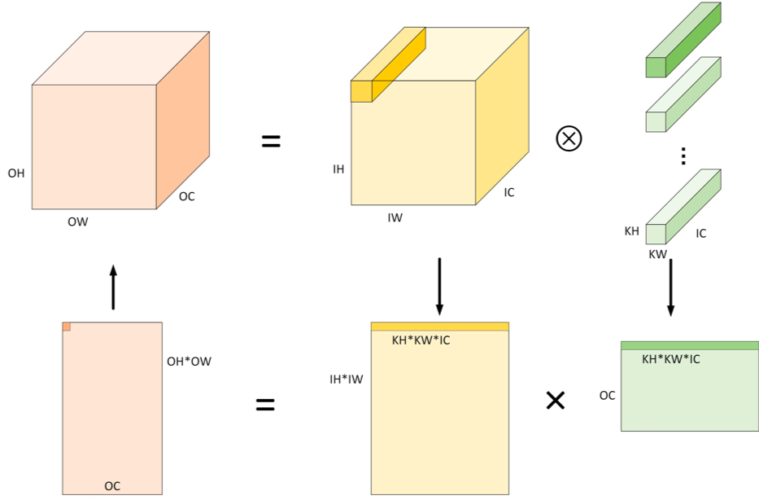
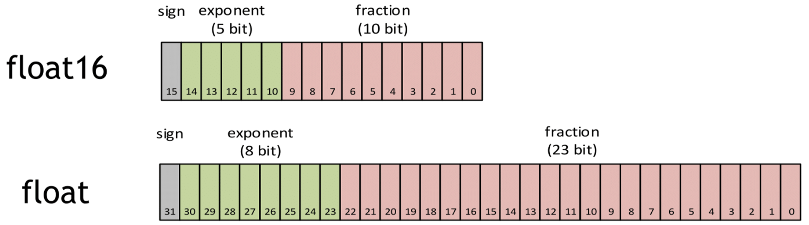
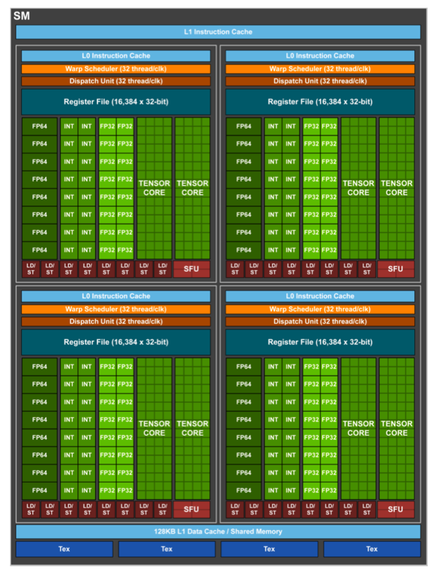

# TensorCore基本原理

在Nvidia的通用GPU架构中，存在三种主要的核心类型：CUDA Core、Tensor Core以及RT Core。其中，Tensor Core扮演着极其关键的角色。

Tensor Core 是针对深度学习和 AI 工作负载而设计的专用核心，可以实现混合精度计算并加速矩阵运算，尤其擅长处理半精度（FP16）和全精度（FP32）的矩阵乘法和累加操作。Tensor Core 在加速深度学习训练和推理中发挥着重要作用。

本节内容将通过三个层次逐步深入地探讨卷积与TensorCore之间的关系、TensorCore的基础工作原理，以及TensorCore架构的发展历程。同时结合实际代码示例，旨在帮助读者不仅能够理解在框架层面如何利用Tensor Core 实现训练加速的具体细节，还能对CUDA编程有初步的了解。这一系列内容将为读者揭开Tensor Core技术的神秘面纱，提供一个全面且条理清晰的认识。


在我们深入探讨之前，让我们先简要回顾一下Nvidia GPU架构的演变历程。

Nvidia显卡从 Tesla 架构开始，所有GPU都带有有 CUDA Core，但Tensor Core和RT Core确并非都具有。

在Fermi架构之前，GPU的处理核心一直被叫做Processor core(SPs)，随着GPU中处理核心的增加，直到2010年Nvidia的Fermi架构它被换了一个新的具有营销性的名字CUDA Core。

如上图所示，在Fermi架构中其计算核心由16个SM（Stream Multiprocesser）组成，每个SM包含2个线程束（Warp），一个Warp中包含16个Cuda Core组成，共32个CUDA Cores。每一个Cuda Core由1个浮点数单元FPU和1个逻辑运算单元ALU组成。

由于CUDA core 在显卡里面是并行运算，也就是说大家分工计算。从逻辑上说，那么CUDA core越多，算力也就相应的会越强。所以说从Fermi架构开始，2012年的Kepler架构和2014年的Maxwell架构，都在这个基础上疯狂加倍增加Cuda Core。

到了2016年的Pascal架构，Nvidia GPU也开始往深度学习方向进行演进，NVLink也是这个时候开始引入的。
到了2017年引入的Volta架构，引入了张量核Tensor Core模块，用于执行融合乘法加法，标志着第一代TensorCore核心的诞生。

自从Volta架构搭载了首代TensorCore以来，Nvidia在每一次的架构升级中都不断对TensorCore进行优化和更新，每一轮的更新都带来了新的变化和提升。接下来，我们将逐步深入介绍其原理和这些演进过程。

## 卷积计算

卷积运算是深度学习中最基本也是最关键的操作之一，尤其是在处理图像和视频相关的任务时。而TensorCore则是Nvidia推出的一种专为加速深度学习中的矩阵计算而设计的硬件加速器。要理解卷积与TensorCore之间的关系，我们需要先了解卷积运算的本质。

- CNN vs GEMM

在深度学习中，卷积运算通常指的是利用一个小的、可学习的过滤器（或称为卷积核）在输入数据（如图像）上滑动，并在每个位置计算过滤器与其覆盖区域的元素逐点相乘后的总和，这个过程可以捕捉到局部特征。对于多通道输入，卷积运算会对每个通道执行此操作，并将结果累加起来得到最终的输出。当应用于图像处理时，这种机制使得卷积网络能够有效地识别图像中的边缘、纹理等特征。

卷积神经网络CNN一般包含许多卷积层，这些层通过卷积运算提取输入数据的特征。在算法层面上，卷积运算的加速通常涉及到一个关键步骤——数据重排，即执行Im2col操作。

Im2col操作的目的是将卷积运算转换为矩阵乘法，这样做有几个显著的好处。首先，它允许利用已有的高效矩阵乘法算法（如GEMM）来加速卷积计算。其次，这种转换可以减少重复的内存访问，因为在传统的卷积运算中，同一个输入元素可能会被多个卷积核重复使用。

Im2col 是计算机视觉领域中将图片转换成矩阵的矩阵列(column)的计算过程。由于二维卷积 的计算比较复杂不易优化，因此在 AI 框架早期，Caffe 使用 Im2col 方法将三维张量转换为二维 矩阵，从而充分利用已经优化好的 GEMM 库来为各个平台加速卷积计算，如上图所示。最后，再将矩阵乘得 到的二维矩阵结果使用 Col2Im 将转换为三维矩阵输出。

Img2col 算法主要包含两个步骤，首先使用 Im2col 将输入矩阵展开一个大矩阵，矩阵每一列表示卷积核需要的一个输入数据，其次使用上面转换的矩阵进行 Matmul 运算，得到的数据就是最终卷积计算的结果。

卷积默认采用数据排布方式为NHWC，输入维度为4维(N,IH,IW,IC)，卷积核维度为( OC, KH, K W , IC)，输出维度为(N, OH, O W , OC)。



Im2col 算法计算卷积的过程，具体简化过程如下:

1. 将输入由 N×IH×IW×IC 根据卷积计算特性展开成 (OH×OW)×(N×KH×KW×IC) 形状二维矩;
阵。显然，转换后使用的内存空间相比原始输入多约 KH∗KW−1 倍;
2. 权重形状一般为 OC×KH×KW×IC 四维张量，可以将其直接作为形状为 (OC)×(KH×KW×IC) 的二维矩阵处理;
3. 对于准备好的两个二维矩阵，将 (KH×KW×IC) 作为累加求和的维度，运行矩阵乘可以得到输出矩阵 (OH×OW)×(OC);
4. 将输出矩阵 (OH×OW)×(OC) 在内存布局视角即为预期的输出张量 N×OH×OW×OC，或者使用 Col2Im 算法变为下一个算子输入 N×OH×OW×OC。

通过Im2col，输入数据被重排成一个大矩阵，而卷积权重（即卷积核）也被转换为另一个矩阵。这样，原本的卷积运算就转化为了这两个矩阵的乘法操作，如图上所示。这种转换后的矩阵乘法可以利用现代计算架构（如TensorCore）的强大计算能力，从而实现高效的计算加速。

而GEMM（General Matrix Multiply，通用矩阵乘法）是一种高效的矩阵乘法算法，它特别适合于处理大规模的矩阵运算。在将卷积转换为矩阵乘法之后，多个这样的矩阵乘法计算可以被组织成单个更大的矩阵乘法运算来执行。这种方法称为批量处理，它可以进一步提升计算效率，因为它允许同时处理多个数据样本，从而更好地利用GPU等并行计算资源。

通过Im2col操作和利用GEMM进行批量处理，卷积神经网络中的卷积层计算可以得到显著加速。这种加速不仅提高了模型训练的效率，也使得在实际应用中的推理过程更为迅速，为深度学习模型的开发和部署带来了实质性的好处。

## TensorCore基本原理

在深入探讨TensorCore及其对深度学习训练加速的作用之前，我们首先需要明确一个关键概念——混合精度训练。这个概念的理解常常困扰许多人，有些人可能会直观地认为，混合精度训练意味着在网络模型中同时使用FP16（半精度浮点数）和FP32（单精度浮点数）。

然而，这种字面上的理解并没有准确抓住混合精度训练的真正含义。

### 混合精度训练

混合精度训练实际上是一种优化技术，它通过在模型训练过程中灵活地使用不同的数值精度来达到加速训练和减少内存消耗的目的。具体来说，混合精度训练涉及到两个关键操作：

1. **计算的精度分配**：在模型的前向传播和反向传播过程中，使用较低的精度（如FP16）进行计算，以加快计算速度和降低内存使用量。由于FP16格式所需的内存和带宽均低于FP32，这可以显著提高数据处理的效率。
2. **参数更新的精度保持**：尽管计算使用了较低的精度，但在更新模型参数时，仍然使用较高的精度（如FP32）来保持训练过程的稳定性和模型的最终性能。这是因为直接使用FP16进行参数更新可能会导致训练不稳定，甚至模型无法收敛，由于FP16的表示范围和精度有限，容易出现梯度消失或溢出的问题。



而在混合精度的实现上，其通常需要特定的硬件支持和软件优化。例如，Nvidia的TensorCore就是专门设计来加速FP16计算的，同时保持FP32的累加精度，从而使得混合精度训练成为可能。在软件层面，深度学习框架如PyTorch和TensorFlow等也提供了混合精度训练的支持，通过自动化的工具简化了实现过程。可以从上图看出FP16相比于FP32，不管是从整数位还是小数位来看，它所表示的范围要小很多。


混合精度训练不仅仅是在模型中同时使用FP16和FP32那么简单，而是指在底层硬件算子层面，使用半精度(FP16)作为输入和输出，使用全精度(FP32)进行中间 结果计算从而不损失过多精度的技术。这个底层硬件层面其实指的就是 Tensor Core，所以 GPU 上有 Tensor Core 是使用混合精度训练加速的必要条件。

### 第一代TensorCore

当Nvidia的架构演进到Volta架构时，它标志着对深度学习优化的重大突破。Volta架构的一个显著特点是引入了大量的TensorCore，这一变化对于加速深度学习应用产生了革命性的影响。



在TensorCore出现之前，CUDA Core是实现深度学习加速的核心硬件技术。CUDA Core可以处理各种精度的运算。如上图 Volta架构图所示，左侧有FP64、FP32和INT32 CUDA Cores核心，右侧则是许多TensorCore核心。

- **CUDA Core**

尽管CUDA Core能够广泛地支持并行计算模式，它在执行深度学习中最常见的操作，如卷积（Conv）和矩阵乘法（GEMM），时仍然面临效率上的挑战。

具体来说，CUDA Core在执行这些操作时，需要将数据在寄存器、算术逻辑单元（ALU）和寄存器之间进行多次搬运，这种过程既耗时又低效。此外，每个CUDA Core每个时钟周期只能执行一次运算，而且CUDA Core的数量和时钟速度都有其物理限制，这些因素共同限制了深度学习计算性能的提升。

- **Tensor Core**

随着Volta架构的推出，Nvidia引入了TensorCore，这是一种专为AI训练和推理设计的可编程矩阵乘法和累加单元。V100 GPU中包含了640个TensorCore，每个流多处理器（SM）配备了8个TensorCore。相较于CUDA Core，TensorCore能够在每个时钟周期内执行更多的运算，特别是它可以高效地完成矩阵乘法和累加操作——这两种操作是深度学习中最频繁和计算密集的任务之一。

通过利用TensorCore，V100能够为AI训练和推理提供高达125 Tensor TFLOPS的算力。这种强大的性能，使得V100在处理深度学习任务时，相比于仅使用CUDA Core的早期架构，能够实现显著的加速。

### TensorCore工作原理

在具体的运算过程中，Tensor Core采用融合乘法加法（FMA）的方式来高效地处理计算任务。每个 Tensor Core 每周期能执行 **4x4x4 GEMM**，64 个 浮点乘法累加（FMA）运算。


如上图所示，在执行运算 **D=A*B+C**，其中A、B、C 和 D是 4×4 矩阵。**矩阵乘法**输入 A 和 B 是 FP16 矩阵，而**累加矩阵** C 和 D 可以是 FP16或 FP32 矩阵。

具体来说，它首先接受两个4x4的FP16精度的输入矩阵A和B，执行它们的矩阵乘法。然后，将这个乘法的结果与第三个4x4的矩阵C相加，其中矩阵C可以是FP16或FP32精度。最终，Tensor Core输出一个新的4x4矩阵D，该矩阵同样可以是FP16或FP32精度。

这也就实现了底层硬件上的混合精度计算。通过将矩阵乘法的输入限定为FP16精度，可以大幅减少所需的计算资源和内存带宽，从而加速计算。同时，通过允许累加矩阵C和输出矩阵D使用FP32精度，可以保证运算结果的准确性和数值稳定性。这种灵活的精度策略，结合Tensor Core的高效计算能力，使得在保持高性能的同时，还能有效控制深度学习模型的训练和推理过程中的资源消耗。

接下来我们再打开一层进一步探讨TensorCore的运算能力。上文我们谈到在每个 Tensor Core 每个时钟执行 64 个 FP32 FMA 混合精度运算，一个SM中一共有8个TensorCore，所以每个时钟周期内总共执行 512 个浮点运算（8个Tensor Core × 64个FMA操作/核）。

因此在 AI 应用中， Volta V100 GPU的吞吐量与Pascal P100 GPU相比，每个 SM 的 AI 吞吐量增 加了 8 倍，此外得益于Volta架构在SM数量和核心设计上的优化，总体上共增加了12倍。

### TensorCore&CUDA编程


如上图所示，在CUDA编程体系中，我们并非直接对线程进行控制，也就是图中的弯弯的线，而是通过控制一个Warp，一个Warp包含很多线程（通常为32个线程），这些线程同时并行执行，利用GPU的并行计算能力。

在实际执行过程中，CUDA会对Warp进行同步操作，确保其中的所有线程都达到同步点，并获取相同的数据。然后，这些线程将一起执行矩阵相乘和其他计算操作，通常以16x16的矩阵块为单位进行计算。最终，计算结果将被存储回不同的Warp中，以便后续处理或输出。

我们可以把Warp理解为软件上的一个大的线程概念。它帮助简化了对GPU并行计算资源的管理和利用。通过有效地利用Warp的并行性，CUDA程序可以实现高效、快速的并行计算。

在CUDA程序执行过程中，我们可以通过线程的Warp来调度Tensor Core的执行。多个Tensor Core可以同时通过Warp内的线程来执行计算任务，利用Tensor Core提供的高性能矩阵运算能力。每个Warp内的线程可以利用Tensor Core执行16x16x16的矩阵运算，充分发挥GPU的计算潜能。

```c
template<typename Use, int m, int n, int k, typename T, typename Layout=void> class fragment;

void load_matrix_sync(fragment<...> &a, const T* mptr, unsigned ldm);
void load_matrix_sync(fragment<...> &a, const T* mptr, unsigned ldm, layout_t layout);
void store_matrix_sync(T* mptr, const fragment<...> &a, unsigned ldm, layout_t layout);
void fill_fragment(fragment<...> &a, const T& v);
void mma_sync(fragment<...> &d, const fragment<...> &a, const fragment<...> &b, const fragment<...> &c, bool satf=false);

```
- fragment：Tensor Core数据存储类，支持matrix_a、matrix_b和accumulator
- load_matrix_sync：Tensor Core数据加载API，支持将矩阵数据从global memory或shared memory加载到fragment
- store_matrix_sync：Tensor Core结果存储API，支持将计算结果从fragment存储到global memory或shared memory
- fill_fragment：fragment填充API，支持常数值填充
- mma_sync：Tensor Core矩阵乘计算API，支持D = AB + C或者C = AB + C

CUDA通过**CUDA C++ WMMA API**向外提供了Tensor Core在Warp级别上的计算操作支持。这些C++接口提供了专门用于矩阵加载、矩阵乘法和累加、以及矩阵存储等操作的功能。例如上图所示代码中，其中的`mma_sync`就是执行具体计算的API接口。借助这些API，开发者可以高效地利用Tensor Core进行深度学习中的矩阵计算，从而加速神经网络模型的训练和推理过程。

在上文，我们提到一个Tensor Core每个周期可以执行4x4x4的GEMM（General Matrix Multiply）运算。然而，在CUDA的层面，为什么其却提供了使用16x16x16的GEMM运算API呢？


事实上，如果我们整体来看，如上图所示，一个Tensor Core是一个4x4的TensorCore核心。但实际上，在一个SM（Streaming Multiprocessor）中有多个Tensor Core，我们无法对每个Tensor Core进行细粒度的控制，否则效率会很低。因此，一个Warp就扮演了重要角色，将多个Tensor Core打包在一起，以执行更大规模的计算任务。

通过Warp层的卷积指令，CUDA向外提供了一个16x16x16的抽象层，使得开发者可以通过一条指令完成多个Tensor Core的协同工作，实现高效的并行计算。这条指令也即我们之前提到的`mma_sync` API，它允许开发者利用Warp内的线程同时调度多个Tensor Core执行矩阵乘加操作，从而提高GPU计算的效率和性能。

那么现在有一个问题， Tensor Core 是如何跟卷积计算或者 GEMM 计算之间进行映射的呢?

例如GPU中的Tensor Core 一次仅仅只有4x4这么小的kernel，怎么处理 input image 224*224，kernel 7 * 7 的GEMM计算呢? 

或者说在现在大模型时代，其是怎么处理Transformer结构inputembedding为2048*2048，hiddensize为1024*1024的GEMM呢?

上文我们已经提到，卷积运算可以被转化为矩阵乘法操作，这一点是连接卷积和TensorCore的桥梁。


在实际执行过程中，如上图中所示，蓝色矩阵和黄色矩阵的片段会被取出进行计算，即所谓的 Fragment。这些 Fragment 进行计算后形成 Fragment block，而这些Fragment block在CUDA编程模型中就是通过线程块（Thread block）的来组织执行的。在线程块内部的计算过程中，会进一步提取部分数据形成 Warp level级别的计算，Warp level的计算其实还是很大，于是在Fragment执行时会将其变为满足我们Tensor Core和矩阵输入的计算了。

因此简单总结一下，从简单的矩阵乘到实际硬件执行阶段，会把矩阵数据的一部分，根据硬件的多级缓存架构分别放在Block、Warp和Thread里面，最终通过线程的Block提供TensorCore的核心计算。

## 本节视频

<html>
<iframe src="https://www.bilibili.com/video/BV1aL411a71w/?spm_id_from=333.999.0.0&vd_source=997b612028a4d9f90d4179eb93284d60" width="100%" height="500" scrolling="no" border="0" frameborder="no" framespacing="0" allowfullscreen="true"> </iframe>
</html>
