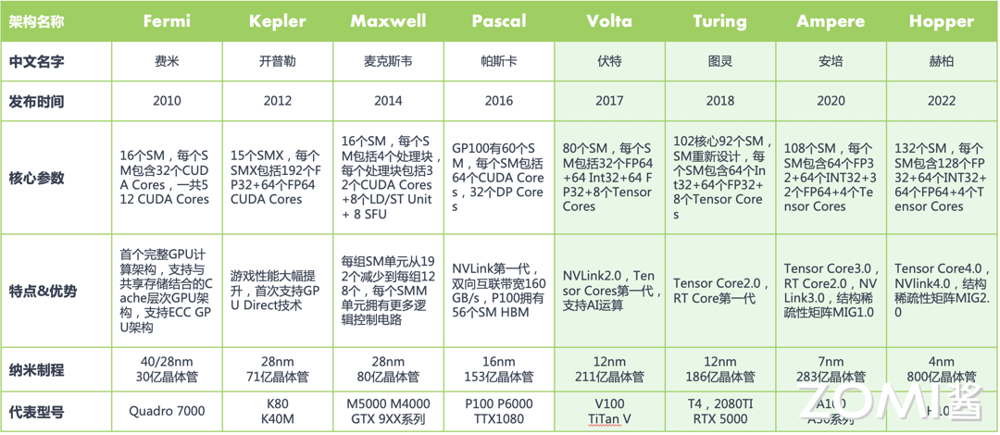
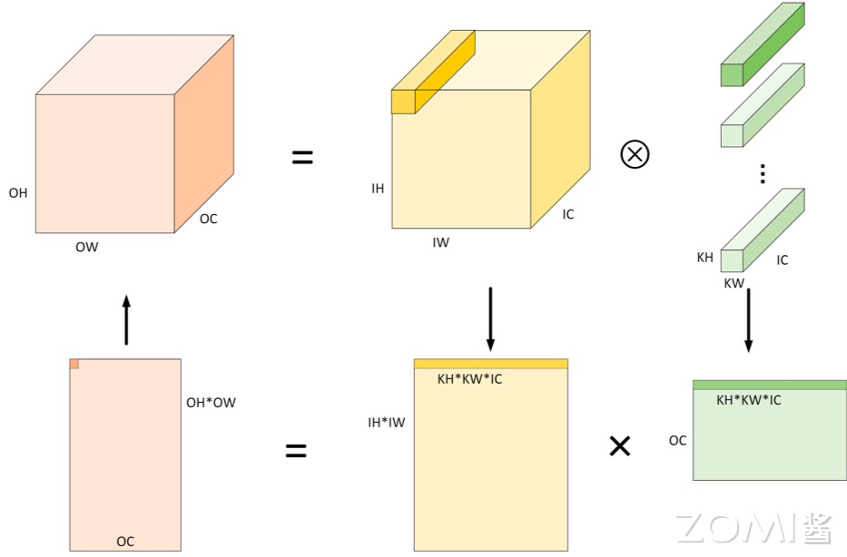
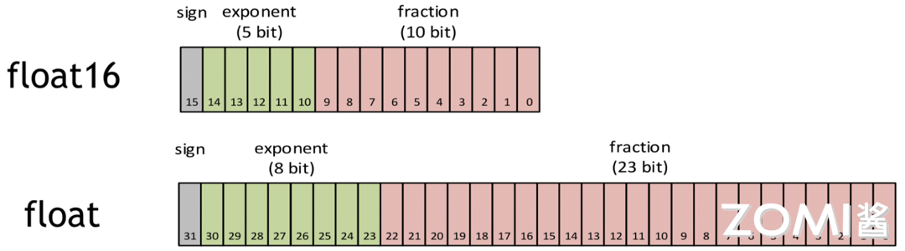
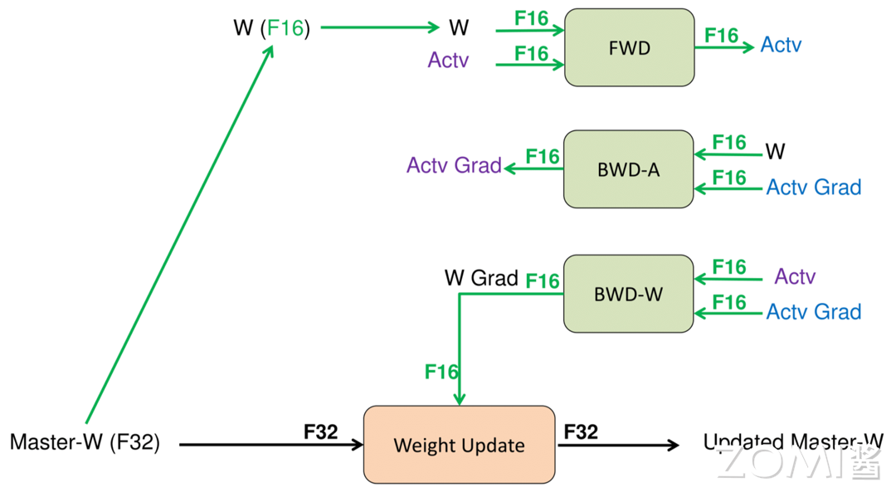
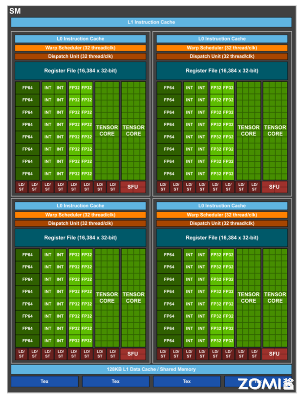
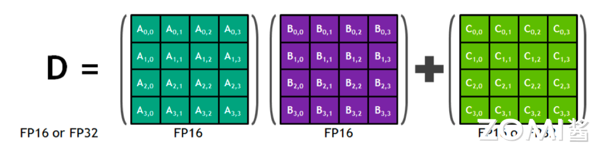
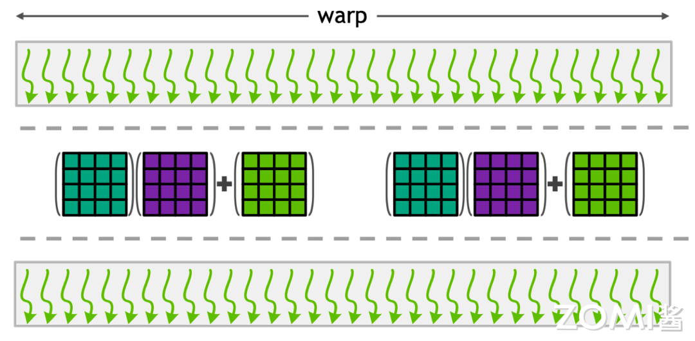
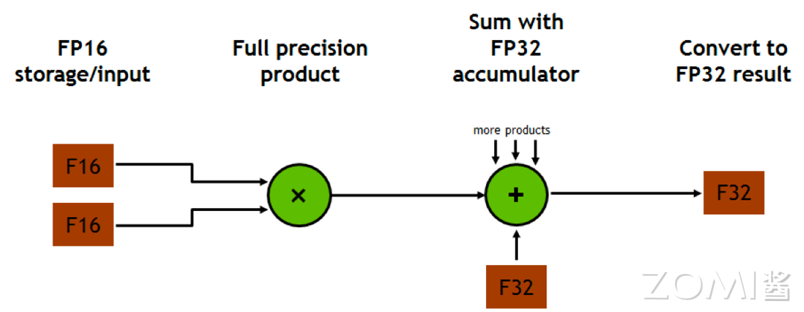
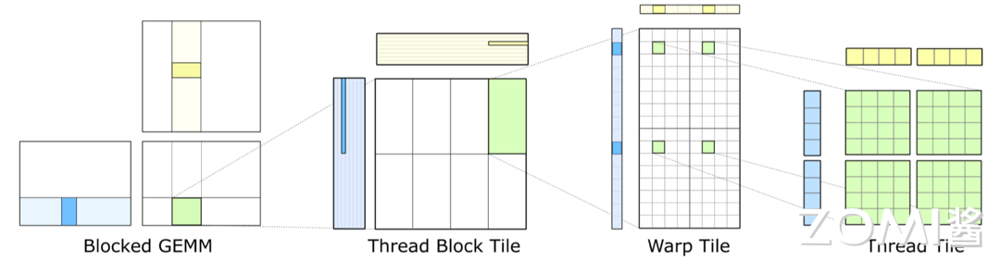

<!--Copyright 适用于[License](https://github.com/chenzomi12/AISystem)版权许可-->

# Tensor Core 基本原理

在英伟达的通用 GPU 架构中，主要存在三种核心类型：CUDA Core、Tensor Core 以及 RT Core。其中，Tensor Core 扮演着极其关键的角色。

Tensor Core 是针对深度学习和 AI 工作负载而设计的专用核心，可以实现混合精度计算并加速矩阵运算，尤其擅长处理半精度（FP16）和全精度（FP32）的矩阵乘法和累加操作。Tensor Core 在加速深度学习训练和推理中发挥着重要作用。

本节内容将通过三个层次逐步深入地探讨卷积与 Tensor Core 之间的关系、Tensor Core 的基础工作原理，以及 Tensor Core 架构的发展历程。同时结合实际代码示例，旨在帮助读者不仅能够理解在框架层面如何利用 Tensor Core 实现训练加速的具体细节，还能对 CUDA 编程有初步的了解。

这一系列内容将为读者揭开 Tensor Core 技术的神秘面纱，提供一个全面且条理清晰的认识。

## 发展历程

在我们深入探讨之前，先简要回顾一下英伟达 GPU 架构的演变历程。2006 年，英伟达发布 Tesla 架构，从此所有 GPU 都带有 CUDA Core，2017 年在 Volta 架构中首次提出 Tensor Core，2018 年在 Turing 架构中首次提出 RT Core。

在 GPU 中，处理核心通常被称为处理单元或处理器核心，用于执行计算任务。在英伟达的 GPU 架构中，在 Fermi 架构之前，处理核心被称为 Stream Processor（SPs）。这些 SPs 是用于执行并行计算任务的小型处理器，每个 SP 可以执行一个线程的计算任务。

2010 年，在 Fermi 架构中，英伟达对处理核心进行了改进和调整，引入了新的设计和特性，包括更好的线程调度和管理机制，更高效的内存访问模式，以及更多的可编程功能。在 Fermi 架构之后，英伟达将处理核心更名为 CUDA 核心，以强调其与 CUDA（计算统一设备架构）编程模型的紧密集成。

如图所示，在 Fermi 架构中其计算核心由 16 个 SM（Stream Multiprocessor）组成，每个 SM 包含 2 个线程束（Warp），一个 Warp 中包含 16 个 Cuda Core，共 32 个 CUDA Cores。每一个 Cuda Core 由 1 个浮点数单元 FPU 和 1 个逻辑运算单元 ALU 组成。



由于 CUDA Core 在显卡里面是并行运算，也就是说大家分工计算。从逻辑上说，CUDA Core 越多，算力也就相应越强。所以说从 Fermi 架构开始，2012 年的 Kepler 架构和 2014 年的 Maxwell 架构，都在这个基础上疯狂加倍增加 Cuda Core。

到了 2016 年的 Pascal 架构，英伟达 GPU 开始往深度学习方向进行演进，NVLink 也是这个时候开始引入的。2017 年提出的 Volta 架构，引入了张量核 Tensor Core 模块，用于执行融合乘法加法，标志着第一代 Tensor Core 核心的诞生。

自从 Volta 架构搭载了首代 Tensor Core 以来，英伟达在每一次的架构升级中都不断对 Tensor Core 进行优化和更新，每一轮的更新都带来了新的变化和提升。接下来，我们将逐步深入介绍其原理和这些演进过程。

## 卷积计算

卷积运算是深度学习和神经网络中常用的一种操作，用于从输入数据中提取特征。卷积操作通常用于处理图像数据，但也可以应用于其他类型的数据，如语音、文本等。在深度学习中，卷积运算通常与激活函数（如 ReLU）、池化层等结合使用，构成卷积神经网络（CNN），用于提取并学习数据中的特征，从而实现图像识别、分类、分割等任务。Tensor Core 则是英伟达推出的一种专为加速深度学习中的矩阵计算而设计的硬件加速器，要理解卷积与 Tensor Core 之间的关系，我们需要先了解卷积运算的本质。

### CNN vs GEMM

在深度学习中，卷积运算通常指的是利用一个小的、可学习的过滤器（或称为卷积核）在输入数据（如图像）上滑动，并在每个位置计算过滤器与其覆盖区域的元素逐点相乘后的总和，这个过程可以捕捉到局部特征。对于多通道输入，卷积运算会对每个通道执行此操作，并将结果累加起来得到最终的输出。当应用于图像处理时，这种机制使得卷积网络能够有效地识别图像中的边缘、纹理等特征。

卷积神经网络 CNN 一般包含许多卷积层，这些层通过卷积运算提取输入数据的特征。在算法层面上，卷积运算的加速通常涉及到一个关键步骤——数据重排，即执行 Im2Col 操作。

Im2Col 操作的目的是将卷积运算转换为矩阵乘法，这样做有几个显著的好处。首先，它允许利用已有的高效矩阵乘法算法（如 GEMM，General Matrix Multiply）来加速卷积计算。其次，这种转换可以减少重复的内存访问，因为在传统的卷积运算中，同一个输入元素可能会被多个卷积核重复使用。

Im2Col 是计算机视觉领域中将图片转换成矩阵的矩阵列（Column）的计算过程。由于二维卷积的计算比较复杂不易优化，因此在 AI 框架早期，Caffe 使用 Im2Col 方法将三维张量转换为二维矩阵，从而充分利用已经优化好的 GEMM 库来为各个平台加速卷积计算。最后，再将矩阵乘得到的二维矩阵结果使用 Col2Im 将转换为三维矩阵输出。

Img2col 算法主要包含两个步骤，首先使用 Im2Col 将输入矩阵展开为一个大矩阵，矩阵每一列表示卷积核需要的一个输入数据，其次使用上面转换的矩阵进行 Matmul 运算，得到的数据就是最终卷积计算的结果。

卷积默认采用数据排布方式为 NHWC，输入维度为 4 维 (N, IH, IW, IC)，卷积核维度为(OC, KH, KW , IC)，输出维度为(N, OH, OW , OC)。



Im2Col 算法计算卷积的过程，具体简化过程如下:

1. 将输入由 $N×IH×IW×IC$ 根据卷积计算特性展开成 $(OH×OW)×(N×KH×KW×IC)$ 形状二维矩阵。显然，转换后使用的内存空间相比原始输入多约 $KH \times KW−1$ 倍;
2. 权重形状一般为 $OC×KH×KW×IC$ 四维张量，可以将其直接作为形状为 $(OC)×(KH×KW×IC)$ 的二维矩阵处理;
3. 对于准备好的两个二维矩阵，将 $(KH×KW×IC)$ 作为累加求和的维度，运行矩阵乘可以得到输出矩阵 $(OH×OW)×(OC)$;
4. 将输出矩阵 $(OH×OW)×(OC)$ 在内存布局视角即为预期的输出张量 $N×OH×OW×OC$，或者使用 Col2Im 算法变为下一个算子输入 $N×OH×OW×OC$。

通过 Im2Col，输入数据被重排成一个大矩阵，而卷积权重（即卷积核）也被转换为另一个矩阵。这样，原本的卷积运算就转化为了这两个矩阵的乘法操作，如图上所示。这种转换后的矩阵乘法可以利用现代计算架构（如 Tensor Core）的强大计算能力，从而实现高效的计算加速。

而 GEMM（General Matrix Multiply，通用矩阵乘法）是一种高效的矩阵乘法算法，它特别适合于处理大规模的矩阵运算。在将卷积转换为矩阵乘法之后，多个这样的矩阵乘法计算可以被组织成单个更大的矩阵乘法运算来执行。这种方法称为批量处理，它可以进一步提升计算效率，因为它允许同时处理多个数据样本，从而更好地利用 GPU 等并行计算资源。

通过 Im2Col 操作和利用 GEMM 进行批量处理，卷积神经网络中的卷积层计算可以得到显著加速。这种加速不仅提高了模型训练的效率，也使得在实际应用中的推理过程更为迅速，为神经网络模型的开发和部署带来了实质性的好处。

### 混合精度训练

在深入探讨 Tensor Core 及其对深度学习训练加速的作用之前，我们首先需要明确一个关键概念———混合精度训练。这个概念的理解常常困扰许多人，有些人可能会直观地认为，混合精度训练意味着在网络模型中同时使用 FP16（半精度浮点数）和 FP32（单精度浮点数）。然而，这种字面上的理解并没有准确抓住混合精度训练的真正含义。

混合精度训练实际上是一种优化技术，它通过在模型训练过程中灵活地使用不同的数值精度来达到加速训练和减少内存消耗的目的。具体来说，混合精度训练涉及到两个关键操作：

1. **计算的精度分配**：在模型的前向传播和反向传播过程中，使用较低的精度（如 FP16）进行计算，以加快计算速度和降低内存使用量。由于 FP16 格式所需的内存和带宽均低于 FP32，这可以显著提高数据处理的效率。

2. **参数更新的精度保持**：尽管计算使用了较低的精度，但在更新模型参数时，仍然使用较高的精度（如 FP32）来保持训练过程的稳定性和模型的最终性能。这是因为直接使用 FP16 进行参数更新可能会导致训练不稳定，甚至模型无法收敛，由于 FP16 的表示范围和精度有限，容易出现梯度消失或溢出的问题。

另外，混合精度训练中通常还会使用损失缩放（loss scaling）技术来对于 loss 进行一定倍数的放大，该放大倍数会进一步作用到梯度上，从而尽量避免训练后期由于梯度过小导致的数值下溢出问题，使得模型参数更新保持稳定。

具体而言，混合精度训练每一轮更新的流程如下：
- 将 FP32 的权重转为 FP16，得到一个 FP16 的权重版本用于前向传播过程，同时依然保留 FP32 的权重作为用于后续参数更新的副本。
- Forward 过程使用较低精度进行计算：将 FP16 的激活值（activation）通过 FP16 的各层权重，最终得到 FP16 的 loss。
- Loss Scaling：将 FP16 的 loss 放大若干倍。
- 反向传播：使用放大后的 FP16 loss 进行反向传播，得到 FP16 的梯度（这里的梯度值相比于实际梯度值也是放大后的，其 scale 的倍数等同于上一步 loss scale 的倍数）。由于此时的梯度值是放大后的，因此即便使用 FP16 保存一般也不会出现下溢出问题。
- Gradient Upscaling：将 FP16 的梯度转为 FP32，然后进行反缩放（unscale），得到 FP32 的实际梯度值。这个实际梯度值可能非常小，但此时由于其使用 FP32 进行保存，因此也避免了下溢出问题。
- 最终，使用 FP32 的实际梯度来更新 FP32 的权重副本。




而在混合精度的实现上，其通常需要特定的硬件支持和软件优化。例如，英伟达的 Tensor Core 就是专门设计来加速 FP16 计算的，同时保持 FP32 的累加精度，从而使得混合精度训练成为可能。在软件层面，AI 框架如 PyTorch 和 MindSpore 等也提供了混合精度训练的支持，通过自动化的工具简化了实现过程。可以从上图看出 FP16 相比于 FP32，不管是从整数位还是小数位来看，它所表示的范围要小很多。



混合精度训练不仅仅是在模型中同时使用 FP16 和 FP32 那么简单，而是指在底层硬件算子层面，使用半精度(FP16)作为输入和输出，使用全精度(FP32)进行中间结果计算从而不损失过多精度的技术。这个底层硬件层面其实指的就是 Tensor Core，所以 GPU 上具备 Tensor Core 是使用混合精度训练加速的必要条件。

## 基本原理

### 初代 Tensor Core

当英伟达的架构演进到 Volta 架构时，标志着深度学习优化的重大突破。Volta 架构的一个显著特点是引入了大量的 Tensor Core，这一变化对于加速深度学习应用产生了革命性的影响。



在 Tensor Core 出现之前，CUDA Core 是实现深度学习加速的核心硬件技术。CUDA Core 可以处理各种精度的运算。如上图 Volta 架构图所示，左侧有 FP64、FP32 和 INT32 CUDA Cores 核心，右侧则是许多 Tensor Core 核心。

- **CUDA Core**

尽管 CUDA Core 能够广泛地支持并行计算模式，它在执行深度学习中最常见的操作，如卷积（Conv）和矩阵乘法（GEMM）时仍然面临效率上的挑战。

具体来说，CUDA Core 在执行这些操作时，需要将数据在寄存器、算术逻辑单元（ALU）和寄存器之间进行多次搬运，这种过程既耗时又低效。此外，每个 CUDA Core 单个时钟周期只能执行一次运算，而且 CUDA Core 的数量和时钟速度都有其物理限制，这些因素共同限制了深度学习计算性能的提升。

- **Tensor Core**

随着 Volta 架构的推出，英伟达引入了 Tensor Core，这是一种专为 AI 训练和推理设计的可编程矩阵乘法和累加单元。V100 GPU 中包含了 640 个 Tensor Core，每个流多处理器（SM）配备了 8 个 Tensor Core。相较于 CUDA Core，Tensor Core 能够在每个时钟周期内执行更多的运算，特别是它可以高效地完成矩阵乘法和累加操作，这两种操作是深度学习中最频繁和计算密集的任务之一。

通过利用 Tensor Core，V100 能够为 AI 训练和推理提供高达 125 Tensor TFLOPS 的算力。这种强大的性能，使得 V100 在处理深度学习任务时，相比于仅使用 CUDA Core 的早期架构，能够实现显著的加速。

### Tensor Core 工作原理

在具体的运算过程中，Tensor Core 采用融合乘法加法（FMA）的方式来高效地处理计算任务。每个 Tensor Core 每周期能执行 **4x4x4 GEMM**，64 个浮点乘法累加（FMA）运算。



如上图所示，在执行运算 **D=A*B+C**，其中 A、B、C 和 D 是 4×4 矩阵。**矩阵乘法**输入 A 和 B 是 FP16 矩阵，而**累加矩阵** C 和 D 可以是 FP16 或 FP32 矩阵。

具体来说，它首先接受两个 4x4 的 FP16 精度的输入矩阵 A 和 B，执行它们的矩阵乘法。然后，将这个乘法的结果与第三个 4x4 的矩阵 C 相加，其中矩阵 C 可以是 FP16 或 FP32 精度。最终，Tensor Core 输出一个新的 4x4 矩阵 D，该矩阵同样可以是 FP16 或 FP32 精度。

这也就实现了底层硬件上的混合精度计算。通过将矩阵乘法的输入限定为 FP16 精度，可以大幅减少所需的计算资源和内存带宽，从而加速计算。同时，通过允许累加矩阵 C 和输出矩阵 D 使用 FP32 精度，可以保证运算结果的准确性和数值稳定性。这种灵活的精度策略，结合 Tensor Core 的高效计算能力，使得在保持高性能的同时，还能有效控制神经网络模型的训练和推理过程中的资源消耗。

接下来我们再打开一层进一步探讨 Tensor Core 的运算能力。上文我们谈到在每个 Tensor Core 每个时钟执行 64 个 FP32 FMA 混合精度运算，一个 SM 中一共有 8 个 Tensor Core，所以每个时钟周期内总共执行 512 个浮点运算（8 个 Tensor Core × 64 个 FMA 操作/核）。

因此在 AI 应用中，Volta V100 GPU 的吞吐量与 Pascal P100 GPU 相比，每个 SM 的 AI 吞吐量提高 8 倍，此外得益于 Volta 架构在 SM 数量和核心设计上的优化，总体上共提高 12 倍。

### Tensor Core 与 CUDA 编程

如图所示，在 CUDA 编程体系中，我们并非直接对线程进行控制，也就是图中的弯弯的线，而是通过控制一个 Warp，一个 Warp 包含很多线程（通常为 32 个线程），这些线程同时并行执行，利用 GPU 的并行计算能力。



在实际执行过程中，CUDA 会对 Warp 进行同步操作，确保其中的所有线程都达到同步点，并获取相同的数据。然后，这些线程将一起执行矩阵相乘和其他计算操作，通常以 16x16 的矩阵块为单位进行计算。最终，计算结果将被存储回不同的 Warp 中，以便后续处理或输出。

我们可以把 Warp 理解为软件上的一个大的线程概念，它帮助简化了对 GPU 并行计算资源的管理和利用。通过有效地利用 Warp 的并行性，CUDA 程序可以实现高效、快速的并行计算。

在 CUDA 程序执行过程中，我们可以通过线程的 Warp 来调度 Tensor Core 的执行。多个 Tensor Core 可以同时通过 Warp 内的线程来执行计算任务，利用 Tensor Core 提供的高性能矩阵运算能力。每个 Warp 内的线程可以利用 Tensor Core 执行 16x16x16 的矩阵运算，充分发挥 GPU 的计算潜能。

```c
template<typename Use, int m, int n, int k, typename T, typename Layout=void> class fragment;

void load_matrix_sync(fragment<...> &a, const T* mptr, unsigned ldm);
void load_matrix_sync(fragment<...> &a, const T* mptr, unsigned ldm, layout_t layout);
void store_matrix_sync(T* mptr, const fragment<...> &a, unsigned ldm, layout_t layout);
void fill_fragment(fragment<...> &a, const T& v);
void mma_sync(fragment<...> &d, const fragment<...> &a, const fragment<...> &b, const fragment<...> &c, bool satf=false);
```

其中：

- `fragment`：Tensor Core 数据存储类，支持 `matrix_a`、`matrix_b` 和 `accumulator`；

- `load_matrix_sync`：Tensor Core 数据加载 API，支持将矩阵数据从 global memory 或 shared memory 加载到 fragment；

- `store_matrix_sync`：Tensor Core 结果存储 API，支持将计算结果从 fragment 存储到 global memory 或 shared memory；

- `fill_fragment`：fragment 填充 API，支持常数值填充；

- `mma_sync`：Tensor Core 矩阵乘计算 API，支持 $D = AB + C$ 或者 $C = AB + C$。

CUDA 通过 **CUDA C++ WMMA API** 向外提供了 Tensor Core 在 Warp 级别上的计算操作支持。这些 C++ 接口提供了专门用于矩阵加载、矩阵乘法和累加、以及矩阵存储等操作的功能。例如上图所示代码中，其中的 `mma_sync` 就是执行具体计算的 API 接口。借助这些 API，开发者可以高效地利用 Tensor Core 进行深度学习中的矩阵计算，从而加速神经网络模型的训练和推理过程。

一个 Tensor Core 每个周期可以执行 4x4x4 的 GEMM 运算。然而，在 CUDA 的层面，为什么提供了使用 16x16x16 的 GEMM 运算 API 呢？



事实上，如果我们整体来看，如上图所示，一个 Tensor Core 是一个 4x4 的 Tensor Core 核心。但实际上，在一个 SM（Streaming Multiprocessor）中有多个 Tensor Core，我们无法对每个 Tensor Core 进行细粒度的控制，否则效率会很低。因此，一个 Warp 就扮演了重要角色，将多个 Tensor Core 打包在一起，以执行更大规模的计算任务。

通过 Warp 层的卷积指令，CUDA 向外提供了一个 16x16x16 的抽象层，使得开发者可以通过一条指令完成多个 Tensor Core 的协同工作，实现高效的并行计算。这条指令也即我们之前提到的 `mma_sync` API，它允许开发者利用 Warp 内的线程同时调度多个 Tensor Core 执行矩阵乘加操作，从而提高 GPU 计算的效率和性能。

那么现在有一个问题，Tensor Core 是如何跟卷积计算或者 GEMM 计算之间进行映射的呢?

例如 GPU 中的 Tensor Core 一次仅仅只有 4x4 这么小的 Kernel，怎么处理 input image $224 \times 224$，Kernel $7 \times 7$ 的 GEMM 计算呢?

或者说在现在大模型时代，Tensor Core 是怎么处理 Transformer 结构 input embedding 为 $2048 \times 2048$，hidden size 为 $1024 \times 1024$ 的 GEMM 呢?

上文我们已经提到，卷积运算可以被转化为矩阵乘法操作，这一点是连接卷积和 Tensor Core 的桥梁。



在实际执行过程中，如上图中所示，蓝色矩阵和黄色矩阵的片段会被取出进行计算，即所谓的 Fragment。这些 Fragment 进行计算后形成 Fragment block，而这些 Fragment block 在 CUDA 编程模型中就是通过线程块（Thread block）的来组织执行的。在线程块内部的计算过程中，会进一步提取部分数据形成 Warp level 级别的计算，Warp level 的计算其实还是很大，于是在 Fragment 执行时会将其变为满足我们 Tensor Core 和矩阵输入的计算了。

## 小结与思考

- Tensor Core 的核心作用：Tensor Core 是英伟达 GPU 中专门设计用于加速深度学习和 AI 任务的硬件单元，通过混合精度计算优化了矩阵乘法和累加操作的性能。

- Tensor Core 的技术演进：自 Volta 架构首次引入后，Tensor Core 在英伟达 GPU 架构的后续迭代中不断得到优化，增加了支持的计算精度并提升了运算能力，以满足日益增长的 AI 计算需求。

- Tensor Core 的工作机制：利用融合乘法加法（FMA）技术，Tensor Core 能在单周期内完成大量 FP16 矩阵乘法和 FP32 累加操作，通过 CUDA 编程模型中的 Warp 调度实现高效并行计算，加速神经网络模型的训练和推理过程。

## 本节视频

<html>
<iframe src="https://player.bilibili.com/player.html?isOutside=true&aid=443246021&bvid=BV1aL411a71w&cid=1117347546&p=1&as_wide=1&high_quality=1&danmaku=0&t=30&autoplay=0" width="100%" height="500" scrolling="no" border="0" frameborder="no" framespacing="0" allowfullscreen="true"> </iframe>
</html>
