<!--Copyright 适用于[License](https://github.com/chenzomi12/AISystem)版权许可-->

# Tensor Core 深度剖析

Tensor Core 是用于加速深度学习计算的关键技术，其主要功能是执行神经网络中的矩阵乘法和卷积运算。通过利用混合精度计算和张量核心操作，Tensor Core 能够在较短的时间内完成大量矩阵运算，从而显著加快神经网络模型的训练和推断过程。具体来说，Tensor Core 采用半精度(FP16)作为输入和输出，并利用全精度(FP32)进行存储中间结果计算，以确保计算精度的同时最大限度地提高计算效率。

与传统的 CUDA Core 相比，Tensor Core 在每个时钟周期能执行多达 4x4x4 的 GEMM（general matrix multiply）运算，相当于同时进行 64 个浮点乘法累加（FMA）运算。这种并行计算的方式极大地提高了计算速度，使得神经网络模型的训练和推断能够更加高效地进行。

## 计算原理

首先来回顾一下 Tensor Core 的计算原理，如图所示，深绿色的矩阵是一个 4x4 的矩阵 A，紫色的矩阵是一个 4x4 的矩阵 B，两个矩阵相乘再加上一个绿色的矩阵 C。所谓混合精度就是指在计算的过程当中使用 FP16 去计算，但是存储的时候使用 FP32 或者 FP16 进行存储。

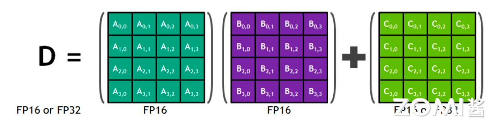

通常在真实的数学计算时，是把矩阵 A 的一行乘以矩阵 B 的一列然后再加上矩阵 C 的单独一个元素得到 D 矩阵的一个元素，其公式如下所示。

$$
D_{0,0} = A_{0,0} * B_{0,0} + A_{0,1} * B_{1,0} + A_{0,2} * B_{2,0} + A_{0,3} * B_{3,0} + C_{0,0}
$$

然而在英伟达的 GPU Tensor Core 中并不是一行一行的计算，而是整个矩阵进行计算，我们可以看看官方给出的 Tensor Core 的计算模拟图。

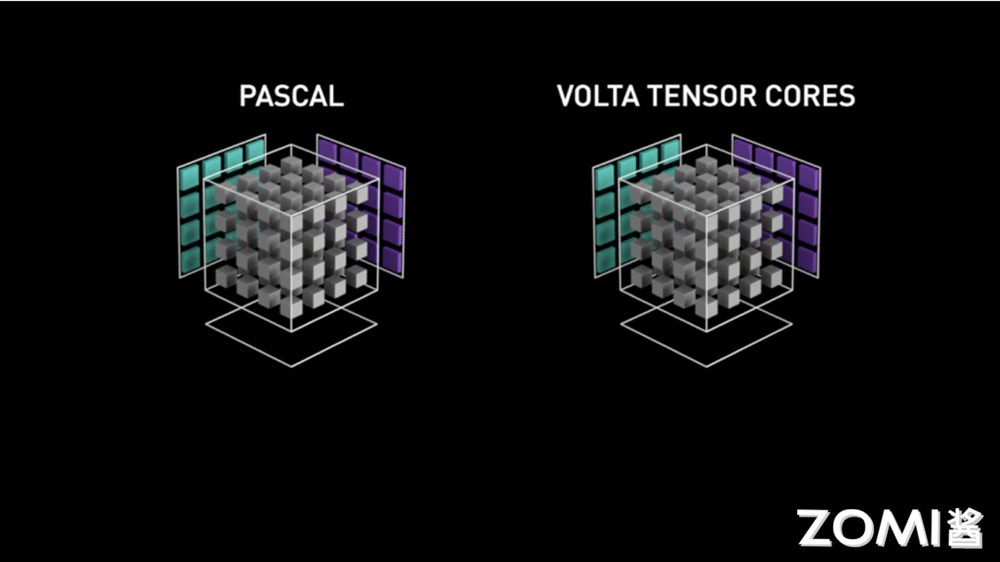

如上图所示，左边为没有 Tensor Core 的 Pascal 架构，其运行原理是一个元素跟一行进行相乘，每个时钟周期执行 4 次相乘得到一列的数据。右边则为具有 Tensor Core 的 Volta 的架构，其 Tensor Core 计算的过程是把整个矩阵 A 和矩阵 B 进行相乘然后得到一个矩阵的输出。

因此，Volta V100 GPU 的吞吐量与 Pascal P100 GPU 相比，每个 SM 的 AI 吞吐量提升 8 倍，此外得益于 Volta 架构在 SM 数量和核心设计上的优化，总体上提升 12 倍。

## 指令流水

指令流水是一种提高处理器执行指令效率的技术，其基本原理是将一条指令的操作分成多个细小的步骤，每个步骤由专门的电路完成。这些步骤通过流水线的方式连续执行，从而实现了指令的并行处理。

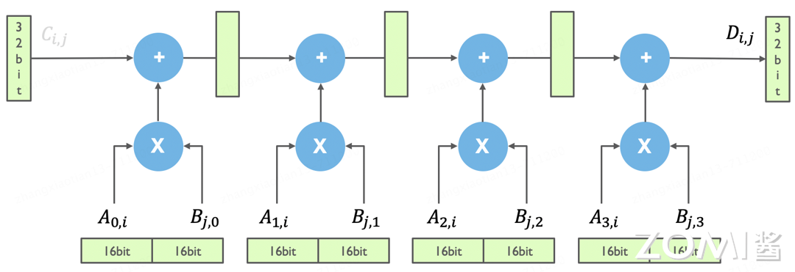

如上图所示为 Tensor Core 的模拟电路示意图，在图中有两个不同的符号，其中一个是加号（+），表示矩阵加计算操作，一个是乘号（x），表示矩阵乘计算操作，这两个是矩阵计算中的基本操作。另外，在这个电路图中，绿色长方块代表的是计算中的寄存器，下面横着的为 16 位的寄存器，用于存储输入和中间数据，竖着的为 32 位的寄存器，用于存储累积结果或中间高精度数据。

假如我们要在 Tensor Core 里面去实现上述简单的矩阵相乘计算，即把矩阵 A 的一行乘以矩阵 B 的一列（这里先假设矩阵的长度都为 4，先忽略切分矩阵的过程）。那么在这个电路示意图里，是如何实现这个计算的呢？

实际上，在 Tensor Core 计算中，其输入为 16bit 的数据，在进行乘加计算后，每一个计算都需要有一个简单 32 位寄存器来存储中间的数据，如上图所示，可以看到这些高精度存储寄存器离实际的计算是非常近的。通过这种方式，可以简单的实现 A 矩阵的一行乘以 B 矩阵的一列。

在 GPU 的 V100 里面，它实际的计算是一个矩阵跟另外一个矩阵直接相乘得到一个新的矩阵，而上面模拟电路演示的提到的只是其中一行跟其中一列进行 FMA 得到中间一个元素的过程。

那么一个矩阵中更多元素的是如何进行计算的呢？

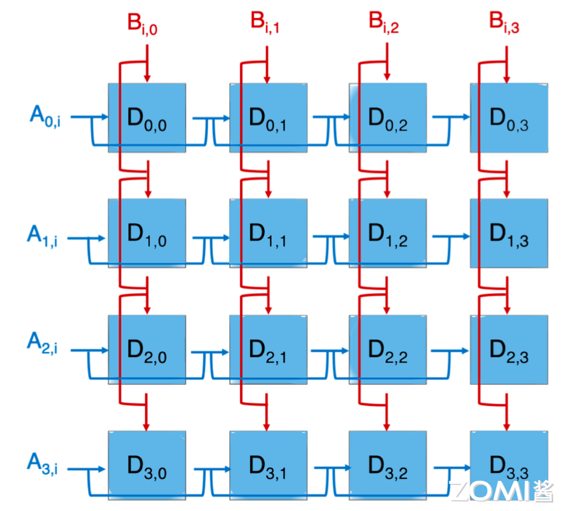

上面展示的矩阵 A 的一行跟矩阵 B 的一列进行 FMA，得到一个元素 $D_{0,0}$，即图中的第一个蓝色方块，那么整个矩阵计算时的电路图则如上图所示。它是一个简单的电路拼接，就是将 A 矩阵的每一行跟 B 矩阵的每一列进行相乘就可以得到整个矩阵的每一个元素。

那这个时候，对应 A 矩阵的寄存器，就应该是一堆寄存器，对应 B 矩阵的寄存器，也应该是一堆。这些寄存器被组织成阵列形式，以便能够并行地读取和计算。矩阵中的每一个元素都可以进行 FMA 计算，从而大大提高了计算效率。

下面我们再来了解下指令流水的 Pipline 是如何组织起来的。当我们进行一个 Fp32 标量元素乘加操作的指令时，如下图所示。

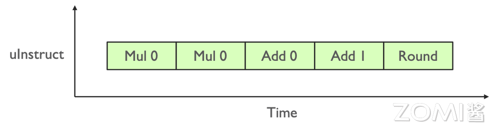

但实际上，Tensor Core 里面的乘法计算只有 Fp16，存储或者加法计算的时候是用到 Fp32 的，于是可以把刚才的一个乘法计算把它节省掉。那么如果实现两个元素相乘，就可以把两条流水并行起来，这个就是指令的流水，如下图所示。

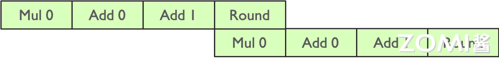

在 Tensor Core 实际计算的时候，实现输出一个元素的计算，即用 A 的一行乘以 B 的一列，就要有四条 Pipeline 的流水线。

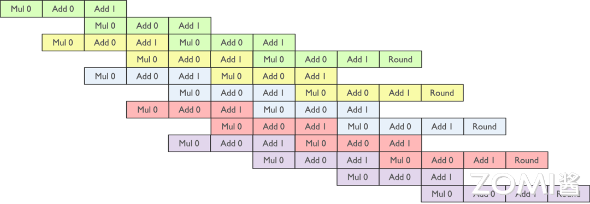

如上图所示，通过上面的绿色指令流水计算出了 $D_{0,0}$，通过黄色的流水线计算出了 $D_{0,1}$，接下来想要把所有的元素计算出来，就有大量的指令的流水去拼接。

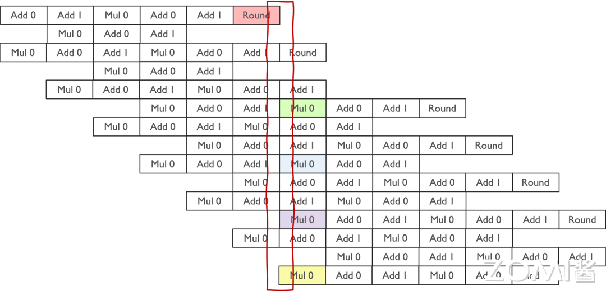

如上图所示，数据在流水线中的读写操作是有一定规律的。在乘法计算阶段，需要从存储单元中读取数据进行计算；而在计算完成后的 Round 阶段，则需要将计算结果写回存储单元。因此，在流水线的某个时刻，整个过程会涉及四个数据：从寄存器读取到计算单元的两个数据，以及计算结果存储回寄存器的两个数据。

通过大量的指令流水处理，整个 Tensor Core 的运算过程得以实现。这种流水线操作的设计使得数据的读取、计算和写入能够高效地交替进行，从而充分利用硬件资源，提升计算效率。流水线技术的运用不仅使得 Tensor Core 的计算更加快速和高效，同时也为深度学习应用提供了强大的计算支持。

## 线程执行

在整体 CUDA 软件设计方面，其目的是与 GPU 计算和存储分层结构相匹配。英伟达 CUDA 对于 Tensor Core 的定义主要是通过 CUDA 提供一种通用的编程范式，即所谓的 General Programming。为了更高效地利用 Tensor Core，CUDA 允许开发者利用通用编程模型来调用 Tensor Core 的硬件功能，以实现高效的并行计算。

假设我们 Tensor Core 中的 D = A * B + C 计算，简化为 C = A * B。在实际应用中，由于 Tensor Core 只能处理 4x4 的简单计算，不可能直接将整个大矩阵载入 Tensor Core 中进行运算。因此，需要将矩阵切片，并将其分配到 Thread Block（线程块）中。

接着，在软件层面，会定义一个 Warp（线程束），将这些切片矩阵分配给不同的 Warp。最终，通过线程的执行，实现了对矩阵乘法的并行计算，充分利用了 Tensor Core 的计算能力。这种分块、分配和并行执行的方式有效地利用了硬件资源，提高了计算效率，从而加速了深度学习和科学计算等领域的应用。

下面我们将详细展开 Tensor Core 是如何完成大的矩阵计算的。

### Block-level 矩阵乘

在 Tensor Core 中一个矩阵乘的计算，也就是所谓的 GEMM，其实一次只能计算一个小的矩阵块。在实际的运算中，也就需要把矩阵 A 切分出来一个小块，把矩阵 B 也切分出来个小块，算出来一个小的矩阵 C，如下图所示。

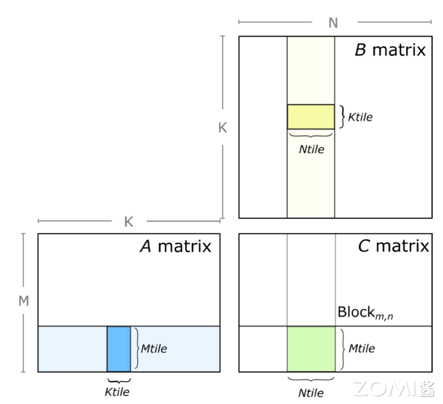

那这个时候在整体的软件编程的时，就会沿着每一个维度，如上图的 N 维和 K 维进行拆分为小的矩阵进行计算，最后对结果进行累积。

```c++
for (int mb = O; mb < M; mb += Mtile)
  for (int nb = O; nb < N; nb += NtiLe)
    for(int kb = O; kb < K; kb += Ktile)
    {
      //compute Mtile-by-Ntile-by-Ktile matrix product
      for (int k = O; k < Ktile; ++k)
        for(int i= O; i< Mtile; ++i)
          for (int j= O; j< Ntile; ++j)
          {
            int row = mb + i;
            int col = nb + j;
            C[row][col] += A[row][kb + k] * B[kb + k][col];
          }
    }
```

如上面代码所示，我们沿每个维度将循环嵌套 Loop nest 划分为块 blocks，然后划分成为 Mtile-by-Ntile 的独立矩阵乘，最后通过累积 Mtile-by-Ntile-by-Ktile 的矩阵乘积来计算每个乘积。

在 GPU 计算时，使用 CUDA Kernel grid，将 CUDA 线程块分配给输出矩阵 D 的每个分区，CUDA 线程块并行计算 Mtile-by-Ntile-by-Ktile 矩阵乘，在 K 维上进行迭代，执行累积 Mtile-by-Ntile-by-Ktile 矩阵乘的结果。可以看出这里计算主要是在线程块，也就是 Thread Block，面去进行并行计算的。

### Warp-level 矩阵乘

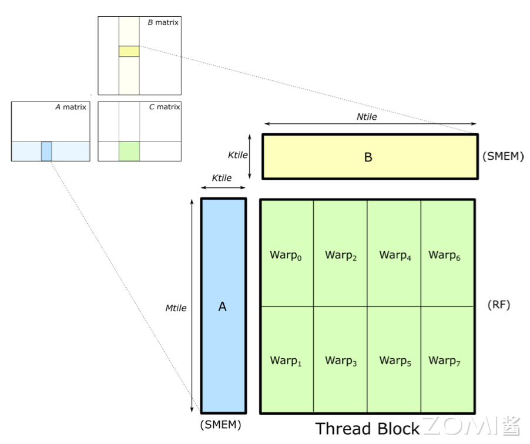

在 CUDA 编程模型中，当我们在线程块（Block）内执行矩阵乘法操作时，这些操作实际上是在 Warp 级别上被分配和执行的。Warp 是 GPU 上的一个执行单元，它由固定数量的线程（通常是 32 个线程）组成，这些线程协同工作以执行相同的指令。

在进行矩阵乘法时，为了加速计算并减少内存访问延迟，通常会将矩阵 A 和矩阵 B 的部分数据加载到共享内存（Shared Memory，简称 SMEM）中。共享内存是线程块内所有线程都可以访问的一块快速内存，它允许线程之间进行数据交换和协作，而不必每次都从全局内存（Global Memory）中读取数据。

在矩阵乘法中，每个 Warp 会负责计算结果矩阵 C 的一个或多个部分。这通常通过将结果矩阵 C 的不同块分配给不同的 Warp 来实现，每个 Warp 独立地计算其分配到的部分。由于 Warp 内的线程是同步执行的，因此它们可以共同协作，使用共享内存中的数据来完成它们的计算任务。这种分配方式充分利用了 GPU 的并行计算能力，并减少了内存访问的延迟，从而提高了矩阵乘法的性能。

当执行矩阵乘法时，Warp 中的线程会协同工作，完成一系列乘法和加法操作。这个过程涉及到从共享内存（SMEM）加载数据到寄存器（RF）进行计算，然后将结果存储回寄存器或全局内存中。

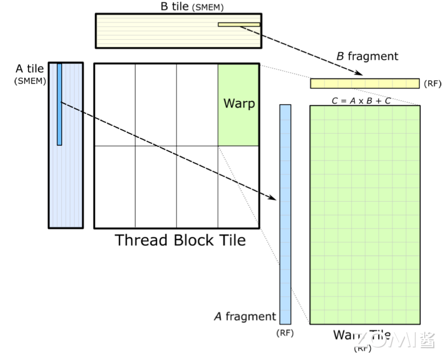

下面我们详细解释一下这个过程，首先，多个线程组成一个 Warp，协同工作以处理矩阵乘法中的一部分。这些线程共同合作，通过执行一系列乘法和加法操作，能够高效地计算出结果。

其次，为了进行计算，Warp 中的线程需要从共享内存中加载矩阵 A 和 B 的片段到它们的寄存器中。这些片段是矩阵的一小部分，加载到寄存器中可以实现快速的数据访问和计算。这要求数据从共享内存到寄存器的加载速度足够快，以避免计算线程等待数据，从而保持计算的高效性。

然后，每个线程在寄存器上执行矩阵乘法操作，计算结果矩阵 C 的一个或多个元素。这些元素暂存于线程的寄存器中，直到所有必要的乘法和加法操作完成。在计算过程中，为了最大化线程的计算效率，共享内存中的数据按照特定维度（K 维）进行排序。这种排序方式有助于减少内存访问延迟，使得线程能够更高效地访问所需的数据。

### Thread-level 矩阵乘

在 Tensor Core 里面并行执行的就是上述的形式，矩阵 A 乘以矩阵 B 等于 C 矩阵这么一个简单最核心操作。

Tensor Core 是英伟达 GPU 的硬件，CUDA 编程模型提供了 WMMA（Warp-level Matrix Multiply-Accumulate）API，这个 API 是专门为 Tensor Core 设计的，它允许开发者在 CUDA 程序中直接利用 Tensor Core 的硬件加速能力。通过 WMMA API，开发者可以执行矩阵乘法累积操作，并管理数据的加载、存储和同步。

在 GEMM（General Matrix Multiply，通用矩阵乘法）的软硬件分层中，数据复用是一个非常重要的概念。由于矩阵通常很大，包含大量的数据，因此有效地复用这些数据可以显著提高计算效率。在每一层中，都会通过不同的内存层次结构（如全局内存、共享内存和寄存器）来管理和复用数据。

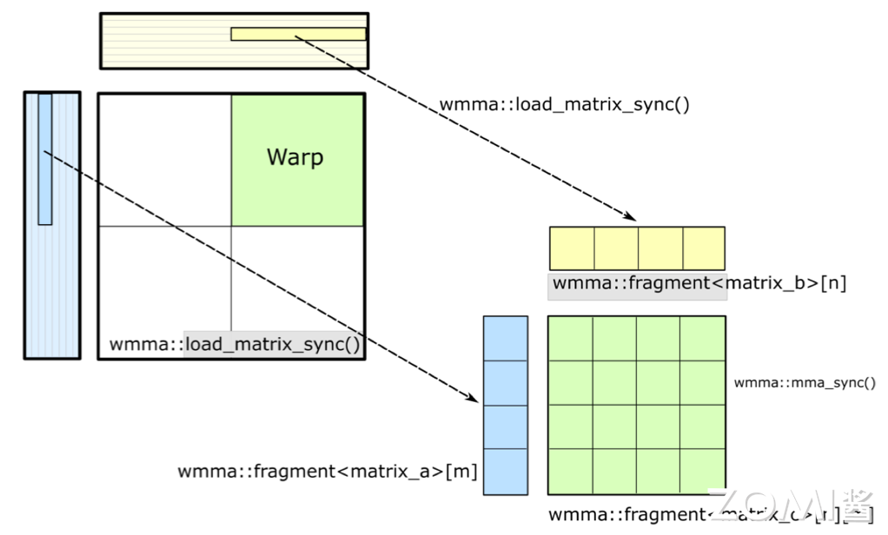

具体来说，大矩阵通常被分割成小块，并存储在全局内存中。然后，在计算过程中，这些小块数据会被加载到共享内存或寄存器中，以便进行高效的计算。通过这种方式，可以最大限度地减少内存访问延迟，并提高计算吞吐量。
在计算完每一小块矩阵乘法后，得到的结果通常也是一小块数据。为了得到最终的完整矩阵乘法结果，需要将所有小块结果累积起来。这通常涉及到将中间结果从寄存器或共享内存写回到全局内存中，并在必要时进行进一步的同步和累加操作。

最终，通过一系列这样的计算和数据管理操作，可以完成整个 GEMM 计算任务，并将结果写回到输出矩阵 C 中。整个过程充分利用了 Tensor Core 的硬件加速能力和 CUDA 编程模型的灵活性，从而实现了高效的矩阵乘法计算。

### 累积矩阵结果

下面我们再来详细展开 Tensor Core 是如何完成累积矩阵并写出最终结果的。

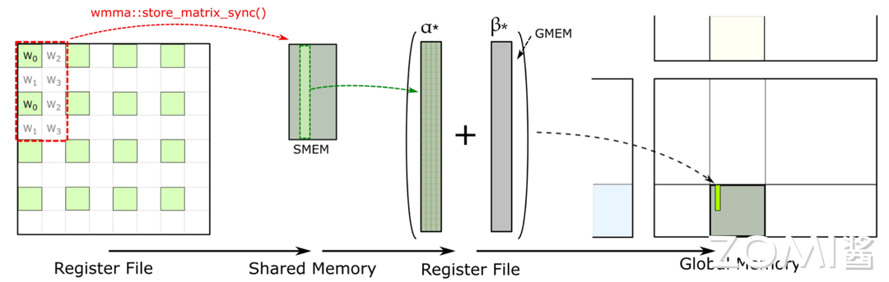

存在 register file 中的临时结果的回传是通过 WMMA 的 API 完成的，在 Tensor Core 提供的 WMMA API 里面有个 store matrix sync 的 API。这个 API 工作就是把所有的数据都搬到共享内存，也就是 SMEM 里面。

在 SMEM 里会做大量的累积的操作，把所有的数据这些数据累积起来后，再存放在全局内存里面。通过全局内存把一个块一个块的拼接起来，把数据回传写出结果。

## 整体计算过程

下面我们来总结一下整个的计算过程：


首先，矩阵在进行 GEMM 计算之前会被分块，这些分块后的矩阵存储在全局内存（Global Memory）中。全局内存是 GPU 上最大的内存区域，用于存储计算过程中需要访问的大量数据。

接下来，在计算开始前，程序会将需要参与计算的矩阵分块加载到共享内存（Shared Memory）中。共享内存是每个线程块中所有线程都可以访问的低延迟内存池，它使得同一线程块中的线程能够高效地共享和重用数据。

然后，当实际执行矩阵乘法运算时，线程会将共享内存中的数据加载到其私有的寄存器（Register）中。寄存器是 GPU 上访问速度最快的内存空间，每个线程都有自己独立的寄存器文件。在 Tensor Core 中执行矩阵乘法运算时，数据会存储在 Tensor Core 的寄存器文件中，并在这里进行计算。

计算完成后，结果会写回到共享内存中，而不是继续存储在 Tensor Core 的寄存器文件中。这是因为共享内存更适合用于中间结果的存储和线程间的数据交换。在写回共享内存的过程中，通过 CUDA 的 WMMA API 提供了诸如 store matrix sync 等函数，用于确保数据的正确同步和累积。

在共享内存中进行结果累积后，这些累积的结果最终会被写回到全局内存中。这个过程可能涉及多个线程块的协作，因为整个矩阵乘法运算可能需要多个线程块共同完成。通过全局内存，不同线程块计算得到的结果块可以被拼接起来，形成最终的完整矩阵乘法结果。

## 小结与思考

- Tensor Core 的计算效率：Tensor Core 通过混合精度计算，利用 FP16 进行矩阵乘法运算并用 FP32 存储中间结果，大幅提高了神经网络模型训练和推断的计算速度。

- Tensor Core 的并行计算能力：与 CUDA Core 相比，Tensor Core 能在每个时钟周期内执行更多的 GEMM 运算，等效于同时进行 64 个浮点乘法累加（FMA）操作，显著增强了并行处理能力。

- Tensor Core 的计算过程：涉及将大矩阵分块、数据加载到共享内存和寄存器、在 Tensor Core 中进行计算、结果回存到共享内存并最终写回全局内存，整个过程通过 WMMA API 和 CUDA 编程技术实现高效的数据管理和计算。

## 本节视频

<html>
<iframe src="https://player.bilibili.com/player.html?isOutside=true&aid=613407659&bvid=BV1oh4y1J7B4&cid=1121933643&p=1&as_wide=1&high_quality=1&danmaku=0&t=30&autoplay=0" width="100%" height="500" scrolling="no" border="0" frameborder="no" framespacing="0" allowfullscreen="true"> </iframe>
</html>
