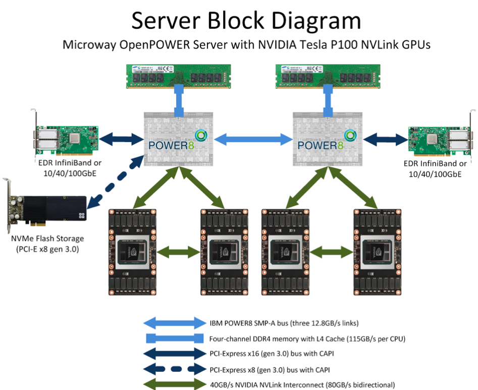
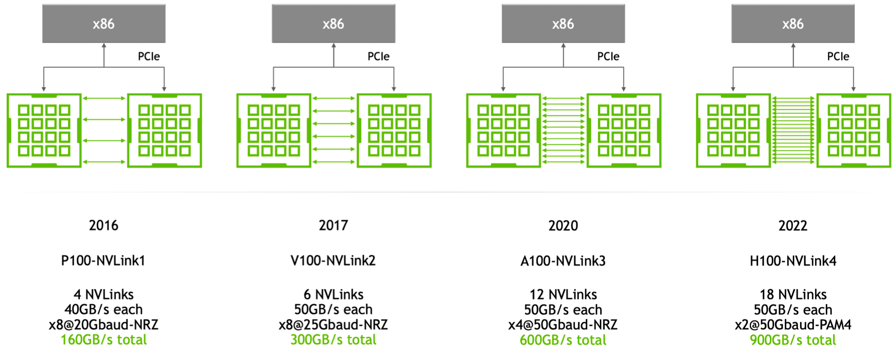

# 分布式通信与NVLink

在进入大模型时代后，大模型发展已是人工智能的核心，但训练大模型实际上是一项比较复杂的工作，因为它需要大量的 GPU 资源和较长的训练时间。

此外，由于单个 GPU 工作线程的内存有限，并且许多大型模型的大小已经超出了单个 GPU 的范围。所以就需要实现跨多个 GPU 的模型训练，这种训练方式就涉及到了分布式通信和NVLink。

当谈及分布式通信和NVLink时，我们进入了一个引人入胜且不断演进的技术领域，本节我们将简单介绍分布式通信的原理和实现高效分布式通信背后的技术Nvlink的演进。

分布式通信是指将计算机系统中的多个节点连接起来，使它们能够相互通信和协作，以完成共同的任务。而NVLink则是一种高速、低延迟的通信技术，通常用于连接GPU之间或连接GPU与其他设备之间，以实现高性能计算和数据传输。

## 分布式并行

当前深度学习进入了大模型时代，即Foundation Models。
大模型，顾名思义主打的就是“大”。主要包括以下几个方面：

1. 数据规模大，大模型通常采用自监督学习方法，减少了数据标注，降低训练研发成本，而大量的数据又可以提高模型的泛化能力和性能。
2. 参数规模大，随着模型参数规模的不断增大，模型可以更好地捕捉数据中的复杂关系和模式，有望进 一步突破现有模型结构的精度局限。
3. 算力需求大，大规模的数据和参数，使得模型无法在单机上运行和计算，这一方面要求计算硬件的不断进步，另一方面也要求AI框架具有分布式并行训练的能力。

所以说，为了解决上述问题我们需要引入分布式并行策略。

### 数据并行

数据并行性(DP) 就是指在不同的 GPU 上运行批次的不同数据子集。
它会将将相同的参数复制到多个 GPU卡，并为每个 GPU 分配不同的数据以同时处理。

数据并行可以让你利用多个 GPU 的计算，但代价是需要存储参数的许多重复副本。这也意味着，随着并行的GPU卡数的增加，模型训练所需的内存资源也会进行成倍增加。

这里需要注意的是，每个数据并行的工作线程在更新模型的参数副本时，它们需要进行协调以确保每个工作线程可以继续拥有相似的参数。

那么最简单的方法是在GPU卡(worker)之间引入阻塞通信：

(1) 独立计算每个worker上的梯度；

(2) 平均各个Worker的梯度；

(3) 在每个Worker上独立计算相同的新参数。

步骤（2）就是引入阻塞通信的方法，在每个小批量结束时它需要同步传输大量数据，其中传输的数据量与（工作线程 * 参数大小）成正比。

### 模型并行

模型并行（MP）旨在解决模型的参数权重无法存储单个节点的情况。

模型并行计算与每个工作节点处理完整模型副本的数据并行方式有所不同。在模型并行中，模型的参数被分布在多台机器上，每个工作节点只处理部分模型参数，因此可以有效减少内存使用量和计算负载。

通过模型并行，我们可以更有效地利用分布式计算资源，加快模型训练的速度，并且能够处理更大规模的模型和数据。

由于深度神经网络通常由许多垂直层组成，因此将大型模型逐层进行分割相对较容易。这意味着我们可以将一小部分连续层分组为一个工作节点的一个分区。这种分割策略可以有效地实现模型并行，使得每个工作节点只需处理分配给它的部分模型参数，从而减少了内存使用量和计算负载。

然而，通过具有顺序依赖关系的多个此类工作线程来运行每个数据批次的简单实现会导致等待时间的巨大泡沫和计算资源的严重利用不足。

### 流水并行

流水并行（PP）将模型并行与数据并行相结合，以减少低效的时间“泡沫”。

核心思想是将一个批次拆分为多个微批次，每个微批次的处理速度应该成比例地更快，并且每个Worker一旦可用就开始处理下一个微批次，从而加快管道执行速度。

如果有足够的微批次，则可以充分利用Worker(GPU卡)，并在步骤开始和结束时将气泡降至最低。其中，梯度在微批次之间取平均值，并且仅在所有微批次完成后才会更新参数。

### 张量并行

流水并行性按层“垂直”分割模型。我们还可以“水平”分割层内的某些操作，这通常称为张量并行训练。

对于许多现代模型，特别是Transformer这样的模型，计算瓶颈通常出现在将激活批矩阵与大权重矩阵相乘的步骤中。

矩阵乘法实际上可以被认为是行与列之间的点积操作的集合。在并行计算中，可以采用不同的策略来加速这一步骤。一种方法是在不同的GPU上并行计算独立的点积，然后再将结果合并。另一种方法是将每个点积的一部分分配到不同的GPU上计算，然后再将结果进行求和。

不论采用哪种策略，我们都可以将权重矩阵分割成大小均匀的“分片”，然后将每个分片托管在不同的GPU上。每个GPU可以负责计算整个矩阵乘积的相关部分，然后再通过通信来组合结果。这种分片的方式可以充分利用多个GPU的计算能力，加速矩阵乘法的计算过程，并在计算密集型任务中提高效率。

### 分布式并行AI框架

对于模型训练来说，不管是哪一种并行策略其本质上包括将模型进行“纵向”或“横向”的切分，然后将单独切分出来的放在不同的机器上进行计算，来充分的利用计算资源。

在现在的AI框架中，通常都是采取的多种策略的混合并行来加速模型训练的。而要支持这种多种并行策略的训练模型，就需要涉及不同“切分”的模型部分如何通信。

如上图所示，在AI计算框架中，我们需要将原来的一个网络模型进行切分，将其分布在不同的机器上进行计算，这里通过在模型中插入Send和Recv节点来进行通信。

除此以外，在分布式的模型训练中，由于模型的切分我们也需要将模型参数放在不同模型部分所在的机器上，在训练过程中我们会涉及到不同模型节点参数的交互和同步，那也需要跨节点的同步数据和参数，这种就是分布式训练。

以上我们介绍的都是软件层面的分布式策略和算法，接下来我们来看下通讯的硬件上是如何实现的。

### 通讯硬件

在AI训练中，分布式通信是至关重要的，特别是在处理大型模型和海量数据时。分布式通信涉及不同设备或节点之间的数据传输和协调，以实现并行计算和模型参数同步，如下图所示。

在机器内通信方面，有几种常见的硬件：

1. 共享内存：多个处理器或线程可以访问相同的物理内存，这样它们可以通过读写内存中的数据来进行通信。共享内存适用于在同一台机器上进行并行计算的情况。

2. PCIe（Peripheral Component Interconnect Express）：PCIe总线是连接计算设备的一种标准接口，通常用于连接GPU、加速器卡或其他外部设备。通过PCIe总线，数据可以在不同的计算设备之间传输，以实现分布式计算。

3. NVLink：NVLink是一种由NVIDIA开发的高速互连技术，可实现GPU之间的直接通信。NVLink可以提供比PCIe更高的带宽和更低的延迟，适用于要求更高通信性能的任务。

在机器间通信方面，常见的硬件包括：

1. TCP/IP网络：TCP/IP协议是互联网通信的基础，它允许不同机器之间通过网络进行数据传输。在分布式计算中，可以使用TCP/IP网络进行机器间的通信和数据传输。

2. RDMA（Remote Direct Memory Access）网络：RDMA是一种高性能网络通信技术，它允许在不涉及CPU的情况下直接从一个内存区域传输数据到另一个内存区域。RDMA网络通常用于构建高性能计算集群，提供低延迟和高吞吐量的数据传输。

在了解在硬件之后，实现通信不可或缺的是提供集合通信功能的库。其中，最常用的集合通信库之一是MPI（Message Passing Interface），在CPU上被广泛应用。而在NVIDIA GPU 上，最常用的集合通信库则是NCCL（NVIDIA Collective Communications Library）。

如上图所示，通过NCCL库，我们可以利用Nvlink或NvSwitch将不同的GPU相互连接起来。NCCL在算法层面提供了外部API，通过这些API，我们可以方便地进行跨多个GPU的集合通信操作。NCCL的API覆盖了常见的集合通信操作，如广播、归约、全局归约、全局同步等，为开发者提供了丰富而高效的并行计算工具。

### 集合通信

集合通信（Collective Communications）是一种涉及进程组中所有进程的全局通信操作。它包括一系列基本操作，如发送（send）、接收（receive）、复制（copy）、组内进程栅栏同步（Barrier），以及节点间进程同步（signal + wait）。这些基本操作经过组合可以构成一组通信模板，也称为通信原语。例如，1对多的广播（broadcast）、多对1的收集（gather）、多对多的收集（all-gather）、1对多的发散（scatter）、多对1的规约（reduce）、多对多的规约（all-reduce）、组合的规约与发散（reduce-scatter）、多对多的全互连（all-to-all）等。下面我们简单介绍几个。

Gather操作属于多对1的通信原语，具有多个数据发送者，一个数据接收者，可以在集群内把多个节点的数据收集到一个节点上，他的反向操作对应Scatter。

Broadcast属于1对多的通信原语，一个数据发送者，多个数据接收者，可以在集群内把一个节点自身的数据广播到其他节点上。如上图所示，当主节点 0 执行Broadcast时，数据即从主节点0被广播至其他节点。

Scatter是数据的1对多的分发，它将一张GPU卡上的数据进行分片再分发到其他所有的GPU卡上。

AllReduce属于多对多的通信原语，具有多个数据发送者，多个数据接收者，其在集群内的所有节点上都执行相同的Reduce操作，可以将集群内所有节点的数据规约运算得到的结果发送到所有的节点上。简单来说，AllReduce是数据的多对多的规约运算，它将所有的GPU卡上的数据规约（比如SUM求和）到集群内每张GPU卡上。

AllGather属于多对多的通信原语，具有多个数据发送者，多个数据接收者，可以在集群内把多个节点的数据收集到一个主节点上（Gather），再把这个收集到的数据分发到其他节点上。

AllToAll操作每一个节点的数据会Scatter到集群内所有节点上，同时每一个节点也会Gather集群内所有节点的数据。AllToAll是对AllGather的扩展，区别是AllGather操作中，不同节点向某一节点收集到的数据是相同的，而在AllToAll中，不同的节点向某一节点收集到的数据是不同的。

## Nvlink与NvSwitch的发展

NVLink和NVSwitch是英伟达推出的两项革命性技术，它们正在重新定义CPU与GPU以及GPU与GPU之间的协同工作和高效通信的方式。

NVLink是一种先进的总线及其通信协议。NVLink采用点对点结构、串列传输，用于中央处理器（CPU）与图形处理器（GPU）之间的连接，也可用于多个图形处理器（GPU）之间的相互连接。

NVSwitch：是一种高速互连技术，同时作为一块独立的 NVLink 芯片，其提供了高达18路 NVLink 的接口，可以在多个 GPU 之间实现高速数据传输。

这两项技术的引入，为GPU集群和深度学习系统等应用场景带来了更高的通信带宽和更低的延迟，从而提升了系统的整体性能和效率。

### Nvlink发展

如上图所示，从Pascal架构到Hoppe架构，Nvlink已经经过了四代的发展演进。在2024年的GTC大会上，Nvidia发布了Blackwell架构，其中Nvlink再次更新，发布了第五代Nvlink，其中互联带宽达到了1800GB/s。

如上图所示，每一层Nvlink的更新，其每个GPU的互联带宽都是在不断的提升，其中Nvlink之间能够互联的GPU数，也从第一代的4路到第四代的18路。最新的Blackwell架构其最大互联GPU数，并未增加。

从上图可以看出，在P100中每一个Nvlink只有40GB/s，而从第二代V100到H100每一个Nvlink链路都有50GB/s，通过增加了链路的数量使得整体带宽增加。

### NvSwitch发展

如上图所示，NvSwitch技术从Volta架构到Hopper架构，经历了三代的演进与发展。在每一代中，每个GPU互联的芯片模组数量保持不变，都为8个，这意味着互联的基本结构保持了稳定性和一致性。随着Nvlink架构的升级，GPU到GPU之间的带宽却实现了显著的增长，因为NvSwitch就是Nvlink具体承载的芯片模组，从Volta架构的300GB/s增加到了Hopper架构的900GB/s。

下面我们来看下Nvlink与NvSwitch在服务器中的关系。

如上图所示，在P100中是只有Nvlink的，GPU间通过CubeMesh进行互联。在P100中，每一个GPU有4路进行互联，每4个组成一个CubeMesh。

而到了V100中，每一个GPU可以通过NvSwitch合另外一个GPU进行互联。到了A100中，NvSwitch再次升级，节省了很多的链路，每一个GPU可以通过NvSwitch和任何一个GPU进行互联。

到了H100中，又有了新的技术突破，单机内有8块H100 GPU卡，任意两个H100卡之间都有900 GB/s的双向互联带宽。值得注意的是，在DGX H100系统里，四个NVSwitch留出了72个NVLink4连接，用于通过 NVLink-Network Switch 连接到其他DGX H100系统，从而方便组成DGX H100 SuperPod系统。其中，72个NVLink4连接的总双向带宽是～3.6TB/s。

## 小结

1. NCCL（NVIDIA Collective Communication Library）：NCCL是NVIDIA专门为GPU集群通信而设计的高性能集合通信库。它能够有效地实现集合通信（如全局归约、全局广播等）和点对点通信，充分利用多个GPU间的并行计算能力，提高了大规模并行计算任务的效率和性能。

2. NVLink：NVLink是NVIDIA开发的一种高速互连技术及其通信协议，用于连接多个GPU、GPU与CPU之间，以及连接其他加速器设备。NVLink提供了比传统PCIe总线更高的带宽和更低的延迟，能够实现高效的数据传输和协同计算，特别适用于深度学习、仿真和高性能计算等领域。

3. NVSwitch：NVSwitch是一款独立的硬件芯片，专门用于连接多个GPU和其他加速器设备，提供高带宽、低延迟的互连通道。NVSwitch在HGX平台等大规模GPU集群中发挥重要作用，通过提供灵活的通信和数据交换能力，实现了GPU之间的快速互联和协同计算。

4. HGX（Hyperscale GPU Accelerator）：HGX是NVIDIA推出的一款AI超级计算平台，旨在满足大规模GPU集群的高性能计算和人工智能需求。HGX平台整合了多个GPU、NVLink互连、InfiniBand网络和NVIDIA AI软件堆栈等关键技术，为用户提供了高度灵活和可扩展的解决方案，可用于深度学习训练、推理、数据分析等各种工作负载。

## 本节视频

<html>
<iframe src="https://www.bilibili.com/video/BV1cV4y1r7Rz/?spm_id_from=333.788&vd_source=997b612028a4d9f90d4179eb93284d60" width="100%" height="500" scrolling="no" border="0" frameborder="no" framespacing="0" allowfullscreen="true"> </iframe>
</html>
