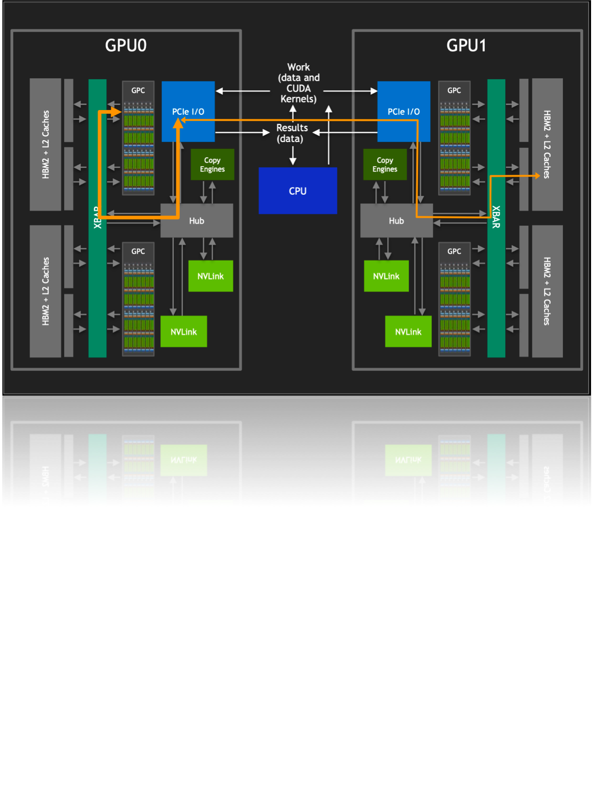
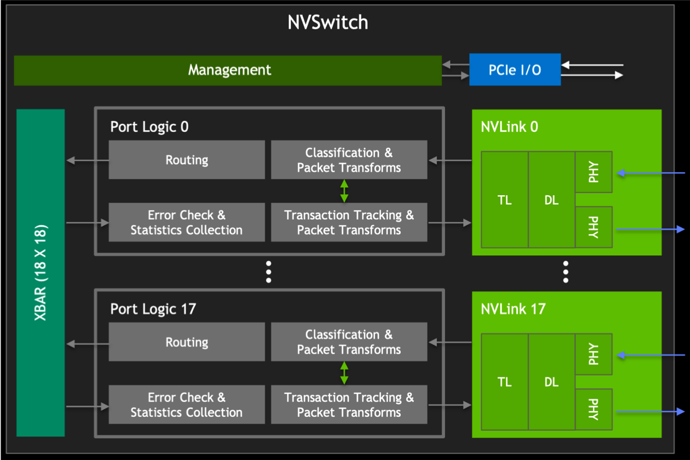
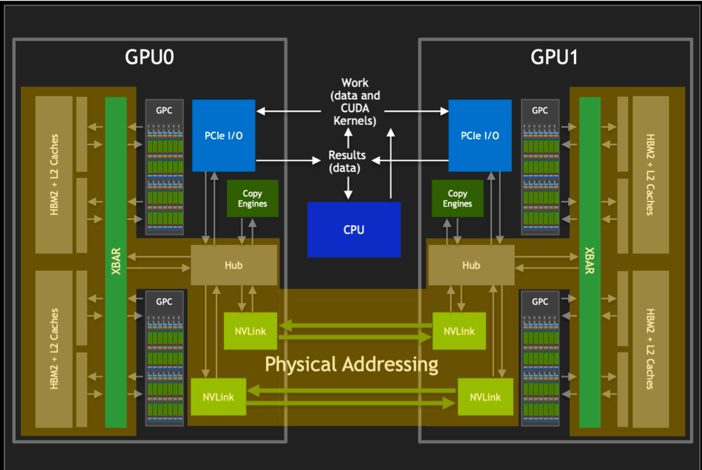
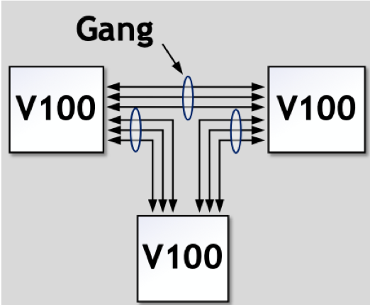
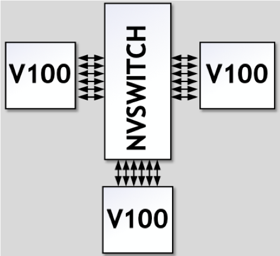

<!--Copyright 适用于[License](https://github.com/chenzomi12/AISystem)版权许可-->
# NV Switch深度解析

在当今的高性能计算领域，英伟达（NVIDIA）的GPU技术无疑是一颗璀璨的明星。随着人工智能和机器学习技术的飞速发展，对于计算能力的需求日益增长，GPU之间的互联互通变得尤为重要。在这样的背景下，英伟达推出了NVLink协议，以及基于此技术的多GPU互联解决方案——NV Switch。

本节将深入探讨NV Switch的发展历程、工作原理以及其在构建高性能服务器集群中的关键作用，为读者揭开这一技术背后神秘的面纱。

## 为什么需要NV Switch

随着单个GPU的计算能力逐渐逼近物理极限，为了满足日益增长的计算需求，多GPU协同工作成为必然趋势。

然而，要对其他 GPU 的 HBM2 进行访问，需要经过 PCIe 接口。如上图所示，传统的 PCIe 接口在数据传输速率和带宽上存在限制，这导致 GPU 间的通信通常会成为性能瓶颈。为了克服这一限制，英伟达开发了 NVLINK 技术，它提供了比PCIe高10倍的带宽，允许单个服务器内的8个GPU通过点对点网络连接在一起，形成所谓的混合立方体网格。

NVLINK技术的核心优势在于它能够绕过传统的CPU分配和调度机制，允许GPU之间进行直接的数据交换。这种设计不仅减少了数据传输的延迟，还大幅提升了整个系统的吞吐量。此外，通过NVlink GPCs 可以访问卡间 HBM2 内存数据，也可以对其他 GPU 内的 HBM2 数据进行访.

在多GPU系统中，NVLINK还起到了XBARs的作用，它作为不同GPU之间的桥梁，允许数据在GPU之间自由流动。还巧妙地避开了与PCIe总线的冲突，使得NVLink和PCIe可以作为互补的解决方案共存，共同为系统提供所需的数据传输能力。

NV Switch则是在此基础上进一步发展，支持完全无阻塞的全互联GPU系统，通过提供更多的NVLINK接口，没有任何中间GPU跳数，实现更大规模的GPU互联，从而构建出更加强大的计算集群。

## NV Switch的出现

在NVIDIA的技术演进历程中，Pascal架构首次引入了NVLink，这一创新如同开辟了一条高速通道，极大地提升了GPU之间的通信效率。然而，真正的技术飞跃发生在下一代的Volta架构中，伴随着NVSwitch的诞生。

NVSwitch的出现，犹如在数据传输的网络中架设了一座智能枢纽，它不仅支持更多的NVLink链路，还允许多个GPU之间实现全互联，极大地优化了数据交换的效率和灵活性。

如上图所示，在Volta架构中，GPU to GPU间的通信达到300GB/s，而到Hopper架构中已经发展到900GB/s。这一壮举的背后，是NVLink链路数的显著提升，从Volta的6路扩展至Hopper的18路，如同在原本的高速公路上增设了立交桥和环岛，使得数据流能够更加高效地穿梭于各个GPU之间，为高性能计算和大规模并行处理提供了强有力的支撑。

上图展示的是DGX服务器GPU芯片互联的架构图，如图所示，在DGX-1 P100中有8张GPU卡，每张GPU卡支持4条NVLink链路，这些链路允许GPU之间进行高速通信。在DGX-1 P100中，GPU卡被组织成两个cube mesh，每个cube包含4个GPU（GPU 0~3和GPU 4~7）。在每个cube内部，GPU之间可以直接通过NVLink或通过PCIe Switch进行通信。然而，跨cube的通信（例如GPU 0和GPU 4）需要通过其他GPU间接进行。

DGX-2引入了英伟达的第一代NVSwitch技术，这是一个重要的进步，因为它允许更高效的GPU间通信。在Volta架构中，每张GPU卡支持6条NVLink链路，而不再是4条。此外，通过引入6个NVSwitch，NVSwitch能够将服务器中的所有GPU卡全部互联起来，并且支持8对GPU同时通信，不再需要任何中间GPU跳数，实现直接高速通信，这大大提高了数据传输的效率和整体计算性能。

DGX-A100使用的是第二代NVSwitch技术。相比于第一代，第二代NVSwitch提供了更高的通信带宽和更低的通信延迟。在A100架构中，每张GPU卡支持12条NVLink（第三代）链路，并通过6个NVSwitch实现了全连接的网络拓扑。虽然标准的DGX A100配置仅包含8块GPU卡，但该系统可以扩展，支持更多的A100 GPU卡和NVSwitch，以构建更大规模的超级计算机。

DGX-H100使用的是第三代NVSwitch和第四代NVLink技术，其中每一个GPU卡支持18条NVLink链路。在H100架构中，通过引入了4个NV Switch，采用了分层拓扑的方式，每张卡向第一个NV Switch接入5条链路，第二个NV Switch接入4条链路，第三个NV Switch接入4条链路，第四个NV Switch接入5条链路，总共72 个 NVLink 提供 3.6 TB/s 全双工 NVLink 网络带宽，比上一代提高 1.5 倍。

## NV Switch 详解

NVIDIA的NVSwitch技术是实现高效GPU间通信的关键组件，特别是在构建高性能计算(HPC)和AI加速器系统中。

### 初代 NVSwitch

NVSwitch的设计引入为英伟达创建一个完全无阻塞的全互联GPU系统，这对于需要大规模并行处理的应用至关重要。

在第一代 NVSwitch其支持18路接口，NVSwitch能够支持多达16个GPU的全互联，实现高效的数据共享和通信。

如上图所示，在V100架构中，每块GPU拥有6条NVLink通道，这些通道可以连接到NVSwitch上，从而形成一个高带宽的通信网络。在DGX-2系统中，8个V100 GPU通过这些NVLink通道与6个NVSwitch相连，构建了一个强大的基板。

第一代的NVSwitch支持的NVLink 2.0技术，每个接口能够提供双通道，高达50GB/s的带宽。这意味着通过NVSwitch，整个系统能够实现总计900GB/s的惊人带宽，极大地提升了数据传输速率和计算效率。

其次，NVSwitch基于台积电的12nm FinFET FFN工艺制造，这种先进的工艺技术使得NVSwitch能够在100W的功率下运行，同时集成了高达2亿个晶体管。

在电路IO和封装方面，NVSwitch封装在一个大型的BGA芯片中，具有1940个引脚，其中576个专门用于支持18路NVLink。其余的引脚用于电源和各种I/O接口，包括x4 PCIe管理端口、I2C、GPIO等，为系统提供灵活的管理和扩展能力。

其具体的参数如下表所示：

从上表我看可看到，每个NVLink双向带宽高达50GB/s，实际利用率最高能达到80%。

### 初代 NVSwitch Block

如上图所示，在左侧为GPU XBAR，它是一个高度专业化的桥接设备，专门设计用于NVLink互连环境中，可以使得数据包能够在多个GPU之间流动和交换，同时对外呈现为单个GPU。通过GPU XBAR，客户端应用程序能够感知并利用多个GPU的集合性能，减少了客户端进行GPU间通信管理的复杂性。

此外，GPU XBAR利用基于静态随机存取存储器（SRAM）的缓冲技术，实现非阻塞的数据传输。这种缓冲机制保证了数据传输的连续性和效率，即使在高负载情况下也能保持高性能。

从V100 GPU开始，NVIDIA重新使用了NVLink的IP块和XBAR设计，这不仅保证了不同代产品之间的兼容性，也使得NVLink技术能够不断迭代和优化，同时减少了开发成本和时间。

如上图所示，我们结合整个GPU来看下NVSwitch和GPU之间是如何进行数据传输和分发的。

我们都知道在编程中，开发者通常处理的是虚拟地址。这些虚拟地址是由操作系统管理和抽象的，它们为不同的程序提供了独立的地址空间。然而，在物理内存中，数据实际上是以物理地址存储的。物理地址直接指向内存中的具体位置，这是实现数据访问的基础。而虚拟地址到物理地址的转换通常由GPU的图形处理单元（GPU核心）或者固定功能单元（如内存管理单元）来完成。

而在通过NVLink传输数据时，如上图所示，其使用的是物理地址而非虚拟地址。这是因为物理地址能够直接指向数据的实际存储位置，从而加快了数据的索引和访问速度。

NVSwitch作为NVLink的桥接设备，它不仅提供了高带宽的通信路径，还负责维护复杂的路由和缓冲机制，确保数据包能够按照正确的物理地址快速且准确地传输到目的地。通过使用物理地址进行NVLink通信，可以减少在目标GPU上进行地址转换的需要，从而降低延迟，提高数据传输速率。这对于需要快速处理大量数据的高性能计算和AI应用来说是至关重要的。

### NVSwitch 简化原理与特性

1. 无NVSwitch的直接GPU间连接

如上图所示，在没有NVSwitch的配置中，GPU之间的连接通常是通过将NVLinks聚合成多个组（Gang）来实现的。这意味着多个GPU通过共享的NVLink链路进行通信。

然而，这种方法的一个限制是，任意两个GPU之间的最大带宽受限于它们所在Gang的NVLink数量和带宽。

2. 引入NVSwitch后的改进

NVIDIA的NVSwitch技术为GPU间的通信带来了革命性的改进。NVSwitch作为一个高速交换机，允许所有链路上的数据进行交互。

在NVSwitch架构中，任意一对GPU都可以直接互联，且只要不超过六个NVLink的总带宽，单个GPU的流量就可以实现非阻塞传输。这也就意味着，NVSwitch支持的全互联架构意味着系统可以轻松扩展，以支持更多的GPU，而不会牺牲性能。每个GPU都能利用NVLink提供的高带宽，实现快速的数据交换。

NVSwitch在解决多GPU间的互联有以下优势和特性：

1. 扩展性与可伸缩性：

NVSwitch的引入为GPU集群的扩展性提供了强大的支持。通过简单地添加更多的NVSwitch，系统可以轻松地支持更多的GPU，从而扩展计算能力。

2. 高效的系统构建：

例如，八个GPU可以通过三个NVSwitch构建成一个高效的互连网络。这种设计允许数据在所有GPU链路之间自由交互，最大化了数据流通的灵活性和效率。

3. 全双向带宽利用：

在这种配置下，任意一对GPU都能够利用完整的300GBps双向带宽进行通信。这意味着每个GPU对都能实现高速、低延迟的数据传输，极大地提升了计算任务的处理速度。

4. 无阻塞通信：

NVSwitch中的交叉开关（XBAR）为数据传输提供了从点A到点B的唯一路径。这种设计确保了通信过程中的无阻塞和无干扰，进一步提升了数据传输的可靠性和系统的整体性能。

5. 优化的网络拓扑：

NVSwitch支持的网络拓扑结构为构建大型GPU集群提供了优化的解决方案。它允许系统设计者根据具体的计算需求，灵活地配置GPU之间的连接方式。

### 第三代 NVSwitch

从上图可以看出，第三代 NVSwitch 采用了 TSMC 的 4N 工艺制造，即使在拥有大量晶体管和高带宽的情况下，也能保持较低的功耗。它提供了 64 个 NVLink 4 链路端口，允许构建包含大量 GPU 的复杂网络，同时保持每个 GPU 之间的高速通信。同时支持 3.2TB/s 的全双工带宽，显著提升了数据传输速率，使得大规模数据集的并行处理更加高效。

在信号技术方面，采用了 50 Gbaud PAM4 信号技术，每个差分对提供 100 Gbps 的带宽，保持了信号的高速传输和低延迟特性。

NVSwitch 集成了 NVIDIA SHARP 技术，包括 all_gather、reduce_scatter 和 broadcast atomics 等操作，为集群通信提供了硬件加速，进一步提升了性能。NVSwitch 3.0 的物理电气接口与 400 Gbps 以太网和 InfiniBand 兼容，提供了与现有网络技术的互操作性。

NVIDIA的第三代NVSwitch引入了多项创新特性，其中新SHARP模块和新NVLink模块的加入，为GPU间的高效通信和数据处理提供了显著的性能提升，如上图所示。

- 新SHARP模块

新引入的SHARP模块，如同一位智慧的指挥官，以其强大的数据处理能力，引领着数据的交响乐。它支持多种运算符，从逻辑运算到算术运算，无所不包，同时兼容多种数据格式，如FP16和BF16，为AI和机器学习工作负载提供了强有力的支持。SHARP控制器的设计更是巧妙，它能够并行管理多达128个SHARP组，如同千手观音，同时处理众多任务，大幅提升了数据并行处理的效率，让大规模的数据处理任务如同行云流水，一气呵成。

NVSwitch中的交叉开关（XBAR），经过精心调整和优化，与SHARP模块的数据传输需求完美匹配。这一协同设计，如同精心编织的网络，确保了数据在GPU间传输时的高效率和低延迟，让系统的整体性能如同骏马奔腾，势不可挡。

- 新NVLink模块

新NVLink模块的集成，不仅为数据和芯片提供了额外的安全保护，如同坚固的盾牌，防止未授权访问和潜在的数据泄露，更增强了系统的数据安全性。端口分区功能的引入，如同巧妙的棋手，将不同的端口隔离到单独的NVLink网络中，为系统提供了更高的灵活性，允许在不同的网络之间实现资源的逻辑分割，优化了多任务处理的能力。

控制器对下一代Octal Small Formfactor Pluggable（OSFP）电缆的支持，如同为未来的网络扩展铺设了坚实的基石。这种电缆提供了更高的数据传输速率和更低的信号衰减，适合长距离的高速通信，为未来的网络扩展提供了无限可能。

新NVLink模块还扩展了遥测功能，使得系统管理员能够更精确地监控和优化网络性能，确保系统的稳定运行。而集成的前向纠错（FEC）技术，如同一位细心的守护者，增强了数据传输的可靠性，尤其是在面对信号衰减或干扰时，能够保证数据的完整性和准确性。

## 小结

在当今这个数据驱动的时代，高性能计算的需求如同汹涌的浪潮，不断推动着技术的边界。NVIDIA的NVSwitch技术，作为GPU间通信的桥梁，以其卓越的性能和创新的设计，成为了构建高效能计算集群的关键。从初代NVSwitch的诞生，到第三代NVSwitch的革新，每一步都见证了NVIDIA在追求极致计算效率上的不懈努力。

NVSwitch不仅提升了数据传输的带宽和速度，还通过引入SHARP模块和NVLink模块，增强了数据处理能力和系统的安全性。它的出现，使得多GPU系统能够更加高效地协同工作，为人工智能、机器学习、大数据分析等领域的快速发展提供了强有力的支撑。

随着技术的不断进步，NVSwitch将继续在未来的高性能计算领域扮演着至关重要的角色。它不仅是NVIDIA技术创新的象征，更是推动整个行业向前发展的动力。在NVSwitch的引领下，我们期待着一个更加智能、高效、互联的未来。

## 本节视频

<html>
<iframe src="https://www.bilibili.com/video/BV1uM4y1n7qd/?spm_id_from=333.788&vd_source=997b612028a4d9f90d4179eb93284d60" width="100%" height="500" scrolling="no" border="0" frameborder="no" framespacing="0" allowfullscreen="true"> </iframe>
</html>
