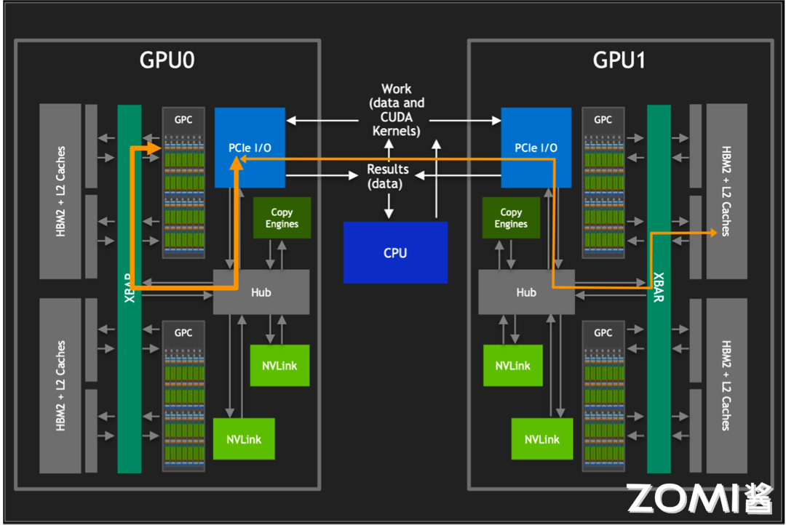
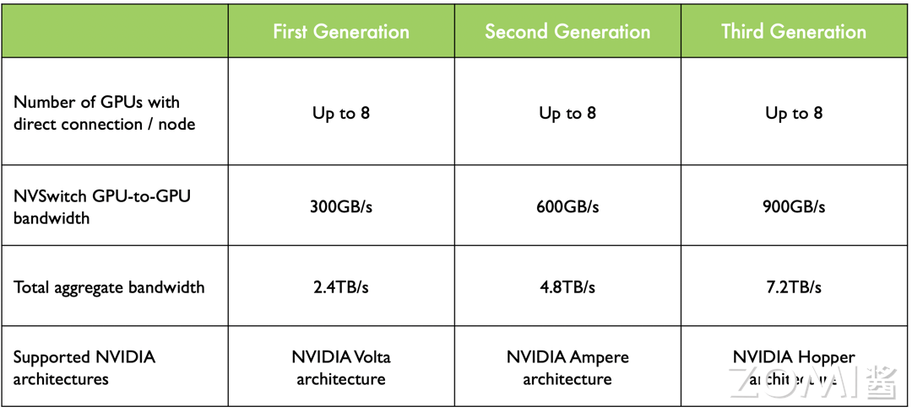
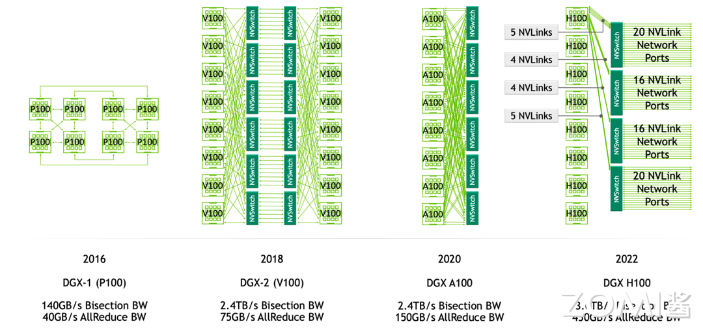
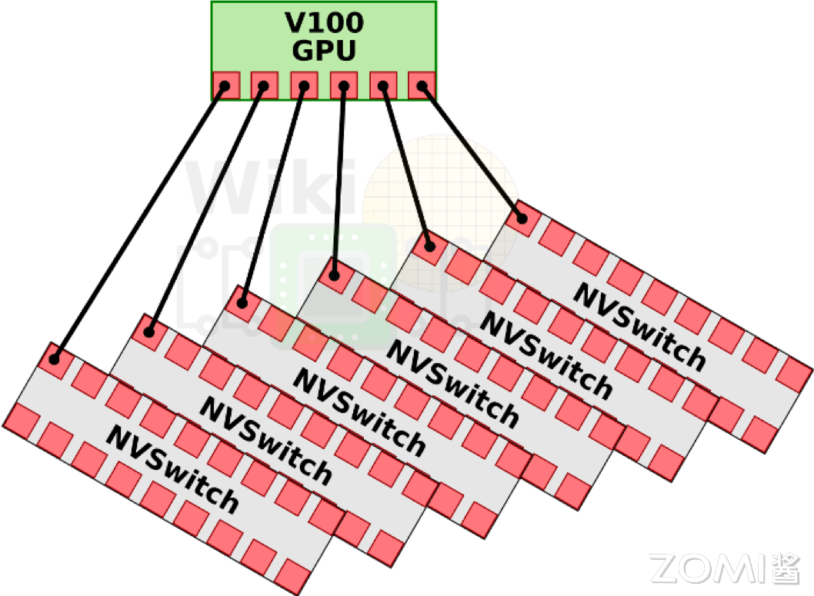
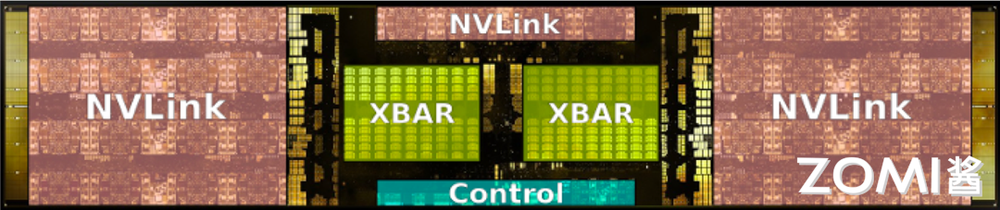
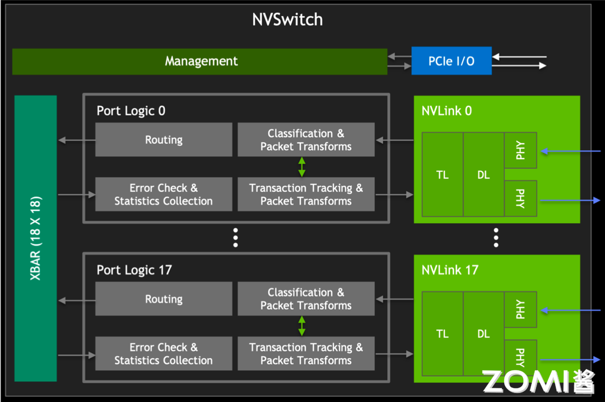
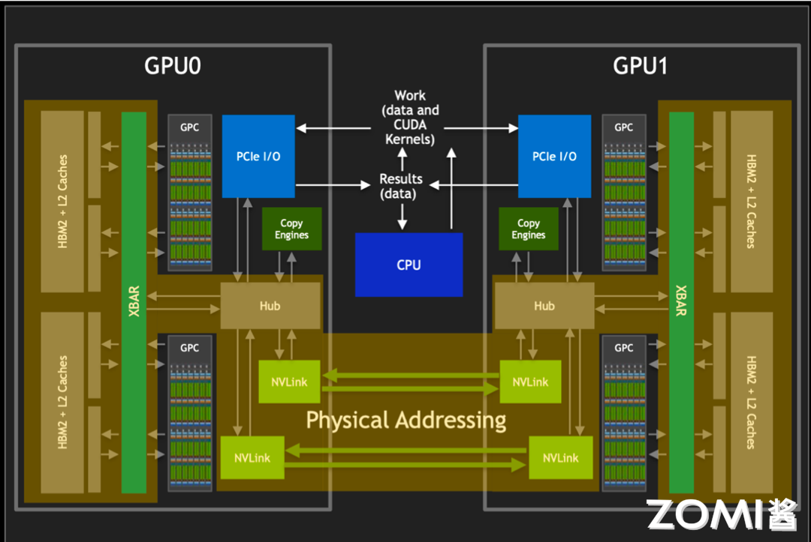
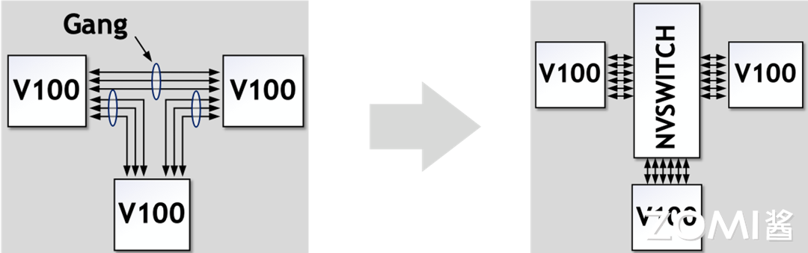
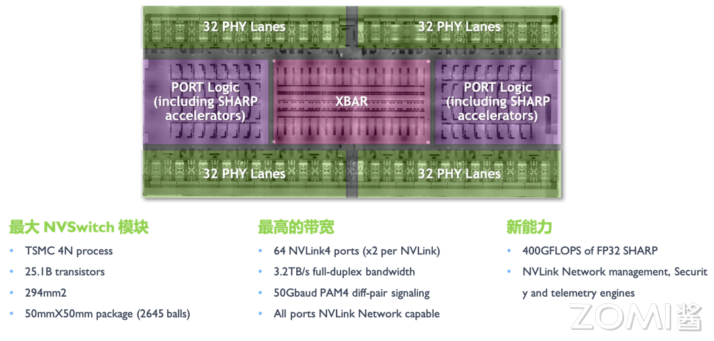
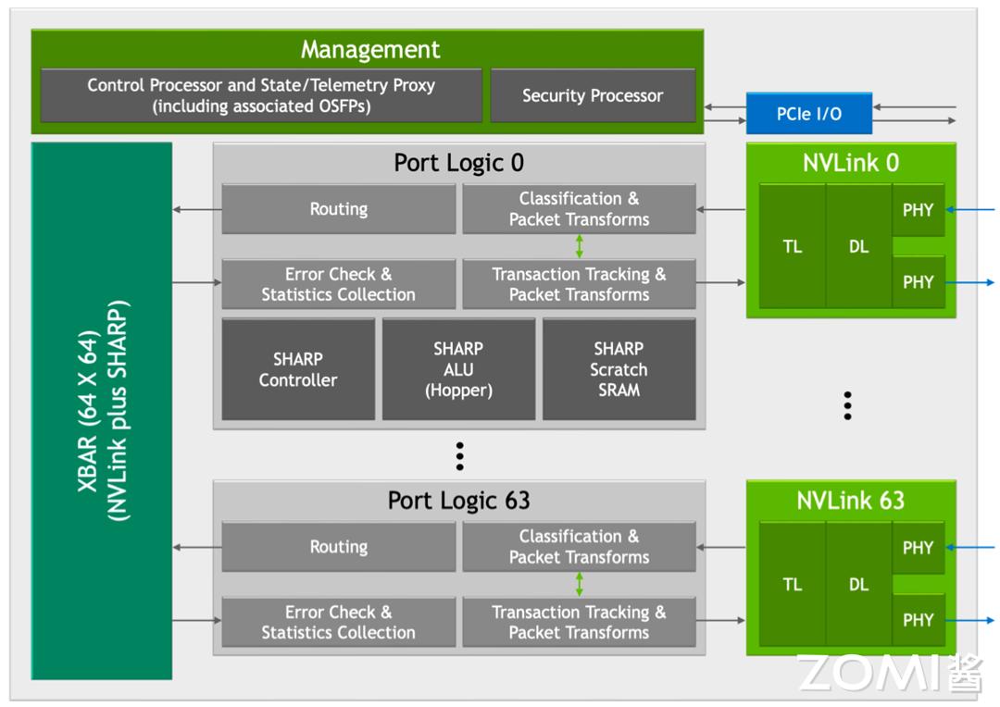

<!--Copyright 适用于[License](https://github.com/chenzomi12/AISystem)版权许可-->

# NV Switch 深度解析(DONE)

在当今的高性能计算领域，英伟达的 GPU 技术无疑是一颗璀璨的明星。随着人工智能和机器学习技术的飞速发展，对于计算能力的需求日益增长，GPU 之间的互联互通变得尤为重要。在这样的背景下，英伟达推出了 NVLink 协议，以及基于此技术的多 GPU 互联解决方案——NV Switch。

本节将深入探讨 NV Switch 的发展历程、工作原理以及其在构建高性能服务器集群中的关键作用，为读者揭开这一技术背后神秘的面纱。

## 为什么需要 NV Switch

随着单个 GPU 的计算能力逐渐逼近物理极限，为了满足日益增长的计算需求，多 GPU 协同工作成为必然趋势。

然而，要对其他 GPU 的 HBM2 进行访问，需要经过 PCIe 接口。如上图所示，传统的 PCIe 接口在数据传输速率和带宽上存在限制，这导致 GPU 间的通信通常会成为性能瓶颈。为了克服这一限制，英伟达开发了 NVLink 技术，它提供了比 PCIe 高 10 倍的带宽，允许单个服务器内的 8 个 GPU 通过点对点网络连接在一起，形成所谓的混合立方体网格。

NVLink 技术的核心优势在于它能够绕过传统的 CPU 分配和调度机制，允许 GPU 之间进行直接的数据交换。这种设计不仅减少了数据传输的延迟，还大幅提升了整个系统的吞吐量。此外，通过 NVLink GPCs 可以访问卡间 HBM2 内存数据，也可以对其他 GPU 内的 HBM2 数据进行访问。

在多 GPU 系统中，NVLink 还起到了 XBARs 的作用，它作为不同 GPU 之间的桥梁，允许数据在 GPU 之间自由流动。还巧妙地避开了与 PCIe 总线的冲突，使得 NVLink 和 PCIe 可以作为互补的解决方案共存，共同为系统提供所需的数据传输能力。

NV Switch 则是在此基础上进一步发展，支持完全无阻塞的全互联 GPU 系统，通过提供更多的 NVLink 接口，没有任何中间 GPU 跳数，实现更大规模的 GPU 互联，从而构建出更加强大的计算集群。

## NV Switch 的出现

在英伟达的技术演进历程中，Pascal 架构首次引入了 NVLink，这一创新如同开辟了一条高速通道，极大地提升了 GPU 之间的通信效率。然而，真正的技术飞跃发生在下一代的 Volta 架构中，伴随着 NVSwitch 的诞生。

NVSwitch 的出现，犹如在数据传输的网络中架设了一座智能枢纽，它不仅支持更多的 NVLink 链路，还允许多个 GPU 之间实现全互联，极大地优化了数据交换的效率和灵活性。

如上图所示，在 Volta 架构中，GPU to GPU 间的通信达到 300GB/s，而到 Hopper 架构中已经发展到 900GB/s。这一壮举的背后，是 NVLink 链路数的显著提升，从 Volta 的 6 路扩展至 Hopper 的 18 路，如同在原本的高速公路上增设了立交桥和环岛，使得数据流能够更加高效地穿梭于各个 GPU 之间，为高性能计算和大规模并行处理提供了强有力的支撑。

上图展示的是 DGX 服务器 GPU 芯片互联的架构图，如图所示，在 DGX-1 P100 中有 8 张 GPU 卡，每张 GPU 卡支持 4 条 NVLink 链路，这些链路允许 GPU 之间进行高速通信。在 DGX-1 P100 中，GPU 卡被组织成两个 cube mesh，每个 cube 包含 4 个 GPU（GPU 0~3 和 GPU 4~7）。在每个 cube 内部，GPU 之间可以直接通过 NVLink 或通过 PCIe Switch 进行通信。然而，跨 cube 的通信（例如 GPU 0 和 GPU 4）需要通过其他 GPU 间接进行。

DGX-2 引入了英伟达的第一代 NVSwitch 技术，这是一个重要的进步，因为它允许更高效的 GPU 间通信。在 Volta 架构中，每张 GPU 卡支持 6 条 NVLink 链路，而不再是 4 条。此外，通过引入 6 个 NVSwitch，NVSwitch 能够将服务器中的所有 GPU 卡全部互联起来，并且支持 8 对 GPU 同时通信，不再需要任何中间 GPU 跳数，实现直接高速通信，这大大提高了数据传输的效率和整体计算性能。

DGX-A100 使用的是第二代 NVSwitch 技术。相比于第一代，第二代 NVSwitch 提供了更高的通信带宽和更低的通信延迟。在 A100 架构中，每张 GPU 卡支持 12 条 NVLink（第三代）链路，并通过 6 个 NVSwitch 实现了全连接的网络拓扑。虽然标准的 DGX A100 配置仅包含 8 块 GPU 卡，但该系统可以扩展，支持更多的 A100 GPU 卡和 NVSwitch，以构建更大规模的超级计算机。

DGX-H100 使用的是第三代 NVSwitch 和第四代 NVLink 技术，其中每一个 GPU 卡支持 18 条 NVLink 链路。在 H100 架构中，通过引入了 4 个 NV Switch，采用了分层拓扑的方式，每张卡向第一个 NV Switch 接入 5 条链路，第二个 NV Switch 接入 4 条链路，第三个 NV Switch 接入 4 条链路，第四个 NV Switch 接入 5 条链路，总共 72 个 NVLink 提供 3.6 TB/s 全双工 NVLink 网络带宽，比上一代提高 1.5 倍。

## NV Switch 详解

英伟达的 NVSwitch 技术是实现高效 GPU 间通信的关键组件，特别是在构建高性能计算(HPC)和 AI 加速器系统中。

### 初代 NVSwitch

NVSwitch 的设计引入为英伟达创建一个完全无阻塞的全互联 GPU 系统，这对于需要大规模并行处理的应用至关重要。

第一代 NVSwitch 支持 18 路接口，NVSwitch 能够支持多达 16 个 GPU 的全互联，实现高效的数据共享和通信。

如上图所示，在 V100 架构中，每块 GPU 拥有 6 条 NVLink 通道，这些通道可以连接到 NVSwitch 上，从而形成一个高带宽的通信网络。在 DGX-2 系统中，8 个 V100 GPU 通过这些 NVLink 通道与 6 个 NVSwitch 相连，构建了一个强大的基板。

第一代的 NVSwitch 支持的 NVLink 2.0 技术，每个接口能够提供双通道，高达 50GB/s 的带宽。这意味着通过 NVSwitch，整个系统能够实现总计 900GB/s 的惊人带宽，极大地提升了数据传输速率和计算效率。

其次，NVSwitch 基于台积电的 12nm FinFET FFN 工艺制造，这种先进的工艺技术使得 NVSwitch 能够在 100W 的功率下运行，同时集成了高达 2 亿个晶体管。

在电路 IO 和封装方面，NVSwitch 封装在一个大型的 BGA 芯片中，具有 1940 个引脚，其中 576 个专门用于支持 18 路 NVLink。其余的引脚用于电源和各种 I/O 接口，包括 x4 PCIe 管理端口、I2C、GPIO 等，为系统提供灵活的管理和扩展能力。具体的参数如下表所示：

从上表我看可看到，每个 NVLink 双向带宽高达 50GB/s，实际利用率最高能达到 80%。

### 初代 NVSwitch Block

如上图所示，在左侧为 GPU XBAR，它是一个高度专业化的桥接设备，专门设计用于 NVLink 互连环境中，可以使得数据包能够在多个 GPU 之间流动和交换，同时对外呈现为单个 GPU。通过 GPU XBAR，客户端应用程序能够感知并利用多个 GPU 的集合性能，减少了客户端进行 GPU 间通信管理的复杂性。

此外，GPU XBAR 利用基于静态随机存取存储器（SRAM）的缓冲技术，实现非阻塞的数据传输。这种缓冲机制保证了数据传输的连续性和效率，即使在高负载情况下也能保持高性能。

从 V100 GPU 开始，英伟达重新使用了 NVLink 的 IP 块和 XBAR 设计，这不仅保证了不同代产品之间的兼容性，也使得 NVLink 技术能够不断迭代和优化，同时减少了开发成本和时间。

如上图所示，我们结合整个 GPU 来看下 NVSwitch 和 GPU 之间是如何进行数据传输和分发的。

我们都知道在编程中，开发者通常处理的是虚拟地址。这些虚拟地址是由操作系统管理和抽象的，它们为不同的程序提供了独立的地址空间。然而，在物理内存中，数据实际上是以物理地址存储的。物理地址直接指向内存中的具体位置，这是实现数据访问的基础。而虚拟地址到物理地址的转换通常由 GPU 的图形处理单元（GPU 核心）或者固定功能单元（如内存管理单元）来完成。

而在通过 NVLink 传输数据时，如上图所示，其使用的是物理地址而非虚拟地址。这是因为物理地址能够直接指向数据的实际存储位置，从而加快了数据的索引和访问速度。

NVSwitch 作为 NVLink 的桥接设备，它不仅提供了高带宽的通信路径，还负责维护复杂的路由和缓冲机制，确保数据包能够按照正确的物理地址快速且准确地传输到目的地。通过使用物理地址进行 NVLink 通信，可以减少在目标 GPU 上进行地址转换的需要，从而降低延迟，提高数据传输速率。这对于需要快速处理大量数据的高性能计算和 AI 应用来说是至关重要的。

### NVSwitch 简化原理与特性

1. 无 NVSwitch 的直接 GPU 间连接

如上图所示，在没有 NVSwitch 的配置中，GPU 之间的连接通常是通过将 NVLinks 聚合成多个组（Gang）来实现的。这意味着多个 GPU 通过共享的 NVLink 链路进行通信。然而，这种方法的一个限制是任意两个 GPU 之间的最大带宽受限于它们所在 Gang 的 NVLink 数量和带宽。

2. 引入 NVSwitch 后的改进

英伟达的 NVSwitch 技术为 GPU 间的通信带来了革命性的改进。NVSwitch 作为一个高速交换机，允许所有链路上的数据进行交互。

在 NVSwitch 架构中，任意一对 GPU 都可以直接互联，且只要不超过六个 NVLink 的总带宽，单个 GPU 的流量就可以实现非阻塞传输。这也就意味着，NVSwitch 支持的全互联架构意味着系统可以轻松扩展，以支持更多的 GPU，而不会牺牲性能。每个 GPU 都能利用 NVLink 提供的高带宽，实现快速的数据交换。

NVSwitch 在解决多 GPU 间的互联有以下优势和特性：

1. 扩展性与可伸缩性：

NVSwitch 的引入为 GPU 集群的扩展性提供了强大的支持。通过简单地添加更多的 NVSwitch，系统可以轻松地支持更多的 GPU，从而扩展计算能力。

2. 高效的系统构建：

例如，八个 GPU 可以通过三个 NVSwitch 构建成一个高效的互连网络。这种设计允许数据在所有 GPU 链路之间自由交互，最大化了数据流通的灵活性和效率。

3. 全双向带宽利用：

在这种配置下，任意一对 GPU 都能够利用完整的 300 GBps 双向带宽进行通信。这意味着每个 GPU 对都能实现高速、低延迟的数据传输，极大地提升了计算任务的处理速度。

4. 无阻塞通信：

NVSwitch 中的交叉开关（XBAR）为数据传输提供了从点 A 到点 B 的唯一路径。这种设计确保了通信过程中的无阻塞和无干扰，进一步提升了数据传输的可靠性和系统的整体性能。

5. 优化的网络拓扑：

NVSwitch 支持的网络拓扑结构为构建大型 GPU 集群提供了优化的解决方案。它允许系统设计者根据具体的计算需求，灵活地配置 GPU 之间的连接方式。

### 第三代 NVSwitch

从上图可以看出，第三代 NVSwitch 采用了 TSMC 的 4N 工艺制造，即使在拥有大量晶体管和高带宽的情况下，也能保持较低的功耗。它提供了 64 个 NVLink 4 链路端口，允许构建包含大量 GPU 的复杂网络，同时保持每个 GPU 之间的高速通信。同时支持 3.2TB/s 的全双工带宽，显著提升了数据传输速率，使得大规模数据集的并行处理更加高效。

在信号技术方面，采用了 50 Gbaud PAM4 信号技术，每个差分对提供 100 Gbps 的带宽，保持了信号的高速传输和低延迟特性。

NVSwitch 集成了英伟达 SHARP 技术，包括 all_gather、reduce_scatter 和 broadcast atomics 等操作，为集群通信提供了硬件加速，进一步提升了性能。NVSwitch 3.0 的物理电气接口与 400 Gbps 以太网和 InfiniBand 兼容，提供了与现有网络技术的互操作性。

英伟达的第三代 NVSwitch 引入了多项创新特性，其中新 SHARP 模块和新 NVLink 模块的加入，为 GPU 间的高效通信和数据处理提供了显著的性能提升，如上图所示。

- 新 SHARP 模块

新引入的 SHARP 模块拥有强大的数据处理能力，支持多种运算符，从逻辑运算到算术运算，同时兼容多种数据格式，如 FP16 和 BF16，为 AI 和机器学习工作负载提供了强有力的支持。SHARP 控制器的设计能够并行管理多达 128 个 SHARP 组，同时处理众多任务，大幅提升了数据并行处理的效率，顺利完成大规模的数据处理任务。

NVSwitch 中的交叉开关（XBAR），经过精心调整和优化，与 SHARP 模块的数据传输需求完美匹配。这一协同设计，确保了数据在 GPU 间传输时的高效率和低延迟，提升系统的整体性能。

- 新 NVLink 模块

新 NVLink 模块的集成，不仅为数据和芯片提供了额外的安全保护，防止未授权访问和潜在的数据泄露，更增强了系统的数据安全性。端口分区功能的引入将不同的端口隔离到单独的 NVLink 网络中，为系统提供了更高的灵活性，允许在不同的网络之间实现资源的逻辑分割，优化了多任务处理的能力。

控制器对下一代 Octal Small Formfactor Pluggable（OSFP）电缆的支持，提供了更高的数据传输速率和更低的信号衰减，适合长距离的高速通信，为未来的网络扩展提供了无限可能。

新 NVLink 模块还扩展了遥测功能，使得系统管理员能够更精确地监控和优化网络性能，确保系统的稳定运行。而集成的前向纠错（FEC）技术，增强了数据传输的可靠性，尤其是在面对信号衰减或干扰时，能够保证数据的完整性和准确性。

## 小结与思考

- NVSwitch 的关键作用：NVSwitch 技术通过提供高带宽、低延迟的多 GPU 互联，解决了大规模并行计算中的通信瓶颈问题。

- NVSwitch 的演进：自 Volta 架构首次引入以来，NVSwitch 技术经历了多代发展，每代都显著提升了 GPU 间的通信能力和系统的整体性能。

- NVSwitch 的技术特性：NVSwitch 支持全互联架构，具备高度的系统扩展性和灵活性，同时集成的 SHARP 和 NVLink 模块增强了数据处理能力和安全性，为高性能计算和 AI 应用提供了坚实的基础。

## 本节视频

<html>
<iframe src="https://player.bilibili.com/player.html?isOutside=true&aid=912333177&bvid=BV1uM4y1n7qd&cid=1166054776&p=1&as_wide=1&high_quality=1&danmaku=0&t=30&autoplay=0" width="100%" height="500" scrolling="no" border="0" frameborder="no" framespacing="0" allowfullscreen="true"> </iframe>
</html>
