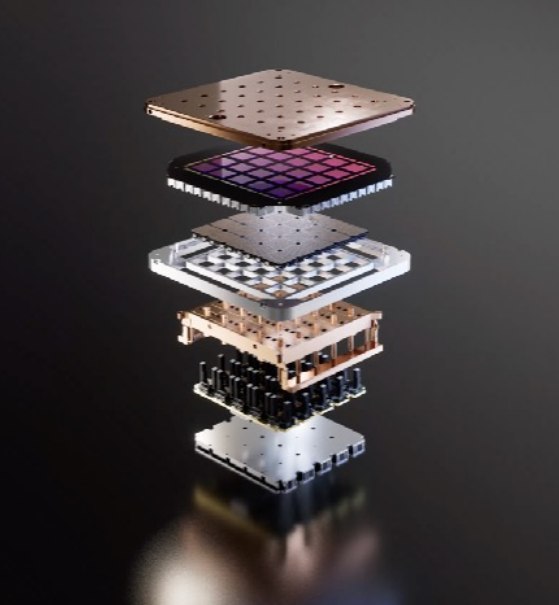
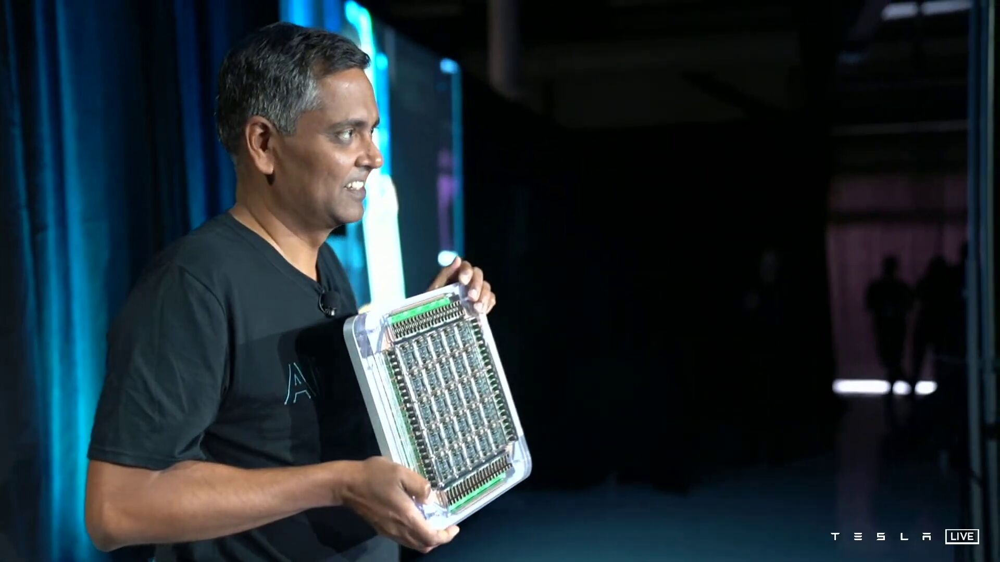
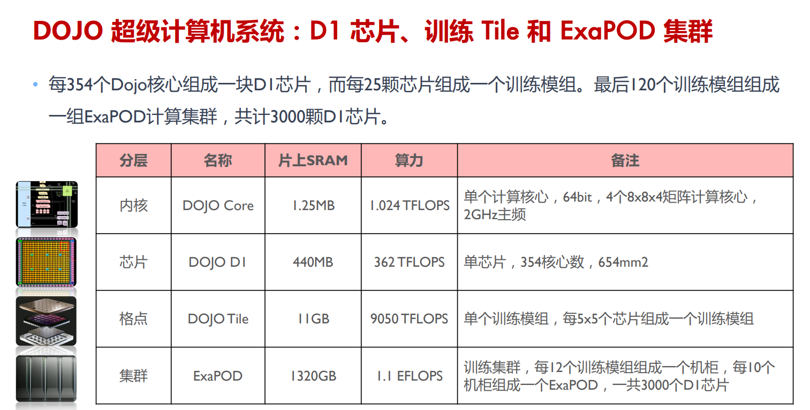
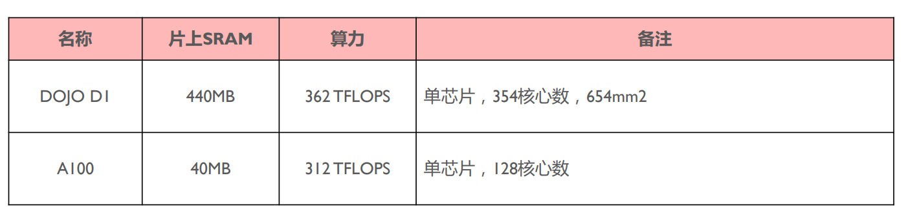

# 特斯拉DOJO架构

<!-- > 待更新中，卷的不行了卷得不行了！ZOMI 一个人晚上下班后才能更新视频和文章，如果您有兴趣也非常希望您能够参与进来（Github Issues 区留言或者B站私信ZOMI哦），一起写AI系统，一起分享AI系统的知识。

## 本节视频

<html>
<iframe src="https://player.bilibili.com/player.html?aid=401861874&bvid=BV1Ro4y1M7n8&cid=1151202917&page=1&as_wide=1&high_quality=1&danmaku=0&t=30&autoplay=0" width="100%" height="500" scrolling="no" border="0" frameborder="no" framespacing="0" allowfullscreen="true"> </iframe>
</html> -->

随着人工智能技术的发展，专用于AI计算的芯片也层出不穷。同时，专用的AI计算芯片又会进一步促进人工智能领域的快速迭代与进步。
本章节将会围绕国外较为知名的专用的AI计算芯片进行较为详细的介绍。本节将会介绍特斯拉发布的AI芯片——DOJO芯片。

介绍DOJO芯片的内容将会分为三个小节，分别是特斯拉DOJO芯片的架构，DOJO芯片的细节以及DOJO芯片的存算系统。而本小节内容将会围绕DOJO的整体架构进行介绍。

DOJO 特指特斯拉想要构建的超级计算机系统。所以本质来说，DOJO并不是一个芯片的名称，而是指一个巨大的可组合的超级计算机。它与当前世界上主流的超级计算机不同。主流的超级计算机是采购较为通用的CPU、GPU等组件组合而成，再选用与之匹配的机箱，电源传输，冷却等。而DOJO超级计算机是一个由从头到尾的完全重新定制的架构构建的，涵盖了计算、网络、输入/输出（I/O）芯片到指令集架构（ISA）、电源传输、包装和冷却。而这些都是为了大规模的运行定制的、特定的机器学习训练算法，专用于神经网络等算法的加速。

## D1 芯片

D1 芯片是 DOJO 超级计算机的基本单元。它是由 Ganesh Venkataramanan 带领的硬件团队所设计的。D1 芯片采用台积电7nm工艺制造，核心面积为645平方毫米，集成了多大500亿个晶体管。每个D1芯片 BF16、CFP8算力可达362TFLOPS，FP32算力可达 22.6TFLOPS，而TDP（热设计功耗）仅为 400W。D1芯片的供电方式与传统芯片的供电方式是不同的，这将会在后面的 Training Tile 部分进行讲解。

在每个D1芯片内包含345个计算核心（computing core），叫做 “DOJO core”。

每个 DOJO core 都具有CPU专用内存和I/O接口。所以我们甚至可以把每个 DOJO core 都看作一个独立的 PC 级的CPU。每个 DOJO core 都拥有一个1.25MB的SRAM作为主存，其中SRAM能以 400GB/s 速度加载数据，给 scalar 或者 vector 进行计算，并以 270GB/s 的速度存储。DOJO core 读写的速率非常的快！

## 训练瓦片（Training Tiles）

特斯拉将25个D1芯片分到已知的好模具上，然后用台积电的晶圆系统技术把它们包装起来，以极低的延迟和极高的带宽实现大量的计算集成。这就组成了一个训练瓦片（Training Tiles）。

基于D1芯片，特斯拉推出晶圆上系统级方案，通过应用台积电SoW封装技术，以极低的延迟和极高的带宽实现大量的计算集成，将所有25颗D1裸片集成到一个训练瓦片（Training Tiles）上，横排5个竖排5个，成方阵排列。每个D1芯片之间都是通过 DIP（DOJO接口处理器）进行互连。

每个 DOJO 训练瓦片（Training Tiles）都需要单独供电，每个瓦片消耗 15 kW。

由计算、I/O、功率和液冷模块就组成了一个完整的训练瓦片（Training Tiles）。

## 系统托盘（System Tray）

6个训练瓦片（Training Tiles）就会组成一个系统托盘（System Tray）。其中有非常多的电缆直接连接，具有高速连接，密集集成的特性。BF16/CFP8 峰值算例可达到54TFLOPS，功耗大概100+kW。

DIP（DOJO 接口处理器）是一个具有高带宽内存的PCIe卡，使用了特斯拉独创的传输协议TTP（Tesla Transport Protocol）。每个DIP都包含PCIe插槽和两个32GB的HBM。

DIP是主机与训练瓦片（Training Tiles）之间的桥梁。

TTP可以将标准以太网转化为Z平面拓扑，拥有高Z平面拓扑连。Z平面拓扑可以更好的帮助训练瓦片（Training Tiles）进行数据的交换，进而实现近存计算。

最多可以将5个DIP以 900GB/s 的速度连接到一个训练瓦片上，达到 4.5TB/s的总量。每个训练瓦片都有160GB的HBM。

## 主机（Cabinet）

两个系统托盘（System Tray）组成一个DOJO主机（Cabinet）

## ExaPOD 

每个 DOJO ExaPOD 拥有10个DOJO主机（Cabinet），集成了120个训练瓦片（Training Tiles），内置 3000个 D1 芯片，拥有100万个DOJO core，BF16/CFP8 峰值算力达到 1.1EFLOPS（百亿亿次浮点运算），拥有1.3TB高速SRAM和13TB高带宽DRAM。

# DOJO 设计哲学

DOJO采用存算一体架构（“存内计算”或者“近存计算”），具有单个可扩展计算平面、全局寻址快速存储器和统一的高带宽+低延迟功能。

* 面积精简：将大量计算内核集成到芯片中，最大限度提到AI计算的吞吐量。因此需要再保障算力的情况下使单个内核的面积尽可能小，更好的处理超算系统中算力堆叠和延迟之间的矛盾。

* 延迟精简：为了实现其区域计算效率最大化，内核以2GHz运行，只使用基本的分支预测器和小指令缓存，只保留必要的部件架构，其余面积留给向量计算和矩阵计算单元。

* 功能精简：通过削减对运行内部不是必须处理器功能，来进一步减少功耗和面积使用。DOJO core 不进行数据端缓存，不支持虚拟内存，也不支持精确异常。

接下来我们拿当前最热门的GPU芯片A100和DOJO D1芯片进行简单的比较，我们可以发现D1芯片的片上SRAM相比于当前主流的GPU要多一个数量级以上。

如果从计算核心角度来看，A100上虽然只有128个SM，但每个SM都有4个Tensor core。拿A100中Tensor core的数量和D1芯片中核心数量进行对比相差并不大。但是由于DOJO用的是存算一体的架构，所有D1芯片肯定更占优势！

