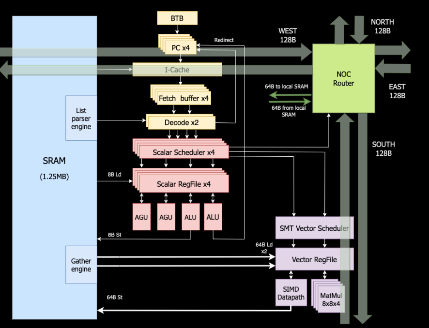
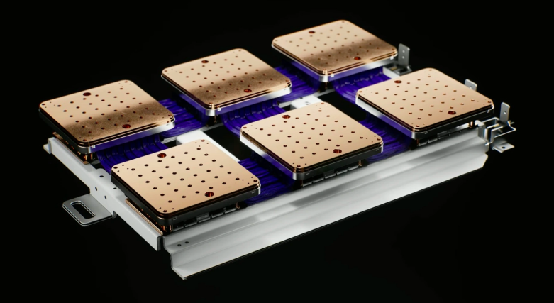
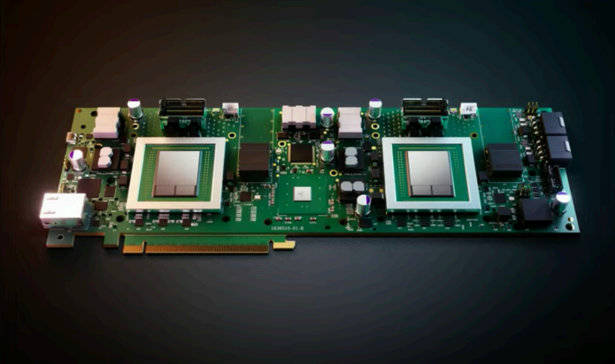
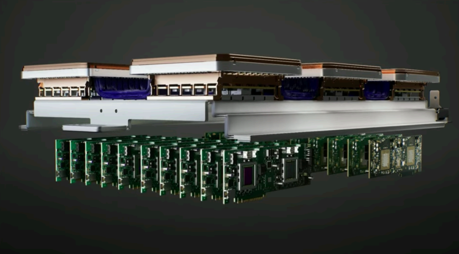
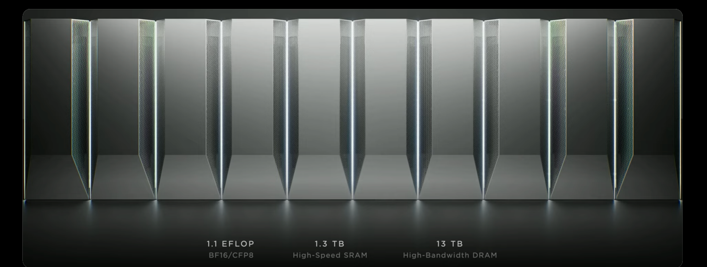

<!--Copyright © 适用于[License](https://github.com/chenzomi12/AISystem)版权许可-->

# 特斯拉 DOJO 架构

随着人工智能技术的发展，专用于 AI 计算的芯片也层出不穷。同时，专用的 AI 计算芯片又会进一步促进人工智能领域的快速迭代与进步。本章节将会围绕国外较为知名的专用的 AI 计算芯片进行较为详细的介绍。本节将会介绍特斯拉发布的 AI 芯片——DOJO 芯片。

介绍 DOJO 芯片的内容将会分为三个小节，分别是特斯拉 DOJO 芯片的架构，DOJO 芯片的细节以及 DOJO 芯片的存算系统。而本小节内容将会围绕 DOJO 的整体架构进行介绍。

DOJO 特指特斯拉想要构建的超级计算机系统。所以本质来说，DOJO 并不是一个芯片的名称，而是指一个巨大的可组合的超级计算机。它与当前世界上主流的超级计算机不同。主流的超级计算机是采购较为通用的 CPU、GPU 等组件组合而成，再选用与之匹配的机箱，电源传输，冷却等。而 DOJO 超级计算机是一个由从头到尾的完全重新定制的架构构建的，涵盖了计算、网络、输入/输出（I/O）芯片到指令集架构（ISA）、电源传输、包装和冷却。而这些都是为了大规模的运行定制的、特定的机器学习训练算法，专用于神经网络等算法的加速。

## D1 芯片

D1 芯片是 DOJO 超级计算机的基本单元。它是由 Ganesh Venkataramanan 带领的硬件团队所设计的。D1 芯片采用台积电 7nm 工艺制造，核心面积为 645 平方毫米，集成了多大 500 亿个晶体管。每个 D1 芯片 BF16、CFP8 算力可达 362TFLOPS，FP32 算力可达 22.6TFLOPS，而 TDP（热设计功耗）仅为 400W。D1 芯片的供电方式与传统芯片的供电方式是不同的，这将会在后面的 Training Tile 部分进行讲解。

在每个 D1 芯片内包含 345 个计算核心（computing Core），叫做 “DOJO Core”。

每个 DOJO Core 都具有 CPU 专用内存和 I/O 接口。所以我们甚至可以把每个 DOJO Core 都看作一个独立的 PC 级的 CPU。每个 DOJO Core 都拥有一个 1.25MB 的 SRAM 作为主存，其中 SRAM 能以 400GB/s 速度加载数据，给 scalar 或者 vector 进行计算，并以 270GB/s 的速度存储。DOJO Core 读写的速率非常的快！

## 训练瓦片（Training Tiles）

特斯拉将 25 个 D1 芯片分到已知的好模具上，然后用台积电的晶圆系统技术把它们包装起来，以极低的延迟和极高的带宽实现大量的计算集成。这就组成了一个训练瓦片（Training Tiles）。

基于 D1 芯片，特斯拉推出晶圆上系统级方案，通过应用台积电 SoW 封装技术，以极低的延迟和极高的带宽实现大量的计算集成，将所有 25 颗 D1 裸片集成到一个训练瓦片（Training Tiles）上，横排 5 个竖排 5 个，成方阵排列。每个 D1 芯片之间都是通过 DIP（DOJO 接口处理器）进行互连。

每个 DOJO 训练瓦片（Training Tiles）都需要单独供电，每个瓦片消耗 15 kW。由计算、I/O、功率和液冷模块就组成了一个完整的训练瓦片（Training Tiles）。

## 系统托盘（System Tray）

6 个训练瓦片（Training Tiles）就会组成一个系统托盘（System Tray）。其中有非常多的电缆直接连接，具有高速连接，密集集成的特性。BF16/CFP8 峰值算例可达到 54TFLOPS，功耗大概 100+kW。

DIP（DOJO 接口处理器）是一个具有高带宽内存的 PCIe 卡，使用了特斯拉独创的传输协议 TTP（Tesla Transport Protocol）。每个 DIP 都包含 PCIe 插槽和两个 32GB 的 HBM。

DIP 是主机与训练瓦片（Training Tiles）之间的桥梁。

TTP 可以将标准以太网转化为 Z 平面拓扑，拥有高 Z 平面拓扑连。Z 平面拓扑可以更好的帮助训练瓦片（Training Tiles）进行数据的交换，进而实现近存计算。

最多可以将 5 个 DIP 以 900GB/s 的速度连接到一个训练瓦片上，达到 4.5TB/s 的总量。每个训练瓦片都有 160GB 的 HBM。

两个系统托盘（System Tray）组成一个 DOJO 主机（Cabinet）

每个 DOJO ExaPOD 拥有 10 个 DOJO 主机（Cabinet），集成了 120 个训练瓦片（Training Tiles），内置 3000 个 D1 芯片，拥有 100 万个 DOJO Core，BF16/CFP8 峰值算力达到 1.1EFLOPS（百亿亿次浮点运算），拥有 1.3TB 高速 SRAM 和 13TB 高带宽 DRAM。

## DOJO 设计哲学

每 354 个 Dojo Core 组成一块 D1 芯片，而每 25 课芯片组成一个训练瓦片（Training Tiles）。最后 120 个训练瓦片（Training Tiles）组成一组 DOJO ExaPOD 计算集群，共计 3000 颗 D1 芯片。

| 分层 | 名称           | 片上 SRAM | 算力         | 备注                                                         |
| ---- | -------------- | -------- | ------------ | ------------------------------------------------------------ |
| 内核 | DOJO Core      | 1.25MB   | 1.024 TFLOPS | 单个计算核心，64bit，4 个 8x8x4 矩阵计算核心，2GHz 主频        |
| 芯片 | DOJO D1        | 440MB    | 362 TFLOPS   | 单芯片，354 个核心数，654mm2                                  |
| 瓦片 | Training Tiles | 11GB     | 9050 TFLOPS  | 单个训练瓦片，每个 5x5 个芯片组成一个训练瓦片                |
| 集群 | DOJO ExaPOD    | 1320GB   | 1.1 EFLOPS   | 训练集群，每 12 个训练模组组成一个机柜，每 10 个机柜组成一个 ExaPOD，一共 3000 个 D1 芯片 |

DOJO 采用存算一体架构（“存内计算”或者“近存计算”），具有单个可扩展计算平面、全局寻址快速存储器和统一的高带宽+低延迟功能。

* 面积精简：将大量计算内核集成到芯片中，最大限度提到 AI 计算的吞吐量。因此需要再保障算力的情况下使单个内核的面积尽可能小，更好的处理超算系统中算力堆叠和延迟之间的矛盾。

* 延迟精简：为了实现其区域计算效率最大化，内核以 2GHz 运行，只使用基本的分支预测器和小指令缓存，只保留必要的部件架构，其余面积留给向量计算和矩阵计算单元。

* 功能精简：通过削减对运行内部不是必须处理器功能，来进一步减少功耗和面积使用。DOJO Core 不进行数据端缓存，不支持虚拟内存，也不支持精确异常。

接下来我们拿当前最热门的 GPU 芯片 A100 和 DOJO D1 芯片进行简单的比较，我们可以发现 D1 芯片的片上 SRAM 相比于当前主流的 GPU 要多一个数量级以上。

| 名称    | 片上 SRAM | 算力      | 备注                      |
| ------- | -------- | --------- | ------------------------- |
| DOJO D1 | 440MB    | 362TFLOPS | 单芯片，354 核心数，654mm2 |
| A100    | 40MB     | 312TFLOPS | 单芯片，128 核心数         |

如果从计算核心角度来看，A100 上虽然只有 128 个 SM，但每个 SM 都有 4 个 Tensor Core。拿 A100 中 Tensor Core 的数量和 D1 芯片中核心数量进行对比相差并不大。但是由于 DOJO 用的是存算一体的架构，所有 D1 芯片肯定更占优势！
