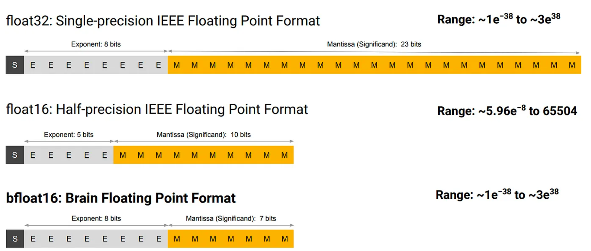

<!--Copyright © 适用于[License](https://github.com/chenzomi12/AISystem)版权许可-->

# 谷歌 TPU 历史发展

在本章节中，我们将深入探讨谷歌的 Tensor Processing Unit（TPU）的发展历程及其在深度学习和人工智能领域的应用。TPU 是谷歌为加速机器学习任务而设计的专用集成电路（ASIC），自首次推出以来，TPU 经历了多次迭代升级，包括 TPU v1、v2、v3 和 v4，以及 Edge TPU 和 Google Tensor 等产品。

这些 TPU 芯片在制程技术、芯片大小、内存容量、时钟速度、内存带宽和热设计功耗等方面都有显著的提升，为数据中心和边缘设备提供了强大的计算能力。

本章节将简单介绍 TPU 的演进过程，包括其在不同代 TPU 芯片上的技术革新，以及如何通过低精度计算、脉动阵列、专用硬件设计等方法优化矩阵计算性能。此外，我们还将探讨 TPU 在实际应用中的表现，以及谷歌如何通过 TPU 推动移动计算体验的进步。

## TPU 的出现

早在 2006 年，谷歌的内部就讨论过在自家的数据中心中部署图形处理器（GPU）、现场可编程门阵列（FPGA）或自研专用集成电路（ASIC）的可能性。但当时能够在特殊硬件上运行的少数应用程序可以几乎 0 代价的利用当时谷歌大型数据中心的过剩算力完成，那什么比免费的午餐更有吸引力呢？于是此项目并没有落地。

但是在 2013 年，风向突变，当时谷歌的研究人员做出预测：如果人们每天使用语音搜索并通过深度神经网络（DNN）进行 3 分钟的语音识别，那么当时谷歌的数据中心需要双倍的算力才能满足日益增长的计算需求，而仅仅依靠传统 CPU 来满足这种需求是非常昂贵的。[[1]](#ref1)于是，在这个背景下，谷歌开始了 TPU 的设计。

通常一个芯片的开发需要几年的时间，然而谷歌不愧是谷歌，TPU 从立项到大规模部署只用了 15 个月。TPU 项目的领头人 Norm Jouppi 说到：“我们的芯片设计过程异常迅速，这本身就是一项非凡的成就。令人惊叹的是，我们首批交付的硅片无需进行任何错误修正或掩模的更改。考虑到在整个芯片构建过程中，我们还在同步进行团队的组建，紧接着迅速招募 RTL（寄存器传输级）设计专家，并且急切地补充设计验证团队，整个工作节奏非常紧张。”[[2]](#ref2)

## TPU 芯片与产品

### 历代 TPU 芯片

以下表格是不同 TPU 芯片型号的具体参数和规格，我们的 TPU 系列会主要围绕 v1, v2, v3, v4 这一系统去展开。

| TPU 比较              | TPUv1       | TPUv2       | TPUv3       | Edge TPU v1 | Pixel Neural Core | TPUv4i      | TPUv4       | Google Tensor |
|------------------------|-------------|-------------|-------------|-------------|-------------------|-------------|-------------|---------------|
| 推出日期              | 2016 年     | 2017 年     | 2018 年     | 2018 年     | 2019 年           | 2020 年     | 2021 年     | 2021 年       |
| 制程技术              | 28nm        | 16nm        | 16nm        | -           | -                 | 7nm         | 7nm         | -             |
| 芯片大小 (mm²)        | 330         | 625         | 700         | -           | -                 | 400         | 780         | -             |
| 芯片内存 (MB)         | 28          | 32          | 32          | -           | -                 | 144         | 288         | -             |
| 时钟速度 (MHz)        | 700         | 700         | 940         | -           | -                 | 1050        | 1050        | -             |
| 内存                  | 8 GiB DDR3   | 16 GiB HBM   | 32 GiB HBM  | -           | -                 | 8GiB DDR     | 32 GiB HBM   | -             |
| 内存带宽 (GB/s)       | 300         | 700         | 900         | -           | -                 | 300         | 1200        | -             |
| 热设计功耗 (W)        | 75          | 280         | 450         | -           | -                 | 175         | 300         | -             |
| TOPS (Tera/Second)    | 92           | 45         | 123         | 4           | -                 | -        | 275         | -             |
| TOPS/W                | 0.31         | 0.16        | 0.56        | 2           | -                 | -        | 1.62        | -             |

下图是几代 TPU 的俯视图，第一行从左到右分别是 TPU v1, v2, v4, 第二行从左到右为 v4i 和 v3

### 历代 TPU 产品

在前文中，我们讨论了 CPU 的不同型号，现在让我们将注意力转向谷歌的 TPU 产品线。

以下表格中除了芯片之外，随着技术地不断进步和对于超大计算资源的需求，谷歌研发了 TPU Pod，这是一种由众多 TPU 单元构成的超大规模计算系统，专为处理大量深度学习和 AI 领域的并行计算任务而设计。

除了具有超强的算力之外，TPU Pod 装备了高速的互联网络，保证了 TPU 设备之间无缝的数据传输以保证强大的数据、模型层的高效拓展性。

|名称       | 时间        | 性能                              | 应用                |
|--------------|-----------|------------|----------------------------------|
|               TPUv1     | 2016 年    | 92Tops + 8GB DDR3                | 数据中心推理       |
|               TPUv2     | 2017 年    | 180TFlops(浮点计算能力) + 64GB(HBM) | 数据中心训练和推理 |
|               TPUv3     | 2018 年    | 420TFlops + 128GB(HBM)           | 数据中心训练和推理 |
|               Edge TPU  | 2018 年    | 可处理高吞吐量的稀疏数据        | IoT 设备           |
|               TPUv2 Pod | 2019 年    | 11.5 万亿次运算/秒，4TB ( HBM )   | 数据中心训练和推理 |
|              TPUv3 Pod | 2019 年    | >100 万亿次运算/秒，32TB ( HBM )  | 数据中心训练和推理 |
|               TPUv4     | 2021 年    | -                                | 数据中心训练和推理 |
|               TPUv4 Pod | 2022 年    | -                                | 数据中心训练和推理 |

随着时间的推移，谷歌不仅在大型数据中心部署了先进技术，还洞察到将这些技术应用于消费电子产品，尤其是智能手机市场的巨大潜力。于是在 2017 年，谷歌在 Pixel 2 和 Pixel 3 上便搭载了谷歌针对消费类产品的首个定制图像芯片 —— Pixel Visual Core。之后，谷歌基于 Edge TPU 的框架研发了继任芯片 —— Pixel Neural Core，在 2019 年 10 月发布的 Pixel 4 上首次搭载。之后，谷歌在 Pixel 产品线上对于 TPU 的依赖也一直延续到了今天。

在这个 AI 爆发的大时代，谷歌在移动端的 AI 掷下豪赌，对于最新发布的 Tensor G3，Google Silicon 的高级总监 Monika Gupta 是这样评价的：“我们的合作与 Tensor 一直不仅仅局限于追求速度和性能这样的传统评价标准。我们的目标是推动移动计算体验的进步。

在最新的 Tensor G3 芯片中，我们对每个关键的系统组件都进行了升级，以便更好地支持设备上的生成式人工智能技术。这包括最新型号的 ARM 中央处理器、性能更强的图形处理器、全新的图像信号处理器和图像数字信号处理器，以及我们最新研发的，专门为运行 Google 的人工智能模型而量身打造的 TPU。”[[3]](#ref3)

## TPU 架构演进

### TPU v1 概览

第一代 TPU 主要服务于 8 比特的矩阵计算，由 CPU 通过 PCIe 3.0 总线驱动 CISC 指令。采用 28nm 工艺制造，频率为 700MHz，热设计功耗为 40 瓦。具有 28MiB 的芯片内存和 4MiB 32 位累加器，用于存储 256x256 系统阵列的 8 位乘法器的结果。

TPU 封装内还有 8GiB 双通道 2133MHz DDR3 SDRAM，带宽为 34GB/s。指令能够将数据传输至/离开主机、执行矩阵乘法或卷积运算，以及应用各种激活函数。

受限于时代，初代 TPU 主要针对 2015 年左右最火的深度学习网络进行优化，主要分为以下三类：

- MLP 多层感知机（**M**ulti**L**ayer **P**erceptron）

- CNN 卷积神经网络（**C**onvolutional **N**eural **N**etwork）

- RNN 递归神经网络（**R**ecurrent **N**eural **N**etwork）& LSTM 长短期记忆（**L**ong **S**hort-**T**erm **M**emory）
  
而在这三类中，由于 RNN 和 LSTM 的高复杂度，初代 TPU 只能在前两种模型框架的推理场景进行优化。

### TPU v1 优化点

为了强化 TPU 的矩阵计算性能，谷歌的工程师针对其进行了若干特殊设计和优化，以提高处理深度学习计算工作负载的效率。以下是谷歌为了加强 TPU 在矩阵计算方面性能所做的三种主要努力和特殊设计：

- **特性一：低精度**

神经网络在进行推理时，并不总是需要 32 位浮点数（FP32）或 16 位浮点数（FP16）以上的计算精度。TPU 通过引入一种称为**量化**的技术，可以将神经网络模型的权重和激活值从 FP32 或 FP16 转换为 8 位整数（Int8），从而实现模型的压缩。这种转换使得 INT8 能够近似表示在预设最小值和最大值之间的任意数的同时优化模型的存储和计算效率。

在下图从 FP32 量化到 INT8 的过程中，虽然单个数据点无法维持 FP32 的超高精确度，整体数据分布却能保持大致准确。

尽管连续数值被压缩到较小的离散范围可能引起一定精度损失，但得益于神经网络的泛化能力，在推理场景，特别是分类任务中，量化后的神经网络模型能够在保持接近原始 FP32/FP16 精度水平的同时，实现更快的推理速度和更低的资源消耗。

- **特性二：脉动阵列 & MXU**

在 TPU 中有一个关键组件叫做 MXU（Matrix Multiply Unit，矩阵乘法单元）。与传统的 CPU 和 GPU 架构相比，MXU 专为高效处理大规模的 Int8 矩阵加乘法运算而设计了独特的**脉动阵列**（Systolic Array）架构。

CPU 旨在执行各种计算任务，因此具备通用性。CPU 通过在寄存器中存储数据，并通过程序指令控制算术逻辑单元（ALU）读取哪些寄存器、执行何种操作（如加法、乘法或逻辑运算）以及将结果存储到哪个寄存器。程序由一系列的读取/操作/写入指令构成。这些支持通用性的特性（包括寄存器、ALU 以及程序控制）在功耗和芯片面积上付出了较高的代价。但是对于 MXU 来说，它只需要用 ALU 大批量处理矩阵的加乘运算，而在矩阵的加乘运算生成输出时会多次复用输入数据。因此在某些情况下，TPU 只需要读取每个输入值一次，就可以在不存储回寄存器的情况下将数据复用于许多不同的操作。[[2]](#ref2)

下面这个图中，左边的图例描述了 CPU 中的程序逻辑，数据在经过 ALU 计算前后都会经由寄存器处理，而右图描述了 TPU 内部数据在 ALU 之间更快地流动且复用的过程。[[2]](#ref2)

下图的两个动图是脉动阵列的原理图示，我们可以看到，输入的数据在和权重矩阵相乘的流动中十分有节奏感，就像是心脏泵血一样，这就是为什么脉动阵列要这样命名（注：Systolic 一词专指“心脏收缩的”）

用脉动阵列做输入向量和权重矩阵的矩阵乘法           |  用脉动阵列做输入矩阵和权重矩阵的矩阵乘法    
:-------------------------:|:-------------------------:
 |  

MXU 的本质就是一个包含了 $256 \times 256 = 65536$ 个 ALU 的超大的、每一个时钟周期可以处理 65536 个 INT8 加乘运算的脉动阵列。将这个数字和 TPU v1 的频率 700MHZ 相乘我们可以得出 TPU v1 可以每秒钟处理 $65536 \times 7 \times 10^8 \approx 4.6 \times 10 ^{12} $ 个加乘运算。下图中我们可以看到，数据和权重由控制器控制传入 MXU，脉冲阵列中经过计算再产出最终的结果。

**特性三：专用硬件（Minimal and Deterministic Design）**

就如上文提到的，CPU 和 GPU 为了当好多面手，他们复杂的设计导致了许许多多的问题。在推理场景下，CPU 和 GPU 上的处理器行为在其极度复杂的设计下往往难以预测，从而导致了很多无法被预估也无法被解决的数据以及计算延迟。但是 TPU 不同，TPU 的设计简单且实用，所有的设计只为服务一个任务：神经网络推理。

由于目标的单一化，TPU 上的控制逻辑（control logic）只占了芯片的 2%（远低于 CPU 和 GPU）。同时，由于 TPU 在简化设计和增加芯片内存基础上又缩小了芯片的大小，TPU 的成本控制和良品率也远远优于其他体型更大的芯片。

### TPU v2 概览

在 2017 年的五月，谷歌推出了 TPU V2。TPU v2 的设计集成了高带宽的存储解决方案，具有 16GiB 的 HBM，并能够提供最高 600 GB/s 的内存带宽，以及 45 TFLOPS 的浮点运算能力，用于支持更加高效的内存访问、数据操作、和复杂运算。

进一步地，谷歌将四个 TPU v2 排列成了性能为 180 TFLOPS 的四芯片模块，并将这样的 64 个模块组成一个一共有 256 片 TPU v2 集成的 TPU v2 Pod，理论峰值计算量达到了恐怖的 11.5 PFLOPS。

以下三张图是分别是 TPU v2 和 Tpu v2 Pods

TPU v2 和 v1 的架构差距很小，而主要的架构不同体现在训练场景的优化。我们上文提到，在神经网络的超强泛化能力下，TPU v1 通过将 FP32/FP16 量化成 INT8 的方式大幅度优化了推理场景的计算效率 —— 然而在模型的训练的过程中，INT8 则会导致模型训练中的不稳定和极大随机性，这对于模型训练来说是灾难性的。于是在 TPU v2 中，谷歌的工程师们优化了芯片架构，增加了对于 BF16 的支持。

下图中详细解释了 FP32，FP16 和 BF16 的区别。总的来说，BF16 数据格式通过减少尾数位数至 7 位，同时保留 8 位的指数部分，用一定的数据精度换来了更宽的数值范围。这种优化主要带来了以下三个优势：

- 尽管 bfloat16 在尾数精度上有所减少，但其保留的数值范围确保了对于广泛数值分布的数据处理能力，在 FP32 的臃肿和 FP16 的低范围中找到了平衡，有效降低了数值溢出和下溢的风险，从而增强了算法的稳定性和可靠性。

- BF 在执行计算时，由于结构上的简化，大幅缩短了对于芯片内存的需求，使得 TPU 可以接受更大的批量大小，训练更大的模型。

- BF16 格式减少了存储和带宽的需求。这意味着相同的内存和带宽可以处理更多的数据，提高了 TPU 数据传输和吞吐效率和计算速率，使得大规模的数据集和复杂模型可以在资源有限的环境中被有效训练和使用。

### TPU v3 概览

TPU v3 相较于其前身 TPU v2 有了显著的提升。这一代 TPU 在晶体管数量上增加了 11%，同时在时钟频率、互连带宽和内存带宽上实现了 1.35 倍的提升。尽管面积仅增加了 6%，TPU v3 的矩阵单元（MXU）数量翻了一倍，结合前面提到的改进，TPU v3 实现了相比于 v2 2.7 倍的理论峰值性能提升。

此外，TPU v3 的一个显著改进是其 2D torus 互连结构，它从 TPU v2 的 256 个芯片扩展到了 TPU v3 的 1,024 个芯片，这使得 Pod 超算型号的处理能力提升了 10.7 倍，计算理论峰值从 12 petaflops 跃升至 126 petaflops（BF16）。[[2]](#ref5)

### TPU v4 概览

2021 年，谷歌推出了 TPU 系列的最新升级 TPU v4，从 16 纳米缩减至 7 纳米，芯片数量是 TPU v3 的四倍，可以说是谷歌在 TPU 制程工艺上最大的一次更新。这一代 TPU 在内存方面也实现了显著的提升，其内存容量从 9MB 增长到 44MB，而 HBM 2 内存则保持了 32GB 的配置。

在内存带宽上，TPU v4 带来了 33%的提升，达到了 1.2TB/s。就像 v3 之于 v2，TPU v4 首次应用了 3D torus 的互联方式，提供了比 2D torus 更高的带宽和更优的性能，能够支持多达 4,096 个 TPU v4 核心，在 TPU v4 POD 中总共提供了 1.1260 exaflops 的 BF16 峰值算力。

以下是 3d torus 的图例，简单来说，相比于 2d torus，3d torus 中的节点可以左右、上下、前后互联。谷歌在论文中提到，3D torus 提供了比 2D torus 更高的双分带宽（Higher Bisection Bandwidth），结合 OCS 能够跳过故障的单元，大大提升了 TPU 的可用性。同时，3d torus 也增强了用户使用时候的定制性和模块化，用户可以按需选择需要的拓扑结构。

## 小结

TPU 自 2016 年推出第一代 TPU 以来，谷歌不断推进 TPU 技术的发展，以满足日益增长的计算需求和提高数据处理效率。从最初的 TPU v1，谷歌便展示了其在低精度计算和高效矩阵运算方面的创新。随着 TPU v2 和 v3 的推出，谷歌不仅提升了计算性能，还优化了内存带宽和互连结构，使得 TPU 能够更好地处理大规模并行计算任务。到了 TPU v4，谷歌更是采用了先进的 7 纳米制程技术，并引入了 3D torus 互联方式，大幅提高了 TPU 的计算能力和能效比。

在后面的课程中，我们会更加细致地去讲解 TPUv1 到 v4 的演化史，并深入探讨每一代 TPU 在架构设计、性能提升以及应用场景上的创新与突破。

## 本节视频

<iframe src="https://player.bilibili.com/player.html?aid=569330788&bvid=BV1tv4y1V72f&cid=1075822112&page=1&as_wide=1&high_quality=1&danmaku=0&t=30&autoplay=0" width="100%" height="500" scrolling="no" border="0" frameborder="no" framespacing="0" allowfullscreen="true"> </iframe>

## 参考文献

1. [In-Datacenter Performance Analysis of a Tensor Processing Unit](https://arxiv.org/abs/1704.04760)
2. [An in-depth look at Google’s first Tensor Processing Unit (TPU)](https://cloud.google.com/blog/products/ai-machine-learning/an-in-depth-look-at-googles-first-tensor-processing-unit-tpu)
3. [Google Tensor G3: The new chip that gives your Pixel an AI upgrade](https://blog.google/products/pixel/google-tensor-g3-pixel-8/)
4. [Wikipedia-Tensor Processing Unit](https://en.wikipedia.org/wiki/Tensor_Processing_Unit#cite_note-TPU_memory-15)
5. [A Domain-Specific Supercomputer for Training Deep Neural Networks](https://cacm.acm.org/research/a-domain-specific-supercomputer-for-training-deep-neural-networks/)
