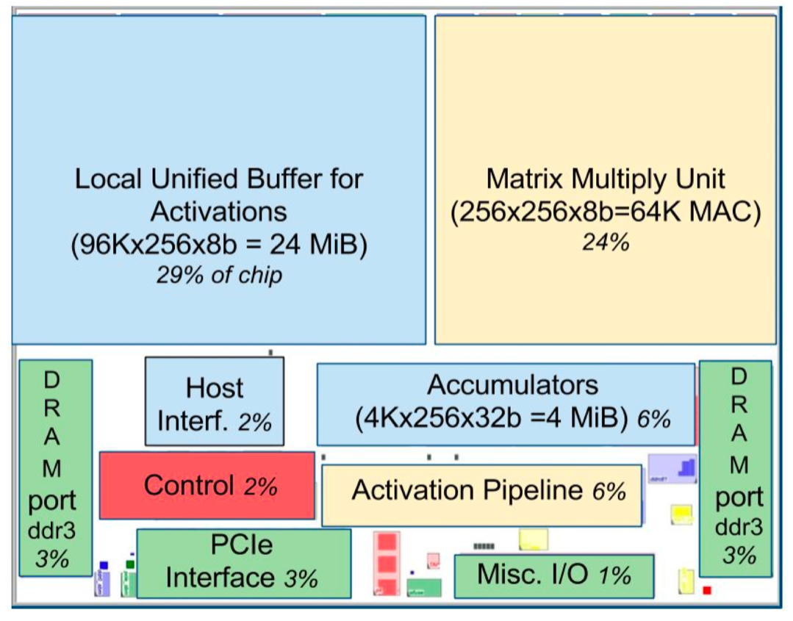

# 谷歌TPU v1 - 脉动阵列

## 本章简介

本章节深入探讨了谷歌TPU v1的架构和设计原理。我们将解析TPU v1芯片的关键元素，包括DDR3 DRAM、矩阵乘法单元（MXU）、累加器和控制指令单元。重点介绍脉动阵列（Systolic Array）的工作原理，它是TPU的核心，通过数据的流水线式处理实现高效的矩阵乘法计算。此外，我们还将对比TPU v1与CPU、GPU在服务器环境中的性能差异，以及TPU v1在当时技术背景下的创新之处。

## TPU v1 芯片架构

我们先来看一下谷歌的打印电路板

然后我们来解析一下TPU v1上几个关键的元素：

- **DDR3 DRAM / Weight FIFI**: 第一个讲的是谷歌的Weight FIFO，位于图像的右上角。在模型推理场景，通过DDR3-2133接口，模型权重会被存储在TPU v1上的DDR3 RAM内。这些权重通过PCIe从主机计算机的内存中“预加载”到这些芯片上，然后可以传输到芯片的Weight FIFO内存中，以便矩阵乘法单元（MXU）使用。

- **矩阵乘法单元 MXU（MMU）**: MXU以脉动阵列的形式工作，能够提供$ 256 \times 256 \times 8 $bit的乘加计算，在每个时钟周期输出256个16bit的部分和计算结果。矩阵单元里面包含一个64kb的Weight Tile以及一个双缓存单元用于缓存回调。MXU被谷歌的工程师们描述为“TPU的心脏”，在本章节后面的内容中，我们会更加细致的去剖析这一部分的设计。

- **累加器 Accumulators**: 这是一个能够存储4MiB的32-bit数据的累加单元，用来存储MXU计算后的结果。这4MiB代表着4096个，每个含256个元素的32位累加器。为什么是4096呢？原因是谷歌的工程师注意到每字节的运算次数需要达到峰值性能大约是1350，继而将其向上舍入到2048，然后再翻倍让便编译器在运行至峰值性能时能使用双缓冲，这也就是为什么这个累加器被设计为4MiB。

- **控制指令 Control**: 每个芯片都需要一个控制模块，而在TPU中，整个控制单元采用了四级流水线设计。控制单元的主要任务是接收通过PCIE总线或主机（CPU）传递的指令，并将这些指令执行于TPU。这些指令源自CPU，而芯片的指令集为CISC，共包含12条指令。TPU采用CISC而非更简单的WISC指令集的原因是，谷歌定义的每条指令的平均执行周期为10-20个时钟周期，这使得每条指令相对复杂。特别是，TPU中的各种单元，如MXU、UB和AU，都定义了一些专门为神经网络设计的高级复杂指令。
    - Read_Host_Memory: 从CPU host读取数据到Unified Buffer 
    - Read_Weight: 从Weight DRAM读取数据到Weight FIFO
    - Matrix_Multiply/Convolve: 执行乘法或卷积运算
    - Activate: 执行ReLU，Sigmoid等激活计算
    - Write_Host_Memory: 把计算结果数据从Unified Buffer输出到CPU host

通过这些指令，TPU能够顺序地执行读取、写入、计算和激活操作，从而处理神经网络各层的具体计算需求。

## TPU v1芯片布局图

我们可以看到整个TPU属于一个专用的电路，里面最大的两个就是Local Unified BUffeer和MXU，一个用于缓存，一个用于计算加乘计算。由于TPU是专门应用于矩阵计算的芯片，继而不需要极度复杂的控制单元，所以我们上文讲到的控制器只用了2%的面积，给核心功能留下了更多的空间。

## 脉冲阵列 - Systolic Array

### 脉动阵列简介

脉冲阵列就是TPU的核心，也是我们本章最重要的内容。脉冲阵列的英文名Systolic Array就是源于它处理数据的节奏就像我们的心跳一样，于是便有了这个名字。

在我们讲到具体的实现之前，我们需要先回顾一下Img2Col这个算法。我们知道，在推理场景，在2017年附近，卷积神经网络占据了当时场景的半壁江山。在卷积计算的时候，我们实际上不会对真正地对图片或者feature map进行卷积，而是会用Img2Col的方式把图片变成矩阵，把我们的卷积换成矩阵相乘的方式。在我们之前推理系统里面我们讲过算法是怎么把卷积操作变成在数学上和卷积相同的矩阵乘法操作，再通过Col2Img返回来把我们的计算结果变成feature map。而自然而然，其中计算压力最大的部分便是我刚才提到的“矩阵乘法”操作。

如下图所示，两个矩阵相乘实际上就是用矩阵A的一行去点乘矩阵B的一列，最终获得输出矩阵的某一个元素。

那脉动阵列的数据是怎么流动的呢？

下图是一个简单的图解，数据一波一波根据FIFO（图最左边的蓝色方块）流入MXU进行计算，计算出来的结果会被存放在下方的寄存器中进行累加和输出。整个过程就像是心脏泵血，每一个时钟周期都会进行一次庞大的计算，并流入到下一个需要这个结果的地方。那么在这里需要注意的是， 因为TPU在一个时钟周期可以进行 \(256 \times 256 = 65536\)次计算，每次参与计算的逻辑单元又被串联在一起从而实现了计算结果的复用，这使得TPU能够在更少次访问芯片内存的情况下完成更高的计算，降低了内存和芯片带宽的压力，从而让TPU的能耗比在同时期达到了领先的状态。

### 脉动阵列原理

终于讲到了脉动阵列的具体原理，或者说，为什么这种架构相比于传统的数据计算方式有这么大的优势。

下面这张幻灯片中，M（Memory）我们可以理解为芯片上的寄存器，PE（Process Elements）则可以理解为进行数据计算的单元。 

传统的计算方式（左图）是数据每计算一次就要存储一次，而下一次要调取计算结果的时候也要从存储器里面重新获得这个数据，往复循环。那么在脉动结构中，单一PE被替换成了一串PE。数据在经手所有PE计算之后才会被存储，由于矩阵加乘计算需要大量的数据复用，这种数据计算流程大量地减少了数据被访问的次数，从而实现了更高的效率。

那么有了以上先验知识，我们就以两个\(3 \times 3\)的矩阵，下图中的矩阵A和矩阵B，去上手一下我们的脉动阵列。首先我们要注意的就是脉动阵列数据的排序，相比于“矩形”的矩阵，数据被人工地进行了错位，以阶梯状输入阵列。可以仔细观察，矩阵A和矩阵B在不同的行列维度上被分开，原因是矩阵乘法需要A的每一行去点乘B的每一列，因此有了这种设计。可能在这里会有点一头雾水，但是只要仔细看了下面的每一步的拆解，我相信当你重新读这段话的时候会更容易理解。

**以下是脉动阵列每一步的动作图解：**

|          第一步（\(T=1\)）： \(a_{0,0}\)和\(b_{0,0}\)进入MXU在第一个处理器被计算，并等待下一轮的数据            |         第二步（\(T=2\)）： \(a_{0,0}\)和\(b_{0,0}\)沿着原方向被传到下一个处理器，分别与新传入的\(a_{1,0}\)和\(b_{0,1}\)计算 同时\(a_{0,1}\)和\(b_{1,0}\)进入第一个处理器，和上一轮\(a_{0,0}\)和\(b_{0,0}\)的计算结果累加              |
|:---------------------:|:---------------------:|
|           |           |

以此类推，反复应用这个计算逻辑，我们就能最终得到矩阵A每一行元素和矩阵B每一列元素的点乘，再最终将这些运算结果输出，就获得了最终的结果。

| \(T=3\) | \(T=4\) | \(T=5\) | \(T=6\) | \(T=7\) |
|:-------:|:-------:|:-------:|:-------:|:-------:|
|  |  |  |  |  |

### 脉动阵列计算延迟

当我们讨论脉动阵列和TPU的计算延迟时，重要的是要明白如何有效地管理和优化这些延迟，以保持高效的计算流程。在TPU中，尤其是当数据需要通过一系列的计算单元进行传递时，每个单元的处理时间会对整体性能产生影响。

首先，TPU的设计采用了流水线技术，这是一种典型的硬件加速技术，用于提高计算效率和吞吐量。在流水线操作中，不同的计算阶段被划分成多个小的步骤或级别，每个级别专注于完成特定的任务。TPU的CISC使用了四级流水线来处理指令，其中上文介绍的Matrix_Multiply，也就是数据在计算单元中被计算的指令，可能需要较长时间才能完成。为了不让这种计算延迟影响整体性能，TPU利用指令重叠技术来隐藏延迟。也就是说，在一个计算指令还未完成前，已经开始准备或执行下一个计算任务，从而抵消掉计算的延迟。

### 脉动阵列小结

从数学和计算机科学的角度来看，脉动阵列是一种并行计算架构，它通过在阵列中的每个处理单元之间传递数据来实现高效的数据处理。那么MXU的本质上也就是一个由\(256 \times 256\)个PE组成的二维网格，每个乘法器可以执行乘法和累加操作。在脉动阵列中，数据流是通过阵列的对角线方向进行的，这种流动方式类似于心脏的脉动，因此得名“脉动阵列”。

在脉动阵列中，矩阵B通常从上方加载，而矩阵A从左侧进入。每个处理单元负责计算矩阵A和B中对应元素的乘积，并将结果累加到其内部的累加器中。随着数据的流动，每个处理单元会将累加的结果传递给下一个处理单元，最终从阵列的下方输出一个最终的计算结果。

在实际应用中，脉动阵列的复杂性远超上述简化的描述。例如，在CNN的实现中，模型的权重会被预加载到每个计算单元中。当输入数据通过阵列时，每个处理单元会执行卷积操作，并将中间结果以对角波的形式通过阵列进行输出。这个过程涉及到数据的不断移动和累加计算，以实现高效的计算操作。

## 竞品对比

### CPU、GPU、TPU v1 服务器对比

在硬件并行形态里面，TPU v1 使用了SIMD二GPU使用了SIMT的模式，即使TPU v1使用的SIMD，但是由于TPU使用了我们上文中提到的多级流水隐藏时延的办法，减少缓存、乱序执行、多线程、多处理、预取等功能都有助于提高TPU的计算吞吐，使得TPU的运行更符合神经网络的计算逻辑。TPU的目的是为了提高神经网络的计算吞吐，而GPU的技术确是通过多级缓存和计算核心去降低计算数据和计算的延迟，所以TPU的GPU的目的在本质上是有一定区别的。

谷歌的研究员通过屋顶线性能模型（Roofline Performance Model），基于三大类，每类两个的六个模型（MLP，LSTM，CNN）在Haswell E5-2699 v3（CPU）、NVIDIA K80（GPU）和 TPU v1上做了实验。实验结果表明，运行在TPU v1上的应用程序有着更低的时延，也就意味着对于用户有着更好的体验。

以下是这三个芯片每一个颗粒（Die）的对比，那么在这个环节，TPU有着以下几个明显的优势：

- **计算性能优势**：TPU v1能够在每秒钟进行 \(2 \times 65535 \times 7 \times 10^6 \approx 9.2 \times 10^{12} \rarr 92\;TOPS\) 次计算。

- **片上缓存**：TPU v1选择做大片上缓存，从而大幅度减少片外访问消耗用来对抗2015年附近内存访问速度慢的情况。

- **量化**：虽然模型的训练阶段使用了FP32的精度，TPU v1在推理场景首次引入了INT8的量化，最大程度上利用了深度学习网络的鲁棒性。在大缓存和量化的帮助下，TPU能够每次放入更大的batch，从而加强神经网络的推理效率。

## 小结

在近十年的科技发展历程中，消费级显卡的算力已经达到了惊人的100TOPS，这使得曾经领先一时的TPU（张量处理单元）在算力上似乎显得有些过时。然而，谷歌在硬件设计和优化方面的前瞻性仍然令人钦佩。谷歌在技术领域的远见卓识和坚定信念，堪称历史上最伟大的科技公司之一。

早在2006年，当深度学习和算力的重要性开始显现时，谷歌就已经预见到了这一趋势，并开始考虑在自己的数据中心部署GPU或定制芯片。到了2013年，也就是AlexNet在深度学习领域引起轰动的第二年，谷歌启动了TPU项目。从立项到2015年的大规模部署，仅仅用了15个月的时间。在这短短的15个月中，谷歌的工程师们展现出了非凡的创造力和对计算的前瞻性思考，创造出了我们这一章提到的，更多的是那些没有提到的默默无闻却又天才的思想。

正是这种对技术的坚定信念和不懈追求，使得谷歌在机器学习和人工智能领域引领了多年的潮流。无论是TensorFlow这样的开源框架，还是Transformer和Bert这样的革命性模型，谷歌都走在了时代的前沿。事实上，当今世界上最杰出的人工智能科学家们，或多或少都与谷歌有着联系。