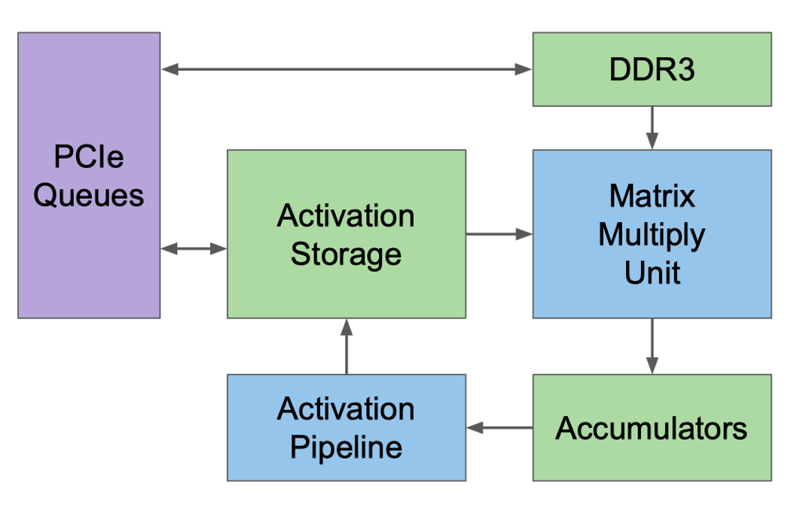
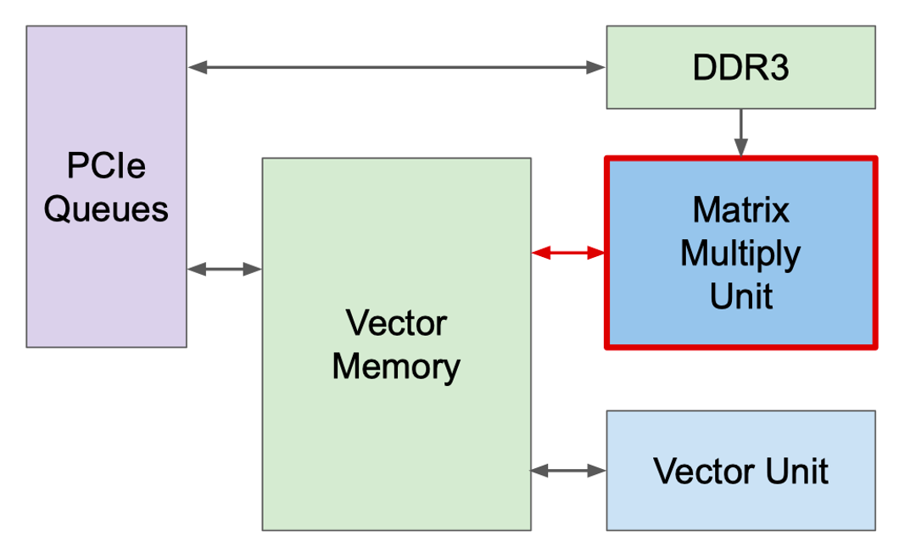
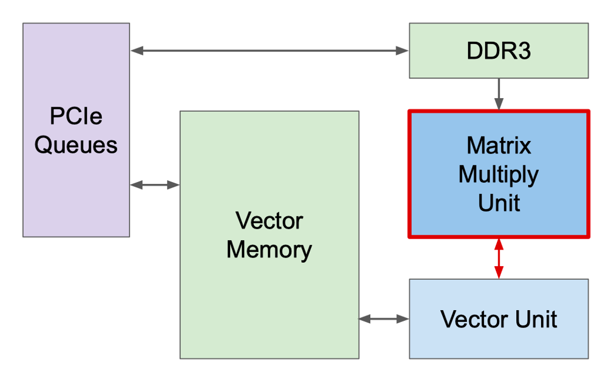
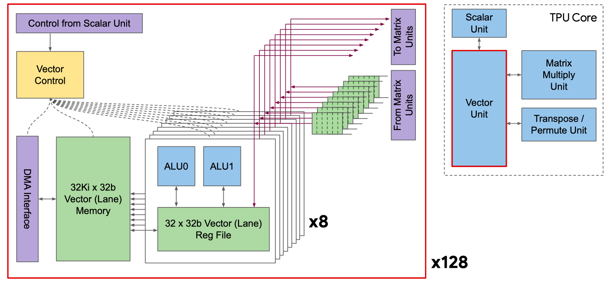
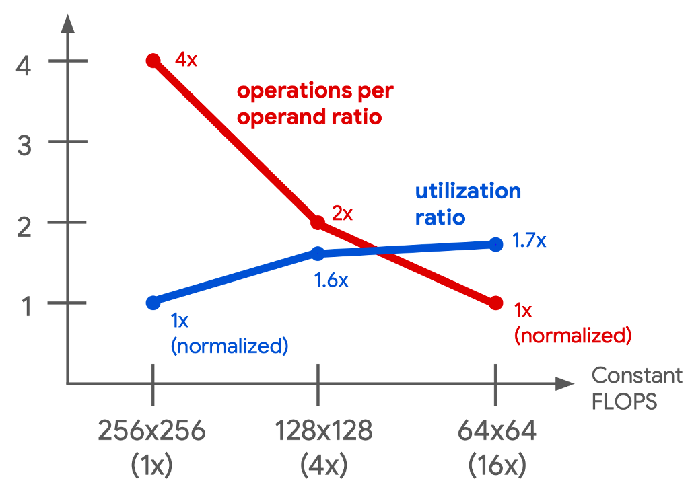
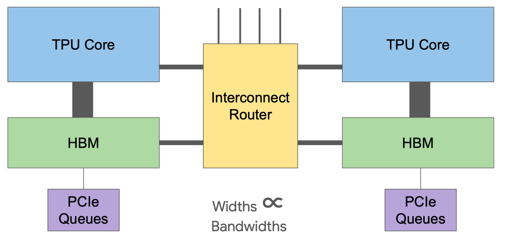

<!--Copyright © 适用于[License](https://github.com/chenzomi12/AISystem)版权许可-->

# 谷歌 TPUv2 训练芯片

在2017年，谷歌更新了他们的TPU序列。谷歌将这一代TPU称之为 “用于训练深度神经网络的特定领域超级计算机”，那么显而易见，相比于专注于推理场景的TPU v1，TPU v2将自己的设计倾向放到了训练相关的场景。如果回顾历史，在2017年前后，深度学习跨时代的工作如雨后春笋般涌现，也就是那年，谷歌在NIPS（也就是当今的NeurIPS）发布了那篇革命性的 《Attention Is All You Need》，从而彻底革新了NLP的世界，也引领了未来十年的潮流。那么可以想象的是，这篇论文不仅是Google Brain研究院夜以继日的心血，也是谷歌在深度学习领域耕耘多年的成果。那么我们就来讲讲TPU v2，那个站在Attention背后的超级计算机。

## TPU v2 业务场景变化

推理在训练好的模型结构和参数基础上，一次前向传播得到模型输出过程。相对于训练，推理不涉及梯度和损失优化，因此，协同着深度学习模型的鲁棒性，模型对于数据精度的需求则较低。相比之下，训练过程是一个比推理复杂很多的过程。通常来说训练过程通过设计合适 AI 模型结构以及损失函数和优化算法，将数据集以 mini-batch 反复进行前向计算并计算损失，反向计算梯度利用优化函数来更新模型，使得损失函数最小从而使得模型收敛。在训练过程中，最关键的步骤就是梯度的计算和反向传播，同时在这个过程中也需要计算工程中常见的优化器、学习率调度器等工具，因此数据计算的精度便变得非常重要，一旦在某个计算节点除了问题，则有可能引发梯度爆炸、梯度消失等问题导致模型无法收敛。

下图是模型训练（上图）和推理（下图）的简单图示，我们可以看到在训练场景，模型和数据需要不停在“向前传播 $\rarr$ 向后传播 $\rarr$  权重更新”的流程中进行循环，一直到权重收敛。之后准备好的模型则会被部署在生产环境，每一次当新的数据传来，这份数据只需要在部署好的模型内向前传播一次就可以得到模型输出并投入生产。

## 训练场景难点

那么细化下来，训练场景到底有哪些难点呢？

- 更难的数据并行：推理阶段，每个推理任务都是独立的，因此DSA芯片集群可以横向拓展。而在训练场景，一个模型就需要迭代百万次，模型所有的参数在每一个迭代中都要进行调整，因此需要协调跨集群进行并行计算。

- 计算复杂度更高：反向传播需要对模型每一个阶段的每一个权重参数和输入的偏导数进行计算，包括数据格式更高精度的激活值和转置权重矩阵\(W^TW^TW\)的矩阵乘法计算。

- 内存需求更大：权证更新的数据来自于前向和反向传播的临时变量，在模型的每一层，临时变量都需要被保留，因而提高了对于现存的负荷，在大模型中临时变量，包括每一层的激活值、优化器的值会将模型的大小膨胀至原始大小的8～9倍。

- 更具可编程性：训练算法和模型的快速变化可能会导致在芯片设计时的设计很快被淘汰果实，因此训练芯片需要有更高的可编程性从而适应日新月异的模型架构更新。

- 高精度的数据格式：整数INT8可以用于推理，但是训练期间需要充分捕捉梯度信息，通常需要FP16，BF16和FP32等混合精度计算以保证模型能够收敛。

## TPU v2 vs. TPU v1

面对诸多难题，谷歌的工程师在第一代TPU的基础上做出了一些细微改进，以适应训练场景。那么具体有哪些改动呢？

### 改动一：Vector Memory

在TPU v1中，我们可以看到它有两个存储区域：

- Accumulator负责储存矩阵乘积结果
- Activation Storage负责储存激活函数输出

在推理场景中，专门的存储模块对计算和存储非常有帮助，因为它们更加Domain Specific。但是在训练过程中，为了提升可编程性，TPU v2（如下图所示）交换了Accumulators和Activation Pipeline这两个独立缓冲区的位置，并将它们合并为Vector Memory，变得更像传统架构中的L1 Cache，从而提升了可编程性。

  

    
    
TPU v1

  

  

    
    
	TPU v2 图1 

  

  

    
    
	TPU v2 图2

  

### 改动二：Vector Unit

在TPU v1中，Activation Pipeline是专门针对激活函数场景特殊处理的，即卷积之后有一个Batch Normalization再接一个特殊的激活函数的ALU计算。然而，这种特殊的ALU计算无法满足训练场景的需求。因此，如下图所示，曾经的Activation Pipeline在TPU v2中变成了一个Vector Unit，用于专门处理一系列的向量激活函数。

  

    
    
	TPU v1 

  

  

    
    
	TPU v2

  

### 改动三：MXU

在TPU v1中，MXU是和Vector Memory相连接的，而在TPU v2中，谷歌将MXU和Vector Unit进行了连接，所有的数据出口和计算都由Vector Unit进行分发。如此一来，MXU所有的矩阵相关计算就成为了Vector Unit的协处理器，这对编译器和编程人员更加友好。

  

    
    
	TPU v1 

  

  

    
    
	TPU v2

  

### 改动四：DDR3

在TPU v1中使用DDR3内存是为了将推理场景中需要用到的一些权重直接加载进来用于计算。然而在训练过程中会产生许多中间层的变量和权重，这时DDR3的回写速度无法满足需求。因此，在TPU v2的训练过程中，如下图所示，我们将DDR3与Vector Memory放在一起，并将DDR3的位置换成HBM，从而加速了20倍的读写速度。

TPU v1中的DDR3   |  TPU v2中的HBM
:-------------------------:|:-------------------------:|
 | 

## TPU计算核心

### 标量单元（Scalar Unit）

上图是TPU核心的简单图示，我们可以看到标量单元是处理计算的起点，它从指令存储器中取出完整的VLIW（超长指令集），执行其中的标量操作，并将指令传递给向量和矩阵单元进行后续处理。VLIW由两个标量槽、四个向量槽（其中两个用于向量加载/存储）、两个矩阵槽（一个推和一个弹出）、一个杂项槽（一个简单的例子是延迟指令）和六个立即数组成。

那我们看一下指令到底是从哪里获得的。Core Sequencer 不再从 CPU 获取指令，而是从Instruction Mem 取出VLIW 指令，使用4K 32-bit 的标量内存来执行标量运算，有32个32位的标量寄存器，而将向量指令送到VPU。322-bit宽的VLIM可以发送8个操作，两个标量，两个向量ALU，向量load，向量store，和一对从矩阵乘法来的排队数据。

### 矢量单元（Vector Unit）

如下面右侧的图所示，和Scalar Unit相连接的就是Vector Unit，下图左图是Vector Unit其中的一个Vector Lane（矢量通道），整个Vector Unit包含128个这样的矢量通道。每个通道包含一个额外的8路执行维度，称为子通道。每个子通道配备一个双发射32位ALU，并连接到一个32深度的寄存器文件。这种设计允许矢量计算单元在每个时钟周期内同时操作8组128宽度的矢量，子通道设计提高了矢量与矩阵计算的比例，特别适用于批量归一化操作。

### 矩阵乘法单元（MXU）

MXU一直是TPU的核心，TPU v2选择使用$128 \times 128$的MXU而不是和TPU v1一样的$256 \times 256$的MXU，主要是由于利用率和面积效率的综合考虑。在下面这张图中，谷歌的模拟器表明，四个$128 \times 128$的MXU的卷积模型利用率为37%到48%，明显高于一个$256 \times 256$的MXU（22%到30%），且占用的芯片面积相同，原因在于某些卷积计算天生小于$256 \times 256$，所以MXU的部分会闲置。这意味着在相同面积下，使用多个较小的MXU可以实现更高的计算效率。尽管十六个$64 \times 64$的MXU利用率稍高（38%到52%），但它们需要更多的面积，因为较小的MXU面积受I/O和控制线的限制，而不是乘法器。因此，$256 \times 256$的MXU在带宽、面积和利用率之间达到了更好的平衡，使其成为TPU v2的最佳选择。

除了变得更小，这一代的MXU还有以下主要特点：

- 数值和精度：使用bfloat16格式进行乘法运算，该格式具有与float32相同的指数范围，但尾数位数较少。累加则使用32位浮点数进行。

- 能效：与IEEE 16位浮点数相比，bfloat16具有大约1.5倍的能效优势。

- 采用和易用性：相比fp16，bfloat16对于深度学习更易于使用，因为它不需要进行损失缩放。由于这种易用性以及能效和面积效率，bfloat16已被业界广为采用，也是深度学习最重要的building blocks之一。

### 转置、规约、置换核心 （The Transpose Reduction Permute Unit）

这一部分的核心用于进行$128 \times 128$的矩阵的特殊计算操作，允许矩阵数据重新排布，提升编程易用性。这些步骤都是在训练过程中，特别是反向传播中经常遇到的矩阵相关场景，TPU v2因此对于这一部分进行了特殊优化。

## 互联

在搭建现代超级计算机的时候，芯片之间的互联就变成了至关重要的一件事情。TPUv1 是一种单芯片系统，作为协处理器用于推理。如果在单个芯片上训练谷歌的生产模型，需要数月时间。而TPU v2不同，在下图中我们可以看到，谷歌在板上设计了一个interconnect的模块用于高带宽的规模化，在加强了TPU v2芯片间互联的能力，在此基础上搭建了TPU v2 Supercomputer ("Pod")。

这个 interconnect 模块具体来说就是下图中右下角的 Interconnect Router。

这个模块能够实现 2D 的环面连接（2D Torus），从而组成 Pod 超级计算机。每个芯片有四个自定义的核间互联（ICI）链接，每个链路都运行在 TPU v2 中，每个方向的带宽能达到 496 Gbit/s。ICI 使得芯片之间可以直接连接，因此仅使用每个芯片的一小部分就能构建一个超级计算机。直接连接简化了机架级别的部署，但在多机架系统中，机架必须是相邻的。

TPUv2 Pod 使用了一个 16x16 的二维环网（256 个芯片），其双向带宽为 32 条链路 x 496 Gbit/s = 15.9 Terabits/s

相比之下，一个单独的 Infiniband 交换机（用于 CPU 集群）连接 64 个主机（假设每个主机有四个 DSA 芯片）有 64 个端口，使用“仅有”的 100 Gbit/s 链路，其双向带宽最多为 6.4 Terabits/s。TPUv2 Pod 在提供了传统集群交换机 2.5 倍的双向带宽的同时，省去了 Infiniband 网络卡、Infiniband 交换机以及通过 CPU 主机通信的延迟成本，大大提升了整体计算的效率。

以上内容都是围绕着一个TPU模块来讲的，实际上本篇第一张图就展示了TPU v2模块一共是由多个芯片组成的，而这些芯片间的交互也就是给予上面我们讲到的互联模块完成的。如下图所示，一个互联模块会负责和多个TPU芯片和存储进行交互从而最大化计算效率。

总体的架构图就是下图，下图中的线越宽代表越大的带宽。所以说里面TPU核心和HBM存储的带宽是最大的，其次就是TPU核心、HBM和Interconnect Router的带宽。

## 平面图

下面是TPU v2的平面布局图，我们可以看到大部分区域都是用于蓝色的计算核心，内存系统和互连占据了剩下的一大半。两个TPU核心一上一下，互连路由器位于中间的圆孔中提供核心之间的互联，两个MXU分别位于顶部中心和底部中心提供最核心的脉动阵列计算能力，而剩下的地方布满了排线。

## 本章总结

本章深入探讨了谷歌TPUv2的设计理念、架构特点以及在深度学习训练场景中的应用。TPUv2是谷歌针对训练深度神经网络而设计的专用集成电路（ASIC），它在2017年推出，用于解决训练深度学习模型时遇到的计算复杂性和内存需求问题。

我们逐一介绍了几个关键的改进，包括：
- Vector Memory：合并了TPUv1中的Accumulator和Activation Storage，提高了可编程性。
- Vector Unit：取代了TPUv1的Activation Pipeline，更加适应训练场景的向量运算需求。
- MXU：将MXU与Vector Unit连接，提高了数据流的效率，使矩阵计算更加高效。
- DDR3到HBM：使用HBM替代DDR3，大幅提升了内存读写速度，满足训练过程中对内存带宽的高需求。

同时我们介绍了TPU核心的关键组成部分：

- 标量单元：负责从指令存储器中取出和执行VLIW指令，并将指令传递给向量和矩阵单元。
- 矢量单元：包含128个矢量通道，每个通道有8个子通道，提高了矢量计算的效率。
- 矩阵乘法单元（MXU）：采用$128 \times 128$的矩阵乘法单元，以提高利用率和面积效率。
- 转置、规约、置换核心：优化矩阵相关操作，提升训练过程中的效率。

## 本节视频

<iframe src="//player.bilibili.com/player.html?aid=617230610&bvid=BV1x84y1f7Ex&cid=1232071685&p=1" scrolling="no" border="0" frameborder="no" framespacing="0" allowfullscreen="true"> </iframe>