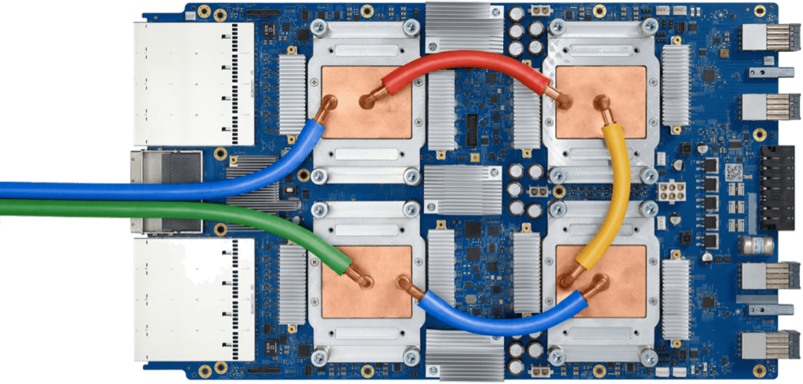
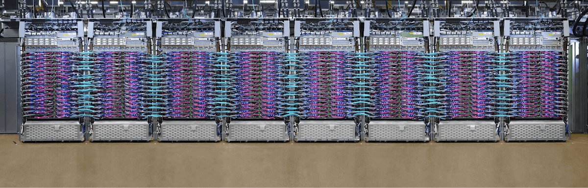

<!--Copyright © 适用于[License](https://github.com/chenzomi12/AISystem)版权许可-->

# 谷歌 TPUv3 POD 形态

## TPU v3 vs. TPU v2

- TPU v3 实际上就是 TPU v2 的增强版。TPU v3 相比TPU v2 有约1.35倍的时钟频率、ICI贷款和内存带宽，两杯MXU数量，峰值性能提高2.7倍。在同样使用

- 除了显眼的蓝色外，相比于TPU v2，TPU v3在只增大10%体积的情况下增加了MXU的数量，从2个翻倍到了4个。同时 TPU v3时钟频率加快了30%，进一步加快了计算速度；同时内存带宽扩大了30%，容量翻倍；此外芯片之间的带宽也扩大了30%，可连接的节点数是之前的4倍。

|                     | TPUv1  | TPUv2  | TPUv3  |
|---------------------|--------|--------|--------|
| Date introduced     | 2016   | 2017   | 2018   |
| Process node        | 28 nm  | 16 nm  | 16 nm  |
| Die size (mm²)      | 330mm  | 625mm  | 700mm  |
| On-chip memory (MB) | 28MB   | 64MB   | 64MB   |
| Clock speed (MHz)   | 700MHz | 700MHz | 940MHz |
| Memory              | 8 GB DDR3 | 16 GB HBM | 32 GiB HBM |
| Memory bandwidth    | 300 GB/s | 700 GB/s | 900 GB/s |
| TDP (W)             | 75     | 280    | 450    |
| TOPS (Tera/Second)  | 92     | 180    | 360    |
| TOPS/W              | 0.31   | 0.16   | 0.56   |

以上表格展示了TPU v1，TPU v2 和 TPU v3 三代的具体参数。我们可以看到，虽然TPU v3 和 v2都采用了16nm的制程，但是在内存、频率、带宽等参数上相比TPU v2都有长足的进步。更重要的是，在能效方面，TPU v3更是大幅领先于TPU v2。背后的原因除了谷歌改进了芯片设计，对于深度学习场景有了更深和更广的优化面意外，最重要的一点就是TPU v3更好地管理了芯片的温度表现，用水冷代替风冷使得芯片更容易运行在合理温度之下。

下面这张图展示了TPU v2 和 v3 的俯视图以及极度简化的结构。我们可以看到，左下角的TPU v2板卡上面有着四个芯片，散热全部依赖风冷，而TPU v3则使用水冷系统去管理四张芯片的温度，也就是这歌水冷系统为TPU v3提供了1.6x的功率。在这个基础上，TPUv3又翻倍了MXU的数量，每个核心拥有了两个MXU，并且扩大了HBM的大小，进一步强化了其计算能力。

## 基本概念澄清

在正式进入到我们对于POD的介绍之前，我们要先做一些概念澄清。现在我们做大模型的训练和推理都会有一个“集群”的概念。回到2017-2018年左右，Bert出现之前，很多人是不相信一个模型需要用到一个集群进行训练的，因为当时很多的模型只需要单卡就能进行训练。而实际上的情况是，仅有（从当前的视角看）3亿参数Bert在4个TPUv3 Pod上训练了整整四天，而当前各家的万亿参数的模型大部分都是用万卡的集群训练数个月的结果。

### 概念：分布式架构 - 参数服务器

涉及到集群，我们在训练过程中就需要一个分布式的架构，在当时叫做参数服务器（Parameter Server）。在我们的训练过程中，我们需要在正向传播和反向传播中得到损失值和相应的梯度，而这个计算的压力是分布在每一张计算卡上的，因此在计算结束后需要把从每一张卡的计算结果进行梯度聚合，最后一步再进行参数的更新和参数的重新广播。

<!--  -->

那么这个过程可以用同步或者异步的方式进行同步：

**【同步并行】**：在全部节点的完成本次的通信之后再进行下一轮本地计算
- **优点**：本地计算和通信同步严格顺序话，能够容易地保证并行的执行逻辑于串行相同
- **缺点**：本地计算更早的工作节点需要等待其他工作节点处理，很容易造成计算硬件的浪费

**【异步并行】**：当前batch迭代完后与其他服务器进行通信传输网络模型参数
- **优点**：执行效率高，中间除了单机通信时间以外没有任何通信和执行之间的阻塞等待
- **缺点**：网络模型训练不收敛，训练时间长，模型参数反复使用导致无法工业化

### 概念：POD 中的通信

超级计算机中，执行的大部分是神经网络模型的 DP（Data Parallel）计算，大量的数据被分成小块，然后分配给不同的计算节点进行处理。这种并行计算的一部分是权重更新时的通信过程，通常使用的是 all-reduce 操作，即所有节点将它们的部分计算结果汇总起来，以更新全局的权重。

在这样的环境下，出现了 Host Bound 和 Device Bound 的概念。Host Bound 指的是计算受到主机资源的限制，可能是由于通信或者其他的主机计算负载导致的。而 Device Bound 则是指计算受到设备资源的限制，比如节点的计算能力。

在集群环境中，由于大规模的神经网络模型需要处理大量的数据，并且需要进行复杂的计算，因此往往是设备资源受限制，这就使得 AI 应用在集群环境中更倾向于 Device Bound。

## 迎来Supercomputer（Pod）

首先我们要定义一下什么叫做Pod，谷歌官方给出的定义很简单：“TPU Pod 是一组通过专用网络连接在一起的连续TPU单元”，实际上也确实如此。相比于TPU v1，初始设定为一个专用于推理的协处理器，由于训练场景的复杂性，TPU v2和v3大幅度强化了芯片的互联能力，最主要的核心就是为了搭建这样的超大计算集群。

### TPU v2 基板组成和Pod形态

结合着下面这张图，我们来看一下上一章我们讲过TPU v2的基板组成

- A：四个TPU v2芯片和散热片
- B：2个BlueLink 25GB/s 电缆接口
    - BlueLink：IBM BlueLink端口协议，每Socket 25Gb/s的带宽，主要是提供NPU或是TPU之间的网络互联
- C：Intel全路径体系结构（OPA）电缆
    - OPA：英特尔 Intel Omni-Path Architecture（OPA）互联架构，与InfiniBand相似
- D：电路板电源连接器
- 支持两种网络配置，分别问10Gbps以太网和100Gbps Intel OPA连接

下面两张图，左边是tpu v2的基板，右边是TPU v2 Pod形态，中间两台蓝色的机器最大可以搭载256块TPU v2的芯片，而左右两边分别是CPU集群，我们后面会展开讨论。

TPU v2 基板（4 chips）：

TPU v2 Pod（256 chips）

### TPU v3 基板和Pod形态

看完v2，我们再来看一下TPU v3的基板组成

- A：四个TPU v2芯片和**液冷**散热管；
- B：2 个 BlueLink 25GB/s 电缆接口
- C：Intel全路径体系结构（OPA）电缆
- D：电路板电源连接器
- 支持两种网络配置，分别问10Gbps以太网和100Gbps Intel OPA连接

从下面的TPU v3 Pod的形态中我们就可以看到，相比于TPU v2 Pod，它的规模大了非常多，有了更多的铜管和电缆，并且在芯片规模上整整大了4倍。

TPU v3 基板（4 chips）：

TPU v3 Pod（1024 chips）：

### TPU v2 Pod vs. TPU v3 Pod

现在我们对比一下TPU v2 和 v3 Pod，最大的区别就在算力上：TPU v2有256块TPU v2组成，算力为11.5 PFLOPS；Tpu v3 则由1024块 TPU v3芯片组成，算力为100 PFLOPS。这也就是为什么我们一直在说，TPU v3 是一个 TPU v2 的强化版，最本质的原因就是两者在核心架构上本质的区别没有那么明显，而主要的提升实际上是提升了规模化的能力。

### 虚拟架构图

下面是我们的虚拟架构图，整体的架构图也是比较明显的。AI框架通过RPC远程连接到TPU Host，基于CPU去控制TPU去实现真正的互联运作执行。

### Tpu v2/v3 Supercomputer 总结

- **TPU v2 的技术革新**：Google 的 TPU v2 通过增加核间互连结构（ICI），使得最多 256 个 TPU v2 能够组成一个高效的超级计算机。这种结构支持高效的大规模数据处理，尤其适合深度学习网络的训练。
  
- **TPU v3 的性能提升**：Google 进一步扩展其技术，通过组合 1024 个 TPU v3 创建了 TPU POD 超级计算机。该服务器采用水冷系统，功率提升高达 1.6 倍，而模具尺寸仅比 TPU v2 增加 6%。

- **高效的集群构建**：TPU v2 集群利用交换机提供的虚拟电路和无死锁路由功能，加上ICI结构，形成了高效的2D tours。这种配置提供了15.9T/s 的平分带宽，相比传统的集群组网，省去了集群网卡、交换机的成本，以及与集群 CPU 的通信延迟。

## TPU Training Pod Architecture

我们之前讨论到，在分布式机器学习中，异步训练和同步训练是两种主要的训练方式。异步训练理论上可以提供更快的速度，因为它允许每个节点独立更新模型权重，从而最大化计算效率。然而，在实际应用中，异步训练的特性以及分散的权重更新可能导致参数服务器与工作节点之间的带宽成为计算瓶颈。

相比之下，同步训练的关键在于平衡计算和通信两个步骤。在不同的学习节点之间，这两个步骤会调整权重。系统的性能受到最慢计算节点和网络中最慢消息传递速度的限制。因此，一个快速的网络连接对于实现快速训练至关重要。谷歌在TPU v2/v3 Pod中采用了2D Torus网络结构，这种结构允许每个TPU芯片与相邻的TPU芯片直接连接，形成一个二维平面网络。这种设计减少了数据在芯片间传输时的通信延迟和带宽瓶颈，从而提高了整体的计算效率。基于此，谷歌优化了同步训练，在同等资源条件下，通过避免对参数服务器的依赖，通过all reduce的方法，最终在性能上达到对于异步SGD计算效率的领先。

## Pod 详情

### TPU v2 Pod

**基本架构**

我们根据下图的标注，来简单看一下TPU v2 Pod的基本架构

- A 和 D：CPU 机架
- B 和 C： TPU v2 机架
- 蓝色框：电源管理系统（UPS）
- 红色框：电源接口
- 绿色框：机架式网络交换机和机架式交换机顶部，这部分更多的是网络模块
- 总体：每个机柜中有64个CPU板和64个TPU板，共有128个CPU芯片和256个TPU v2芯片。

**存储**

在TPU v2机柜中，看不到任何存储模块。由数据中心网络连接至 CPU，同时没有任何光纤连接至机柜B和C的TPU集群，而TPU v2板上也没有任何网络连接。或许这正是下图中机柜上方大量蓝色光纤存在的原因。

**机柜**

我们不难发现，TPU v2 Pod的机架排列紧凑，主要是为了避免信号衰减带来问题，BlueLink 或 OPA 的铜缆和光纤长度不能太长，因此TPU集群在中间，CPU在两侧的方式排布。

## 本章总结

本章介绍了谷歌TPU v3和TPU v2的技术参数和应用架构。TPU v3相较于TPU v2在时钟频率、内存带宽和计算能力上有显著提升，并采用了高效的水冷系统，能效大幅提高。TPU Pod通过专用网络连接，使大规模数据处理和计算更高效。TPU v3 Pod由1024块TPU v3芯片组成，算力达到100 PFLOPS，比TPU v2 Pod大幅提升。

在当前集群算力都以EFLOPS打底的情况下来看，100Pflops的TPU v3 Pod好像有点不够看，但是结合历史，在当年英伟达大规模集群业务伊始，谷歌就提前将精力放在了多卡交互和计算集群的研发上，可以看到谷歌的前瞻性。不止如此，谷歌对于深度学习实际上拥有一个接近“全栈”的解决方案，从框架代码层面的TensorFlow，Jax，Keras到服务器到计算集群，在大规模预训练模型的早期，谷歌的这一套方案可以说是在业界、学术界都遥遥领先于其他公司。

## 本节视频

<iframe src="//player.bilibili.com/player.html?isOutside=true&aid=704427239&bvid=BV1Pm4y1g7MG&cid=1294354169&p=1" scrolling="no" border="0" frameborder="no" framespacing="0" allowfullscreen="true"></iframe>
