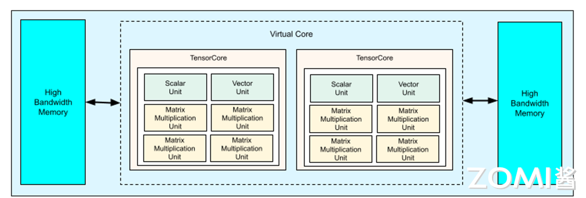
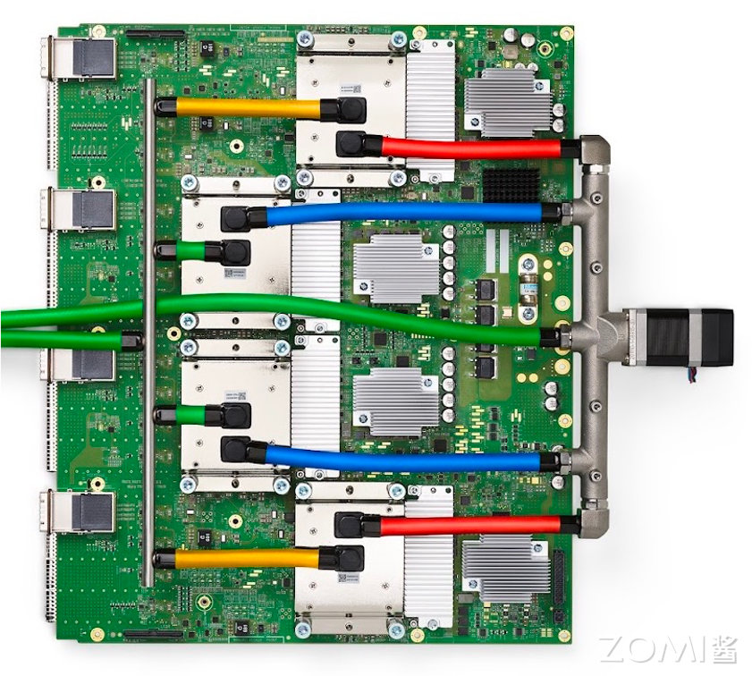
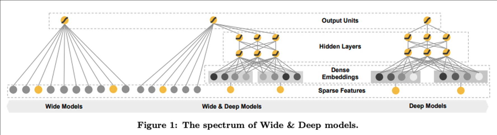
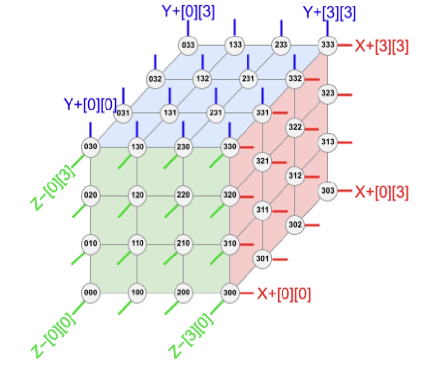
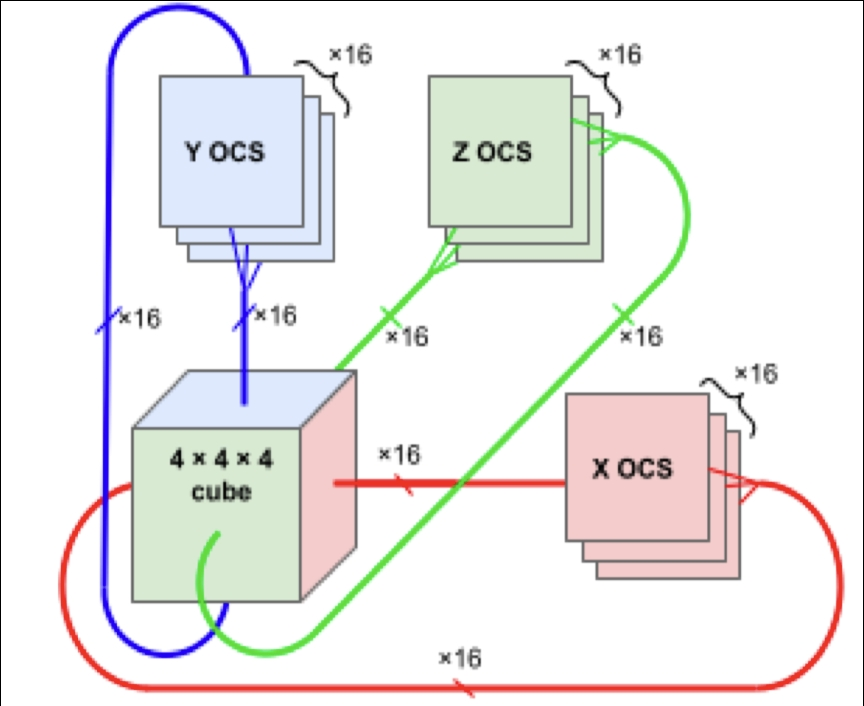
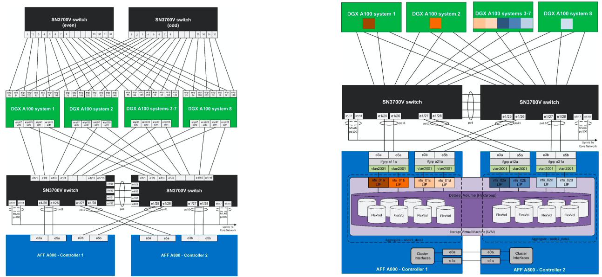
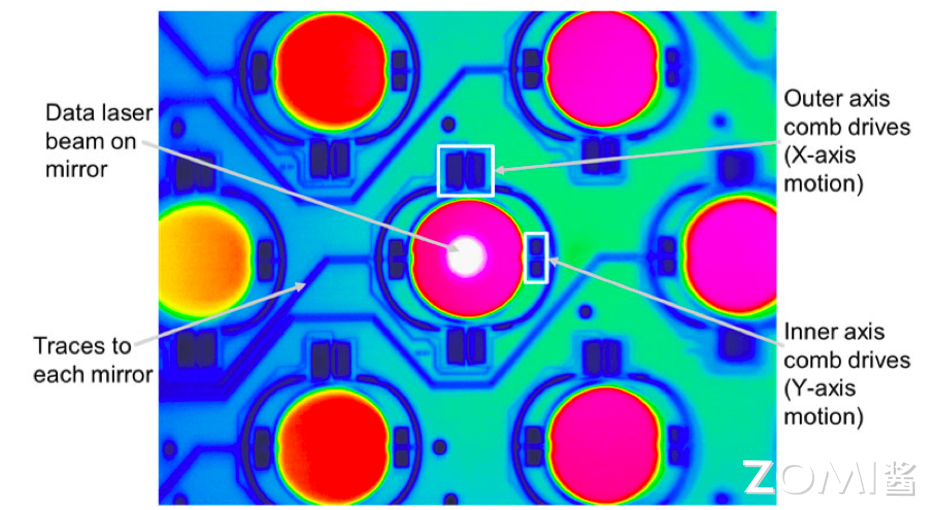
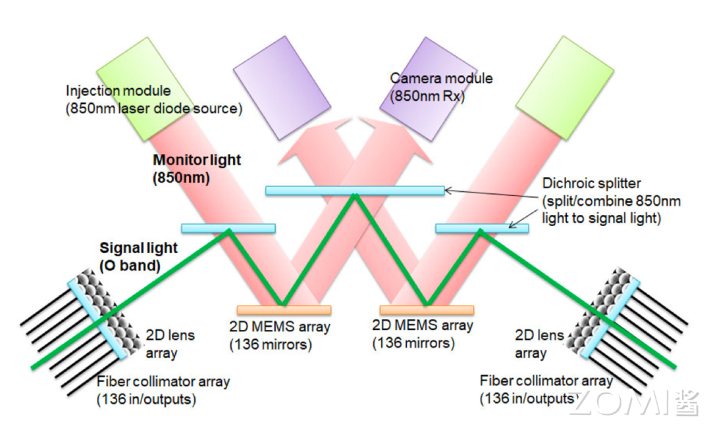
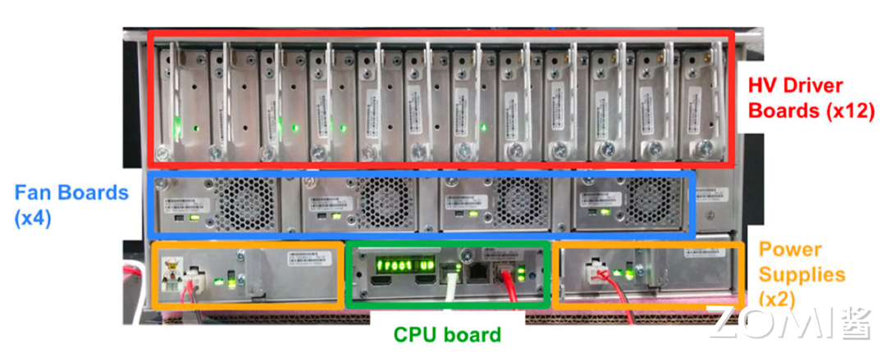

<!--Copyright © 适用于[License](https://github.com/chenzomi12/AISystem)版权许可-->

# 谷歌 TPUv4 与光路交换

TPU v4 和 TPU v3 中间相差了四年，在这四年之间，谷歌即使发布了许多对于业界非常重要的研究成果，但是在 TPU 的正代芯片上却没有什么更新。实际上，在 2018 年的 TPU v3 之后，谷歌花了更多的精力在面向大众的芯片上，例如谷歌 Tensor、Pixel 手机系列里的各种处理单元等。

在这期间，英伟达迭代了三代架构（Volta, Amber, Hopper），PyTorch 也代替了 TensorFlow 成为了业界的首选训练框架，同时也面临了对于超大计算能力的更多需求，因此，TPU v4 的出现就是为了应对以上这些问题。

## TPU v4 介绍

TPU v4 通过采用 7nm 工艺，翻倍的 MXU 数量，以及显著增加的内存容量和带宽，实现了性能的大幅提升。特别引人注目的是 Sparse Core 的引入，它专门针对稀疏计算进行了优化，使得 TPU v4 在处理深度学习中的 Embedding 层时更加高效。此外，3D Torus 互联方式的首次亮相，以及 TPU v4 Pod 的构建，展示了谷歌在大规模并行计算和高效互联方面的突破。Palomar 光路开关芯片的开发，利用 MEMS 技术，进一步降低了系统延迟和功耗，同时减少了网络成本。下面我们将重点打开相关的内容。

### TPU v4 架构图

首先来看一下 TPU v4 的架构图，每个 TPU v4 都有两个 Tensor Core，每个 Tensor Core 里面有分别六个单元组成，其中有四个是 TPU 的最核心的脉动阵列 MXU，另外还有两个单元，一个是 Scalar Unit，另一个是 Vector Unit，这些都在前面的章节讲过。同时我们还看到两个 HBM 也就是内存模块，为了降低电缆的时延，它们分别被放在了 Tensor Core 的左右两边。

### TPU v4 产品形态

下面是 TPU v4 的产品形态，相比于前几代，形态的变化差异非常的大。

- 制造工艺：从前代的 16nm 提升到了最新的 7nm 工艺。
- 硬件增加：TPU v4 上的 MXU 数量相比前代 TPU v3，又翻了一倍，而内存则增加了 9 倍，增加到了 244MB，虽然 HBM 内存的容量依然是 32GB，但内存带宽增加到了 1.2TB/s，相比前代提升了 33%。
- Sparse Core：TPU v4 的硬件增加了 Sparse Core 的支持用于利好稀疏计算，基于 TPU v4 改良的自有 Transformer 模型架构
- 3D torus：TPU v4 首次亮相了 3D torus 的互联方式，紧密耦合 4096 个 TPU v4 引擎，使得 TPU v4 POD 总计提供 1.126 Exaflops 的 BF16 峰值算力。

我们在下文会细分讲解第二个特性（Sparse Core）和 3D-Torus 的互联方式

## Sparse Core 稀疏计算核

### Embedding 层的计算

Embedding 处理离散型分类特征（Categorical Features），是稀疏化的典型计算范式，NLP/搜推算法仅支持字符串形式输入是标示为离散的稀疏向量特征。这些特征不适合映射到硬件上的矩阵乘法单元进行 Tensor 计算，因为他本质上更像哈希表。换句话说，在要被处理的输入矩阵中会存在极大量的 0，而这些数据本身是不需要，或者可以简化计算的。而如果根据传统的矩阵计算方式，就会重复计算非常多次的 0 相乘，白白浪费了计算资源。

同时，将这些稀疏变量放在 Tensor Cores 上进行计算往往会设计小规模的内存访问动作，很容易会触及到 CPU 和 DRAM 的性能瓶颈，尤其是在 TPU 和 CPU 4:1 的 TPU 集群上，而在此之上，网络中心的延迟也会进一步加剧这种负面影响。因此，能够高效处理稀疏变量的计算范式就被应用到了 TPU 之上。

深度学习中由于神经网络通畅在稠密 Tensor 上计算性能更优，因此就需要对稀疏的矩阵进行一个信息的压缩，通过特定的 Embedding 层去生成一个稠密的原数据表达，这通常是 NLP 或者搜推算法的第一层。

下面的图是一个在搜推场景非常经典的模型框架，叫做 Deep & Wide Model。Wide&Deep 其实是一个框架，wide 部分可以是任意广义线性模型，而 Deep 部分就是一个 Embedding 的全连接神经网络。可以看到图片中 "Deep Models"的部分，用户的稀疏特征被先被处理成稠密 Embeddings 再进入中间的隐藏层，协同“Wide Models”输出最终的单元。

TPU v4 在 Sparse Core 中原生支持了 Embedding 计算的模型并行和数据并行，提供了极大的并行灵活度，让大规模的 Embedding 计算能够很好的在大规模集群内被妥善计算和处理。

### Sparse Core 核心架构

下图是 Sparse Core 的架构示意图，图中的深蓝色方框就是 SC 中最通用的单元 - 16 个 tiles（计算瓦片）。每个瓦片都有一个关联的 HBM 通道，并支持多个内存访问。每个瓦片都有一个 Fetch Unit、一个可编程的 8 路 SIMD 向量处理单元（这里是 scVPU，不要与 TPU v4 中的 Tensor Core 的 VPU 混淆）、以及一个 Flush Unit。Fetch Unit，从 HBM 读取激活函数和参数到瓦片的 2.5 MiB 稀疏向量内存（Spmem）的切片中。刷新单元在反向传播过程中将更新的参数写入 HBM。此外，五个跨通道单元（图中的金色方框）在 16 个 Spmem 上执行与他们名称相对应的嵌入操作。与 TPU v1 一样，这些单元执行类似 CISC 的指令，并处理可变长度的输入，其中每条指令的运行时间取决于数据。

## TPU v4 Pod

TPU v4 Pod 提供了 exaflops 的算力，原因就是因为其强大的芯片间互联能力。谷歌将 $ 4 \times 4 \times 4 = 64$ 个 TPU v4 芯片互联在一起，形成一个立方体结构（Cube）。再把 $ 4 \times 4 \times 4$ Cube 用光互联连在一起形成一个总共有 4096 个 TPU v4 超级计算机。

### 光互联

谷歌在 TPU v4 Pod 中应用了光交换器（OCS）为了避免计算等通信。在如此大规模的超级计算机中，芯片间互联很大程度上决定整体计算效率；如果数据互联效率不够高的话，很多时候芯片都在等待来自其他芯片数据到达以开始计算。所以必须确保芯片之间互联高带宽，低延迟。而光互连对于物理距离较远的芯片就成为了首选。OCS 由 64 （$ 4 \times 4 \times 4$）颗 TPU 构成一组 Slice 间互连，实现了 Pod 内 Slice 间全光互连（4096 TPUs）；当然也可用于 Pod 之间互连而不仅局限于芯片之间。

在使用可配置光互连（以及光路开关）时，假设芯片可靠率在 99%的情况下，其整体系统的平均性能提升比不使 OCS 可高达 6 倍，可见光互连开关的重要性。

### 拓扑结构

谷歌在 TPU v4 Pod 中采取了 3D Torus 的拓扑结构实现芯片之间的互联。在 3D Torus 网络中，每个节点通过三个维度的连接与相邻节点相连，形成一个三维的网格结构。这种高度互联的结构允许芯片在 X-Y-Z 三个维度上形成一个连续循环，提供高带宽和低延迟的通信能力，非常适合于高性能计算和大规模并行处理。谷歌的 TPU v4 能够紧密耦合 4,096 个 TPUv4 引擎，实现总计 1.126 exaflops 的 BF16 计算能力。TPU v4 的每个端口对应一个 TPU v4 芯片，端口连接交换机提供 6 Tb/sec 的带宽，作为网络接口卡和 3D 环面网络的基础。这种设计确保了 TPU v4 在处理大规模并行计算任务时的高效性和稳定性。

下图是一个 3D Torus Cube 的图示，我们可以看到每一个节点都会和上下、左右、前后的节点互联，而处于这个立方体边上的芯片会连接到在它相对面上的节点从而实现每一个节点都与 6 个节点互联。

我们细致讲一下这个 Cube。下图是一个 Cube 的另一种展开方式。Cube 如果要实现 6 面连接，每个面需要 16 条链路，每个 Cube 总共有 96 条光链路连接到 OCS 上。为了提供整个 3D Torus 的连接，相对的侧面需要连接到相同的 OCS 上面（图中不同色块和 Cube 之间的长环）。因此，每个 Cube 会连接到 $6 \times 16 \div 2 = 48$ 个 OCS 上。这 48 个 OCS 一共连接来自 64 个 Cube 的 48 对光缆，总共并联 4096 个 TPU v4 芯片。所以，如果想要搭建一个 TPU v4 集群，就需要购置 4096 片 TPU v4 和 48 个 OCS 光互联交换器，因此成本相当之高，而幸运的是，谷歌最不缺的就是钱。当然，在当前这个时间点，在美一家公司和投资人都愿意无上限地为模型花钱的时代，传统大厂在成本投入上的优势相对于新兴的 AI 公司（例如 OpenAI 和 Anthropic）越来越少，而芯片的产能甚至是电力资源这种物理上的限制反而成了目前各家迭代模型最大的瓶颈。

### 计算集群对比

讲完 TPU v4 的基本结构之后，我们来看一下在当时谷歌的竞品是什么一个状态。英伟达 DGX SuperPod 搭配第四代 NVLink/NVSwitch 最多可以连接 32 个 node 总 256 颗 H100 芯片，并实现每颗 GPU 900G/s 的互连带宽。NV 每机架 4 台 DGX（共 32 颗 H100 GPU），机架内/外需要光纤连接。NV 的每机架算力密度相对更小/更窄，且需要更多的收发激光器和光纤线材，网络成本高。如果 NV 部署 4096 颗 GPU 集群，必须切分成更多个 SuperPod 并独立规划互连网络层，中间完成多层交换，集群内总计需要采购大约 568 个 Infiniband Switch。

反观 TPU v4 Pod，与超级计算机一样，工作负载由不同规模的算力承担，称为切片：64 芯片、128 芯片、256 芯片等。与 Infiniband 相比，OCS 的成本更低、功耗更低、速度更快，成本不到系统成本的 5%，功率不到系统功率的 3%。每个 TPU v4 都包含 SparseCores 数据流处理器，可将依赖嵌入的模型加速 5 至 7 倍，但仅使用 5% 的裸片面积和功耗。

## 光路交换机

我们上面简单讨论了一下光路交换机（Optical Circuit Switching，OCS），我们打开一下这一部分，让我们看一下它有什么厉害之处。

### 光路开关芯片

光路有多开关芯片叫做 Palomar，使用的是基于 MEMS 反射镜阵列的技术，具体原理是使用一个 2D MEMS 反射镜阵列，通过控制反射镜的位置来调整光路，从而实现光路切换。使用 MEMS 光路开关芯片可以实现低损耗，低切换延迟（毫秒级别）、低功耗、低成本。

#### 2D MEMS 阵列

下图就是一个反射镜阵列的封装照片，在每个陶瓷封装内部是单个大型芯粒，芯粒里面有 176 个可单独控制的微反射镜。

下面是整个反射镜的热成像图，每一个深色的圆形都代表了一个微反射镜。我们可以清楚的看到每一个微反射镜四周都有四个梳状驱动区域，用于在两个方向上旋转反射镜，使得光可以进行光切换。

#### Palomar 工作原理

下面这个图解释了 Palomar OCS 的工作原理。绿色线条表示带内光信号路径。与带内信号路径叠加的是一个 850 纳米波长的监控通道（红色箭头），用于校准镜面。输入/输出的光学信号通过二维（2D）光纤准直器阵列（Fiber collimator array）进入光学核心，每个准直器阵列由一个 NxN 光纤阵列和 2D 透镜阵列组成。这个的核心是其中的两组 2D MEMS 阵列。MEMS 的镜面被在监控通道的校准下，被驱动、倾斜以将信号切换到相应的输入/输出准直光纤。

为什么需要 OCS 呢？我们传统的交换机传进来的是一个光缆，再把光转化成电，把点再转成光输出，会造成很多的性能损耗。那这个时候整个 OCS 是提供光到光的一转换，从而节省了非常多的电，更重要的是解决了很多时延问题。

下面是 Palomar 的实物图，我们可以对照上面的图片找到每一部分的样子

下图是带有 CPU 板、电源、风扇和高压驱动器板的后机箱。

## TPUv4 优缺点分析

TPU v4 Pod 显示出了在成本、功耗和速度方面的优势，但是，尽管 3D Torus 拓扑结构带来了低延迟和低网络成本的益处，但也存在一些挑战，如系统成熟度、拓扑的僵硬性以及负载均衡问题。面向未来，TPU v4 的设计强调了算法与芯片之间的紧密协同，以及对新数据格式和稀疏计算的支持，这预示着 AI 计算集群的重要性日益增加。作为历史上最有远见的科技公司之一，谷歌是否能在大模型时代依旧保持曾经的远见，才是他们能不能在这个时代甚至下个时代引领世界最关键的钥匙。

### 优点

- 低时延：3D Tours 因其相邻节点之间的短而直接的连线，可以换来更低的延迟；尤其当节点间需要运行那种密集 I/O 的、紧耦合的并行任务时特别有用。

- 低网络代价：对于相同数量的节点，3D Torus 拓扑网络直径低于 Clos 拓扑，两者相比之下，前者的交换机/线材/连接器的保有量更低，网络层次更少，节省硬件成本。

- 路由可重配：谷歌 OCS 网络支持动态可重配路由，Silic 集群在部署之后可以立即投入生产，无需等待整个网络收敛；并且这种特性更容易隔离/下线故障节点。

- 更好集群布局：集群布局让物理连接上相临的节点间在逻辑上临近，让密集 I/O 通信、data-flow 发生在局部流域，换来更低的通信开销；同时优化了延迟和功耗。这就是 3D Torus 将大集群逻辑切割成紧耦合的局部域，局部互连并共享作业。

### 缺点

- 系统成熟度低：Clos 拓扑本身具备非阻塞特点，性能能够始终保持一致且可以预测，其所有输入/输出都是全带宽同时连接，无冲突无阻塞，这在 3D Tours 拓扑中无法保证。

- 拓扑僵硬：在 Clos 这种 Spine-Leaf 脊叶拓扑中，扩容新的叶交换机相对简单，无需更改当前架构；相比之下，扩缩 3D Tours 结构比较复杂和耗时，可能需要重新配置整个拓扑。

- 负载均衡问题：Clos 网络在任意两个节点之间提供更多路径，从而实现负载均衡和冗余；虽然 3D Tours 结构也提供多路径冗余，但显而易见 Clos 的替代路径数量更多，具体取决于网络的配置。

## 小结与思考

- 模型的演进总是要比芯片的设计迭代更快，随着大模型涌现，支持主要依赖 AI 计算集群，而非提高单芯片能力，TPU v4 对于高效互联和规模化的支持。

- 算法-芯片协同设计是 TPU v4 的灵魂， AI 芯片与算法之间的结合继续保持紧密关系。包括对于新数据格式（HF32/BF16）支持，对于稀疏计算支持，对于模型关键算法专用加速器。

- Benchmark 之外很多生产环境的性能指标都无法直观评测，XLA 编译器的优化效益也难以直观评测。到底 TPU v4 是否如网上纰漏的信息那么强悍有待验证。

## 本节视频

<html>
<iframe src="https://player.bilibili.com/player.html?isOutside=true&aid=962382946&bvid=BV1QH4y1X77U&cid=1307298314&p=1&as_wide=1&high_quality=1&danmaku=0&t=30&autoplay=0" width="100%" height="500" scrolling="no" border="0" frameborder="no" framespacing="0" allowfullscreen="true"> </iframe>
</html>

<html>
<iframe src="https://player.bilibili.com/player.html?isOutside=true&aid=280098555&bvid=BV1yc411o7cQ&cid=1309130634&p=1&as_wide=1&high_quality=1&danmaku=0&t=30&autoplay=0" width="100%" height="500" scrolling="no" border="0" frameborder="no" framespacing="0" allowfullscreen="true"> </iframe>
</html>
