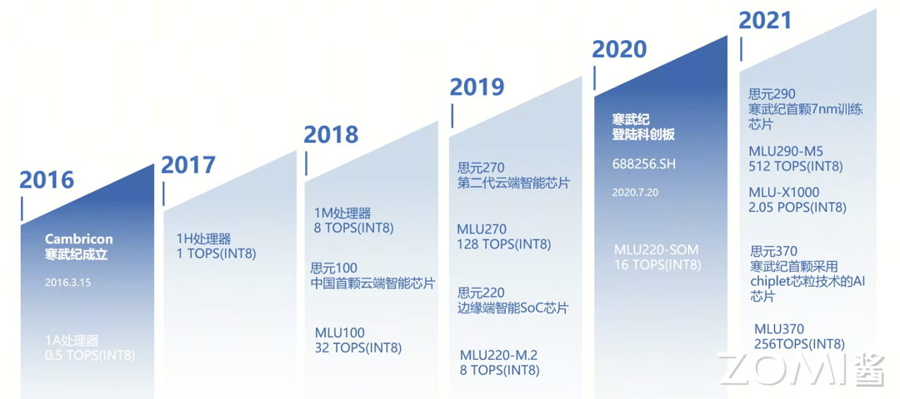
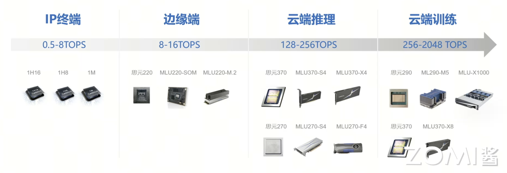
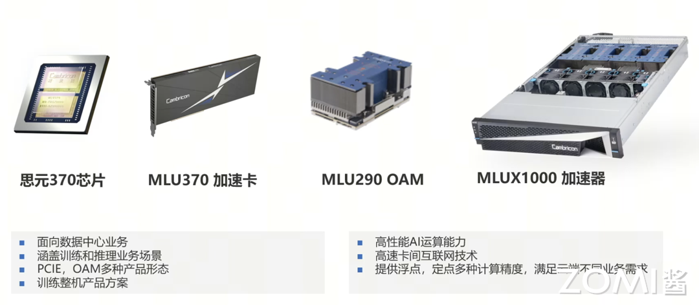
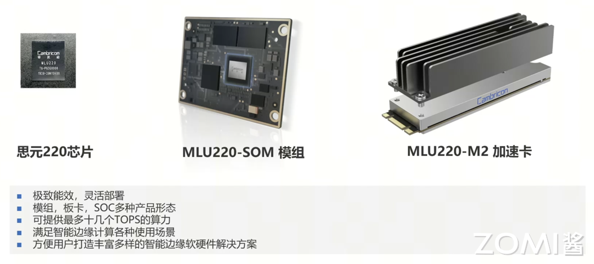
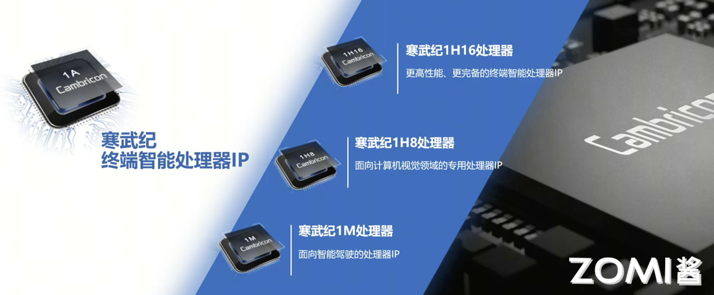
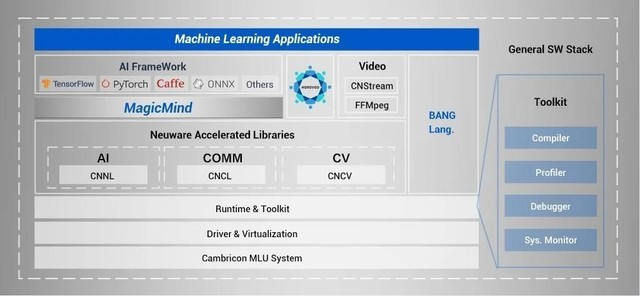

<!--Copyright © 适用于[License](https://github.com/chenzomi12/AISystem)版权许可-->

<<<<<<< HEAD
# 寒武纪(DONE)
=======
# 寒武纪介绍
>>>>>>> upstream/main

中科寒武纪科技股份有限公司成立于 2016 年 3 月 15 日，其名字 Cambricon 是由 Cambrian（寒武纪）和 Silicon（硅）组合成。企业使命是：为客户创造价值，成为持续创新的智能时代领导者，企业愿景是让机器更好地理解和服务人类。寒武纪提供云边端一体、软硬件协同、训练推理融合、具备统一生态的系列化智能芯片产品和平台化基础系统软件。下面我们将重点展开寒武纪产品背后的相关芯片架构和模块。



## 产品形态

下面我们来简单介绍了一下 2016 年至今寒武纪的各个主流产品。从 1A 处理器核，到思元（意思为“思考的单元”）系列 MLU100、MLU200、MLU300 的各个产品。终端智能处理器 IP 是寒武纪的入局产品，寒武纪是靠它打入的市场，包括 1A、1H、1M，算力在 0.5~1TOPS。

基于这些 IP，寒武纪迭代出了若干代边缘端、云端产品，其中主要是 MLU100、MLU200、MLU300 三代或者说三个系列产品。MLU100 属于比较早期的板卡产品，目前的宣传已经不多。MLU200 系列包括 MLU220、MLU270、MLU290 三种形态，分别服务于边缘端、云端推理、云端训练。MLU300 系列主要是 MLU370，从数字上可以看出它与 MLU270 应用场景上的渊源，但它也可以用作训练。

产品一览：

IP 终端 | 边缘端 | 云端推理 | 云端训练
-|--| -- | ---
1A、1H、1M | MLU220 | MLU370 MLU270| 思元 290 MLU290-M5 MLU-X1000 MLU370



寒武纪的典型云端产品包括：MLU370、MLU290、MLU-X1000，面向数据中心业务，涵盖训练推理，对标 P100、V100、A100 等。



寒武纪的典型边缘端产品包括：MLU220 芯片 MLU220-SOM 模组 MLU220-M2 加速卡。



端侧产品目前公布的包括 1A 1H 1M 三代，但实际板卡中内部的 IP Core 可能会比它们新。目前寒武纪官方公布的 IP 产品主要是 1H 1M 系列型号。



“云边端”一体化是寒武纪的一个重要发展战略，根据一些公开的信息可知，其含义主要是：云、边、端三种场景对于芯片的运算能力和功耗等特性有着不同要求，单一品类的智能芯片难以满足实际应用的需求。

因此寒武纪面向云、边、端三大场景分别研发了三种类型的芯片产品，分别为云端智能芯片及加速卡、边缘智能芯片及加速卡、IP 授权及软件。与此同时，寒武纪为云边端全系列智能芯片与处理器产品提供统一的平台级基础系统软件 Cambricon Neuware（包含软件开发工具链等），打破了不同场景之间的软件开发壁垒，兼具高性能、灵活性和可扩展性的优势，可让同一人工智能应用程序便捷高效地运行在寒武纪云边端系列化芯片与处理器产品之上，从而使得各种场景下 AI 模型迁移更方便。

## MLU03 核心架构

寒武纪产品架构官方公布的名称分为 MLU00 MLU01 MLU02 MLU03，分别对应于 1A、1H、1M、以及官方尚未公布型号的 MLU370 的处理器内核。


以 MLU02 的产品为例，不同产品线采用的核心相同，但 DRAM、PCIe 等都有不同。以官网所公布的目前（2024.4）为止最新的板卡 MLU370 为例，下图显示了它的产品形态，板卡之间借助主板的的 MLU Link bridge 互联，内存采用低功耗的 LPDDR5，PCIe 采用 Gen4.0 来与 CPU 互联。


MLU370-X8 智能加速卡是全面升级的数据中心训推一体 AI 加速卡，基于寒武纪全新一代思元 370 芯片，接口为 PCIe 4.0 X16，是全高全长双宽（FHFL-Dual-Slot）的标准 PCIe 加速卡，适用于业内最新的 CPU 平台，可轻松搭载于最先进的人工智能服务器，快速实现 AI 算力的部署。MLU370-X8 加速卡功耗为 250W，可为计算机视觉、自然语言处理、语音等多样化的人工智能应用提供强大算力支持。


MLU370-X8 通过 MLU-Link™高速网络，组建大规模训练集群，并实现芯片间互联。新一代 MLU-Link™，不仅支持板卡上 2 个思元 370 芯片间通过 MLU-Link™进行通讯，同时也可以通过 MLU-Link™桥接卡对外互联，板卡间 MLU-Link 互联双向总带宽为 200GB/s，满足大型 AI 模型训练的需要。

> 关于芯粒技术，芯粒英文是 Chiplet，是指预先制造好、具有特定功能、可组合集成的晶片（Die），Chiplet 也有翻译为“小芯片”，中科院计算所韩银和等 2020 年时建议将 Chiplet 翻译为“芯粒”。
>
> 在集成电路领域，发展水平和国外存在差距，“卡脖子”成了很突出的问题。按摩尔定律去发展、去追赶是一条路，但也可以另辟蹊径。
>
> 芯粒集成就是这样的前沿技术。芯粒是指按特定功能进行分解的小芯片，芯粒集成技术则是把制程代际和功能不同的芯粒像搭积木一样组合形成一个芯片去使用。

寒武纪的 MLU 硬件是面向人工智能应用的领域专用处理器，针对人工智能算法的计算特性和访存特性，设计了高效的指令集、流水线、运算部件和访存部件。与通用处理器相比，MLU 硬件在处理人工智能任务时有更高的性能、灵活性和能效比。MLU 硬件针对人工智能中不同特征的访存数据流设计专用的数据通路和运算部件，实现了不同的数据流之间的隔离；同时向软件暴露了灵活的片上存储空间访问功能，提高了处理效率。

寒武纪硬件的基本组成单元是 MLU Core。每个 MLU Core 是具备完整计算、IO 和控制功能的处理器核心，可以独立完成一个计算任务，也可以与其他 MLU Core 协作完成一个计算任务。每 4 个 MLU Core 核心构成一个 Cluster，在 MLUv02 以及后续架构中，每个 Cluster 内还会包含一个额外的 Memory Core 和一块被 Memory Core 和 4 个 MLU Core 共享的 SRAM（Shared RAM，共享存储单元）。Memory Core 不能执行向量和张量计算指令，只能用于 SRAM 与 DDR （Double Data Rate Synchronous Dynamic Random Access Memory，双倍速率同步动态随机存储器，DDR SDRAM 通常简称为 DDR）和 MLU Core 之间的数据传输。

下图中展示了 MLU03 的核心架构，MLU03 采用 4 个 IPU 和一个 MPU 组成一个 Cluster（实际上 MLU02 也是），IPU 上有大量的计算单元以及本地 scratchpad memory（NeuronRAM WeightRAM），MPU 上有 SharedRAM，相当于 GPU 的 shared memory。不同 Cluster 数量可以组成不同的产品形态（云端、边缘端、IP）


## 寒武纪软件栈

寒武纪有自己的一套对标英伟达的软件栈，对标 CUDA C 的编程语言 BANG C，对标 CuDNN CuBLAS 的算子库 CNNL，对标 NCCL 的通信库 CNCL，对标 TensorRT 的推理引擎 MagicMind，对标 cuda-gdb 的调试器 cngdb 等等。



### BANG C

Cambricon BANG 异构计算平台的核心组件是面向 MLU 硬件的编译器工具链，目前支持通过 C/C++ 的扩展语言 Cambricon BANG C 和基于 Python 的扩展语言 Cambricon BANGPy 对 MLU 硬件进行编程。编译器工具链和编程语言为任务划分、并行处理、数据通信和同步机制等提供底层支持，使用户可以专注于编写应用的处理逻辑本身。利用 Cambricon BANG C 和 Cambricon BANGPy 编程语言可以开发各类人工智能应用和算法库，并最终形成完整的人工智能解决方案。

Cambricon BANG C 在 C/C++ 语言的基础上，增加了 Cambricon BANG 异构并行编程模型必须的语法特性、计算原语、数据类型和内建变量支持。此外，Cambricon BANG C 针对异构编程环境的特点对 C/C++ 进行了简化，禁用了一些不适合异构编程环境的 C/C++ 特性。Cambricon BANG C 程序可以使用 CNGDB 进行调试，有关 CNGDB 的使用方法可以参考《寒武纪 CNGDB 用户手册》。

Cambricon BANG C 语言整合了不同类型指令集和架构的计算单元，并支持寒武纪推出的云端、边缘端和终端设备。遵循 Cambricon BANG C 编程规范的应用程序，几乎可以无需修改直接运行在包含不同 MLU Core 数量、Cluster 数量的 MLU 硬件上。使用 Cambricon BANG C 编写的异构程序包括主机侧和设备侧的代码。

其中，主机侧主要是借用 CNRT（Cambricon Runtime Library，寒武纪运行时库）或者 CNDrv（Cambricon Driver API，寒武纪软件栈驱动接口）提供的相关接口实现设备信息查询、设备选择、设备内存分配、任务队列创建、输入数据或参数准备、任务描述、Kernel 启动、输出获取等功能；而设备侧的入口函数就是 Kernel 函数，Kernel 函数中可以使用 Cambricon BANG C 面向设备侧编程时扩展的语法特性、计算原语、数据类型和内建变量等特性。

### CNNL

Cambricon CNNL（寒武纪人工智能计算库）是一个基于寒武纪 MLU 并针对人工智能网络的计算库。Cambricon CNNL 针对人工智能网络应用场景，提供了高度优化的常用算子，同时也为用户提供简洁、高效、通用、灵活并且可扩展的编程接口。

Cambricon CNNL 主要支持丰富的基本算子。

常见的网络算子：

- 卷积、卷积反向求卷积输入与滤波的梯度；
- 池化、池化反向；
- 激活算子、激活算子反向，如 ReLU、Sigmoid、TANH 等；
- Softmax、softmax 反向；
- Batchnorm 前向与反向、LayerNorm 前向与反向；
- Reduce 类算子；

矩阵、计算类算子：

- 矩阵乘；
- 张量加、减、乘等基本运算；
- 张量逻辑运算；
- 张量变换，如 Transpose、Split、Slice、Concat 等；
- 三角类变换，如 sin、cos、tanh 等；

循环网络算子：

- Long Short-Term Memory（LSTM）；
- Gate Recurrent Unit（GRU）；
- 其他 TensorFlow 和 PyTorch 常用算子：
- Embedding 前向和反向计算；
- Nllloss 前向和反向计算；

设计过程中充分考虑易用性，以通用为基本设计原则，算子支持不同的数据布局、灵活的维度限制以及多样的数据类型。

结合寒武纪的硬件架构特点，优化 Cambricon CNNL 算子，使算子具有最佳性能，并且尽最大可能减少内存占用。

提供包含资源管理的接口，满足用户更多线程、多板卡的应用场景。

### MagicMind

MagicMind 是面向寒武纪 MLU 的推理加速引擎。MagicMind 能将人工智能框架（TensorFlow、PyTorch、Caffe 与 ONNX 等）训练好的算法模型转换成 MagicMind 统一计算图表示，并提供端到端的模型优化、代码生成以及推理业务部署能力。MagicMind 致力于为用户提供高性能、灵活、易用的编程接口以及配套工具，让用户能够专注于推理业务开发和部署本身，而无需过多关注底层硬件细节。

如果有用 MLU、GPU、CPU 训练好的算法模型，可以使用 MagicMind 快速地实现在 MLU 上部署推理业务。MagicMind 的优势在于它能为 MLU 上的推理业务提供：

- 极致的性能优化。
- 可靠的精度。
- 尽可能少的内存占用。
- 灵活的定制化开发能力。
- 简洁易用的接口。

MagicMind 适用（但不限于）以下推理业务场景：

- 图像处理（分类、检测、分割）。
- 视频处理。
- 自然语言处理。
- 姿态检测。
- 搜索、推荐。

MagicMind 支持不同的系统平台和 MLU 硬件平台。MagicMind 面向云端业务和端侧业务，提供了统一的编程界面，并针对两种业务场景的差异点，提供了必要的定制化功能（比如面向端侧部署提供了 remote debug 功能）。

### CNCL

CNCL（Cambricon Communications Library，寒武纪通信库）是面向 MLU 设计的高性能通信库。

- CNCL 帮助应用开发者优化了基于 MLU 进行多机多卡的集合通信（Collective）操作。
- CNCL 支持多种 MLU 处理芯片的互联技术，包括 PCIe、MLU-Link、MLU-Link over RoCE、RoCE、Infiniband Verbs 以及 Sockets。
- CNCL 能够根据芯片的互联拓扑关系，自动的选择最优的通信算法和数据传输路径，从而最大化利用传输带宽完成不同的通信操作。

1. 通信实体

通信实体是执行通信操作的基本单元，它是一个抽象概念，包括通信内存地址空间、MLU 设备、执行设备队列（MLU Queue）等信息。围绕通信实体，CNCL 中构建了两个核心概念：通信域（Communication Clique，简称 Clique）和通信子（Communicator，简称 Comm）。

2. 通信域

通信域是发生通信操作的上下文环境，其定义了一组通信实体的集合，每个通信实体在通信域里有唯一的标识，是一个抽象概念。CNCL 提供了操作通信域的相关接口，用户可以创建通信域以及获取通信域的相关信息。

3. 通信子

通信子是对通信实体的表征，通常情况下，一个通信子关联到一个 MLU 设备和该设备的一个队列（Queue）。CNCL 提供了操作通信子的相关接口，用户可以管理（创建、销毁等）通信子以及获取通信子在通信域中的相关信息。

4. 通信操作流程

- 确定通信实体：首先在每个进程中定义一组通信子，并设置该通信子关联的 MLU 设备和设备队列。每个进程需要调用初始化函数 cnclInitComms 对通信子进行初始化。所有运行的进程内的通信子构成了一个通信域，该域内的每个通信子有一个唯一的序号（rank）对其进行标识。

- 确定通信原语：根据通信目的选择要使用的通信原语。对通信域中的每一个通信实体，在进程中调用相应的通信原语接口完成通信操作。在调用接口时，通过 rank 号来标识对应的通信实体。如果想用接收数据原位覆盖发送数据，发送/接收数据的地址需要满足对应通信原语的原位操作的特殊条件。

- 判定通信完成：通信原语的接口正确返回并不一定表示通信完成，这与接口是同步语义还是异步语义有关。

### AI 框架对接

1. PyTorch

为支持寒武纪 MLU，寒武纪定制了开源人工智能编程框架 PyTorch（以下简称 Cambricon PyTorch）。

Cambricon PyTorch 借助 PyTorch 自身提供的设备扩展接口将 MLU 后端库中所包含的算子操作动态注册到 PyTorch 中，MLU 后端库可处理 MLU 上的张量和算子的运算。Cambricon PyTorch 会基于 Cambricon CNNL 库在 MLU 后端实现一些常用算子，并完成一些数据拷贝。为了能在 Torch 模块方便使用 MLU 设备，Cambricon PyTorch 在 PyTorch 后端进行了以下扩展：

- 通过 Torch 模块可调用 MLU 后端支持的网络运算。
- 对 MLU 暂不支持的算子，支持该类算子自动切换到 CPU 上运行。
- Torch 模块中与 MLU 相关的接口的语义与 CPU 和 GPU 的接口语义保持一致。

寒武纪采用 Python 扩展包形式对原生 PyTorch 进行支持。寒武纪将与 MLU 相关的操作都放在一个单独的 Python 包中，然后将该包导入到原生 PyTorch 以支持在 MLU 上的运算。

2. TensorFlow

Cambricon TensorFlow 集成了寒武纪软件栈，扩展了社区 TensorFlow 对 MLU 设备的支持，同时屏蔽硬件的细节，允许用户使用原生 TensorFlow API 进行开发。用户在使用 Cambricon TensorFlow 进行开发、部署时，可以获得与使用 CPU、GPU 一致的体验。

<<<<<<< HEAD
### DeepSpeed
=======
### 其他库

1. DeepSpeed
>>>>>>> upstream/main

Cambricon DeepSpeed 是适配了 Cambricon PyTorch 的大规模分布式训练框架，位于寒武纪软件栈的 AI 框架和开源生态层。

Cambricon DeepSpeed 扩展了原生 DeepSpeed，支持使用 MLU 设备进行模型分布式训练，其特点在于：

- 适配了 Cambricon PyTorch。
- 适配了 Cambricon Lightning。
- 使用 CNCL（Cambricon Communications Library，寒武纪通信库）进行多卡或者多机之间的通信。

2. CNCodec

CNCodec-V3（Cambricon Codec Library，寒武纪编解码库）是一个基于第三代寒武纪硬件视频编解码加速单元，并针对 MLU 加速卡特点进行优化的硬件编解码加速库。在继承第二代 CNCodec 设计基础上，CNCodec-V3 针对新的硬件特性，将视频编解码与图像编解码接口融合，为用户提供简洁、高效、通用、灵活并且可扩展的接口。

3. CNStream

CNStream 是面向寒武纪开发平台的数据流处理 SDK，基于模块化和流水线的思想，提供了一套基于 C++11 的类和接口来支持流处理多路并发的 Pipeline 框架。用户可以根据 CNStream 提供的接口，开发自定义模块，并通过模块之间相互连接，实现自己的业务处理流程。CNStream 能够大大简化寒武纪人工智能平台提供的推理和其他处理，如视频解码、图像前处理的集成。也能够在兼顾灵活性的同时，充分发挥寒武纪硬件解码和人工智能算法的运算性能。

### CNServing

CNServing 是一款可部署 MagicMind 序列化模型的高性能服务系统，专为生产环境而设计。将任意框架模型通过 MagicMind 生成序列化模型后，使用 CNServing 可将其方便快捷地部署在 MLU 服务器上。可同时部署在多张 MLU 板卡上，也可以部署多个序列化模型，为客户端提供高性能服务。

CNServing 基于 TensorFlow Serving 架构开发。相比 TensorFlow Serving，CNServing 拥有更好的性能表现，并且 CNServing 的 client 端 API 仍然使用 TensorFlow_serving_api，这样使用 TensorFlow Serving 部署模型的用户无需修改 client 端任何代码即可轻松切换到 CNServing 上。

## 寒武纪 MLU 架构细节

### MLUv3 IPU(MLU Core)

IPU 在官方文档中也叫作 MLU Core，下面是示意图。


我们可以看到，Control Unit 比较重要，负责指令的读取、译码和发射。自研指令可以通过 Control Unit 被负责计算和访存的调度器 Dispatch 到 ALU、VFU、TFU、IO-DMA、Move-DMA 四个队列。IO-DMA 用来实现片外 DRAM 与 W/N-RAM 数据传输，也可以用于实现 Register 与片内 RAM 之间的 Load/Store 操作以及原子操作。

Move-DMA 用于 IPU 中 W/N-RAM 与 MPU S-RAM 间数据传输和类型转换。I-Cache 顾名思义就是指令缓存，有 64KB，如 512bit 指令可以缓存 1024 条。VA-Cache(Vector Addressing)是离散数据访问指令的专用缓存。用于加速离散向量访问效率，减少对总线和存储单元读写次数。Neural-RAM（nram）是 768KB，需 16byte 对齐，存储 Input 和 Feature Map 数据。Weight-RAM（wram）是 1024KB，需 8byte 对齐，存储权重和优化器数据。

ALU 就是标量 Scale 数据的算术逻辑运算。GPR 是指一组位宽 48bit 的寄存器，IPU 为 Load/Store 架构，除立即数以外所有操作加载到 GPR 才能参与算术逻辑运算。SREG 是指位宽 32bit 的特殊寄存器，用于存储硬件特定属性，如 Perf 计数、任务索引等。

VFU/TFU 是计算单元，实现张量 Tensor 和向量 Vector 运算；输入输出：Vector 运算输入输出在 Neuron-RAM；Tensor 运算输入自 Neuron-RAM 和 Weight-RAM，输出根据调度情况到 Neuron-RAM 和 Weight-RAM。

关于指令流水，那么 MLU Core 有三类可以并行执行的指令队列：XFU-PIPE、 DMA-PIPE、ALU-PIPE。XFU-PIPE 可以执行向量和张量单元指令。DMA-PIPE 可以支持双流同时进行数据搬运执行。具体包括上述的 move-DMA 和 IO-DMA 两个流。ALU-PIPE 可以执行标量数据算术逻辑指令。各个指令队列的并行执行有助于让 IPU 的不同种类的操作互相掩盖。

### MLUv3 MPU (Cluster)

MPU 的主要功能是单个 Cluster 内部 Shared-RAM 和多个 Cluster 间 Shared-RAM 的管理和通信。从下图可以看到，每一个 Cluster 包含 4 个 MLU Core（IPU）和一个 MPU。


在 MPU 中主要由以下几部分组成：Cluster-DMA，负责 Cluster 间和 Shared-RMA 间数据传输。Global-DMA，负责 GPR 与片外内存，GPR 与 Shared-RAM，Shared-RAM 和 DRAM 间数据传输。Shared-RAM，4MB，相当于 1 级缓存，给具体计算提供数据。

> 需要注意，MLUv02 以前的寒武纪产品是没有 MPU 架构，也没有 Cluster 概念的。

### MLUv03 片内通信

这里所述的片内通信分为两种：Cluster 内通信与 Cluster 间通信。

Cluster 内通信中我们先看 IPU（MLU-Core），其中 ICache 访问 Global-DRAM 读取指令并保存到 Icache 中，IO-DMA 还可以直接在 DRAM 和 W/N-RAM 之间搬运数据。Move-DMA 负责在 S/W/N-RAM 之间以及它们与 GPR 之间搬运数据。之所以要使用两种不同的 DMA 是为了方便两者之间的并行。


MPU 上同样有 ICache，此外它也通过 Global-DMA 在 DRAM 和 Shared RAM 之间搬运数据。特别地，它还有两个不同的 Cluster-DMA 通道负责在 Shared RAM 之间搬运数据。


## 存储层次

说到 Neural-RAM（nram）和 Weight-RAM（wram），细心的读者可能已经意识到了，它们就相当于前面介绍过的 DianNao 那篇论文里面的 NBin+NBout 与 SB。它们属于 scratchpad memory，一种当做存储空间来用的 SRAM。那么我们就来了解一下寒武纪体系结构下的存储层次。

抽象硬件模型提供了丰富的存储层次，包括 GPR（General Purpose Register，通用寄存器）、NRAM、WRAM、SRAM、L2 Cache、LDRAM（Local DRAM，局部 DRAM 存储单元）、GDRAM（Global DRAM，全局 DRAM 存储空间）等。

GPR、WRAM 和 NRAM 是一个 MLU Core 的私有存储，Memory Core 没有私有的 WRAM 和 NRAM 存储资源。L2 Cache 是芯片的全局共享存储资源，目前主要用于缓存指令、Kernel 参数以及只读数据。LDRAM 是每个 MLU Core 和 Memory Core 的私有存储空间，其容量比 WRAM 和 NRAM 更大，主要用于解决片上存储空间不足的问题。GDRAM 是全局共享的存储资源，可以用于实现主机端与设备端的数据共享，以及计算任务之间的数据共享。

### GPR 模块

GPR 是每个 MLU Core 和 Memory Core 私有的存储资源。MLU Core 和 Memory Core 的标量计算系统都采用精简指令集架构，所有的标量数据，无论是整型数据还是浮点数据，在参与运算之前必须先加载到 GPR。GPR 的最大位宽为 48 位，一个 GPR 可以存储一个 8bit、16bit、32bit 或者 48bit 的数据。GPR 中的数据不仅可以用来实现标量运算和控制流功能，还用于存储向量运算所需要的地址、长度和标量参数等。

GPR 不区分数据类型和位宽，GPR 中存储的数据的类型和位宽由操作对应数据的指令决定。当实际写入 GPR 中的数据的位宽小于 48bit 时，高位自动清零。

Cambricon BANG 异构并行编程模型中的隐式数据迁移都是借助 GPR 实现的。例如，将 GDRAM 上的标量数据赋值给一个位于 LDRAM 的变量时，编译器会自动插入访存指令将 GDRAM 中的数据先加载到 GPR 中，再插入一条访存指令将 GPR 中的数据写入 LDRAM 中。

### NRAM(Neural-RAM)

NRAM 是每个 MLU Core 私有的片上存储空间，主要用来存放向量运算和张量运算的输入和输出数据，也可以用于存储一些运算过程中的临时标量数据。相比 GDRAM 和 LDRAM 等片外存储空间，NRAM 有较低的访问延迟和更高的访问带宽。NRAM 的访存效率比较高但空间大小有限，而且不同硬件的 NRAM 容量不同。用户需要合理利用有限的 NRAM 存储空间，以提高程序的性能。对于频繁访问的数据，应该尽量放在 NRAM 上，仅仅当 NRAM 容量不足时，才将数据临时存储在片上的 SRAM 或者片外的 LDRAM 或者 GDRAM 上。

### WRAM(Weight-RAM)

WRAM 是每个 MLU Core 私有的片上存储空间，主要用来存放卷积运算的卷积核数据。为了高效地实现卷积运算，WRAM 上的数据具有特殊的数据布局。

### SRAM(Shared-RAM)

SRAM 是一个 Cluster 内所有 MLU Core 和 Memory Core 都可以访问的共享存储空间。SRAM 可以用于缓存 MLU Core 的中间计算结果，实现 Cluster 内不同 MLU Core 或 Memory Core 之间的数据共享及不同 Cluster 之间的数据交互。

SRAM 有较高的访存带宽，但是容量有限。用户需要合理利用有限的 SRAM 存储空间，以提高程序的性能。SRAM 仅支持 MLUv02 及后续硬件架构。

> 此 SRAM 非彼 SRAM，因为 S 代表 Shared 而不是 Static。

### L2 Cache

L2 Cache 是位于片上的全局存储空间，由硬件保证一致性，目前主要用于缓存指令、Kernel 参数以及只读数据。

### LDRAM

LDRAM 是每个 MLU Core 和 Memory Core 私有的存储空间，可以用于存储无法在片上存放的私有数据。LDRAM 属于片外存储，不同 MLU Core 和 Memory Core 之间的 LDRAM 空间互相隔离，软件可以配置其容量。与 GDRAM 相比，LDRAM 的访存性能更好，因为 LDRAM 的访存冲突比较少。

### GDRAM

与 LDRAM 类似，GDRAM 也是片外存储。位于 GDRAM 中的数据被所有的 MLU Core 和 Memory Core 共享。GDRAM 空间的作用之一是用来在主机侧与设备侧传递数据，如 Kernel 的输入、输出数据等。Cambricon BANG 异构编程模型提供了专门用于在主机侧和设备侧之间进行数据拷贝的接口。

## 编程示例

以矩阵乘为例，刚接触寒武纪硬件的新手可能会使用标量来开发一个矩阵乘 kernel：

```C++
#define M 256
#define K 256
#define N 256
...
__nram__ float nram_dst[M * N]; // C 矩阵
__nram__ int16_t nram_src0[M * K]; // A 矩阵
__nram__ int8_t nram_src1[K * N]; // B 矩阵
...
for (int i = 0; i < M; i++) {
  for (int j = 0; j < N; j++) {
    float tmp = 0;
    for (int k = 0; k < K; k++) {
      tmp += nram_src0[i * K + k] * nram_src1[j * K + k];
    }
    nram_dst[i * N + j] = tmp;
  }
}
```

然而，上述代码实际上只会使用寒武纪硬件中的标量计算单元，而不能充分利用向量、矩阵乘单元，从而不能发挥出硬件的性能。与之相对，下面的代码使用了`__bang_matmul`向量接口来加速矩阵乘，调用该接口时需要保证左矩阵在内存上行优先的，右矩阵在内存上列优先的。

```C++
#define M 256
#define K 256
#define N 256
#define POS 0
#define SRC0_DATA_NUM (M * K)
#define SRC1_DATA_NUM (K * N)
#define DST_DATA_NUM (M * N)

// Matrix multiplication (MLU Kernel) on the device: dst = src0 * src1
__mlu_global__ void MatmulKernel(float* dst/*C*/, int16_t* src0/*A*/, int8_t* src1/*B*/) {
  __nram__ float nram_dst[DST_DATA_NUM];
  __nram__ int16_t nram_src0[SRC0_DATA_NUM];
  __wram__ int8_t wram_src1[SRC1_DATA_NUM];
  __memcpy(nram_src0, src0, SRC0_DATA_NUM * sizeof(int16_t), GDRAM2NRAM);
  __memcpy(wram_src1, src1, SRC1_DATA_NUM * sizeof(int8_t), GDRAM2WRAM);
  __bang_matmul(nram_dst, nram_src0, wram_src1, M, K, N, POS);
  __memcpy(dst, nram_dst, DST_DATA_NUM * sizeof(float), NRAM2GDRAM);
}
```
除了使用专用的 intrinsic function 之外，[寒武纪 CAMBRICON BANG C/C++ 编程指南](https://www.cambricon.com/docs/sdk_1.15.0/cntoolkit_3.7.2/programming_guide_1.7.0/hardware_implementation/index.html#)还介绍了很多种优化方法，有助于优化任务的性能。

# 小结与思考

<<<<<<< HEAD
- 寒武纪的MLU硬件是为AI应用设计的专用处理器，具有高性能、灵活性和高能效比，通过专门的存储和运算部件优化了AI任务处理。

- 寒武纪提供统一的平台级基础系统软件Cambricon Neuware，支持云边端全系列智能芯片，简化AI模型迁移和软件开发。

- Cambricon BANG平台提供了一套完整的软件栈，支持从C/C++编程到深度学习框架和通信库，简化了异构并行编程。

- 寒武纪的MLU架构包括多层次的存储结构和多种计算能力，支持不同规模的并行计算任务，并通过软件工具优化性能。

- 存储层次包括GPR、NRAM、WRAM、SRAM、L2 Cache、LDRAM和GDRAM，支持不同存储需求和数据共享。
=======
- 寒武纪的 MLU 硬件是为 AI 应用设计的专用处理器，具有高性能、灵活性和高能效比，通过专门的存储和运算部件优化了 AI 任务处理。

- 寒武纪提供统一的平台级基础系统软件 Cambricon Neuware，支持云边端全系列智能芯片，简化 AI 模型迁移和软件开发。

- Cambricon BANG 平台提供了一套完整的软件栈，支持从 C/C++编程到 AI 框架和通信库，简化了异构并行编程。

- 寒武纪的 MLU 架构包括多层次的存储结构和多种计算能力，支持不同规模的并行计算任务，并通过软件工具优化性能。

- 存储层次包括 GPR、NRAM、WRAM、SRAM、L2 Cache、LDRAM 和 GDRAM，支持不同存储需求和数据共享。
>>>>>>> upstream/main

## 本节视频

<html>
<iframe src="https://player.bilibili.com/player.html?aid=231283169&bvid=BV1Y8411m7Cd&cid=1207500944&page=1&as_wide=1&high_quality=1&danmaku=0&t=30&autoplay=0" width="100%" height="500" scrolling="no" border="0" frameborder="no" framespacing="0" allowfullscreen="true"> </iframe>
</html>

<html>
<iframe src="https://player.bilibili.com/player.html?aid=956498914&bvid=BV1op4y157Qf&cid=1209962179&page=1&as_wide=1&high_quality=1&danmaku=0&t=30&autoplay=0" width="100%" height="500" scrolling="no" border="0" frameborder="no" framespacing="0" allowfullscreen="true"> </iframe>
</html>

<html>
<iframe src="https://player.bilibili.com/player.html?aid=403940478&bvid=BV1TV411j7Yx&cid=1210634113&page=1&as_wide=1&high_quality=1&danmaku=0&t=30&autoplay=0" width="100%" height="500" scrolling="no" border="0" frameborder="no" framespacing="0" allowfullscreen="true"> </iframe>
</html>
