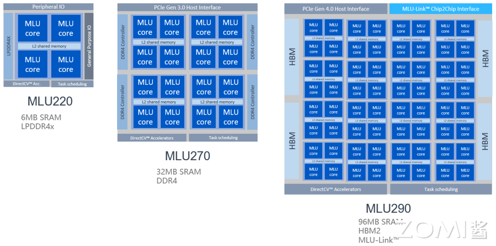
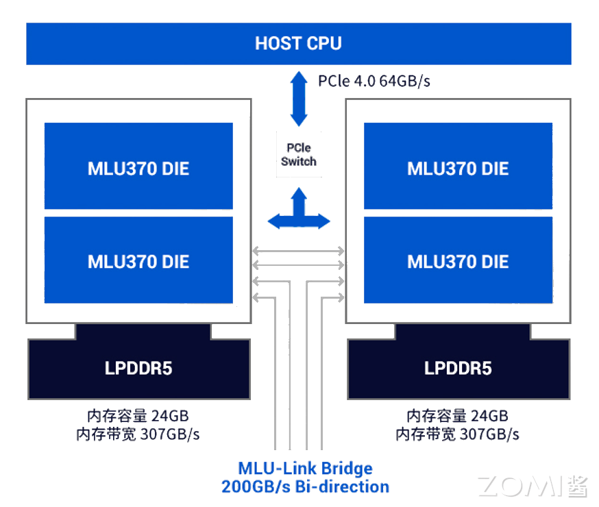
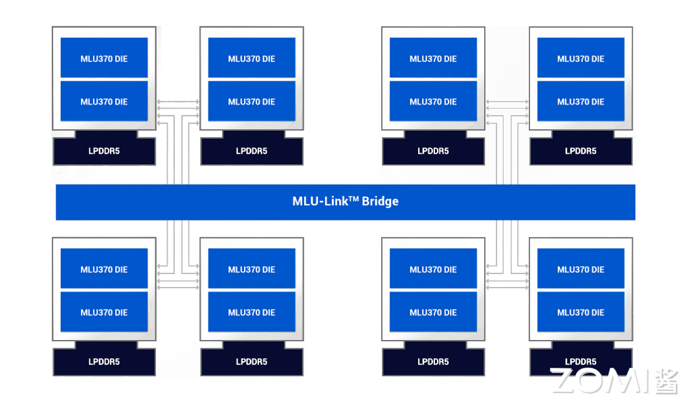
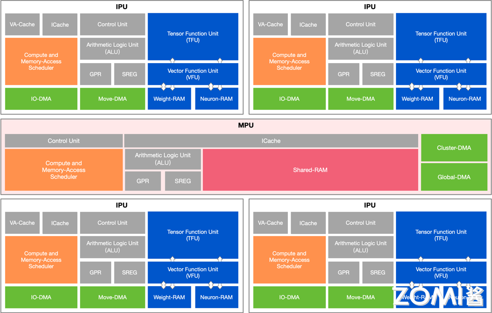

前置声明，本文档不讨论寒武纪公司尚未公布的信息，一切以寒武纪公司官方公布为准，详细文档请参考[寒武纪官方文档](https://developer.cambricon.com/index/document/index/classid/3.html)。

# 寒武纪MLU芯片架构

寒武纪产品架构官方公布的名称分为MLU00 MLU01 MLU02 MLU03，分别对应于1A、1H、1M、以及官方尚未公布型号的MLU370的处理器内核。

以MLU02的产品为例，不同产品线采用的核心相同，但DRAM、PCIe等都有不同。

## MLU03

以官网所公布的目前（2024.4）为止最新的板卡MLU370为例，下图显示了它的产品形态，板卡之间借助主板的的MLU Link bridge互联，内存采用低功耗的LPDDR5，PCIe采用Gen4.0来与CPU互联。

MLU370-X8智能加速卡是全面升级的数据中心训推一体AI加速卡，基于寒武纪全新一代思元370芯片，接口为PCIe 4.0 X16，是全高全长双宽（FHFL-Dual-Slot）的标准PCIe加速卡，适用于业内最新的CPU平台，可轻松搭载于最先进的人工智能服务器，快速实现 AI算力的部署。MLU370-X8加速卡功耗为250W，可为计算机视觉、自然语言处理、语音等多样化的人工智能应用提供强大算力支持。

MLU370-X8通过MLU-Link™高速网络，组建大规模训练集群，并实现芯片间互联。新一代MLU-Link™，不仅支持板卡上2个思元370芯片间通过MLU-Link™进行通讯，同时也可以通过MLU-Link™桥接卡对外互联，板卡间MLU-Link互联双向总带宽为200GB/s，满足大型AI模型训练的需要。

关于芯粒技术，芯粒英文是Chiplet，是指预先制造好、具有特定功能、可组合集成的晶片（Die），Chiplet也有翻译为“小芯片”，中科院计算所韩银和等2020年时建议将Chiplet翻译为“芯粒”。在集成电路领域，我们的发展水平和国外存在差距，“卡脖子”成了很突出的问题。按摩尔定律去发展、去追赶是一条路，但也可以另辟蹊径。
芯粒集成就是这样的前沿技术。芯粒是指按特定功能进行分解的小芯片，芯粒集成技术则是把制程代际和功能不同的芯粒像搭积木一样组合形成一个芯片去使用。

## MLU03核心架构

寒武纪的 MLU 硬件是面向人工智能应用的领域专用处理器，针对人工智能算法的计算特性和访存特性，设计了高效的指令集、流水线、运算部件和访存部件。与通用处理器相比，MLU 硬件在处理人工智能任务时有更高的性能、灵活性和能效比。MLU 硬件针对人工智能中不同特征的访存数据流设计专用的数据通路和运算部件，实现了不同的数据流之间的隔离；同时向软件暴露了灵活的片上存储空间访问功能，提高了处理效率。

寒武纪硬件的基本组成单元是MLU Core（就是视频中所述的IPU）。每个 MLU Core 是具备完整计算、IO和控制功能的处理器核心，可以独立完成一个计算任务，也可以与其他 MLU Core 协作完成一个计算任务。每4个 MLU Core 核心构成一个 Cluster，在 MLUv02 以及后续架构中，每个 Cluster 内还会包含一个额外的 Memory Core 和一块被 Memory Core 和 4 个 MLU Core 共享的 SRAM（Shared RAM，共享存储单元）。Memory Core 不能执行向量和张量计算指令，只能用于 SRAM 与 DDR （Double Data Rate Synchronous Dynamic Random Access Memory，双倍速率同步动态随机存储器，DDR SDRAM通常简称为DDR） 和 MLU Core 之间的数据传输。

下图中展示了MLU03的核心架构，MLU03采用4个IPU和一个MPU组成一个Cluster（实际上MLU02也是），IPU上有大量的计算单元以及本地scratchpad memory（NeuronRAM WeightRAM），MPU上有SharedRAM，相当于GPU的shared memory。不同Cluster数量可以组成不同的产品形态（云端、边缘端、IP）

关于MLU03核心架构我们将在下一节中进行更详细的介绍，下面补充一些视频中没有提到的MLU概念

## 软件栈

寒武纪有自己的一套对标nvidia的软件栈，对标CUDA C的编程语言BANG C，对标CuDNN CuBLAS的算子库CNNL，对标NCCL的通信库CNCL，对标TensorRT的推理引擎MagicMind，对标cuda-gdb的调试器cngdb等等。

### BANG C

Cambricon BANG 异构计算平台的核心组件是面向 MLU 硬件的编译器工具链，目前支持通过 C/C++ 的扩展语言 Cambricon BANG C 和基于 Python 的扩展语言 Cambricon BANGPy 对 MLU 硬件进行编程。编译器工具链和编程语言为任务划分、并行处理、数据通信和同步机制等提供底层支持，使用户可以专注于编写应用的处理逻辑本身。利用 Cambricon BANG C 和 Cambricon BANGPy 编程语言可以开发各类人工智能应用和算法库，并最终形成完整的人工智能解决方案。

Cambricon BANG C 在 C/C++ 语言的基础上，增加了 Cambricon BANG 异构并行编程模型必须的语法特性、计算原语、数据类型和内建变量支持。此外，Cambricon BANG C 针对异构编程环境的特点对 C/C++ 进行了简化，禁用了一些不适合异构编程环境的 C/C++ 特性。Cambricon BANG C 程序可以使用 CNGDB 进行调试，有关 CNGDB 的使用方法可以参考《寒武纪 CNGDB 用户手册》。

Cambricon BANG C 语言整合了不同类型指令集和架构的计算单元，并支持寒武纪推出的云端、边缘端和终端设备。遵循 Cambricon BANG C 编程规范的应用程序，几乎可以无需修改直接运行在包含不同 MLU Core数量、Cluster数量的MLU硬件上。使用 Cambricon BANG C 编写的异构程序包括主机侧和设备侧的代码。其中，主机侧主要是借用 CNRT（Cambricon Runtime Library，寒武纪运行时库） 或者 CNDrv（Cambricon Driver API，寒武纪软件栈驱动接口） 提供的相关接口实现设备信息查询、设备选择、设备内存分配、任务队列创建、输入数据或参数准备、任务描述、Kernel启动、输出获取等功能；而设备侧的入口函数就是 Kernel 函数，Kernel 函数中可以使用 Cambricon BANG C 面向设备侧编程时扩展的语法特性、计算原语、数据类型和内建变量等特性。

### CNNL

Cambricon CNNL（寒武纪人工智能计算库）是一个基于寒武纪MLU并针对人工智能网络的计算库。Cambricon CNNL针对人工智能网络应用场景，提供了高度优化的常用算子，同时也为用户提供简洁、高效、通用、灵活并且可扩展的编程接口。

Cambricon CNNL主要支持如下特性：

支持丰富的基本算子。

常见的网络算子：

- 卷积、卷积反向求卷积输入与滤波的梯度；
- 池化、池化反向；
- 激活算子、激活算子反向，如ReLU、Sigmoid、TANH等；
- Softmax、softmax反向；
- Batchnorm前向与反向、LayerNorm前向与反向；
- Reduce类算子；

矩阵、计算类算子：

- 矩阵乘；
- 张量加、减、乘等基本运算；
- 张量逻辑运算；
- 张量变换，如Transpose、Split、Slice、Concat等；
- 三角类变换，如sin、cos、tanh等；

循环网络算子：

- Long Short-Term Memory（LSTM）；
- Gate Recurrent Unit（GRU）；
- 其他TensorFlow和PyTorch常用算子：
- Embedding前向和反向计算；
- Nllloss前向和反向计算；

设计过程中充分考虑易用性，以通用为基本设计原则，算子支持不同的数据布局、灵活的维度限制以及多样的数据类型。

结合寒武纪的硬件架构特点，优化Cambricon CNNL算子，使算子具有最佳性能，并且尽最大可能减少内存占用。

提供包含资源管理的接口，满足用户更多线程、多板卡的应用场景。

### magicmind

MagicMind是面向寒武纪MLU的推理加速引擎。MagicMind能将人工智能框架（TensorFlow、PyTorch、Caffe与ONNX等）训练好的算法模型转换成MagicMind统一计算图表示，并提供端到端的模型优化、代码生成以及推理业务部署能力。MagicMind 致力于为用户提供高性能、灵活、易用的编程接口以及配套工具，让用户能够专注于推理业务开发和部署本身，而无需过多关注底层硬件细节。

如果有用MLU、GPU、CPU训练好的算法模型，可以使用MagicMind快速地实现在MLU上部署推理业务。MagicMind的优势在于它能为MLU上的推理业务提供：

- 极致的性能优化。
- 可靠的精度。
- 尽可能少的内存占用。
- 灵活的定制化开发能力。
- 简洁易用的接口。

MagicMind适用（但不限于）以下推理业务场景：

- 图像处理（分类、检测、分割）。
- 视频处理。
- 自然语言处理。
- 姿态检测。
- 搜索、推荐。

MagicMind支持不同的系统平台和MLU硬件平台。MagicMind面向云端业务和端侧业务，提供了统一的编程界面，并针对两种业务场景的差异点，提供了必要的定制化功能（比如面向端侧部署提供了remote debug功能）。

### CNCL

CNCL（Cambricon Communications Library，寒武纪通信库）是面向 MLU 设计的高性能通信库。

- CNCL 帮助应用开发者优化了基于 MLU 进行多机多卡的集合通信（Collective）操作。
- CNCL 支持多种 MLU 处理芯片的互联技术，包括 PCIe、MLU-Link、MLU-Link over RoCE、RoCE、Infiniband Verbs 以及 Sockets。
- CNCL 能够根据芯片的互联拓扑关系，自动的选择最优的通信算法和数据传输路径，从而最大化利用传输带宽完成不同的通信操作。

#### 通信实体

通信实体是执行通信操作的基本单元，它是一个抽象概念，包括通信内存地址空间、MLU 设备、执行设备队列（MLU Queue）等信息。

围绕通信实体，CNCL 中构建了两个核心概念：通信域（Communication Clique，简称Clique）和通信子（Communicator，简称Comm）。

#### 通信域

通信域是发生通信操作的上下文环境，其定义了一组通信实体的集合，每个通信实体在通信域里有唯一的标识，是一个抽象概念。

CNCL 提供了操作通信域的相关接口，用户可以创建通信域以及获取通信域的相关信息。

#### 通信子

通信子是对通信实体的表征，通常情况下，一个通信子关联到一个 MLU 设备和该设备的一个队列（Queue）。

CNCL 提供了操作通信子的相关接口，用户可以管理（创建、销毁等）通信子以及获取通信子在通信域中的相关信息。

#### 通信操作流程

确定通信实体：

首先在每个进程中定义一组通信子，并设置该通信子关联的 MLU 设备和设备队列。 每个进程需要调用初始化函数 cnclInitComms 对通信子进行初始化。 所有运行的进程内的通信子构成了一个通信域，该域内的每个通信子有一个唯一的序号（rank）对其进行标识。

确定通信原语：

根据通信目的选择要使用的通信原语。 对通信域中的每一个通信实体，在进程中调用相应的通信原语接口完成通信操作。 在调用接口时，通过 rank 号来标识对应的通信实体。如果想用接收数据原位覆盖发送数据，发送/接收数据的地址需要满足对应通信原语的原位操作的特殊条件。

判定通信完成：

通信原语的接口正确返回并不一定表示通信完成，这与接口是同步语义还是异步语义有关。

### Pytorch and Tensorflow

#### Pytorch

为支持寒武纪MLU，寒武纪定制了开源人工智能编程框架PyTorch（以下简称Cambricon PyTorch）。

Cambricon PyTorch借助PyTorch自身提供的设备扩展接口将MLU后端库中所包含的算子操作动态注册到PyTorch中，MLU后端库可处理MLU上的张量和算子的运算。Cambricon PyTorch会基于Cambricon CNNL库在MLU后端实现一些常用算子，并完成一些数据拷贝。

为了能在Torch模块方便使用MLU设备，Cambricon PyTorch在PyTorch后端进行了以下扩展：

- 通过Torch模块可调用MLU后端支持的网络运算。
- 对MLU暂不支持的算子，支持该类算子自动切换到CPU上运行。
- Torch模块中与MLU相关的接口的语义与CPU和GPU的接口语义保持一致。

寒武纪采用Python扩展包形式对原生PyTorch进行支持。寒武纪将与MLU相关的操作都放在一个单独的Python包中，然后将该包导入到原生PyTorch以支持在MLU上的运算。

#### Tensorflow

Cambricon TensorFlow集成了寒武纪软件栈，扩展了社区TensorFlow对MLU设备的支持，同时屏蔽硬件的细节，允许用户使用原生TensorFlow API进行开发。用户在使用Cambricon TensorFlow进行开发、部署时，可以获得与使用CPU、GPU一致的体验。

### Cabricon DeepSpeed

Cambricon DeepSpeed 是适配了Cambricon PyTorch 的大规模分布式训练框架，位于寒武纪软件栈的 AI 框架和开源生态层。

Cambricon DeepSpeed 扩展了原生 DeepSpeed，支持使用 MLU 设备进行模型分布式训练，其特点在于：

- 适配了Cambricon PyTorch。
- 适配了Cambricon Lightning。
- 使用CNCL（Cambricon Communications Library，寒武纪通信库）进行多卡或者多机之间的通信。

### CNCodec

CNCodec-V3（Cambricon Codec Library，寒武纪编解码库）是一个基于第三代寒武纪硬件视频编解码加速单元，并针对MLU加速卡特点进行优化的硬件 编解码加速库。在继承第二代CNCodec设计基础上，CNCodec-V3 针对新的硬件特性，将视频编解码与图像编解码接口融合，为用户提供简洁、高效、通用、灵活并且可扩展的接口。

### CNStream

CNStream是面向寒武纪开发平台的数据流处理SDK，基于模块化和流水线的思想，提供了一套基于C++11的类和接口来支持流处理多路并发的Pipeline框架。用户可以根据CNStream提供的接口，开发自定义模块，并通过模块之间相互连接，实现自己的业务处理流程。CNStream能够大大简化寒武纪人工智能平台提供的推理和其他处理，如视频解码、图像前处理的集成。也能够在兼顾灵活性的同时，充分发挥寒武纪硬件解码和人工智能算法的运算性能。

### CNServing

CNServing是一款可部署MagicMind序列化模型的高性能服务系统，专为生产环境而设计。将任意框架模型通过MagicMind生成序列化模型后，使用CNServing可将其方便快捷地部署在MLU服务器上。可同时部署在多张MLU板卡上，也可以部署多个序列化模型，为客户端提供高性能服务。

CNServing基于TensorFlow Serving架构开发。相比TensorFlow Serving，CNServing拥有更好的性能表现，并且CNServing的client端API仍然使用tensorflow_serving_api，这样使用TensorFlow Serving部署模型的用户无需修改client端任何代码即可轻松切换到CNServing上。

## 本节视频

<html>
<iframe src="https://player.bilibili.com/player.html?aid=956498914&bvid=BV1op4y157Qf&cid=1209962179&page=1&as_wide=1&high_quality=1&danmaku=0&t=30&autoplay=0" width="100%" height="500" scrolling="no" border="0" frameborder="no" framespacing="0" allowfullscreen="true"> </iframe>
</html>
