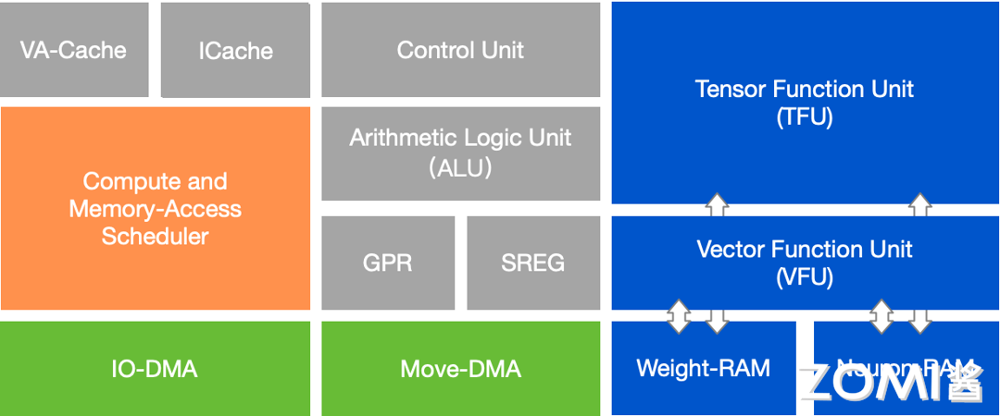
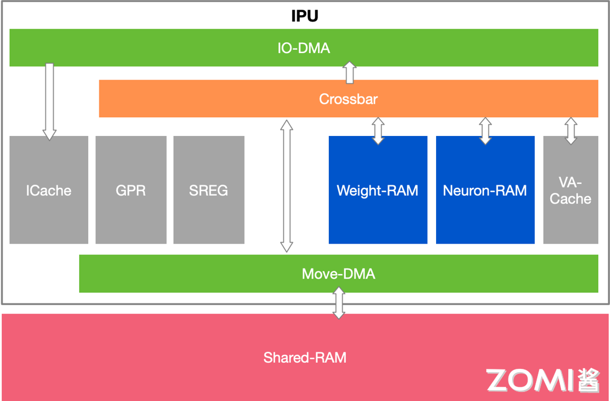
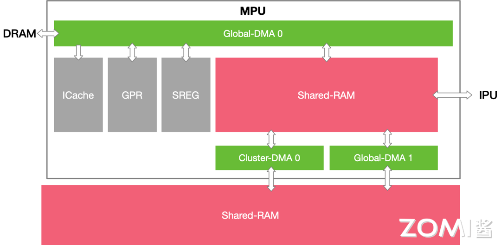

本节我们将会深入硬件细节为大家介绍寒武纪 MLUv3 的一些架构细节。在此之前我们先简单介绍一下寒武纪架构的一些学术基础。

# 理论基础

首先，在 2014 年左右，寒武纪公司的前身中科院计算所计算机体系结构国家重点实验室的智能处理器团队（现在的智能处理器研究中心），与国际合作者 Olivier Temam 一起发表了一篇名称为 DianNao（[1]） 的论文，这篇论文指出当机器学习算法尤其是神经网络算法越来越普遍应用的情况下，使用专门的机器学习加速器或许可以既能提供提供优秀的性能又能支撑广泛的应用场景。要知道，在 2012 年 AlexNet 大火，刷新了 CV 领域的一些记录，在 2014 年左右，最为典型最为重要的 DNN 模型，也就是 CNN 了（卷积神经网络），因此这个工作也对 CNN 进行了一定的设计。在当时，虽然也有一些关于设计专用硬件来实现机器学习算法的论文，但这篇工作尤其强调加速器的存储设计、性能和功耗。此工作设计了一个性能为 452GOP/s，只有 3.02 平方毫米，485mW 功耗的高吞吐加速器，与一个 128 比特 2GHz 的 SIMD 处理器相比，它快 117.87 倍，可以把总功耗降低 21.08 倍，使用 65nm 工艺。在此工作中，重点关注神经网络的推理阶段而不是训练阶段，文章分析了一个简单的神经网络的访存模式，通过对输入输出做 tiling（切片）完成计算。分析了如果把整个神经网络的权值全部硬化在下来需要很高的成本，因此无法大规模应用，因此设计了自己的体系结构，一个小规模的加速器，它由以下几个部分组成：专门的输入神经元 Buffer（NBin），输出神经元 Buffer（NBout），存放权重的 buffer（SB），还有专门的计算单元 NFU（Neural Function Unit）以及控制单元 CP。此设计中的 NBin、NBout 等是 scratchpad memory（SPM，便笺式存储器），不同于一些国内外 GPGPU 方案中所使用的寄存器文件（register file），这个思想也一直影响着寒武纪的设计哲学。

之后计算所智能处理器团队还进一步发表了 DaDianNao([2])、ShiDianNao([3])、PuDianNao([4])等工作，它们有的在之前的基础上将芯片扩展到 multi chip 系统，支持训练与推理，有的专注于计算机视觉任务，有的专注于传统机器学习算法。Cambricon 指令集（[5]）这篇论文为了解决日新月异的算法难以全部通过硬化适配的问题，借鉴 RISC 的指令集的设计原则，通过将描述神经网络的复杂指令分解成更短，更简单的指令，来扩大加速器的应用范围。使用简单和短的指令来减少设计和验证的风险，以及译码逻辑的功耗和面积。这一思想也被后续应用到了寒武纪公司的产品中。

在 2020 年出版的《智能计算系统》（[7]）中，作者在第 7 章介绍了一种深度学习处理器架构，其设计思想基本上体现了寒武纪架构的设计中心思想，感兴趣的读者不妨一看。

# 寒武纪 MLU 架构细节

下面我们简单根据 zomi 的资料介绍一下 MLU Core 的工作原理，再对照寒武纪官方文档来了解一下寒武纪产品的编程模型。

## MLUv3 IPU （MLU Core）

IPU 在官方文档中也叫作 MLU Core，下面是示意图。



从 zomi 找到的资料图中，我们可以看到，Control Unit 比较重要，负责指令的读取、译码和发射。自研指令可以通过 Control Unit 被负责计算和访存的调度器 Dispatch 到 ALU、VFU、TFU、IO-DMA、Move-DMA 四个队列。IO-DMA 用来实现片外 DRAM 与 W/N-RAM 数据传输，也可以用于实现 Register 与片内 RAM 之间的 Load/Store 操作以及原子操作。Move-DMA 用于 IPU 中 W/N-RAM 与 MPU S-RAM 间数据传输和类型转换。I-Cache 顾名思义就是指令缓存，有 64KB，如 512bit 指令可以缓存 1024 条。VA-Cache(Vector Addressing)是离散数据访问指令的专用缓存。用于加速离散向量访问效率，减少对总线和存储单元读写次数。Neural-RAM（nram）是 768KB，需 16byte 对齐，存储 Input 和 Feature Map 数据。Weight-RAM（wram）是 1024KB，需 8byte 对齐，存储权重和优化器数据。

ALU 就是标量 Scale 数据的算术逻辑运算。GPR 是指一组位宽 48bit 的寄存器，IPU 为 Load/Store 架构，除立即数以外所有操作加载到 GPR 才能参与算术逻辑运算。SREG 是指位宽 32bit 的特殊寄存器，用于存储硬件特定属性，如 Perf 计数、任务索引等。

VFU/TFU 是计算单元，实现张量 Tensor 和向量 Vector 运算；输入输出：Vector 运算输入输出在 Neuron-RAM；Tensor 运算输入自 Neuron-RAM 和 Weight-RAM，输出根据调度情况到 Neuron-RAM 和 Weight-RAM。

关于指令流水，那么 MLU Core 有三类可以并行执行的指令队列：XFU-PIPE、 DMA-PIPE、ALU-PIPE。XFU-PIPE 可以执行向量和张量单元指令。DMA-PIPE 可以支持双流同时进行数据搬运执行。具体包括上述的 move-DMA 和 IO-DMA 两个流。ALU-PIPE 可以执行标量数据算术逻辑指令。各个指令队列的并行执行有助于让 IPU 的不同种类的操作互相掩盖。

## MLUv3 MPU (cluster)

MPU 的主要功能是单个 Cluster 内部 Shared-RAM 和多个 Cluster 间 Shared-RAM 的管理和通信。从下图可以看到，每一个 cluster 包含 4 个 MLU Core（IPU）和一个 MPU。


在 MPU 中主要由以下几部分组成：Cluster-DMA，负责 Cluster 间和 Shared-RMA 间数据传输。Global-DMA，负责 GPR 与片外内存，GPR 与 Shared-RAM，Shared-RAM 和 DRAM 间数据传输。Shared-RAM，4MB，相当于 1 级缓存，给具体计算提供数据。

需要注意，MLUv02 以前的寒武纪产品是没有 MPU 架构，也没有 cluster 概念的。

## MLUv03 片内通信

这里所述的片内通信分为两种：cluster 内通信与 cluster 间通信。

cluster 内通信中我们先看 IPU（MLU-Core），其中 ICache 访问 Global-DRAM 读取指令并保存到 Icache 中，IO-DMA 还可以直接在 DRAM 和 W/N-RAM 之间搬运数据。Move-DMA 负责在 S/W/N-RAM 之间以及它们与 GPR 之间搬运数据。之所以要使用两种不同的 DMA 是为了方便两者之间的并行。



我们再看 MPU



MPU 上同样有 ICache，此外它也通过 Global-DMA 在 DRAM 和 Shared RAM 之间搬运数据。特别地，它还有两个不同的 Cluster-DMA 通道负责在 Shared RAM 之间搬运数据。值得注意的是，在 MLUv02 的时期（2020 年）就已经有在 Shared RAM 之间的数据通路设计了，而 NVIDIA 在后来的 Hopper 架构的时候，大概是 2022 年，才在不同 Shared memory 之间增加了数据通路。MLU 中的 Cluster 大约可以类比为 NVIDIA GPU 中的 SM（Stream Multiprocessor），虽然二者还是挺不同的，但从增加数据通路有利于计算单元之间传递数据的角度来看，或许寒武纪已经领先 NVIDIA。

## 存储层次

说到 Neural-RAM（nram）和 Weight-RAM（wram），细心的读者可能已经意识到了，它们就相当于前面介绍过的 DianNao 那篇论文里面的 NBin+NBout 与 SB。它们属于 scratchpad memory，一种当做存储空间来用的 SRAM。那么我们就来了解一下寒武纪体系结构下的存储层次。

抽象硬件模型提供了丰富的存储层次，包括 GPR（General Purpose Register，通用寄存器）、NRAM、WRAM、SRAM、L2 Cache、LDRAM（Local DRAM，局部 DRAM 存储单元）、GDRAM（Global DRAM，全局 DRAM 存储空间）等。GPR、WRAM 和 NRAM 是一个 MLU Core 的私有存储，Memory Core 没有私有的 WRAM 和 NRAM 存储资源。L2 Cache 是芯片的全局共享存储资源，目前主要用于缓存指令、Kernel 参数以及只读数据。LDRAM 是每个 MLU Core 和 Memory Core 的私有存储空间，其容量比 WRAM 和 NRAM 更大，主要用于解决片上存储空间不足的问题。GDRAM 是全局共享的存储资源，可以用于实现主机端与设备端的数据共享，以及计算任务之间的数据共享。

### GPR

GPR 是每个 MLU Core 和 Memory Core 私有的存储资源。MLU Core 和 Memory Core 的标量计算系统都采用精简指令集架构，所有的标量数据，无论是整型数据还是浮点数据，在参与运算之前必须先加载到 GPR。GPR 的最大位宽为 48 位，一个 GPR 可以存储一个 8bit、16bit、32bit 或者 48bit 的数据。GPR 中的数据不仅可以用来实现标量运算和控制流功能，还用于存储向量运算所需要的地址、长度和标量参数等。

GPR 不区分数据类型和位宽，GPR 中存储的数据的类型和位宽由操作对应数据的指令决定。当实际写入 GPR 中的数据的位宽小于 48bit 时，高位自动清零。

Cambricon BANG 异构并行编程模型中的隐式数据迁移都是借助 GPR 实现的。例如，将 GDRAM 上的标量数据赋值给一个位于 LDRAM 的变量时，编译器会自动插入访存指令将 GDRAM 中的数据先加载到 GPR 中，再插入一条访存指令将 GPR 中的数据写入 LDRAM 中。

### NRAM(Neural-RAM)

NRAM 是每个 MLU Core 私有的片上存储空间，主要用来存放向量运算和张量运算的输入和输出数据，也可以用于存储一些运算过程中的临时标量数据。相比 GDRAM 和 LDRAM 等片外存储空间，NRAM 有较低的访问延迟和更高的访问带宽。NRAM 的访存效率比较高但空间大小有限，而且不同硬件的 NRAM 容量不同。用户需要合理利用有限的 NRAM 存储空间，以提高程序的性能。对于频繁访问的数据，应该尽量放在 NRAM 上，仅仅当 NRAM 容量不足时，才将数据临时存储在片上的 SRAM 或者片外的 LDRAM 或者 GDRAM 上。

### WRAM(Weight-RAM)

WRAM 是每个 MLU Core 私有的片上存储空间，主要用来存放卷积运算的卷积核数据。为了高效地实现卷积运算，WRAM 上的数据具有特殊的数据布局。

### SRAM(Shared-RAM，此 SRAM 非彼 SRAM，因为 S 代表 Shared 而不是 Static)

SRAM 是一个 Cluster 内所有 MLU Core 和 Memory Core 都可以访问的共享存储空间。SRAM 可以用于缓存 MLU Core 的中间计算结果，实现 Cluster 内不同 MLU Core 或 Memory Core 之间的数据共享及不同 Cluster 之间的数据交互。

SRAM 有较高的访存带宽，但是容量有限。用户需要合理利用有限的 SRAM 存储空间，以提高程序的性能。

SRAM 仅支持 MLUv02 及后续硬件架构。

### L2 Cache

L2 Cache 是位于片上的全局存储空间，由硬件保证一致性，目前主要用于缓存指令、Kernel 参数以及只读数据。

### LDRAM

LDRAM 是每个 MLU Core 和 Memory Core 私有的存储空间，可以用于存储无法在片上存放的私有数据。LDRAM 属于片外存储，不同 MLU Core 和 Memory Core 之间的 LDRAM 空间互相隔离，软件可以配置其容量。与 GDRAM 相比，LDRAM 的访存性能更好，因为 LDRAM 的访存冲突比较少。

### GDRAM

与 LDRAM 类似，GDRAM 也是片外存储。位于 GDRAM 中的数据被所有的 MLU Core 和 Memory Core 共享。GDRAM 空间的作用之一是用来在主机侧与设备侧传递数据，如 Kernel 的输入、输出数据等。Cambricon BANG 异构编程模型提供了专门用于在主机侧和设备侧之间进行数据拷贝的接口。

## 编程示例

以矩阵乘为例，刚接触寒武纪硬件的新手可能会使用标量来开发一个矩阵乘 kernel：
```
#define M 256
#define K 256
#define N 256
...
__nram__ float nram_dst[M * N]; // C 矩阵
__nram__ int16_t nram_src0[M * K]; // A 矩阵
__nram__ int8_t nram_src1[K * N]; // B 矩阵
...
for (int i = 0; i < M; i++) {
  for (int j = 0; j < N; j++) {
    float tmp = 0;
    for (int k = 0; k < K; k++) {
      tmp += nram_src0[i * K + k] * nram_src1[j * K + k];
    }
    nram_dst[i * N + j] = tmp;
  }
}
```
然而，上述代码实际上只会使用寒武纪硬件中的标量计算单元，而不能充分利用向量、矩阵乘单元，从而不能发挥出硬件的性能。与之相对，下面的代码使用了`__bang_matmul`向量接口来加速矩阵乘，调用该接口时需要保证左矩阵在内存上行优先的，右矩阵在内存上列优先的。

```
#define M 256
#define K 256
#define N 256
#define POS 0
#define SRC0_DATA_NUM (M * K)
#define SRC1_DATA_NUM (K * N)
#define DST_DATA_NUM (M * N)

// Matrix multiplication (MLU Kernel) on the device: dst = src0 * src1
__mlu_global__ void MatmulKernel(float* dst/*C*/, int16_t* src0/*A*/, int8_t* src1/*B*/) {
  __nram__ float nram_dst[DST_DATA_NUM];
  __nram__ int16_t nram_src0[SRC0_DATA_NUM];
  __wram__ int8_t wram_src1[SRC1_DATA_NUM];
  __memcpy(nram_src0, src0, SRC0_DATA_NUM * sizeof(int16_t), GDRAM2NRAM);
  __memcpy(wram_src1, src1, SRC1_DATA_NUM * sizeof(int8_t), GDRAM2WRAM);
  __bang_matmul(nram_dst, nram_src0, wram_src1, M, K, N, POS);
  __memcpy(dst, nram_dst, DST_DATA_NUM * sizeof(float), NRAM2GDRAM);
}
```
除了使用专用的 intrinsic function 之外，[寒武纪 CAMBRICON BANG C/C++ 编程指南](https://www.cambricon.com/docs/sdk_1.15.0/cntoolkit_3.7.2/programming_guide_1.7.0/hardware_implementation/index.html#)还介绍了很多种优化方法，有助于优化任务的性能。

# 小结

至此，我们有关于寒武纪芯片的内容就介绍完毕了。本教程源自互联网已公开的资料，感谢寒武纪公司提供的技术文档，感谢读者的阅读。

# 参考文献

[1] Chen T , Du Z , Sun N ,et al.DianNao: a small-footprint high-throughput accelerator for ubiquitous machine-learning[C]//International Conference on Architectural Support for Programming Languages & Operating Systems.ACM, 2014.DOI:10.1145/2541940.2541967.

[2] Chen Y , Luo T , Liu S ,et al.DaDianNao: A Machine-Learning Supercomputer[C]//2014 47th Annual IEEE/ACM International Symposium on Microarchitecture.0[2024-04-14].DOI:10.1109/MICRO.2014.58.

[3] Du, Z., Fasthuber, R., Chen, T., Ienne, P., Li, L., Luo, T., Feng, X., Chen, Y., Temam, O., 2015. ShiDianNao: shifting vision processing closer to the sensor, in: Proceedings of the 42nd Annual International Symposium on Computer Architecture. Presented at the ISCA ’15: The 42nd Annual International Symposium on Computer Architecture, ACM, Portland Oregon, pp. 92–104. https://doi.org/10.1145/2749469

[4] Liu, D., Chen, T., Liu, S., Zhou, J., Zhou, S., Teman, O., Feng, X., Zhou, X., Chen, Y., 2015. PuDianNao: A Polyvalent Machine Learning Accelerator, in: Proceedings of the Twentieth International Conference on Architectural Support for Programming Languages and Operating Systems. Presented at the ASPLOS ’15: Architectural Support for Programming Languages and Operating Systems, ACM, Istanbul Turkey, pp. 369–381. https://doi.org/10.1145/2694344

[5] Liu S, Du Z, Tao J, et al. Cambricon: An Instruction Set Architecture for Neural Networks[C]// Acm/ieee International Symposium on Computer Architecture. 2016.

[6] [寒武纪 CAMBRICON BANG C/C++ 编程指南](https://www.cambricon.com/docs/sdk_1.15.0/cntoolkit_3.7.2/programming_guide_1.7.0/hardware_implementation/index.html#)

[7] 陈云霁，李玲，李威，郭崎，杜子东，2020. 《智能计算系统》, 机械工业出版社


## 本节视频

<html>
<iframe src="https://player.bilibili.com/player.html?aid=403940478&bvid=BV1TV411j7Yx&cid=1210634113&page=1&as_wide=1&high_quality=1&danmaku=0&t=30&autoplay=0" width="100%" height="500" scrolling="no" border="0" frameborder="no" framespacing="0" allowfullscreen="true"> </iframe>
</html>
