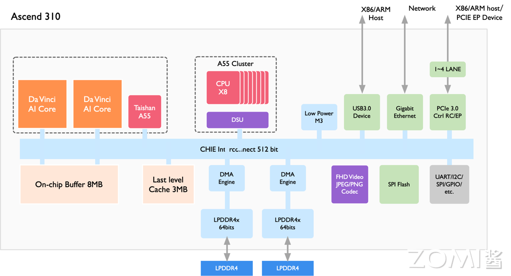

<!--Copyright © 适用于[License](https://github.com/chenzomi12/AISystem)版权许可-->

# 昇腾 AI 处理器

本节将会介绍华为昇腾 AI 处理器的架构与卷积加速原理。昇腾 AI 处理器是华为基于达芬奇架构专为人工智能领域设计的处理器，它支持云边端一体化的全栈全场景解决方案，具有高能效比和强大的 3D Cube 矩阵计算单元，支持多种计算模式和混合精度计算。

昇腾 AI 处理器的架构包括了 AI Core、AI CPU、多层级片上缓存/缓冲区和数字视觉预处理模块 DVPP，这些组件通过 CHI 协议的环形总线实现数据共享和一致性。此外，本节还将探讨卷积加速原理，即昇腾 AI 处理器如何通过软硬件优化实现高效的卷积计算加速，包括矩阵计算单元和数据缓冲区的高效组合以及灵活的数据通路设计，以满足不同深度神经网络的计算要求。

## 昇腾 AI 处理器

参考文献：《昇腾 AI 处理器架构与编程——深入理解 CANN 技术原理与应用》——梁晓峣，2019

华为公司针对人工智能领域专用计算量身打造了“达芬奇架构”，并于 2018 年推出了基于“达芬奇架构”的昇腾 AI 处理器，开启了华为的人工智能之旅。

从基础研究出发，立足于自然语言处理、机器视觉、自动驾驶等领域，昇腾 AI 处理器致力于打造面向云边端一体化的全栈全场景解决方案，同时为了配合其应用目标，打造了异构计算架构 CANN（Computer Architecture for Nerual Network），为昇腾 AI 处理器进行加速计算。全栈指技术方面，包括 IP、芯片、加速计算、AI 框架、应用使能等的全栈式设计方案。全场景包括公有云、私有云、各种边缘计算、物联网行业终端及消费者终端设备。围绕全栈全场景，华为正以昇腾 AI 处理器为核心，以算力为驱动，以工具为抓手，全力突破人工智能发展的极限。

自 2018 年伊始，昇腾 AI 处理器的训练和推理系列型号陆续推出。训练系列的处理器主要应用于云端，可以为深度学习的训练算法提供强大算力。推理系列的处理器则是面向移动计算场景的强算力人工智能片上系统（SoC，System on Chip）。

在设计上，昇腾 AI 处理器意图突破目前人工智能芯片功耗、运算性能和效率的约束，目的是极大提升能效比。昇腾 AI 处理器采用了华为自研的达芬奇架构，专门针对深度神经网络运算特征而量身定做，以高性能的 3D Cube 矩阵计算单元为基础，实现算力和能效比的大幅度提升。每个矩阵计算单元可以由一条指令完成 4096 次成家计算，并且处理器内部还支持多维计算模式，如标量、矢量、矩阵等，打破了其它人工智能专用芯片的局现象，增加了计算的灵活度。同时支持多种类混合精度计算，在实现推理应用的同时也强力支持了训练的数据精度要求。

达芬奇架构的统一性体现在多个应用场景的良好适配上，覆盖高、中、低全场景，一次开发可支持多场景部署、迁移和协同。从架构上提升了软件效率。功耗优势也是该架构的一个显著特点，统一的架构可以支持从几十毫瓦到几百瓦的芯片，可以进行多核灵活扩展，在不同应用场景下发挥出芯片的能耗优势。

达芬奇架构指令集采用了 CISC 指令且具有高度灵活性，可以应对日新月异、变化多端的新算法和新模型。高效的运算密集型 CISC 指令含有特殊专用指令，专门为神经网络打造，助力人工智能领域新模型的研发，同时帮助开发者更快速的实现新业务的部署，实现在线升级，促进行业发展。昇腾 AI 处理器在全业务流程加速方面，采用场景化视角，系统性设计，内置多种硬件加速器。昇腾 AI 处理器拥有丰富的 IO 接口，支持灵活可扩展和多种形态下的加速卡设计组合，很好应对云端、终端的算力和能效挑战，可以为各场景的应用强劲赋能。

## AI 处理器架构

昇腾 AI 处理器本质上是一个片上系统（System on Chip，SoC），主要应用于云端训练、手机、自动驾驶、无线基站、物联网等场景。我们选择面向云端训练场景的昇腾910和面向边缘推理场景的昇腾310介绍昇腾系列AI处理器。我们将首先介绍这些处理器共同的部分，然后介绍这些处理器面向特定领域的针对性设计。昇腾AI处理器的主要组成部件包括：
1. AI Core: 即达芬奇Core，是华为针对深度神经网络中的卷积和矩阵乘法设计的领域定制架构(Domain Specific Architecture, DSA)计算核心，还负责部分常见的激活函数如（。。。待补充，个人理解AI Core里的Scalar Unit并不用于计算密集的算子任务，更多是为了控制，如计算循环边界等参数用的；也不是很清楚Davinci Core里的Vector Unit是做啥的）
2. AI CPU: 由多核华为自研的TaiShan Core实现，每个核心都有独立的 L1 和 L2 缓存，所有核心共享一个片上 L3 缓存。这些AI CPU可以划分为用于控制芯片运行的主控 CPU和用于承担非矩阵类复杂算子的计算CPU。两类任务占用的 CPU 核数可由软件根据系统实际运行情况动态分配。AI CPU的存在使得昇腾AI处理器可以支持各种类型算子。
3. 片上缓冲区: 用于向AI Core和AI CPU提供高带宽、低延迟的数据交换和访问。
4. Task Schedule Subsystem: 由四核Cortex-A55实现，专用于将计算任务分配到AI Core和AI CPU上，不承担其他工作。
5. 主存: 通常由DDR或HBM实现，用于存放大量数据，比如整个模型的权重。
6. Direct Memory Access (DMA): 用于将数据从片外缓冲区(如DDR或HBM)搬运到片上缓冲区。
7. 外设接口: 包括高速接口如PCIE、以太网和低速接口如UART/I2C/GPIO等。
8. 总线: 基于 CHI 协议的片上环形总线相连，实现模块间的数据连接通路并保证数据的共享和一致性。

### 昇腾910

昇腾910处理器的目标场景是云端的推理和训练，其架构如上图所示，包含Davinci Core、DVPP、HBM、DDR4等组件。昇腾910处理器采用了芯粒(chiplet)技术，包含六个die: 1个计算芯粒(包含32个Davinci Core、16个CPU Core和4个DVDP)，1个IO芯粒，和4个HBM芯粒(总计1.2TB/s带宽)。针对云端训练和推理场景，昇腾910处理器做的优化包括:
1. 高算力: 训练场景通常使用的Batch Size较大，因此采用最高规格的Ascend-Max，每个Core每个周期可以完成16*16*16=4096次FP16乘累加
2. 高Load/Store带宽: 训练场景下计算反向SGD时，会有大量对Last Level Cache和片外缓存的访问，因此需要配备较高的Load/Store带宽，因此昇腾910除了DDR还采用了HBM技术。
3. 100G NIC: 随着DNN的模型尺寸愈发庞大，单机单卡甚至单机多卡已经不能满足云端训练的需求，为了支持多卡多机组成集群，昇腾910集成了支持ROCE V2协议的100G NIC用于跨服务器传递数据，使得可以使用昇腾910组成万卡集群。
4. 高吞吐率的数字视觉与处理器(DVPP): DVPP用于JPEG、PNG格式图像编解码、图像预处理(对输入图像上下采样、裁剪、色调转换等)、视频编解码，为了适配云端推理场景，DVPP最高支持128路1080P视频解码。

### 昇腾310

昇腾310处理器的目标场景是边缘推理，比如智慧城市、智慧新零售、机器人、工业制造等，其架构如上图所示，主要包含Davinci Core、DVPP、LPDDR4等组件。相比昇腾910，昇腾310的定制化IP相对较少，但是提供了更多外设接口。由于在边缘推理场景下batch size通常只有1，因此昇腾310选择了较小的矩阵计算维度(m = 4, n = 16, k = 16)以实现$C_{mn} = A_{mk}\times B_{kn}$。由于在矩阵运算中$M = batch\_size \times output\_hight \times output\_width$, 当batch size = 1时，将m设置成4可以提升乘累加利用率。

## 卷积加速原理

在深度神经网络中，卷积计算一直扮演着至关重要的角色。在一个多层的卷积神经网络中，卷积计算的计算量往往是决定性的，将直接影响到系统运行的实际性能。昇腾 AI 处理器作为人工智能加速器自然也不会忽略这一点，并且从软硬件架构上都对卷积计算进行了深度的优化。

上图展示的是一个典型的卷积层计算过程，其中**X**为输入特征矩阵，**W**为权重矩阵；**b**为偏置值；**Y**o 为中间输出；Y 为输出特征矩阵，GEMM 表示通用矩阵乘法。输入特征矩阵**X**和**W**先经过 Img2Col 展开处理后得到重构矩阵 XI2C 和 WI2C 通过矩阵**X**I2C 和矩阵**W**I2C 进行矩阵相乘运算后得到中间输出矩阵**Y**o；接着累加偏置**b**，得到最终输出特征矩阵**Y**，这就完成了一个卷积神经网络中的卷积层处理。

利用 AI Core 来加速通用卷积计算，总线接口从核外 L2 缓冲区或者直接从内存中读取卷积程序编译后的指令，送入指令缓存中，完成指令预取等操作，等待标量指令处理队列进行译码。如果标量指令处理队列当前无正在执行的指令，就会即刻读入指令缓存中的指令，并进行地址和参数配置，之后再由指令发射模块按照指令类型分别送入相应的指令队列进行执行。在卷积计算中首先发射的指令是数据搬运指令，该指令会被发送到存储转换队列中，再最终转发到存储转换单元中。

卷积整个数据流如上图所示，如果所有数据都在 DDR 或 HBM 中，存储转换单元收到读取数据指令后，会将矩阵***X***和***W***由总线接口单元从核外存储器中由数据通路 1 读取到输入缓冲区中，并且经过数据通路 3 进入存储转换单元，由存储转换单元对***X***和***W***进行补零和 Img2Col 重组后得到***X***I2C 和***W***I2C 两个重构矩阵，从而完成卷积计算到矩阵计算的格式变换。在格式转换的过程中，存储转换队列可以发送下一个指令给存储转换单元，通知存储转换单元在矩阵转换结束后将***X***I2C 和***W***I2C 经过数据通路 5 送入矩阵计算单元中等待计算。根据数据的局部性特性，在卷积过程中如果权重***W***I2C 需要重复多次计算，可以将权重经过数据通路 17 固定在输入缓冲区中，在每次需要用到该组权重时再经过数据通路 18 传递到矩阵计算单元中。在格式转换过程中，存储转换单元还会同时将偏置数据从核外存储经由数据通路 4 读入到输出缓冲区中，经过数据通路 6 由存储转换单元将偏置数据从原始的向量格式重组成矩阵后，经过数据通路 7 转存入输出缓冲区中，再经过数据通路 9 存入累加器中的寄存器中，以便后续利用累加器进行偏置值累加。

当左、右矩阵数据都准备好了以后，矩阵运算队列会将矩阵相乘指令通过数据通路 5 发送给矩阵计算单元。***X***I2C 和***W***I2C 矩阵会被分块组合成 16\*16 的矩阵，由矩阵计算单元进行矩阵乘法运算。如果输入矩阵较大则可能会重复以上步骤多次并累加得到***Y***o 中间结果矩阵，存放于矩阵计算单元中。矩阵相乘完成后如果还需要处理偏置值，累加器会收到偏置累加指令，并从输出缓冲区中通过数据通路 9 读入偏置值，同时经过数据通路 8 读入矩阵计算单元中的中间结果***Y***o 并累加，最终得到输出特征矩阵***Y***，经过数据通路 10 被转移到输出缓冲区中等待后续指令进行处理。

AI Core 通过矩阵相乘完成了网络的卷积计算，之后向量执行单元会收到池化和激活指令，输出特征矩阵***Y***就会经过数据通路 12 进入向量计算单元进行池化和激活处理，得到的结果***Y***会经过数据通路 13 存入输出缓冲区中。向量计算单元能够处理激活函数等一些常见的特殊计算，并且可以高效实现降维的操作，特别适合做池化计算。在执行多层神经网络计算时，***Y***会被再次从输出缓冲区经过数据通路 14 转存到输入缓冲区中，作为输入重新开始下一层网络的计算。

达芬奇架构针对通用卷积的计算特征和数据流规律，采用功能高度定制化的设计，将存储、计算和控制单元进行有效的结合，在每个模块完成独立功能的同时实现了整体的优化设计。AI Core 高效组合了矩阵计算单元与数据缓冲区，缩短了存储到计算的数据传输路径，降低延时。

同时 AI Core 在片上集成了大容量的输入缓冲区和输出缓冲区，一次可以读取并缓存充足的数据，减少了对核外存储系统的访问频次，提升了数据搬移的效率。同时各类缓冲区相对于核外存储系统具有较高的访问速度，大量片上缓冲区的使用也极大提升了计算中实际可获得的数据带宽。

同时针对深度神经网络的结构多样性，AI Core 采用了灵活的数据通路，使得数据在片上缓冲区、核外存储系统、存储转换单元以及计算单元之间可以快速流动和切换，从而满足不同结构的深度神经网络的计算要求，使得 AI Core 对各种类型的计算具有一定的通用性。

## 小结与思考

- 昇腾 AI 处理器的创新：华为推出的昇腾 AI 处理器基于达芬奇架构，专为 AI 领域设计，提供云边端一体化的全栈全场景解决方案，以高能效比和强大的 3D Cube 矩阵计算单元为特点，支持多种计算模式和混合精度计算。

- 昇腾 AI 处理器架构：昇腾 AI 处理器是一个 SoC，集成了特制的计算单元、存储单元和控制单元，包括 AI Core、AI CPU、多层级片上缓存/缓冲区和数字视觉预处理模块 DVPP，通过 CHI 协议的环形总线实现模块间的数据共享和一致性。

- 卷积加速原理：昇腾 AI 处理器针对卷积计算进行软硬件优化，利用 AI Core 的矩阵计算单元和数据缓冲区，缩短数据传输路径，降低延时，并通过灵活的数据通路满足不同深度神经网络的计算要求，实现高效能的卷积计算加速。