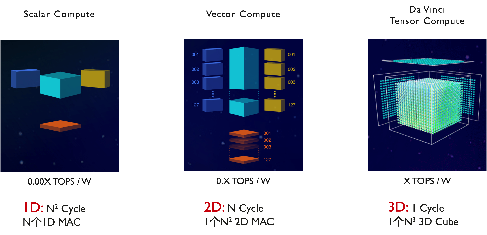
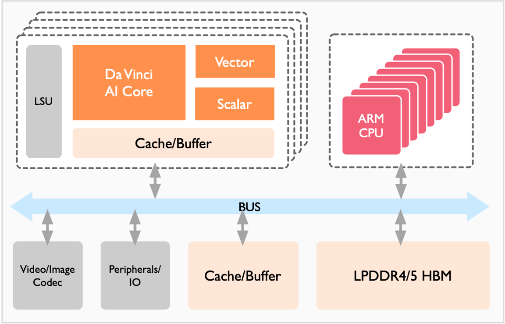
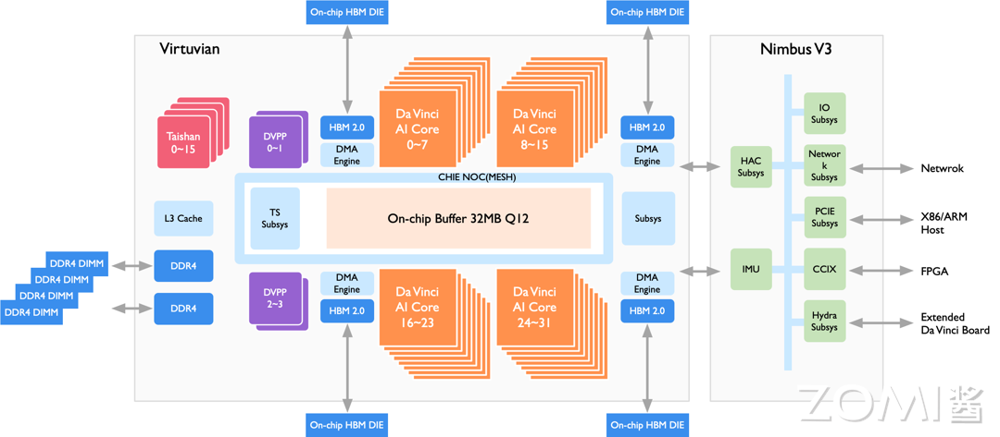
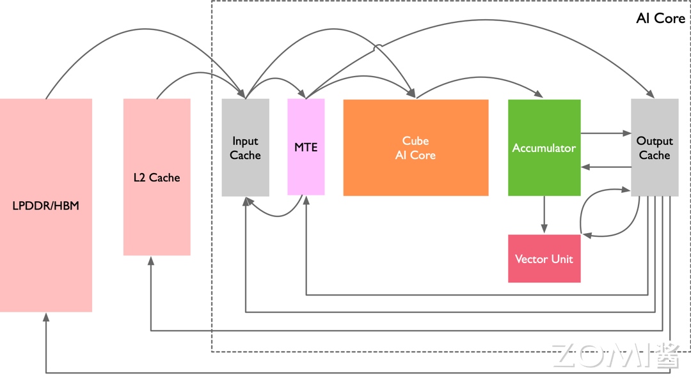

<!--Copyright © 适用于[License](https://github.com/chenzomi12/AISystem)版权许可-->

# 昇腾 AI 处理器

本节将会介绍华为昇腾 AI 处理器的架构与卷积加速原理。昇腾 AI 处理器是华为基于达芬奇架构专为AI计算加速而设计的处理器，它支持云边端一体化的全栈全场景解决方案，具有高能效比和强大的 3D Cube 矩阵计算单元，支持多种计算模式和混合精度计算。

昇腾 AI 处理器的架构包括了 AI Core、AI CPU、多层级片上缓存/缓冲区和数字视觉预处理模块 DVPP，这些组件通过 CHI 协议的环形总线实现数据共享和一致性而组成的 SoC。此外，本节还将探讨卷积加速原理，即昇腾 AI 处理器如何通过软硬件优化实现高效的卷积计算加速，包括矩阵计算单元和数据缓冲区的高效组合以及灵活的数据通路设计，以满足不同神经网络的计算要求。

## 昇腾 AI 处理器

华为公司针对 AI 领域专用计算量身打造了“达芬奇架构”，并于 2018 年推出了基于“达芬奇架构”的昇腾 AI 处理器，开启了华为的 AI 之旅。

从基础研究出发，立足于自然语言处理、机器视觉、自动驾驶等领域，昇腾 AI 处理器致力于打造面向云边端一体化的全栈全场景解决方案，同时为了配合其应用目标，打造了异构计算架构 CANN（Computer Architecture for Nerual Network），为昇腾 AI 处理器进行加速计算。全栈指技术方面，包括 IP、芯片、加速计算、AI 框架、应用使能等的全栈式设计方案。全场景包括公有云、私有云、各种边缘计算、物联网行业终端及消费者终端设备。围绕全栈全场景，华为正以昇腾 AI 处理器为核心，以算力为驱动，以工具为抓手，全力突破 AI 发展的极限。

自 2018 年伊始，如图所示昇腾 AI 处理器的训练和推理系列型号陆续推出。推理系列的处理器则是面向移动计算场景的强算力 AI 片上系统（SoC，System on Chip）。训练系列的处理器主要应用于云端，可以为深度学习的训练算法提供强大算力。

在设计上，昇腾 AI 处理器意图突破目前 AI 芯片功耗、运算性能和效率的约束，目的是极大提升能效比。昇腾 AI 处理器采用了华为自研的达芬奇架构，专门针对神经网络运算特征而量身定做，以高性能的 3D Cube 矩阵计算单元为基础，实现针对张量计算的算力和能效比大幅度提升。每个矩阵计算单元可以由一条指令完成 4096 次乘加计算（如图所示），并且处理器内部还支持多维计算模式，如标量、矢量、矩阵等，打破了其它 AI 专用芯片的局现象，增加了计算的灵活度。同时支持多种类混合精度计算，在实现推理应用的同时也强力支持了训练的数据精度要求。

达芬奇架构的统一性体现在多个应用场景的良好适配上，覆盖高、中、低全场景，一次开发可支持多场景部署、迁移和协同。从架构上提升了软件效率。功耗优势也是该架构的一个显著特点，统一的架构可以支持从几十毫瓦到几百瓦的芯片，可以进行多核灵活扩展，在不同应用场景下发挥出芯片的能耗优势。

达芬奇架构指令集采用了 CISC 指令且具有高度灵活性，可以应对日新月异、变化多端的新算法和新模型。高效的运算密集型 CISC 指令含有特殊专用指令，专门为神经网络打造，助力 AI 领域新模型的研发，同时帮助开发者更快速的实现新业务的部署，实现在线升级，促进行业发展。昇腾 AI 处理器在全业务流程加速方面，采用场景化视角，系统性设计，内置多种硬件加速器。昇腾 AI 处理器拥有丰富的 IO 接口，支持灵活可扩展和多种形态下的加速卡设计组合，很好应对云端、终端的算力和能效挑战，可以为各场景的应用强劲赋能。

## AI 处理器架构

昇腾 AI 处理器本质上是一个片上系统（System on Chip，SoC），主要可以应用在和图像、视频、语音、文字处理相关的应用场景。上图是早期昇腾其处理器的逻辑架构，其主要的架构组成部件包括特制的计算单元、大容量的存储单元和相应的控制单元。无论是训练还是推理的芯片以及上层的硬件型号，基于基于 DaVinci AI 技术架构如图所示。

该处理器大致可以划为：芯片系统控制 CPU（Control CPU），AI 计算引擎（包括 AI Core 和 AI CPU），多层级的片上系统缓存（Cache）或缓冲区（Buffer），数字视觉预处理模块（Digital Vision Pre-Processing，DVPP）等。芯片可以采用 LPDDR4 高速主存控制器接口，价格较低。目前主流 SoC 芯片的主存一般由 DDR（Double Data Rate）或 HBM（High Bandwidth Memory）构成，用来存放大量的数据。HBM 相对于 DDR 存储带宽较高，是行业的发展方向。其它通用的外设接口模块包括 USB、磁盘、网卡、GPIO、I2C 和电源管理接口等。

当该处理器作为计算服务器的加速卡使用时，会通过 PCIe 总线接口和服务器其它单元实现数据互换。以上所有这些模块通过基于 CHI 协议的片上环形总线相连，实现模块间的数据连接通路并保证数据的共享和一致性。

昇腾 AI 处理器集成了多个 ARM 架构的 CPU 核心，每个核心都有独立的 L1 和 L2 缓存，所有核心共享一个片上 L3 缓存。集成的 CPU 核心按照功能可以划分为专用于控制芯片整体运行的主控 CPU 和专用于承担非矩阵类复杂计算的 AI CPU。两类任务占用的 CPU 核数可由软件根据系统实际运行情况动态分配。

除了 CPU 之外，该处理器真正的算力担当是采用了达芬奇架构的 AI Core。AI Core 通过特别设计的架构和电路实现了高通量、大算力和低功耗，特别适合处理深度学习中神经网络必须的常用计算如矩阵相乘等。目前该处理器能对整数或浮点数提供强大的乘加计算力。由于采用了模块化的设计，可以很方便的通过叠加模块的方法提高处理器的算力。

针对神经网络参数量大、中间值多的特点，该处理器还特意为 AI 计算引擎配备了一定容量的片上缓冲区（On-Chip Buffer），提供高带宽、低延迟、高效率的数据交换和访问。能够快速访问到所需的数据对于提高神经网络算法的整体性能至关重要，同时将大量需要复用的中间数据缓存在片上对于降低系统整体功耗意义重大。为了能够实现计算任务在 AI Core 上的高效分配和调度，还特意配备了一个专用 CPU 作为任务调度器（Task Scheduler，TS）。该 CPU 专门服务于 AI Core 和 AI CPU，而不承担任何其他的事务和工作。

数字视觉预处理模块（DVPP）主要完成图像视频的编解码，视频处理，对图像支持 JPEG 和 PNG 等格式的处理。来自主机端存储器或网络的视频和图像数据，在进入昇腾 AI 处理器的计算引擎处理之前，需要生成满足处理要求的输入格式、分辨率等，因此需要调用数字视觉预处理模块进行预处理以实现格式和精度转换等要求。数字视觉预处理模块主要实现视频解码（Video Decoder，VDEC），视频编码（Video Encoder，VENC），JPEG 编解码（JPEG Decoder/Encoder，JPEGD/E），PNG 解码（PNG Decoder，PNGD）和视觉预处理（Vision Pre-Processing Core，VPC）等功能。图像预处理可以完成对输入图像的上/下采样、裁剪、色调转换等多种功能。数字视觉预处理模块采用了专用定制电路的方式来实现高效率的图像处理功能，对应于每一种不同的功能都会设计一个相应的硬件电路模块来完成计算工作。在数字视觉预处理模块收到图像视频处理任务后，会读取需要处理的图像视频数据并分发到内部对应的处理模块进行处理，待处理完成后将数据写回到内存中等待后续步骤。

### 昇腾 910

昇腾 910 处理器的目标场景是云端的推理和训练，其架构如图所示，包含 Davinci Core、DVPP、HBM、DDR4 等组件。

昇腾 910 处理器采用了芯粒（chiplet）技术，包含六个 die: 1 个计算芯粒（包含 32 个 Davinci Core、16 个 CPU Core 和 4 个 DVDP），1 个 IO 芯粒，和 4 个 HBM 芯粒（总计 1.2 TB/s 带宽）。针对云端训练和推理场景，昇腾 910 处理器做的优化包括:

1. 高算力: 训练场景通常使用的 Batch Size 较大，因此采用最高规格的 Ascend-Max，每个 Core 每个周期可以完成 $16\times16\times16=4096$ 次 FP16 乘累加。

2. 高 Load/Store 带宽: 训练场景下计算反向 SGD 时，会有大量对 Last Level Cache 和片外缓存的访问，因此需要配备较高的 Load/Store 带宽，因此昇腾 910 除了 DDR 还采用了 HBM 技术。

3. 100G NIC: 随着 DNN 的模型尺寸愈发庞大，单机单卡甚至单机多卡已经不能满足云端训练的需求，为了支持多卡多机组成集群，昇腾 910 集成了支持 ROCE V2 协议的 100G NIC 用于跨服务器传递数据，使得可以使用昇腾 910 组成万卡集群。

4. 高吞吐率的数字视觉与处理器（DVPP）: DVPP 用于 JPEG、PNG 格式图像编解码、图像预处理(对输入图像上下采样、裁剪、色调转换等)、视频编解码，为了适配云端推理场景，DVPP 最高支持 128 路 1080P 视频解码。

### 昇腾 310

昇腾 310 处理器的目标场景是边缘推理，比如智慧城市、智慧新零售、机器人、工业制造等，其架构如上图所示，主要包含 Davinci Core、DVPP、LPDDR4 等组件。

相比昇腾 910，昇腾 310 的定制化 IP 相对较少，但是提供了更多外设接口。由于在边缘推理场景下 batch size 通常只有 1，因此昇腾 310 选择了较小的矩阵计算维度（m = 4, n = 16, k = 16）以实现 $C_{mn} = A_{mk}\times B_{kn}$。由于在矩阵运算中 $M = \text{batch\_size} \times \text{output\_hight} \times \text{output\_width}$, 当 batch size = 1 时，将 m 设置成 4 可以提升乘累加利用率。

## 计算加速原理

在神经网络中，卷积计算一直扮演着至关重要的角色。在一个多层的卷积神经网络中，卷积计算的计算量往往是决定性的，将直接影响到系统运行的实际性能。昇腾 AI 处理器作为 AI 加速器自然也不会忽略这一点，并且从软硬件架构上都对卷积计算进行了深度的优化。

### 卷积/矩阵计算

下图展示的是一个典型的卷积层计算过程，其中 **X** 为输入特征矩阵，**W** 为权重矩阵；**b** 为偏置值；$\textbf{Y}_\textbf{o}$ 为中间输出；**Y** 为输出特征矩阵，GEMM 表示通用矩阵乘法。输入特征矩阵 **X** 和 **W** 先经过 Img2Col 展开处理后得到重构矩阵 XI2C 和 WI2C 通过矩阵 XI2C 和矩阵 WI2C 进行矩阵相乘运算后得到中间输出矩阵 $\textbf{Y}_\textbf{o}$；接着累加偏置 **b**，得到最终输出特征矩阵 **Y**，这就完成了一个卷积神经网络中的卷积层处理。

### 计算数据通路

利用 AI Core 来加速通用卷积计算，总线接口从核外 L2 缓冲区或者直接从内存中读取卷积程序编译后的指令，送入指令缓存中，完成指令预取等操作，等待标量指令处理队列进行译码。如果标量指令处理队列当前无正在执行的指令，就会即刻读入指令缓存中的指令，并进行地址和参数配置，之后再由指令发射模块按照指令类型分别送入相应的指令队列进行执行。在卷积计算中首先发射的指令是数据搬运指令，该指令会被发送到存储转换队列中，再最终转发到存储转换单元中。

卷积整个数据流如上图所示，如果所有数据都在 DDR 或 HBM 中，存储转换单元收到读取数据指令后，会将矩阵 ***X*** 和 ***W*** 由总线接口单元从核外存储器中由数据通路 1 读取到输入缓冲区中，并且经过数据通路 3 进入存储转换单元，由存储转换单元对 ***X*** 和 ***W*** 进行补零和 Img2Col 重组后得到 ***X***I2C 和 ***W***I2C 两个重构矩阵，从而完成卷积计算到矩阵计算的格式变换。

在格式转换的过程中，存储转换队列可以发送下一个指令给存储转换单元，通知存储转换单元在矩阵转换结束后将 ***X***I2C 和 ***W***I2C 经过数据通路 5 送入矩阵计算单元中等待计算。

根据数据的局部性特性，在卷积过程中如果权重 ***W***I2C 需要重复多次计算，可以将权重经过数据通路 17 固定在输入缓冲区中，在每次需要用到该组权重时再经过数据通路 18 传递到矩阵计算单元中。

在格式转换过程中，存储转换单元还会同时将偏置数据从核外存储经由数据通路 4 读入到输出缓冲区中，经过数据通路 6 由存储转换单元将偏置数据从原始的向量格式重组成矩阵后，经过数据通路 7 转存入输出缓冲区中，再经过数据通路 9 存入累加器中的寄存器中，以便后续利用累加器进行偏置值累加。

当左、右矩阵数据都准备好了以后，矩阵运算队列会将矩阵相乘指令通过数据通路 5 发送给矩阵计算单元。***X***I2C 和 ***W***I2C 矩阵会被分块组合成 $16\times16$ 的矩阵，由矩阵计算单元进行矩阵乘法运算。如果输入矩阵较大则可能会重复以上步骤多次并累加得到 $\textbf{Y}_\textbf{o}$ 中间结果矩阵，存放于矩阵计算单元中。

矩阵相乘完成后如果还需要处理偏置值，累加器会收到偏置累加指令，并从输出缓冲区中通过数据通路 9 读入偏置值，同时经过数据通路 8 读入矩阵计算单元中的中间结果 $\textbf{Y}_\textbf{o}$ 并累加，最终得到输出特征矩阵 ***Y***，经过数据通路 10 被转移到输出缓冲区中等待后续指令进行处理。

AI Core 通过矩阵相乘完成了网络的卷积计算，之后向量执行单元会收到池化和激活指令，输出特征矩阵 ***Y*** 就会经过数据通路 12 进入向量计算单元进行池化和激活处理，得到的结果 ***Y*** 会经过数据通路 13 存入输出缓冲区中。向量计算单元能够处理激活函数等一些常见的特殊计算，并且可以高效实现降维的操作，特别适合做池化计算。在执行多层神经网络计算时，***Y*** 会被再次从输出缓冲区经过数据通路 14 转存到输入缓冲区中，作为输入重新开始下一层网络的计算。

达芬奇架构针对通用卷积的计算特征和数据流规律，采用功能高度定制化的设计，将存储、计算和控制单元进行有效的结合，在每个模块完成独立功能的同时实现了整体的优化设计。AI Core 高效组合了矩阵计算单元与数据缓冲区，缩短了存储到计算的数据传输路径，降低延时。

同时 AI Core 在片上集成了大容量的输入缓冲区和输出缓冲区，一次可以读取并缓存充足的数据，减少了对核外存储系统的访问频次，提升了数据搬移的效率。同时各类缓冲区相对于核外存储系统具有较高的访问速度，大量片上缓冲区的使用也极大提升了计算中实际可获得的数据带宽。

同时针对神经网络的结构多样性，AI Core 采用了灵活的数据通路，使得数据在片上缓冲区、核外存储系统、存储转换单元以及计算单元之间可以快速流动和切换，从而满足不同结构的神经网络的计算要求，使得 AI Core 对各种类型的计算具有一定的通用性。

## 小结与思考

- 昇腾 AI 处理器的创新：华为推出的昇腾 AI 处理器基于达芬奇架构，专为 AI 领域设计，提供云边端一体化的全栈全场景解决方案，以高能效比和强大的 3D Cube 矩阵计算单元为特点，支持多种计算模式和混合精度计算。

- 昇腾 AI 处理器架构：昇腾 AI 处理器是一个 SoC，集成了特制的计算单元、存储单元和控制单元，包括 AI Core、AI CPU、多层级片上缓存/缓冲区和数字视觉预处理模块 DVPP，通过 CHI 协议的环形总线实现模块间的数据共享和一致性。

- 卷积加速原理：昇腾 AI 处理器针对卷积计算进行软硬件优化，利用 AI Core 的矩阵计算单元和数据缓冲区，缩短数据传输路径，降低延时，并通过灵活的数据通路满足不同神经网络的计算要求，实现高效能的卷积计算加速。