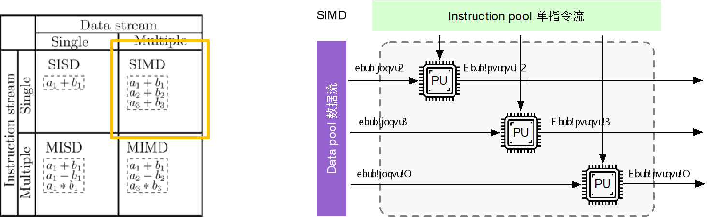

# 芯片的编程体系

本章主要探讨 SIMD 和 SIMT 的主要区别与联系，SIMT 与 CUDA 编程之间的关系，并且会讨论 GPU 在 SIMT 编程本质，SIMD、SIMT 与 DSA 架构，DSA 架构的主要形态。目前已经有大量的 AI 芯片研发上市，但是如何开发基于硬件的编译栈与编程体系，让开发者更好地使用 AI 芯片，更好的发挥 AI 芯片的算力，让生态更加繁荣，因此理解 AI 芯片的编程体系就显得尤为重要。

AI 芯片主要是为实现并行计算，从程序并行的角度出发，主要可以分为指令级并行、数据级并行和任务级并行：

- 指令级并行（Instruction Level Parallelism，ILP）：在同一时间内执行多条指令，这些指令可能是不同的程序段或者同一程序段的不同部分。这种并行性是通过流水线技术实现的，即在处理器中同时执行多个指令的不同阶段，从而提高处理器的效率。

- 数据级并行（Data Level Parallelism，DLP）：在同一时间内处理多个数据元素，这些数据元素可能是独立的或者相关的。数据级并行通常通过向量处理器或者并行处理器来实现，可以同时对多个数据元素进行相同的操作，从而提高数据处理的效率。

- 任务级并行（Task Level Parallelism）：将一个任务分解成多个子任务，然后同时执行这些子任务，可以通过多线程或者分布式计算来实现。

## 基于并行处理的硬件架构

按照数据与指令之间的关系，关于并行处理的硬件架构主要有以下四种：

1.  单指令流单数据流（Single Instruction Single Data，SISD）系统：这种系统中只有一个处理器执行单个指令流，处理单个数据流。这是传统的单处理器系统，适用于串行计算任务。

2.  单指令流多数据流（Single Instruction Multiple Data，SIMD）系统：这种系统中有多个处理器同时执行相同的指令流，但处理不同的数据流。每个处理器执行相同的操作，但是操作的数据不同。这种系统适用于向量处理器或者 GPU 等并行处理器架构。

3.  多指令流单数据流（Multiple Instruction Single Data，MISD）系统：这种系统中有多个处理器执行不同的指令流，但处理相同的数据流。每个处理器执行不同的操作，但是操作的数据相同。MISD 系统在实际应用中较为罕见。

4.  多指令流多数据流（Multiple Instruction Multiple Data，MIMD）系统：这种系统中有多个处理器执行不同的指令流，处理不同的数据流。每个处理器可以独立执行不同的任务，适用于多核处理器、分布式系统或者并行计算集群等场景。 

SISD 系统中每个指令部件每次仅译码一条指令，而且在执行时仅为操作部件提供一份数据，此时支持串行计算，硬件并不支持并行计算，在时钟周期内 CPU 只能处理一个数据流。

目前 CPU 和 GPU 主要用到的并行计算架构是 SIMD，处理器硬件中添加了多个 PU（Process Unit）单元，此时一个控制器控制多个处理器，同时对一组数据中每一个数据分别执行相同的操作，实现并行计算，SIMD 主要执行向量、矩阵等数组运算，处理单元数目固定，适用于科学计算，特点是处理单元数量很多，但是处理单元速度会受到计算机通信带宽数据传输速率的限制。

NVIDIA GPU 架构围绕可扩展的多线程流式多处理器 (Streaming Multiprocessors，SM) 阵列构建，当主机 CPU 上的 CUDA 程序调用内核网格时，网格的块被枚举并分发到具有可用执行能力的多处理器。一个线程块的线程在一个 SM 上并发执行，多个线程块可以在一个 SM 上并发执行，当线程块终止时，新块在空出的 SM 上启动，SM 使 GPU 同时执行数百个线程。

为了管理如此大量的线程，NVIDIA GPU 实际上采用了 SIMT（Single-Instruction, Multiple-Thread: 单指令，多线程）架构，SIMT 体系结构类似于 SIMD，但是 SIMT 使程序员能够为独立的标量线程编写线程级并行代码，以及为协调线程编写数据并行代码。

## AI 编程中 SIMT/SIMD 的重要性

在神经网络中，单个神经元展开，其中最核心的部件会有一个矩阵乘计算$(X·W)$，无论 FFN 还是 CNN，或者大模型中的 Transformer，ALSTN 都与神经网络息息相关。

-  FFN (Feedforward Neural Network)：是一种最简单的神经网络结构，由多个全连接层组成，每一层的神经元与下一层的神经元全连接。FFN 主要用于在神经网络中进行特征提取和非线性变换。

-  CNN (Convolutional Neural Network)：卷积神经网络是一种专门用于处理图像和视频等二维数据的神经网络结构。它通过卷积层、池化层和全连接层等组件来提取图像特征，并在图像分类、目标检测等任务中取得了很好的效果。

-  Transformer：Transformer 是一种基于自注意力机制的神经网络模型，广泛应用于自然语言处理领域。Transformer 取代了传统的循环神经网络（RNN）和长短时记忆网络（LSTM），在机器翻译、文本生成等任务中取得了很好的效果。

-  ALSTN (Attention-based Long Short-Term Neural Network)：是一种结合了注意力机制和长短时记忆网络（LSTM）的神经网络模型。ALSTN 在序列建模、语音识别等领域中具有很好的应用前景，能够更好地捕捉序列数据之间的长期依赖关系。

在神经网络中，训练（Training）和推理（Inference）是两个重要的阶段：

1.  训练（Training）：在训练阶段，神经网络通过输入数据和对应的标签（ground truth）来学习模式和特征，以调整网络中的参数（如权重和偏置）以最小化损失函数。训练的目标是使神经网络能够准确地预测输出结果。训练过程通常包括前向传播（forward propagation）计算输出，反向传播（backpropagation）计算梯度，并使用优化算法（如梯度下降）更新参数。

2.  推理（Inference）：在推理阶段，经过训练的神经网络被用于对新的未见数据进行预测或分类。在推理阶段，神经网络的参数保持不变，不再进行参数调整。推理阶段的目标是利用训练好的神经网络模型对输入数据进行预测，并生成输出结果。推理阶段通常只包括前向传播计算，不涉及反向传播或参数更新。 

在这两个过程中都需要执行大量的矩阵乘计算，在训练过程中，矩阵乘法通常用于计算前向传播（输入数据与权重矩阵相乘，生成输出结果）和反向传播中的梯度传播（梯度与权重矩阵的转置相乘，计算参数的梯度）。在推理过程中，矩阵乘法用于计算输入数据与训练好的权重矩阵之间的乘积，从而生成预测结果。

在 AI 框架的开发流程中，首先由算法工程师定义神经网络，然后使用 AI 开发框架编写对应的程序，然后程序构建正向图，然后 AI 框架会根据自动微分原理构建反向的计算图，把所有的图转变成一个算子的执行序列，算子的执行会在硬件的 Kernel 中进行。

在 AI 模型和框架的基础上实现了 AI 计算，为了实现神经网络中大量的矩阵乘计算，SIMD、SIMT 是如何做到的，这是 AI 系统需要关心和解决的问题吗？SIMD 是否只对底层硬件设计有约束？为了解决上面两个问题，提出硬件执行模型和编程模型两个概念。

## 硬件执行模型和编程模型

AI 框架中的算子、硬件提供的 Kernel 实现，需要根据硬件执行模型（Execution Model）来确定编程模型（Programming Model）。程序员只关心编程模型，如何编写算子并执行在 Kernel 上，而硬件关心的是指令执行的模型。根据计算机系统设计里面的定义，AI 系统采用并行计算处理硬件架构主要以 SIMD 为主，但是编程模型却以生态强大的英伟达 CUDA 定义的 SIMT 方式为主。

SIMD、SIMT、DSA 之间有怎样的区别和联系，在 AI 体系结构中，SIMD 和 SIMT 的设计，对编程模型带来哪些挑战？在程序员编程时并没有直接控制指令，作为硬件并行处理架构，SIMD 不会暴露给开发者，那为什么 SIMT 会直接暴露接口给开发者？英伟达的 SIMT 到底是编程模式还是硬件模式？在 CUDA 开发过程中到底是控制硬件线程还是简单的编程？线程的硬件执行是什么方式？带着这些疑问，之后的章节将逐一解答这些问题。

## 总结

按照数据与指令之间的关系，可以分为 SISD（单指令流单数据流）、SIMD（单指令流多数据流）、MSID（多指令流单数据流）和 MIMD（多指令流多数据流），其中 SISD 是 CPU 常采用的计算架构，SIMD 是主要用到的并行计算架构，英伟达 GPU 基于 SIMD 实现了 SIMT（单指令，多线程），使程序员能够为独立的标量线程编写线程级并行代码。

AI 计算中训练和推理过程主要以神经网络为主，在这两个过程中需要执行大量的矩阵乘计算，因此 AI 计算的本质可以看作是矩阵乘，AI 框架中的算子、硬件提供的 Kernel 实现，需要根据硬件执行模型（Execution Model）来确定编程模型（Programming Model），编程模型以生态强大的英伟达 CUDA 定义的 SIMT 方式为主。

## 本节视频

<html>
<iframe src="https://player.bilibili.com/player.html?aid=829755871&bvid=BV13u4y197Lw&cid=1234342087&p=1&as_wide=1&high_quality=1&danmaku=0&t=30&autoplay=0" width="100%" height="500" scrolling="no" border="0" frameborder="no" framespacing="0" allowfullscreen="true"> </iframe>
</html>
