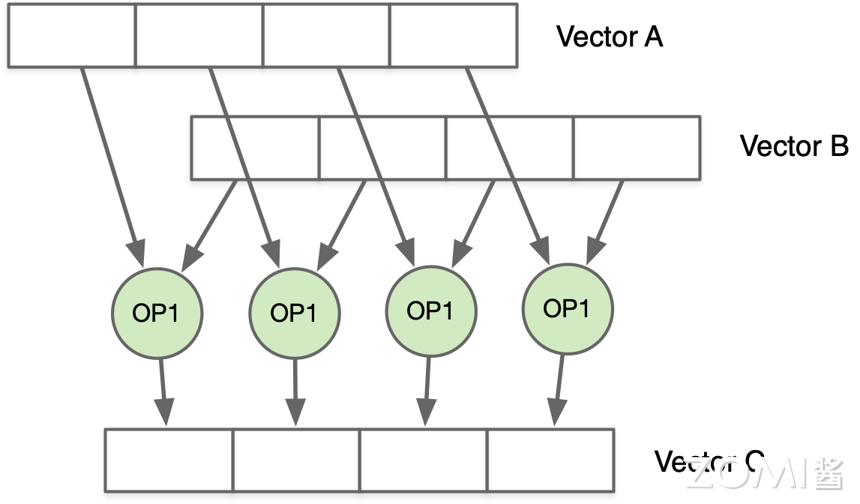
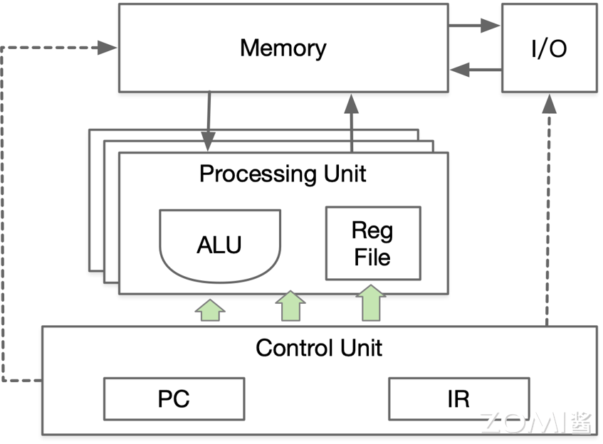
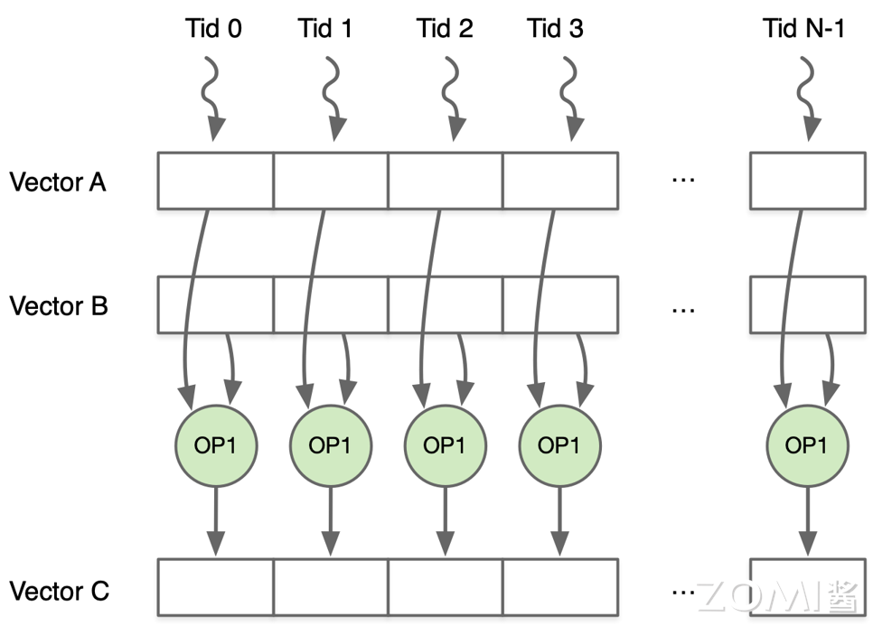
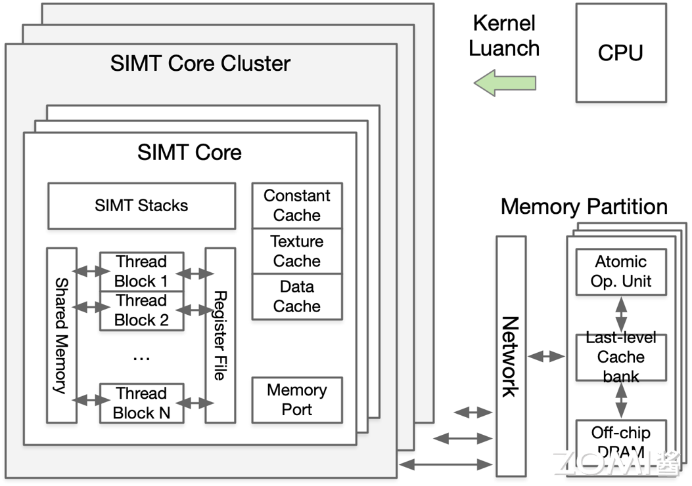
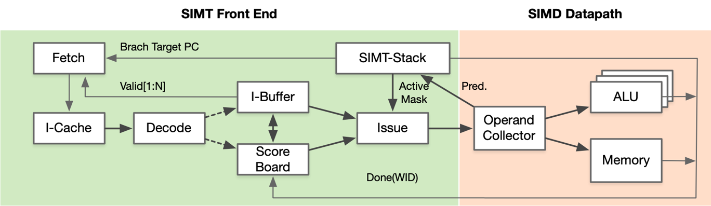
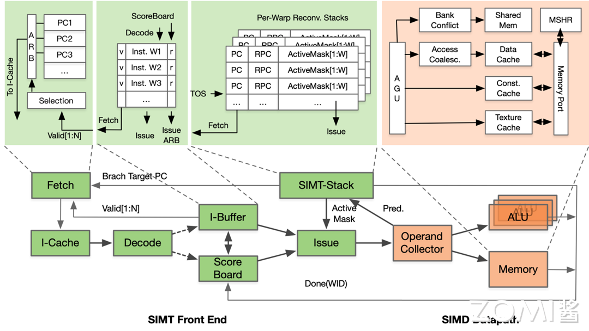
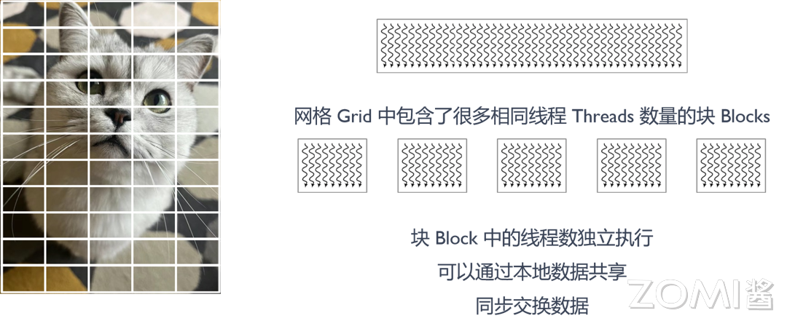
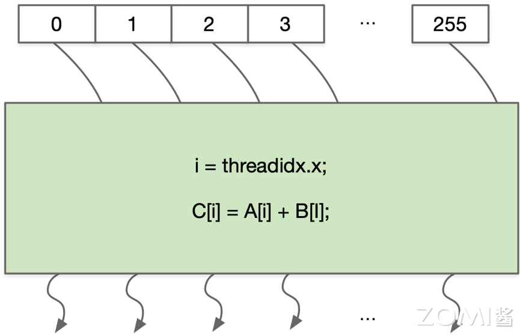
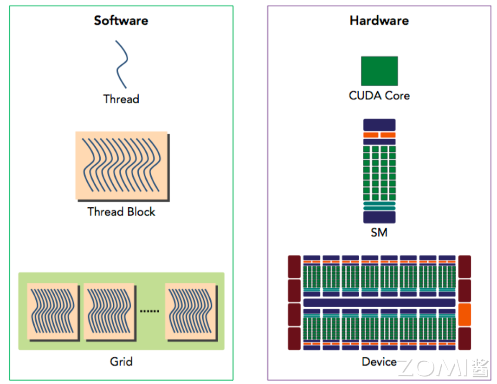

<!--Copyright 适用于[License](https://github.com/chenzomi12/AISystem)版权许可-->

# SIMD & SIMT 与芯片架构

为了进一步探讨 SIMD/SIMT 与 AI 芯片之间的关系，本节将详细介绍 SIMD 单指令多数据和 SIMT 单指令多线程的计算本质，以及对 NVIDIA CUDA 底层实现 SIMD/SIMT 的原理进行讲解。

## SIMD 计算本质

SIMD 是对多个进行同样操作的处理元素同时进行同等的计算操作，利用了数据级别的并行性，而不是并发性，有多个计算，但是只有一个进程在运行。SIMD 允许使用单一命令对多个数据值进行操作，一般用于提升 CPU 计算能力实现数据并行的方法，此时仅需要更宽位数的计算单元 ALU 和较小的控制逻辑。

SIMD 仍然是单线程，不是多线程操作，硬件上仅需要一个计算核心，只不过一次操作多个数据，需要与 GPU 的多线程并行有所区分，SIMD 的计算本质是在多个数据上并行进行相同操作的硬件部分。

例如将两个 vector 作为操作数，对于两个 vector 的操作数进行相同的乘法操作，下面以 vector 为 4 个元素为例，将向量 A 和向量 B 进行相乘计算得到结果 C。

$$C[0: 3] = A[0: 3] × B[0: 3]$$



为了使 SIMD 实现一次乘法可以完成多个元素的计算，要求硬件上增加 ALU 单元的数量，因此会有多个处理单元（Process Unit），同时也需要增加功能单元的数据通路数量，由控制单元（Control Unit）将数据传送给 Process Unit，从而实现在单一时钟周期内整体上提升硬件的计算吞吐量。



但是在实际计算的过程中，SIMD 有其优缺点：

- **缺点**：SIMD 使用独立线程，该线程能同时进行多个数据元素的计算，但是由于 ALU 宽度的限制，因此计算时要求数据类型、格式、大小必须严格对齐。

- **优点**：在一定程度上可以提升计算性能，利用内存数据总线带宽，多个数据可以同时从内存读和写。如 $C[0: 3] = A[0: 3] × B[0: 3]$ 操作在使用 SIMD 之后，代码量为原来的 1/4，执行周期也相应降为原来的 1/4。

以 $C[0: 3] = A[0: 3] × B[0: 3]$ 计算为例，以下是计算机在没有使用 SIMD 时实际执行的指令，可以看出总共有 4 个 ST，可以实现对四个元素进行逐元素相加或相乘。

```c
t1 = LD B, i
t2 = LD C, i
t3 = t1 + t2
ST A, i, t3

t1 = LD B, i+1
t2 = LD C, i+1
t3 = t1 + t2
ST A, i+1, t3

t1 = LD B, i+2
t2 = LD C, i+2
r3 = t1 + t2
ST A, i+2, t3

t1 = LD B, i+3
t2 = LD C, i+3
r3 = t1 + t2
ST A, i+3, t3
```

SIMD 本身是对指令的控制，在使用 SIMD 之后，只需要一个 ST，每个操作后面的 4 表示单个指令执行时同时对 4 个元素进行操作，编译器会将下面的代码编译成硬件能够识别的 SIMD 指令，代码为原来的 1/4，执行周期也相应地降为原来的 1/4，执行效率得到显著提升。

```c
v1 = LD B, i, 4
v2 = LD C, i, 4
v3 = v1 + v2, 4
ST A, i, 4, v3
```

Intel 从 MMX 开始支持 SIMD，ARM 通过 NEON 将 SIMD 扩展引入 ARM-Cortex 架构。NEON SIMD 单元位宽是 128-bit，包含 16 个 128-bit 寄存器，能够被用来当做 32 个 64-bit 寄存器。这些寄存器能被当做是同等数据类型的 vector，此时数据是对齐的，数据的元素格式也都是相同的。因此可以使用一个进程对多个数据进行计算，一个寄存器位宽是 128 bit，因此可以存放 4 个元素，每个元素是 32 bit，向量 B 存放在 s15 寄存器中，向量 A 存放在 s14 寄存器中，然后将两个寄存器中的值做乘法，最后保存 s15 的计算结果，相关代码如下：

```c
//对四个数据同时进行乘法操作
C[0:3] = A[0:3]*B[0:3]

//一个寄存器 128bit，可以存放 4x32bit，s15 寄存器存放向量 B
vldmia.32 r0!, {s15}

//通过 s14 寄存器存放向量 A
vldmia.32 r1!, {s14}

// s15 = s15*s14
vmul.f32 s15, s15, s14

//保存 s15 的计算结果
vstmia.32 r2!, {s15}
```

> MMX（MultiMedia eXtensions）是 Intel 于 1996 年推出的一种 SIMD 指令集扩展，用于对多个数据元素同时执行相同的操作。这些指令包括数据移动指令、整数运算指令、逻辑运算指令等，可以同时处理多个数据元素，从而加速多媒体处理、图像处理等应用的计算速度。随着技术的发展，Intel 后续推出了更多的 SIMD 指令集扩展，如 SSE（Streaming SIMD Extensions）、AVX（Advanced Vector Extensions）等，进一步提高了处理器对 SIMD 计算的支持和性能。
> 
> ARM NEON 技术在 2004 年推出的 SIMD 扩展技术，新的 SIMD 指令集包括数据加载/存储指令、整数运算指令、浮点运算指令等，可以同时对多个数据元素执行相同的操作。这些指令能够充分利用处理器的并行计算能力，提高计算效率和性能，为多媒体处理、图像处理等应用提供了更高的计算性能和效率。

因此 SIMD 最重要且最本质的是改变了硬件计算单元的数量，还有数据读取通路的数量，同时对上层提供更多的指令集，在实际编程中，程序员很少会对 SIMD 里面的指令直接进行操作。

## SIMT 计算本质

SIMT（Single Instruction Multiple Threads，单指令多线程）是英伟达提出基于 GPU 的新概念。与 SIMD 相比，二者都通过将同样的指令广播给多个执行单元来实现数据并行和计算。**主要的不同在于 SIMD 要求所有的向量元素在统一的同步组里（一个线程内）同步执行，而 SIMT 允许多个线程在一个 Warp 中独立执行**。

SIMT 类似 CPU 上的多线程，有多个计算核心系统，每一个核心中有独立的寄存器文件（Register File，RF）、计算单元（Arithmetic Logic Unit，ALU），但是没有独立指令缓存（Instruction Cache）、解码器、程序计数器（Program Counter register），命令从统一的指令缓存广播给多个 SIMT 核心。因此 SIMT 的所有核心各自独立，在不同的数据上执行相同的计算操作，即执行命令相同，多个线程各有各的处理单元，SIMD 则是共用同一个 ALU。

还是以之前的数组相乘 $C[0: 3] = A[0: 3] × B[0: 3]$ 为例，两个等长数组 Vector A 与 Vector B，需要每个元素逐一对应相乘后得到 Vector C。SIMT 给每个元素分配一个线程，一个线程只需要完成一个元素的乘法，所有线程并行执行完成后，两个数组的相乘就完成了。



具体到 SIMT 的硬件结构，SIMT 提供一个多核系统（SIMT Core Cluster），CPU 负责将算子（ Kernel）加载到 SIMT Core Cluster 中，每个 SIMT 核（SIMT Core）有独立的 RF（Register File）、ALU、Data Cache，但是只有一个指令计数寄存器（Program Counter）和一个指令译码寄存器，指令被同时广播给所有的 SIMT 核，从而执行具体的计算。GPU 则是由多个 SIMT Core Cluster 组成，每个 SIMT Core Cluster 由多个 SIMT Core 构成，SIMT Core 中有多个 Thread Block。



GPU 的 SIMT 可以看作是一个特殊的 SIMD 结构，SIMT 硬件核心流水可以被分为 SIMT 前端（SIMT front-end）和 SIMD 后端（SIMD back-end）。流水线中存在三个调度循环，分别是取指循环、指令发射循环和寄存器访问循环。

- 取指循环包含 Fetch、I-Cache、Decode 和 I-Buffer 四个阶段；

- 指令发射循环包含 I-Buffer、Score Board、Issue 和 SIMT-Stack 四个阶段；

- 寄存器访问循环包含 Operand Collector、ALU 和 Memory 三个阶段。



流水线中的三个调度循环共同组成 SIMT 硬件核心流水，其中取指是将具体的指令放在堆栈中，堆栈在运行时就会把所有的线程分发到具体的 ALU 中，在具体执行时采用 SIMD 的方式，SIMT 主要完成具体线程的前端控制。



结合上述内容，SIMD 和 SIMT 的主要区别和联系如下：

- SIMT 与 SIMD 的基本原理是相同的，都是采用单指令多数据的思想。

- SIMT 形式上是多线程，但是本质上在硬件端执行的还是单线程，使用多个核心来实现多线程并行。

- SIMT 比 SIMD 更灵活，允许一条指令对数据分开寻址，可以实现每个线程独立寻址。

- SIMD 必须连续取址，要求数据在类型、格式和大小方面是严格对齐的。

因此 SIMT 是 SIMD 的一种推广，在编程模式上更加灵活，对开发者更友好。

## NVIDIA CUDA 实现

回顾 GPU 的线程分级，在图形图像处理中会将图像进行切分，网格（Grid）表示要执行的任务，大的网格会被分成多个小的网格，每个网格中包含了很多相同线程（Threads）数量的块（Blocks），此时线程分层执行，块中的线程独立执行，对像素数据进行处理和计算，可以共享数据，同步数据交换。



CUDA 并行编程模型基于单程序多数据（Single Program Mutiple Data，SPMD）模式，关于 SPMD 与 SIMT 之间的联系和区别会在之后重点讲解。在 CUDA 编程中，grid 是线程块（block）的阵列集合，线程块映射到 SM 上进行计算处理。一个线程块可包含多个线程束，线程块的大小影响 CUDA kernel 程序的性能。在 CUDA 架构下，GPU 执行时的最小单位是线程（thread），一个 block 中的线程可存取同一块共享的内存，而且可以快速进行同步。

与 SIMD 不同的是，SIMT 允许程序员为独立、标量线程编写线程级的并行代码，还允许为协同线程编写数据并行代码。为了确保正确性，开发者可忽略 SIMT 行为，很少需要维护一个 warp 块内的线程分支，而是通过维护相关代码，即可获得硬件并行带来的显著的性能提升。在一个线程块（Thread Block）中所有线程执行同一段代码，在英伟达 GPU 中这段代码称为 kernel，每一个线程有一个自己的线程索引（threadIdx.x）用于计算内存地址和执行控制决策，每个线程在执行时被分配的唯一标识符，因此可以通过程序来准确控制每一个线程。



将多个线程块组合在一起就会组成一个 Grid 线程组，因此线程块就可以看作是 SM 的基本调度单元，SM 对应着具体的硬件单元，线程块则是编程所抽象出来的概念。因为有多个线程块进行组合，同时存在硬件计算单元在横向和纵向两个维度的排布，因此线程索引通常由块索引（Block Index）和线程内索引（Thread Index Within Block）组成。其中，块索引用于标识当前线程所在的块（Block），而线程内索引用于标识当前线程在所属块中的位置。

使用 `blockIdx.x` 和 `blockDim.x` 来访问块索引和块维度（Block Dimension）中的 x 分量。`blockIdx.x` 表示当前线程所在的块的 x 方向索引，在 CUDA 中，块索引是一个三维的向量，包括 x、y 和 z 三个分量。`blockDim.x` 表示当前块的 x 方向维度大小，在 CUDA 中，块维度也是一个三维的向量，包括 x、y 和 z 三个分量。通过 `blockIdx.x` 和 `blockDim.x`，可以方便地获取当前线程所在的块的 x 方向索引和当前块在 x 方向上的线程数量，从而进行相应的计算和操作。


回顾英伟达 GPU 软件和硬件之间的对应关系，线程对应于 CUDA Core，线程以线程块为单位被分配到 SM 上，SM 维护线程块和线程 ID，SM 管理和调度线程执行。每个线程块又按照每个 Warp 中共 32 个线程执行，Warp 是 SM 的调度单位，Warp 里的线程执行 SIMD。Block 线程块只在一个 SM 上通过 Wrap 进行调度，一旦在 SM 上调用了 Block 线程块，就会一直保留到执行完 Kernel。SM 可以同时保存多个 Block 线程块，块间并行的执行。



在 AI 框架的开发流程方面，首先会按照编程思想定义神经网络，然后根据 AI 框架编写对应的程序，AI 框架会自动构建计算正向图，根据自动微分原理构建反向图。其中在神经网络中比较重要的算子是矩阵乘，以 CUDA 代码为例实现 $C = A × B$，使用 `blockIdx.x` 和 `blockDim.x` 来访问块索引和块维度。

```c
#include <stdio.h>

#define N 4 // 矩阵大小

// 矩阵乘法的 CUDA 核函数
__global__ void matrixMultiplication(int *a, int *b, int *c) {
    // 使用 blockIdx.x 和 blockDim.x 来访问块索引和块维度
    int row = blockIdx.y * blockDim.y + threadIdx.y;
    int col = blockIdx.x * blockDim.x + threadIdx.x;

    int sum = 0;
    for (int k = 0; k < N; ++k) {
        sum += a[row * N + k] * b[k * N + col];
    }

    c[row * N + col] = sum;
}

int main() {
    int a[N][N], b[N][N], c[N][N];
    int *dev_a, *dev_b, *dev_c;

    // 分配内存
    cudaMalloc((void**)&dev_a, N * N * sizeof(int));
    cudaMalloc((void**)&dev_b, N * N * sizeof(int));
    cudaMalloc((void**)&dev_c, N * N * sizeof(int));

    // 初始化矩阵 a 和 b
    for (int i = 0; i < N; ++i) {
        for (int j = 0; j < N; ++j) {
            a[i][j] = i * N + j;
            b[i][j] = j * N + i;
        }
    }

    // 将矩阵 a 和 b 传输到设备
    cudaMemcpy(dev_a, a, N * N * sizeof(int), cudaMemcpyHostToDevice);
    cudaMemcpy(dev_b, b, N * N * sizeof(int), cudaMemcpyHostToDevice);

    // 定义块大小和网格大小
    dim3 blockSize(2, 2);
    dim3 gridSize(N / blockSize.x, N / blockSize.y);

    // 调用核函数
    matrixMultiplication<<<gridSize, blockSize>>>(dev_a, dev_b, dev_c);

    // 将结果传回主机
    cudaMemcpy(c, dev_c, N * N * sizeof(int), cudaMemcpyDeviceToHost);

    // 打印结果
    for (int i = 0; i < N; ++i) {
        for (int j = 0; j < N; ++j) {
            printf("%d ", c[i][j]);
        }
        printf("\n");
    }

    // 释放内存
    cudaFree(dev_a);
    cudaFree(dev_b);
    cudaFree(dev_c);

    return 0;
}
```

## 编程 vs 硬件执行本质

编程模型（Programming Model）是程序员用来编写程序的抽象概念，它定义了程序员如何组织和控制计算机程序的方式。编程模型提供了一种简化的视图，使程序员能够专注于程序的逻辑结构而不必考虑底层硬件细节。编程模型通常包括编程语言、数据结构、算法和并发机制等方面，用于描述程序的行为和交互。

硬件执行模型（Hardware Execution Model）描述了计算机硬件如何执行程序。它包括硬件结构、指令集架构、寄存器、内存层次结构、缓存、并行执行方式等方面。硬件执行模型决定了程序在计算机硬件上的实际执行方式，包括指令的执行顺序、数据的传输方式、并发执行的策略等，硬件执行 SIMD 和 SIMT。二者的区别和联系如下：

- 区别：编程模型是从程序员的角度来描述程序的组织和行为，而硬件执行模型是从计算机硬件的角度来描述程序的执行方式。编程模型关注程序的逻辑结构和抽象行为，而硬件执行模型关注程序在实际硬件上的执行细节。

- 联系：编程模型和硬件执行模型之间存在联系，编程模型定义了程序的行为和交互方式，而硬件执行模型决定了程序如何在计算机硬件上执行。程序员编写的程序最终会被映射到硬件执行模型上执行。理解编程模型和硬件执行模型之间的关系可以帮助程序员优化程序性能，并充分利用硬件资源。

编程模型最终会通过编译器转换为硬件执行模型，因此二者在概念层面有明显的差异。

## 小结与思考

- SIMD与SIMT均基于单指令多数据执行，但SIMD要求数据严格对齐且同步执行，而SIMT允许线程独立寻址且可异步执行，提高了灵活性。

- NVIDIA CUDA通过SIMT架构实现高效的并行计算，利用线程块和网格结构，通过CUDA核心进行调度，优化了GPU的性能。

- 编程模型与硬件执行模型相互关联，前者为程序员提供抽象概念以组织程序，后者描述程序在硬件上的实际执行方式，理解二者关系有助于程序性能优化。

## 本节视频

<html>
<iframe src="//player.bilibili.com/player.html?aid=744768610&bvid=BV1Kr4y1d7eW&cid=1236498445&p=1&as_wide=1&high_quality=1&danmaku=0&t=30&autoplay=0" width="100%" height="500" scrolling="no" border="0" frameborder="no" framespacing="0" allowfullscreen="true"> </iframe>
</html>