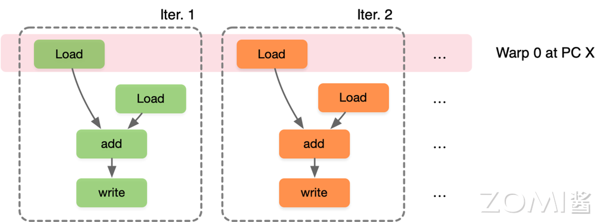
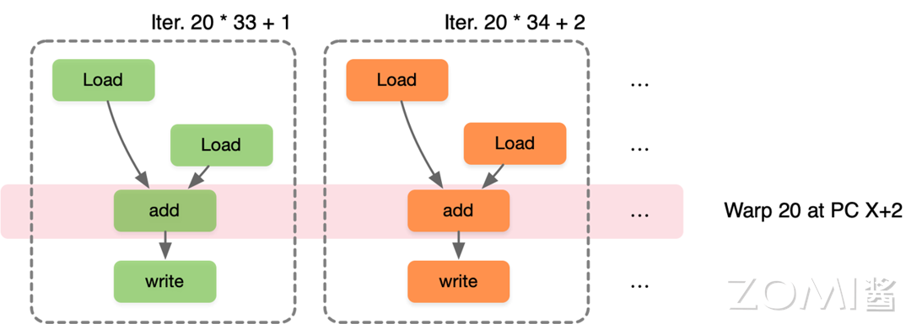
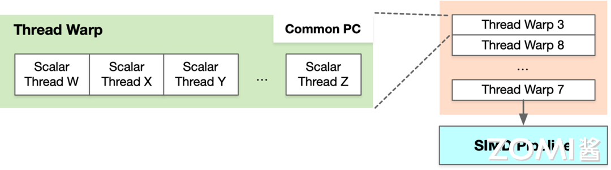
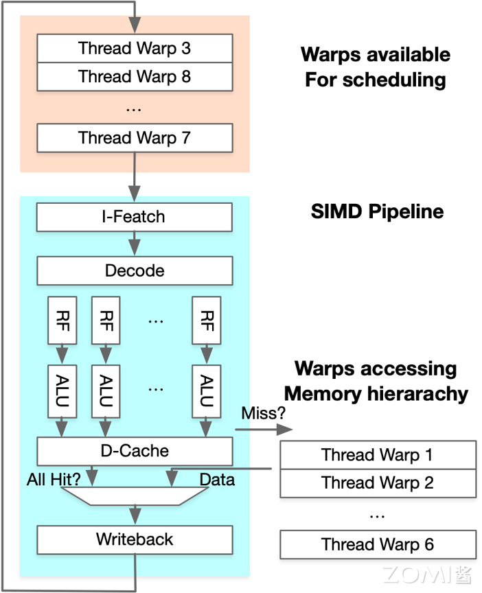
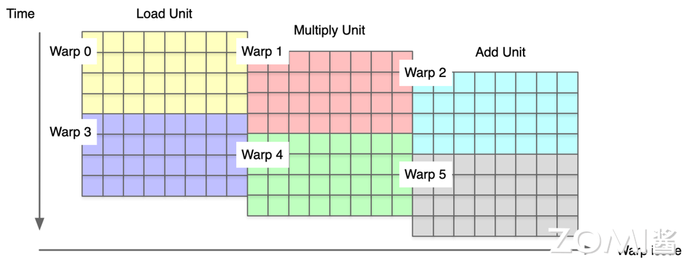
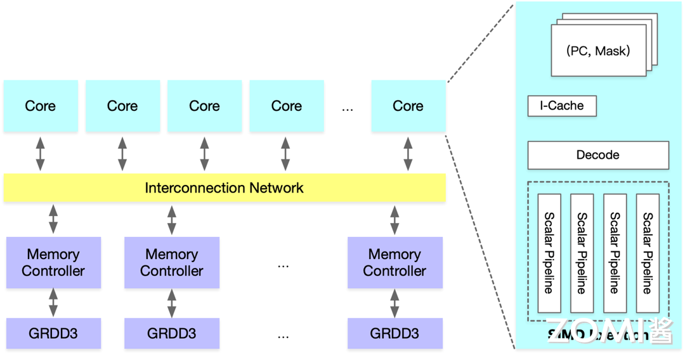
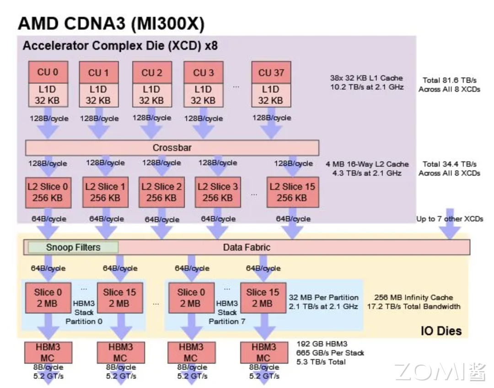
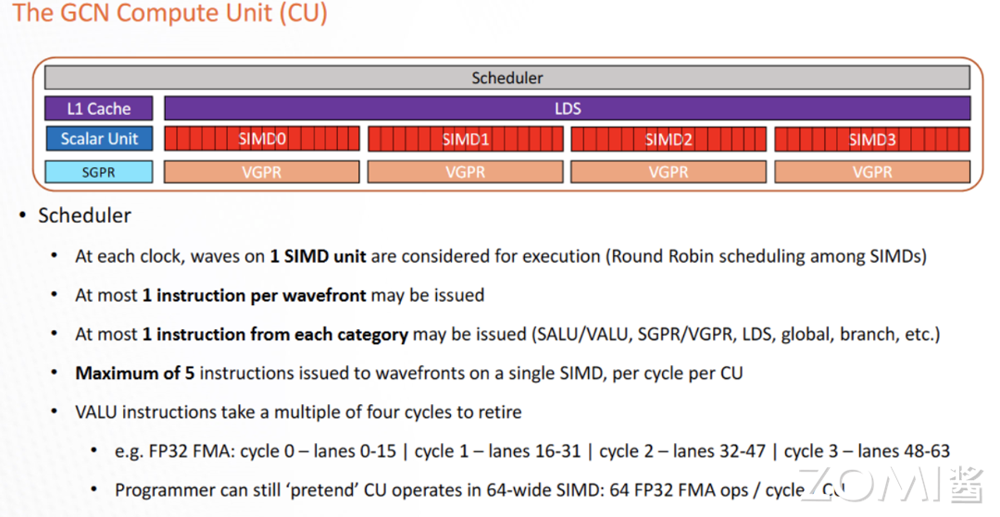
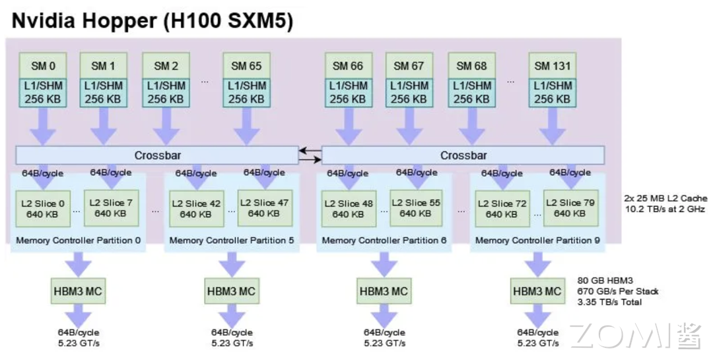

<!--Copyright 适用于[License](https://github.com/chenzomi12/AISystem)版权许可-->

# CUDA 编程模式(DONE)

前面的小节对 AI 芯片 SIMD 和 SIMT 计算本质进行了分析，结合英伟达 CUDA 实现对 SIMD 和 SIMT 进行了对比，本节将以英伟达 GPU 为例，讲解 GPU 的编程模型。

## GPU 编程模型 CUDA

英伟达公司于 2007 年发布了 CUDA，支持编程人员利用更为通用的方式对 GPU 进行编程，更好地发挥底层硬件强大的计算能力，以英伟达 GPU 为例对 GPU 的编程模型进行讲解。

### SIMD vs SIMT 执行模式

SIMD 是单顺序的指令流执行，每条指令多个数据输入并同时执行，大多数 AI 芯片采用的硬件架构体系，向量加法的 SIMD 执行指令如下：

```c
[VLD, VLD, VADD, VST], VLEN
```

SIMT 是标量指令的多个指令流，可以动态地把线程按 wrap 分组执行，向量加法的 SIMT 执行指令如下：

```c
[LD, LD, ADD, ST], NumThreads
```

英伟达 GPU 采用了 SIMT 的指令执行模式，给相关产品带来以下优势：

- 相比较 SIMD 无需开发者费时费力地把数据凑成合适的矢量长度，然后再传入硬件中；

- 从硬件设计上解决大部分 SIMD Data Path 的流水编排问题，对编译器和程序开发者在流水编排时更加友好；

- 线程可以独立执行，使得每个线程相对灵活，允许每个线程有不同的分支，这也是 SIMT 的核心；

- 一组执行相同指令的线程由硬件动态组织成线程组 warp，加快了 SIMD 的计算并行度。

假设一个 Warp 包含 32 个线程，如果需要进行 32000 次迭代，每个迭代执行一个线程，因此需要 1000 个 warp。第一个迭代 Warp0 执行第 0~32 个线程，第二个迭代 Warp1 执行第 33~64 个线程，第二十一个迭代 Warp20 执行第 20x33+1 ~ 20x33+32 个线程，可以看出 SIMT 是标量指令的多个指令流，可以动态地把线程按 Wrap 分组执行，使并行度增加。

第一个迭代 Warp0 执行第 0~32 个线程：



第二个迭代 Warp1 执行第 33~64 个线程：


以此类推，第二十一个迭代 Warp20 执行第 20x33+1 ~ 20x33+32 个线程：



由于程序并行执行最大的瓶颈是访存和控制流，因此 SIMD 架构中单线程 CPU 通过大量控制逻辑进行超前执行、缓存、预取等机制来强行缓解计算瓶颈。

### Warps 和 Warp-Level FGMT 关系

SIMT 架构 GPU 通过细粒度的多线程（Fine-Grained Multi-Threading，FGMT）调度，将处理器的执行流水线细分为更小的单元，使得不同线程的指令可以交错执行，从而减少指令执行的等待时间和资源浪费，以此来实现访存和计算并行。

Warp 是在不同地址数据下，执行相同指令的线程集合，所有线程执行相同的代码，可以看出 Thread Warp 中有很多个 Thread，多个 Warp 组成 SIMD Pipeline 执行对应的操作。



SIMT 架构通过细粒度多线程（FGMT）隐藏延迟，SIMD Pipeline 中每个线程一次执行一条指令，Warp 支持乱序执行以隐藏访存延迟，并不是通过顺序的方式调度执行，此外线程寄存器值都保留在 RF（Register File）中，并且 FGMT 允许长延迟。英伟达通过添加 Warp Schedluer 硬件调度，使 Warp 先访存完毕之后交给 SIMD Pipeline 去执行尽可能多的指令，隐藏其它 Warp 的访存时间。



SIMT 相比 SIMD 在可编程性上最根本性的优势在于硬件层面解决了大部分流水编排的问题，Warp 指令级并行中每个 warp 有 32 个线程和 8 条执行通道，每个时钟周期执行一次 Warp，一次 Warp 完成 24 次操作。



在 GPU 宏观架构层面，GDDR 里面的数据通过内存控制器（Memory Controller）传输到片内总线（Interconnection Network），然后分发到具体的核心（Cuda Core/Tensor Core），在每个执行核心中会有 SIMD 执行单元，从而实现并行计算。



## AMD 编程模型

AMD 的显卡也是有大量的计算单元和计算核心，为什么没有 SIMT 的编程模式？

2016 年 AMD 推出开放计算平台（Radeon Open Computing platform，ROCm），对全新 Radeon GPU 硬件的软件支持，全新数学库和基础雄厚的现代编程语言，旨在加速高性能，高能效异构计算系统开发。在相当大的程度上兼容 CUDA，目标是建立替代 CUDA 生态。

在 2020 年 CDNA 架构面世前，AMD 数据中心 GPU 一直使用的是 GCN 系列架构，搭载 GCN 系列架构的产品在 2012 年就已推出，虽然在游戏机等场景获得较高市场份额，但在数据中心市场并未取得显著成果，这与其性能表现有关。目前 AMD 将其 GPU 架构开发分为单独的 CDNA 和 RDNA 线路，分别专门用于计算和图形。

2023 年 AMD 发布 MI300X，将计算拆分到加速器复合芯片 (XCD) 上，每个 XCD 包含一组核心和一个共享缓存。具体来说，每个 XCD 物理上都有 40 个 CDNA 3 计算单元，其中 38 个在 MI300X 上的每个 XCD 上启用。XCD 上也有一个 4 MB 二级缓存，为芯片的所有 CU 提供服务。MI300X 有 8 个 XCD，总共有 304 个计算单元。以 CDNA 3 架构的 MI300X 可以将所有这些 CU 公开为单个 GPU。



每个 CU 有 4 个 SIMD 计算单元，每个周期 CU 调度程序会从 4 个 SIMD 中选择一个进行执行，并检查线程是否准备好执行。AMD MI300 支持 ROCm 6，支持 TF32 和 FP8 数据类型，Transformer Engine 和结构化稀疏性，AI/ML 框架等。



英伟达的 H100 由 132 个流式多处理器 （SM）组成，作为一个大型统一的 GPU 呈现给程序员。计算通过 CUDA 程序分发到具体的核心（Cuda Core/Tensor Core），每个执行核心有 SIMD 执行单元，从而实现并行计算。



## 小结与思考

- NVIDIA CUDA允许开发者以更通用的方式编程GPU，利用GPU的SIMT执行模式来提高计算性能和灵活性。

- SIMD适合向量化指令执行，而SIMT通过线程动态分组（Warp）执行相同指令，提高了并行度和硬件的灵活性。

- AMD通过ROCm平台支持类似CUDA的编程体验，而英伟达的Hopper架构通过大量流式多处理器（SM）和CUDA核心实现并行计算。

## 本节视频

<html>
<iframe src="http://player.bilibili.com/player.html?aid=282100205&bvid=BV16c41117vp&cid=1361312451&p=1&as_wide=1&high_quality=1&danmaku=0&t=30&autoplay=0" width="100%" height="500" scrolling="no" border="0" frameborder="no" framespacing="0" allowfullscreen="true"> </iframe>
</html>
