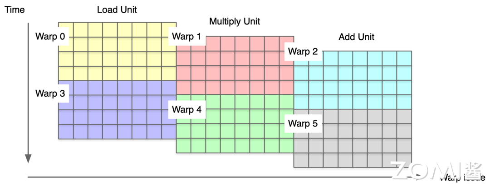
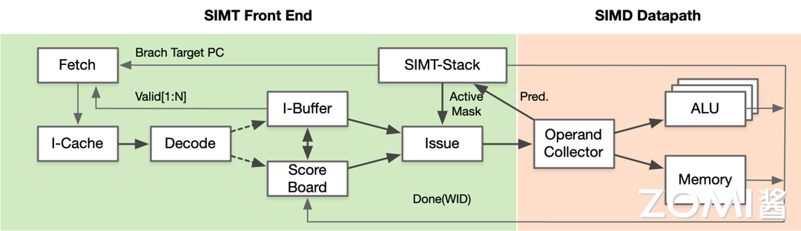
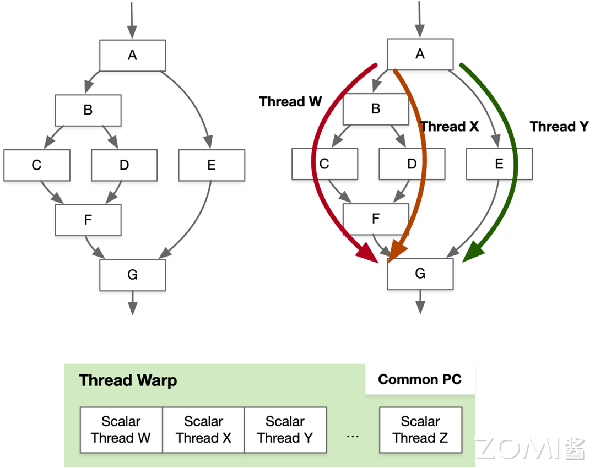
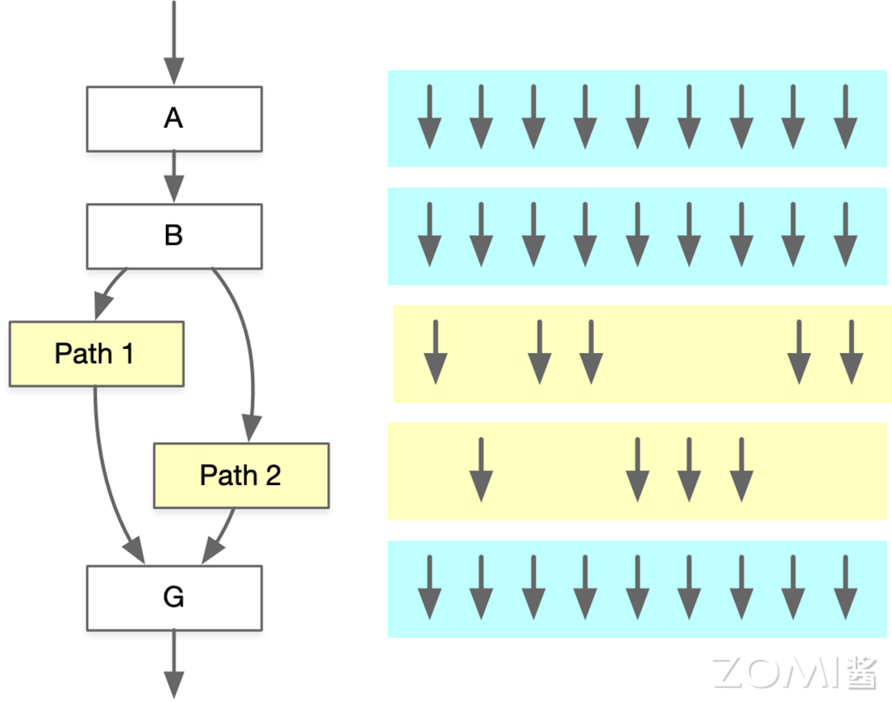
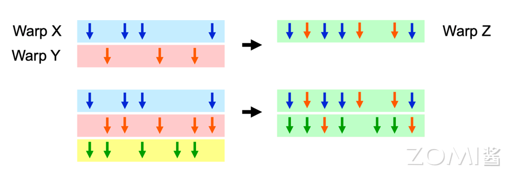
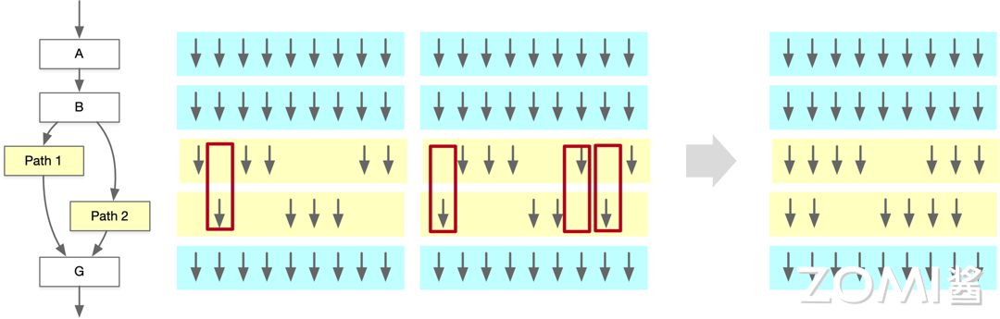
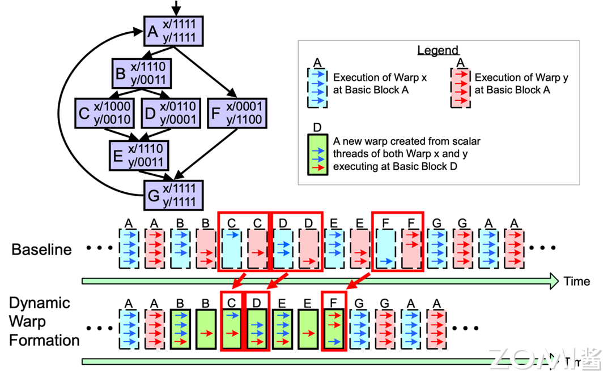

<!--Copyright 适用于[License](https://github.com/chenzomi12/AISystem)版权许可-->

# 从 CUDA 对 AI 芯片思考

从技术的角度重新看英伟达生态，有很多值得借鉴的方面。本节将主要从流水编排、SIMT 前端、分支预测和交互方式等方面进行分析，同时对比 DSA 架构，思考可以从英伟达 CUDA 中借鉴的要点。

## 英伟达生态的思考点

从软件和硬件架构的角度出发，CUDA 和 SIMT 之间存在一定的关系，而目前 AI 芯片采用的 DSA 架构在编程模型和硬件执行模型上还处于较为早期的状态，英伟达强大的生态同样离不开 CUDA 在编程方面的易用性。

面对新的 AI 芯片，在流水隐藏方面，实现架构层面的隐藏流水编排机制，提出一个形式上与 SPMD 没有关系的编程模式，而且易用性堪比 CUDA 的软件是可能的。但是反过来在核心问题上没有得到解决，提出形式上与 CUDA 类似的编程模型也仍然会有易用性的问题，开发者很难获得一个足够好的初始性能。

在软硬件架构方面，对于 DSA 架构而言，一方面需要建立一套开放的软硬件架构，联合其他 DSA 架构一起对抗 CUDA 生态；另一方面需要明确面向不同层级开发者的易用性和软件开发形态。

### SIMT 与 CUDA 的关系

英伟达为了维护 CUDA 生态对 SIMT 硬件架构做出了调整和取舍，因此 CUDA 会在一定程度上对英伟达硬件架构产生约束，例如保留 SM、Warp、Thread 等线程分层概念。CUDA 架构在近几年没有做出重大的改变，主要是维护编程体系软件对外的抽象和易用性。

DSA 之所以在硬件架构的指令和设计上比较激进，并非软件体系做得好，而是在刚开始并没有太多地考虑编程体系的问题，自然没有为了实现软硬件协同带来的架构约束。CUDA 的成功之处在于通过 SIMT 架构掩盖了流水编排、并行指令隐藏以及 CUDA 的易用性。

### DSA 硬件架构执行方式

DSA 硬件架构一般是指单核单线程，线程内指令可以通过多核共享 Cache 协作。编程模型上缺乏统一的标准，因此需要专门搭建编译器和编程体系，硬件主要以 AI 加速芯片（TPU、NPU 等）为主。

关于 DSA 的硬件执行方式，DSA 硬件目前的裸接口一般是每个核一个线程，每个线程内串行调 DSA 指令集，指令在硬件上通常会分发到不同的指令执行流水线上，正确性部分靠软件同步实现，部分靠硬件保证。

### CUDA 客户能力区分

按照使用 CUDA 的难易程度，可以将 CUDA 的使用用户分为三类，分别是初阶、中阶和高阶用户。

- 初阶用户：掌握 CUDA 并行编程能力，了解 NV SIMT 硬件基础架构，可以拿到并行指令、流水掩盖、并行计算三部分性能。

- 中阶用户：进一步运用 CUDA 提供的切块 Tiling、流水 Pipeline 能力，进一步获取更高的性能收益。

- 高阶用户：深入了解 SIMT 微架构细节，解决线程 bank 冲突、精细化流水掩盖、精细化指令使用、极致的切块 Tiling 策略，从而实现极致性能。

CUDA 在开发方面具有很好的易用性，以下是使用 CPU 编写的矩阵加法运算：

```c
void add_matrix(float* a, float* b, float* c, int N) {
    int index;

    for (int j = 0; j < N; ++j) {
        for (int i = 0; i < N; ++i) {
            index = i + j * N;  // row-major
            c[index] = a[index] + b[index];
        }
    }
}

int main()
{
    add_matrix(a, b, c, N);
}
```

以下是使用 GPU 编写的矩阵加法运算，与 CPU 编程相比，因为使用的是并行计算，所以没有 for 循环：

```c
__global__ void add_matrix(float* a, float* b, float* c, int N) {
    // Calculate the global indices
    int i = blockIdx.x * blockDim.x + threadIdx.x;
    int j = blockIdx.y * blockDim.y + threadIdx.y;
    int index = i + j * N;

    // Check if the indices are within bounds
    if (i < N && j < N) {
        // Perform matrix addition
        c[index] = a[index] + b[index];
    }
}

int main() {
    dim3 dimBlock(blocksize, blocksize);

    // Calculate the grid size
    dim3 dimGrid((N + dimBlock.x - 1) / dimBlock.x, (N + dimBlock.y - 1) / dimBlock.y);

    // Launch the Kernel
    add_matrix<<<dimGrid, dimBlock>>>(a, b, c, N);
}
```

结合优秀的硬件架构和软件生态，英伟达 GPU 和 CUDA 是 SIMT 最成功的实践。

## 借鉴与思考点

### 流水编排

在指令流水线编排方面，最重要的是从硬件设计上解决 SIMD data path 流水编排问题。程序执行最大的瓶颈是访存和控制流，单线程 CPU 需要大量资源进行分支预测、超前执行、缓存、预取等机制来缓解访存和控制流遇到的瓶颈。SIMD 往往依赖 CPU 自身乱序、投机、缓存和预取等能力来缓解。英伟达 GPU 则是依靠多线程交错执行提升整体并行计算的性能，大量的线程通过不同的 block 和不同的线程读取数据和执行计算指令。


即使在 DSA 上为 SIMD 硬件封装了 SIMT 前端，如果遇到执行指令有依赖，基础性能也会非常差，流水编排仍然需要开发者动手，想写出开箱即用，性能较优的代码同样很难。

### SIMT 前端硬件

增加了 SIMT 前端硬件，通过线程组 Warp 隐藏线程指令流水。在 CUDA 编程模型中，每一个线程块（thread block）内部需要有很多并行线程，隐式分成了若干个 Warp，每个 Warp 包含串行交错的访存和计算。GPU 通过 Warp Scheduler 动态交错执行，如果一组 Warp0 流水阻塞就会切到下一个 Warp1，隐式通过 Warp 的并行掩盖指令流水阻塞，因此开发者可以得到较好的性能。



DSA 硬件架构同样可以引入 Warp Scheduler 进行指令流水掩盖，让每个 DSA 核执行多个线程，相互掩盖流水线阻塞。英伟达 GPU 使用 Warp 来掩盖指令流水是基于运行时的具体信息，而开发者和编译器只能基于静态信息进行流水编排，很难做到足够均衡，使得 SIMD/DSA 在进行手工或者编译器自动流水编排时相对困难，资深开发者也很难把流水编排得足够好。

增加 SIMT 前端硬件同样会带来开销，但是可以实现流水阻塞掩盖，通过 SIMT 表达将接口暴露给用户，让用户主动写多线程，warp scheduler 在硬件层面实现多线程相互掩盖流水阻塞。SIMD 指令掩盖可以通过 SIMT 表达实现用户写通用单线程，同时 warp 分组组成 SIMD 指令。



但是 CUDA 没有解决 DSA 指令掩盖，目前只是通过给开发者一个 Warp 概念，透传指令 API 来解决表达和使用的问题，因此 CUDA 的上手门槛并不低，需要在前期充分了解英伟达 GPU 的硬件细节。

### 分支预测机制

SPMD 编程模型对分支预测和控制流的高容忍度是支撑易用性的重要手段，减少分支和连续访存是软件层面、易用性方面需要关注的优化点。当然，在 SIMD 的硬件上同样可以通过 Predicate/mask、 gather/scatter 指令和 memory coalescing 来实现，通过编译器实现分支预测从而让开发者无感，但是在 SIMD 线程数量有限的情况下，性能的提升可能会是个难题。

英伟达 GPU 可以使线程在 Warp-base SIMD 上执行不同的分支，每个线程都可以执行带条件控制流指令（Conditional Control Flow Instructions），同时不同线程间可以分别执行不同的控制流路径（Different Control Flow Paths），比如分别执行不同的 Thread W，Thread X 和 Thread Y 控制流执行路径。



但是 SIMT 的控制流仍然存在很多问题，因此不推荐在 CUDA 编程中出现大量的 if/else 语句。通常使用 SIMD 流水线来节省控制逻辑上的面积，例如将 Scalar 线程放在 Warps 里面。当 Warp 内部的线程分支到不同的执行路径时，就会发生分支执行冲突，比如当存在 Path 1 和 Path 2 两个分支路径时，可以使得不同时间执行不同的路径，但是这样会增加时耗。



为了解决分支预测的问题，动态 Warp Formating/Merging 在分支后动态合并执行相同指令的线程，从正在等待的 Warps 中形成新的 Warps，分支下每条路径线程用于创建新的 Warp。可以将 Warp X 和 Warp Y 合并为 Warp Z，从而更好地执行相同指令。



当存在 Path 1 和 Path 2 两条路径的时候，由于某些时钟周期为空，因此在动态合并分支之后执行相同指令的线程，以便同时执行不同的代码路径，从而避免线程之间的等待和资源浪费。



动态 Warp 分组（Dynamic Warp Formation）更多是在编译器层面解决分支预测的问题，根据线程执行情况和数据依赖性动态组织 Warp 中的线程，以提高并行计算性能和资源利用率，优化 GPU 计算，提高程序的执行效率。



### 交互方式

CUDA 可以提供 host（CPU）和 device（GPU）之间便利的交互方式，CUDA 中有很多实现机制与 SIMT、SIMD、DSA 的硬件架构本身并没有太多关系。CUDA 中的所有特性也不是 SIMT 架构独有的，因此不存在技术上选择 SIMT、SIMD、DSA 与硬件强行绑定等问题。比如 CUDA Runtime 提供 host 和 device 的 C++ 交互方式，如寒武纪 BANG C 语言在这个层面就参考了 CUDA。在软件层面的交互上，CUDA 可以很容易地实现向量加法：

```c
for (int i = 0; i < 10000; ++i) {
    C[i] = A[i] + B[i];
}
```

```c
#include <stdio.h>

// 定义向量大小
#define N 5

// CUDA 核函数，用于执行向量加法
__global__ void vectorAdd(int *a, int *b, int *c) {
    int i = blockIdx.x * blockDim.x + threadIdx.x;;

    if (i < N) {
        c[i] = a[i] + b[i];
    }
}

int main() {
    int a[N], b[N], c[N];
    int *d_a, *d_b, *d_c;

    // 在设备上分配内存
    cudaMalloc((void**)&d_a, N * sizeof(int));
    cudaMalloc((void**)&d_b, N * sizeof(int));
    cudaMalloc((void**)&d_c, N * sizeof(int));

    // 初始化向量 a 和 b
    for (int i = 0; i < N; i++) {
        a[i] = i;
        b[i] = N - i;
    }

    // 将向量 a 和 b 复制到设备
    cudaMemcpy(d_a, a, N * sizeof(int), cudaMemcpyHostToDevice);
    cudaMemcpy(d_b, b, N * sizeof(int), cudaMemcpyHostToDevice);

    // 调用 CUDA 核函数
    vectorAdd<<<1, N>>>(d_a, d_b, d_c);

    // 将结果从设备复制回主机
    cudaMemcpy(c, d_c, N * sizeof(int), cudaMemcpyDeviceToHost);

    // 打印结果
    for (int i = 0; i < N; i++) {
        printf("%d ", c[i]);
    }
    printf("\n");

    // 释放设备上的内存
    cudaFree(d_a);
    cudaFree(d_b);
    cudaFree(d_c);

    return 0;
}
```

CUDA 同时具有编程开发的易用性，对初阶用户而言，CUDA 的易用性是极致的，入门开发者任意写一个简单的算子（Kernel），就能够获得比 CPU 高 5~10 倍的峰值性能。

因为 DSA 硬件架构在流水和指令使用上缺乏完备、隐式的支持，指令流水的支持需要开发者通过手工掩盖、切块等其他优化思想补齐这部分性能，而使用底层指令则会让用户在写出正确的 Kernel 时花费更多的时间。

## 小结与思考

- DSA 架构在编程模型和硬件执行模型上还不够成熟，需要构建开放的软硬件架构和易用的开发环境来吸引开发者，并与 CUDA 生态竞争。

- CUDA 提供了从初级到高级不同层次的易用性，通过简化的编程模型和高效的线程管理机制，使得不同水平的开发者都能在 GPU 上实现高性能计算。

- 增加了 SIMT 前端硬件，通过线程组 Warp 隐藏线程指令流水，SIMD 使用户只需要实现单线程，但是需要在前期充分了解 GPU 的硬件架构。

- 在分支预测方面，通过动态 Warp 合并，动态分支合并和动态 Warp 分组，使得 GPU 并行计算能力大大提高。

## 本节视频

<html>
<iframe src="http://player.bilibili.com/player.html?aid=367168309&bvid=BV1j94y1N7qh&cid=1365978059&p=1&as_wide=1&high_quality=1&danmaku=0&t=30&autoplay=0" width="100%" height="500" scrolling="no" border="0" frameborder="no" framespacing="0" allowfullscreen="true"> </iframe>
</html>